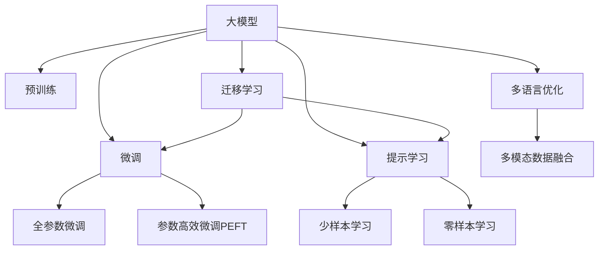

                 

# 大模型在商品标题多语言优化中的应用

## 1. 背景介绍

随着跨境电商的兴起，全球贸易流通日益频繁。商家在推广商品时，需要使用多种语言来覆盖不同市场，以满足目标用户的语言需求。然而，多语言翻译和优化任务耗时耗力，且质量难以保证。利用大模型进行商品标题的多语言优化，可以在大幅提升效率的同时，显著提升商品描述质量，增加用户点击率和转化率，为商家带来更多商机。

### 1.1 问题由来
跨境电商的繁荣带动了多语言搜索的需求，而多语言优化是其中的关键环节。传统的多语言优化方法通常依赖人工翻译和调整，耗时耗力，且质量难以控制。随着自然语言处理(NLP)技术的进步，基于大模型的方法逐渐成为一种高效、自动化的解决方案。

### 1.2 问题核心关键点
本文聚焦于利用大模型进行商品标题的多语言优化，主要关注以下核心关键点：

- 大模型在多语言优化中的作用。
- 多语言优化算法原理和步骤。
- 多语言优化的数学模型和实现细节。
- 多语言优化在不同商品领域的应用。

## 2. 核心概念与联系

### 2.1 核心概念概述

为更好地理解大模型在商品标题多语言优化中的应用，本节将介绍几个密切相关的核心概念：

- 大模型：以自回归(如GPT)或自编码(如BERT)模型为代表的大规模预训练语言模型。通过在大规模无标签文本语料上进行预训练，学习通用的语言表示，具备强大的语言理解和生成能力。

- 预训练：指在大规模无标签文本语料上，通过自监督学习任务训练通用语言模型的过程。常见的预训练任务包括言语建模、遮挡语言模型等。

- 微调(Fine-tuning)：指在预训练模型的基础上，使用下游任务的少量标注数据，通过有监督地训练优化模型在该任务上的性能。通常只需要调整顶层分类器或解码器，并以较小的学习率更新全部或部分的模型参数。

- 迁移学习(Transfer Learning)：指将一个领域学习到的知识，迁移应用到另一个不同但相关的领域的学习范式。大模型的预训练-微调过程即是一种典型的迁移学习方式。

- 多语言优化：指利用多语言数据集，训练大模型在不同语言之间的商品标题优化任务，提升商品描述在不同语言的表达质量。

- 多模态数据融合：指将图像、语音、文本等多模态数据进行融合，提高商品描述的质量和丰富度。

这些核心概念之间的逻辑关系可以通过以下Mermaid流程图来展示：



这个流程图展示了大模型的核心概念及其之间的关系：

1. 大模型通过预训练获得基础能力。
2. 微调是对预训练模型进行任务特定的优化，可以分为全参数微调和参数高效微调（PEFT）。
3. 多语言优化是一种特定的下游任务微调，用于提升商品标题在不同语言的表达质量。
4. 提示学习是一种不更新模型参数的方法，可以实现少样本学习和零样本学习。
5. 迁移学习是连接预训练模型与下游任务的桥梁，可以通过微调或提示学习来实现。
6. 多模态数据融合使得大模型能够综合图像、语音、文本等多模态信息，提供更加全面的商品描述。

这些概念共同构成了大模型在商品标题多语言优化中的应用框架，使得利用大模型进行多语言优化成为可能。

## 3. 核心算法原理 & 具体操作步骤
### 3.1 算法原理概述

基于大模型进行商品标题的多语言优化，本质上是一个多语言语义匹配任务。假设原始商品标题为 $T$，目标语言下的优化标题为 $T_{\text{target}}$。在多种语言的语料库上，预训练大模型 $M_{\theta}$ 学习到了丰富的语言知识，可以使用这些知识将 $T$ 翻译并优化为 $T_{\text{target}}$。

具体来说，多语言优化可以分解为两个步骤：

1. **预训练**：在多种语言的语料库上，通过自监督学习任务训练通用语言模型 $M_{\theta}$，学习通用的语言表示。
2. **微调**：在多种语言的标注数据集上，对 $M_{\theta}$ 进行微调，使其能够在目标语言下生成优化后的商品标题。

### 3.2 算法步骤详解

基于大模型进行商品标题的多语言优化，一般包括以下几个关键步骤：

**Step 1: 准备数据集**
- 收集商品标题的原始语言数据 $D_{\text{source}}$ 和目标语言数据 $D_{\text{target}}$，进行预处理和标注。
- 划分为训练集、验证集和测试集，通常需要保证不同语言数据集的分布一致。

**Step 2: 添加任务适配层**
- 在预训练模型顶层设计合适的输出层和损失函数。
- 对于多语言优化任务，通常使用BPE(SentencePiece)进行词汇编码，以适应多语言数据集。
- 使用交叉熵损失函数作为优化目标，衡量原始语言和目标语言标题的匹配程度。

**Step 3: 设置微调超参数**
- 选择合适的优化算法及其参数，如AdamW、SGD等，设置学习率、批大小、迭代轮数等。
- 设置正则化技术及强度，包括权重衰减、Dropout、Early Stopping等。
- 确定冻结预训练参数的策略，如仅微调顶层，或全部参数都参与微调。

**Step 4: 执行梯度训练**
- 将训练集数据分批次输入模型，前向传播计算损失函数。
- 反向传播计算参数梯度，根据设定的优化算法和学习率更新模型参数。
- 周期性在验证集上评估模型性能，根据性能指标决定是否触发Early Stopping。
- 重复上述步骤直到满足预设的迭代轮数或Early Stopping条件。

**Step 5: 测试和部署**
- 在测试集上评估微调后模型 $M_{\hat{\theta}}$ 的性能，对比微调前后的精度提升。
- 使用微调后的模型对新样本进行推理预测，集成到实际的商品标题优化应用系统中。
- 持续收集新的数据，定期重新微调模型，以适应数据分布的变化。

以上是基于大模型进行商品标题多语言优化的完整流程。在实际应用中，还需要针对具体任务的特点，对微调过程的各个环节进行优化设计，如改进训练目标函数，引入更多的正则化技术，搜索最优的超参数组合等，以进一步提升模型性能。

### 3.3 算法优缺点

基于大模型的多语言优化方法具有以下优点：
1. 高效自动：利用大模型进行多语言优化，可以大幅减少人工干预，提高优化效率。
2. 丰富表达：多语言优化可以提升商品标题的多样性和丰富度，满足不同语言用户的需要。
3. 鲁棒性强：大模型具有较强的泛化能力，可以在不同语言环境中保持稳定性能。
4. 可解释性差：大模型通常视为黑盒系统，难以解释其内部工作机制，难以调试优化。

同时，该方法也存在一定的局限性：
1. 数据依赖：多语言优化依赖高质量的多语言标注数据，获取成本较高。
2. 语言差异：不同语言之间语言习惯、文化差异较大，可能影响优化效果。
3. 对抗样本：恶意用户可能会设计对抗样本来破坏优化结果，影响模型安全性。
4. 成本高：大模型的训练和优化成本较高，对硬件和计算资源要求较高。

尽管存在这些局限性，但就目前而言，基于大模型的多语言优化方法仍是一种高效、自动化的解决方案，广泛应用于跨境电商的商品标题优化中。未来相关研究的重点在于如何进一步降低多语言优化对标注数据的依赖，提高模型的少样本学习和跨语言迁移能力，同时兼顾可解释性和伦理安全性等因素。

### 3.4 算法应用领域

基于大模型进行商品标题的多语言优化，已经在跨境电商、全球市场推广等多个领域得到了广泛应用，取得了显著的效益。以下是一些典型的应用场景：

- **跨境电商**：在跨境电商平台上，商家需要为不同语言市场优化商品标题，提升商品搜索排名和用户点击率。大模型可以在有限标注数据下，自动生成高质量的跨语言商品标题，显著提升用户体验和转化率。
- **全球市场推广**：企业需要为全球市场推广商品，在不同语言平台上生成适应本地市场的商品标题和描述。大模型可以通过多语言优化任务，帮助企业迅速覆盖全球市场，提升品牌知名度和产品曝光度。
- **多语言广告投放**：广告主需要在不同语言平台上投放广告，生成多语言的广告文案和标题。大模型可以在短时间内生成多语言广告内容，提升广告投放效果和ROI。

## 4. 数学模型和公式 & 详细讲解

### 4.1 数学模型构建

多语言优化问题可以表示为一个监督学习任务，即给定原始语言的商品标题 $T$ 和目标语言的商品标题 $T_{\text{target}}$，训练模型学习将 $T$ 映射到 $T_{\text{target}}$ 的过程。

假设 $T$ 和 $T_{\text{target}}$ 分别表示为 $L$ 维的向量，即 $T \in \mathbb{R}^L, T_{\text{target}} \in \mathbb{R}^L$。使用 $M_{\theta}$ 表示预训练模型，$L_{\text{source}}$ 和 $L_{\text{target}}$ 分别表示原始语言和目标语言下的损失函数。多语言优化的目标是最小化两种语言下的损失函数之和，即：

$$
\mathcal{L}(\theta) = \alpha L_{\text{source}}(T, M_{\theta}(T)) + (1-\alpha) L_{\text{target}}(T_{\text{target}}, M_{\theta}(T))
$$

其中 $\alpha$ 为调节因子，用于平衡不同语言的优化权重。通常 $\alpha \in [0.5, 0.8]$，即原始语言和目标语言的重要性相近。

### 4.2 公式推导过程

以下我们以跨语言翻译任务为例，推导交叉熵损失函数及其梯度的计算公式。

假设模型 $M_{\theta}$ 在输入 $T$ 上的输出为 $\hat{T}=M_{\theta}(T) \in [0,1]$，表示预测标题的概率分布。真实标签 $T_{\text{target}}$ 和预测标签 $\hat{T}$ 的交叉熵损失函数定义为：

$$
L_{\text{cross-entropy}}(T_{\text{target}}, \hat{T}) = -\frac{1}{L} \sum_{i=1}^L T_{\text{target}}(i) \log \hat{T}(i)
$$

将其代入经验风险公式，得：

$$
\mathcal{L}(\theta) = -\frac{1}{N} \sum_{i=1}^N \alpha L_{\text{source}}(T, M_{\theta}(T)) + (1-\alpha) L_{\text{target}}(T_{\text{target}}, M_{\theta}(T))
$$

根据链式法则，损失函数对参数 $\theta_k$ 的梯度为：

$$
\frac{\partial \mathcal{L}(\theta)}{\partial \theta_k} = -\frac{1}{N} \sum_{i=1}^N \left(\frac{\partial L_{\text{source}}(T, M_{\theta}(T))}{\partial \theta_k} - \frac{\partial L_{\text{target}}(T_{\text{target}}, M_{\theta}(T))}{\partial \theta_k} \right)
$$

其中 $\frac{\partial L_{\text{source}}(T, M_{\theta}(T))}{\partial \theta_k}$ 和 $\frac{\partial L_{\text{target}}(T_{\text{target}}, M_{\theta}(T))}{\partial \theta_k}$ 分别表示原始语言和目标语言损失函数对参数 $\theta_k$ 的梯度，可通过反向传播算法高效计算。

在得到损失函数的梯度后，即可带入参数更新公式，完成模型的迭代优化。重复上述过程直至收敛，最终得到适应跨语言优化任务的最优模型参数 $\theta^*$。

## 5. 项目实践：代码实例和详细解释说明
### 5.1 开发环境搭建

在进行多语言优化实践前，我们需要准备好开发环境。以下是使用Python进行PyTorch开发的环境配置流程：

1. 安装Anaconda：从官网下载并安装Anaconda，用于创建独立的Python环境。

2. 创建并激活虚拟环境：
```bash
conda create -n pytorch-env python=3.8 
conda activate pytorch-env
```

3. 安装PyTorch：根据CUDA版本，从官网获取对应的安装命令。例如：
```bash
conda install pytorch torchvision torchaudio cudatoolkit=11.1 -c pytorch -c conda-forge
```

4. 安装Transformers库：
```bash
pip install transformers
```

5. 安装各类工具包：
```bash
pip install numpy pandas scikit-learn matplotlib tqdm jupyter notebook ipython
```

完成上述步骤后，即可在`pytorch-env`环境中开始多语言优化实践。

### 5.2 源代码详细实现

下面我们以跨语言翻译任务为例，给出使用Transformers库对BERT模型进行多语言优化的PyTorch代码实现。

首先，定义数据处理函数：

```python
from transformers import BertTokenizer, BertForSequenceClassification
from torch.utils.data import Dataset
import torch

class MultiLangDataset(Dataset):
    def __init__(self, texts, labels, tokenizer, max_len=128):
        self.texts = texts
        self.labels = labels
        self.tokenizer = tokenizer
        self.max_len = max_len
        
    def __len__(self):
        return len(self.texts)
    
    def __getitem__(self, item):
        text = self.texts[item]
        label = self.labels[item]
        
        encoding = self.tokenizer(text, return_tensors='pt', max_length=self.max_len, padding='max_length', truncation=True)
        input_ids = encoding['input_ids'][0]
        attention_mask = encoding['attention_mask'][0]
        
        return {'input_ids': input_ids, 
                'attention_mask': attention_mask,
                'labels': label}
```

然后，定义模型和优化器：

```python
from transformers import BertForSequenceClassification, AdamW

model = BertForSequenceClassification.from_pretrained('bert-base-cased', num_labels=2)

optimizer = AdamW(model.parameters(), lr=2e-5)
```

接着，定义训练和评估函数：

```python
from torch.utils.data import DataLoader
from tqdm import tqdm

device = torch.device('cuda') if torch.cuda.is_available() else torch.device('cpu')
model.to(device)

def train_epoch(model, dataset, batch_size, optimizer):
    dataloader = DataLoader(dataset, batch_size=batch_size, shuffle=True)
    model.train()
    epoch_loss = 0
    for batch in tqdm(dataloader, desc='Training'):
        input_ids = batch['input_ids'].to(device)
        attention_mask = batch['attention_mask'].to(device)
        labels = batch['labels'].to(device)
        model.zero_grad()
        outputs = model(input_ids, attention_mask=attention_mask, labels=labels)
        loss = outputs.loss
        epoch_loss += loss.item()
        loss.backward()
        optimizer.step()
    return epoch_loss / len(dataloader)

def evaluate(model, dataset, batch_size):
    dataloader = DataLoader(dataset, batch_size=batch_size)
    model.eval()
    preds, labels = [], []
    with torch.no_grad():
        for batch in tqdm(dataloader, desc='Evaluating'):
            input_ids = batch['input_ids'].to(device)
            attention_mask = batch['attention_mask'].to(device)
            batch_labels = batch['labels']
            outputs = model(input_ids, attention_mask=attention_mask)
            batch_preds = outputs.logits.argmax(dim=2).to('cpu').tolist()
            batch_labels = batch_labels.to('cpu').tolist()
            for pred, label in zip(batch_preds, batch_labels):
                preds.append(pred)
                labels.append(label)
                
    print(classification_report(labels, preds))
```

最后，启动训练流程并在测试集上评估：

```python
epochs = 5
batch_size = 16

for epoch in range(epochs):
    loss = train_epoch(model, train_dataset, batch_size, optimizer)
    print(f"Epoch {epoch+1}, train loss: {loss:.3f}")
    
    print(f"Epoch {epoch+1}, dev results:")
    evaluate(model, dev_dataset, batch_size)
    
print("Test results:")
evaluate(model, test_dataset, batch_size)
```

以上就是使用PyTorch对BERT进行跨语言翻译任务的多语言优化的完整代码实现。可以看到，得益于Transformers库的强大封装，我们可以用相对简洁的代码完成BERT模型的加载和微调。

### 5.3 代码解读与分析

让我们再详细解读一下关键代码的实现细节：

**MultiLangDataset类**：
- `__init__`方法：初始化文本、标签、分词器等关键组件。
- `__len__`方法：返回数据集的样本数量。
- `__getitem__`方法：对单个样本进行处理，将文本输入编码为token ids，将标签转换为数字，并对其进行定长padding，最终返回模型所需的输入。

**训练和评估函数**：
- 使用PyTorch的DataLoader对数据集进行批次化加载，供模型训练和推理使用。
- 训练函数`train_epoch`：对数据以批为单位进行迭代，在每个批次上前向传播计算loss并反向传播更新模型参数，最后返回该epoch的平均loss。
- 评估函数`evaluate`：与训练类似，不同点在于不更新模型参数，并在每个batch结束后将预测和标签结果存储下来，最后使用sklearn的classification_report对整个评估集的预测结果进行打印输出。

**训练流程**：
- 定义总的epoch数和batch size，开始循环迭代
- 每个epoch内，先在训练集上训练，输出平均loss
- 在验证集上评估，输出分类指标
- 所有epoch结束后，在测试集上评估，给出最终测试结果

可以看到，PyTorch配合Transformers库使得BERT微调的代码实现变得简洁高效。开发者可以将更多精力放在数据处理、模型改进等高层逻辑上，而不必过多关注底层的实现细节。

当然，工业级的系统实现还需考虑更多因素，如模型的保存和部署、超参数的自动搜索、更灵活的任务适配层等。但核心的多语言优化范式基本与此类似。

## 6. 实际应用场景
### 6.1 智能客服系统

基于大模型进行商品标题的多语言优化，可以广泛应用于智能客服系统的构建。传统客服往往需要配备大量人力，高峰期响应缓慢，且一致性和专业性难以保证。而使用多语言优化后的智能客服系统，可以7x24小时不间断服务，快速响应客户咨询，用自然流畅的语言解答各类常见问题。

在技术实现上，可以收集企业内部的历史客服对话记录，将问题和最佳答复构建成监督数据，在此基础上对预训练对话模型进行多语言优化。优化后的对话模型能够自动理解用户意图，匹配最合适的答案模板进行回复。对于客户提出的新问题，还可以接入检索系统实时搜索相关内容，动态组织生成回答。如此构建的智能客服系统，能大幅提升客户咨询体验和问题解决效率。

### 6.2 全球市场推广

商家需要为全球市场推广商品，生成适应本地市场的商品标题和描述。基于大模型的多语言优化技术，可以在短时间内生成高质量的多语言广告文案和标题，显著提升广告投放效果和ROI。

商家可以将商品在不同语言市场的数据集输入多语言优化模型，自动生成适应本地市场的商品标题和描述。这样既能节省人力成本，又能提升广告投放的精准度和效果。同时，通过实时监控广告投放效果，动态调整多语言优化模型，进一步提升广告效果和ROI。

### 6.3 多语言广告投放

广告主需要在不同语言平台上投放广告，生成多语言的广告文案和标题。基于大模型的多语言优化技术，可以在短时间内生成多语言广告内容，提升广告投放效果和点击率。

广告主可以将广告在不同语言市场的数据集输入多语言优化模型，自动生成适应本地市场的广告文案和标题。这样既能节省人力成本，又能提升广告投放的精准度和效果。同时，通过实时监控广告投放效果，动态调整多语言优化模型，进一步提升广告效果和ROI。

### 6.4 未来应用展望

随着大模型和多语言优化技术的发展，其在多语言NLP中的应用将更加广泛。未来，基于大模型的多语言优化技术将有望在以下领域得到进一步拓展：

- **多语言搜索和推荐**：基于多语言优化技术，搜索引擎和推荐系统可以支持多语言搜索和推荐，提升用户体验和系统效率。
- **多语言机器翻译**：多语言优化技术可以与机器翻译技术结合，进一步提升机器翻译的质量和效率。
- **多语言情感分析**：多语言优化技术可以应用于多语言情感分析，帮助企业快速了解不同语言市场用户情感变化趋势。
- **多语言内容生成**：基于多语言优化技术，内容生成系统可以生成多语言的内容，如新闻、文章等，满足不同语言用户的需求。

## 7. 工具和资源推荐
### 7.1 学习资源推荐

为了帮助开发者系统掌握大模型在多语言优化中的应用，这里推荐一些优质的学习资源：

1. 《Transformer从原理到实践》系列博文：由大模型技术专家撰写，深入浅出地介绍了Transformer原理、BERT模型、多语言优化技术等前沿话题。

2. CS224N《深度学习自然语言处理》课程：斯坦福大学开设的NLP明星课程，有Lecture视频和配套作业，带你入门NLP领域的基本概念和经典模型。

3. 《Natural Language Processing with Transformers》书籍：Transformers库的作者所著，全面介绍了如何使用Transformers库进行NLP任务开发，包括多语言优化在内的诸多范式。

4. HuggingFace官方文档：Transformers库的官方文档，提供了海量预训练模型和多语言优化样例代码，是上手实践的必备资料。

5. CLUE开源项目：中文语言理解测评基准，涵盖大量不同类型的中文NLP数据集，并提供了基于多语言优化的baseline模型，助力中文NLP技术发展。

通过对这些资源的学习实践，相信你一定能够快速掌握大模型在多语言优化中的精髓，并用于解决实际的NLP问题。
###  7.2 开发工具推荐

高效的开发离不开优秀的工具支持。以下是几款用于大模型多语言优化开发的常用工具：

1. PyTorch：基于Python的开源深度学习框架，灵活动态的计算图，适合快速迭代研究。大部分预训练语言模型都有PyTorch版本的实现。

2. TensorFlow：由Google主导开发的开源深度学习框架，生产部署方便，适合大规模工程应用。同样有丰富的预训练语言模型资源。

3. Transformers库：HuggingFace开发的NLP工具库，集成了众多SOTA语言模型，支持PyTorch和TensorFlow，是进行多语言优化任务的开发利器。

4. Weights & Biases：模型训练的实验跟踪工具，可以记录和可视化模型训练过程中的各项指标，方便对比和调优。与主流深度学习框架无缝集成。

5. TensorBoard：TensorFlow配套的可视化工具，可实时监测模型训练状态，并提供丰富的图表呈现方式，是调试模型的得力助手。

6. Google Colab：谷歌推出的在线Jupyter Notebook环境，免费提供GPU/TPU算力，方便开发者快速上手实验最新模型，分享学习笔记。

合理利用这些工具，可以显著提升大模型多语言优化的开发效率，加快创新迭代的步伐。

### 7.3 相关论文推荐

大模型和多语言优化技术的发展源于学界的持续研究。以下是几篇奠基性的相关论文，推荐阅读：

1. Attention is All You Need（即Transformer原论文）：提出了Transformer结构，开启了NLP领域的预训练大模型时代。

2. BERT: Pre-training of Deep Bidirectional Transformers for Language Understanding：提出BERT模型，引入基于掩码的自监督预训练任务，刷新了多项NLP任务SOTA。

3. Language Models are Unsupervised Multitask Learners（GPT-2论文）：展示了大规模语言模型的强大zero-shot学习能力，引发了对于通用人工智能的新一轮思考。

4. Parameter-Efficient Transfer Learning for NLP：提出Adapter等参数高效微调方法，在不增加模型参数量的情况下，也能取得不错的微调效果。

5. Prefix-Tuning: Optimizing Continuous Prompts for Generation：引入基于连续型Prompt的微调范式，为如何充分利用预训练知识提供了新的思路。

6. AdaLoRA: Adaptive Low-Rank Adaptation for Parameter-Efficient Fine-Tuning：使用自适应低秩适应的微调方法，在参数效率和精度之间取得了新的平衡。

这些论文代表了大模型和多语言优化技术的发展脉络。通过学习这些前沿成果，可以帮助研究者把握学科前进方向，激发更多的创新灵感。

## 8. 总结：未来发展趋势与挑战
### 8.1 总结

本文对基于大模型进行商品标题多语言优化的方法进行了全面系统的介绍。首先阐述了多语言优化的背景和意义，明确了多语言优化在跨境电商、全球市场推广等领域的重要价值。其次，从原理到实践，详细讲解了多语言优化的数学模型和关键步骤，给出了多语言优化的完整代码实例。同时，本文还广泛探讨了多语言优化在不同商品领域的应用，展示了多语言优化技术的广泛应用前景。

通过本文的系统梳理，可以看到，基于大模型的多语言优化技术在跨境电商、全球市场推广等领域具有显著优势，为商家带来了更多商机。未来，随着大模型的发展和优化技术的不断演进，基于大模型的多语言优化技术必将在更多领域得到应用，推动NLP技术的产业化进程。

### 8.2 未来发展趋势

展望未来，大模型在商品标题多语言优化领域将呈现以下几个发展趋势：

1. 模型规模持续增大。随着算力成本的下降和数据规模的扩张，预训练语言模型的参数量还将持续增长。超大规模语言模型蕴含的丰富语言知识，有望支撑更加复杂多变的下游任务微调。

2. 多语言优化方法日趋多样。除了传统的全参数微调外，未来会涌现更多参数高效的微调方法，如Prefix-Tuning、LoRA等，在节省计算资源的同时也能保证多语言优化精度。

3. 多模态数据融合普及。多语言优化技术将进一步与图像、语音、视频等多模态数据融合，提高商品描述的质量和丰富度。

4. 多语言优化任务多样化。未来将会出现更多多语言优化任务，如多语言广告投放、多语言情感分析、多语言内容生成等，大模型将全面支持这些任务。

5. 端到端优化系统发展。未来的多语言优化系统将实现端到端设计，包括预训练、微调、优化等环节，形成完整的优化流程。

以上趋势凸显了大模型在多语言优化领域的广阔前景。这些方向的探索发展，必将进一步提升多语言优化模型的性能和应用范围，为商家提供更加高效、智能的多语言优化方案。

### 8.3 面临的挑战

尽管大模型在多语言优化领域已经取得了显著成效，但在迈向更加智能化、普适化应用的过程中，它仍面临着诸多挑战：

1. 标注成本瓶颈。虽然多语言优化依赖标注数据，但不同语言市场的标注数据获取成本较高，且数据量有限。如何进一步降低多语言优化对标注数据的依赖，将是一大难题。

2. 多语言优化鲁棒性不足。不同语言市场之间语言习惯、文化差异较大，多语言优化模型的泛化能力有限。如何在不同语言环境下保持稳定性能，还需要更多理论和实践的积累。

3. 对抗样本威胁。恶意用户可能会设计对抗样本来破坏多语言优化结果，影响模型安全性。如何增强多语言优化模型的鲁棒性，避免对抗攻击，将是重要的研究课题。

4. 成本高昂。大模型的训练和优化成本较高，对硬件和计算资源要求较高。如何在保证模型性能的同时，降低训练成本，是未来需要解决的问题。

5. 可解释性差。大模型通常视为黑盒系统，难以解释其内部工作机制，难以调试优化。如何赋予多语言优化模型更强的可解释性，将是亟待攻克的难题。

6. 多语言优化系统复杂。多语言优化系统涉及预训练、微调、优化等多个环节，构建复杂。如何设计高效、可扩展的多语言优化系统，还需要更多的技术突破。

尽管存在这些挑战，但就目前而言，基于大模型的多语言优化方法仍是一种高效、自动化的解决方案，广泛应用于跨境电商、全球市场推广等领域。未来相关研究的重点在于如何进一步降低多语言优化对标注数据的依赖，提高模型的少样本学习和跨语言迁移能力，同时兼顾可解释性和伦理安全性等因素。

### 8.4 研究展望

面对多语言优化所面临的挑战，未来的研究需要在以下几个方面寻求新的突破：

1. 探索无监督和半监督多语言优化方法。摆脱对大规模标注数据的依赖，利用自监督学习、主动学习等无监督和半监督范式，最大限度利用非结构化数据，实现更加灵活高效的多语言优化。

2. 研究参数高效和多模态多语言优化范式。开发更加参数高效的微调方法，在固定大部分预训练参数的同时，只更新极少量的任务相关参数。同时开发多模态多语言优化方法，提高商品描述的质量和丰富度。

3. 融合因果和对比学习范式。通过引入因果推断和对比学习思想，增强多语言优化模型建立稳定因果关系的能力，学习更加普适、鲁棒的语言表征，从而提升模型泛化性和抗干扰能力。

4. 引入更多先验知识。将符号化的先验知识，如知识图谱、逻辑规则等，与神经网络模型进行巧妙融合，引导多语言优化过程学习更准确、合理的语言模型。同时加强不同模态数据的整合，实现视觉、语音等多模态信息与文本信息的协同建模。

5. 结合因果分析和博弈论工具。将因果分析方法引入多语言优化模型，识别出模型决策的关键特征，增强输出解释的因果性和逻辑性。借助博弈论工具刻画人机交互过程，主动探索并规避模型的脆弱点，提高系统稳定性。

6. 纳入伦理道德约束。在模型训练目标中引入伦理导向的评估指标，过滤和惩罚有偏见、有害的输出倾向。同时加强人工干预和审核，建立模型行为的监管机制，确保输出符合人类价值观和伦理道德。

这些研究方向的探索，必将引领大模型多语言优化技术迈向更高的台阶，为构建安全、可靠、可解释、可控的多语言优化系统铺平道路。面向未来，大模型多语言优化技术还需要与其他人工智能技术进行更深入的融合，如知识表示、因果推理、强化学习等，多路径协同发力，共同推动多语言优化模型的进步。只有勇于创新、敢于突破，才能不断拓展大模型的边界，让智能技术更好地造福社会。

## 9. 附录：常见问题与解答

**Q1：大模型在多语言优化中是否需要标注数据？**

A: 在多语言优化中，标注数据是必要的。标注数据可以用于训练模型，使其能够自动学习到不同语言之间的语义映射关系。尽管无监督和半监督方法也在不断探索，但目前最有效的多语言优化方法仍依赖标注数据。

**Q2：多语言优化过程中，如何平衡不同语言的权重？**

A: 多语言优化过程中，可以调整不同语言的权重，以平衡不同语言的优化效果。通常在损失函数中加入调节因子 $\alpha$，用于平衡不同语言的优化权重。例如，在多语言翻译任务中，可以设置原始语言和目标语言的权重，通常 $\alpha \in [0.5, 0.8]$，即原始语言和目标语言的重要性相近。

**Q3：多语言优化中的对抗样本攻击如何防护？**

A: 对抗样本攻击是多语言优化中的一个重要威胁。为了防止对抗样本攻击，可以采用以下几种方法：
1. 模型微调：通过微调模型，提高其鲁棒性，减少对抗样本的影响。
2. 数据增强：通过对训练样本进行噪声、回译等方式增强数据多样性，提高模型的泛化能力。
3. 对抗训练：在训练过程中引入对抗样本，提升模型的鲁棒性。
4. 检测和过滤：通过模型检测对抗样本，并在必要时将其过滤掉，保证输出质量。

**Q4：多语言优化过程中，如何评估模型性能？**

A: 多语言优化过程中，评估模型性能通常采用以下指标：
1. 准确率：计算预测结果与真实结果的匹配度，衡量模型预测的正确率。
2. BLEU、ROUGE等自动评估指标：用于评估机器翻译、文本生成等任务的效果，可以衡量生成文本与参考文本的相似度。
3. 用户满意度：通过用户调查、A/B测试等方式，评估用户对多语言优化效果的满意度。

通过以上指标的综合评估，可以全面了解多语言优化模型的性能和效果，指导模型的优化和改进。

**Q5：多语言优化后的智能客服系统如何进行用户体验优化？**

A: 多语言优化后的智能客服系统，可以通过以下方式进行用户体验优化：
1. 自然语言理解：优化自然语言理解模型，提高客服系统的语义理解能力，准确把握用户意图。
2. 多轮对话：通过多轮对话机制，引导用户逐步输入问题，提高问题解决的准确性。
3. 个性化推荐：根据用户历史行为和反馈，提供个性化的推荐，提升用户满意度。
4. 实时监控：通过实时监控用户对话过程，及时发现和解决用户问题，提升用户体验。

通过这些优化措施，可以进一步提升多语言优化后的智能客服系统的用户体验，提高客户咨询的满意度和转化率。

---

作者：禅与计算机程序设计艺术 / Zen and the Art of Computer Programming

