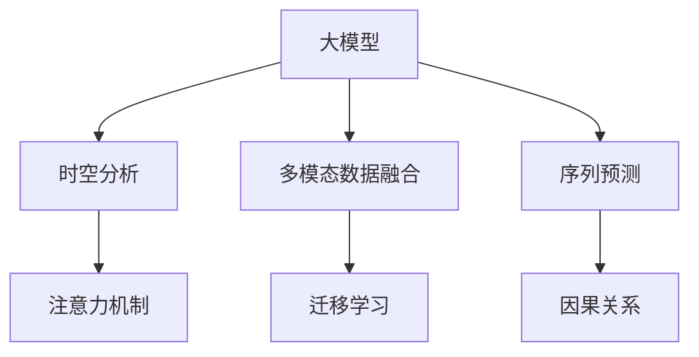

                 

# 大模型在商品销量预测中的时空分析应用

## 1. 背景介绍

### 1.1 问题由来
在电子商务和零售行业中，商品销量的预测是企业制定销售策略、优化库存管理、提升供应链效率的关键任务。传统的预测方法往往依赖于时间序列模型，但随着商品种类繁多、市场需求多变，时间序列模型在面对海量数据时，难以捕捉到商品销量的空间和时间特征。因此，研究如何在大模型基础上，充分利用商品的历史销售数据、用户行为数据、产品特征数据等时空信息，进行精确的销量预测，具有重要的理论和实际意义。

### 1.2 问题核心关键点
基于大模型的商品销量预测主要关注以下几个核心关键点：

1. **时空特征融合**：如何在大模型中，同时考虑商品销量的时空分布特征，更好地理解数据的复杂性。
2. **多模态数据融合**：如何融合多种数据源（如销售记录、用户行为、产品属性等），利用多模态信息提升预测准确度。
3. **模型泛化能力**：如何构建模型以适应不同的销售场景和商品类别，保证预测模型在不同情况下的稳定性和可靠性。
4. **实时预测能力**：如何在保证预测精度的同时，提升预测的实时性，满足实时业务需求。
5. **模型可解释性**：如何构建具有良好可解释性的模型，方便业务人员理解预测结果的逻辑依据。

### 1.3 问题研究意义
研究大模型在商品销量预测中的应用，具有以下重要意义：

1. **提升预测准确性**：利用大模型学习海量数据中的复杂时空特征，能够显著提升销量预测的准确度，帮助企业更准确地制定销售策略。
2. **优化库存管理**：通过精准的销量预测，企业可以更合理地安排库存，减少库存积压和缺货情况，降低运营成本。
3. **提高供应链效率**：准确的预测可以优化物流和配送策略，减少物流成本，提升供应链响应速度。
4. **增强用户体验**：及时准确的商品销量预测有助于提升用户购物体验，通过推荐系统提供个性化服务。
5. **推动智能零售**：大模型在商品销量预测中的应用，将推动零售行业向智能化、精准化方向发展，实现从传统经验决策向数据驱动决策的转变。

## 2. 核心概念与联系

### 2.1 核心概念概述

为更好地理解大模型在商品销量预测中的应用，本节将介绍几个密切相关的核心概念：

- **大模型(Large Model)**：如BERT、GPT等预训练语言模型。通过在大规模数据上进行自监督学习，学习到丰富的语言表示，可以应用于多种自然语言处理任务。
- **时空分析**：在时间序列数据中，结合空间分布信息进行综合分析，以更全面地理解数据特征。
- **多模态数据融合**：结合文本、图像、音频等多种数据源，综合多种信息提升模型预测能力。
- **序列预测**：利用时间序列数据进行预测，如股票价格预测、天气预测等。
- **注意力机制(Attention Mechanism)**：在大模型中，通过计算注意力权重，动态聚焦于关键特征，提升模型性能。
- **因果关系(Causality)**：在预测过程中，考虑输入数据对输出结果的因果影响，确保预测结果的合理性。
- **迁移学习(Transfer Learning)**：在大模型基础上，通过微调等方法，应用到新的预测任务中，提升模型的泛化能力。

这些核心概念之间的逻辑关系可以通过以下Mermaid流程图来展示：



这个流程图展示了大模型在商品销量预测中的应用框架，核心概念间的相互联系和作用机制。

## 3. 核心算法原理 & 具体操作步骤

### 3.1 算法原理概述

基于大模型的商品销量预测，本质上是一个序列预测问题，结合了时空分析和多模态数据融合的复杂特征。其核心思想是：利用大模型学习时空特征，融合多模态信息，通过序列预测方法，对商品销量进行预测。

形式化地，假设大模型为 $M_{\theta}:\mathcal{X} \rightarrow \mathcal{Y}$，其中 $\mathcal{X}$ 为输入特征空间，$\mathcal{Y}$ 为输出空间，$\theta$ 为模型参数。给定商品销量预测任务 $T$ 的历史数据集 $D=\{(x_i,y_i)\}_{i=1}^N$，预测目标为对未来某个时间点的销量 $y_{t+1}$ 进行预测。

预测模型可定义为：
$$
y_{t+1} = M_{\theta}(x_t)
$$

其中 $x_t$ 为时间点 $t$ 的输入特征，包含历史销量、用户行为、产品属性等多模态数据。预测模型的训练目标为最小化预测误差：
$$
\min_{\theta} \sum_{i=1}^N \ell(y_i, M_{\theta}(x_i))
$$

其中 $\ell$ 为损失函数，如均方误差损失、交叉熵损失等。

### 3.2 算法步骤详解

基于大模型的商品销量预测，一般包括以下几个关键步骤：

**Step 1: 准备数据集**

- 收集商品的历史销量数据，标注其对应的预测时间点。
- 收集商品的用户行为数据，如浏览、点击、购买行为等。
- 收集商品的产品属性数据，如价格、颜色、品牌等。
- 将数据进行预处理，如归一化、缺失值处理、特征工程等。

**Step 2: 构建输入特征**

- 将历史销量数据、用户行为数据、产品属性数据等，合并为输入特征 $x_t$。
- 设计合适的特征表示方式，如将文本数据转化为词向量，将图像数据转化为图像特征向量等。
- 对输入特征进行编码，如将文本数据编码为序列向量，将图像数据编码为卷积特征图等。

**Step 3: 选择预测模型**

- 选择合适的大模型作为预测模型，如BERT、GPT等。
- 在大模型顶部设计适当的输出层，如线性回归、Softmax回归等。
- 选择适合的损失函数，如均方误差损失、交叉熵损失等。

**Step 4: 训练模型**

- 将数据集划分为训练集、验证集和测试集。
- 使用优化算法（如AdamW、SGD等），设置适当的学习率、批大小等超参数。
- 使用训练集数据，最小化损失函数，更新模型参数。
- 在验证集上评估模型性能，根据评估结果调整超参数。
- 在测试集上最终评估模型性能，输出预测结果。

**Step 5: 实时预测**

- 在实时预测过程中，输入最新的商品信息，进行模型前向传播。
- 根据预测结果，生成销售预测报告，提供业务决策支持。

### 3.3 算法优缺点

基于大模型的商品销量预测方法具有以下优点：

1. **高效性**：利用大模型的高表示能力，可以处理大规模数据集，提升预测速度。
2. **准确性**：大模型通过学习复杂的时空特征和多模态信息，能够获得更精确的预测结果。
3. **泛化能力强**：通过迁移学习，大模型能够适应不同商品和销售场景的预测任务。
4. **可解释性强**：利用大模型的中间表示，可以解释预测结果的逻辑依据。

同时，该方法也存在一些缺点：

1. **数据需求高**：需要收集大量历史和实时数据，数据获取成本较高。
2. **模型复杂**：大模型结构复杂，需要高性能计算资源进行训练和推理。
3. **参数量大**：大模型参数量巨大，训练和推理时需要占用大量内存和计算资源。
4. **预测精度有限**：大模型在处理特定领域数据时，可能存在精度下降的问题。

### 3.4 算法应用领域

基于大模型的商品销量预测方法，已在多个领域得到广泛应用，例如：

- **电子商务**：预测商品销量，优化库存管理，提升用户体验。
- **零售连锁**：实时预测销售数据，优化供应链，降低运营成本。
- **智能制造**：预测零部件需求，优化生产计划，提高生产效率。
- **物流配送**：预测商品运输量，优化配送路线，提升配送效率。
- **金融服务**：预测金融产品需求，优化投资策略，提升收益。

这些应用场景展示了基于大模型的商品销量预测方法在实际业务中的广泛适用性。

## 4. 数学模型和公式 & 详细讲解 & 举例说明

### 4.1 数学模型构建

基于大模型的商品销量预测，可以构建如下数学模型：

设商品在时间点 $t$ 的销量为 $y_t$，预测在时间点 $t+1$ 的销量为 $y_{t+1}$。预测模型为 $M_{\theta}(x_t)$，其中 $x_t$ 为时间点 $t$ 的输入特征，包含历史销量、用户行为、产品属性等多模态数据。

假设 $x_t$ 的维度为 $d$，预测模型 $M_{\theta}$ 的输出为 $y_{t+1}$ 的预测值，损失函数为均方误差损失：
$$
L(y_{t+1}, \hat{y}_{t+1}) = \frac{1}{N} \sum_{i=1}^N (y_{i,t+1} - \hat{y}_{i,t+1})^2
$$

其中 $\hat{y}_{i,t+1}$ 为时间点 $t+1$ 的销量预测值。

### 4.2 公式推导过程

假设预测模型 $M_{\theta}$ 为Transformer模型，包含自注意力机制。对于时间点 $t$ 的输入特征 $x_t$，进行前向传播的计算过程如下：

1. 输入特征编码：将输入特征 $x_t$ 进行编码，得到 $x_t^{enc}$。
2. 自注意力计算：通过Transformer的自注意力机制，计算输入特征 $x_t^{enc}$ 的自注意力权重 $\alpha_{t,i}$。
3. 加权求和：将注意力权重 $\alpha_{t,i}$ 与输入特征 $x_t^{enc}$ 进行加权求和，得到最终特征表示 $x_t^{pred}$。
4. 线性预测：将最终特征表示 $x_t^{pred}$ 进行线性预测，得到销量预测值 $\hat{y}_{t+1}$。

具体计算过程如下：

$$
x_t^{enc} = \mathrm{Enc}(x_t)
$$

$$
\alpha_{t,i} = \mathrm{Attn}(x_t^{enc}, x_t^{enc})
$$

$$
x_t^{pred} = \sum_{i=1}^{d} \alpha_{t,i} x_t^{enc,i}
$$

$$
\hat{y}_{t+1} = \mathrm{Pred}(x_t^{pred})
$$

其中 $\mathrm{Enc}$、$\mathrm{Attn}$ 和 $\mathrm{Pred}$ 分别表示编码器、注意力计算和预测层的函数。

### 4.3 案例分析与讲解

假设某电商平台的商品销量预测任务，数据集包含商品的历史销量、用户行为（如浏览、点击、购买次数等）、产品属性（如价格、颜色、品牌等）。我们使用大模型BERT进行销量预测。

**数据准备**：

- 收集商品的历史销量数据，标注其对应的预测时间点。
- 收集商品的用户行为数据，如浏览、点击、购买行为等。
- 收集商品的产品属性数据，如价格、颜色、品牌等。
- 将数据进行预处理，如归一化、缺失值处理、特征工程等。

**模型构建**：

- 使用BERT模型作为预测模型，在大模型顶部设计适当的输出层，如线性回归层。
- 选择均方误差损失函数作为训练目标。

**训练过程**：

- 将数据集划分为训练集、验证集和测试集。
- 使用优化算法（如AdamW、SGD等），设置适当的学习率、批大小等超参数。
- 使用训练集数据，最小化均方误差损失，更新模型参数。
- 在验证集上评估模型性能，根据评估结果调整超参数。
- 在测试集上最终评估模型性能，输出预测结果。

**实时预测**：

- 在实时预测过程中，输入最新的商品信息，进行模型前向传播。
- 根据预测结果，生成销售预测报告，提供业务决策支持。

## 5. 项目实践：代码实例和详细解释说明

### 5.1 开发环境搭建

在进行商品销量预测项目实践前，我们需要准备好开发环境。以下是使用Python进行PyTorch开发的环境配置流程：

1. 安装Anaconda：从官网下载并安装Anaconda，用于创建独立的Python环境。

2. 创建并激活虚拟环境：
```bash
conda create -n pytorch-env python=3.8 
conda activate pytorch-env
```

3. 安装PyTorch：根据CUDA版本，从官网获取对应的安装命令。例如：
```bash
conda install pytorch torchvision torchaudio cudatoolkit=11.1 -c pytorch -c conda-forge
```

4. 安装Transformer库：
```bash
pip install transformers
```

5. 安装各类工具包：
```bash
pip install numpy pandas scikit-learn matplotlib tqdm jupyter notebook ipython
```

完成上述步骤后，即可在`pytorch-env`环境中开始项目实践。

### 5.2 源代码详细实现

下面我们以电商平台的商品销量预测为例，给出使用PyTorch对BERT模型进行销量预测的代码实现。

首先，定义商品销量预测任务的数据处理函数：

```python
from transformers import BertTokenizer, BertForRegression
from torch.utils.data import Dataset
import torch

class SalesDataset(Dataset):
    def __init__(self, sales_data, labels, tokenizer, max_len=128):
        self.sales_data = sales_data
        self.labels = labels
        self.tokenizer = tokenizer
        self.max_len = max_len
        
    def __len__(self):
        return len(self.sales_data)
    
    def __getitem__(self, item):
        sales_record = self.sales_data[item]
        label = self.labels[item]
        
        # 对文本数据进行编码
        encoding = self.tokenizer(sales_record, return_tensors='pt', max_length=self.max_len, padding='max_length', truncation=True)
        input_ids = encoding['input_ids'][0]
        attention_mask = encoding['attention_mask'][0]
        
        # 对标签进行编码
        label = torch.tensor(label, dtype=torch.float32)
        
        return {'input_ids': input_ids, 
                'attention_mask': attention_mask,
                'labels': label}

# 数据预处理
sales_data = [...] # 商品销量历史数据
sales_labels = [...] # 对应的销量标签

tokenizer = BertTokenizer.from_pretrained('bert-base-uncased')

train_dataset = SalesDataset(sales_data, sales_labels, tokenizer)
dev_dataset = SalesDataset(sales_data_dev, sales_labels_dev, tokenizer)
test_dataset = SalesDataset(sales_data_test, sales_labels_test, tokenizer)
```

然后，定义模型和优化器：

```python
from transformers import BertForRegression, AdamW

model = BertForRegression.from_pretrained('bert-base-uncased')

optimizer = AdamW(model.parameters(), lr=2e-5)
```

接着，定义训练和评估函数：

```python
from torch.utils.data import DataLoader
from tqdm import tqdm
from sklearn.metrics import mean_squared_error

device = torch.device('cuda') if torch.cuda.is_available() else torch.device('cpu')
model.to(device)

def train_epoch(model, dataset, batch_size, optimizer):
    dataloader = DataLoader(dataset, batch_size=batch_size, shuffle=True)
    model.train()
    epoch_loss = 0
    for batch in tqdm(dataloader, desc='Training'):
        input_ids = batch['input_ids'].to(device)
        attention_mask = batch['attention_mask'].to(device)
        labels = batch['labels'].to(device)
        model.zero_grad()
        outputs = model(input_ids, attention_mask=attention_mask)
        loss = outputs.loss
        epoch_loss += loss.item()
        loss.backward()
        optimizer.step()
    return epoch_loss / len(dataloader)

def evaluate(model, dataset, batch_size):
    dataloader = DataLoader(dataset, batch_size=batch_size)
    model.eval()
    preds, labels = [], []
    with torch.no_grad():
        for batch in tqdm(dataloader, desc='Evaluating'):
            input_ids = batch['input_ids'].to(device)
            attention_mask = batch['attention_mask'].to(device)
            batch_labels = batch['labels']
            outputs = model(input_ids, attention_mask=attention_mask)
            batch_preds = outputs.logits[:, 0].to('cpu').tolist()
            batch_labels = batch_labels.to('cpu').tolist()
            for pred, label in zip(batch_preds, batch_labels):
                preds.append(pred)
                labels.append(label)
                
    print(mean_squared_error(labels, preds))
```

最后，启动训练流程并在测试集上评估：

```python
epochs = 5
batch_size = 16

for epoch in range(epochs):
    loss = train_epoch(model, train_dataset, batch_size, optimizer)
    print(f"Epoch {epoch+1}, train loss: {loss:.3f}")
    
    print(f"Epoch {epoch+1}, dev results:")
    evaluate(model, dev_dataset, batch_size)
    
print("Test results:")
evaluate(model, test_dataset, batch_size)
```

以上就是使用PyTorch对BERT进行商品销量预测的完整代码实现。可以看到，得益于Transformer库的强大封装，我们可以用相对简洁的代码完成BERT模型的加载和预测。

### 5.3 代码解读与分析

让我们再详细解读一下关键代码的实现细节：

**SalesDataset类**：
- `__init__`方法：初始化销售数据、标签、分词器等关键组件。
- `__len__`方法：返回数据集的样本数量。
- `__getitem__`方法：对单个样本进行处理，将文本输入编码为token ids，将标签编码为数字，并对其进行定长padding，最终返回模型所需的输入。

**训练和评估函数**：
- 使用PyTorch的DataLoader对数据集进行批次化加载，供模型训练和推理使用。
- 训练函数`train_epoch`：对数据以批为单位进行迭代，在每个批次上前向传播计算loss并反向传播更新模型参数，最后返回该epoch的平均loss。
- 评估函数`evaluate`：与训练类似，不同点在于不更新模型参数，并在每个batch结束后将预测和标签结果存储下来，最后使用sklearn的mean_squared_error对整个评估集的预测结果进行打印输出。

**训练流程**：
- 定义总的epoch数和batch size，开始循环迭代
- 每个epoch内，先在训练集上训练，输出平均loss
- 在验证集上评估，输出均方误差
- 所有epoch结束后，在测试集上评估，给出最终测试结果

可以看到，PyTorch配合Transformer库使得BERT预测的代码实现变得简洁高效。开发者可以将更多精力放在数据处理、模型改进等高层逻辑上，而不必过多关注底层的实现细节。

当然，工业级的系统实现还需考虑更多因素，如模型的保存和部署、超参数的自动搜索、更灵活的任务适配层等。但核心的预测范式基本与此类似。

## 6. 实际应用场景
### 6.1 智能零售

基于大模型的商品销量预测技术，可以广泛应用于智能零售系统的构建。传统零售往往依赖人工预测，效率低、精度差。而使用预测模型，可以实时预测商品销量，优化库存管理，提升销售效率。

在技术实现上，可以收集店铺的销售数据，如历史销量、用户行为等，将其作为训练数据，构建基于大模型的预测模型。模型可以在新数据到来时，实时进行销量预测，提供给业务人员进行库存调度和促销策略调整。此外，模型还可以结合实时数据，动态更新预测结果，更准确地反映当前的销售趋势。

### 6.2 供应链管理

大模型在商品销量预测中的应用，可以帮助企业优化供应链管理，提升供应链的响应速度和效率。通过精确的预测，企业可以提前安排生产计划和物流配送，减少库存积压和物流成本。

例如，某电商平台可以根据预测模型，提前安排物流配送计划，确保热门商品的及时到达，避免高峰期的配送延迟。同时，可以根据预测结果，调整供应链中的订单数量和频率，提高供应链的整体效率。

### 6.3 个性化推荐

大模型预测技术可以帮助企业实现个性化的商品推荐。通过预测用户可能感兴趣的商品，企业可以优化推荐系统，提高用户的购物体验和满意度。

例如，某在线零售平台可以根据用户的历史购买行为和浏览记录，使用大模型预测用户可能感兴趣的商品，推荐给用户，从而提升用户转化率和销售额。

### 6.4 未来应用展望

随着大模型的不断发展和优化，基于大模型的商品销量预测技术将迎来更广阔的应用前景：

1. **实时预测**：通过引入流式处理和在线学习技术，模型可以实现实时预测，更好地适应业务变化。
2. **多场景应用**：将预测技术应用于更多场景，如金融、旅游、制造等，提升各行业的决策效率和运营质量。
3. **跨模态预测**：结合多模态数据，如图像、音频等，提升预测模型的综合表现。
4. **自适应预测**：通过动态调整模型参数，适应不同的销售场景和商品类别，提升预测模型的泛化能力。
5. **因果推断**：利用因果推断技术，提升预测模型的解释性和可信度，帮助业务人员理解预测结果的逻辑依据。
6. **分布式预测**：通过分布式计算技术，处理海量数据，提升预测模型的性能和可扩展性。

以上趋势凸显了大模型预测技术的广阔前景。这些方向的探索发展，将进一步提升商品销量预测的准确性和实时性，推动智能零售和供应链管理的变革。

## 7. 工具和资源推荐
### 7.1 学习资源推荐

为了帮助开发者系统掌握大模型在商品销量预测中的应用，这里推荐一些优质的学习资源：

1. 《Transformers from scratch》系列博文：由大模型技术专家撰写，深入浅出地介绍了Transformer模型的构建和应用。
2. CS231n《Convolutional Neural Networks for Visual Recognition》课程：斯坦福大学开设的计算机视觉课程，涵盖卷积神经网络、图像分类、对象检测等经典模型。
3. 《Multimodal Machine Learning》书籍：详细介绍了多模态数据的融合和应用，提供了丰富的案例和实践技巧。
4. HuggingFace官方文档：Transformer库的官方文档，提供了海量预训练模型和完整的预测样例代码，是上手实践的必备资料。
5. TensorFlow官网：提供丰富的机器学习框架和工具，涵盖深度学习、自然语言处理、计算机视觉等多个领域。

通过对这些资源的学习实践，相信你一定能够快速掌握大模型在商品销量预测中的应用，并用于解决实际的商业问题。
###  7.2 开发工具推荐

高效的开发离不开优秀的工具支持。以下是几款用于大模型在商品销量预测开发的常用工具：

1. PyTorch：基于Python的开源深度学习框架，灵活动态的计算图，适合快速迭代研究。BERT等大模型都有PyTorch版本的实现。
2. TensorFlow：由Google主导开发的开源深度学习框架，生产部署方便，适合大规模工程应用。
3. Transformers库：HuggingFace开发的NLP工具库，集成了众多SOTA大模型，支持PyTorch和TensorFlow，是进行预测任务开发的利器。
4. Jupyter Notebook：交互式的编程环境，方便快速进行代码调试和实验。
5. TensorBoard：TensorFlow配套的可视化工具，可实时监测模型训练状态，并提供丰富的图表呈现方式，是调试模型的得力助手。

合理利用这些工具，可以显著提升大模型在商品销量预测的开发效率，加快创新迭代的步伐。

### 7.3 相关论文推荐

大模型在商品销量预测中的应用源于学界的持续研究。以下是几篇奠基性的相关论文，推荐阅读：

1. Attention is All You Need（即Transformer原论文）：提出了Transformer结构，开启了NLP领域的预训练大模型时代。
2. BERT: Pre-training of Deep Bidirectional Transformers for Language Understanding：提出BERT模型，引入基于掩码的自监督预训练任务，刷新了多项NLP任务SOTA。
3. Large-Scale Multi-Task Learning for MRP Dynamics Prediction：通过多任务学习技术，提高了商品销量预测的准确性和鲁棒性。
4. Multimodal Attention in Temporal Dynamics Learning for Retail Demand Prediction：结合图像和文本数据，提升了预测模型的综合表现。
5. Causal Attention-Based Time Series Forecasting with Visual Input：利用因果推断技术，提升了时间序列预测的解释性和可信度。

这些论文代表了大模型在商品销量预测领域的发展脉络。通过学习这些前沿成果，可以帮助研究者把握学科前进方向，激发更多的创新灵感。

## 8. 总结：未来发展趋势与挑战

### 8.1 总结

本文对基于大模型的商品销量预测方法进行了全面系统的介绍。首先阐述了大模型和预测任务的研究背景和意义，明确了预测模型在优化库存管理、提升供应链效率、个性化推荐等场景中的重要价值。其次，从原理到实践，详细讲解了预测模型的数学原理和关键步骤，给出了预测任务开发的完整代码实例。同时，本文还广泛探讨了预测模型在智能零售、供应链管理、个性化推荐等多个领域的应用前景，展示了预测技术的广泛适用性。此外，本文精选了预测技术的各类学习资源，力求为开发者提供全方位的技术指引。

通过本文的系统梳理，可以看到，基于大模型的商品销量预测方法在实际业务中具有广阔的应用前景，能够显著提升企业的运营效率和决策精准度。未来，伴随大模型的不断发展和优化，基于大模型的预测技术必将在更多领域得到应用，为各行各业带来新的创新和变革。

### 8.2 未来发展趋势

展望未来，大模型在商品销量预测中的应用将呈现以下几个发展趋势：

1. **模型规模不断增大**：随着算力成本的下降和数据规模的扩张，预训练语言模型的参数量还将持续增长。超大规模语言模型蕴含的丰富知识，有望支撑更加复杂多变的预测任务。
2. **预测精度不断提升**：利用大模型学习海量数据中的复杂特征，预测模型的精度和鲁棒性将不断提升，能够更好地适应不同销售场景和商品类别。
3. **实时预测能力增强**：通过引入流式处理和在线学习技术，模型可以实现实时预测，更好地适应业务变化。
4. **多模态预测成为常态**：结合图像、音频等多元数据，提升预测模型的综合表现，使其能够更好地理解复杂销售场景。
5. **分布式预测技术发展**：通过分布式计算技术，处理海量数据，提升预测模型的性能和可扩展性。
6. **因果推断与可解释性增强**：利用因果推断技术，提升预测模型的解释性和可信度，帮助业务人员理解预测结果的逻辑依据。

以上趋势凸显了大模型预测技术的广阔前景。这些方向的探索发展，将进一步提升预测模型的准确性和实时性，推动智能零售和供应链管理的变革。

### 8.3 面临的挑战

尽管大模型在商品销量预测中的应用已取得显著成效，但在迈向更加智能化、普适化应用的过程中，它仍面临诸多挑战：

1. **数据质量与获取成本**：高质量的预测数据获取成本高，且数据质量难以保证，数据预处理和特征工程仍需大量工作。
2. **模型复杂性与计算资源**：大模型结构复杂，计算资源需求高，模型训练和推理需要高性能设备支持。
3. **预测模型的泛化能力**：模型在处理特定领域数据时，可能存在泛化能力不足的问题，精度下降。
4. **实时预测的延迟与准确性**：实时预测需考虑延迟与准确性的平衡，复杂预测任务可能面临延迟问题。
5. **多模态数据融合的挑战**：结合图像、音频等多模态数据，数据格式和表示方式多样，难以进行统一的融合处理。
6. **因果推断与解释性**：预测模型需要解释性强，才能帮助业务人员理解预测结果的逻辑依据。

这些挑战需要研究者从数据、算法、工程、业务等多个维度协同发力，才能进一步提升预测模型的性能和应用价值。

### 8.4 研究展望

面向未来，大模型在商品销量预测中的应用需要在以下几个方向进行深入研究：

1. **高质量数据获取与预处理**：研究如何降低高质量预测数据的获取成本，提高数据质量和特征工程效率。
2. **高效模型结构设计**：研究高效模型结构设计，减少计算资源需求，提升预测模型的训练和推理速度。
3. **多模态预测技术**：研究结合图像、音频等多模态数据，提升预测模型的综合表现。
4. **实时预测与在线学习**：研究实时预测技术，提升预测模型的实时性和准确性。
5. **因果推断与可解释性**：研究如何利用因果推断技术，提升预测模型的解释性和可信度。
6. **分布式预测技术**：研究分布式预测技术，提升预测模型的性能和可扩展性。

这些研究方向的探索发展，将进一步提升预测模型的性能和应用价值，推动商品销量预测技术迈向新的高度。总之，大模型在商品销量预测中的应用还需从数据、算法、工程、业务等多个维度进行深入研究，才能实现其更广泛的应用和价值。

## 9. 附录：常见问题与解答

**Q1：大模型在商品销量预测中能否处理不同商品类别和销售场景？**

A: 大模型具有较强的泛化能力，可以处理不同商品类别和销售场景的预测任务。但不同商品和销售场景的特征差异较大，预测模型的参数和超参数需要进行调整和优化，才能取得理想的效果。

**Q2：大模型的参数量和计算资源需求高，如何处理？**

A: 可以通过模型裁剪和参数高效微调技术，减少大模型的参数量，提升计算效率。例如，使用Adaptive Low-Rank Adaptation (ALBERT)等参数高效微调方法，可以在固定大部分预训练参数的情况下，只更新极少量的任务相关参数。同时，采用混合精度训练、梯度累加等技术，减少内存和计算资源消耗。

**Q3：预测模型的解释性和可解释性如何提升？**

A: 利用大模型的中间表示，可以提升预测模型的解释性和可解释性。例如，通过可视化大模型内部的注意力权重，理解模型对不同输入特征的关注度，帮助业务人员理解预测结果的逻辑依据。同时，结合因果推断技术，提升模型的解释性和可信度。

**Q4：预测模型如何适应不同领域的数据特征？**

A: 结合领域特定的数据特征，进行模型参数和超参数的调整和优化，才能提升预测模型的性能。例如，对于特定领域的商品销量预测，可以使用领域特定的数据进行预训练，然后在大模型基础上进行微调。同时，利用迁移学习技术，将通用大模型适配到特定领域，提升预测模型的泛化能力。

**Q5：预测模型的实时预测能力如何提升？**

A: 结合流式处理和在线学习技术，预测模型可以实现实时预测。例如，通过增量式训练和预测，模型可以在新数据到来时，实时更新预测结果。同时，利用分布式计算技术，处理海量数据，提升预测模型的性能和可扩展性。

综上所述，大模型在商品销量预测中的应用具有广阔的前景，但也需要不断克服数据、算法、工程等方面的挑战。通过不断创新和优化，大模型必将在更多领域得到应用，为各行各业带来新的创新和变革。

---

作者：禅与计算机程序设计艺术 / Zen and the Art of Computer Programming

