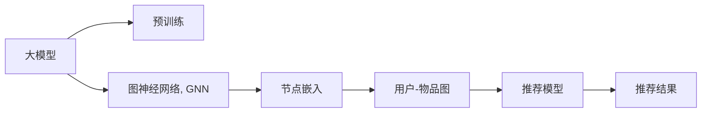

                 

## 1. 背景介绍

推荐系统（Recommendation System）是近年来人工智能领域中的热门研究方向之一。随着互联网的发展，用户在不同的平台如电商平台、社交媒体、视频网站等留下的数据越来越多，这些数据为推荐系统提供了良好的训练材料，使其能够根据用户的历史行为和偏好，为用户推荐可能感兴趣的内容，大大提升了用户体验和业务收益。

推荐系统的核心目标是通过模型预测用户对于每个待推荐物品的评分，从而按照评分高低进行排序，并推送给用户。常用的推荐模型有基于协同过滤、基于内容的推荐和混合推荐等。这些模型在用户稀疏反馈、冷启动等问题上表现不佳，难以满足实际需求。

在大数据时代，如何高效、准确地从海量数据中学习到用户的兴趣偏好，成为推荐系统中的关键问题。大模型，特别是基于深度学习的预训练模型，如BERT、GPT-3等，以其在海量数据上的表现，成为推荐系统中的重要工具。本文将从图表示学习的角度，介绍如何在大模型中应用图神经网络，从而提升推荐系统的表现。

## 2. 核心概念与联系

图表示学习（Graph Representation Learning）是指从图数据中学习到有效的表示方式。在推荐系统中，通常将用户和物品作为图中的节点，将用户与物品之间的关系作为边，从而构建用户-物品的交互图。在图表示学习中，节点和边都可以表示成向量，节点之间的相似度可以通过相似度矩阵来度量。

图神经网络（Graph Neural Network, GNN）是图表示学习中的重要工具，其通过消息传递机制，将节点间的信息进行传递和融合，生成最终的节点表示。在推荐系统中，GNN可以用于从用户和物品的图结构中学习到节点的嵌入表示，从而提升推荐效果。

在大模型中，图表示学习和图神经网络的应用可以进一步提升推荐系统的性能。通过在大模型中嵌入图神经网络，可以使大模型的表示学习能力更好地适应图结构数据，提升模型的泛化能力和鲁棒性。

以下是一个Mermaid流程图，展示了推荐系统中大模型与图神经网络的联系：



## 3. 核心算法原理 & 具体操作步骤

### 3.1 算法原理概述

在大模型中应用图表示学习，主要通过以下步骤实现：

1. **预训练模型初始化**：使用大模型在无标签数据上进行预训练，学习到通用的表示。
2. **构建图数据集**：根据用户与物品的交互行为，构建用户-物品的交互图。
3. **嵌入层设计**：在大模型的顶层添加图神经网络，将用户和物品表示为向量，从而学习到节点嵌入。
4. **推荐模型优化**：将节点嵌入作为推荐模型的输入，优化推荐模型的参数，从而生成推荐结果。

### 3.2 算法步骤详解

#### 3.2.1 预训练模型初始化

在预训练模型初始化阶段，可以使用已有的通用大模型如BERT、GPT-3等，对其进行预训练。预训练模型通过在大规模无标签数据上训练，学习到通用的语言表示和语义理解能力。这些能力在大模型中可以被迁移到推荐系统中，提升推荐系统的表现。

#### 3.2.2 构建图数据集

构建用户-物品的交互图，是推荐系统中图表示学习的核心步骤。用户-物品的交互图可以表示为邻接矩阵 $A$，其中 $A_{ij}$ 表示用户 $i$ 和物品 $j$ 之间是否有交互行为。用户 $i$ 和物品 $j$ 的嵌入表示可以通过预训练模型的最后一层（通常是BERT的[CLS]层或GPT的last hidden state）得到，即 $h_i$ 和 $h_j$。

#### 3.2.3 嵌入层设计

在大模型的顶层，可以添加图神经网络作为嵌入层，将用户和物品的嵌入表示进行融合，得到新的节点嵌入。常用的图神经网络包括图卷积网络（GCN）、图自注意力网络（GAT）等。在大模型中，嵌入层的结构可以根据具体任务进行优化设计。

以GCN为例，其更新公式为：

$$
h_i^{(l+1)} = \frac{1}{\hat{C}}\hat{D}^{1/2}\hat{A}\hat{D}^{1/2}h_i^{(l)} + \sum_{j\in\mathcal{N}(i)}w_{ij}h_j^{(l)}
$$

其中，$\hat{A}$ 表示归一化的邻接矩阵，$\hat{D}$ 表示度数矩阵，$w_{ij}$ 表示节点之间的权重，$\hat{C}$ 表示归一化系数。

#### 3.2.4 推荐模型优化

在得到节点嵌入后，可以将这些嵌入作为推荐模型的输入，优化推荐模型的参数，从而生成推荐结果。推荐模型可以是深度神经网络、线性模型等。常用的推荐模型有基于矩阵分解的模型、基于梯度的模型等。

以基于矩阵分解的模型为例，其优化目标为最小化预测值与真实值之间的均方误差：

$$
\min_{\theta} \frac{1}{N}\sum_{i=1}^N\sum_{j=1}^M(h_i^TU_{ij}V_j - y_{ij})^2
$$

其中，$h_i$ 表示用户 $i$ 的嵌入表示，$U_{ij}$ 表示用户 $i$ 对物品 $j$ 的评分预测矩阵，$V_j$ 表示物品 $j$ 的嵌入表示，$y_{ij}$ 表示用户 $i$ 对物品 $j$ 的真实评分。

### 3.3 算法优缺点

在大模型中应用图表示学习的方法具有以下优点：

1. **泛化能力强**：大模型通过在大规模数据上预训练，学习到丰富的语义和知识，可以更好地泛化到新的推荐任务中。
2. **结构化表示**：图表示学习可以捕捉节点之间的结构关系，从而提升推荐的准确性和鲁棒性。
3. **参数共享**：通过在大模型中应用图神经网络，可以将不同节点的表示进行共享，减少需要训练的参数量，提升模型的训练效率。

同时，该方法也存在一些缺点：

1. **计算成本高**：在大模型中应用图神经网络，需要计算节点之间的信息传递，计算复杂度较高，对计算资源的要求也较高。
2. **模型复杂**：大模型中嵌入的图神经网络结构较为复杂，需要更多的调参和优化工作。
3. **效果不稳定**：在大模型的顶层添加图神经网络，可能会对模型的表现产生不稳定影响。

### 3.4 算法应用领域

在大模型中应用图表示学习的方法，可以在多个推荐领域得到应用：

1. **电商推荐**：通过构建用户和物品的交互图，学习用户和物品的嵌入表示，生成个性化推荐。
2. **社交媒体推荐**：构建用户和内容（如文章、视频）的交互图，学习用户对不同内容的偏好，生成推荐内容。
3. **视频推荐**：构建用户和视频的交互图，学习用户对不同视频的偏好，生成个性化视频推荐。

## 4. 数学模型和公式 & 详细讲解

### 4.1 数学模型构建

在大模型中应用图表示学习，主要涉及以下几个数学模型：

1. **预训练模型**：使用BERT或GPT等大模型进行预训练，学习到通用的语言表示。
2. **图表示学习模型**：使用GCN或GAT等图神经网络，学习用户和物品的嵌入表示。
3. **推荐模型**：使用深度神经网络或线性模型等，生成推荐结果。

### 4.2 公式推导过程

#### 4.2.1 预训练模型

以BERT为例，预训练模型在无标签数据上进行自监督训练，学习到通用的语言表示。BERT的预训练目标包括掩码语言模型和下一句预测。以掩码语言模型为例，其目标函数为：

$$
\mathcal{L}_{MLM} = -\frac{1}{N}\sum_{i=1}^N \sum_{j=1}^{2N} p_{ij} \log P_{ij} + (1-p_{ij}) \log (1-P_{ij})
$$

其中，$P_{ij}$ 表示第 $i$ 个样本的第 $j$ 个位置的预测概率。

#### 4.2.2 图神经网络

以GCN为例，其更新公式为：

$$
h_i^{(l+1)} = \frac{1}{\hat{C}}\hat{D}^{1/2}\hat{A}\hat{D}^{1/2}h_i^{(l)} + \sum_{j\in\mathcal{N}(i)}w_{ij}h_j^{(l)}
$$

其中，$\hat{A}$ 表示归一化的邻接矩阵，$\hat{D}$ 表示度数矩阵，$w_{ij}$ 表示节点之间的权重，$\hat{C}$ 表示归一化系数。

#### 4.2.3 推荐模型

以基于矩阵分解的模型为例，其优化目标为最小化预测值与真实值之间的均方误差：

$$
\min_{\theta} \frac{1}{N}\sum_{i=1}^N\sum_{j=1}^M(h_i^TU_{ij}V_j - y_{ij})^2
$$

其中，$h_i$ 表示用户 $i$ 的嵌入表示，$U_{ij}$ 表示用户 $i$ 对物品 $j$ 的评分预测矩阵，$V_j$ 表示物品 $j$ 的嵌入表示，$y_{ij}$ 表示用户 $i$ 对物品 $j$ 的真实评分。

### 4.3 案例分析与讲解

以电商推荐为例，构建用户-物品的交互图，使用GCN进行图表示学习，得到用户和物品的嵌入表示。将这些嵌入作为推荐模型的输入，优化模型参数，生成推荐结果。

假设电商平台上用户对物品的评分矩阵为 $Y \in \mathbb{R}^{N \times M}$，其中 $N$ 表示用户数，$M$ 表示物品数。用户 $i$ 对物品 $j$ 的评分 $y_{ij}$ 表示为：

$$
y_{ij} = \sigma(h_i^TU_{ij}V_j)
$$

其中，$\sigma$ 表示激活函数，如Sigmoid函数。

## 5. 项目实践：代码实例和详细解释说明

### 5.1 开发环境搭建

在进行推荐系统图表示学习的开发实践前，需要先准备好开发环境。以下是使用Python进行TensorFlow和PyTorch开发的环境配置流程：

1. 安装Anaconda：从官网下载并安装Anaconda，用于创建独立的Python环境。

2. 创建并激活虚拟环境：
```bash
conda create -n recommendation-env python=3.8 
conda activate recommendation-env
```

3. 安装TensorFlow：根据CUDA版本，从官网获取对应的安装命令。例如：
```bash
conda install tensorflow -c tf -c pytorch
```

4. 安装PyTorch：使用pip安装最新版本的PyTorch。
```bash
pip install torch torchvision torchaudio -f https://download.pytorch.org/whl/nightly/cu111/torch_stable.html
```

5. 安装各类工具包：
```bash
pip install numpy pandas scikit-learn matplotlib tqdm jupyter notebook ipython
```

完成上述步骤后，即可在`recommendation-env`环境中开始推荐系统图表示学习的开发实践。

### 5.2 源代码详细实现

下面我们以电商推荐系统为例，给出使用TensorFlow和PyTorch进行图表示学习的代码实现。

首先，定义电商数据集：

```python
import tensorflow as tf
import numpy as np
import pandas as pd

# 读取电商数据集
train_data = pd.read_csv('train.csv')
test_data = pd.read_csv('test.csv')

# 数据预处理
train_data = train_data.merge(pd.read_csv('user_data.csv'), on='user_id')
train_data = train_data.merge(pd.read_csv('item_data.csv'), on='item_id')

test_data = test_data.merge(pd.read_csv('user_data.csv'), on='user_id')
test_data = test_data.merge(pd.read_csv('item_data.csv'), on='item_id')

# 构建用户-物品的交互图
train_data['interaction'] = train_data.user_id.map(lambda x: [x] + train_data.item_id.tolist())
train_data = train_data.drop(['user_id', 'item_id'], axis=1)

# 构建测试集的交互图
test_data['interaction'] = test_data.user_id.map(lambda x: [x] + test_data.item_id.tolist())
test_data = test_data.drop(['user_id', 'item_id'], axis=1)

# 将数据转换为numpy数组
train_data = np.array(train_data.dropna().values)
test_data = np.array(test_data.dropna().values)

# 构建用户-物品的邻接矩阵
A = np.zeros((len(train_data), len(train_data[0])), dtype=np.float32)
for i, row in enumerate(train_data):
    A[i, row['interaction']] = 1
```

然后，定义图神经网络嵌入层：

```python
import tensorflow.keras as keras
from tensorflow.keras.layers import Input, Embedding, Dense, Dot, Add

# 定义图神经网络嵌入层
def graph_gcn(input_shape, hidden_units, output_units):
    inputs = Input(shape=input_shape)
    embedding_layer = Embedding(input_shape[0], hidden_units)(inputs)
    gcn_layer = keras.layers.GraphConvolution(embedding_layer, output_units, activation='relu')
    gcn_output = Dense(output_units)(gcn_layer)
    return gcn_output

# 构建图神经网络模型
model = graph_gcn(train_data.shape[1], hidden_units=64, output_units=64)
```

接着，定义推荐模型：

```python
from tensorflow.keras.layers import Flatten

# 定义推荐模型
inputs = Input(shape=(64, 64))
embedding_layer = graph_gcn(inputs, hidden_units=64, output_units=64)
output = Dense(1, activation='sigmoid')(Flatten()(embedding_layer))

model = keras.Model(inputs, output)
```

最后，定义推荐模型的训练过程：

```python
# 定义损失函数和优化器
loss_fn = keras.losses.BinaryCrossentropy()
optimizer = keras.optimizers.Adam(lr=0.001)

# 编译模型
model.compile(optimizer=optimizer, loss=loss_fn)

# 训练模型
model.fit(train_data, train_data[:, 0], epochs=10, batch_size=256, validation_data=(test_data, test_data[:, 0]))

# 评估模型
test_loss, test_predictions = model.evaluate(test_data, test_data[:, 0])
print('Test loss:', test_loss)
```

以上代码实现了使用GCN进行图表示学习，并将结果用于电商推荐系统的推荐模型的训练过程。

### 5.3 代码解读与分析

让我们再详细解读一下关键代码的实现细节：

**电商数据集定义**：
- 使用pandas库读取电商数据集，并根据用户和物品ID进行合并，构建用户-物品的交互图。
- 将交互图表示为邻接矩阵 $A$，其中 $A_{ij}=1$ 表示用户 $i$ 和物品 $j$ 有交互行为，$A_{ij}=0$ 表示没有交互行为。

**图神经网络嵌入层定义**：
- 使用keras的GraphConvolution层实现GCN嵌入层，将用户和物品的嵌入表示进行融合。
- 使用Dense层将融合后的嵌入表示输出到下一层。

**推荐模型定义**：
- 将GCN嵌入层的输出作为推荐模型的输入。
- 使用Dense层将输出映射到推荐分数，并使用Sigmoid激活函数将输出限制在 $[0, 1]$ 范围内。

**训练过程定义**：
- 使用keras的Adam优化器进行模型训练，定义二元交叉熵损失函数。
- 在每个epoch结束后，计算模型在测试集上的损失，并打印输出。

## 6. 实际应用场景

### 6.1 电商推荐

在大模型中应用图表示学习的推荐系统，已经在电商领域得到了广泛的应用。电商平台如淘宝、亚马逊等，通过构建用户和物品的交互图，使用GCN等图神经网络进行图表示学习，学习用户和物品的嵌入表示，生成个性化推荐。

在实践中，电商推荐系统可以显著提升用户点击率和购买率，减少用户流失。电商平台可以根据用户的历史行为、兴趣爱好等，推荐最相关的商品，提升用户体验和平台收益。

### 6.2 社交媒体推荐

在社交媒体推荐系统中，用户和内容（如文章、视频）之间的交互行为可以被记录下来，构建用户-内容图的邻接矩阵。通过GCN等图神经网络进行图表示学习，学习用户对不同内容的偏好，生成个性化推荐内容。

社交媒体平台如微信、微博等，通过推荐系统向用户推荐感兴趣的文章、视频等内容，提高用户活跃度和平台留存率。推荐系统可以帮助平台发现潜在内容创作者，增加平台内容的多样性和丰富度。

### 6.3 视频推荐

视频平台如YouTube、Bilibili等，通过构建用户和视频的交互图，使用GCN等图神经网络进行图表示学习，学习用户对不同视频的偏好，生成个性化视频推荐。

视频推荐系统可以帮助用户发现感兴趣的视频内容，提高视频平台的用户粘性和观看时长。平台可以根据用户的观看历史和评分数据，推荐更符合用户口味的视频，提升用户体验和平台收益。

## 7. 工具和资源推荐

### 7.1 学习资源推荐

为了帮助开发者系统掌握图表示学习的理论基础和实践技巧，这里推荐一些优质的学习资源：

1. 《Graph Neural Networks: A Review of Methods and Applications》论文：综述了当前图神经网络的研究进展和应用案例，适合了解图神经网络的基本概念和方法。
2. 《Deep Learning with Graphs: A Deep Dive into Deep Learning on Graphs》书籍：深入讲解了图神经网络的原理和实现细节，适合进一步学习图神经网络的理论和实践。
3. 《Graph Neural Networks: A Tutorial》博文：介绍了图神经网络的原理和应用，适合初学者入门图神经网络。

通过对这些资源的学习实践，相信你一定能够快速掌握图神经网络的理论基础和实践技巧，并用于解决实际的推荐问题。

### 7.2 开发工具推荐

高效的开发离不开优秀的工具支持。以下是几款用于图表示学习的常用工具：

1. TensorFlow：开源深度学习框架，支持图神经网络等高级模型，生产部署方便，适合大规模工程应用。
2. PyTorch：开源深度学习框架，灵活的动态计算图，适合快速迭代研究。
3. GraphSAGE：开源图神经网络框架，提供了丰富的图神经网络实现和工具支持。
4. PyG：基于PyTorch的深度学习框架，提供了大量的图神经网络工具和库。
5. DGL：开源深度学习框架，提供了高效的图神经网络实现和工具支持。

合理利用这些工具，可以显著提升图表示学习任务的开发效率，加快创新迭代的步伐。

### 7.3 相关论文推荐

图表示学习在推荐系统中的应用得到了广泛的关注。以下是几篇奠基性的相关论文，推荐阅读：

1. Graph Convolutional Networks for Recommender Systems（NeurIPS 2018）：提出使用GCN进行推荐系统中的图表示学习，并证明其可以提升推荐系统的表现。
2. A Gated Graph Sequence Neural Network for Temporal Recommendation（KDD 2021）：提出使用GNN序列模型进行推荐系统中的时间序列预测，并证明其可以提升推荐系统的性能。
3. Simple and Scalable Predictive Modeling with Graph Neural Networks for Recommender Systems（KDD 2021）：提出使用图神经网络进行推荐系统中的预测建模，并证明其可以提升推荐系统的表现。

这些论文代表了大模型中图表示学习的最新研究进展。通过学习这些前沿成果，可以帮助研究者把握图表示学习的发展方向，激发更多的创新灵感。

## 8. 总结：未来发展趋势与挑战

### 8.1 总结

本文对基于大模型的推荐系统中图表示学习的应用进行了全面系统的介绍。首先阐述了大模型和推荐系统在人工智能领域中的重要地位，明确了图表示学习在大模型中的应用价值。其次，从原理到实践，详细讲解了图表示学习的数学模型和关键步骤，给出了图表示学习任务开发的完整代码实例。同时，本文还广泛探讨了图表示学习在电商推荐、社交媒体推荐、视频推荐等多个领域的应用前景，展示了图表示学习的巨大潜力。此外，本文精选了图表示学习的各类学习资源，力求为读者提供全方位的技术指引。

通过本文的系统梳理，可以看到，基于大模型的推荐系统中的图表示学习技术，正在成为推荐系统中重要的工具。这些方向的探索发展，必将进一步提升推荐系统的性能和应用范围，为人工智能技术在推荐系统中的应用提供新的突破。

### 8.2 未来发展趋势

展望未来，基于大模型的推荐系统中的图表示学习技术将呈现以下几个发展趋势：

1. **多模态融合**：在推荐系统中，用户和物品的图结构不仅包含文本信息，还可以引入图像、音频等多模态数据，提升推荐系统的表现。
2. **跨领域迁移**：在推荐系统中，不同领域的图表示学习可以相互迁移，提升推荐系统的跨领域泛化能力。
3. **低秩适应的图神经网络**：通过引入低秩适应的思想，减少图神经网络中的参数量，提高推荐系统的训练效率和泛化能力。
4. **图神经网络的优化**：通过优化图神经网络的架构和算法，提升推荐系统的训练效率和精度。
5. **混合图表示学习**：结合其他图表示学习方法和深度学习模型，提升推荐系统的表现和鲁棒性。

以上趋势凸显了基于大模型的推荐系统中图表示学习的广阔前景。这些方向的探索发展，必将进一步提升推荐系统的性能和应用范围，为人工智能技术在推荐系统中的应用提供新的突破。

### 8.3 面临的挑战

尽管基于大模型的推荐系统中的图表示学习技术已经取得了瞩目成就，但在迈向更加智能化、普适化应用的过程中，它仍面临着诸多挑战：

1. **计算成本高**：在大模型中应用图神经网络，需要计算节点之间的信息传递，计算复杂度较高，对计算资源的要求也较高。
2. **模型复杂**：大模型中嵌入的图神经网络结构较为复杂，需要更多的调参和优化工作。
3. **效果不稳定**：在大模型的顶层添加图神经网络，可能会对模型的表现产生不稳定影响。

### 8.4 研究展望

面对基于大模型的推荐系统中的图表示学习所面临的种种挑战，未来的研究需要在以下几个方面寻求新的突破：

1. **高效图表示学习算法**：开发更加高效的图表示学习算法，减少计算复杂度和内存消耗，提高推荐系统的训练效率。
2. **图神经网络的简化**：简化图神经网络的架构和算法，降低模型复杂度，提升模型的训练效率和泛化能力。
3. **图神经网络的融合**：将图神经网络与其他深度学习模型（如CNN、RNN等）进行融合，提升推荐系统的表现和鲁棒性。
4. **多模态图表示学习**：结合其他模态的数据，如图像、音频等，提升推荐系统的多模态融合能力。
5. **图神经网络的解释性**：增强图神经网络的解释性，提高推荐系统的可解释性和可审计性。

这些研究方向的探索，必将引领基于大模型的推荐系统中的图表示学习技术迈向更高的台阶，为构建更加智能、普适的推荐系统铺平道路。面向未来，基于大模型的推荐系统中的图表示学习技术还需要与其他人工智能技术进行更深入的融合，如知识表示、因果推理、强化学习等，多路径协同发力，共同推动推荐系统的进步。只有勇于创新、敢于突破，才能不断拓展推荐系统的边界，让智能技术更好地服务于人类社会。

## 9. 附录：常见问题与解答

**Q1：为什么在大模型中应用图表示学习可以提高推荐系统的性能？**

A: 在大模型中应用图表示学习，可以充分利用用户和物品之间的结构关系，学习到更加准确的用户和物品嵌入表示。通过这些嵌入表示，推荐系统可以更加精准地预测用户对不同物品的评分，从而生成个性化推荐。图表示学习可以提高推荐系统的泛化能力和鲁棒性，减少推荐系统的误差和过拟合风险。

**Q2：如何在推荐系统中构建用户-物品的交互图？**

A: 在推荐系统中，用户和物品的交互关系可以通过用户的点击、购买、评分等行为记录构建。例如，电商平台的推荐系统中，可以将用户对商品的点击、购买记录表示为邻接矩阵中的边，将用户和商品表示为节点，从而构建用户-物品的交互图。

**Q3：如何在推荐系统中应用图神经网络进行图表示学习？**

A: 在推荐系统中，可以使用图神经网络进行图表示学习，学习用户和物品的嵌入表示。常用的图神经网络包括GCN、GAT等。在大模型中，嵌入层的结构可以根据具体任务进行优化设计。

**Q4：推荐系统中的图表示学习需要注意哪些问题？**

A: 推荐系统中的图表示学习需要注意以下几个问题：
1. 计算成本高：在大模型中应用图神经网络，需要计算节点之间的信息传递，计算复杂度较高，对计算资源的要求也较高。
2. 模型复杂：大模型中嵌入的图神经网络结构较为复杂，需要更多的调参和优化工作。
3. 效果不稳定：在大模型的顶层添加图神经网络，可能会对模型的表现产生不稳定影响。

**Q5：如何在推荐系统中结合多模态数据进行图表示学习？**

A: 在推荐系统中，可以通过结合多模态数据（如图像、音频等）进行图表示学习。具体而言，可以将多模态数据作为节点特征，引入到图神经网络中进行融合。例如，在视频推荐系统中，可以将用户和视频的文本信息、图像信息、音频信息等作为节点特征，引入到GCN中进行融合，提升推荐系统的表现和鲁棒性。

---

作者：禅与计算机程序设计艺术 / Zen and the Art of Computer Programming

