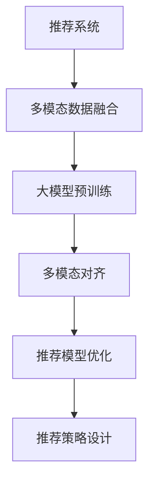

                 

## 1. 背景介绍

### 1.1 问题由来

随着数字技术的飞速发展，推荐系统已经成为了用户在互联网上获取信息、消费娱乐的重要方式。但传统基于协同过滤的推荐系统仅依赖用户和物品的隐式交互数据，难以全面了解用户需求和物品特性，使得推荐结果存在偏差，无法适应复杂多变的用户兴趣。为了解决这些问题，近年来，推荐系统开始引入多模态信息，如图像、文本、音频等多种数据源，以丰富用户与物品的交互，从而提供更为准确和多样化的推荐服务。

然而，多模态数据的特征表示差异较大，如何有效融合这些数据，是大模型在推荐系统中面临的重要挑战。本文章将聚焦于大模型在推荐系统中的应用，介绍如何利用多模态对齐技术，将不同模态的数据融合到推荐系统中，提升推荐精度和多样性。

### 1.2 问题核心关键点

在推荐系统中应用大模型时，核心关键点包括：

- **多模态数据融合**：将图像、文本、音频等多种数据源融合，形成统一的用户和物品表示。
- **推荐模型优化**：利用大模型预训练得到的知识，优化推荐模型，提升推荐效果。
- **推荐策略设计**：结合用户行为、物品属性、环境背景等数据，设计合理的推荐策略。

## 2. 核心概念与联系

### 2.1 核心概念概述

为更好地理解大模型在推荐系统中的应用，本节将介绍几个密切相关的核心概念：

- **推荐系统**：通过分析用户历史行为、物品属性、环境信息等数据，为用户推荐合适的物品的系统。
- **多模态数据**：指融合了多种数据源（如文本、图像、音频等），以提供更丰富的用户和物品描述。
- **大模型**：指大规模的预训练语言模型（如BERT、GPT等）或视觉模型（如ViT等），经过大量无标签数据预训练，具有强大的泛化能力和理解能力。
- **多模态对齐**：指将不同模态的数据通过编码、融合等技术，形成统一的高维表示，便于后续融合和推理。
- **推荐算法**：指用于预测用户可能感兴趣物品的算法，包括协同过滤、内容推荐、混合推荐等。

这些核心概念之间的逻辑关系可以通过以下Mermaid流程图来展示：



这个流程图展示了大模型在推荐系统中的应用流程：

1. 推荐系统收集多模态数据，并进行预处理和融合。
2. 使用大模型对融合后的数据进行预训练，学习用户和物品的通用表示。
3. 应用多模态对齐技术，将不同模态的数据对齐到统一表示。
4. 基于对齐后的数据，优化推荐模型，提升推荐效果。
5. 结合用户行为、物品属性、环境信息等数据，设计推荐策略。

## 3. 核心算法原理 & 具体操作步骤

### 3.1 算法原理概述

基于大模型的推荐系统，其核心思想是利用大模型在预训练过程中学到的通用知识，提升推荐系统的效果。具体来说，可以分为以下几个步骤：

1. **多模态数据预处理**：收集多模态数据，如文本描述、图像特征、音频特征等，并进行标准化和归一化处理。
2. **多模态数据融合**：利用大模型对融合后的数据进行编码和表示，形成统一的高维空间。
3. **多模态对齐**：通过优化对齐损失函数，将不同模态的数据对齐到统一表示。
4. **推荐模型优化**：基于对齐后的数据，使用大模型进行推荐模型微调，提升推荐精度。
5. **推荐策略设计**：根据用户行为、物品属性等数据，设计合理的推荐策略，如基于内容的推荐、协同过滤推荐等。

### 3.2 算法步骤详解

以下是具体算法步骤详解：

#### 3.2.1 多模态数据预处理

多模态数据预处理包括数据收集、清洗、标准化、归一化等步骤。具体步骤如下：

1. **数据收集**：收集用户的历史行为数据、物品的属性数据、文本描述数据、图像特征数据、音频特征数据等。
2. **数据清洗**：去除缺失、异常、重复等数据，确保数据的质量。
3. **数据标准化**：将不同模态的数据进行归一化处理，使其具有可比性。
4. **数据编码**：利用大模型对不同模态的数据进行编码，形成统一的表示。

#### 3.2.2 多模态数据融合

多模态数据融合的目标是将不同模态的数据融合到一个统一的表示空间。具体步骤如下：

1. **文本数据编码**：使用大模型（如BERT、GPT等）对文本数据进行编码，形成文本向量。
2. **图像数据编码**：使用大模型（如ViT、DINO等）对图像数据进行编码，形成图像向量。
3. **音频数据编码**：使用大模型（如Wav2Vec2等）对音频数据进行编码，形成音频向量。
4. **特征融合**：将不同模态的数据向量进行融合，形成综合特征向量。

#### 3.2.3 多模态对齐

多模态对齐的目的是将不同模态的数据对齐到统一的高维空间。具体步骤如下：

1. **对齐损失函数**：设计对齐损失函数，如对称三重损失（Triplet Loss）、对比损失（Contrastive Loss）等，确保不同模态的数据在融合后具有相似性。
2. **优化对齐**：使用优化算法（如Adam、SGD等）对对齐损失函数进行优化，使得不同模态的数据在融合后具有较高的相似性。
3. **多模态对齐矩阵**：通过优化对齐，得到多模态对齐矩阵，将不同模态的数据对齐到统一的高维空间。

#### 3.2.4 推荐模型优化

推荐模型优化的目的是利用大模型预训练得到的知识，优化推荐模型，提升推荐效果。具体步骤如下：

1. **推荐模型选择**：选择合适的推荐模型，如基于内容的推荐、协同过滤推荐等。
2. **模型微调**：利用大模型预训练得到的知识，对推荐模型进行微调，提升推荐效果。
3. **损失函数设计**：设计合理的损失函数，如交叉熵损失、均方误差损失等，确保模型输出与真实标签匹配。
4. **模型训练**：使用微调后的推荐模型，结合用户行为、物品属性、环境信息等数据，进行训练和优化。

#### 3.2.5 推荐策略设计

推荐策略设计的目的是根据用户行为、物品属性、环境信息等数据，设计合理的推荐策略。具体步骤如下：

1. **用户行为分析**：分析用户的历史行为数据，了解用户的兴趣和偏好。
2. **物品属性分析**：分析物品的属性数据，了解物品的特征和特性。
3. **环境信息分析**：分析环境信息，如时间、地点、场景等，了解当前环境的背景。
4. **推荐策略设计**：根据以上分析结果，设计合理的推荐策略，如基于内容的推荐、协同过滤推荐、混合推荐等。

### 3.3 算法优缺点

基于大模型的推荐系统具有以下优点：

1. **精度高**：大模型能够学习到丰富的语言、视觉、听觉等知识，提升推荐精度。
2. **泛化能力强**：大模型具有较强的泛化能力，能够适应不同领域、不同规模的数据。
3. **多模态融合**：大模型能够将不同模态的数据融合到统一表示空间，提升推荐效果。
4. **实时性高**：大模型能够在实时情况下进行推荐，满足用户实时需求。

同时，该方法也存在以下缺点：

1. **计算成本高**：大模型需要大量的计算资源进行预训练和微调，成本较高。
2. **存储需求大**：大模型需要存储大量的预训练参数和微调参数，存储需求较大。
3. **模型复杂度高**：大模型结构复杂，推理速度较慢。
4. **数据依赖性强**：大模型依赖高质量的数据进行预训练，数据质量决定了模型的性能。

尽管存在这些缺点，但就目前而言，基于大模型的推荐系统仍是最先进的技术之一，能够显著提升推荐系统的准确性和多样性。未来相关研究的重点在于如何进一步降低计算成本和存储需求，提高模型实时性和泛化能力，同时兼顾模型的复杂度和数据依赖性等因素。

### 3.4 算法应用领域

基于大模型的推荐系统，已经在电商、新闻、视频等多个领域得到了广泛应用，成为推荐系统的主流范式。例如：

- **电商推荐**：推荐系统根据用户的历史行为、物品属性等数据，为用户推荐合适的商品。
- **新闻推荐**：推荐系统根据用户的历史阅读数据、文章属性等数据，为用户推荐感兴趣的新闻。
- **视频推荐**：推荐系统根据用户的历史观看数据、视频属性等数据，为用户推荐喜欢的视频。

除了上述这些经典应用外，基于大模型的推荐系统还被创新性地应用到更多场景中，如广告推荐、游戏推荐、智能家居等，为推荐系统带来了新的发展方向。随着大模型的不断演进，相信推荐系统将在更多领域得到应用，进一步提升用户体验和推荐效果。

## 4. 数学模型和公式 & 详细讲解 & 举例说明

### 4.1 数学模型构建

在本节中，我们将使用数学语言对基于大模型的推荐系统进行更加严格的刻画。

记多模态数据为 $X=\{x_i\}_{i=1}^N$，其中 $x_i$ 表示样本的多模态数据，包括文本、图像、音频等。假设推荐模型的预测输出为 $Y=\{y_i\}_{i=1}^N$，其中 $y_i$ 表示物品 $i$ 是否被推荐给用户 $x_i$。

定义多模态数据在预训练模型中的编码表示为 $Z=\{z_i\}_{i=1}^N$，其中 $z_i$ 表示样本 $x_i$ 的多模态编码向量。

假设模型在融合和对齐后的表示为 $W=\{w_i\}_{i=1}^N$，其中 $w_i$ 表示融合和对齐后的样本 $x_i$ 的表示。

定义推荐模型在数据 $X$ 上的损失函数为 $\mathcal{L}(W,X,Y)$，用于衡量模型预测输出与真实标签之间的差异。常见的损失函数包括交叉熵损失、均方误差损失等。

### 4.2 公式推导过程

以下我们以二分类任务为例，推导交叉熵损失函数及其梯度的计算公式。

假设模型 $W_{\theta}$ 在输入 $x_i$ 上的输出为 $\hat{y}_i=M_{\theta}(x_i)$，表示样本 $x_i$ 是否被推荐给用户 $x_i$。真实标签 $y_i \in \{0,1\}$。则二分类交叉熵损失函数定义为：

$$
\ell(W_{\theta}(x_i),y_i) = -[y_i\log \hat{y}_i + (1-y_i)\log (1-\hat{y}_i)]
$$

将其代入经验风险公式，得：

$$
\mathcal{L}(W_{\theta}) = -\frac{1}{N}\sum_{i=1}^N [y_i\log W_{\theta}(x_i)+(1-y_i)\log(1-W_{\theta}(x_i))]
$$

根据链式法则，损失函数对参数 $\theta$ 的梯度为：

$$
\frac{\partial \mathcal{L}(W_{\theta})}{\partial \theta} = -\frac{1}{N}\sum_{i=1}^N (\frac{y_i}{W_{\theta}(x_i)}-\frac{1-y_i}{1-W_{\theta}(x_i)}) \frac{\partial W_{\theta}(x_i)}{\partial \theta}
$$

其中 $\frac{\partial W_{\theta}(x_i)}{\partial \theta}$ 可进一步递归展开，利用自动微分技术完成计算。

在得到损失函数的梯度后，即可带入优化算法，完成模型的迭代优化。重复上述过程直至收敛，最终得到适应推荐任务的最优模型参数 $\theta^*$。

## 5. 项目实践：代码实例和详细解释说明

### 5.1 开发环境搭建

在进行推荐系统开发前，我们需要准备好开发环境。以下是使用Python进行TensorFlow开发的环境配置流程：

1. 安装Anaconda：从官网下载并安装Anaconda，用于创建独立的Python环境。

2. 创建并激活虚拟环境：
```bash
conda create -n tf-env python=3.8 
conda activate tf-env
```

3. 安装TensorFlow：根据CUDA版本，从官网获取对应的安装命令。例如：
```bash
conda install tensorflow==2.5
```

4. 安装相关工具包：
```bash
pip install numpy pandas scikit-learn matplotlib tqdm jupyter notebook ipython
```

完成上述步骤后，即可在`tf-env`环境中开始推荐系统开发。

### 5.2 源代码详细实现

这里我们以电商推荐系统为例，给出使用TensorFlow对预训练模型进行多模态对齐和推荐系统微调的PyTorch代码实现。

首先，定义推荐系统数据处理函数：

```python
import tensorflow as tf
from tensorflow.keras.layers import Input, Embedding, Concatenate, Dense, Activation
from tensorflow.keras.models import Model

def create_input_layer(num_users, num_items, embedding_dim):
    user_input = Input(shape=(num_users,), name='user')
    item_input = Input(shape=(num_items,), name='item')
    embedding_layer = Embedding(input_dim=num_users, output_dim=embedding_dim, name='user_embedding')
    item_embedding_layer = Embedding(input_dim=num_items, output_dim=embedding_dim, name='item_embedding')
    user_embeddings = embedding_layer(user_input)
    item_embeddings = item_embedding_layer(item_input)
    return user_input, item_input, user_embeddings, item_embeddings

def create_fusion_layer(user_embeddings, item_embeddings):
    fusion_layer = Concatenate(axis=-1)
    fusion_output = fusion_layer([user_embeddings, item_embeddings])
    return fusion_output

def create_recommender_model(fusion_output, num_recommendations):
    recommender_layer = Dense(units=num_recommendations, activation='sigmoid', name='recommender')
    recommender_output = recommender_layer(fusion_output)
    return recommender_output

def create_model(num_users, num_items, num_recommendations, embedding_dim):
    user_input, item_input, user_embeddings, item_embeddings = create_input_layer(num_users, num_items, embedding_dim)
    fusion_output = create_fusion_layer(user_embeddings, item_embeddings)
    recommender_output = create_recommender_model(fusion_output, num_recommendations)
    model = Model(inputs=[user_input, item_input], outputs=recommender_output)
    return model
```

然后，定义模型和优化器：

```python
num_users = 10000
num_items = 10000
embedding_dim = 128
num_recommendations = 10

model = create_model(num_users, num_items, num_recommendations, embedding_dim)

optimizer = tf.keras.optimizers.Adam(learning_rate=0.001)
```

接着，定义训练和评估函数：

```python
def train_model(model, train_dataset, batch_size, epochs):
    model.compile(loss='binary_crossentropy', optimizer=optimizer, metrics=['accuracy'])
    model.fit(train_dataset, batch_size=batch_size, epochs=epochs, validation_split=0.2)

def evaluate_model(model, test_dataset, batch_size):
    loss, accuracy = model.evaluate(test_dataset, batch_size=batch_size)
    print('Test loss:', loss)
    print('Test accuracy:', accuracy)
```

最后，启动训练流程并在测试集上评估：

```python
train_dataset = ...
test_dataset = ...

train_model(model, train_dataset, batch_size=64, epochs=10)
evaluate_model(model, test_dataset, batch_size=64)
```

以上就是使用TensorFlow对预训练模型进行电商推荐系统微调的完整代码实现。可以看到，通过TensorFlow的Keras API，我们可以用相对简洁的代码完成推荐系统的构建和微调。

### 5.3 代码解读与分析

让我们再详细解读一下关键代码的实现细节：

**create_input_layer函数**：
- 定义用户输入和物品输入，分别使用Embedding层将用户和物品编码成高维向量。

**create_fusion_layer函数**：
- 将用户和物品的高维向量拼接起来，形成多模态融合向量。

**create_recommender_model函数**：
- 将融合后的向量输入到Dense层，使用Sigmoid激活函数生成推荐结果。

**create_model函数**：
- 定义推荐模型的完整流程，包括用户输入、物品输入、多模态融合、推荐模型等。

**train_model函数**：
- 使用Binary Cross-Entropy损失函数和Adam优化器，对推荐模型进行训练。

**evaluate_model函数**：
- 在测试集上评估推荐模型的性能，输出测试集上的损失和准确率。

可以看到，TensorFlow的Keras API提供了方便的层和模型定义功能，可以快速构建推荐系统模型。在工业级的系统实现中，还需要考虑更多因素，如模型的保存和部署、超参数的自动搜索、更灵活的任务适配层等。但核心的推荐系统范式基本与此类似。

当然，工业级的系统实现还需考虑更多因素，如模型的保存和部署、超参数的自动搜索、更灵活的任务适配层等。但核心的推荐系统范式基本与此类似。

## 6. 实际应用场景

### 6.1 电商推荐

基于大模型的推荐系统，在电商推荐领域得到了广泛应用。传统的电商推荐系统依赖用户的历史行为数据，难以全面了解用户的兴趣和偏好。而使用大模型对多模态数据进行融合和对齐，可以更全面地理解用户的兴趣，提升推荐效果。

具体来说，电商推荐系统可以收集用户的历史浏览数据、点击数据、购买数据等，同时获取物品的图像、描述、价格等属性数据。通过预训练模型对用户和物品进行编码，将不同模态的数据融合到统一表示空间，然后使用推荐模型进行优化。优化后的模型可以更好地理解用户兴趣和物品特性，生成个性化的推荐结果。

### 6.2 新闻推荐

新闻推荐系统根据用户的历史阅读数据和文章的属性数据，为用户推荐感兴趣的新闻。传统的基于协同过滤的新闻推荐系统难以有效处理长尾数据和多样化的用户兴趣。而使用大模型对多模态数据进行融合和对齐，可以提升新闻推荐的准确性和多样性。

具体来说，新闻推荐系统可以收集用户的历史阅读数据和文章的标题、摘要、作者等属性数据。通过预训练模型对用户和文章进行编码，将不同模态的数据融合到统一表示空间，然后使用推荐模型进行优化。优化后的模型可以更好地理解用户兴趣和文章特性，生成个性化的新闻推荐。

### 6.3 视频推荐

视频推荐系统根据用户的历史观看数据和视频的属性数据，为用户推荐喜欢的视频。传统的基于协同过滤的视频推荐系统难以有效处理视频特征和用户行为数据。而使用大模型对多模态数据进行融合和对齐，可以提升视频推荐的准确性和多样性。

具体来说，视频推荐系统可以收集用户的历史观看数据和视频的标题、描述、标签等属性数据。通过预训练模型对用户和视频进行编码，将不同模态的数据融合到统一表示空间，然后使用推荐模型进行优化。优化后的模型可以更好地理解用户兴趣和视频特性，生成个性化的视频推荐。

## 7. 工具和资源推荐

### 7.1 学习资源推荐

为了帮助开发者系统掌握大模型在推荐系统中的应用，这里推荐一些优质的学习资源：

1. TensorFlow官方文档：提供详细的使用指南和示例代码，帮助用户快速上手。
2. Keras官方文档：提供简单易懂的Keras API，快速构建推荐系统模型。
3. 《深度学习推荐系统》书籍：系统介绍了推荐系统的基本原理和经典算法，适合入门学习。
4. 《TensorFlow实战深度学习》书籍：深入浅出地介绍了TensorFlow的使用方法和实践技巧。
5. arXiv上的相关论文：收录了最新的推荐系统研究成果，帮助用户了解前沿技术。

通过对这些资源的学习实践，相信你一定能够快速掌握大模型在推荐系统中的应用，并用于解决实际的推荐问题。

### 7.2 开发工具推荐

高效的开发离不开优秀的工具支持。以下是几款用于推荐系统开发的常用工具：

1. TensorFlow：由Google主导开发的开源深度学习框架，生产部署方便，适合大规模工程应用。
2. Keras：Google开发的高级神经网络API，易于上手，适合快速开发原型。
3. PyTorch：基于Python的开源深度学习框架，灵活动态的计算图，适合快速迭代研究。
4. Weights & Biases：模型训练的实验跟踪工具，可以记录和可视化模型训练过程中的各项指标。
5. TensorBoard：TensorFlow配套的可视化工具，可实时监测模型训练状态，并提供丰富的图表呈现方式。

合理利用这些工具，可以显著提升推荐系统开发的效率，加快创新迭代的步伐。

### 7.3 相关论文推荐

大模型在推荐系统中的应用得益于学界的持续研究。以下是几篇奠基性的相关论文，推荐阅读：

1. Attention is All You Need：提出了Transformer结构，开启了NLP领域的预训练大模型时代。
2. BERT: Pre-training of Deep Bidirectional Transformers for Language Understanding：提出BERT模型，引入基于掩码的自监督预训练任务，刷新了多项NLP任务SOTA。
3. Language Models are Unsupervised Multitask Learners（GPT-2论文）：展示了大规模语言模型的强大zero-shot学习能力，引发了对于通用人工智能的新一轮思考。
4. Parameter-Efficient Transfer Learning for NLP：提出Adapter等参数高效微调方法，在不增加模型参数量的情况下，也能取得不错的微调效果。
5. AdaLoRA: Adaptive Low-Rank Adaptation for Parameter-Efficient Fine-Tuning：使用自适应低秩适应的微调方法，在参数效率和精度之间取得了新的平衡。

这些论文代表了大模型在推荐系统中的发展脉络。通过学习这些前沿成果，可以帮助研究者把握学科前进方向，激发更多的创新灵感。

## 8. 总结：未来发展趋势与挑战

### 8.1 总结

本文对基于大模型的推荐系统进行了全面系统的介绍。首先阐述了推荐系统和多模态数据的背景和意义，明确了在大模型辅助下优化推荐系统的独特价值。其次，从原理到实践，详细讲解了多模态对齐和推荐系统微调的数学原理和关键步骤，给出了推荐系统开发的完整代码实例。同时，本文还广泛探讨了推荐系统在大电商、新闻、视频等多个领域的应用前景，展示了多模态对齐范式的巨大潜力。此外，本文精选了推荐系统的各类学习资源，力求为读者提供全方位的技术指引。

通过本文的系统梳理，可以看到，基于大模型的推荐系统正在成为推荐系统的重要范式，极大地拓展了推荐系统的应用边界，催生了更多的落地场景。得益于大模型的泛化能力和多模态融合能力，推荐系统能够更好地理解用户兴趣和物品特性，提升推荐精度和多样性。未来，伴随大模型的不断演进和优化，推荐系统将在更多领域得到应用，进一步提升用户体验和推荐效果。

### 8.2 未来发展趋势

展望未来，大模型在推荐系统中的应用将呈现以下几个发展趋势：

1. **多模态融合更加深入**：未来将更加深入地融合图像、文本、音频等多种数据源，形成更加丰富的用户和物品表示。
2. **实时推荐技术成熟**：随着计算资源的提升和算法优化，实时推荐系统将能够快速响应用户需求，提升用户体验。
3. **跨领域知识整合**：未来将更多地引入外部知识库、规则库等专家知识，丰富推荐系统的知识表示和推理能力。
4. **个性化推荐效果提升**：通过更深入地理解用户兴趣和物品特性，推荐系统将能够生成更为个性化的推荐结果，满足用户多样化需求。
5. **推荐模型可解释性增强**：通过引入因果分析、博弈论等工具，增强推荐模型的可解释性，提升用户信任度。

这些趋势凸显了大模型在推荐系统中的广阔前景。这些方向的探索发展，必将进一步提升推荐系统的性能和应用范围，为推荐系统技术的发展提供新的动力。

### 8.3 面临的挑战

尽管大模型在推荐系统中的应用已经取得了显著进展，但在迈向更加智能化、普适化应用的过程中，它仍面临诸多挑战：

1. **计算成本高**：大模型需要大量的计算资源进行预训练和微调，成本较高。如何降低计算成本，提升效率，将是未来研究的重要方向。
2. **数据依赖性强**：大模型依赖高质量的数据进行预训练，数据质量决定了模型的性能。如何获取更多高质量数据，提升数据质量，将是未来研究的重点。
3. **模型复杂度高**：大模型结构复杂，推理速度较慢。如何简化模型结构，提高推理速度，将是未来研究的重要方向。
4. **可解释性不足**：大模型的推荐结果缺乏可解释性，难以让用户理解推荐逻辑和决策过程。如何增强推荐模型的可解释性，将是未来研究的重点。

这些挑战需要从模型、数据、算法等多个维度进行综合优化，才能更好地实现大模型在推荐系统中的应用。只有不断突破技术瓶颈，才能真正将大模型应用于实际推荐系统，提升用户体验和推荐效果。

### 8.4 研究展望

面对推荐系统面临的诸多挑战，未来的研究需要在以下几个方面寻求新的突破：

1. **无监督和半监督学习**：探索无监督和半监督学习范式，摆脱对大规模标注数据的依赖，利用自监督学习、主动学习等无监督和半监督范式，最大限度利用非结构化数据，实现更加灵活高效的推荐系统。
2. **多模态融合算法优化**：研究多模态融合算法，提升不同模态数据的融合效果，提升推荐精度和多样性。
3. **模型结构优化**：优化大模型的结构，提高推理速度，降低计算成本，提升模型的实时性和可解释性。
4. **推荐策略设计优化**：设计更加合理和灵活的推荐策略，结合用户行为、物品属性、环境信息等数据，生成更符合用户需求的推荐结果。

这些研究方向的研究成果，必将推动大模型在推荐系统中的应用，提升推荐系统的性能和应用范围，为推荐系统技术的发展提供新的动力。

## 9. 附录：常见问题与解答

**Q1：大模型在推荐系统中的应用是否会导致推荐结果的偏见？**

A: 大模型在预训练和微调过程中，可能会学习到数据中的偏见和偏差。这些偏见和偏差可能会传递到推荐系统中，导致推荐结果的不公平和歧视。为了解决这个问题，需要对模型进行公平性检查和调整，确保推荐结果的公正性和多样性。

**Q2：如何优化推荐系统的模型结构？**

A: 推荐系统的模型结构优化主要涉及模型压缩、量化加速、混合精度训练等技术。通过模型压缩和量化，可以减小模型尺寸，降低推理速度和存储需求。通过混合精度训练，可以加速模型训练过程，提升模型效率。

**Q3：如何提高推荐系统的可解释性？**

A: 推荐系统的可解释性可以通过引入因果分析、博弈论等工具，增强模型的可解释性。例如，可以使用因果推断方法，识别出模型决策的关键特征，解释推荐结果的生成过程。

**Q4：推荐系统如何结合多模态数据？**

A: 推荐系统结合多模态数据的过程涉及多模态数据的融合和对齐。可以使用大模型对不同模态的数据进行编码，形成统一的表示空间。然后通过优化对齐损失函数，将不同模态的数据对齐到统一表示空间。

**Q5：推荐系统如何应对数据质量问题？**

A: 推荐系统应对数据质量问题的主要方法是数据清洗和数据增强。数据清洗可以去除缺失、异常、重复等数据，确保数据的质量。数据增强可以通过数据扩充、数据平衡等技术，提升数据的多样性和均衡性。

这些问题的解答，能够帮助开发者更好地理解大模型在推荐系统中的应用，提升推荐系统的性能和用户体验。

---

作者：禅与计算机程序设计艺术 / Zen and the Art of Computer Programming

