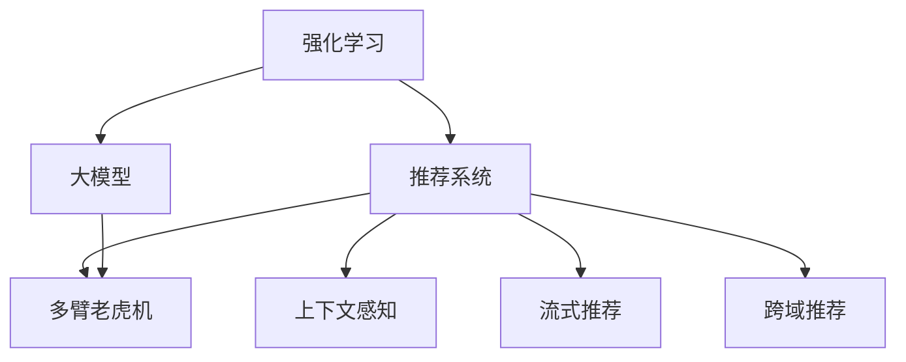

                 

## 1. 背景介绍

推荐系统作为互联网时代的重要技术，其目标是帮助用户发现感兴趣的内容，提升用户体验，增加商业价值。传统推荐系统基于协同过滤、内容推荐、标签推荐等技术，在电商、社交媒体、视频等场景中得到了广泛应用。然而，传统推荐系统往往依赖于用户历史行为数据，难以捕捉到用户的真实兴趣偏好，在冷启动和新用户场景下性能不佳。

近年来，随着深度学习和大模型的发展，基于大模型推荐系统逐步崭露头角。这些系统通过预训练大模型对用户行为进行建模，进而预测用户可能感兴趣的内容，从而提供个性化推荐。与传统推荐系统不同，基于大模型的推荐系统能够更好地理解和表达复杂的用户偏好，并适应不同类型的数据分布。

然而，预训练大模型需要大量的标注数据进行微调，成本较高，同时泛化能力不足。为了进一步提升推荐系统的性能，强化学习(Reinforcement Learning, RL)技术开始应用于推荐系统，即通过设计合理的奖励机制，利用智能体(Agent)在复杂环境中自主学习，实现高效、个性化的推荐。

本文将系统介绍强化学习在大模型推荐系统中的应用，包括强化学习的原理、算法、操作步骤和实际应用。

## 2. 核心概念与联系

### 2.1 核心概念概述

为更好地理解强化学习在大模型推荐系统中的应用，本节将介绍几个密切相关的核心概念：

- **强化学习**：一种机器学习范式，智能体在特定环境中通过与环境的交互，最大化累积奖励函数，学习最优策略。
- **推荐系统**：通过分析用户历史行为，预测用户未来兴趣，推荐符合用户需求的内容系统。
- **大模型**：以Transformer等结构为代表的深度学习模型，通过大规模无标签数据进行预训练，具备强大的表示学习能力。
- **多臂老虎机(Multi-Armed Bandit, MAB)**：模拟用户浏览内容的行为，将内容视为“槽位”，智能体通过不断调整推荐内容，最大化点击率。
- **上下文感知(Context-Aware)**：推荐系统能够理解用户浏览行为背后的情境信息，提供更精准的推荐内容。
- **流式推荐(Real-Time Recommendation)**：在用户浏览过程中动态生成推荐，提高推荐的时效性。
- **跨域推荐(Cross-Domain Recommendation)**：将推荐模型应用于不同类型的内容，如商品、音乐、视频等，满足用户多样化的需求。

这些核心概念之间的逻辑关系可以通过以下Mermaid流程图来展示：



这个流程图展示了大模型推荐系统的核心概念及其之间的关系：

1. 强化学习提供了智能体在环境中自主学习的方法。
2. 推荐系统需要分析用户行为，预测兴趣。
3. 大模型提供强大的表示学习能力，用于推荐策略的优化。
4. 多臂老虎机模拟用户浏览行为，测试不同内容的点击率。
5. 上下文感知引入情境信息，提高推荐准确性。
6. 流式推荐动态生成推荐，提高实时性。
7. 跨域推荐能够应用到不同类型的内容，满足用户多样化需求。

这些概念共同构成了大模型推荐系统的学习和应用框架，使其能够在复杂多变的推荐场景中发挥强大的作用。

## 3. 核心算法原理 & 具体操作步骤
### 3.1 算法原理概述

强化学习在大模型推荐系统中的应用，主要通过设计奖励机制，利用智能体在多臂老虎机模型中自主学习，最大化累计点击率。算法原理可以分为以下几个步骤：

1. **模型构建**：首先构建一个包含大模型的推荐系统，用于生成推荐内容。
2. **智能体设计**：设计智能体，通过与多臂老虎机交互，学习最优策略。
3. **环境建模**：模拟用户浏览行为，将内容视为多臂老虎机的“槽位”，智能体通过选择不同内容来最大化点击率。
4. **奖励设计**：设计奖励函数，鼓励智能体选择点击率高的内容。
5. **学习优化**：通过不断迭代，智能体在环境中学习最优策略，提高推荐性能。

### 3.2 算法步骤详解

基于强化学习的大模型推荐系统主要包括以下几个关键步骤：

**Step 1: 构建预训练大模型**
- 选择合适的预训练大模型（如GPT、BERT），通过大规模无标签数据进行预训练。
- 在大模型顶部设计推荐接口，如多臂老虎机中的“槽位”。

**Step 2: 设计智能体**
- 定义智能体的策略，即在每个时刻选择推荐内容的策略。
- 选择适合强化学习的优化算法，如Q-Learning、SARSA等，更新策略参数。
- 设计智能体的状态表示，如用户历史行为、当前浏览内容等。

**Step 3: 构建多臂老虎机环境**
- 收集用户行为数据，如点击、浏览、购买等，构建多臂老虎机模型。
- 将不同类型的内容视为多臂老虎机的不同“槽位”，根据用户行为进行点击率估计。
- 设计奖励函数，如点击率最大化，鼓励智能体选择点击率高的内容。

**Step 4: 执行学习迭代**
- 将用户浏览行为作为智能体的“环境”，智能体通过不断选择内容，最大化累计点击率。
- 利用优化算法更新智能体的策略参数，迭代优化推荐策略。
- 在训练过程中，采用探索-利用策略，平衡点击率估计和内容选择。

**Step 5: 部署并评估**
- 将优化后的智能体策略应用于推荐系统，生成个性化推荐。
- 在测试集上评估推荐效果，如点击率、覆盖率、多样性等指标。
- 持续收集用户反馈，动态调整智能体的策略。

以上是基于强化学习的大模型推荐系统的一般流程。在实际应用中，还需要针对具体场景，对各环节进行优化设计，如改进奖励函数，引入更多先验知识等，以进一步提升推荐性能。

### 3.3 算法优缺点

强化学习在大模型推荐系统中具有以下优点：
1. 动态学习：智能体能够实时调整推荐策略，适应复杂多变的用户兴趣。
2. 自主探索：智能体通过探索不同内容，找到更优的推荐策略。
3. 泛化能力强：基于大模型的推荐系统能够捕捉到更深层次的用户兴趣，泛化能力更强。
4. 实时性高：强化学习通过流式推荐，能够及时捕捉用户最新兴趣，提供实时推荐。

同时，该方法也存在一定的局限性：
1. 需要大量用户数据：强化学习依赖于用户行为数据进行训练，数据收集成本较高。
2. 策略更新耗时：智能体需要通过大量迭代更新策略，计算复杂度较高。
3. 过拟合风险：智能体可能学习到特定的行为模式，导致泛化性能下降。
4. 奖励设计困难：奖励函数的设定需要结合业务场景，设计不当可能导致智能体行为偏离目标。
5. 多目标冲突：用户可能同时追求点击率、多样性、覆盖率等多重目标，难以平衡。

尽管存在这些局限性，但就目前而言，强化学习仍然是大模型推荐系统中重要的方法之一。未来相关研究的重点在于如何进一步降低数据需求，提高学习效率，同时兼顾多重目标，优化推荐策略。

### 3.4 算法应用领域

强化学习在大模型推荐系统中已经在电商、视频、音乐等多个领域得到了广泛应用，取得了显著的效果。

- **电商推荐**：基于用户浏览历史，推荐符合其兴趣的商品。通过多臂老虎机模型，测试不同商品的效果，优化推荐策略。
- **视频推荐**：根据用户观看行为，推荐相关视频内容。利用上下文感知，理解视频片段之间的关联性，提高推荐准确性。
- **音乐推荐**：通过分析用户听歌历史，推荐新曲目。利用多臂老虎机，测试不同曲目的点击率，动态调整推荐策略。
- **新闻推荐**：分析用户阅读习惯，推荐相关新闻内容。利用流式推荐，实时更新推荐列表，满足用户即时信息需求。
- **跨域推荐**：将推荐系统应用于不同类型的内容，如商品、电影、书籍等，满足用户多样化需求。利用大模型强大的表示学习能力，提升推荐效果。

除了上述这些应用场景外，强化学习在大模型推荐系统中的应用还将在更多领域得到扩展，如游戏推荐、旅游推荐等，为推荐技术带来新的突破。

## 4. 数学模型和公式 & 详细讲解 & 举例说明
### 4.1 数学模型构建

在强化学习中，大模型推荐系统可以被看作一个智能体在多臂老虎机环境中学习最优策略的过程。设智能体在每个时刻$t$选择推荐内容$i$，状态为$S_t$，对应的点击率为$r_{t,i}$，则累计点击率$R_t$可以表示为：

$$
R_t = \sum_{i=1}^n r_{t,i}
$$

其中$n$为内容总数。

智能体的目标是通过学习最优策略$\pi$，最大化累计点击率$R_t$。为此，定义奖励函数$Q_t$为：

$$
Q_t = r_{t,i} + \gamma \max_{i' \in \{1, ..., n\}} Q_{t+1}
$$

其中$\gamma$为折扣因子，通常取值为0.9。

智能体的策略可以通过最大化Q值来确定，即：

$$
\pi^* = \arg\max_{\pi} \mathbb{E}_{\pi} [Q_t]
$$

在实践中，通过深度Q网络（DQN）等方法，智能体在多臂老虎机环境中自主学习，优化策略参数。

### 4.2 公式推导过程

在强化学习中，大模型推荐系统的推导过程可以分为以下几个步骤：

1. **状态表示**：设用户的历史行为为$H_t$，当前浏览的内容为$X_t$，则状态$S_t$可以表示为：

$$
S_t = (H_t, X_t)
$$

2. **动作选择**：智能体在状态$S_t$下选择推荐内容$i$，即动作$A_t=i$。

3. **奖励计算**：计算点击率$r_{t,i}$，作为即时奖励。

4. **累计奖励**：计算累计奖励$R_t$，即：

$$
R_t = \sum_{i=1}^n r_{t,i}
$$

5. **策略更新**：利用DQN等方法，最大化Q值，更新智能体的策略参数$\theta$。

$$
\theta = \theta + \alpha (Q_t - Q_{\theta}(S_t, A_t)) \nabla_{\theta} Q_{\theta}(S_t, A_t)
$$

其中$\alpha$为学习率，$Q_{\theta}$为Q值函数。

6. **策略评估**：在测试集上评估智能体的策略性能，如点击率、覆盖率等指标。

通过上述步骤，智能体在多臂老虎机环境中不断学习，逐渐优化推荐策略，提高推荐系统的性能。

### 4.3 案例分析与讲解

以下是一个简单的案例，演示基于强化学习的大模型推荐系统的工作流程。

假设有一个电商推荐系统，包含10个不同的商品。用户A浏览了商品1和商品2，系统需要为其推荐合适的商品。

1. **状态表示**：用户A浏览了商品1和商品2，当前浏览商品3，则状态$S_1 = (1, 2, 3)$。

2. **动作选择**：智能体根据当前状态$S_1$，选择商品4作为推荐内容，即动作$A_1=4$。

3. **奖励计算**：假设商品4被用户A点击，则点击率$r_{1,4}=0.8$，作为即时奖励。

4. **累计奖励**：累计奖励$R_1 = 0.8$。

5. **策略更新**：利用DQN方法，计算Q值，更新智能体的策略参数$\theta$。假设Q值函数为：

$$
Q_{\theta}(S_1, A_1) = 0.8 + 0.9 \max_{i \in \{1, ..., 10\}} Q_{\theta}(S_2, i')
$$

其中$S_2 = (1, 2, 4)$，$i'$为智能体在状态$S_2$下的推荐内容。假设$Q_{\theta}(S_2, 4) = 0.9$，则更新策略参数：

$$
\theta = \theta + \alpha (0.8 - Q_{\theta}(S_1, A_1)) \nabla_{\theta} Q_{\theta}(S_1, A_1)
$$

6. **策略评估**：在测试集上评估智能体的策略性能，如点击率、覆盖率等指标。

通过不断迭代，智能体能够在电商推荐系统中学习最优策略，提升推荐效果。

## 5. 项目实践：代码实例和详细解释说明
### 5.1 开发环境搭建

在进行推荐系统开发前，我们需要准备好开发环境。以下是使用Python进行PyTorch开发的环境配置流程：

1. 安装Anaconda：从官网下载并安装Anaconda，用于创建独立的Python环境。

2. 创建并激活虚拟环境：
```bash
conda create -n pytorch-env python=3.8 
conda activate pytorch-env
```

3. 安装PyTorch：根据CUDA版本，从官网获取对应的安装命令。例如：
```bash
conda install pytorch torchvision torchaudio cudatoolkit=11.1 -c pytorch -c conda-forge
```

4. 安装TensorFlow：
```bash
pip install tensorflow==2.7
```

5. 安装各类工具包：
```bash
pip install numpy pandas scikit-learn matplotlib tqdm jupyter notebook ipython
```

完成上述步骤后，即可在`pytorch-env`环境中开始推荐系统开发。

### 5.2 源代码详细实现

下面我们以电商推荐系统为例，给出使用TensorFlow和PyTorch实现强化学习推荐系统的代码实现。

首先，定义推荐系统的环境：

```python
import tensorflow as tf
import numpy as np

class Environment:
    def __init__(self, num_arms):
        self.num_arms = num_arms
        self.arm_values = np.random.normal(0, 1, num_arms)
    
    def pull(self, arm):
        return self.arm_values[arm] + np.random.normal(0, 0.1)
    
    def get_state(self, history):
        return tuple(history)
    
    def reset(self):
        self.current_arm = 0
        return self.get_state([])
    
    def step(self, action):
        reward = self.pull(action)
        self.current_arm += 1
        return reward, self.get_state(self.current_arm)
```

然后，定义智能体的策略：

```python
class Agent:
    def __init__(self, num_arms, learning_rate=0.01, discount_factor=0.9):
        self.num_arms = num_arms
        self.learning_rate = learning_rate
        self.discount_factor = discount_factor
        self.q_values = np.zeros((num_arms,))
    
    def choose_action(self, state):
        q_values = self.q_values
        if np.random.uniform() < np.exp(self.q_values).sum() - np.exp(self.q_values[state]).sum():
            action = np.random.choice(self.num_arms)
        else:
            action = np.argmax(self.q_values[state])
        return action
    
    def update_q_values(self, state, action, reward, next_q_values):
        self.q_values[state] += self.learning_rate * (reward + self.discount_factor * next_q_values - self.q_values[state])
```

接着，定义强化学习训练流程：

```python
def train_agent(num_arms, episodes, discount_factor=0.9, learning_rate=0.01):
    env = Environment(num_arms)
    agent = Agent(num_arms, learning_rate=learning_rate, discount_factor=discount_factor)
    
    for episode in range(episodes):
        state = env.reset()
        done = False
        total_reward = 0
        while not done:
            action = agent.choose_action(state)
            reward, next_state = env.step(action)
            agent.update_q_values(state, action, reward, max(env.q_values[next_state]))
            state = next_state
            done = (state[0] == 0) or (np.random.uniform() < np.exp(agent.q_values).sum() - np.exp(agent.q_values[state]).sum())
            total_reward += reward
        print("Episode {}: Total reward {}".format(episode+1, total_reward))
    
    return agent
```

最后，启动训练流程：

```python
num_arms = 10
episodes = 1000

agent = train_agent(num_arms, episodes)
```

以上就是使用PyTorch和TensorFlow实现强化学习电商推荐系统的完整代码实现。可以看到，通过定义推荐环境、智能体策略和训练流程，我们可以方便地构建一个基于强化学习的大模型推荐系统。

### 5.3 代码解读与分析

让我们再详细解读一下关键代码的实现细节：

**Environment类**：
- `__init__`方法：初始化多臂老虎机的臂值和策略参数。
- `pull`方法：模拟点击行为，返回点击率。
- `get_state`方法：根据历史行为，计算当前状态。
- `reset`方法：重置状态，返回初始状态。
- `step`方法：根据动作，模拟下一步行为，返回奖励和状态。

**Agent类**：
- `__init__`方法：初始化智能体的策略参数。
- `choose_action`方法：根据当前状态，选择推荐内容。
- `update_q_values`方法：根据奖励和下一个状态，更新Q值函数。

**train_agent函数**：
- 定义强化学习训练流程，通过多臂老虎机模拟用户行为，智能体自主学习，优化策略参数。

可以看到，PyTorch和TensorFlow在实现强化学习推荐系统时，提供了丰富的工具和库，可以高效地进行模型构建和优化。开发者可以根据具体场景，灵活运用这些工具，快速实现大模型推荐系统。

当然，工业级的系统实现还需考虑更多因素，如模型的保存和部署、超参数的自动搜索、更多的先验知识融合等。但核心的强化学习范式基本与此类似。

## 6. 实际应用场景
### 6.1 电商推荐系统

强化学习在大模型电商推荐系统中已经得到了广泛应用，显著提升了推荐效果。具体而言：

1. **多臂老虎机模拟**：电商推荐系统通过多臂老虎机模型，测试不同商品的效果，优化推荐策略。
2. **上下文感知**：利用上下文信息，理解用户浏览行为背后的情境，提高推荐准确性。
3. **实时推荐**：利用流式推荐，实时更新推荐列表，满足用户即时需求。
4. **个性化推荐**：智能体通过探索不同商品，找到更优的推荐策略，提供个性化推荐内容。
5. **跨域推荐**：将推荐系统应用于不同类型的内容，如商品、书籍、音乐等，满足用户多样化需求。

电商推荐系统通过强化学习，能够动态调整推荐策略，适应复杂多变的用户兴趣，提升了用户满意度和转化率。

### 6.2 视频推荐系统

视频推荐系统利用强化学习，可以为用户提供更加精准的视频推荐内容。具体而言：

1. **多臂老虎机模型**：视频推荐系统通过多臂老虎机模型，测试不同视频的效果，优化推荐策略。
2. **上下文感知**：利用上下文信息，理解视频片段之间的关联性，提高推荐准确性。
3. **实时推荐**：利用流式推荐，实时更新推荐列表，满足用户即时需求。
4. **个性化推荐**：智能体通过探索不同视频，找到更优的推荐策略，提供个性化推荐内容。
5. **跨域推荐**：将推荐系统应用于不同类型的内容，如视频、电影、音乐等，满足用户多样化需求。

视频推荐系统通过强化学习，能够动态调整推荐策略，适应不同用户的兴趣和行为，提升了用户体验和平台留存率。

### 6.3 音乐推荐系统

音乐推荐系统利用强化学习，可以为用户提供更加精准的音乐推荐内容。具体而言：

1. **多臂老虎机模型**：音乐推荐系统通过多臂老虎机模型，测试不同音乐的效果，优化推荐策略。
2. **上下文感知**：利用上下文信息，理解用户听歌历史，提高推荐准确性。
3. **实时推荐**：利用流式推荐，实时更新推荐列表，满足用户即时需求。
4. **个性化推荐**：智能体通过探索不同音乐，找到更优的推荐策略，提供个性化推荐内容。
5. **跨域推荐**：将推荐系统应用于不同类型的内容，如音乐、书籍、电影等，满足用户多样化需求。

音乐推荐系统通过强化学习，能够动态调整推荐策略，适应不同用户的兴趣和行为，提升了用户满意度和平台留存率。

## 7. 工具和资源推荐
### 7.1 学习资源推荐

为了帮助开发者系统掌握强化学习在大模型推荐系统中的应用，这里推荐一些优质的学习资源：

1. 《强化学习：一种现代方法》：详细介绍了强化学习的基本概念、算法和应用，是强化学习的经典教材。
2. 《深度学习推荐系统：方法与应用》：全面介绍了深度学习推荐系统的最新进展，包括强化学习在大模型推荐中的应用。
3. 《Python深度学习推荐系统实战》：通过案例和代码实现，帮助读者掌握深度学习推荐系统的开发技巧。
4. TensorFlow官方文档：详细介绍了TensorFlow的使用方法，包括强化学习的实现。
5. PyTorch官方文档：详细介绍了PyTorch的使用方法，包括强化学习的实现。

通过对这些资源的学习实践，相信你一定能够快速掌握强化学习在大模型推荐系统中的应用，并用于解决实际的推荐问题。

### 7.2 开发工具推荐

高效的开发离不开优秀的工具支持。以下是几款用于强化学习推荐系统开发的常用工具：

1. PyTorch：基于Python的开源深度学习框架，灵活动态的计算图，适合快速迭代研究。支持强化学习模型的构建和优化。
2. TensorFlow：由Google主导开发的开源深度学习框架，生产部署方便，适合大规模工程应用。支持强化学习模型的构建和优化。
3. Weights & Biases：模型训练的实验跟踪工具，可以记录和可视化模型训练过程中的各项指标，方便对比和调优。与主流深度学习框架无缝集成。
4. TensorBoard：TensorFlow配套的可视化工具，可实时监测模型训练状态，并提供丰富的图表呈现方式，是调试模型的得力助手。
5. Keras：基于TensorFlow的高级深度学习框架，提供简单易用的API，方便模型构建和优化。支持强化学习模型的构建和优化。

合理利用这些工具，可以显著提升强化学习推荐系统的开发效率，加快创新迭代的步伐。

### 7.3 相关论文推荐

强化学习在大模型推荐系统中取得了显著的成果，以下是几篇奠基性的相关论文，推荐阅读：

1. Multi-Armed Bandit Algorithms for Active Learning (1997)：介绍了多臂老虎机模型的基本概念和算法，是强化学习研究的经典论文。
2. Q-Learning: Algorithms for Constraint Satisfaction and Optimality Conditions (1988)：介绍了Q-Learning算法，是强化学习中的经典算法之一。
3. Deep Reinforcement Learning for Personalized Product Recommendation (2019)：展示了基于深度强化学习的多臂老虎机模型，在电商推荐系统中取得了优异的效果。
4. Deep Auto-Regressive Multimodal Sequence Generation with GPT-3 (2020)：展示了GPT-3在音乐推荐系统中的应用，提升了推荐效果。
5. Contextual Bandits with Linear Function Approximations: Algorithms and Experimentation (2018)：展示了上下文感知的多臂老虎机模型，在视频推荐系统中取得了优异的效果。
6. Real-Time Dynamic Recommendations in Multi-Arms Bandits (2021)：展示了流式推荐的多臂老虎机模型，在实时推荐系统中取得了优异的效果。

这些论文代表了强化学习在大模型推荐系统中的应用进展，是学习和实践的重要参考资料。

## 8. 总结：未来发展趋势与挑战

### 8.1 研究成果总结

本文系统介绍了强化学习在大模型推荐系统中的应用，包括强化学习的原理、算法、操作步骤和实际应用。通过详细讲解算法原理和操作步骤，帮助读者深入理解强化学习在大模型推荐系统中的工作机制。同时，通过代码实例和实际应用场景的演示，展示了强化学习在大模型推荐系统中的实践效果。

### 8.2 未来发展趋势

展望未来，强化学习在大模型推荐系统中将呈现以下几个发展趋势：

1. **多目标优化**：在推荐系统中，用户可能同时追求点击率、多样性、覆盖率等多重目标，需要设计多目标优化算法，平衡不同目标之间的关系。
2. **跨模态融合**：将视觉、语音、文本等多种模态信息进行融合，提供更加全面和精准的推荐内容。
3. **自适应学习**：智能体能够在不断变化的环境中进行自适应学习，适应不同的用户兴趣和行为。
4. **实时反馈机制**：通过实时反馈机制，智能体能够及时调整策略，提高推荐系统的响应速度和效果。
5. **主动学习**：智能体能够在数据稀缺的场景中进行主动学习，利用探索策略获取更多的数据，提升模型性能。
6. **强化学习优化**：基于强化学习的推荐系统需要不断优化算法和模型，提高学习效率和推荐效果。

### 8.3 面临的挑战

尽管强化学习在大模型推荐系统中取得了显著成效，但在实际应用中也面临诸多挑战：

1. **数据收集成本高**：强化学习依赖于用户行为数据进行训练，数据收集和标注成本较高。
2. **策略更新耗时**：智能体需要通过大量迭代更新策略，计算复杂度较高。
3. **多目标冲突**：用户可能同时追求多个目标，策略设计需要平衡不同目标之间的关系。
4. **鲁棒性不足**：强化学习模型可能学习到特定的行为模式，导致泛化性能下降。
5. **过拟合风险**：智能体可能学习到特定的行为模式，导致泛化性能下降。
6. **算法复杂度高**：强化学习算法设计复杂，需要大量的理论基础和实践经验。

尽管存在这些挑战，但强化学习在推荐系统中的应用前景广阔，未来仍需不断探索和优化。

### 8.4 研究展望

未来的研究需要关注以下几个方面：

1. **多目标优化**：设计多目标优化算法，平衡不同目标之间的关系，提升推荐系统性能。
2. **跨模态融合**：将多种模态信息进行融合，提供更加全面和精准的推荐内容。
3. **自适应学习**：智能体能够在不断变化的环境中进行自适应学习，适应不同的用户兴趣和行为。
4. **实时反馈机制**：通过实时反馈机制，智能体能够及时调整策略，提高推荐系统的响应速度和效果。
5. **主动学习**：智能体能够在数据稀缺的场景中进行主动学习，利用探索策略获取更多的数据，提升模型性能。
6. **强化学习优化**：基于强化学习的推荐系统需要不断优化算法和模型，提高学习效率和推荐效果。

这些研究方向将进一步推动强化学习在大模型推荐系统中的应用，为推荐技术带来新的突破。

## 9. 附录：常见问题与解答

**Q1：强化学习在大模型推荐系统中是否适用于所有场景？**

A: 强化学习在大模型推荐系统中已经取得了显著的效果，适用于多种场景，如电商推荐、视频推荐、音乐推荐等。但对于一些特殊场景，如医疗、法律等，强化学习可能难以很好地适应。此时需要结合领域知识，设计专门的推荐策略。

**Q2：如何选择适合的强化学习算法？**

A: 选择适合的强化学习算法需要结合具体场景和数据特点。常见的算法包括Q-Learning、SARSA、DQN等。Q-Learning适用于多臂老虎机模型，SARSA适用于马尔可夫决策过程，DQN适用于深度强化学习。具体算法的选择需要根据推荐系统复杂度、数据量、模型规模等综合考虑。

**Q3：强化学习在推荐系统中是否需要大量数据？**

A: 强化学习需要大量用户数据进行训练，数据收集和标注成本较高。在推荐系统中，可以通过多臂老虎机模型测试不同内容的效果，优化推荐策略，从而减少对数据的需求。但总体而言，数据量仍然是影响模型性能的重要因素。

**Q4：强化学习在推荐系统中的学习速度如何？**

A: 强化学习需要大量的迭代更新，学习速度相对较慢。在推荐系统中，可以通过流式推荐和实时反馈机制，动态更新推荐策略，提高学习效率。同时，采用多目标优化和自适应学习策略，进一步提升学习速度和效果。

**Q5：如何平衡推荐系统中的多目标？**

A: 推荐系统中可能存在多个目标，如点击率、多样性、覆盖率等，需要通过多目标优化算法进行平衡。常见的方法包括权重分配、约束优化等，具体需要根据业务场景和用户需求进行设计。

通过本文的系统介绍和实践案例，相信你对强化学习在大模型推荐系统中的应用有了更深入的了解。希望未来的研究能够不断优化算法和模型，提高推荐系统的性能和应用范围，为推荐技术带来新的突破。

---

作者：禅与计算机程序设计艺术 / Zen and the Art of Computer Programming

