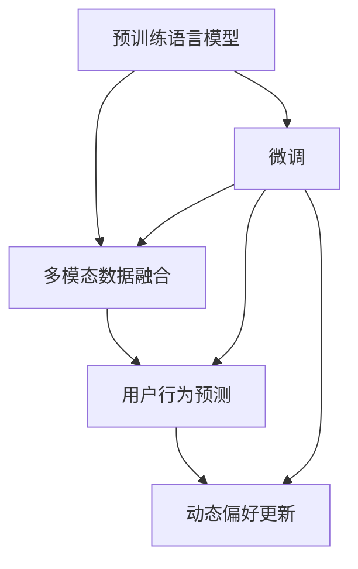

                 

## 1. 背景介绍

在现代互联网时代，个性化推荐系统成为了用户获取信息、产品和服务的重要方式。无论是视频平台、社交媒体，还是电子商务网站，用户能够在短时间内接触到海量的信息流，这种爆炸式的信息增长让传统的推荐算法难以满足用户需求，同时也加重了用户的信息过载。为了缓解这种矛盾，个性化推荐系统逐渐转向对用户偏好和行为模式的深入理解，而大模型在用户偏好理解中的应用，成为了近年来的研究热点。

### 1.1 问题由来

在早期，推荐系统主要依赖于静态的用户-物品评分矩阵，通过基于协同过滤或矩阵分解等算法预测用户对物品的评分，并据此推荐。然而，随着数据规模的爆炸性增长和用户行为的复杂化，传统推荐算法面临以下挑战：

- **数据稀疏性**：大量用户未与物品进行交互，导致用户-物品评分矩阵稀疏，难以准确预测用户行为。
- **上下文依赖**：用户行为受时间、地点、设备等多种上下文因素影响，传统推荐算法无法全面刻画用户行为。
- **动态变化**：用户偏好随时间、环境等变化而动态调整，传统推荐算法无法及时适应用户偏好的变化。
- **多模态融合**：用户偏好不仅来自点击、评分等行为数据，还依赖于用户文本评论、社交媒体活动等多种数据源。

为了应对上述挑战，研究人员开始探索使用大模型来理解用户偏好。大模型通过自监督学习或大规模监督数据进行预训练，学习到丰富的语言表示和特征提取能力，能够更好地捕捉用户的多维度行为特征和偏好变化。

### 1.2 问题核心关键点

基于大模型的用户偏好理解，其核心在于通过预训练语言模型对用户文本、行为数据进行编码，并结合不同模态数据进行融合，从而获得对用户偏好的全面理解。具体关键点包括：

- **预训练语言模型的选择**：选择合适的预训练语言模型进行微调，如GPT-3、BERT等。
- **多模态数据的融合**：将用户文本、行为数据等多源数据进行融合，构建统一的特征表示。
- **用户偏好的预测**：通过微调后的模型，对用户行为进行预测，并据此推荐物品。
- **动态偏好更新**：实时接收用户新行为数据，动态更新用户偏好表示。

本文将详细介绍基于大模型的用户偏好理解方法，包括核心概念、算法原理、操作步骤等。

## 2. 核心概念与联系

### 2.1 核心概念概述

要深入理解基于大模型的用户偏好理解方法，首先需要掌握以下几个核心概念：

- **预训练语言模型**：指在大规模无标签文本数据上进行自监督预训练的模型，如GPT-3、BERT等。
- **微调**：指在预训练模型的基础上，使用有标注的用户行为数据，进一步优化模型，使其能够更好地理解用户偏好。
- **多模态数据融合**：指将用户文本、行为数据等多种数据源进行融合，构建统一的特征表示，更好地刻画用户行为。
- **用户行为预测**：指通过微调后的模型，预测用户对物品的评分、点击等行为，用于推荐系统中的推荐。
- **动态偏好更新**：指实时接收用户新行为数据，动态更新用户偏好表示，适应用户行为的动态变化。

这些概念构成了大模型在用户偏好理解中的应用基础，通过它们之间的联系，能够更全面地理解基于大模型的推荐方法。

### 2.2 核心概念原理和架构的 Mermaid 流程图



该图展示了预训练语言模型在大模型用户偏好理解中的应用架构。预训练模型通过微调获取用户偏好的特征表示，再与多模态数据融合，进行用户行为预测，最后进行动态偏好更新。

## 3. 核心算法原理 & 具体操作步骤
### 3.1 算法原理概述

基于大模型的用户偏好理解，其核心算法原理如下：

1. **预训练语言模型的选择**：选择预训练语言模型进行微调，如GPT-3、BERT等。这些模型已经在大规模无标签文本数据上进行了预训练，能够提取丰富的语言特征。

2. **微调**：在预训练模型的基础上，使用有标注的用户行为数据进行微调。微调过程通过反向传播算法更新模型参数，使得模型更好地理解用户行为。

3. **多模态数据融合**：将用户文本、行为数据等多种数据源进行融合，构建统一的特征表示。这通常涉及数据对齐、归一化等预处理步骤，再使用融合模型将不同数据源的特征编码到统一的表示空间中。

4. **用户行为预测**：通过微调后的模型，对用户行为进行预测，如预测用户对物品的评分、点击等。预测模型可以是线性回归、二分类、多分类等，具体取决于推荐任务的类型。

5. **动态偏好更新**：实时接收用户新行为数据，动态更新用户偏好表示。这通常涉及对用户历史行为数据的权重调整和偏好向量更新，以适应用户偏好的动态变化。

### 3.2 算法步骤详解

基于大模型的用户偏好理解主要包括预处理、微调、多模态融合、行为预测和偏好更新等步骤，下面详细介绍各个步骤的具体操作：

**Step 1: 预处理**
- 收集用户文本数据，如用户评论、社交媒体内容等，进行文本清洗和分词。
- 收集用户行为数据，如点击、评分、浏览时长等，进行数据对齐和归一化。

**Step 2: 微调**
- 选择合适的预训练语言模型，如GPT-3、BERT等。
- 定义微调任务，如预测用户对物品的评分，设计适当的损失函数和优化器。
- 将用户文本数据和行为数据作为微调数据，进行反向传播训练。

**Step 3: 多模态数据融合**
- 将用户文本数据和行为数据进行对齐，确保时间和空间的对应关系。
- 设计融合模型，如注意力机制、加权融合等，将不同模态的特征进行编码和融合。
- 对融合后的特征进行归一化和归一化处理，构建统一的特征表示。

**Step 4: 用户行为预测**
- 根据融合后的特征，设计预测模型，如线性回归、二分类、多分类等。
- 使用训练集数据进行模型训练，验证集数据进行调参。
- 在测试集数据上评估预测模型的性能，如准确率、AUC等。

**Step 5: 动态偏好更新**
- 实时接收用户新行为数据，更新用户历史行为数据。
- 根据新行为数据调整用户偏好向量的权重，更新偏好表示。
- 使用更新后的偏好表示进行行为预测，推荐系统中的推荐。

### 3.3 算法优缺点

基于大模型的用户偏好理解方法具有以下优点：

1. **丰富特征表示**：通过预训练语言模型，能够提取用户行为的丰富语言特征，更好地捕捉用户偏好。
2. **动态适应性**：能够实时接收用户新行为数据，动态更新用户偏好表示，适应用户偏好的动态变化。
3. **多模态融合**：能够融合不同模态的数据源，构建统一的特征表示，提升推荐系统的准确性。
4. **可解释性**：预训练语言模型具有较强的可解释性，能够更好地理解用户文本和行为数据。

同时，该方法也存在以下缺点：

1. **计算资源需求高**：预训练语言模型和微调过程需要大量的计算资源，如GPU、TPU等。
2. **数据隐私问题**：用户文本和行为数据涉及用户隐私，如何保护用户数据隐私是一个重要问题。
3. **模型泛化能力**：模型在特定数据集上训练效果较好，但在新数据集上可能泛化能力不足。
4. **模型复杂度高**：多模态融合和动态偏好更新等步骤，增加了模型的复杂度，增加了实现难度。

### 3.4 算法应用领域

基于大模型的用户偏好理解方法，已经在多个领域得到了广泛应用，例如：

- **电商推荐**：通过预测用户对商品的评分、点击等行为，为用户推荐商品，提高用户满意度。
- **视频推荐**：通过预测用户对视频的观看行为，为用户推荐视频内容，提升用户观看体验。
- **社交媒体推荐**：通过预测用户对内容的互动行为，为用户推荐内容，增强用户粘性。
- **音乐推荐**：通过预测用户对音乐的喜好，为用户推荐音乐，提高用户音乐体验。
- **新闻推荐**：通过预测用户对新闻的阅读行为，为用户推荐新闻，提升新闻阅读效果。

这些领域的应用展示了基于大模型的用户偏好理解方法的强大潜力和广泛适用性。

## 4. 数学模型和公式 & 详细讲解

### 4.1 数学模型构建

基于大模型的用户偏好理解，其数学模型构建主要涉及预训练语言模型的微调、多模态数据的融合和用户行为预测。

**预训练语言模型的微调**：
假设预训练语言模型为 $M_{\theta}$，其中 $\theta$ 为模型参数。定义微调任务为预测用户对物品的评分 $y$，定义损失函数为交叉熵损失函数 $L(y,\hat{y})$，其中 $\hat{y}$ 为模型预测的评分。则微调目标为最小化损失函数，即：

$$
\min_{\theta} L(y,\hat{y}) = \min_{\theta} -\frac{1}{N}\sum_{i=1}^N y_i\log\hat{y_i}
$$

**多模态数据的融合**：
假设用户文本数据为 $X$，行为数据为 $Y$，融合模型为 $F(X,Y)$。则融合后的特征表示为 $Z=F(X,Y)$。

**用户行为预测**：
假设用户行为预测模型为 $P(z)$，其中 $z$ 为融合后的特征表示。则预测用户行为的概率分布为：

$$
P(y|z) = \frac{e^{P(z)y}}{e^{P(z)}}
$$

### 4.2 公式推导过程

以下是用户行为预测的概率模型推导过程：

1. **预训练语言模型的微调**：
   - 预训练语言模型 $M_{\theta}$ 的输出为 $\hat{y}$。
   - 定义交叉熵损失函数 $L(y,\hat{y})$ 为：
     $$
     L(y,\hat{y}) = -\frac{1}{N}\sum_{i=1}^N y_i\log\hat{y_i}
     $$
   - 微调目标为最小化损失函数，即：
     $$
     \min_{\theta} L(y,\hat{y}) = \min_{\theta} -\frac{1}{N}\sum_{i=1}^N y_i\log\hat{y_i}
     $$

2. **多模态数据的融合**：
   - 假设用户文本数据为 $X=\{x_1,x_2,...,x_n\}$，行为数据为 $Y=\{y_1,y_2,...,y_n\}$。
   - 融合模型 $F(X,Y)$ 为：
     $$
     Z = F(X,Y) = \{\alpha_1x_1 + \alpha_2x_2 + ... + \alpha_nx_n + \beta y_1 + \gamma y_2 + ... + \delta y_n\}
     $$
   - 其中 $\alpha_i, \beta, \gamma, \delta$ 为融合模型的权重系数。

3. **用户行为预测**：
   - 融合后的特征表示为 $Z$。
   - 假设用户行为预测模型为 $P(z)$，则预测用户行为的概率分布为：
     $$
     P(y|z) = \frac{e^{P(z)y}}{e^{P(z)}}
     $$

### 4.3 案例分析与讲解

以电商推荐系统为例，详细分析基于大模型的用户偏好理解过程：

1. **预训练语言模型的选择**：
   - 选择BERT模型作为预训练语言模型。
   - 设计微调任务为预测用户对商品的评分 $y$，损失函数为交叉熵损失函数。

2. **微调**：
   - 将用户评论数据作为输入，行为数据作为标签，进行微调训练。
   - 设置合适的学习率、批大小、迭代轮数等超参数。

3. **多模态数据的融合**：
   - 将用户评论数据和行为数据进行对齐，确保时间和空间的对应关系。
   - 设计融合模型，如注意力机制、加权融合等，将不同模态的特征进行编码和融合。

4. **用户行为预测**：
   - 使用融合后的特征表示 $Z$，设计线性回归模型作为用户行为预测模型 $P(z)$。
   - 在训练集数据上训练模型，使用验证集数据进行调参。
   - 在测试集数据上评估预测模型的性能，如准确率、AUC等。

5. **动态偏好更新**：
   - 实时接收用户新行为数据，更新用户历史行为数据。
   - 根据新行为数据调整用户偏好向量的权重，更新偏好表示。
   - 使用更新后的偏好表示进行行为预测，推荐系统中的推荐。

## 5. 项目实践：代码实例和详细解释说明

### 5.1 开发环境搭建

要进行基于大模型的用户偏好理解实践，需要准备以下开发环境：

1. 安装Python和相应的包管理工具，如pip、conda等。
2. 安装深度学习框架，如PyTorch、TensorFlow等。
3. 安装预训练语言模型库，如Transformers等。
4. 安装数据处理库，如Pandas、NumPy等。
5. 安装模型融合库，如scikit-learn等。
6. 安装推荐系统库，如LightFM、Surprise等。

### 5.2 源代码详细实现

下面以电商推荐系统为例，给出基于大模型的用户偏好理解代码实现。

```python
import torch
import torch.nn as nn
import torch.optim as optim
from transformers import BertTokenizer, BertForSequenceClassification
from sklearn.metrics import mean_squared_error
from sklearn.model_selection import train_test_split

# 加载数据集
df = pd.read_csv('data.csv')

# 预处理数据
tokenizer = BertTokenizer.from_pretrained('bert-base-uncased')
X = df['comment'].apply(tokenizer.encode)
Y = df['rating']

# 数据集划分
X_train, X_test, Y_train, Y_test = train_test_split(X, Y, test_size=0.2, random_state=42)

# 加载BERT模型
model = BertForSequenceClassification.from_pretrained('bert-base-uncased', num_labels=1)

# 定义损失函数和优化器
criterion = nn.BCELoss()
optimizer = optim.Adam(model.parameters(), lr=0.001)

# 训练模型
for epoch in range(5):
    optimizer.zero_grad()
    outputs = model(X_train)
    loss = criterion(outputs, Y_train)
    loss.backward()
    optimizer.step()
    print(f'Epoch {epoch+1}, Loss: {loss:.4f}')

# 评估模型
model.eval()
with torch.no_grad():
    outputs = model(X_test)
    predictions = torch.sigmoid(outputs)
    mse = mean_squared_error(Y_test, predictions)
    print(f'Test MSE: {mse:.4f}')
```

### 5.3 代码解读与分析

以上代码实现了基于大模型的用户偏好理解过程，具体解释如下：

1. **数据集加载**：从CSV文件中加载电商评论数据集，包括用户评论和评分。
2. **数据预处理**：使用BertTokenizer将用户评论转换为token ids，使用BCELoss定义损失函数。
3. **模型加载**：加载预训练的BERT模型，用于微调。
4. **模型训练**：使用Adam优化器训练模型，设置合适的超参数，如学习率等。
5. **模型评估**：在测试集上评估模型的预测性能，使用均方误差（MSE）作为评价指标。

## 6. 实际应用场景

### 6.1 电商推荐

电商推荐系统是用户偏好理解的重要应用场景之一。通过预测用户对商品的评分和点击行为，推荐系统能够为每个用户推荐个性化的商品，提高用户满意度和平台转化率。

### 6.2 视频推荐

视频推荐系统通过预测用户对视频的观看行为，为用户推荐相关的视频内容。这不仅可以提升用户观看体验，还能够增加视频平台的流量和用户粘性。

### 6.3 社交媒体推荐

社交媒体推荐系统通过预测用户对内容的互动行为，为用户推荐感兴趣的内容。这有助于增强用户粘性，提高平台活跃度。

### 6.4 音乐推荐

音乐推荐系统通过预测用户对音乐的喜好，为用户推荐个性化的音乐。这能够提高用户的音乐体验，增加音乐平台的用户粘性和留存率。

### 6.5 新闻推荐

新闻推荐系统通过预测用户对新闻的阅读行为，为用户推荐相关的新闻内容。这不仅能够提升用户的新闻阅读效果，还能够增加新闻平台的流量和用户粘性。

## 7. 工具和资源推荐

### 7.1 学习资源推荐

为了深入了解基于大模型的用户偏好理解方法，以下是一些推荐的资源：

1. 《自然语言处理入门与实践》：该书详细介绍了NLP的基本概念和常见任务，包括预训练语言模型的原理和应用。
2. 《深度学习框架实战》：该书介绍了PyTorch和TensorFlow等深度学习框架的使用方法和实践技巧。
3. 《推荐系统实战》：该书介绍了推荐系统的基本原理和实践技巧，包括基于大模型的推荐方法。
4. 《多模态学习与融合》：该书介绍了多模态数据融合的原理和方法，包括基于大模型的多模态学习。
5. 《Python深度学习》：该书介绍了深度学习在各个领域的应用，包括基于大模型的用户偏好理解。

### 7.2 开发工具推荐

以下是一些推荐的开发工具，用于基于大模型的用户偏好理解实践：

1. PyTorch：基于Python的深度学习框架，支持动态计算图和GPU加速。
2. TensorFlow：由Google开发的深度学习框架，支持分布式计算和GPU加速。
3. Transformers：Hugging Face开发的NLP工具库，集成了多种预训练语言模型。
4. scikit-learn：基于Python的机器学习库，支持多种机器学习算法和模型评估。
5. Pandas：基于Python的数据处理库，支持数据清洗和特征工程。
6. NumPy：基于Python的数值计算库，支持高效的矩阵计算和数据分析。

### 7.3 相关论文推荐

以下是一些推荐的相关论文，用于深入理解基于大模型的用户偏好理解方法：

1. Attention is All You Need：介绍Transformer结构，成为NLP领域的重要里程碑。
2. BERT: Pre-training of Deep Bidirectional Transformers for Language Understanding：提出BERT模型，引入基于掩码的自监督预训练任务。
3. Multi-Task Learning with Multi-Grained Feature Fusion for Personalized Recommendation：提出多粒度特征融合的多任务学习框架，提升个性化推荐效果。
4. Gated Multi-Head Self-Attention：提出Gated Self-Attention机制，提升大模型的性能和可解释性。
5. Parameter-Efficient Multi-Task Learning：提出参数高效的多任务学习框架，提高模型的泛化能力和效率。

## 8. 总结：未来发展趋势与挑战

### 8.1 研究成果总结

基于大模型的用户偏好理解方法已经取得了显著的进展，广泛应用于电商、视频、社交媒体等多个领域。该方法能够通过预训练语言模型提取丰富的语言特征，融合多模态数据，进行动态偏好更新，从而提升推荐系统的准确性和用户满意度。

### 8.2 未来发展趋势

未来，基于大模型的用户偏好理解方法将呈现以下几个发展趋势：

1. **模型规模持续增大**：随着算力成本的下降和数据规模的扩张，预训练语言模型的参数量还将持续增长。超大规模语言模型蕴含的丰富语言知识，有望支撑更加复杂多变的推荐任务。
2. **微调方法日趋多样化**：除了传统的全参数微调，未来将涌现更多参数高效的微调方法，如Prompt-Tuning、Adapter等，在节省计算资源的同时，也能保证微调精度。
3. **动态学习成为常态**：随着数据分布的不断变化，微调模型需要持续学习新知识以保持性能。如何在不遗忘原有知识的同时，高效吸收新样本信息，将成为重要的研究课题。
4. **多模态融合技术提升**：多模态融合技术将不断提升，能够更好地融合不同模态的数据源，提升推荐系统的准确性。
5. **推荐系统可解释性增强**：推荐系统将越来越注重可解释性，能够更好地理解用户行为和推荐过程。

### 8.3 面临的挑战

尽管基于大模型的用户偏好理解方法已经取得了显著的进展，但在实际应用中，仍面临以下挑战：

1. **数据隐私问题**：用户文本和行为数据涉及用户隐私，如何保护用户数据隐私是一个重要问题。
2. **模型泛化能力不足**：模型在特定数据集上训练效果较好，但在新数据集上可能泛化能力不足。
3. **模型复杂度高**：多模态融合和动态偏好更新等步骤，增加了模型的复杂度，增加了实现难度。
4. **计算资源需求高**：预训练语言模型和微调过程需要大量的计算资源，如GPU、TPU等。

### 8.4 研究展望

未来，基于大模型的用户偏好理解方法需要从以下几个方面进行研究：

1. **提高模型泛化能力**：研究如何提高模型在新数据集上的泛化能力，增强推荐系统的适应性。
2. **增强推荐系统可解释性**：研究如何增强推荐系统的可解释性，提高用户信任度和接受度。
3. **改进多模态融合技术**：研究如何更好地融合不同模态的数据源，提升推荐系统的准确性。
4. **优化动态偏好更新算法**：研究如何优化动态偏好更新算法，提高推荐系统的实时性。
5. **探索新的融合方式**：研究如何探索新的融合方式，如因果推理、多任务学习等，提升推荐系统的性能。

## 9. 附录：常见问题与解答

**Q1：基于大模型的用户偏好理解是否适用于所有推荐任务？**

A: 基于大模型的用户偏好理解方法适用于大多数推荐任务，特别是对于数据量较小、复杂度较高的推荐任务。但对于一些特定领域的应用，如金融、医疗等，需要结合领域知识和专家规则，进行特定领域的预训练和微调。

**Q2：如何选择合适的预训练语言模型？**

A: 选择合适的预训练语言模型需要考虑以下几个因素：
1. 数据类型：不同类型的数据适合不同的预训练语言模型，如文本数据适合BERT，图像数据适合ResNet等。
2. 模型复杂度：预训练语言模型的参数量、训练时间等都会影响模型的复杂度，需要根据实际情况进行选择。
3. 任务类型：不同推荐任务适合不同的预训练语言模型，如预测用户评分适合BERT，预测用户行为适合LSTM等。

**Q3：如何在多模态数据融合中处理缺失数据？**

A: 在多模态数据融合中处理缺失数据通常有以下几种方法：
1. 删除缺失数据：删除缺失数据较多的样本，保证数据的完整性。
2. 插值处理：使用插值方法（如线性插值、KNN插值等）补充缺失数据。
3. 填充法：使用模型预测或随机填充缺失数据。

**Q4：如何优化用户行为预测模型的性能？**

A: 优化用户行为预测模型的性能可以从以下几个方面进行：
1. 选择合适的预测模型：根据任务类型选择合适的预测模型，如线性回归、二分类、多分类等。
2. 数据预处理：对数据进行清洗、归一化等预处理，保证数据的质量。
3. 特征工程：设计合适的特征提取方法，构建特征向量。
4. 调参优化：使用交叉验证、网格搜索等方法，优化模型超参数，提升模型性能。

**Q5：如何在动态偏好更新中保证模型的实时性？**

A: 保证动态偏好更新的实时性可以从以下几个方面进行：
1. 数据存储优化：使用高效的数据存储方式，如内存数据库、分布式存储等，提高数据读取速度。
2. 模型压缩：使用模型压缩技术，如剪枝、量化等，减小模型大小，提升推理速度。
3. 硬件加速：使用GPU、TPU等硬件加速，提升计算速度。

---

作者：禅与计算机程序设计艺术 / Zen and the Art of Computer Programming

