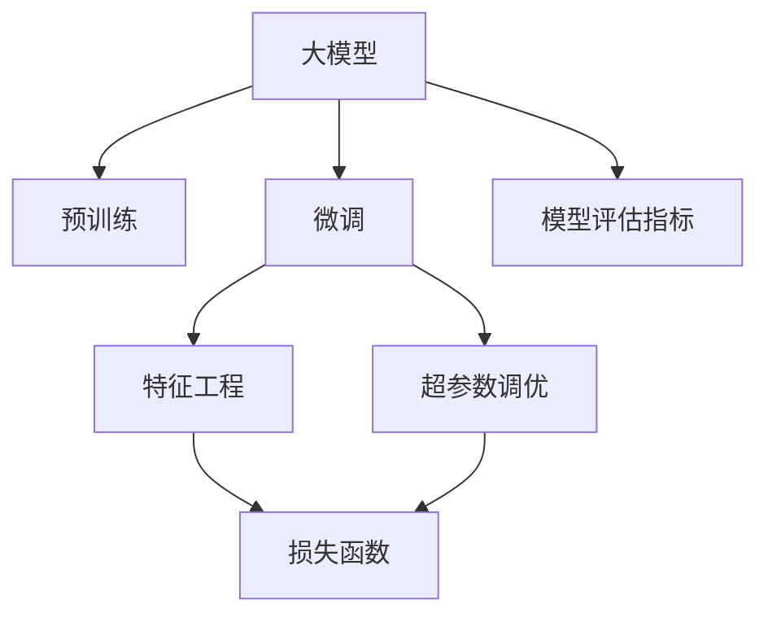

                 

# 大模型在电商平台会员等级预测中的应用

## 1. 背景介绍

### 1.1 问题由来
在当前激烈竞争的电商平台环境下，用户会员等级预测成为了一种重要的用户画像分析手段。精确的会员等级预测可以帮助电商平台更好地理解用户行为和价值，实现个性化推荐、精准营销和提升用户粘性。传统的会员等级预测方法依赖于统计学特征和手工规则，难以捕捉用户行为的复杂性和多维性。随着深度学习技术的普及，大模型成为这一问题的有力工具。

### 1.2 问题核心关键点
大模型在会员等级预测中，本质上是一种利用用户行为数据和上下文特征进行预训练学习，并结合会员等级标注数据进行微调，以预测新用户等级的模型。该方法的核心在于如何高效利用大模型的学习能力，同时避免过拟合和模型泛化能力不足的问题。

### 1.3 问题研究意义
研究大模型在会员等级预测中的应用，可以提升电商平台的客户细分、推荐系统和营销策略的精准度。具体意义包括：

1. 提高客户细分准确性。大模型能够利用海量用户行为数据进行深度学习，更准确地识别用户的不同等级。
2. 提升个性化推荐效果。根据用户会员等级，可以针对性推荐不同的商品和优惠，增强用户体验。
3. 优化营销策略。准确预测用户等级，有助于精准投放广告和优惠券，提升广告投资回报率。
4. 增强用户粘性。通过个性化服务和精准营销，提升用户满意度和忠诚度。

## 2. 核心概念与联系

### 2.1 核心概念概述

为更好地理解大模型在会员等级预测中的应用，本节将介绍几个关键概念：

- **大模型**：指基于Transformer架构的深度学习模型，如BERT、GPT等。通过在大规模无标签数据上进行预训练，学习通用语言表示，具备强大的学习能力。
- **预训练**：指在大规模无标签数据上进行自监督学习任务，学习模型初始化参数的过程。预训练使得模型学习到通用的语言表示，适用于多种下游任务。
- **微调**：指在预训练模型的基础上，结合特定任务的数据进行有监督学习，优化模型在特定任务上的性能。在会员等级预测中，微调使模型学习到与用户行为相关的特征。
- **特征工程**：指在构建模型前，对原始数据进行转换、归一化等处理，提取有意义的特征，提升模型的预测能力。
- **超参数调优**：指通过网格搜索、贝叶斯优化等方法，寻找最优的模型超参数组合，如学习率、批大小等。
- **损失函数**：指评估模型预测与真实标签之间差异的函数，如交叉熵损失、均方误差等。
- **模型评估指标**：指用于衡量模型预测效果的指标，如准确率、召回率、F1值等。

这些核心概念之间的逻辑关系可以通过以下Mermaid流程图来展示：



这个流程图展示了大模型在会员等级预测中的核心概念及其之间的关系：

1. 大模型通过预训练获得基础能力。
2. 微调是大模型学习特定任务的关键步骤。
3. 特征工程是提升模型预测能力的基础工作。
4. 超参数调优通过寻找最优配置，使模型在有限资源下性能最优。
5. 损失函数和模型评估指标用于衡量和调整模型预测效果。

这些概念共同构成了大模型在会员等级预测中的应用框架，使其能够充分利用数据和学习能力，实现高效预测。

## 3. 核心算法原理 & 具体操作步骤

### 3.1 算法原理概述

基于大模型的会员等级预测，本质上是一种利用大模型预训练学习到的通用表示，结合用户行为特征进行微调，以预测用户等级的模型。其核心思想是：将用户行为数据输入预训练的大模型中，通过有监督的微调过程，优化模型预测结果，使其更接近真实标签。

形式化地，假设大模型为 $M_{\theta}$，用户行为特征为 $\mathcal{X}$，用户会员等级为 $\mathcal{Y}$。设训练集为 $D=\{(x_i, y_i)\}_{i=1}^N$，其中 $x_i \in \mathcal{X}$，$y_i \in \mathcal{Y}$。微调的目标是找到最优参数 $\hat{\theta}$，使得：

$$
\hat{\theta} = \mathop{\arg\min}_{\theta} \mathcal{L}(M_{\theta}, D)
$$

其中 $\mathcal{L}$ 为针对会员等级预测任务的损失函数，用于衡量模型预测输出与真实标签之间的差异。常见的损失函数包括交叉熵损失、均方误差损失等。

### 3.2 算法步骤详解

基于大模型的会员等级预测一般包括以下几个关键步骤：

**Step 1: 数据预处理**

- 收集用户行为数据，如浏览记录、点击记录、购买记录等，并转换为适合模型输入的格式。
- 对用户行为数据进行归一化、截断等预处理，保证输入数据的一致性。
- 划分训练集、验证集和测试集，保证模型在数据集上的泛化能力。

**Step 2: 特征提取**

- 选择合适的特征提取方式，如文本向量提取、时间序列分析等，将用户行为数据转换为模型可以处理的形式。
- 对提取的特征进行维度归一化和降维处理，减少特征维度，提升模型训练效率。
- 结合领域知识和业务理解，对提取的特征进行选择和组合，提升特征表征能力。

**Step 3: 模型初始化**

- 选择合适的预训练大模型，如BERT、GPT等，作为模型初始化参数。
- 将用户行为特征输入预训练模型，通过特征映射得到模型表示 $z_i = M_{\theta}(x_i)$。
- 初始化微调层，通常是全连接层或LSTM等，用于学习用户会员等级映射。

**Step 4: 微调优化**

- 设置微调超参数，如学习率、批大小、迭代轮数等。
- 应用正则化技术，如L2正则、Dropout等，防止模型过拟合。
- 使用监督数据集进行有监督的微调训练，更新模型参数。
- 周期性在验证集上评估模型性能，根据性能指标决定是否触发Early Stopping。
- 重复上述步骤直至满足预设的迭代轮数或Early Stopping条件。

**Step 5: 模型评估**

- 在测试集上评估微调后的模型 $M_{\hat{\theta}}$ 的性能，对比微调前后的精度提升。
- 使用模型预测新用户的会员等级，集成到实际的应用系统中。
- 持续收集新的用户行为数据，定期重新微调模型，以适应数据分布的变化。

以上是基于大模型的会员等级预测的一般流程。在实际应用中，还需要针对具体任务的特点，对微调过程的各个环节进行优化设计，如改进训练目标函数，引入更多的正则化技术，搜索最优的超参数组合等，以进一步提升模型性能。

### 3.3 算法优缺点

基于大模型的会员等级预测具有以下优点：

1. 模型效果显著。得益于大模型的广泛预训练能力，微调后的模型能够更好地理解用户行为，实现精准的会员等级预测。
2. 数据利用率高。大模型可以充分利用用户行为数据，挖掘深层次的关联特征，提升预测准确性。
3. 应用范围广泛。适用于各种电商平台的用户行为分析，能够为不同规模的电商企业提供定制化解决方案。

同时，该方法也存在一定的局限性：

1. 数据质量要求高。预训练和微调模型对数据质量和完整性有较高要求，缺乏高质量的数据可能影响模型性能。
2. 模型复杂度高。大模型的计算资源需求高，需要高性能的计算设备和算力支持。
3. 模型解释性不足。大模型通常是"黑盒"系统，难以解释其内部决策逻辑，增加了应用的可解释性挑战。
4. 训练成本高。预训练和微调过程需要大量的计算资源和时间，增加了实际应用的成本。

尽管存在这些局限性，但就目前而言，基于大模型的会员等级预测仍是大数据时代解决用户画像分析问题的有效手段。未来相关研究的重点在于如何进一步降低数据和计算成本，提高模型的可解释性和泛化能力，同时兼顾用户隐私保护。

### 3.4 算法应用领域

基于大模型的会员等级预测，在电商平台的会员管理、个性化推荐、精准营销等多个环节中得到了广泛应用，具体应用场景包括：

1. **用户分层分析**：将用户按会员等级进行分层，识别高价值用户和潜在流失用户，制定不同的营销策略。
2. **个性化推荐**：根据用户会员等级，推荐不同类型和价格的商品，提升用户体验和转化率。
3. **精准广告投放**：通过会员等级预测，精准定位用户兴趣和需求，实现广告的个性化投放，提升广告效果。
4. **用户生命周期管理**：预测用户生命周期各阶段的变化，制定相应的运营策略，提升用户留存率。
5. **库存优化**：根据会员等级预测用户购买意愿，优化库存管理，避免缺货和过剩。

除了上述这些经典应用场景外，大模型在会员等级预测方面的创新应用还包括联合推荐、欺诈检测、用户行为分析等，为电商平台带来了新的业务增长点。

## 4. 数学模型和公式 & 详细讲解  
### 4.1 数学模型构建

本节将使用数学语言对基于大模型的会员等级预测过程进行更加严格的刻画。

假设大模型为 $M_{\theta}$，用户行为特征为 $\mathcal{X}$，用户会员等级为 $\mathcal{Y}$。设训练集为 $D=\{(x_i, y_i)\}_{i=1}^N$，其中 $x_i \in \mathcal{X}$，$y_i \in \mathcal{Y}$。

定义模型 $M_{\theta}$ 在输入 $x$ 上的输出为 $z_i = M_{\theta}(x_i)$。

微调的目标是找到最优参数 $\hat{\theta}$，使得：

$$
\hat{\theta} = \mathop{\arg\min}_{\theta} \mathcal{L}(M_{\theta}, D)
$$

其中 $\mathcal{L}$ 为针对会员等级预测任务的损失函数，用于衡量模型预测输出与真实标签之间的差异。常见的损失函数包括交叉熵损失、均方误差损失等。

$$
\mathcal{L}(M_{\theta}, D) = \frac{1}{N}\sum_{i=1}^N \ell(M_{\theta}(x_i), y_i)
$$

在实践中，我们通常使用基于梯度的优化算法（如SGD、Adam等）来近似求解上述最优化问题。设 $\eta$ 为学习率，$\lambda$ 为正则化系数，则参数的更新公式为：

$$
\theta \leftarrow \theta - \eta \nabla_{\theta}\mathcal{L}(\theta) - \eta\lambda\theta
$$

其中 $\nabla_{\theta}\mathcal{L}(\theta)$ 为损失函数对参数 $\theta$ 的梯度，可通过反向传播算法高效计算。

### 4.2 公式推导过程

以下我们以二分类任务为例，推导交叉熵损失函数及其梯度的计算公式。

假设模型 $M_{\theta}$ 在输入 $x$ 上的输出为 $\hat{y}=M_{\theta}(x)$，表示样本属于正类的概率。真实标签 $y \in \{0,1\}$。则二分类交叉熵损失函数定义为：

$$
\ell(M_{\theta}(x),y) = -[y\log \hat{y} + (1-y)\log (1-\hat{y})]
$$

将其代入经验风险公式，得：

$$
\mathcal{L}(\theta) = -\frac{1}{N}\sum_{i=1}^N [y_i\log M_{\theta}(x_i)+(1-y_i)\log(1-M_{\theta}(x_i))]
$$

根据链式法则，损失函数对参数 $\theta_k$ 的梯度为：

$$
\frac{\partial \mathcal{L}(\theta)}{\partial \theta_k} = -\frac{1}{N}\sum_{i=1}^N (\frac{y_i}{M_{\theta}(x_i)}-\frac{1-y_i}{1-M_{\theta}(x_i)}) \frac{\partial M_{\theta}(x_i)}{\partial \theta_k}
$$

其中 $\frac{\partial M_{\theta}(x_i)}{\partial \theta_k}$ 可进一步递归展开，利用自动微分技术完成计算。

在得到损失函数的梯度后，即可带入参数更新公式，完成模型的迭代优化。重复上述过程直至收敛，最终得到适应会员等级预测的最优模型参数 $\hat{\theta}$。

## 5. 项目实践：代码实例和详细解释说明

### 5.1 开发环境搭建

在进行会员等级预测的微调实践前，我们需要准备好开发环境。以下是使用Python进行PyTorch开发的环境配置流程：

1. 安装Anaconda：从官网下载并安装Anaconda，用于创建独立的Python环境。

2. 创建并激活虚拟环境：
```bash
conda create -n pytorch-env python=3.8 
conda activate pytorch-env
```

3. 安装PyTorch：根据CUDA版本，从官网获取对应的安装命令。例如：
```bash
conda install pytorch torchvision torchaudio cudatoolkit=11.1 -c pytorch -c conda-forge
```

4. 安装Transformers库：
```bash
pip install transformers
```

5. 安装各类工具包：
```bash
pip install numpy pandas scikit-learn matplotlib tqdm jupyter notebook ipython
```

完成上述步骤后，即可在`pytorch-env`环境中开始会员等级预测的微调实践。

### 5.2 源代码详细实现

这里我们以会员等级预测任务为例，给出使用Transformers库对BERT模型进行微调的PyTorch代码实现。

首先，定义会员等级预测任务的训练集：

```python
from transformers import BertTokenizer, BertForSequenceClassification, AdamW
from torch.utils.data import Dataset, DataLoader

class MembershipDataset(Dataset):
    def __init__(self, texts, labels):
        self.tokenizer = BertTokenizer.from_pretrained('bert-base-uncased')
        self.texts = texts
        self.labels = labels
        
    def __len__(self):
        return len(self.texts)
    
    def __getitem__(self, idx):
        text = self.texts[idx]
        label = self.labels[idx]
        
        encoding = self.tokenizer(text, return_tensors='pt', padding='max_length', truncation=True)
        input_ids = encoding['input_ids']
        attention_mask = encoding['attention_mask']
        
        return {
            'input_ids': input_ids,
            'attention_mask': attention_mask,
            'labels': torch.tensor(label, dtype=torch.long)
        }
```

然后，定义模型和优化器：

```python
model = BertForSequenceClassification.from_pretrained('bert-base-uncased', num_labels=2)
optimizer = AdamW(model.parameters(), lr=2e-5)
```

接着，定义训练和评估函数：

```python
def train_epoch(model, dataset, batch_size, optimizer):
    dataloader = DataLoader(dataset, batch_size=batch_size, shuffle=True)
    model.train()
    epoch_loss = 0
    for batch in dataloader:
        input_ids = batch['input_ids'].to(device)
        attention_mask = batch['attention_mask'].to(device)
        labels = batch['labels'].to(device)
        model.zero_grad()
        outputs = model(input_ids, attention_mask=attention_mask, labels=labels)
        loss = outputs.loss
        epoch_loss += loss.item()
        loss.backward()
        optimizer.step()
    return epoch_loss / len(dataloader)

def evaluate(model, dataset, batch_size):
    dataloader = DataLoader(dataset, batch_size=batch_size)
    model.eval()
    preds, labels = [], []
    with torch.no_grad():
        for batch in dataloader:
            input_ids = batch['input_ids'].to(device)
            attention_mask = batch['attention_mask'].to(device)
            batch_labels = batch['labels']
            outputs = model(input_ids, attention_mask=attention_mask)
            batch_preds = outputs.logits.argmax(dim=1).to('cpu').tolist()
            batch_labels = batch_labels.to('cpu').tolist()
            for pred, label in zip(batch_preds, batch_labels):
                preds.append(pred)
                labels.append(label)
                
    print(classification_report(labels, preds))
```

最后，启动训练流程并在测试集上评估：

```python
epochs = 5
batch_size = 16

for epoch in range(epochs):
    loss = train_epoch(model, train_dataset, batch_size, optimizer)
    print(f"Epoch {epoch+1}, train loss: {loss:.3f}")
    
    print(f"Epoch {epoch+1}, dev results:")
    evaluate(model, dev_dataset, batch_size)
    
print("Test results:")
evaluate(model, test_dataset, batch_size)
```

以上就是使用PyTorch对BERT进行会员等级预测任务微调的完整代码实现。可以看到，得益于Transformers库的强大封装，我们可以用相对简洁的代码完成BERT模型的加载和微调。

### 5.3 代码解读与分析

让我们再详细解读一下关键代码的实现细节：

**MembershipDataset类**：
- `__init__`方法：初始化文本、标签和分词器等关键组件。
- `__len__`方法：返回数据集的样本数量。
- `__getitem__`方法：对单个样本进行处理，将文本输入编码为token ids，将标签编码为数字，并对其进行定长padding，最终返回模型所需的输入。

**标签处理**：
- 将标签转换为数字，并进行one-hot编码。

**训练和评估函数**：
- 使用PyTorch的DataLoader对数据集进行批次化加载，供模型训练和推理使用。
- 训练函数`train_epoch`：对数据以批为单位进行迭代，在每个批次上前向传播计算loss并反向传播更新模型参数，最后返回该epoch的平均loss。
- 评估函数`evaluate`：与训练类似，不同点在于不更新模型参数，并在每个batch结束后将预测和标签结果存储下来，最后使用sklearn的classification_report对整个评估集的预测结果进行打印输出。

**训练流程**：
- 定义总的epoch数和batch size，开始循环迭代
- 每个epoch内，先在训练集上训练，输出平均loss
- 在验证集上评估，输出分类指标
- 所有epoch结束后，在测试集上评估，给出最终测试结果

可以看到，PyTorch配合Transformers库使得BERT微调的代码实现变得简洁高效。开发者可以将更多精力放在数据处理、模型改进等高层逻辑上，而不必过多关注底层的实现细节。

当然，工业级的系统实现还需考虑更多因素，如模型的保存和部署、超参数的自动搜索、更灵活的任务适配层等。但核心的微调范式基本与此类似。

## 6. 实际应用场景
### 6.1 智能客服系统

基于大模型的会员等级预测，可以为智能客服系统提供更精准的用户画像。智能客服系统通过分析用户行为数据，预测用户会员等级，并根据不同等级的用户，定制化回复和服务，提升用户体验和满意度。

在技术实现上，可以收集用户的浏览记录、点击记录、购买记录等行为数据，将数据作为模型输入，使用大模型进行会员等级预测。预测结果用于指导智能客服系统进行个性化服务，如提供推荐商品、优惠活动等。

### 6.2 个性化推荐系统

会员等级预测在个性化推荐系统中也发挥着重要作用。通过分析用户的购买记录、浏览历史等行为数据，预测用户的会员等级，并根据等级提供个性化的推荐服务。对于高等级用户，可以推荐更多高价值商品，提升用户的转化率和满意度。

在推荐算法中，会员等级预测可以作为用户画像的一部分，与其他特征结合使用，进行多维度推荐。例如，可以根据会员等级和兴趣标签，推荐不同类型和价格的商品，提升推荐效果。

### 6.3 市场营销策略优化

通过会员等级预测，电商平台可以更好地理解不同等级用户的购买偏好和行为特征，制定更加精准的营销策略。例如，对于新用户，可以通过会员等级预测，识别潜在的流失用户，提供针对性的挽留策略。对于高价值用户，可以设计专属优惠和活动，提升用户粘性和忠诚度。

在营销策略优化中，会员等级预测可以作为用户分群的重要依据，结合用户的消费行为和心理特征，进行差异化的营销设计。例如，对于不同等级的会员，设计不同的广告素材和推广渠道，提升广告效果和投资回报率。

### 6.4 未来应用展望

随着大模型在会员等级预测中的不断优化和应用，未来将有以下发展趋势：

1. 多模态数据融合。结合用户行为数据和社交网络数据，提升预测的准确性和泛化能力。
2. 跨平台数据整合。通过用户跨平台行为数据的整合，构建更加全面和连贯的用户画像。
3. 实时预测系统。建立实时数据处理和预测系统，提升预测的及时性和响应速度。
4. 模型集成与优化。通过模型集成和优化，提升预测的稳定性和鲁棒性。
5. 模型监控与迭代。建立模型监控和迭代机制，持续改进预测模型，保持其预测效果和性能。

这些趋势将进一步拓展大模型在会员等级预测中的应用场景，推动电商平台向更加智能化、个性化的方向发展。

## 7. 工具和资源推荐
### 7.1 学习资源推荐

为了帮助开发者系统掌握大模型在会员等级预测中的应用，这里推荐一些优质的学习资源：

1. 《Natural Language Processing with Transformers》书籍：由Transformers库的作者所著，全面介绍了如何使用Transformers库进行NLP任务开发，包括会员等级预测在内的诸多范式。

2. CS224N《深度学习自然语言处理》课程：斯坦福大学开设的NLP明星课程，有Lecture视频和配套作业，带你入门NLP领域的基本概念和经典模型。

3. 《Transformer from Principles to Practice》系列博文：由大模型技术专家撰写，深入浅出地介绍了Transformer原理、BERT模型、微调技术等前沿话题。

4. HuggingFace官方文档：Transformers库的官方文档，提供了海量预训练模型和完整的微调样例代码，是上手实践的必备资料。

5. Kaggle会员等级预测竞赛：参加会员等级预测竞赛，实战练习大模型在会员等级预测中的应用，提升实际能力。

通过对这些资源的学习实践，相信你一定能够快速掌握大模型在会员等级预测中的精髓，并用于解决实际的电商问题。
### 7.2 开发工具推荐

高效的开发离不开优秀的工具支持。以下是几款用于会员等级预测开发的常用工具：

1. PyTorch：基于Python的开源深度学习框架，灵活动态的计算图，适合快速迭代研究。大部分预训练语言模型都有PyTorch版本的实现。

2. TensorFlow：由Google主导开发的开源深度学习框架，生产部署方便，适合大规模工程应用。同样有丰富的预训练语言模型资源。

3. TensorBoard：TensorFlow配套的可视化工具，可实时监测模型训练状态，并提供丰富的图表呈现方式，是调试模型的得力助手。

4. Weights & Biases：模型训练的实验跟踪工具，可以记录和可视化模型训练过程中的各项指标，方便对比和调优。与主流深度学习框架无缝集成。

5. Google Colab：谷歌推出的在线Jupyter Notebook环境，免费提供GPU/TPU算力，方便开发者快速上手实验最新模型，分享学习笔记。

合理利用这些工具，可以显著提升会员等级预测的开发效率，加快创新迭代的步伐。

### 7.3 相关论文推荐

大模型在会员等级预测中的应用源于学界的持续研究。以下是几篇奠基性的相关论文，推荐阅读：

1. Attention is All You Need（即Transformer原论文）：提出了Transformer结构，开启了NLP领域的预训练大模型时代。

2. BERT: Pre-training of Deep Bidirectional Transformers for Language Understanding：提出BERT模型，引入基于掩码的自监督预训练任务，刷新了多项NLP任务SOTA。

3. Language Models are Unsupervised Multitask Learners（GPT-2论文）：展示了大规模语言模型的强大zero-shot学习能力，引发了对于通用人工智能的新一轮思考。

4. Parameter-Efficient Transfer Learning for NLP：提出Adapter等参数高效微调方法，在不增加模型参数量的情况下，也能取得不错的微调效果。

5. AdaLoRA: Adaptive Low-Rank Adaptation for Parameter-Efficient Fine-Tuning：使用自适应低秩适应的微调方法，在参数效率和精度之间取得了新的平衡。

这些论文代表了大模型在会员等级预测中的应用基础。通过学习这些前沿成果，可以帮助研究者把握学科前进方向，激发更多的创新灵感。

## 8. 总结：未来发展趋势与挑战

### 8.1 总结

本文对基于大模型的会员等级预测方法进行了全面系统的介绍。首先阐述了大模型的预训练和微调方法在会员等级预测中的核心思想和应用场景，明确了会员等级预测在电商平台个性化推荐、市场营销策略优化等方面的重要价值。其次，从原理到实践，详细讲解了会员等级预测的数学模型和关键步骤，给出了完整的代码实例和分析。

通过本文的系统梳理，可以看到，基于大模型的会员等级预测在电商平台中具有广泛的应用前景，通过深度学习模型，可以更精准地理解用户行为，实现个性化推荐和精准营销。未来随着模型的进一步优化和应用实践的积累，会员等级预测将为电商平台带来更高的价值和更广阔的创新空间。

### 8.2 未来发展趋势

展望未来，大模型在会员等级预测中的应用将呈现以下几个发展趋势：

1. 模型规模持续增大。随着算力成本的下降和数据规模的扩张，预训练语言模型的参数量还将持续增长。超大模型的多模态融合能力和泛化能力，将进一步提升预测的准确性和鲁棒性。

2. 跨平台数据整合。结合用户在不同平台上的行为数据，构建更加全面和连贯的用户画像，提升预测模型的稳定性和准确性。

3. 实时预测系统。建立实时数据处理和预测系统，提升预测的及时性和响应速度，满足电商平台的实时运营需求。

4. 模型集成与优化。通过模型集成和优化，提升预测的稳定性和鲁棒性，构建多模型融合的预测系统。

5. 模型监控与迭代。建立模型监控和迭代机制，持续改进预测模型，保持其预测效果和性能。

这些趋势将进一步拓展大模型在会员等级预测中的应用场景，推动电商平台向更加智能化、个性化的方向发展。

### 8.3 面临的挑战

尽管大模型在会员等级预测中已经取得了显著效果，但在迈向更加智能化、普适化应用的过程中，它仍面临着诸多挑战：

1. 数据质量和量级要求高。预训练和微调模型对数据质量和量级有较高要求，缺乏高质量的数据可能影响模型性能。
2. 模型复杂度高。大模型的计算资源需求高，需要高性能的计算设备和算力支持。
3. 模型解释性不足。大模型通常是"黑盒"系统，难以解释其内部决策逻辑，增加了应用的可解释性挑战。
4. 训练成本高。预训练和微调过程需要大量的计算资源和时间，增加了实际应用的成本。
5. 数据隐私和安全问题。在处理用户行为数据时，需要注意数据隐私和安全性，避免数据泄露和滥用。

尽管存在这些挑战，但随着技术的进步和应用的深入，大模型在会员等级预测中的应用将不断优化和完善。未来研究需要在数据处理、模型结构、训练方法、隐私保护等多个维度进行协同创新，才能更好地发挥大模型的潜力，推动电商平台的智能化发展。

### 8.4 研究展望

面对大模型在会员等级预测中面临的挑战，未来的研究需要在以下几个方面寻求新的突破：

1. 探索无监督和半监督学习范式。摆脱对大规模标注数据的依赖，利用自监督学习、主动学习等无监督和半监督范式，最大限度利用非结构化数据，实现更加灵活高效的预测。

2. 研究参数高效和计算高效的微调范式。开发更加参数高效的微调方法，在固定大部分预训练参数的同时，只更新极少量的任务相关参数。同时优化微调模型的计算图，减少前向传播和反向传播的资源消耗，实现更加轻量级、实时性的部署。

3. 引入更多先验知识。将符号化的先验知识，如知识图谱、逻辑规则等，与神经网络模型进行巧妙融合，引导预测过程学习更准确、合理的语言模型。同时加强不同模态数据的整合，实现视觉、语音等多模态信息与文本信息的协同建模。

4. 结合因果分析和博弈论工具。将因果分析方法引入预测模型，识别出模型决策的关键特征，增强输出解释的因果性和逻辑性。借助博弈论工具刻画人机交互过程，主动探索并规避模型的脆弱点，提高系统稳定性。

5. 纳入伦理道德约束。在模型训练目标中引入伦理导向的评估指标，过滤和惩罚有偏见、有害的输出倾向。同时加强人工干预和审核，建立模型行为的监管机制，确保输出符合人类价值观和伦理道德。

这些研究方向将推动大模型在会员等级预测中的应用不断突破，提升模型的性能和应用范围，为电商平台带来更高的价值和更广阔的创新空间。

