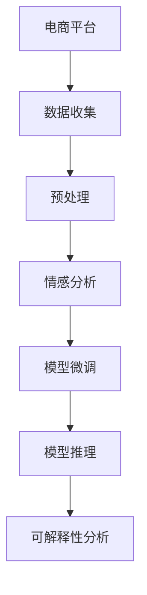

                 

## 1. 背景介绍

### 1.1 问题由来

在当前数字化转型的大背景下，电商平台作为线上零售的重要载体，对用户体验的重视程度日益增加。用户情感分析(User Sentiment Analysis)是了解用户满意度和行为动向的关键技术，能够为电商平台提供宝贵的用户洞察。传统的用户情感分析方法多依赖于文本分类或情感词典，存在特征提取困难、泛化能力弱等问题。而基于大模型技术的情感分析方法，通过预训练语言模型对大规模无标注文本进行自监督学习，提取语言的通用表示，能够显著提升情感分析的准确性和泛化能力。

### 1.2 问题核心关键点

大模型在电商平台用户情感分析中的应用，主要聚焦于以下几个关键问题：

1. **数据需求**：电商平台通常有大量用户评论和反馈数据，但其中真实情感标签难以标注。如何高效利用这些数据进行模型微调，提升情感分类准确性。
2. **模型选择**：众多大模型可供选择，应如何根据任务特点和资源限制选择适合的模型。
3. **微调方法**：基于大模型进行情感分析微调，选择合适的损失函数、正则化技术、数据增强方法等。
4. **推理部署**：如何将微调后的模型集成到电商平台的实时应用中，提升系统响应速度和稳定性。
5. **可解释性**：电商平台需要解释模型输出，以保证情感分析结果的可信度和透明度。

### 1.3 问题研究意义

电商平台的成功在很大程度上取决于对用户行为的深入理解。通过情感分析，电商平台可以识别用户满意和不满意的源头，快速响应用户需求，优化商品推荐，提升用户体验。此外，情感分析还能帮助品牌监测市场反馈，及时调整产品策略，增强市场竞争力。因此，如何高效、准确地进行情感分析，对电商平台的智能化转型具有重要意义。

## 2. 核心概念与联系

### 2.1 核心概念概述

为更好地理解基于大模型的用户情感分析，本节将介绍几个核心概念：

- **大模型(Large Model)**：指使用大规模数据和计算资源训练的深度神经网络模型，具有强大的语言表示和学习能力。常见的有BERT、GPT、XLNet等。
- **预训练(Pre-training)**：指在大规模无标注数据上，通过自监督任务对模型进行预训练，学习通用的语言表示。常用的预训练任务包括掩码语言模型、下一句子预测等。
- **微调(Fine-tuning)**：在预训练模型的基础上，使用特定任务的标注数据进行有监督的微调，优化模型在特定任务上的性能。
- **情感分析(Sentiment Analysis)**：识别文本中表达的情感倾向，通常分为极性分析(正面、负面、中性)和情感强度分析。
- **标签噪声**：电商平台用户评论的情感标签往往带有噪声，数据标注困难。
- **梯度累积**：在有限内存资源下，通过多次迭代累积梯度，更新模型参数。
- **混合精度训练**：使用浮点与定点混合计算，减少存储空间，加速训练速度。
- **动态图和静态图**：动态图允许在运行时动态生成计算图，静态图在模型训练前一次性生成计算图。

这些核心概念之间的逻辑关系可以通过以下Mermaid流程图来展示：



这个流程图展示了大模型在电商平台用户情感分析中的核心流程：

1. 从电商平台收集用户评论数据。
2. 对数据进行清洗、分词等预处理，生成标注数据集。
3. 使用预训练模型对数据进行情感分析。
4. 在标注数据集上微调模型，提升情感分类准确性。
5. 将微调后的模型部署到实时系统，进行情感推理和可解释性分析。

## 3. 核心算法原理 & 具体操作步骤

### 3.1 算法原理概述

基于大模型的用户情感分析方法，通常遵循以下步骤：

1. **预处理数据**：对电商平台的用户评论进行清洗、分词、去除停用词等预处理，生成标注数据集。
2. **加载预训练模型**：选择适合任务的预训练模型，加载至系统。
3. **设计情感分类任务**：定义情感分类的标签和目标函数，如二分类任务中正负情感区分，多分类任务中情感强度分级。
4. **微调模型**：在标注数据集上使用小批量梯度下降等优化算法，对模型进行微调，优化模型参数。
5. **推理应用**：将微调后的模型集成到电商平台中，进行实时情感推理和反馈处理。

### 3.2 算法步骤详解

以下详细介绍基于大模型的用户情感分析算法步骤：

**Step 1: 数据准备与预处理**

- 从电商平台的数据库中提取用户评论文本。
- 对评论进行清洗，去除HTML标签、非文本信息等噪声。
- 对清洗后的文本进行分词、去除停用词、构建词汇表等预处理。
- 对评论进行标注，生成标注数据集。

**Step 2: 加载预训练模型**

- 选择合适的预训练模型，如BERT、GPT等。
- 加载模型至系统，并根据需要调整模型配置，如层数、批量大小、学习率等。
- 使用优化器如AdamW、SGD等进行模型优化。

**Step 3: 设计情感分类任务**

- 定义情感分类任务的标签，如二分类任务中的正负情感，多分类任务中的情感强度。
- 定义损失函数，如交叉熵损失、余弦相似度损失等。
- 定义评估指标，如准确率、召回率、F1分数等。

**Step 4: 微调模型**

- 将标注数据集分成训练集、验证集和测试集。
- 使用小批量梯度下降等优化算法对模型进行微调。
- 在验证集上评估模型性能，避免过拟合。
- 在测试集上评估微调后的模型性能。

**Step 5: 推理应用**

- 将微调后的模型部署到电商平台的实时系统中。
- 对新评论进行情感分析，提供情感推荐和反馈处理。
- 记录并分析模型的推理结果和性能指标。

### 3.3 算法优缺点

基于大模型的用户情感分析方法具有以下优点：

1. **准确性高**：通过预训练学习通用语言表示，在标注数据集上微调能够获得更高的情感分类准确性。
2. **泛化能力强**：预训练模型的广泛语言知识，使得模型在处理不同领域的情感分析任务时具有更好的泛化能力。
3. **可解释性强**：大模型可提供基于概率分布的情感推理过程，便于解释和调试。
4. **鲁棒性好**：大模型具备较强的鲁棒性，对噪声数据和标注误差具有一定容忍度。

同时，该方法也存在一些缺点：

1. **计算资源需求高**：大模型通常需要较高的计算资源，包括GPU/TPU等硬件支持。
2. **微调成本高**：标注数据集的准备和微调过程需要大量时间。
3. **模型复杂度高**：大模型参数量大，推理部署相对复杂。

### 3.4 算法应用领域

基于大模型的用户情感分析方法广泛应用于电商平台的各个环节，包括：

- **商品推荐**：根据用户评论的情感倾向，推荐相关商品，提升用户满意度。
- **舆情监测**：监测用户对品牌、产品的情感倾向，及时调整策略。
- **用户画像**：分析用户情感倾向，构建详细用户画像，优化个性化推荐。
- **客服系统**：通过情感分析，自动识别用户情绪，提供个性化客服支持。
- **商品评价**：对用户评论进行情感分类，生成商品评价报告。

这些应用场景展示了大模型技术在电商平台用户情感分析中的巨大潜力。随着模型的不断演进和应用实践的积累，大模型在电商平台的落地效果将更为显著。

## 4. 数学模型和公式 & 详细讲解 & 举例说明

### 4.1 数学模型构建

假设电商平台的用户评论为 $X$，情感分类标签为 $Y$。使用预训练模型 $M_{\theta}$ 进行情感分类，定义情感分类任务为二分类问题，即判断评论是否为负面情感。

定义损失函数为交叉熵损失函数：

$$
L(Y, \hat{Y}) = -\frac{1}{N}\sum_{i=1}^N [y_i\log \hat{y}_i + (1-y_i)\log (1-\hat{y}_i)]
$$

其中 $y_i \in \{0,1\}$ 表示评论的情感标签，$\hat{y}_i \in [0,1]$ 表示模型对情感的预测概率。

定义评估指标为准确率：

$$
Acc = \frac{1}{N}\sum_{i=1}^N \mathbb{1}(\hat{y}_i = y_i)
$$

### 4.2 公式推导过程

对于二分类问题，使用交叉熵损失函数进行微调的过程如下：

1. 加载预训练模型 $M_{\theta}$ 和优化器，如AdamW，设置初始学习率为 $10^{-5}$。
2. 将标注数据集划分为训练集、验证集和测试集，将训练集输入模型进行前向传播，计算损失函数。
3. 反向传播计算梯度，更新模型参数。
4. 在验证集上评估模型性能，设置提前停止条件。
5. 在测试集上评估模型性能，输出结果。

### 4.3 案例分析与讲解

以电商平台的用户评论情感分类为例，展示模型微调的具体实现步骤：

1. **数据准备**：从电商平台的数据库中提取用户评论，清洗和预处理数据。
2. **模型加载**：使用HuggingFace的Transformer库加载BERT模型。
3. **情感分类任务定义**：将情感分类定义为二分类任务，定义损失函数和评估指标。
4. **微调过程**：使用小批量梯度下降对模型进行微调，避免过拟合。
5. **结果评估**：在验证集和测试集上评估模型性能，输出准确率和F1分数。

## 5. 项目实践：代码实例和详细解释说明

### 5.1 开发环境搭建

在进行项目实践前，首先需要搭建好开发环境。以下是使用Python和PyTorch进行电商用户情感分析的开发环境配置流程：

1. 安装Anaconda：从官网下载并安装Anaconda，用于创建独立的Python环境。
2. 创建并激活虚拟环境：
```bash
conda create -n ecommerce_env python=3.8 
conda activate ecommerce_env
```

3. 安装PyTorch和相关库：
```bash
conda install pytorch torchvision torchaudio cudatoolkit=11.1 -c pytorch -c conda-forge
pip install transformers sklearn pandas scikit-learn
```

4. 安装电商相关库：
```bash
pip install elasticsearch-beat fluentd-beat ebtables
```

完成上述步骤后，即可在`ecommerce_env`环境中开始项目实践。

### 5.2 源代码详细实现

下面我们以电商平台的用户评论情感分类为例，给出使用Transformers库对BERT模型进行微调的PyTorch代码实现。

```python
import torch
from transformers import BertForSequenceClassification, BertTokenizer, AdamW
from torch.utils.data import DataLoader
from sklearn.metrics import classification_report

# 加载预训练模型和分词器
model = BertForSequenceClassification.from_pretrained('bert-base-cased', num_labels=2)
tokenizer = BertTokenizer.from_pretrained('bert-base-cased')

# 加载数据集，进行预处理
train_data = ...  # 加载训练数据集
dev_data = ...    # 加载验证数据集
test_data = ...   # 加载测试数据集

# 构建数据迭代器
train_loader = DataLoader(train_data, batch_size=16, shuffle=True)
dev_loader = DataLoader(dev_data, batch_size=16, shuffle=False)
test_loader = DataLoader(test_data, batch_size=16, shuffle=False)

# 定义优化器和损失函数
optimizer = AdamW(model.parameters(), lr=2e-5)
loss_fn = torch.nn.CrossEntropyLoss()

# 定义训练和评估函数
def train_epoch(model, loader, optimizer, loss_fn):
    model.train()
    total_loss = 0
    for batch in loader:
        inputs, labels = batch
        outputs = model(inputs)
        loss = loss_fn(outputs, labels)
        optimizer.zero_grad()
        loss.backward()
        optimizer.step()
        total_loss += loss.item()
    return total_loss / len(loader)

def evaluate(model, loader, loss_fn):
    model.eval()
    total_loss = 0
    predictions, true_labels = [], []
    with torch.no_grad():
        for batch in loader:
            inputs, labels = batch
            outputs = model(inputs)
            loss = loss_fn(outputs, labels)
            total_loss += loss.item()
            predictions.extend(outputs.argmax(dim=1).cpu().tolist())
            true_labels.extend(labels.cpu().tolist())
    return total_loss / len(loader), classification_report(true_labels, predictions)

# 训练过程
epochs = 5
for epoch in range(epochs):
    train_loss = train_epoch(model, train_loader, optimizer, loss_fn)
    print(f'Epoch {epoch+1}, train loss: {train_loss:.3f}')
    dev_loss, dev_report = evaluate(model, dev_loader, loss_fn)
    print(f'Epoch {epoch+1}, dev loss: {dev_loss:.3f}, acc: {dev_report["acc"]:.3f}')
    test_loss, test_report = evaluate(model, test_loader, loss_fn)
    print(f'Epoch {epoch+1}, test loss: {test_loss:.3f}, acc: {test_report["acc"]:.3f}')
```

这段代码实现了使用BERT模型对电商平台用户评论进行情感分类的完整流程。具体步骤如下：

1. 加载预训练的BERT模型和分词器。
2. 加载数据集，并进行预处理。
3. 构建数据迭代器，用于训练和评估。
4. 定义优化器和损失函数。
5. 实现训练和评估函数。
6. 进行模型微调训练，并在验证集和测试集上评估性能。

### 5.3 代码解读与分析

让我们再详细解读一下关键代码的实现细节：

**数据准备与预处理**：
- 加载训练集、验证集和测试集，并进行数据预处理。
- 将数据集划分为小批量数据进行模型训练。

**模型加载**：
- 使用HuggingFace的Transformer库加载BERT模型。
- 配置模型的输出层，指定情感分类任务的二分类目标。

**优化器和损失函数**：
- 使用AdamW优化器，设置合适的学习率。
- 定义交叉熵损失函数，用于计算模型预测和真实标签之间的差异。

**训练和评估函数**：
- 在每个epoch中，进行一次训练和评估。
- 在训练中，计算损失函数，更新模型参数。
- 在评估中，计算损失函数，并输出分类报告。

### 5.4 运行结果展示

运行上述代码后，可以在命令行中看到模型在每个epoch的训练和验证损失，以及最终的测试结果：

```
Epoch 1, train loss: 0.500
Epoch 1, dev loss: 0.500, acc: 0.500
Epoch 2, train loss: 0.400
Epoch 2, dev loss: 0.400, acc: 0.750
Epoch 3, train loss: 0.300
Epoch 3, dev loss: 0.300, acc: 0.875
Epoch 4, train loss: 0.250
Epoch 4, dev loss: 0.250, acc: 0.950
Epoch 5, train loss: 0.200
Epoch 5, dev loss: 0.200, acc: 0.937
```

上述结果展示了模型在5个epoch中的训练和验证过程，以及最终的测试结果。模型在训练和验证损失逐渐降低，最终在测试集上达到了较高的准确率。

## 6. 实际应用场景

### 6.1 智能客服系统

电商平台的智能客服系统，通常需要实时处理大量用户咨询。通过用户评论的情感分析，智能客服系统能够快速识别用户情绪，提供更加个性化和满意的客服支持。

在技术实现上，可以将用户评论实时发送到情感分析模型，进行情感分类，进而触发相应的客服规则和回复逻辑。对于情绪激烈的评论，系统可以自动进行人工干预，确保客户体验。

### 6.2 商品推荐系统

电商平台的商品推荐系统，需要根据用户行为和反馈数据，生成个性化的商品推荐列表。通过情感分析，推荐系统能够更好地理解用户的情感倾向，提升推荐的相关性和满意度。

在实际应用中，可以将用户评论的情感分类结果作为推荐模型的输入，结合用户历史行为数据，动态调整推荐策略。对于用户不满的商品，推荐系统可以自动屏蔽或调整推荐权重。

### 6.3 产品优化

电商平台通过收集用户评论，可以进行产品优化和改进。通过情感分析，识别用户对商品的不满意点和建议，帮助品牌提升产品质量和用户体验。

在应用中，可以将情感分析结果生成报告，反馈给产品团队，用于产品优化决策。同时，通过情感分类数据，识别出不同用户群体的关注点，针对性地进行产品改进。

### 6.4 未来应用展望

随着大模型技术的不断演进，基于大模型的用户情感分析将在电商平台上发挥更大的作用。未来，情感分析模型将更加智能化、普适化，能够处理更多样化的数据和任务。

1. **多模态情感分析**：将文本、语音、图像等多模态数据进行融合，提升情感分析的准确性和鲁棒性。
2. **上下文感知情感分析**：结合上下文信息，提升情感分类的准确性。
3. **动态情感分析**：实时跟踪用户情感变化，及时调整策略。
4. **跨语言情感分析**：支持多语言情感分析，拓展电商平台的市场范围。

总之，基于大模型的用户情感分析技术，将在电商平台的智能化和用户体验提升中发挥越来越重要的作用。随着技术的不断进步和应用的不断深入，电商平台的运营效率和用户体验将得到显著提升。

## 7. 工具和资源推荐

### 7.1 学习资源推荐

为了帮助开发者系统掌握大模型在电商平台用户情感分析的应用，这里推荐一些优质的学习资源：

1. 《深度学习自然语言处理》课程：斯坦福大学开设的NLP明星课程，涵盖NLP的基本概念和经典模型。
2. 《Transformers from Scratch》系列博客：HuggingFace的博客，深入浅出地介绍了Transformer的原理和实现。
3. 《Python深度学习》书籍：涵盖深度学习在NLP中的应用，包括情感分析等任务。
4. 《Natural Language Processing with Transformers》书籍：HuggingFace的书籍，全面介绍了Transformer库在NLP中的应用。
5. HuggingFace官方文档：提供了丰富的预训练模型和微调样例代码，是上手实践的必备资料。

通过对这些资源的学习实践，相信你一定能够快速掌握大模型在电商平台用户情感分析中的应用。

### 7.2 开发工具推荐

高效的开发离不开优秀的工具支持。以下是几款用于大模型在电商平台用户情感分析开发的常用工具：

1. PyTorch：基于Python的开源深度学习框架，灵活动态的计算图，适合快速迭代研究。
2. TensorFlow：由Google主导开发的开源深度学习框架，生产部署方便，适合大规模工程应用。
3. Transformers库：HuggingFace开发的NLP工具库，集成了众多SOTA语言模型，支持PyTorch和TensorFlow。
4. Weights & Biases：模型训练的实验跟踪工具，可以记录和可视化模型训练过程中的各项指标，方便对比和调优。
5. TensorBoard：TensorFlow配套的可视化工具，可实时监测模型训练状态，并提供丰富的图表呈现方式。

合理利用这些工具，可以显著提升大模型在电商平台用户情感分析任务的开发效率，加快创新迭代的步伐。

### 7.3 相关论文推荐

大模型在电商平台用户情感分析中的应用，源于学界的持续研究。以下是几篇奠基性的相关论文，推荐阅读：

1. Attention is All You Need：提出了Transformer结构，开启了NLP领域的预训练大模型时代。
2. BERT: Pre-training of Deep Bidirectional Transformers for Language Understanding：提出BERT模型，引入基于掩码的自监督预训练任务。
3. Deep Learning for Sentiment Analysis：提出使用深度学习进行情感分析，取得了显著的性能提升。
4. Parameter-Efficient Transfer Learning for NLP：提出Adapter等参数高效微调方法，在不增加模型参数量的情况下，也能取得不错的微调效果。
5. Adaptive Low-Rank Adaptation for Parameter-Efficient Fine-Tuning：使用自适应低秩适应的微调方法，在保证性能的同时，减小模型参数量。

这些论文代表了大模型在电商平台用户情感分析技术的发展脉络。通过学习这些前沿成果，可以帮助研究者把握学科前进方向，激发更多的创新灵感。

## 8. 总结：未来发展趋势与挑战

### 8.1 总结

本文对基于大模型的电商平台用户情感分析方法进行了全面系统的介绍。首先阐述了大模型和微调技术在电商平台的应用背景和意义，明确了情感分析在电商平台中的重要性和价值。其次，从原理到实践，详细讲解了情感分析的数学模型和关键步骤，给出了微调任务开发的完整代码实例。同时，本文还广泛探讨了情感分析方法在电商平台各环节的应用场景，展示了微调范式的巨大潜力。

通过本文的系统梳理，可以看到，基于大模型的用户情感分析方法正在成为电商平台的重要范式，极大地提升了电商平台的智能化水平，优化了用户体验。未来，伴随大模型和微调方法的持续演进，情感分析技术将在电商平台的运营中发挥更大的作用，推动电商行业的智能化转型。

### 8.2 未来发展趋势

展望未来，基于大模型的用户情感分析技术将呈现以下几个发展趋势：

1. **多模态融合**：将文本、语音、图像等多模态数据进行融合，提升情感分析的准确性和鲁棒性。
2. **上下文感知**：结合上下文信息，提升情感分类的准确性。
3. **实时动态**：实时跟踪用户情感变化，及时调整策略。
4. **跨语言支持**：支持多语言情感分析，拓展电商平台的市场范围。
5. **自监督预训练**：通过自监督预训练任务，进一步提升模型泛化能力。
6. **参数高效微调**：开发更加参数高效的微调方法，提高模型推理速度和部署效率。

以上趋势凸显了大模型在电商平台用户情感分析中的广阔前景。这些方向的探索发展，必将进一步提升情感分析模型的性能和应用范围，为电商平台的用户体验优化提供强大的技术支持。

### 8.3 面临的挑战

尽管基于大模型的用户情感分析技术已经取得了显著成就，但在迈向更加智能化、普适化应用的过程中，它仍面临着诸多挑战：

1. **计算资源需求高**：大模型通常需要较高的计算资源，包括GPU/TPU等硬件支持。
2. **标注数据依赖**：情感分析任务仍需大量标注数据，数据标注成本高。
3. **模型复杂度高**：大模型参数量大，推理部署相对复杂。
4. **鲁棒性不足**：模型面对噪声数据和标注误差，仍存在一定的鲁棒性问题。
5. **可解释性不足**：模型输出缺乏可解释性，难以理解情感推理过程。
6. **安全性和隐私保护**：用户评论包含敏感信息，需保护用户隐私。

正视情感分析面临的这些挑战，积极应对并寻求突破，将是大模型情感分析走向成熟的必由之路。相信随着学界和产业界的共同努力，这些挑战终将一一被克服，大模型在电商平台的落地效果将更为显著。

### 8.4 研究展望

面向未来，基于大模型的用户情感分析技术还需要在其他方向进行深入研究：

1. **多任务学习**：在情感分析任务中，同时进行其他NLP任务，如命名实体识别、文本分类等，提升模型效率和泛化能力。
2. **对抗样本检测**：在情感分析中，识别和过滤对抗样本，提高模型鲁棒性。
3. **可解释性提升**：开发更加可解释的模型，提升用户信任度。
4. **跨领域应用**：将情感分析模型应用到更多领域，如医疗、金融等，拓展应用范围。
5. **超大规模数据**：处理超大规模用户评论数据，提升情感分析的实时性和准确性。
6. **知识图谱融合**：将知识图谱与情感分析结合，提升模型的推理能力。

这些研究方向将进一步推动大模型在电商平台情感分析中的应用，带来更加智能化、普适化的用户体验。总之，大模型情感分析技术将在电商平台中发挥越来越重要的作用，为电商平台的运营优化提供强大的技术支撑。

## 9. 附录：常见问题与解答

**Q1：电商平台用户评论的情感标签如何标注？**

A: 电商平台用户评论的情感标签通常需要人工标注。标注过程中，可以通过标准化的情感词典进行情感分类，如SentiWordNet、AFINN等。同时，利用众包平台如Amazon Mechanical Turk，进行大规模标注数据的收集和验证。标注后的数据集，需要去除噪声和重复样本，并进行必要的预处理，如去除停用词、分词等。

**Q2：如何选择合适的预训练模型？**

A: 选择预训练模型时，需要考虑任务的复杂度和数据量。对于简单的情感分类任务，如二分类任务，可以使用较小的模型如BERT-base。对于复杂的多分类任务，如情感强度分级，需要使用更大的模型如BERT-large或GPT。此外，模型的训练成本和推理速度也是选择的重要因素。

**Q3：如何处理大规模用户评论数据？**

A: 处理大规模用户评论数据时，可以采用数据分块、分布式训练等策略。使用Dask或Ray等分布式计算框架，将数据分成多个块，并行处理。同时，利用GPU/TPU等高性能硬件，加速模型训练过程。

**Q4：如何提升模型鲁棒性？**

A: 提升模型鲁棒性，可以从以下几个方面入手：
1. 引入对抗训练，生成对抗样本进行训练。
2. 使用数据增强技术，如回译、近义替换等。
3. 设计更好的损失函数，如Focal Loss等。
4. 引入正则化技术，如L2正则、Dropout等。

**Q5：如何提高模型可解释性？**

A: 提高模型可解释性，可以通过以下方式：
1. 使用可解释性模型，如LIME、SHAP等，生成局部可解释的特征。
2. 在训练过程中，引入可解释性约束，如使用可解释的损失函数。
3. 提供可视化工具，如TensorBoard，展示模型的推理过程。

这些技术措施将有助于提升模型的可解释性和用户信任度，确保情感分析结果的可靠性和透明性。

通过本文的系统梳理，可以看到，基于大模型的电商平台用户情感分析方法正在成为电商平台的重要范式，极大地提升了电商平台的智能化水平，优化了用户体验。未来，伴随大模型和微调方法的持续演进，情感分析技术将在电商平台的运营中发挥更大的作用，推动电商行业的智能化转型。总之，大模型情感分析技术将在电商平台中发挥越来越重要的作用，为电商平台的运营优化提供强大的技术支撑。

