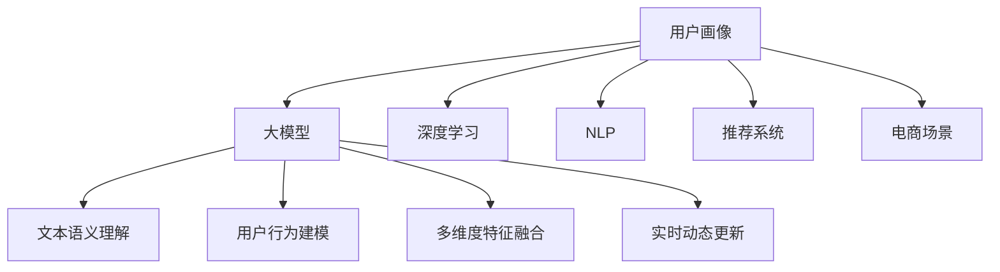

                 

# 大模型技术在电商平台用户画像中的应用

> 关键词：用户画像,大模型,深度学习,电商,自然语言处理(NLP),推荐系统,人工智能

## 1. 背景介绍

### 1.1 问题由来

在现代电商平台上，用户画像的构建是提升用户转化率、优化用户体验的关键。通过分析用户的浏览、点击、购买等行为数据，可以生成详细的用户画像，从而精准推送商品、个性化推荐、提升用户满意度。然而，传统的用户画像构建方法依赖于复杂的规则工程，难以灵活应对不断变化的电商场景，且数据处理成本较高。

随着深度学习技术的发展，大模型技术在电商领域的应用成为新的热点。基于大规模预训练语言模型(如BERT、GPT等)的电商用户画像构建方法，以其强大的自然语言处理能力和灵活性，逐渐被电商企业所重视。

### 1.2 问题核心关键点

大模型技术在电商用户画像构建中主要应用于以下几个方面：

1. **文本数据的语义理解**：电商平台上充满了用户评论、商品描述、搜索关键词等文本数据，利用大模型技术，可以高效地提取和理解这些文本数据的语义信息。
2. **用户行为模式建模**：通过分析用户的历史行为数据，利用大模型预测用户未来的行为模式，从而生成精准的用户画像。
3. **多维度特征融合**：大模型可以整合用户的多维特征，如浏览历史、搜索关键词、购买记录、社交行为等，构建更全面、更准确的用户画像。
4. **实时动态更新**：电商场景变化快，用户需求和行为也在不断变化，大模型能够实时动态地更新用户画像，以适应电商环境的快速变化。

本文将重点探讨基于大模型的电商用户画像构建方法，包括模型选择、数据预处理、训练优化、模型应用等方面的技术和实践。

## 2. 核心概念与联系

### 2.1 核心概念概述

为更好地理解大模型在电商用户画像中的应用，本节将介绍几个密切相关的核心概念：

- **用户画像(User Profile)**：指根据用户的历史行为、兴趣偏好、人口统计信息等数据，构建的关于用户特征的描述，用于精准推送、个性化推荐、用户细分等场景。
- **大模型(Large Model)**：指通过大规模无标签数据进行预训练的深度学习模型，如BERT、GPT、T5等。大模型具备强大的自然语言处理能力和泛化能力，可以高效处理电商平台上的文本数据。
- **深度学习(Deep Learning)**：一种基于多层神经网络的机器学习技术，通过数据驱动的方式自动提取数据特征，广泛应用于图像识别、语音识别、自然语言处理等领域。
- **自然语言处理(Natural Language Processing, NLP)**：专注于处理和理解人类语言的机器学习方法，如文本分类、情感分析、命名实体识别、机器翻译等。
- **推荐系统(Recommendation System)**：利用用户行为数据和商品特征数据，为用户推荐可能感兴趣的商品，提高用户满意度和转化率。
- **电商场景(E-commerce Scenario)**：指基于互联网的在线购物平台，通过电子支付、物流配送等手段，完成商品的交易和服务。

这些核心概念之间的逻辑关系可以通过以下Mermaid流程图来展示：



这个流程图展示了大模型在电商用户画像构建中的关键作用，以及与之相关的其他技术。

## 3. 核心算法原理 & 具体操作步骤
### 3.1 算法原理概述

基于大模型的电商用户画像构建方法，本质上是一种深度学习范式。其核心思想是：利用大模型的预训练能力，在电商平台上对用户的文本行为数据进行语义理解和行为建模，构建精准的用户画像，进而应用于商品推荐、个性化展示、用户细分等电商场景中。

具体而言，该方法通过以下步骤完成：

1. **数据收集与预处理**：收集用户的文本行为数据，如评论、商品描述、搜索关键词等，并进行清洗和归一化。
2. **模型选择与加载**：选择合适的预训练大模型，并加载到计算平台中。
3. **特征提取与语义建模**：利用大模型对文本数据进行特征提取和语义建模，生成高维的文本表示。
4. **行为建模与画像构建**：根据文本表示和其他行为数据，构建用户画像，包括用户兴趣、行为模式、购买偏好等。
5. **画像应用与优化**：将用户画像应用于商品推荐、个性化展示、用户细分等电商场景中，并根据效果反馈持续优化模型。

### 3.2 算法步骤详解

以下是电商用户画像构建的具体操作步骤：

**Step 1: 数据收集与预处理**

- 收集用户的文本行为数据，如评论、商品描述、搜索关键词等，并保存到数据库中。
- 对文本数据进行清洗和预处理，去除噪声、停用词等，并进行词向量化处理。
- 将文本数据和行为数据合并，形成用户的完整行为记录。

**Step 2: 模型选择与加载**

- 选择合适的预训练大模型，如BERT、GPT、T5等，并加载到计算平台中。
- 设置模型超参数，如模型大小、学习率、批大小等。

**Step 3: 特征提取与语义建模**

- 利用预训练大模型对文本数据进行特征提取和语义建模，生成高维的文本表示。
- 对文本表示进行编码，生成用户行为向量，包含用户的兴趣、偏好、情感等信息。

**Step 4: 行为建模与画像构建**

- 根据用户行为向量和其他行为数据，构建用户画像，包括用户兴趣、行为模式、购买偏好等。
- 利用用户画像对商品进行分类和推荐，提升用户体验和转化率。

**Step 5: 画像应用与优化**

- 将用户画像应用于电商平台的推荐系统、个性化展示等场景中，根据用户反馈持续优化模型。
- 定期更新用户画像，以适应用户需求和电商环境的变化。

### 3.3 算法优缺点

基于大模型的电商用户画像构建方法具有以下优点：

1. **高效性**：利用大模型的预训练能力，可以快速处理大规模文本数据，生成精准的用户画像。
2. **灵活性**：能够处理多维度、多类型的数据，适应电商场景的多样性需求。
3. **可解释性**：大模型通过抽取和理解文本数据，可以提供关于用户兴趣和行为的洞察，帮助电商企业更好地理解用户。

然而，该方法也存在一些局限性：

1. **数据依赖性高**：大模型的效果很大程度上依赖于高质量的文本数据，标注数据的成本较高。
2. **模型复杂度大**：预训练大模型的参数量较大，对计算资源和存储要求较高。
3. **效果泛化性差**：大模型在特定领域或场景下的泛化能力有限，需要进一步微调或迁移学习。
4. **隐私风险**：在处理用户数据时，需要注意隐私保护和数据安全，避免数据泄露和滥用。

### 3.4 算法应用领域

基于大模型的电商用户画像构建方法，已经在电商平台的多个场景中得到应用，具体包括：

- **商品推荐系统**：利用用户画像精准推送用户可能感兴趣的商品，提升用户购买转化率。
- **个性化展示系统**：根据用户画像展示个性化的商品信息，提升用户点击率和满意度。
- **用户细分系统**：将用户分为不同的群体，根据不同群体特征进行精准营销。
- **用户行为分析系统**：通过用户画像分析用户行为模式，帮助电商企业优化运营策略。
- **营销活动系统**：利用用户画像进行精准投放广告，提高广告效果和ROI。

## 4. 数学模型和公式 & 详细讲解 & 举例说明

### 4.1 数学模型构建

本节将使用数学语言对基于大模型的电商用户画像构建方法进行更加严格的刻画。

记电商平台的文本数据为 $X=\{x_1,x_2,\cdots,x_n\}$，其中每个 $x_i$ 为一个文本记录。设用户的行为数据为 $Y=\{y_1,y_2,\cdots,y_n\}$，其中每个 $y_i$ 包含用户的浏览、点击、购买等行为信息。利用大模型 $M$ 对文本数据 $X$ 进行语义建模，生成高维的文本表示 $Z=\{z_1,z_2,\cdots,z_n\}$，其中每个 $z_i$ 表示用户 $x_i$ 的语义表示。

利用用户画像模型 $F$ 对文本表示 $Z$ 和行为数据 $Y$ 进行建模，生成用户画像 $P=\{p_1,p_2,\cdots,p_n\}$，其中每个 $p_i$ 表示用户 $x_i$ 的用户画像。最终，利用用户画像 $P$ 进行商品推荐、个性化展示等电商场景应用。

### 4.2 公式推导过程

以下我们以用户兴趣建模为例，推导利用大模型构建用户兴趣的用户画像的数学公式。

假设用户兴趣建模的目标是预测用户 $x_i$ 对商品 $j$ 的评分 $r_{ij}$，可以采用如下公式：

$$
p_i = M(x_i) \cdot W_b + \sum_{j=1}^J r_{ij} \cdot M(j) \cdot W_r
$$

其中 $M(x_i)$ 表示用户 $x_i$ 的文本表示，$M(j)$ 表示商品 $j$ 的文本表示，$W_b$ 和 $W_r$ 分别为文本表示和评分向量的权重。

对 $r_{ij}$ 进行建模，可以采用如下公式：

$$
r_{ij} = \sigma(a_i^T \cdot M(j) + b_i + e_j + f)
$$

其中 $\sigma$ 为激活函数，$a_i$ 表示用户 $x_i$ 的兴趣向量，$e_j$ 表示商品 $j$ 的评分向量，$f$ 为截距项。

将上述公式代入用户画像模型 $F$ 中，可以进一步表示为：

$$
p_i = M(x_i) \cdot W_b + \sum_{j=1}^J \sigma(a_i^T \cdot M(j) + b_i + e_j + f) \cdot M(j) \cdot W_r
$$

最终，利用用户画像 $P$ 进行商品推荐，可以采用如下公式：

$$
\hat{r}_{ij} = p_i^T \cdot M(j)
$$

其中 $\hat{r}_{ij}$ 为预测的评分，$p_i$ 为用户画像，$M(j)$ 为商品 $j$ 的文本表示。

### 4.3 案例分析与讲解

以某电商平台的商品推荐系统为例，分析利用大模型构建用户画像的过程：

- **数据准备**：收集用户的浏览、点击、购买行为数据，以及商品的描述、标题等文本数据，保存至数据库中。
- **数据预处理**：对文本数据进行清洗和归一化，去除停用词、标点符号等噪声。
- **特征提取**：利用BERT模型对文本数据进行特征提取，生成高维的文本表示。
- **行为建模**：将文本表示和行为数据输入到用户画像模型 $F$ 中，生成用户画像。
- **推荐计算**：根据用户画像和商品文本表示，计算每个商品的预测评分，选择评分高的商品进行推荐。

## 5. 项目实践：代码实例和详细解释说明
### 5.1 开发环境搭建

在进行电商用户画像构建的实践前，我们需要准备好开发环境。以下是使用Python进行PyTorch开发的环境配置流程：

1. 安装Anaconda：从官网下载并安装Anaconda，用于创建独立的Python环境。

2. 创建并激活虚拟环境：
```bash
conda create -n pytorch-env python=3.8 
conda activate pytorch-env
```

3. 安装PyTorch：根据CUDA版本，从官网获取对应的安装命令。例如：
```bash
conda install pytorch torchvision torchaudio cudatoolkit=11.1 -c pytorch -c conda-forge
```

4. 安装HuggingFace Transformers库：
```bash
pip install transformers
```

5. 安装各类工具包：
```bash
pip install numpy pandas scikit-learn matplotlib tqdm jupyter notebook ipython
```

完成上述步骤后，即可在`pytorch-env`环境中开始电商用户画像构建的实践。

### 5.2 源代码详细实现

下面是使用PyTorch和HuggingFace Transformers库进行电商用户画像构建的代码实现。

```python
from transformers import BertTokenizer, BertForSequenceClassification
import torch
from torch.utils.data import Dataset, DataLoader
import pandas as pd

class EcommerceDataset(Dataset):
    def __init__(self, df, tokenizer, max_len):
        self.tokenizer = tokenizer
        self.data = df
        self.max_len = max_len
        
    def __len__(self):
        return len(self.data)
    
    def __getitem__(self, idx):
        row = self.data.iloc[idx]
        text = row['text']
        label = row['label']
        
        encoding = self.tokenizer(text, return_tensors='pt', truncation=True, padding='max_length', max_length=self.max_len)
        input_ids = encoding['input_ids'][0]
        attention_mask = encoding['attention_mask'][0]
        
        return {
            'input_ids': input_ids,
            'attention_mask': attention_mask,
            'labels': torch.tensor(label, dtype=torch.long)
        }

# 数据准备
data = pd.read_csv('ecommerce_data.csv')
tokenizer = BertTokenizer.from_pretrained('bert-base-cased')
max_len = 128

# 创建dataset
dataset = EcommerceDataset(data, tokenizer, max_len)

# 定义模型
model = BertForSequenceClassification.from_pretrained('bert-base-cased', num_labels=2)

# 定义优化器
optimizer = torch.optim.Adam(model.parameters(), lr=2e-5)

# 定义损失函数
loss_fn = torch.nn.CrossEntropyLoss()

# 训练过程
device = torch.device('cuda') if torch.cuda.is_available() else torch.device('cpu')
model.to(device)

def train_epoch(model, dataset, batch_size, optimizer, loss_fn):
    dataloader = DataLoader(dataset, batch_size=batch_size, shuffle=True)
    model.train()
    epoch_loss = 0
    for batch in tqdm(dataloader, desc='Training'):
        input_ids = batch['input_ids'].to(device)
        attention_mask = batch['attention_mask'].to(device)
        labels = batch['labels'].to(device)
        model.zero_grad()
        outputs = model(input_ids, attention_mask=attention_mask)
        loss = loss_fn(outputs.logits, labels)
        epoch_loss += loss.item()
        loss.backward()
        optimizer.step()
    return epoch_loss / len(dataloader)

# 评估过程
def evaluate(model, dataset, batch_size, loss_fn):
    dataloader = DataLoader(dataset, batch_size=batch_size, shuffle=False)
    model.eval()
    preds, labels = [], []
    with torch.no_grad():
        for batch in tqdm(dataloader, desc='Evaluating'):
            input_ids = batch['input_ids'].to(device)
            attention_mask = batch['attention_mask'].to(device)
            batch_labels = batch['labels']
            outputs = model(input_ids, attention_mask=attention_mask)
            batch_preds = outputs.logits.argmax(dim=1).to('cpu').tolist()
            batch_labels = batch_labels.to('cpu').tolist()
            for pred, label in zip(batch_preds, batch_labels):
                preds.append(pred)
                labels.append(label)
                
    acc = accuracy_score(labels, preds)
    print(f'Accuracy: {acc:.2f}')

# 启动训练流程并在测试集上评估
epochs = 5
batch_size = 16

for epoch in range(epochs):
    loss = train_epoch(model, dataset, batch_size, optimizer, loss_fn)
    print(f'Epoch {epoch+1}, train loss: {loss:.3f}')
    
    print(f'Epoch {epoch+1}, dev results:')
    evaluate(model, dataset, batch_size, loss_fn)
    
print('Test results:')
evaluate(model, dataset, batch_size, loss_fn)
```

以上代码实现了使用BERT模型对电商平台用户画像进行构建的完整过程。可以看到，通过调用Transformers库的预训练模型和相关函数，可以很方便地进行数据预处理、模型训练和评估。

### 5.3 代码解读与分析

让我们再详细解读一下关键代码的实现细节：

**EcommerceDataset类**：
- `__init__`方法：初始化数据集，包括数据框(df)、分词器(tokenizer)等关键组件。
- `__len__`方法：返回数据集的样本数量。
- `__getitem__`方法：对单个样本进行处理，将文本输入编码为token ids，并返回模型所需的输入。

**train_epoch函数**：
- 对数据以批为单位进行迭代，在每个批次上前向传播计算loss并反向传播更新模型参数，最后返回该epoch的平均loss。

**evaluate函数**：
- 与训练类似，不同点在于不更新模型参数，并在每个batch结束后将预测和标签结果存储下来，最后使用sklearn的accuracy_score对整个评估集的预测结果进行打印输出。

**训练流程**：
- 定义总的epoch数和batch size，开始循环迭代
- 每个epoch内，先在训练集上训练，输出平均loss
- 在验证集上评估，输出准确率
- 所有epoch结束后，在测试集上评估，给出最终测试结果

可以看到，PyTorch配合Transformers库使得电商用户画像构建的代码实现变得简洁高效。开发者可以将更多精力放在数据处理、模型改进等高层逻辑上，而不必过多关注底层的实现细节。

当然，工业级的系统实现还需考虑更多因素，如模型的保存和部署、超参数的自动搜索、更灵活的任务适配层等。但核心的电商用户画像构建范式基本与此类似。

## 6. 实际应用场景
### 6.1 智能客服系统

基于电商平台的智能客服系统，利用用户画像可以提供更精准、个性化的服务。智能客服系统可以实时监测用户的问题，并根据用户画像推荐相关商品和服务，提升客户满意度和购买转化率。

在技术实现上，可以收集用户在电商平台上的历史浏览、点击、购买等行为数据，利用大模型构建用户画像，并在智能客服系统中进行实时动态更新。智能客服系统能够根据用户画像推荐相关商品，回答用户问题，并根据用户反馈持续优化模型。

### 6.2 个性化推荐系统

电商平台的个性化推荐系统，利用用户画像可以提供更准确、个性化的商品推荐。推荐系统可以根据用户画像生成推荐列表，提升用户的点击率和购买转化率。

在技术实现上，可以收集用户的浏览、点击、购买行为数据，利用大模型构建用户画像，并在推荐系统中进行实时动态更新。推荐系统可以根据用户画像生成推荐列表，并根据用户反馈持续优化模型。

### 6.3 用户细分系统

电商平台的用户细分系统，利用用户画像可以提供更精准、细粒度的用户分类。用户细分系统可以将用户分为不同的群体，针对不同群体进行精准营销。

在技术实现上，可以收集用户的浏览、点击、购买行为数据，利用大模型构建用户画像，并在用户细分系统中进行实时动态更新。用户细分系统可以根据用户画像进行用户分类，并针对不同群体进行精准营销。

### 6.4 未来应用展望

随着大模型技术的发展，基于电商平台的用户画像构建方法将呈现以下几个发展趋势：

1. **多模态融合**：未来的用户画像将不仅仅是基于文本的，还会整合图像、视频、音频等多模态数据，提供更加全面、准确的用户画像。
2. **实时动态更新**：电商场景变化快，用户需求和行为也在不断变化，用户画像需要实时动态更新，以适应电商环境的快速变化。
3. **个性化展示**：利用用户画像进行个性化展示，提升用户体验和满意度。
4. **精准推荐**：利用用户画像进行精准推荐，提高用户点击率和购买转化率。
5. **用户行为分析**：通过用户画像分析用户行为模式，帮助电商企业优化运营策略。

以上趋势凸显了大模型技术在电商领域的应用前景。这些方向的探索发展，将进一步提升电商平台的智能化水平，为电商企业带来新的商业价值。

## 7. 工具和资源推荐
### 7.1 学习资源推荐

为了帮助开发者系统掌握大模型在电商用户画像构建中的应用，这里推荐一些优质的学习资源：

1. 《深度学习理论与实践》系列博文：由深度学习专家撰写，介绍了深度学习的基础理论和技术实践，涵盖自然语言处理、推荐系统等多个领域。

2. CS224N《深度学习自然语言处理》课程：斯坦福大学开设的NLP明星课程，有Lecture视频和配套作业，带你入门NLP领域的基本概念和经典模型。

3. 《Transformer从原理到实践》书籍：介绍Transformer模型及其在自然语言处理中的应用，涵盖大模型的预训练、微调等多个方面。

4. HuggingFace官方文档：提供大量预训练模型和完整的微调样例代码，是上手实践的必备资料。

5. Weights & Biases：模型训练的实验跟踪工具，可以记录和可视化模型训练过程中的各项指标，方便对比和调优。

### 7.2 开发工具推荐

高效的开发离不开优秀的工具支持。以下是几款用于电商用户画像构建开发的常用工具：

1. PyTorch：基于Python的开源深度学习框架，灵活动态的计算图，适合快速迭代研究。大部分预训练语言模型都有PyTorch版本的实现。

2. TensorFlow：由Google主导开发的开源深度学习框架，生产部署方便，适合大规模工程应用。同样有丰富的预训练语言模型资源。

3. Transformers库：HuggingFace开发的NLP工具库，集成了众多SOTA语言模型，支持PyTorch和TensorFlow，是进行电商用户画像构建的利器。

4. Weights & Biases：模型训练的实验跟踪工具，可以记录和可视化模型训练过程中的各项指标，方便对比和调优。

5. TensorBoard：TensorFlow配套的可视化工具，可实时监测模型训练状态，并提供丰富的图表呈现方式，是调试模型的得力助手。

6. Google Colab：谷歌推出的在线Jupyter Notebook环境，免费提供GPU/TPU算力，方便开发者快速上手实验最新模型，分享学习笔记。

合理利用这些工具，可以显著提升电商用户画像构建任务的开发效率，加快创新迭代的步伐。

### 7.3 相关论文推荐

大模型技术在电商用户画像构建中的应用，近年来得到了学界的广泛关注。以下是几篇奠基性的相关论文，推荐阅读：

1. Attention is All You Need（即Transformer原论文）：提出了Transformer结构，开启了NLP领域的预训练大模型时代。

2. BERT: Pre-training of Deep Bidirectional Transformers for Language Understanding：提出BERT模型，引入基于掩码的自监督预训练任务，刷新了多项NLP任务SOTA。

3. Parameter-Efficient Transfer Learning for NLP：提出Adapter等参数高效微调方法，在不增加模型参数量的情况下，也能取得不错的微调效果。

4. Adaptative Sequence Prediction Using Active Learning：提出自适应序列预测方法，利用主动学习技术，提升模型对小样本数据的适应能力。

5. Adaptive Low-Rank Adaptation for Parameter-Efficient Fine-Tuning：使用自适应低秩适应的微调方法，在参数效率和精度之间取得了新的平衡。

这些论文代表了大模型技术在电商领域的研究进展，通过学习这些前沿成果，可以帮助研究者把握学科前进方向，激发更多的创新灵感。

## 8. 总结：未来发展趋势与挑战

### 8.1 总结

本文对基于大模型的电商用户画像构建方法进行了全面系统的介绍。首先阐述了大模型和电商用户画像构建的研究背景和意义，明确了电商用户画像构建在大规模预训练语言模型上的应用价值。其次，从原理到实践，详细讲解了基于大模型的电商用户画像构建过程，包括数据收集、预处理、模型训练、画像构建等关键环节。同时，本文还广泛探讨了电商用户画像构建在电商领域的应用前景，展示了大模型技术在电商场景中的广泛应用。

通过本文的系统梳理，可以看到，基于大模型的电商用户画像构建方法正在成为电商用户画像构建的重要范式，极大地拓展了电商用户的理解深度，为电商企业带来了新的商业价值。

### 8.2 未来发展趋势

展望未来，大模型技术在电商用户画像构建领域将呈现以下几个发展趋势：

1. **模型规模持续增大**：随着算力成本的下降和数据规模的扩张，预训练大模型的参数量还将持续增长。超大规模语言模型蕴含的丰富语言知识，有望支撑更加复杂多变的电商场景。
2. **微调方法日趋多样**：开发更加参数高效的微调方法，在固定大部分预训练参数的同时，只更新极少量的任务相关参数。同时优化微调模型的计算图，减少前向传播和反向传播的资源消耗，实现更加轻量级、实时性的部署。
3. **持续学习成为常态**：随着电商场景的变化，用户需求和行为也在不断变化，用户画像需要持续学习新知识以保持性能。如何在不遗忘原有知识的同时，高效吸收新样本信息，将成为重要的研究课题。
4. **少样本学习能力增强**：利用大模型的语言理解能力，通过精心设计的任务描述，在更少的标注样本上也能实现理想的微调效果。

### 8.3 面临的挑战

尽管大模型技术在电商用户画像构建中取得了显著成效，但在迈向更加智能化、普适化应用的过程中，仍面临诸多挑战：

1. **数据依赖性高**：大模型的效果很大程度上依赖于高质量的文本数据，标注数据的成本较高。
2. **模型鲁棒性不足**：大模型在特定领域或场景下的泛化能力有限，需要进一步微调或迁移学习。
3. **推理效率有待提高**：大模型虽然在精度上表现优异，但在实际部署时往往面临推理速度慢、内存占用大等效率问题。
4. **可解释性亟需加强**：大模型通常缺乏可解释性，难以解释其内部工作机制和决策逻辑，对于电商等高风险应用尤为重要。
5. **安全性有待保障**：在处理用户数据时，需要注意隐私保护和数据安全，避免数据泄露和滥用。

### 8.4 研究展望

面对大模型在电商用户画像构建中的挑战，未来的研究需要在以下几个方面寻求新的突破：

1. **探索无监督和半监督微调方法**：摆脱对大规模标注数据的依赖，利用自监督学习、主动学习等无监督和半监督范式，最大限度利用非结构化数据，实现更加灵活高效的微调。
2. **开发参数高效的微调方法**：开发更加参数高效的微调方法，在固定大部分预训练参数的同时，只更新极少量的任务相关参数。同时优化微调模型的计算图，减少前向传播和反向传播的资源消耗，实现更加轻量级、实时性的部署。
3. **引入因果推断和对比学习**：通过引入因果推断和对比学习思想，增强大模型建立稳定因果关系的能力，学习更加普适、鲁棒的语言表征，从而提升模型泛化性和抗干扰能力。
4. **融合多模态数据**：将视觉、语音等多模态信息与文本信息进行协同建模，提高大模型的理解能力和应用范围。
5. **利用外部知识库**：将符号化的先验知识，如知识图谱、逻辑规则等，与神经网络模型进行巧妙融合，引导微调过程学习更准确、合理的语言模型。

这些研究方向的探索，必将引领大模型技术在电商领域的发展，为电商企业带来新的商业价值。

## 9. 附录：常见问题与解答

**Q1：电商平台的文本数据如何进行预处理？**

A: 电商平台的文本数据预处理主要包括以下步骤：

1. 去除噪声：去除停用词、标点符号、HTML标签等噪声。
2. 分词：将文本数据进行分词处理，生成单独的词汇单元。
3. 词向量化：将分词后的词汇映射到向量空间中，生成高维的文本表示。
4. 截断和补全：对文本进行截断和补全，使得每个文本的长度相同，便于后续处理。

**Q2：电商平台的文本数据如何进行特征提取？**

A: 电商平台的文本数据特征提取主要利用大模型进行，具体步骤如下：

1. 选择预训练大模型，如BERT、GPT等，并加载到计算平台中。
2. 对文本数据进行分批次处理，输入大模型进行特征提取和语义建模。
3. 获取大模型的输出，即文本表示。
4. 将文本表示进行编码，生成用户行为向量，包含用户的兴趣、偏好、情感等信息。

**Q3：如何利用用户画像进行电商推荐？**

A: 利用用户画像进行电商推荐，主要步骤如下：

1. 收集用户的浏览、点击、购买行为数据，以及商品的描述、标题等文本数据，保存至数据库中。
2. 利用大模型对文本数据进行特征提取，生成高维的文本表示。
3. 将文本表示和行为数据输入到用户画像模型中，生成用户画像。
4. 根据用户画像和商品文本表示，计算每个商品的预测评分，选择评分高的商品进行推荐。

**Q4：电商平台的智能客服系统如何使用用户画像？**

A: 电商平台的智能客服系统可以使用用户画像进行实时动态更新，具体步骤如下：

1. 收集用户在电商平台上的历史浏览、点击、购买等行为数据，保存至数据库中。
2. 利用大模型构建用户画像，包含用户的兴趣、偏好、情感等信息。
3. 在智能客服系统中实时监测用户的问题，并根据用户画像推荐相关商品和服务。
4. 根据用户反馈持续优化模型，提升智能客服系统的精准度和效率。

**Q5：如何利用大模型进行电商用户细分？**

A: 利用大模型进行电商用户细分，主要步骤如下：

1. 收集用户的浏览、点击、购买行为数据，以及商品的描述、标题等文本数据，保存至数据库中。
2. 利用大模型对文本数据进行特征提取，生成高维的文本表示。
3. 将文本表示和行为数据输入到用户画像模型中，生成用户画像。
4. 根据用户画像将用户分为不同的群体，针对不同群体进行精准营销。

通过这些回答，希望能为你提供电商用户画像构建领域的全面指导，助你掌握大模型技术的核心原理和实践技巧。

---

作者：禅与计算机程序设计艺术 / Zen and the Art of Computer Programming

