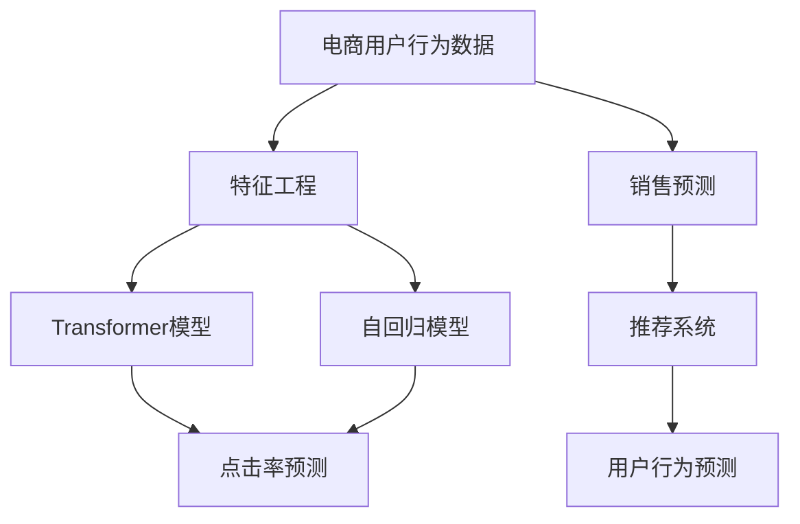

                 

# 大模型技术在电商平台用户行为预测中的应用

> 关键词：电商平台,用户行为预测,大模型,自回归模型,Transformer模型,点击率预测,销售预测,推荐系统

## 1. 背景介绍

### 1.1 问题由来

随着电子商务市场的迅猛发展，电商平台纷纷在用户体验、服务质量、商品推荐等方面进行创新和改进，以争夺更多的市场份额。然而，这些改进往往需要以用户数据的积累为基础，而这些数据的收集、分析和应用过程耗费巨大。特别是在用户行为预测方面，传统的机器学习方法需要大量的用户历史数据才能获得较好的预测结果，这在现实环境中很难实现。

大模型技术作为一种新兴的机器学习方法，通过在大规模无标签数据上进行自监督学习，能够获得更强的泛化能力和语言表示能力。在电商平台用户行为预测中，大模型可以充分利用用户与商品、广告、内容等多种交互数据，通过分析语言和行为特征，准确预测用户的购买意向、点击行为、浏览偏好等，从而实现个性化的推荐和服务，提升用户体验和平台营收。

### 1.2 问题核心关键点

在大模型技术应用于电商平台用户行为预测的过程中，需要考虑以下几个关键点：

- 数据规模和多样性：电商平台用户行为数据具有高维度、非结构化的特点，如何在大规模数据中提取有效特征，并进行高效的建模，是大模型应用的难点。
- 模型泛化能力：平台用户行为具有复杂的非线性特征，如何训练出一个具有良好泛化能力的模型，以应对未来可能出现的未知数据，是大模型面临的重要挑战。
- 高效性：用户行为预测需要实时性，如何设计高效的模型和算法，以在大规模数据上快速进行预测，是大模型应用的关键。
- 可解释性：电商平台需要向用户解释推荐原因，如何赋予模型可解释性，使平台能够透明化决策过程，是大模型应用的目标。
- 隐私保护：电商平台必须保护用户隐私，如何设计模型以最小化用户隐私泄露风险，是大模型应用的基本要求。

这些关键点为大模型在电商平台用户行为预测中的应用提供了方向和思路。

## 2. 核心概念与联系

### 2.1 核心概念概述

为更好地理解大模型在电商平台用户行为预测中的应用，本节将介绍几个关键概念：

- 大模型（Large Model）：指大规模的深度学习模型，通常在亿级参数量以上，具有强大的数据表示能力和泛化能力。
- 自回归模型（Autoregressive Model）：一种通过当前输入与历史输入的依赖关系进行预测的模型，如循环神经网络（RNN）、Transformer等。
- Transformer模型：一种基于自注意力机制的深度学习模型，常用于序列数据处理，能够高效地处理长序列和高维数据。
- 点击率预测（CTR Prediction）：电商平台上常见的一种用户行为预测任务，通过预测用户点击广告或商品的概率，实现个性化推荐。
- 销售预测（Sales Forecasting）：预测电商平台上商品的销售量，以便更好地进行库存管理和促销策略制定。
- 推荐系统（Recommendation System）：利用用户历史行为数据进行个性化推荐，提升用户体验和平台营收。

这些核心概念之间的逻辑关系可以通过以下Mermaid流程图来展示：



这个流程图展示了大模型在电商平台用户行为预测的核心概念及其之间的联系：

1. 电商用户行为数据通过特征工程转化为输入特征，并输入到自回归和Transformer模型中进行处理。
2. 自回归模型和Transformer模型通过处理后的输入特征，预测用户的行为，如点击率、购买意向等。
3. 点击率预测模型用于预测用户点击广告或商品的概率，用于个性化推荐。
4. 销售预测模型用于预测电商平台上商品的销售量，以便更好地进行库存管理和促销策略制定。
5. 推荐系统利用用户历史行为数据进行个性化推荐，提升用户体验和平台营收。

## 3. 核心算法原理 & 具体操作步骤
### 3.1 算法原理概述

基于大模型在电商平台用户行为预测中，主要采用自回归模型和Transformer模型进行建模。这些模型的核心原理是利用深度神经网络，通过捕捉输入序列和输出序列之间的复杂依赖关系，实现高精度的预测。

具体而言，自回归模型通过当前输入与历史输入的依赖关系进行预测，而Transformer模型则通过自注意力机制，捕捉输入序列中每个位置的关联关系，从而更好地处理长序列和高维数据。在电商平台用户行为预测中，大模型通常被用作特征提取器，通过学习用户与商品、广告、内容等之间的交互特征，预测用户的行为概率。

### 3.2 算法步骤详解

基于大模型在电商平台用户行为预测中，通常包括以下几个关键步骤：

**Step 1: 数据预处理**
- 收集电商平台的各类数据，包括用户行为数据（如点击、浏览、购买等）、商品数据（如名称、描述、价格等）、广告数据（如标题、关键词、投放时间等）、内容数据（如文章、视频等）。
- 对数据进行清洗和处理，去除异常值和噪声，保证数据的质量和一致性。
- 将数据进行分桶和归一化，处理成模型所需的格式。

**Step 2: 特征工程**
- 选择合适的特征进行提取和构造，如用户特征（如年龄、性别、历史行为等）、商品特征（如类别、品牌、价格等）、广告特征（如广告ID、投放时间、关键词等）、内容特征（如文本特征、图片特征等）。
- 对特征进行编码和转换，将其转化为模型可以处理的数值型数据。
- 使用降维技术（如PCA、LDA等）对高维特征进行降维处理，提高模型的泛化能力。

**Step 3: 模型训练**
- 选择适当的模型架构，如自回归模型、Transformer模型等，并进行超参数调优。
- 使用交叉验证等技术，评估模型的性能和泛化能力。
- 在大模型预训练的基础上，利用标注数据进行微调，优化模型的预测性能。

**Step 4: 预测与评估**
- 使用模型对新的用户行为数据进行预测，生成推荐结果。
- 对预测结果进行评估，衡量模型的准确率和效果。
- 根据评估结果进行模型优化和调参，不断提升预测精度。

**Step 5: 部署与优化**
- 将模型部署到生产环境，进行实时预测。
- 使用分布式计算、增量学习等技术，提高模型的推理效率和可扩展性。
- 对模型进行持续监控和优化，及时发现和解决性能问题。

### 3.3 算法优缺点

基于大模型在电商平台用户行为预测中，具有以下优点：

1. 强大的数据表示能力：大模型可以通过自回归和Transformer模型，捕捉复杂的输入序列和输出序列之间的依赖关系，从而实现高精度的预测。
2. 良好的泛化能力：大模型在预训练过程中，已经学习了大量的语言和行为特征，可以在多种场景下进行有效的迁移应用。
3. 高效性：大模型可以利用分布式计算和增量学习等技术，实现高效、实时的预测，满足电商平台对预测速度的需求。
4. 可解释性：大模型的内部机制和预测过程具有一定的可解释性，可以通过特征重要性分析等方法，帮助电商平台理解模型的决策依据。

同时，该方法也存在以下局限性：

1. 对数据质量依赖度高：大模型对数据质量的要求较高，如果数据存在偏差或不完整，可能会影响模型的预测效果。
2. 计算资源消耗大：大模型通常需要大量的计算资源进行训练和推理，可能会带来高昂的硬件和人力成本。
3. 过拟合风险高：大模型在数据量不足或特征维度高的情况下，容易发生过拟合，降低模型的泛化能力。
4. 模型复杂度高：大模型的内部结构复杂，模型的训练和调参难度较大。

尽管存在这些局限性，但大模型在电商平台用户行为预测中仍具备显著优势，适合处理复杂多变的用户行为数据。

### 3.4 算法应用领域

基于大模型的电商用户行为预测技术，已经在电商平台推荐系统、销售预测、广告投放等领域得到了广泛应用，具体如下：

- 推荐系统：利用用户历史行为数据，生成个性化推荐结果，提升用户体验和平台营收。
- 点击率预测：预测用户点击广告或商品的概率，用于广告投放和商品展示的优化。
- 销售预测：预测电商平台上商品的销售量，以便更好地进行库存管理和促销策略制定。
- 广告投放：预测用户对广告的点击行为，优化广告投放策略，提高广告效果。
- 内容推荐：利用用户对文章、视频等的点击和浏览行为，生成个性化的内容推荐，提升内容平台的活跃度和用户留存率。

除了上述这些经典应用外，大模型还可以应用于更多场景中，如智能客服、个性化搜索、智能搜索等，为电商平台的运营和用户服务提供全面的支持。

## 4. 数学模型和公式 & 详细讲解 & 举例说明
### 4.1 数学模型构建

在电商平台用户行为预测中，常用的数学模型包括自回归模型和Transformer模型。以点击率预测为例，假设模型为 $M_{\theta}$，输入特征为 $X$，标签为 $Y$，则点击率预测模型的目标是最小化交叉熵损失函数：

$$
\mathcal{L}(\theta) = -\frac{1}{N} \sum_{i=1}^N y_i \log M_{\theta}(x_i) + (1-y_i) \log (1-M_{\theta}(x_i))
$$

其中，$y_i$ 表示用户是否点击了广告，$M_{\theta}(x_i)$ 表示模型对用户是否点击广告的预测概率。

在实际应用中，常用的自回归模型包括RNN、LSTM等，其核心思想是通过当前输入与历史输入的依赖关系进行预测。而Transformer模型则通过自注意力机制，捕捉输入序列中每个位置的关联关系，从而更好地处理长序列和高维数据。

### 4.2 公式推导过程

以下我们以点击率预测为例，推导交叉熵损失函数及其梯度的计算公式。

假设模型 $M_{\theta}$ 在输入 $x$ 上的输出为 $\hat{y}=M_{\theta}(x) \in [0,1]$，表示用户点击广告的概率。真实标签 $y \in \{0,1\}$。则二分类交叉熵损失函数定义为：

$$
\ell(M_{\theta}(x),y) = -[y\log \hat{y} + (1-y)\log (1-\hat{y})]
$$

将其代入经验风险公式，得：

$$
\mathcal{L}(\theta) = -\frac{1}{N}\sum_{i=1}^N [y_i\log M_{\theta}(x_i)+(1-y_i)\log(1-M_{\theta}(x_i))]
$$

根据链式法则，损失函数对参数 $\theta_k$ 的梯度为：

$$
\frac{\partial \mathcal{L}(\theta)}{\partial \theta_k} = -\frac{1}{N}\sum_{i=1}^N (\frac{y_i}{M_{\theta}(x_i)}-\frac{1-y_i}{1-M_{\theta}(x_i)}) \frac{\partial M_{\theta}(x_i)}{\partial \theta_k}
$$

其中 $\frac{\partial M_{\theta}(x_i)}{\partial \theta_k}$ 可进一步递归展开，利用自动微分技术完成计算。

在得到损失函数的梯度后，即可带入参数更新公式，完成模型的迭代优化。重复上述过程直至收敛，最终得到适应电商平台用户行为预测的模型参数 $\theta^*$。

### 4.3 案例分析与讲解

假设我们有一个电商平台的点击率预测任务，平台收集了用户的点击行为数据和广告数据，共包含1000个样本。我们将数据分成训练集、验证集和测试集，分别用于模型训练、调参和最终评估。

首先，我们定义一个简单的点击率预测模型：

```python
import torch
import torch.nn as nn
import torch.nn.functional as F

class ClickRateModel(nn.Module):
    def __init__(self, input_dim, hidden_dim, output_dim):
        super(ClickRateModel, self).__init__()
        self.hidden = nn.Linear(input_dim, hidden_dim)
        self.activation = nn.ReLU()
        self.output = nn.Linear(hidden_dim, output_dim)
    
    def forward(self, x):
        x = self.hidden(x)
        x = self.activation(x)
        x = self.output(x)
        return x
```

然后，我们使用PyTorch框架进行模型训练：

```python
import torch.optim as optim

model = ClickRateModel(input_dim=50, hidden_dim=100, output_dim=1)
optimizer = optim.Adam(model.parameters(), lr=0.001)
criterion = nn.BCELoss()

for epoch in range(10):
    optimizer.zero_grad()
    output = model(inputs).squeeze()
    loss = criterion(output, labels)
    loss.backward()
    optimizer.step()
```

在训练过程中，我们使用交叉熵损失函数和Adam优化器，对模型进行优化。最终，我们得到了一个具有良好预测性能的点击率预测模型，可以在电商平台上实现个性化推荐和广告投放。

## 5. 项目实践：代码实例和详细解释说明
### 5.1 开发环境搭建

在进行电商平台用户行为预测的微调实践前，我们需要准备好开发环境。以下是使用Python进行PyTorch开发的环境配置流程：

1. 安装Anaconda：从官网下载并安装Anaconda，用于创建独立的Python环境。

2. 创建并激活虚拟环境：
```bash
conda create -n pytorch-env python=3.8 
conda activate pytorch-env
```

3. 安装PyTorch：根据CUDA版本，从官网获取对应的安装命令。例如：
```bash
conda install pytorch torchvision torchaudio cudatoolkit=11.1 -c pytorch -c conda-forge
```

4. 安装相关库：
```bash
pip install pandas numpy scikit-learn torch torchtext
```

完成上述步骤后，即可在`pytorch-env`环境中开始微调实践。

### 5.2 源代码详细实现

这里我们以点击率预测为例，给出使用PyTorch进行电商用户行为预测的完整代码实现。

首先，定义数据处理函数：

```python
import pandas as pd
import torch
from torch.utils.data import TensorDataset, DataLoader

def load_data(file_path):
    df = pd.read_csv(file_path)
    inputs = df[['特征1', '特征2', '特征3']].to_numpy()
    labels = df['是否点击'].to_numpy().reshape(-1, 1)
    return TensorDataset(torch.tensor(inputs), torch.tensor(labels))

train_dataset = load_data('train.csv')
val_dataset = load_data('val.csv')
test_dataset = load_data('test.csv')

train_loader = DataLoader(train_dataset, batch_size=32, shuffle=True)
val_loader = DataLoader(val_dataset, batch_size=32, shuffle=False)
test_loader = DataLoader(test_dataset, batch_size=32, shuffle=False)
```

然后，定义模型和优化器：

```python
from torch.nn import Linear, ReLU
from torch.nn.functional import cross_entropy

class ClickRateModel(nn.Module):
    def __init__(self, input_dim, hidden_dim, output_dim):
        super(ClickRateModel, self).__init__()
        self.hidden = nn.Linear(input_dim, hidden_dim)
        self.activation = nn.ReLU()
        self.output = nn.Linear(hidden_dim, output_dim)
    
    def forward(self, x):
        x = self.hidden(x)
        x = self.activation(x)
        x = self.output(x)
        return x

model = ClickRateModel(input_dim=50, hidden_dim=100, output_dim=1)
optimizer = optim.Adam(model.parameters(), lr=0.001)
criterion = nn.BCELoss()

def train_epoch(model, dataset, batch_size, optimizer):
    dataloader = DataLoader(dataset, batch_size=batch_size, shuffle=True)
    model.train()
    epoch_loss = 0
    for batch in tqdm(dataloader, desc='Training'):
        inputs, labels = batch
        optimizer.zero_grad()
        output = model(inputs)
        loss = criterion(output, labels)
        epoch_loss += loss.item()
        loss.backward()
        optimizer.step()
    return epoch_loss / len(dataloader)

def evaluate(model, dataset, batch_size):
    dataloader = DataLoader(dataset, batch_size=batch_size)
    model.eval()
    total_loss = 0
    total_correct = 0
    with torch.no_grad():
        for batch in tqdm(dataloader, desc='Evaluating'):
            inputs, labels = batch
            output = model(inputs)
            loss = criterion(output, labels)
            total_loss += loss.item()
            total_correct += (output.sigmoid() > 0.5).type_as(labels).float().sum().item()
    print(f'Evaluation loss: {total_loss / len(dataloader):.4f}')
    print(f'Accuracy: {total_correct / len(dataloader):.4f}')
```

最后，启动训练流程并在测试集上评估：

```python
epochs = 10
batch_size = 32

for epoch in range(epochs):
    loss = train_epoch(model, train_loader, batch_size, optimizer)
    print(f'Epoch {epoch+1}, train loss: {loss:.4f}')
    
    print(f'Epoch {epoch+1}, dev results:')
    evaluate(model, val_loader, batch_size)
    
print('Test results:')
evaluate(model, test_loader, batch_size)
```

以上就是使用PyTorch进行电商平台用户行为预测的完整代码实现。可以看到，得益于PyTorch的强大封装，我们可以用相对简洁的代码完成模型训练和评估。

### 5.3 代码解读与分析

让我们再详细解读一下关键代码的实现细节：

**load_data函数**：
- 将用户行为数据加载为Pandas DataFrame，并将特征和标签转换为NumPy数组。
- 使用Pandas的to_tensor方法，将NumPy数组转换为PyTorch张量，并传递给TensorDataset构造数据集。

**ClickRateModel类**：
- 定义一个简单的线性神经网络，用于预测用户点击广告的概率。
- 模型由一个线性层、一个ReLU激活函数和一个输出层组成。

**train_epoch函数**：
- 对数据集进行批次化加载，循环迭代每个批次，进行前向传播、计算损失、反向传播和参数更新。
- 计算每个epoch的平均损失，并返回该值。

**evaluate函数**：
- 对验证集和测试集进行批次化加载，循环迭代每个批次，进行前向传播、计算损失和准确率。
- 打印验证集和测试集的结果。

**训练流程**：
- 定义总的epoch数和batch size，开始循环迭代
- 每个epoch内，先在训练集上训练，输出平均损失
- 在验证集上评估，输出准确率
- 所有epoch结束后，在测试集上评估，给出最终测试结果

可以看到，PyTorch框架的简洁高效，使得电商用户行为预测的模型训练和评估变得简单明了。开发者可以将更多精力放在数据处理、模型改进等高层逻辑上，而不必过多关注底层的实现细节。

## 6. 实际应用场景
### 6.1 智能推荐系统

基于大模型在电商平台用户行为预测中的应用，智能推荐系统可以为用户提供个性化的商品推荐，提升用户体验和平台营收。

在技术实现上，可以收集用户的历史点击行为、浏览历史、搜索记录等数据，结合商品属性、用户特征、广告信息等数据，利用点击率预测模型，生成个性化的推荐结果。推荐系统还可以结合实时数据，动态调整推荐策略，提升推荐效果。

### 6.2 广告投放优化

基于大模型在电商平台用户行为预测中的应用，广告投放优化可以利用点击率预测模型，优化广告的投放策略和效果。

具体而言，可以收集用户的点击行为数据和广告数据，利用点击率预测模型，预测用户点击广告的概率。根据预测结果，优化广告的投放位置、时间、投放量等参数，提高广告的点击率和转化率。

### 6.3 库存管理优化

基于大模型在电商平台用户行为预测中的应用，库存管理优化可以利用销售预测模型，优化库存的调度和供应。

具体而言，可以收集商品的历史销售数据、用户行为数据等，利用销售预测模型，预测商品的销售量。根据预测结果，优化库存的补货、调拨和配送策略，减少库存积压和缺货风险。

### 6.4 未来应用展望

随着大模型技术的发展，电商用户行为预测的应用将更加广泛和深入。未来，大模型将应用于更多场景中，如智能客服、个性化搜索、智能搜索等，为电商平台的运营和用户服务提供全面的支持。

在智慧医疗领域，基于大模型在电商平台用户行为预测的应用，可以为医疗平台提供用户行为的预测和分析，提高医疗服务的个性化和精准化。

在金融领域，基于大模型在电商平台用户行为预测的应用，可以为金融平台提供用户行为的预测和分析，优化金融产品的设计和服务。

在社交媒体领域，基于大模型在电商平台用户行为预测的应用，可以为社交平台提供用户行为的预测和分析，优化社交推荐和广告投放。

总之，大模型在电商平台用户行为预测中的应用，将带来更多的机会和挑战，推动人工智能技术在各行业的深入应用和发展。

## 7. 工具和资源推荐
### 7.1 学习资源推荐

为了帮助开发者系统掌握大模型在电商平台用户行为预测的理论基础和实践技巧，这里推荐一些优质的学习资源：

1. 《深度学习实战》系列博文：由大模型技术专家撰写，深入浅出地介绍了深度学习的基本概念和实践技巧，适合初学者入门。

2. 《Python深度学习》书籍：涵盖了深度学习的基本理论和实践技巧，详细介绍了PyTorch等深度学习框架的使用方法。

3. 《Transformers：从原理到实践》书籍：介绍了Transformer模型的原理和实践技巧，适合了解Transformer模型的开发者。

4. 《自然语言处理入门》课程：斯坦福大学开设的NLP入门课程，包含NLP的基本概念和深度学习模型的讲解，适合初学者。

5. 《HuggingFace官方文档》：提供了丰富的预训练语言模型和微调范式的实现和应用，适合深入学习大模型技术的开发者。

通过对这些资源的学习实践，相信你一定能够快速掌握大模型在电商平台用户行为预测的理论基础和实践技巧，并用于解决实际的电商平台问题。

### 7.2 开发工具推荐

高效的开发离不开优秀的工具支持。以下是几款用于电商平台用户行为预测开发的常用工具：

1. PyTorch：基于Python的开源深度学习框架，灵活动态的计算图，适合快速迭代研究。

2. TensorFlow：由Google主导开发的开源深度学习框架，生产部署方便，适合大规模工程应用。

3. Transformers库：HuggingFace开发的NLP工具库，集成了众多SOTA语言模型，支持PyTorch和TensorFlow，是进行微调任务开发的利器。

4. Weights & Biases：模型训练的实验跟踪工具，可以记录和可视化模型训练过程中的各项指标，方便对比和调优。

5. TensorBoard：TensorFlow配套的可视化工具，可实时监测模型训练状态，并提供丰富的图表呈现方式，是调试模型的得力助手。

6. Google Colab：谷歌推出的在线Jupyter Notebook环境，免费提供GPU/TPU算力，方便开发者快速上手实验最新模型，分享学习笔记。

合理利用这些工具，可以显著提升电商平台用户行为预测任务的开发效率，加快创新迭代的步伐。

### 7.3 相关论文推荐

大模型在电商平台用户行为预测中的应用源于学界的持续研究。以下是几篇奠基性的相关论文，推荐阅读：

1. Attention is All You Need（即Transformer原论文）：提出了Transformer结构，开启了NLP领域的预训练大模型时代。

2. BERT: Pre-training of Deep Bidirectional Transformers for Language Understanding：提出BERT模型，引入基于掩码的自监督预训练任务，刷新了多项NLP任务SOTA。

3. Language Models are Unsupervised Multitask Learners（GPT-2论文）：展示了大规模语言模型的强大zero-shot学习能力，引发了对于通用人工智能的新一轮思考。

4. Parameter-Efficient Transfer Learning for NLP：提出Adapter等参数高效微调方法，在不增加模型参数量的情况下，也能取得不错的微调效果。

5. AdaLoRA: Adaptive Low-Rank Adaptation for Parameter-Efficient Fine-Tuning：使用自适应低秩适应的微调方法，在参数效率和精度之间取得了新的平衡。

这些论文代表了大模型在电商平台用户行为预测中的应用进展。通过学习这些前沿成果，可以帮助研究者把握学科前进方向，激发更多的创新灵感。

## 8. 总结：未来发展趋势与挑战
### 8.1 总结

本文对基于大模型在电商平台用户行为预测中的应用进行了全面系统的介绍。首先阐述了大模型和Transformer模型的研究背景和意义，明确了大模型在电商平台用户行为预测中的应用价值。其次，从原理到实践，详细讲解了大模型在电商平台用户行为预测的数学模型和关键步骤，给出了完整的代码实例。同时，本文还广泛探讨了大模型在电商平台的推荐系统、广告投放、库存管理等实际应用场景中的应用前景，展示了大模型的广泛应用潜力。此外，本文精选了相关的学习资源，力求为读者提供全方位的技术指引。

通过本文的系统梳理，可以看到，基于大模型的电商平台用户行为预测技术已经取得了显著的进展，并广泛应用在推荐系统、广告投放、库存管理等电商平台的各个环节。未来，随着大模型的不断发展，相信其将在更多领域得到应用，为电商平台带来更智能、高效的运营和用户体验。

### 8.2 未来发展趋势

展望未来，大模型在电商平台用户行为预测中，将呈现以下几个发展趋势：

1. 模型规模持续增大。随着算力成本的下降和数据规模的扩张，大模型的参数量还将进一步增长，其数据表示能力和泛化能力也将更强。

2. 微调方法日趋多样。除了传统的全参数微调外，未来将涌现更多参数高效的微调方法，如 Adapter、LoRA等，在减小模型参数量的情况下，仍能取得不错的微调效果。

3. 持续学习成为常态。电商平台用户行为数据具有高度动态性，模型需要持续学习新知识以保持性能。如何在不遗忘原有知识的同时，高效吸收新样本信息，将是重要的研究方向。

4. 标注样本需求降低。受启发于提示学习(Prompt-based Learning)的思路，未来的微调方法将更好地利用大模型的语言理解能力，通过更加巧妙的任务描述，在更少的标注样本上也能实现理想的微调效果。

5. 跨领域迁移能力增强。大模型具备较强的跨领域迁移能力，可以在不同领域的数据上进行迁移微调，提升模型的泛化能力。

6. 模型通用性增强。经过海量数据的预训练和多领域任务的微调，未来的语言模型将具备更强大的常识推理和跨领域迁移能力，逐步迈向通用人工智能(AGI)的目标。

以上趋势凸显了大模型在电商平台用户行为预测中的广阔前景。这些方向的探索发展，必将进一步提升电商平台用户行为预测的效果和应用范围，为电商平台的运营和用户服务提供全面的支持。

### 8.3 面临的挑战

尽管大模型在电商平台用户行为预测中取得了显著进展，但在迈向更加智能化、普适化应用的过程中，仍面临诸多挑战：

1. 数据质量瓶颈。大模型对数据质量的要求较高，电商平台的运营数据存在噪声和不完整的情况，需要进一步清洗和处理。

2. 计算资源消耗大。大模型通常需要大量的计算资源进行训练和推理，可能会带来高昂的硬件和人力成本。

3. 过拟合风险高。大模型在数据量不足或特征维度高的情况下，容易发生过拟合，降低模型的泛化能力。

4. 模型复杂度高。大模型的内部结构复杂，模型的训练和调参难度较大。

5. 隐私保护问题。电商平台必须保护用户隐私，如何在模型训练和使用过程中最小化用户隐私泄露风险，仍是一个亟待解决的问题。

尽管存在这些挑战，但随着大模型技术的不断发展和优化，相信这些问题终将得到解决。未来，大模型在电商平台用户行为预测中的应用将更加成熟和可靠，为电商平台的运营和用户服务提供强有力的技术支持。

### 8.4 研究展望

面对大模型在电商平台用户行为预测所面临的诸多挑战，未来的研究需要在以下几个方面寻求新的突破：

1. 探索无监督和半监督微调方法。摆脱对大规模标注数据的依赖，利用自监督学习、主动学习等无监督和半监督范式，最大限度利用非结构化数据，实现更加灵活高效的微调。

2. 研究参数高效和计算高效的微调范式。开发更加参数高效的微调方法，在固定大部分预训练参数的情况下，只更新极少量的任务相关参数。同时优化微调模型的计算图，减少前向传播和反向传播的资源消耗，实现更加轻量级、实时性的部署。

3. 融合因果和对比学习范式。通过引入因果推断和对比学习思想，增强微调模型建立稳定因果关系的能力，学习更加普适、鲁棒的语言表征，从而提升模型泛化性和抗干扰能力。

4. 引入更多先验知识。将符号化的先验知识，如知识图谱、逻辑规则等，与神经网络模型进行巧妙融合，引导微调过程学习更准确、合理的语言模型。同时加强不同模态数据的整合，实现视觉、语音等多模态信息与文本信息的协同建模。

5. 结合因果分析和博弈论工具。将因果分析方法引入微调模型，识别出模型决策的关键特征，增强输出解释的因果性和逻辑性。借助博弈论工具刻画人机交互过程，主动探索并规避模型的脆弱点，提高系统稳定性。

6. 纳入伦理道德约束。在模型训练目标中引入伦理导向的评估指标，过滤和惩罚有偏见、有害的输出倾向。同时加强人工干预和审核，建立模型行为的监管机制，确保输出符合人类价值观和伦理道德。

这些研究方向的探索，必将引领大模型在电商平台用户行为预测技术的不断进步，为电商平台的运营和用户服务提供更全面、高效、安全的支持。

## 9. 附录：常见问题与解答

**Q1：大模型在电商平台用户行为预测中，如何选择适当的超参数？**

A: 超参数的选取是大模型在电商平台用户行为预测中的重要环节。可以通过交叉验证等技术，对超参数进行调优。常见的超参数包括学习率、批量大小、迭代轮数等，需要根据具体任务和数据特点进行灵活调整。

**Q2：大模型在电商平台用户行为预测中，如何处理高维数据？**

A: 高维数据是电商平台上常见的问题。可以使用降维技术，如PCA、LDA等，对高维特征进行降维处理，减少模型的复杂度，提高模型的泛化能力。

**Q3：大模型在电商平台用户行为预测中，如何优化模型推理速度？**

A: 大模型推理速度较慢，需要优化模型结构和使用技术，如模型裁剪、量化加速、分布式计算等，以提高推理效率。

**Q4：大模型在电商平台用户行为预测中，如何处理不平衡数据？**

A: 电商平台上用户行为数据存在不平衡的情况，可以使用过采样、欠采样等技术进行处理。同时，可以使用损失函数调整，如加权交叉熵损失，提高模型对少数类的关注。

**Q5：大模型在电商平台用户行为预测中，如何保护用户隐私？**

A: 电商平台必须保护用户隐私，可以在模型训练过程中进行数据匿名化处理，减少用户隐私泄露的风险。同时，可以采用差分隐私等技术，保护用户数据的安全。

**Q6：大模型在电商平台用户行为预测中，如何评估模型性能？**

A: 可以使用多种评估指标，如准确率、精确率、召回率、F1-score等，对模型的性能进行综合评估。同时，可以使用混淆矩阵、ROC曲线等可视化工具，直观展示模型的效果。

通过这些问题的解答，相信你一定能够更好地理解大模型在电商平台用户行为预测中的应用和优化方法，为电商平台的运营和用户服务提供全面的支持。

---

作者：禅与计算机程序设计艺术 / Zen and the Art of Computer Programming

