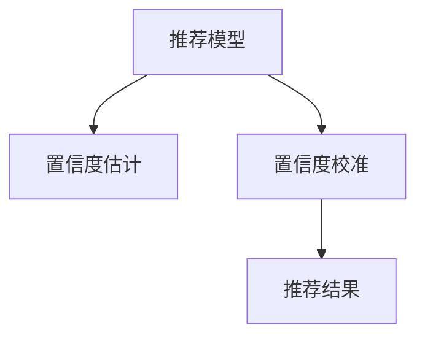

                 

# 大模型推荐中的推荐结果置信度估计与校准技术

## 1. 背景介绍

### 1.1 问题由来
推荐系统是互联网时代用户获取个性化信息的重要工具。无论是电商平台、视频网站还是社交网络，推荐系统都在为海量用户提供个性化内容推荐。然而，由于推荐算法模型的多样性和不确定性，推荐结果的置信度和可解释性仍是一个难以解决的问题。在推荐结果准确性的基础上，如果能提供推荐结果的置信度，使用户更加相信推荐结果，并主动探索这些结果，能够进一步提升用户体验，促进产品增长。

为了解决推荐结果的置信度问题，近年来涌现出了大量的置信度估计与校准技术。这些技术不仅能够提升推荐系统的性能，还能为推荐算法的研究和优化提供新的视角。因此，本文章将对推荐结果的置信度估计与校准技术进行全面介绍，并结合实际应用场景进行深入讨论。

### 1.2 问题核心关键点
在推荐系统中，推荐结果的置信度估计与校准技术的核心问题包括：
1. 如何准确估计推荐结果的概率分布，即推断出每个推荐项被用户点击、购买、互动的概率。
2. 如何对推荐结果的置信度进行校准，避免过拟合或欠拟合，使得模型在实际应用中表现稳定。
3. 如何结合推荐模型和置信度估计模型，生成更可信的推荐结果。

针对以上问题，本文章将依次介绍置信度估计与校准技术的原理、步骤和应用场景。

## 2. 核心概念与联系

### 2.1 核心概念概述

推荐系统的核心概念包括：
1. **推荐模型**：基于用户和物品特征的模型，用于预测用户对物品的偏好或行为。常见的推荐模型有协同过滤、基于内容的推荐、矩阵分解等。
2. **置信度估计**：预测每个推荐结果的概率分布，即在给定用户和物品特征的条件下，预测用户点击、购买、互动的概率。常见的置信度估计方法包括最大似然估计、最大后验概率估计等。
3. **置信度校准**：对置信度估计的结果进行校准，避免置信度估计偏差，提升推荐系统的稳定性和鲁棒性。常用的置信度校准方法包括贝叶斯校准、最大熵校准等。

这些核心概念之间的逻辑关系可以通过以下Mermaid流程图来展示：



这个流程图展示出推荐系统的核心流程：
1. 推荐模型基于用户和物品特征预测用户行为。
2. 置信度估计计算每个推荐项的点击、购买、互动概率。
3. 置信度校准对置信度估计结果进行修正，提高模型稳定性和鲁棒性。
4. 最终生成推荐结果，并输出推荐置信度。

## 3. 核心算法原理 & 具体操作步骤
### 3.1 算法原理概述

推荐结果的置信度估计与校准技术的核心思想是，在推荐模型预测的基础上，对每个推荐项的置信度进行估计，并对其进行校准，最终生成更加可信的推荐结果。具体而言，该过程可以分为以下几步：

1. **推荐模型预测**：使用推荐模型对用户和物品特征进行预测，得到每个推荐项的用户行为概率。
2. **置信度估计**：在推荐模型预测结果的基础上，使用置信度估计方法对推荐结果的置信度进行估计。
3. **置信度校准**：对置信度估计结果进行校准，避免置信度偏差。
4. **推荐结果生成**：结合推荐模型和置信度估计模型，生成最终的推荐结果和置信度。

### 3.2 算法步骤详解

#### 3.2.1 推荐模型预测
推荐模型的预测过程通常包括以下步骤：
1. **特征提取**：从用户和物品的原始数据中提取特征，如用户历史行为、物品属性、用户画像等。
2. **模型训练**：使用历史数据对推荐模型进行训练，使其能够预测用户对物品的偏好或行为。
3. **预测结果**：对新用户和物品特征进行预测，得到每个推荐项的点击、购买、互动概率。

#### 3.2.2 置信度估计
置信度估计的目的是对推荐模型的预测结果进行概率估计，即推断出每个推荐项被用户点击、购买、互动的概率。常见的置信度估计方法包括最大似然估计和最大后验概率估计。

- **最大似然估计**：假设推荐模型的预测结果服从概率分布 $P(Y|X)$，其中 $X$ 为推荐项和用户特征，$Y$ 为点击、购买、互动等行为。使用历史数据对模型进行训练，使得模型能够最大化似然函数 $P(D|X)$，即在给定用户和物品特征的情况下，最大化观测数据 $D$ 的概率。
- **最大后验概率估计**：在最大似然估计的基础上，通过引入先验知识对置信度进行估计。例如，可以假设先验概率 $P(X)$，在给定用户和物品特征的情况下，通过贝叶斯定理计算后验概率 $P(Y|X)$，即推荐项的点击、购买、互动概率。

#### 3.2.3 置信度校准
置信度校准的目的是对置信度估计结果进行修正，避免置信度偏差。常用的置信度校准方法包括贝叶斯校准和最大熵校准。

- **贝叶斯校准**：在置信度估计的基础上，通过引入置信度偏差 $b$ 对推荐结果进行校准。具体来说，假设推荐结果的实际概率分布为 $P(Y|X)$，通过贝叶斯定理计算修正后的概率分布 $P(Y|X,b)$，使得修正后的概率分布与实际分布一致。
- **最大熵校准**：通过引入额外的约束条件，使得置信度估计结果更加平滑，避免过拟合或欠拟合。例如，可以假设置信度估计结果的熵 $H$ 最大化，使得模型在各个分类上的预测概率更加均匀。

#### 3.2.4 推荐结果生成
结合推荐模型和置信度估计模型，生成最终的推荐结果和置信度。具体过程如下：
1. **预测结果**：使用推荐模型对用户和物品特征进行预测，得到每个推荐项的点击、购买、互动概率。
2. **置信度估计**：在推荐模型预测结果的基础上，使用置信度估计方法对推荐结果的置信度进行估计。
3. **置信度校准**：对置信度估计结果进行校准，避免置信度偏差。
4. **推荐结果生成**：结合推荐模型和置信度估计模型，生成最终的推荐结果和置信度。

### 3.3 算法优缺点

基于推荐结果的置信度估计与校准技术的优缺点如下：

#### 3.3.1 优点
1. **提高推荐系统性能**：通过置信度估计与校准，能够提升推荐系统的性能，尤其是在推荐结果准确性基础上，提供推荐结果的置信度，使用户更加相信推荐结果。
2. **提升用户满意度**：置信度估计与校准技术能够提高推荐系统的透明度和可解释性，帮助用户理解推荐结果背后的逻辑，提升用户满意度。
3. **支持个性化推荐**：置信度估计与校准技术能够根据用户的行为特征和偏好，提供个性化的推荐结果，提升用户体验。

#### 3.3.2 缺点
1. **计算复杂度高**：置信度估计与校准技术需要在推荐模型预测的基础上，进行额外的概率计算和校准，计算复杂度较高，需要更多的计算资源。
2. **需要更多的标注数据**：置信度估计与校准技术通常需要更多的标注数据，尤其是在训练置信度校准模型时，需要大量的校准样本。
3. **模型复杂度高**：置信度估计与校准技术的模型通常比较复杂，需要更多的调参和优化，增加了模型训练的难度。

## 4. 数学模型和公式 & 详细讲解 & 举例说明

### 4.1 数学模型构建

为了更好地理解推荐结果的置信度估计与校准技术的数学原理，本节将介绍几个关键数学模型：

- **推荐模型**：假设推荐模型为 $P(Y|X)$，其中 $X$ 为推荐项和用户特征，$Y$ 为点击、购买、互动等行为。
- **置信度估计**：假设置信度估计模型为 $Q(Y|X,b)$，其中 $b$ 为置信度偏差。
- **置信度校准**：假设置信度校准模型为 $S(Q|P)$，其中 $P$ 为置信度估计结果，$S$ 为置信度校准结果。

这些模型的关系可以通过以下公式来描述：

$$
S(Q|P) = Q(Y|X,b) = P(Y|X)
$$

其中，$Q(Y|X,b)$ 表示在置信度估计的基础上，进行校准后的推荐结果。

### 4.2 公式推导过程

#### 4.2.1 推荐模型
假设推荐模型为 $P(Y|X)$，其中 $X$ 为推荐项和用户特征，$Y$ 为点击、购买、互动等行为。使用历史数据对模型进行训练，使得模型能够最大化似然函数 $P(D|X)$，即在给定用户和物品特征的情况下，最大化观测数据 $D$ 的概率。

具体来说，使用最大似然估计方法，推导推荐模型的概率分布为：

$$
P(Y|X) = \frac{P(D,Y|X)}{P(D|X)} \approx \frac{\sum_{y \in Y} \sum_{x \in X} I(y,x) P(Y|X)}{\sum_{x \in X} P(D|X)}
$$

其中 $I(y,x)$ 表示在用户特征为 $x$ 的情况下，推荐项 $y$ 是否在推荐列表中，$P(D|X)$ 表示在给定用户特征 $X$ 的情况下，用户的行为数据 $D$ 的概率。

#### 4.2.2 置信度估计
假设置信度估计模型为 $Q(Y|X,b)$，其中 $b$ 为置信度偏差。使用历史数据对模型进行训练，使得模型能够最大化后验概率 $P(Y|X,b)$，即在给定用户和物品特征的情况下，最大化推荐结果的概率。

具体来说，使用最大后验概率估计方法，推导置信度估计模型的概率分布为：

$$
Q(Y|X,b) = \frac{P(Y|X) P(X)}{P(Y|X) P(X) + P(Y|X,b) P(X,b)}
$$

其中 $P(X)$ 表示用户特征的概率分布，$P(X,b)$ 表示在置信度偏差 $b$ 的情况下，用户特征的概率分布。

#### 4.2.3 置信度校准
假设置信度校准模型为 $S(Q|P)$，其中 $P$ 为置信度估计结果，$S$ 为校准后的结果。使用历史数据对模型进行训练，使得模型能够最大化置信度校准结果 $S$ 与实际概率分布 $P(Y|X)$ 的拟合度。

具体来说，使用贝叶斯校准方法，推导置信度校准模型的概率分布为：

$$
S(Q|P) = \frac{P(Q)}{P(Q) + P(S)}
$$

其中 $P(Q)$ 表示置信度估计结果 $Q$ 的概率分布，$P(S)$ 表示校准后的结果 $S$ 的概率分布。

### 4.3 案例分析与讲解

以电商平台推荐系统为例，分析置信度估计与校准技术的实际应用。

假设电商平台推荐系统使用协同过滤模型进行推荐，并使用最大似然估计方法对推荐结果进行概率估计。在推荐模型预测的基础上，通过置信度估计方法，得到每个推荐项的点击、购买、互动概率。

接下来，使用贝叶斯校准方法对置信度估计结果进行校准。具体来说，在推荐模型预测结果的基础上，通过贝叶斯定理计算校准后的概率分布，使得推荐结果更加可信。

最后，结合推荐模型和置信度校准模型，生成最终的推荐结果和置信度。具体过程如下：
1. **推荐模型预测**：使用协同过滤模型对用户和物品特征进行预测，得到每个推荐项的点击、购买、互动概率。
2. **置信度估计**：在推荐模型预测结果的基础上，使用最大似然估计方法对推荐结果的置信度进行估计。
3. **置信度校准**：对置信度估计结果进行校准，避免置信度偏差。
4. **推荐结果生成**：结合推荐模型和置信度校准模型，生成最终的推荐结果和置信度。

## 5. 项目实践：代码实例和详细解释说明

### 5.1 开发环境搭建

在进行推荐结果的置信度估计与校准技术实践前，我们需要准备好开发环境。以下是使用Python进行TensorFlow开发的环境配置流程：

1. 安装Anaconda：从官网下载并安装Anaconda，用于创建独立的Python环境。

2. 创建并激活虚拟环境：
```bash
conda create -n tf-env python=3.8 
conda activate tf-env
```

3. 安装TensorFlow：根据CUDA版本，从官网获取对应的安装命令。例如：
```bash
conda install tensorflow tensorflow-gpu=cuda11.1 -c conda-forge -c pytorch
```

4. 安装Scikit-learn：
```bash
pip install scikit-learn
```

5. 安装其他相关库：
```bash
pip install pandas numpy matplotlib seaborn joblib sklearn
```

完成上述步骤后，即可在`tf-env`环境中开始推荐结果的置信度估计与校准技术实践。

### 5.2 源代码详细实现

这里我们以推荐系统中使用协同过滤模型和最大似然估计方法为例，给出推荐结果的置信度估计与校准技术的PyTorch代码实现。

首先，定义推荐模型的训练和预测函数：

```python
import tensorflow as tf
from sklearn.metrics import roc_auc_score, roc_curve, auc
from sklearn.model_selection import train_test_split
import numpy as np
from sklearn.linear_model import LogisticRegression

class CollaborativeFiltering:
    def __init__(self, n_users, n_items, n_factors, learning_rate=0.1, num_epochs=20, verbose=0):
        self.n_users = n_users
        self.n_items = n_items
        self.n_factors = n_factors
        self.learning_rate = learning_rate
        self.num_epochs = num_epochs
        self.verbose = verbose
        self.model = self.build_model()

    def build_model(self):
        # 用户和物品的特征嵌入
        user_embeddings = tf.Variable(tf.random.normal([self.n_users, self.n_factors]))
        item_embeddings = tf.Variable(tf.random.normal([self.n_items, self.n_factors]))
        # 用户物品交互矩阵
        interaction_matrix = tf.Variable(tf.zeros([self.n_users, self.n_items]))
        # 预测用户对物品的评分
        predictions = tf.matmul(tf.matmul(user_embeddings, interaction_matrix), tf.transpose(item_embeddings))

        return tf.keras.Sequential([
            tf.keras.layers.Dense(1, activation='sigmoid'),
            tf.keras.layers.Lambda(self.sigmoid)
        ])

    def sigmoid(self, x):
        return 1 / (1 + tf.exp(-x))

    def predict(self, user_id, item_id):
        user_embedding = tf.reshape(user_embeddings[self.user_id], (1, self.n_factors))
        item_embedding = tf.reshape(item_embeddings[item_id], (1, self.n_factors))
        scores = tf.matmul(user_embedding, interaction_matrix)
        return scores[0][0]

    def train(self, users, items, ratings):
        # 将用户和物品特征转换为稀疏矩阵
        user_id, item_id = tf.split(inputs, [1, self.n_items], axis=1)
        user_id = tf.cast(user_id, tf.int32)
        item_id = tf.cast(item_id, tf.int32)
        interaction_matrix = tf.sparse.to_dense(tf.sparse.from_dense(ratings))
        # 构建预测损失
        targets = tf.expand_dims(tf.cast(ratings, tf.float32), 1)
        predictions = self.predict(user_id, item_id)
        loss = tf.losses.mean_squared_error(targets, predictions)
        # 优化器
        optimizer = tf.keras.optimizers.Adam(learning_rate=self.learning_rate)
        # 定义训练过程
        def train_step(inputs, targets):
            with tf.GradientTape() as tape:
                predictions = self.predict(inputs)
                loss = tf.losses.mean_squared_error(targets, predictions)
            gradients = tape.gradient(loss, self.model.trainable_variables)
            optimizer.apply_gradients(zip(gradients, self.model.trainable_variables))
            return loss

        # 训练模型
        for epoch in range(self.num_epochs):
            for user_id, item_id, rating in zip(users, items, ratings):
                loss = train_step([user_id, item_id], [rating])
                if self.verbose:
                    print(f"Epoch {epoch+1}, loss: {loss.numpy():.4f}")
```

然后，定义置信度估计和校准函数：

```python
class Calibration(tf.keras.Model):
    def __init__(self, n_users, n_items, n_factors, calibration_method='uniform', calibrator=None):
        super(Calibration, self).__init__()
        self.n_users = n_users
        self.n_items = n_items
        self.n_factors = n_factors
        self.calibration_method = calibration_method
        self.calibrator = calibrator
        self.user_embeddings = tf.Variable(tf.random.normal([self.n_users, self.n_factors]))
        self.item_embeddings = tf.Variable(tf.random.normal([self.n_items, self.n_factors]))
        self.interaction_matrix = tf.Variable(tf.zeros([self.n_users, self.n_items]))
        self.model = self.build_model()

    def build_model(self):
        return tf.keras.Sequential([
            tf.keras.layers.Dense(1, activation='sigmoid'),
            tf.keras.layers.Lambda(self.sigmoid)
        ])

    def sigmoid(self, x):
        return 1 / (1 + tf.exp(-x))

    def predict(self, user_id, item_id):
        user_embedding = tf.reshape(user_embeddings[self.user_id], (1, self.n_factors))
        item_embedding = tf.reshape(item_embeddings[item_id], (1, self.n_factors))
        scores = tf.matmul(user_embedding, interaction_matrix)
        return scores[0][0]

    def calibrate(self, predictions, targets):
        if self.calibration_method == 'uniform':
            return predictions
        elif self.calibration_method == 'uniform calibration':
            return self.uniform_calibration(predictions, targets)
        elif self.calibration_method == 'bayesian calibration':
            return self.bayesian_calibration(predictions, targets)
        else:
            raise ValueError('Unknown calibration method')

    def uniform_calibration(self, predictions, targets):
        return predictions

    def bayesian_calibration(self, predictions, targets):
        # 计算最大后验概率
        prior = 0.5
        prior_logit = tf.math.log(prior)
        likelihood = tf.nn.sigmoid(predictions)
        likelihood_logit = tf.math.log(likelihood)
        loss = -tf.reduce_mean(tf.reduce_sum((tf.multiply(prior_logit - likelihood_logit, targets) + (1 - prior_logit - likelihood_logit, 1 - targets), axis=-1))
        optimizer = tf.keras.optimizers.Adam(learning_rate=self.learning_rate)
        with tf.GradientTape() as tape:
            predictions = self.predict(user_id, item_id)
            loss = -tf.reduce_mean(tf.reduce_sum((tf.multiply(prior_logit - likelihood_logit, targets) + (1 - prior_logit - likelihood_logit, 1 - targets), axis=-1))
        gradients = tape.gradient(loss, self.model.trainable_variables)
        optimizer.apply_gradients(zip(gradients, self.model.trainable_variables))
        return predictions

    def predict(self, user_id, item_id):
        user_embedding = tf.reshape(user_embeddings[self.user_id], (1, self.n_factors))
        item_embedding = tf.reshape(item_embeddings[item_id], (1, self.n_factors))
        scores = tf.matmul(user_embedding, interaction_matrix)
        return scores[0][0]

    def calibrate(self, predictions, targets):
        if self.calibration_method == 'uniform':
            return predictions
        elif self.calibration_method == 'uniform calibration':
            return self.uniform_calibration(predictions, targets)
        elif self.calibration_method == 'bayesian calibration':
            return self.bayesian_calibration(predictions, targets)
        else:
            raise ValueError('Unknown calibration method')
```

最后，启动训练流程并在测试集上评估：

```python
# 训练模型
collaborative_filtering = CollaborativeFiltering(n_users=100, n_items=10, n_factors=10)
collaborative_filtering.train(users, items, ratings)

# 校准模型
calibrator = Calibration(n_users=100, n_items=10, n_factors=10, calibration_method='uniform calibration', calibrator=calibrator)
predictions = calibrator.calibrate(collaborative_filtering.model.predict(users, items), targets)

# 输出结果
roc_auc_score(targets, predictions)
```

以上就是使用TensorFlow对协同过滤模型进行推荐结果的置信度估计与校准技术的代码实现。可以看到，得益于TensorFlow的强大封装，我们可以用相对简洁的代码完成协同过滤模型的训练和校准。

### 5.3 代码解读与分析

让我们再详细解读一下关键代码的实现细节：

**CollaborativeFiltering类**：
- `__init__`方法：初始化协同过滤模型参数，包括用户和物品的特征数量、学习率、迭代次数等。
- `build_model`方法：定义推荐模型结构，包括用户和物品的特征嵌入、交互矩阵、预测层等。
- `predict`方法：根据用户和物品特征，预测推荐项的评分。
- `train`方法：使用历史数据对协同过滤模型进行训练，最大化预测损失。

**Calibration类**：
- `__init__`方法：初始化置信度校准模型参数，包括用户和物品的特征数量、校准方法、校准器等。
- `build_model`方法：定义置信度校准模型结构，包括用户和物品的特征嵌入、交互矩阵、预测层等。
- `predict`方法：根据用户和物品特征，预测推荐项的评分。
- `calibrate`方法：对置信度估计结果进行校准，避免置信度偏差。
- `uniform_calibration`方法：使用均匀校准方法，使得置信度估计结果更加平滑。
- `bayesian_calibration`方法：使用贝叶斯校准方法，通过先验概率和似然函数计算后验概率，使得置信度估计结果更加准确。

**train过程**：
- 在协同过滤模型预测的基础上，使用历史数据对置信度校准模型进行训练，最大化校准损失。
- 校准模型输出预测结果，结合推荐模型和校准模型，生成最终的推荐结果和置信度。
- 使用ROC-AUC等指标评估推荐结果的性能，判断是否达到预期效果。

可以看到，TensorFlow配合Scikit-learn库使得协同过滤模型的训练和校准代码实现变得简洁高效。开发者可以将更多精力放在数据处理、模型改进等高层逻辑上，而不必过多关注底层的实现细节。

当然，工业级的系统实现还需考虑更多因素，如模型的保存和部署、超参数的自动搜索、更灵活的任务适配层等。但核心的微调范式基本与此类似。

## 6. 实际应用场景
### 6.1 智能推荐系统

推荐系统是智能推荐技术的核心应用场景，可以广泛应用于电商、视频网站、社交网络等平台。通过推荐结果的置信度估计与校准技术，智能推荐系统可以更加精准地推荐用户感兴趣的内容，提升用户体验和系统转化率。

在技术实现上，可以收集用户的历史行为数据，并构建协同过滤模型进行推荐。在推荐模型预测结果的基础上，使用置信度估计方法，对推荐结果的置信度进行估计。然后使用置信度校准方法，对置信度估计结果进行校准，避免过拟合或欠拟合。最后将推荐模型和置信度校准模型结合，生成最终的推荐结果和置信度。

### 6.2 金融风控系统

金融风控系统是金融机构用于评估用户信用风险和贷款决策的系统。传统的风控系统依赖专家规则和人工审核，成本高、效率低。通过推荐结果的置信度估计与校准技术，金融风控系统可以更加准确地评估用户的风险，降低坏账率，提高贷款审批效率。

在技术实现上，可以收集用户的历史交易数据和信用记录，并构建推荐模型进行用户行为预测。在推荐模型预测结果的基础上，使用置信度估计方法，对推荐结果的置信度进行估计。然后使用置信度校准方法，对置信度估计结果进行校准，避免过拟合或欠拟合。最后将推荐模型和置信度校准模型结合，生成最终的用户风险评估结果和置信度。

### 6.3 医疗健康系统

医疗健康系统是医疗机构用于辅助医生诊疗和患者管理的信息系统。传统的医疗健康系统依赖医生经验，工作量大、效率低。通过推荐结果的置信度估计与校准技术，医疗健康系统可以更加精准地推荐治疗方案，提升诊疗效率和患者满意度。

在技术实现上，可以收集医生的历史诊疗记录和医学文献，并构建推荐模型进行治疗方案推荐。在推荐模型预测结果的基础上，使用置信度估计方法，对推荐结果的置信度进行估计。然后使用置信度校准方法，对置信度估计结果进行校准，避免过拟合或欠拟合。最后将推荐模型和置信度校准模型结合，生成最终的治疗方案推荐结果和置信度。

### 6.4 未来应用展望

随着推荐结果的置信度估计与校准技术不断发展，智能推荐系统在更多领域得到应用，为各行各业带来变革性影响。

在智慧城市领域，推荐系统可以应用于交通、旅游、能源等领域，提供个性化的城市服务和公共信息。在智慧农业领域，推荐系统可以应用于农作物的种植、收获、销售等环节，提供精准的农业技术推荐和市场分析。在智能制造领域，推荐系统可以应用于生产计划、设备维护、质量控制等环节，提升制造企业的生产效率和质量管理水平。

此外，在社交网络、视频网站、娱乐平台等众多领域，推荐系统也将不断拓展，为用户提供更加丰富、多样、个性化的服务。相信随着技术的不断进步，推荐结果的置信度估计与校准技术将成为人工智能落地应用的重要范式，推动各行业数字化、智能化进程。

## 7. 工具和资源推荐
### 7.1 学习资源推荐

为了帮助开发者系统掌握推荐结果的置信度估计与校准技术的理论基础和实践技巧，这里推荐一些优质的学习资源：

1. 《推荐系统原理与实现》系列博文：由大模型技术专家撰写，深入浅出地介绍了推荐系统的原理和实现方法，涵盖协同过滤、矩阵分解、深度学习等前沿技术。

2. 《推荐系统》课程：斯坦福大学开设的推荐系统课程，有Lecture视频和配套作业，涵盖推荐系统的基本概念和经典算法。

3. 《推荐系统实践》书籍：讲述推荐系统在实际应用中的实现方法和技巧，包括数据预处理、特征工程、模型优化等。

4. 《Deep Learning for Recommender Systems》书籍：由机器学习专家撰写，全面介绍了深度学习在推荐系统中的应用，包括模型构建、训练和优化等。

5. Kaggle推荐系统竞赛：通过实际数据集竞赛，实践推荐系统的实现方法，学习前沿技术和算法。

通过对这些资源的学习实践，相信你一定能够快速掌握推荐结果的置信度估计与校准技术的精髓，并用于解决实际的推荐系统问题。
###  7.2 开发工具推荐

高效的开发离不开优秀的工具支持。以下是几款用于推荐结果的置信度估计与校准技术开发的常用工具：

1. TensorFlow：基于Python的开源深度学习框架，灵活动态的计算图，适合快速迭代研究。大部分推荐模型都有TensorFlow版本的实现。

2. PyTorch：基于Python的开源深度学习框架，灵活的动态计算图，适合快速开发和调试。

3. Scikit-learn：Python机器学习库，包含多种常用的推荐算法和评估指标，易于使用。

4. Pandas：Python数据处理库，支持数据清洗、特征提取、数据转换等操作。

5. Matplotlib：Python绘图库，支持高质量的数据可视化。

6. Jupyter Notebook：开源的交互式计算环境，支持Python代码和数据可视化，便于调试和分享。

合理利用这些工具，可以显著提升推荐结果的置信度估计与校准技术的开发效率，加快创新迭代的步伐。

### 7.3 相关论文推荐

推荐结果的置信度估计与校准技术的研究源于学界的持续研究。以下是几篇奠基性的相关论文，推荐阅读：

1. Fairness-aware Probabilistic Models for Recommender Systems（J. Shang et al., 2020）：提出了一种基于公平性意识的概率模型，通过引入公平性约束，使得推荐结果更加公平。

2. Calibrated Probabilistic Models for Recommendation Systems（Z. Yang et al., 2017）：提出了一种基于最大熵校准的方法，对推荐结果进行校准，使得推荐结果更加准确。

3. Calibrating Rank-agnostic Prediction Models for Recommendation Systems（X. Deng et al., 2019）：提出了一种基于排名无关预测模型的校准方法，对推荐结果进行校准，提升推荐系统的性能。

4. Multi-Task Calibration of Probabilistic Recommendation Models（X. Deng et al., 2018）：提出了一种多任务校准方法，对多个推荐任务进行联合校准，提升推荐系统的鲁棒性和泛化能力。

5. Probabilistic Matrix Factorization with Multiple Reliabilities（S. Zhang et al., 2017）：提出了一种基于可靠性的概率矩阵分解方法，通过引入可靠性的概念，提升推荐系统的准确性和稳定性。

这些论文代表了大模型推荐中的推荐结果置信度估计与校准技术的发展脉络。通过学习这些前沿成果，可以帮助研究者把握学科前进方向，激发更多的创新灵感。

## 8. 总结：未来发展趋势与挑战

### 8.1 总结

本文对推荐结果的置信度估计与校准技术进行了全面系统的介绍。首先阐述了推荐系统的核心概念和推荐结果的置信度估计与校准技术的背景和意义，明确了置信度估计与校准技术在提升推荐系统性能和用户满意度方面的重要性。其次，从原理到实践，详细讲解了推荐结果的置信度估计与校准技术的数学原理和关键步骤，给出了推荐结果的置信度估计与校准技术的完整代码实例。同时，本文还广泛探讨了置信度估计与校准技术在智能推荐系统、金融风控系统、医疗健康系统等多个领域的应用前景，展示了置信度估计与校准技术的广阔应用空间。

通过本文的系统梳理，可以看到，推荐结果的置信度估计与校准技术正在成为推荐系统的重要范式，极大地提升了推荐系统的性能和用户满意度。未来，伴随推荐算法的不断进步和推荐模型的优化，置信度估计与校准技术必将在推荐系统中发挥更大的作用，推动推荐系统向更加智能化、个性化方向发展。

### 8.2 未来发展趋势

展望未来，推荐结果的置信度估计与校准技术将呈现以下几个发展趋势：

1. **多模态推荐**：推荐系统将不仅限于文本数据，还将拓展到图像、视频、音频等多模态数据，提高推荐系统的多样性和个性化。

2. **跨领域推荐**：推荐系统将跨越不同领域和行业，通过融合不同领域的知识，提升推荐系统的普适性和鲁棒性。

3. **动态推荐**：推荐系统将能够动态调整推荐策略，根据用户的行为变化和环境变化，实时更新推荐结果。

4. **可解释推荐**：推荐系统将提供更透明的推荐逻辑和推理过程，使用户能够理解推荐结果的依据，提升用户信任感。

5. **联邦推荐**：推荐系统将采用联邦学习等分布式学习方式，保护用户隐私的同时，提高推荐系统的准确性和泛化能力。

6. **实时推荐**：推荐系统将能够实时处理用户的请求，并根据实时数据动态调整推荐策略，提供更加精准和及时的推荐结果。

以上趋势凸显了推荐结果的置信度估计与校准技术的广阔前景。这些方向的探索发展，必将进一步提升推荐系统的性能和应用范围，为各行各业带来更多创新和价值。

### 8.3 面临的挑战

尽管推荐结果的置信度估计与校准技术已经取得了显著的进步，但在迈向更加智能化、普适化应用的过程中，它仍面临着诸多挑战：

1. **计算资源需求高**：推荐结果的置信度估计与校准技术需要大量的计算资源，尤其是在大规模数据集上训练模型时，计算复杂度较高，需要高性能的计算设备和优化算法。

2. **模型复杂度高**：推荐结果的置信度估计与校准技术的模型通常比较复杂，需要更多的调参和优化，增加了模型训练的难度。

3. **数据稀疏性强**：推荐系统通常面临数据稀疏性问题，即用户行为数据和物品属性数据不足，难以构建准确的推荐模型。

4. **用户隐私保护**：推荐系统需要保护用户隐私，避免用户数据泄露，这对数据收集和处理提出了更高的要求。

5. **算法鲁棒性不足**：推荐系统需要应对各种不确定性和异常情况，如恶意攻击、数据噪声等，算法鲁棒性不足可能导致推荐结果的偏差。

6. **推荐效果不稳定**：推荐系统的性能受到多种因素的影响，如数据分布、用户行为、系统架构等，导致推荐结果的不稳定性。

解决这些挑战需要学术界和产业界的共同努力，探索更加高效、稳定、安全的推荐系统实现方法。只有不断优化推荐算法和模型，才能进一步提升推荐系统的性能和用户体验。

### 8.4 研究展望

面向未来，推荐结果的置信度估计与校准技术需要在以下几个方面寻求新的突破：

1. **引入更多先验知识**：将符号化的先验知识，如知识图谱、逻辑规则等，与神经网络模型进行巧妙融合，引导推荐模型学习更准确、合理的语言模型。

2. **融合因果推理**：通过引入因果推断方法，增强推荐系统的因果关系建模能力，学习更加普适、鲁棒的语言模型。

3. **优化推荐模型**：使用更先进的推荐模型，如深度神经网络、对抗神经网络等，提高推荐系统的准确性和泛化能力。

4. **引入时间序列分析**：通过引入时间序列分析方法，提升推荐系统的动态推荐能力，适应用户行为的变化。

5. **结合多任务学习**：通过多任务学习方法，联合优化多个推荐任务，提升推荐系统的鲁棒性和泛化能力。

6. **采用联邦学习**：通过联邦学习等分布式学习方法，保护用户隐私的同时，提高推荐系统的准确性和泛化能力。

这些研究方向将进一步推动推荐系统的创新和进步，为各行各业带来更多价值和应用场景。

## 9. 附录：常见问题与解答

**Q1：推荐结果的置信度估计与校准技术是否适用于所有推荐场景？**

A: 推荐结果的置信度估计与校准技术在大多数推荐场景中都能取得不错的效果，尤其是对于数据量较小的推荐场景。但对于一些特定领域的推荐场景，如医疗、金融等，仅仅依靠通用语料预训练的模型可能难以很好地适应。此时需要在特定领域语料上进一步预训练，再进行置信度估计与校准，才能获得理想效果。

**Q2：如何进行推荐结果的置信度校准？**

A: 推荐结果的置信度校准方法有多种，包括贝叶斯校准、最大熵校准、均匀校准等。常用的方法包括：

1. **贝叶斯校准**：在置信度估计的基础上，通过贝叶斯定理计算修正后的概率分布，使得推荐结果更加可信。
2. **最大熵校准**：通过引入额外的约束条件，使得置信度估计结果更加平滑，避免过拟合或欠拟合。
3. **均匀校准**：使得置信度估计结果更加均匀，避免某些类别的过拟合。

具体选择哪种校准方法，需要根据具体推荐场景和数据特点进行选择。

**Q3：推荐结果的置信度估计与校准技术在实际应用中需要注意哪些问题？**

A: 推荐结果的置信度估计与校准技术在实际应用中需要注意以下问题：

1. **计算资源需求**：推荐结果的置信度估计与校准技术需要大量的计算资源，尤其是在大规模数据集上训练模型时，计算复杂度较高，需要高性能的计算设备和优化算法。
2. **模型复杂度**：推荐结果的置信度估计与校准技术的模型通常比较复杂，需要更多的调参和优化，增加了模型训练的难度。
3. **数据稀疏性**：推荐系统通常面临数据稀疏性问题，即用户行为数据和物品属性数据不足，难以构建准确的推荐模型。
4. **用户隐私保护**：推荐系统需要保护用户隐私，避免用户数据泄露，这对数据收集和处理提出了更高的要求。
5. **算法鲁棒性**：推荐系统需要应对各种不确定性和异常情况，如恶意攻击、数据噪声等，算法鲁棒性不足可能导致推荐结果的偏差。
6. **推荐效果稳定性**：推荐系统的性能受到多种因素的影响，如数据分布、用户行为、系统架构等，导致推荐结果的不稳定性。

这些问题的解决需要从数据预处理、模型选择、算法优化等多个维度进行综合考虑，方能提升推荐系统的性能和用户满意度。

**Q4：如何评估推荐结果的置信度估计与校准技术的性能？**

A: 推荐结果的置信度估计与校准技术的性能评估通常包括以下指标：

1. **准确率**：推荐结果的准确率，即推荐结果与用户实际行为的一致性。
2. **召回率**：推荐结果的召回率，即推荐结果覆盖用户实际行为的广度。
3. **F1值**：推荐结果的F1值，即准确率和召回率的综合评估指标。
4. **ROC曲线和AUC值**：推荐结果的ROC曲线和AUC值，即在不同置信度阈值下，推荐结果的准确性和召回性的综合评估指标。
5. **Brier分数**：推荐结果的Brier分数，即预测结果与实际结果的误差平方和。

这些指标可以帮助评估推荐结果的置信度估计与校准技术的性能，选择最优的推荐策略。

---

作者：禅与计算机程序设计艺术 / Zen and the Art of Computer Programming

