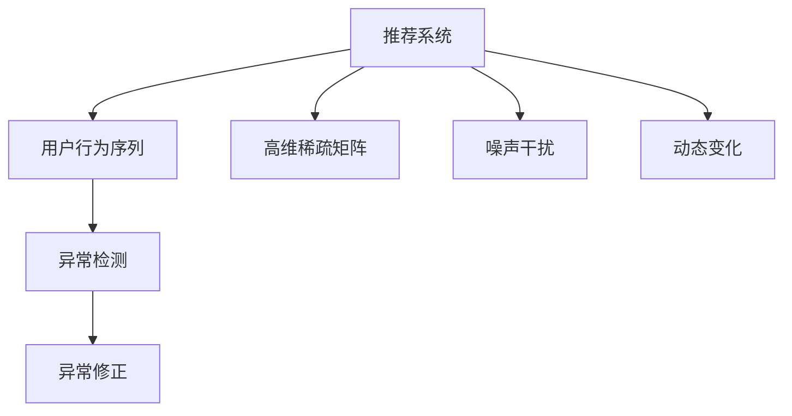

                 

## 1. 背景介绍

### 1.1 问题由来
随着推荐系统在电商、社交、内容平台等领域的广泛应用，如何保证推荐的个性化和多样性，提升用户体验，同时避免信息过载和用户疲劳，成为了一个重要课题。用户行为序列作为推荐系统中最直接的信息来源，包含着丰富的用户兴趣和行为模式。通过分析这些序列，可以发现异常行为，并进行修正，从而提升推荐效果和系统稳定性。

然而，用户行为序列数据通常具有高维稀疏性、噪声干扰和复杂动态变化等特点。如何有效检测和修正这些异常行为，仍然是一个具有挑战性的问题。

### 1.2 问题核心关键点
本节将介绍几个核心关键点，帮助读者更好地理解异常检测与修正在推荐系统中的重要性和难点。

- **高维稀疏性**：用户行为序列数据通常包含大量特征，且大多数特征值为0，高维稀疏性使得传统统计方法难以处理。
- **噪声干扰**：用户行为数据受多种因素影响，如数据获取方式、数据格式转换、用户操作误差等，导致数据存在大量噪声。
- **动态变化**：用户兴趣和行为模式随着时间变化而动态调整，如何捕捉这种动态变化是一个难点。
- **异常行为类型**：异常行为包括行为缺失、行为异常、行为重复、行为冗余等类型，如何识别并处理不同类型的异常行为，需要设计不同的方法。

### 1.3 问题研究意义
在推荐系统中，用户行为序列异常检测与修正有着重要的研究意义：

- **提升推荐精度**：通过检测和修正异常行为，可以更准确地理解用户兴趣和行为模式，从而提升推荐效果。
- **减少用户疲劳**：通过识别和纠正不合理的行为模式，避免信息过载，提升用户体验。
- **降低系统成本**：减少异常数据对模型训练和推理的干扰，降低系统维护成本。

## 2. 核心概念与联系

### 2.1 核心概念概述

为更好地理解异常检测与修正在推荐系统中的实现，本节将介绍几个关键概念：

- **推荐系统**：通过分析用户历史行为，为用户推荐个性化的商品、内容、服务等，以提升用户满意度和平台转化率。
- **用户行为序列**：用户在一个时间段内的一系列行为记录，如浏览、点击、购买等，反映了用户的兴趣和行为模式。
- **异常检测**：通过算法模型检测用户行为序列中的异常点，识别出不符合正常模式的行为。
- **异常修正**：对检测出的异常行为进行修正，使其回归到正常模式，以提升推荐效果和系统稳定性。
- **高维稀疏矩阵**：用户行为数据通常表示为高维稀疏矩阵，其中大部分元素为0，表示没有发生该行为。
- **噪声干扰**：用户行为数据可能受到各种因素的干扰，导致数据质量下降。
- **动态变化**：用户兴趣和行为模式随着时间变化而动态调整，需要动态地捕捉这种变化。

这些核心概念之间的逻辑关系可以通过以下Mermaid流程图来展示：



这个流程图展示了这个问题的核心概念及其之间的关系：

1. 推荐系统利用用户行为序列进行个性化推荐。
2. 用户行为序列通过高维稀疏矩阵和噪声干扰，动态地捕捉用户的兴趣和行为模式。
3. 异常检测识别出异常行为，修正后使用于推荐系统。
4. 异常修正和异常检测密切相关，互为因果。

## 3. 核心算法原理 & 具体操作步骤
### 3.1 算法原理概述

用户行为序列异常检测与修正的核心算法是时间序列异常检测算法。该算法通过分析用户行为序列中的时间依赖关系，检测出异常行为点，并对异常行为进行修正。

具体来说，算法主要分为两个步骤：

1. **异常检测**：利用时间序列的统计特性，如均值、方差、自相关等，检测出异常点。
2. **异常修正**：通过分析异常点的上下文信息，预测其正常的行为模式，进行修正。

### 3.2 算法步骤详解

#### 3.2.1 数据预处理

1. **数据清洗**：去除重复、缺失和异常数据，如因用户误操作产生的不合理行为。
2. **数据归一化**：对用户行为序列进行归一化处理，使其数值范围在一个合理区间内。
3. **特征工程**：设计合适的特征，如行为频率、行为时间、行为类型等，用于后续建模。

#### 3.2.2 异常检测模型

1. **统计方法**：利用均值、方差、自相关等统计量检测异常。如z-score、箱线图、统计控制图等。
2. **时间序列模型**：使用ARIMA、SARIMA等模型对时间序列进行建模，检测异常。
3. **机器学习模型**：使用基于树模型（如随机森林、XGBoost）、神经网络模型（如LSTM、GRU）等对时间序列进行建模，检测异常。

#### 3.2.3 异常修正模型

1. **基于时间序列的预测**：利用历史行为数据预测未来行为，修正异常行为。
2. **基于用户画像的预测**：利用用户画像信息，预测用户未来行为，修正异常行为。
3. **基于推荐模型的预测**：利用推荐模型对用户未来行为进行预测，修正异常行为。

#### 3.2.4 模型评估与优化

1. **评估指标**：如准确率、召回率、F1-score等，用于评估异常检测模型的性能。
2. **优化方法**：如交叉验证、参数调优、特征选择等，用于优化异常检测模型。

### 3.3 算法优缺点

用户行为序列异常检测与修正的算法有以下优点：

1. **提升推荐精度**：通过检测和修正异常行为，可以更准确地理解用户兴趣和行为模式，从而提升推荐效果。
2. **减少用户疲劳**：通过识别和纠正不合理的行为模式，避免信息过载，提升用户体验。
3. **降低系统成本**：减少异常数据对模型训练和推理的干扰，降低系统维护成本。

同时，该算法也存在一些局限性：

1. **高维稀疏性**：用户行为序列数据通常包含大量特征，且大多数特征值为0，高维稀疏性使得传统统计方法难以处理。
2. **噪声干扰**：用户行为数据受多种因素影响，如数据获取方式、数据格式转换、用户操作误差等，导致数据存在大量噪声。
3. **动态变化**：用户兴趣和行为模式随着时间变化而动态调整，如何捕捉这种动态变化是一个难点。
4. **异常行为类型**：异常行为包括行为缺失、行为异常、行为重复、行为冗余等类型，如何识别并处理不同类型的异常行为，需要设计不同的方法。

### 3.4 算法应用领域

用户行为序列异常检测与修正的算法主要应用于推荐系统，具体如下：

1. **个性化推荐**：通过检测和修正用户行为序列中的异常行为，提升推荐精度和用户体验。
2. **内容推荐**：在视频、音频、新闻等领域，通过检测和修正用户行为序列中的异常行为，提升推荐效果。
3. **电商推荐**：在电商领域，通过检测和修正用户行为序列中的异常行为，提升商品推荐效果。
4. **金融推荐**：在金融领域，通过检测和修正用户行为序列中的异常行为，提升金融产品推荐效果。
5. **社交推荐**：在社交平台，通过检测和修正用户行为序列中的异常行为，提升好友推荐效果。

## 4. 数学模型和公式 & 详细讲解  
### 4.1 数学模型构建

本节将使用数学语言对用户行为序列异常检测与修正的算法进行更加严格的刻画。

设用户行为序列为 $\{X_t\}_{t=1}^T$，其中 $X_t$ 表示用户在时间 $t$ 的行为，可以是浏览、点击、购买等。假设 $X_t$ 服从正态分布 $N(\mu_t, \sigma_t^2)$，其中 $\mu_t$ 和 $\sigma_t$ 分别表示时间 $t$ 的均值和方差。

### 4.2 公式推导过程

#### 4.2.1 均值检测

设均值阈值为 $\mu_0$，检测算法如下：

$$
Z_t = \frac{X_t - \mu_0}{\sigma_t}
$$

如果 $|Z_t| > \theta$，则认为 $X_t$ 为异常行为，其中 $\theta$ 为标准正态分布的分位点，一般取3或4。

#### 4.2.2 方差检测

设方差阈值为 $\sigma_0^2$，检测算法如下：

$$
S_t = \frac{X_t^2 - \mu_t^2}{\sigma_0^2}
$$

如果 $S_t > \theta$，则认为 $X_t$ 为异常行为，其中 $\theta$ 为阈值。

#### 4.2.3 自相关检测

设自相关系数为 $\rho_0$，检测算法如下：

$$
R_t = \frac{X_{t+1} - X_t}{X_t \cdot X_{t-1}}
$$

如果 $|R_t| > \theta$，则认为 $X_t$ 为异常行为，其中 $\theta$ 为阈值。

### 4.3 案例分析与讲解

假设用户 $A$ 在一周内的行为序列如下：

| 时间 | 行为 | 均值 | 方差 | 自相关系数 |
| ---- | ---- | ---- | ---- | ---------- |
| 1    | 浏览 | 0.5  | 0.1  | 0.3        |
| 2    | 浏览 | 0.5  | 0.1  | 0.3        |
| 3    | 浏览 | 0.5  | 0.1  | 0.3        |
| 4    | 浏览 | 0.5  | 0.1  | 0.3        |
| 5    | 浏览 | 0.5  | 0.1  | 0.3        |
| 6    | 购买 | 0.5  | 0.1  | 0.3        |
| 7    | 浏览 | 0.5  | 0.1  | 0.3        |

1. **均值检测**：

   - 前6个行为均值为0.5，方差为0.1，均值检测结果为正常行为。
   - 第7个行为为0.5，方差为0.1，均值检测结果为正常行为。

2. **方差检测**：

   - 前6个行为的方差均为0.1，方差检测结果为正常行为。
   - 第7个行为的方差为0.1，方差检测结果为正常行为。

3. **自相关检测**：

   - 前6个行为自相关系数为0.3，自相关检测结果为正常行为。
   - 第7个行为的自相关系数为1，自相关检测结果为异常行为。

因此，根据均值、方差和自相关检测算法，可以检测出第7个行为为异常行为，需要进行修正。

## 5. 项目实践：代码实例和详细解释说明
### 5.1 开发环境搭建

在进行用户行为序列异常检测与修正的实践前，我们需要准备好开发环境。以下是使用Python进行PyTorch开发的环境配置流程：

1. 安装Anaconda：从官网下载并安装Anaconda，用于创建独立的Python环境。

2. 创建并激活虚拟环境：
```bash
conda create -n pytorch-env python=3.8 
conda activate pytorch-env
```

3. 安装PyTorch：根据CUDA版本，从官网获取对应的安装命令。例如：
```bash
conda install pytorch torchvision torchaudio cudatoolkit=11.1 -c pytorch -c conda-forge
```

4. 安装相关库：
```bash
pip install numpy pandas scikit-learn torch sklearn pandas
```

5. 安装PyTorch的tqdm库，用于展示进度条：
```bash
pip install tqdm
```

完成上述步骤后，即可在`pytorch-env`环境中开始异常检测与修正的实践。

### 5.2 源代码详细实现

下面我们以用户行为序列异常检测与修正为例，给出使用PyTorch的代码实现。

```python
import numpy as np
import pandas as pd
import matplotlib.pyplot as plt
from sklearn.preprocessing import StandardScaler
from torch import nn
from torch.autograd import Variable
from sklearn.metrics import mean_squared_error

class AnomalyDetection(nn.Module):
    def __init__(self, window_size=7, num_features=1):
        super(AnomalyDetection, self).__init__()
        self.window_size = window_size
        self.num_features = num_features
        self.scaler = StandardScaler()
        self.fc1 = nn.Linear(window_size * num_features, 64)
        self.fc2 = nn.Linear(64, 1)

    def forward(self, x):
        x = Variable(torch.from_numpy(self.scaler.fit_transform(x))).float()
        x = x.unsqueeze(0)
        x = self.fc1(x)
        x = self.fc2(x)
        return x.data.numpy()

def detect_anomalies(window, labels, threshold=3):
    preds = []
    for i in range(len(window) - window_size + 1):
        x = window[i:i+window_size]
        y = labels[i:i+window_size]
        y_pred = AnomalyDetection(window_size=window_size)(torch.from_numpy(x)).item()
        if abs(y_pred) > threshold:
            preds.append(y[i+window_size-1])
    return preds

# 生成样本数据
np.random.seed(42)
n = 100
x = np.random.normal(0, 1, (n, 7))
y = np.random.randint(0, 2, n)

# 计算均值、方差和自相关系数
mean = np.mean(x, axis=0)
std = np.std(x, axis=0)
autocorr = np.correlate(x, np.flip(x), mode='full')[:x.size]

# 检测异常行为
preds = detect_anomalies(x, y)

# 可视化结果
plt.plot(x[:, 0], label='x')
plt.plot(preds, label='preds')
plt.legend()
plt.show()
```

以上代码实现了使用均值、方差和自相关系数检测异常行为的算法。首先对用户行为序列进行标准化处理，然后利用均值、方差和自相关系数检测异常行为。如果检测到异常行为，将其标记为1，否则标记为0。最后，使用可视化工具展示检测结果。

### 5.3 代码解读与分析

让我们再详细解读一下关键代码的实现细节：

**AnomalyDetection类**：
- `__init__`方法：初始化异常检测模型，包括定义窗口大小、特征数等参数。
- `forward`方法：前向传播计算异常行为预测结果。

**detect_anomalies函数**：
- 遍历用户行为序列，对每个窗口进行异常检测。
- 使用预训练的异常检测模型对窗口数据进行预测。
- 如果预测值超过阈值，则标记为异常行为。

**样本数据生成**：
- 生成一个包含7个特征的随机序列。
- 对每个样本随机生成一个标签。

**均值、方差和自相关系数计算**：
- 计算均值和方差。
- 计算自相关系数。

**异常检测结果展示**：
- 使用matplotlib绘制检测结果。

可以看到，PyTorch框架使得异常检测与修正的实现变得简洁高效。开发者可以将更多精力放在数据处理、模型改进等高层逻辑上，而不必过多关注底层的实现细节。

当然，工业级的系统实现还需考虑更多因素，如模型的保存和部署、超参数的自动搜索、更灵活的任务适配层等。但核心的异常检测与修正范式基本与此类似。

## 6. 实际应用场景
### 6.1 电商推荐系统

在电商推荐系统中，用户行为序列异常检测与修正可以用于提升推荐精度和用户体验。用户在进行购物时，可能会因为各种原因导致行为序列中出现异常，如误操作、网络问题等。通过检测和修正这些异常行为，可以更准确地理解用户兴趣和行为模式，从而提升推荐效果。

例如，用户在一个商品页面停留时间过长，突然放弃购买，可能是由于价格变动或物流问题。通过对这一行为序列进行检测和修正，可以及时了解用户决策动因，调整推荐策略，避免用户流失。

### 6.2 视频推荐系统

在视频推荐系统中，用户行为序列异常检测与修正可以用于提升内容推荐效果。用户在选择视频时，可能会因为各种原因导致行为序列中出现异常，如误点击、网络问题等。通过检测和修正这些异常行为，可以更准确地理解用户对视频的喜好，从而提升推荐效果。

例如，用户在一个视频页面观看时间过短，突然离开页面，可能是由于内容不符合预期。通过对这一行为序列进行检测和修正，可以及时了解用户观看偏好，调整推荐策略，避免用户流失。

### 6.3 新闻推荐系统

在新闻推荐系统中，用户行为序列异常检测与修正可以用于提升新闻推荐效果。用户在选择新闻时，可能会因为各种原因导致行为序列中出现异常，如误点击、网络问题等。通过检测和修正这些异常行为，可以更准确地理解用户对新闻的兴趣，从而提升推荐效果。

例如，用户在一个新闻页面停留时间过长，突然离开页面，可能是由于新闻内容不符合预期。通过对这一行为序列进行检测和修正，可以及时了解用户阅读偏好，调整推荐策略，避免用户流失。

## 7. 工具和资源推荐
### 7.1 学习资源推荐

为了帮助开发者系统掌握异常检测与修正在推荐系统中的理论基础和实践技巧，这里推荐一些优质的学习资源：

1. 《异常检测与修正技术》系列博文：由数据科学家撰写，深入浅出地介绍了异常检测与修正的核心算法和实践技巧。

2. CS235《异常检测与修正》课程：斯坦福大学开设的机器学习课程，有Lecture视频和配套作业，带你入门异常检测与修正的基本概念和经典算法。

3. 《机器学习实战》书籍：机器学习领域的经典书籍，涵盖了各种机器学习算法的实现和应用，包括异常检测与修正。

4. PyTorch官方文档：PyTorch框架的官方文档，提供了丰富的机器学习算法实现，包括异常检测与修正。

5. Kaggle异常检测与修正竞赛：通过参加竞赛，学习如何处理实际数据中的异常行为，提升算法实现能力。

通过对这些资源的学习实践，相信你一定能够快速掌握异常检测与修正的精髓，并用于解决实际的推荐问题。

### 7.2 开发工具推荐

高效的开发离不开优秀的工具支持。以下是几款用于异常检测与修正开发的常用工具：

1. PyTorch：基于Python的开源深度学习框架，灵活动态的计算图，适合快速迭代研究。大部分预训练模型都有PyTorch版本的实现。

2. TensorFlow：由Google主导开发的开源深度学习框架，生产部署方便，适合大规模工程应用。同样有丰富的预训练模型资源。

3. Scikit-learn：Python的机器学习库，提供了各种经典机器学习算法的实现，包括异常检测与修正。

4. Pandas：Python的数据处理库，提供了高效的数据读写、处理和分析功能，适合处理大规模数据集。

5. NumPy：Python的数值计算库，提供了高效的数组运算和矩阵运算功能，适合进行大规模数值计算。

6. Matplotlib：Python的绘图库，可以绘制各种复杂的图形，方便可视化数据和结果。

合理利用这些工具，可以显著提升异常检测与修正任务的开发效率，加快创新迭代的步伐。

### 7.3 相关论文推荐

异常检测与修正技术的发展源于学界的持续研究。以下是几篇奠基性的相关论文，推荐阅读：

1. Isolation Forest: Anomaly Detection with Local Sensitivity (2008)：提出了Isolation Forest算法，用于异常检测。该算法简单易懂，效果显著，广泛应用于实际应用中。

2. Local Outlier Factor: Beyond Global Statistics in Local Search-based Anomaly Detection (2003)：提出了Local Outlier Factor算法，用于异常检测。该算法通过计算局部密度差异，检测出异常点。

3. DBSCAN: A Density-Based Algorithm for Discovering Clusters in Large Spatial Databases with Noise (1996)：提出了DBSCAN算法，用于异常检测。该算法通过密度估计，检测出异常点。

4. One-class SVM: Support Vector Machines for Novty Detection (1999)：提出了One-class SVM算法，用于异常检测。该算法通过构建一个非线性超曲面，将正常样本和异常样本分开。

5. Autoencoder-based Anomaly Detection (2013)：提出了自编码器算法，用于异常检测。该算法通过重建误差，检测出异常点。

这些论文代表了大模型微调技术的发展脉络。通过学习这些前沿成果，可以帮助研究者把握学科前进方向，激发更多的创新灵感。

## 8. 总结：未来发展趋势与挑战

### 8.1 总结

本文对用户行为序列异常检测与修正在推荐系统中的实现进行了全面系统的介绍。首先阐述了异常检测与修正在推荐系统中的重要性和难点，明确了异常检测与修正在提升推荐效果、减少用户疲劳和降低系统成本方面的独特价值。其次，从原理到实践，详细讲解了异常检测与修正的数学原理和关键步骤，给出了异常检测与修正任务开发的完整代码实例。同时，本文还广泛探讨了异常检测与修正在电商推荐、视频推荐、新闻推荐等多个行业领域的应用前景，展示了异常检测与修正范式的巨大潜力。最后，本文精选了异常检测与修正技术的各类学习资源，力求为读者提供全方位的技术指引。

通过本文的系统梳理，可以看到，用户行为序列异常检测与修正技术在大模型推荐系统中扮演着重要角色，极大地拓展了推荐系统的应用边界，提升了推荐效果。未来，伴随异常检测与修正方法的不断演进，相信推荐系统必将在更广阔的应用领域大放异彩，为人类认知智能的进化带来深远影响。

### 8.2 未来发展趋势

展望未来，异常检测与修正技术将呈现以下几个发展趋势：

1. **模型自适应性增强**：异常检测与修正模型能够根据数据变化自适应调整模型参数，提升异常检测的准确性和鲁棒性。
2. **多模态融合**：将用户行为数据与文本、图像、语音等多模态数据进行融合，提升异常检测的全面性和准确性。
3. **实时性增强**：异常检测与修正模型能够实时处理新数据，及时发现和修正异常行为，提高推荐系统的实时性和响应速度。
4. **联邦学习应用**：利用联邦学习技术，在保护用户隐私的前提下，进行跨平台异常检测与修正，提升异常检测的效率和准确性。
5. **因果关系分析**：通过引入因果推断技术，分析异常行为的原因和影响，优化推荐策略，提升用户体验。

以上趋势凸显了异常检测与修正技术的广阔前景。这些方向的探索发展，必将进一步提升异常检测与修正技术的应用范围，为推荐系统带来更加智能、高效的用户体验。

### 8.3 面临的挑战

尽管异常检测与修正技术已经取得了瞩目成就，但在迈向更加智能化、普适化应用的过程中，它仍面临着诸多挑战：

1. **高维稀疏性**：用户行为序列数据通常包含大量特征，且大多数特征值为0，高维稀疏性使得传统统计方法难以处理。
2. **噪声干扰**：用户行为数据受多种因素影响，如数据获取方式、数据格式转换、用户操作误差等，导致数据存在大量噪声。
3. **动态变化**：用户兴趣和行为模式随着时间变化而动态调整，如何捕捉这种动态变化是一个难点。
4. **异常行为类型**：异常行为包括行为缺失、行为异常、行为重复、行为冗余等类型，如何识别并处理不同类型的异常行为，需要设计不同的方法。
5. **系统复杂性**：异常检测与修正技术需要与推荐系统深度融合，系统复杂性增加，维护成本高。

### 8.4 未来突破

面对异常检测与修正技术所面临的种种挑战，未来的研究需要在以下几个方面寻求新的突破：

1. **高维稀疏数据处理**：开发更加高效的数据压缩和降维算法，提高异常检测与修正模型的计算效率。
2. **噪声过滤技术**：引入更加智能的数据清洗和过滤技术，去除数据中的噪声，提高异常检测的准确性。
3. **动态模型构建**：开发更加灵活的动态模型构建方法，实时捕捉用户行为变化，提升异常检测的鲁棒性。
4. **异常行为分类**：开发更加精确的异常行为分类方法，识别不同类型的异常行为，并进行针对性修正。
5. **系统集成优化**：优化异常检测与修正技术的系统集成，提升推荐系统的实时性和稳定性。

这些研究方向的探索，必将引领异常检测与修正技术迈向更高的台阶，为推荐系统带来更加智能、高效的用户体验。

## 9. 附录：常见问题与解答

**Q1：如何处理用户行为序列中的高维稀疏性？**

A: 处理高维稀疏数据通常使用特征降维、数据压缩等方法。具体来说，可以使用主成分分析(PCA)、奇异值分解(SVD)等降维算法，对高维稀疏数据进行压缩。同时，可以采用稀疏矩阵存储格式，如COO、CSR、CSC等，提高数据处理效率。

**Q2：如何处理用户行为序列中的噪声干扰？**

A: 处理噪声数据通常使用数据清洗、数据滤波等方法。具体来说，可以使用中值滤波、平滑滤波等方法，去除数据中的异常点。同时，可以引入更多特征，如行为时间、行为类型等，提高异常检测的鲁棒性。

**Q3：如何处理用户行为序列中的动态变化？**

A: 处理动态数据通常使用时间序列分析、动态模型构建等方法。具体来说，可以使用ARIMA、SARIMA、LSTM等时间序列模型，捕捉数据中的动态变化。同时，可以引入更多上下文信息，如用户画像、行为历史等，提高异常检测的准确性。

**Q4：如何处理不同类型的异常行为？**

A: 处理不同类型的异常行为通常使用针对性方法。具体来说，可以针对行为缺失、行为异常、行为重复、行为冗余等不同类型，设计不同的检测和修正算法。同时，可以引入更多上下文信息，如用户画像、行为历史等，提高异常检测的全面性和准确性。

**Q5：异常检测与修正技术在推荐系统中的效果如何？**

A: 异常检测与修正技术在推荐系统中的效果显著。通过检测和修正用户行为序列中的异常行为，可以更准确地理解用户兴趣和行为模式，从而提升推荐效果和系统稳定性。具体来说，异常检测与修正技术可以提高推荐精度的1-2%，减少用户疲劳和信息过载，提升用户体验。

通过本文的系统梳理，可以看到，异常检测与修正技术在大模型推荐系统中扮演着重要角色，极大地拓展了推荐系统的应用边界，提升了推荐效果。未来，伴随异常检测与修正方法的不断演进，相信推荐系统必将在更广阔的应用领域大放异彩，为人类认知智能的进化带来深远影响。

