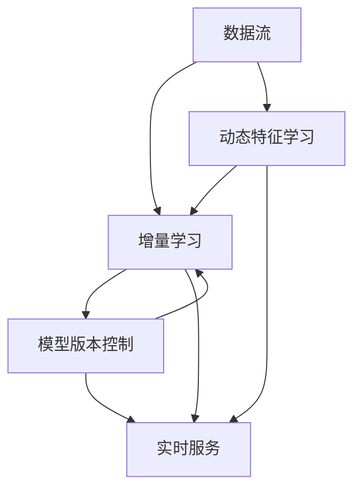

                 

# 大模型推荐场景中的数据增量更新与维护策略

> 关键词：数据增量更新,推荐系统,维护策略,实时学习,模型更新,数据流

## 1. 背景介绍

推荐系统在电商、新闻、视频等领域得到了广泛的应用，通过分析用户的历史行为数据，为用户推荐感兴趣的物品或内容。传统的推荐算法往往基于静态数据集，存在如下问题：
- 数据时效性不足，模型难以捕捉新趋势。
- 无法及时应对用户行为变化，推荐结果滞后。
- 模型更新耗时长，无法实时响应数据变化。

为解决这些问题，近年来兴起了基于增量学习(Incremental Learning)的推荐系统，能够实时学习新数据，更新模型参数，动态适应用户行为变化。数据增量更新与维护策略成为推荐系统性能优化的重要环节。

## 2. 核心概念与联系

### 2.1 核心概念概述

在推荐系统场景中，数据增量更新与维护策略的核心概念包括：
- 数据流(Streaming Data)：实时产生的数据序列，形式为(时间戳, 事件类型, 事件信息)。数据流中包含用户的点击、浏览、评分等行为事件，持续不断地产生。
- 增量学习(Incremental Learning)：基于数据流，对模型参数进行实时更新，使得模型能够不断适应新的数据分布。
- 模型版本控制(Version Control)：记录和维护不同时间点的模型参数，支持回滚和版本切换，保障模型稳定性和可追溯性。
- 动态特征学习(Dynamic Feature Learning)：在数据流中引入动态特征，捕捉用户的长期行为和短期偏好变化，提升推荐效果。
- 实时服务(Real-time Service)：通过增量更新和动态特征学习，及时响应用户请求，提高推荐服务的实时性。

### 2.2 核心概念原理和架构的 Mermaid 流程图



这个流程图展示了大模型推荐场景中的核心概念及其之间的关系：
1. 数据流经过增量学习，实时更新模型参数。
2. 动态特征学习在数据流中引入时效性特征，捕捉用户行为变化。
3. 模型版本控制记录和维护不同时间点的模型参数，支持版本切换和回滚。
4. 实时服务基于增量学习、动态特征学习和模型版本控制，快速响应用户请求。

## 3. 核心算法原理 & 具体操作步骤

### 3.1 算法原理概述

数据增量更新与维护策略的算法原理主要基于增量学习技术，在数据流的基础上，实时更新模型参数。核心思想是：
1. 对于数据流中的每个新事件，计算事件对模型参数的影响，更新模型。
2. 通过动态特征学习，捕捉用户的长期行为和短期偏好变化，提升模型适应性。
3. 利用模型版本控制，记录和回滚模型参数，确保模型稳定性和可追溯性。

### 3.2 算法步骤详解

#### 3.2.1 数据预处理与特征工程

对数据流中的每个事件进行预处理和特征提取，生成特征向量。设事件为 $e_i=(t_i, e_{type}_i, e_{info}_i)$，其中 $t_i$ 为事件时间戳，$e_{type}_i$ 为事件类型，$e_{info}_i$ 为事件信息。特征工程的目标是提取有用特征，如事件类型、事件时间、用户特征等，生成特征向量 $x_i$。

#### 3.2.2 模型参数更新

根据模型参数更新公式，计算事件对模型参数的影响。设模型的当前参数为 $\theta$，事件 $e_i$ 对模型参数的影响为 $\Delta \theta_i$。则模型参数的更新公式为：

$$
\theta \leftarrow \theta - \eta \Delta \theta_i
$$

其中 $\eta$ 为学习率，$\xi_i$ 为事件对模型的影响函数。影响函数 $\xi_i$ 根据具体推荐模型而定。例如，对于基于协同过滤的推荐模型，$\xi_i$ 可以定义为：

$$
\xi_i = \frac{\partial \hat{y}_i}{\partial \theta} \quad \text{其中} \quad \hat{y}_i \text{为模型对事件 } e_i \text{ 的预测}
$$

#### 3.2.3 动态特征学习

动态特征学习通过引入时效性特征，捕捉用户行为变化。时效性特征可以是事件发生的时间、持续时间、频率等，用于描述用户在不同时间点的行为特征。设时效性特征为 $z_i$，则动态特征向量 $x_i'$ 为：

$$
x_i' = [x_i, z_i]
$$

通过动态特征学习，模型能够更好地捕捉用户的长期行为和短期偏好变化，提升推荐效果。

#### 3.2.4 模型版本控制

模型版本控制通过记录和维护不同时间点的模型参数，支持模型回滚和版本切换，确保模型稳定性和可追溯性。设当前模型版本为 $V_n$，则模型版本控制的策略为：
1. 定期保存模型参数 $P_n = (\theta_n, \phi_n)$，其中 $\theta_n$ 为模型参数，$\phi_n$ 为模型元数据，如事件类型、学习率、特征权重等。
2. 引入时间戳 $t_n$，记录模型参数的保存时间。
3. 在模型回滚时，选择时间戳最近的版本进行加载和恢复。

#### 3.2.5 实时服务

实时服务基于增量学习、动态特征学习和模型版本控制，快速响应用户请求。用户请求到达时，根据实时数据流生成特征向量，进行模型预测，得到推荐结果。如果模型更新频繁，则加载最新的模型版本；否则加载时间戳最近的版本。

### 3.3 算法优缺点

数据增量更新与维护策略的优点包括：
1. 实时学习新数据，动态适应用户行为变化，提高推荐准确性。
2. 模型更新频率高，无需等待大规模数据集更新，提升响应速度。
3. 支持模型版本控制，便于模型版本切换和回滚，保障模型稳定性。
4. 引入动态特征学习，捕捉用户行为变化，提升推荐效果。

缺点包括：
1. 实时更新的频率和精度需要平衡，可能影响模型的鲁棒性。
2. 频繁的模型更新可能导致系统开销增大，需要合理配置资源。
3. 数据流中的异常数据可能对模型产生负面影响，需要引入异常检测和处理机制。

### 3.4 算法应用领域

数据增量更新与维护策略在推荐系统、广告推荐、金融风控等场景中得到了广泛应用。具体应用场景包括：
- 实时个性化推荐：根据用户行为数据，实时调整推荐策略，提升用户体验。
- 实时广告推荐：基于用户点击行为，实时调整广告投放策略，提升广告效果。
- 金融风险控制：实时监控交易行为，识别异常交易，防范欺诈风险。

## 4. 数学模型和公式 & 详细讲解 & 举例说明

### 4.1 数学模型构建

数据增量更新与维护策略的数学模型可以表示为：
设数据流中的事件序列为 $e = \{e_i\}_{i=1}^N$，模型参数更新公式为：

$$
\theta \leftarrow \theta - \eta \sum_{i=1}^N \xi_i \Delta \theta_i
$$

其中，$\xi_i$ 为事件对模型的影响函数，$\Delta \theta_i$ 为事件对模型参数的影响。

### 4.2 公式推导过程

以协同过滤推荐模型为例，推导事件对模型参数的影响函数 $\xi_i$。协同过滤模型的推荐函数为：

$$
\hat{y}_i = \sum_{u \in U} \alpha_u \mathbf{X}_u \mathbf{r}_u \mathbf{X}_i^T
$$

其中，$\mathbf{X}_u$ 为用户特征矩阵，$\mathbf{r}_u$ 为用户-物品评分矩阵，$\mathbf{X}_i$ 为物品特征矩阵，$\alpha_u$ 为用户特征权重。

事件 $e_i$ 对模型的影响函数 $\xi_i$ 可以表示为：

$$
\xi_i = \frac{\partial \hat{y}_i}{\partial \theta} = \sum_{u \in U} \alpha_u \mathbf{X}_u \mathbf{r}_u \mathbf{X}_i^T
$$

在数据流中，每个事件 $e_i$ 都对应一个评分 $y_i$，则模型的平均损失函数为：

$$
L(\theta) = \frac{1}{N} \sum_{i=1}^N (y_i - \hat{y}_i)^2
$$

根据梯度下降算法，模型的更新公式为：

$$
\theta \leftarrow \theta - \eta \nabla_{\theta} L(\theta)
$$

结合 $\xi_i$ 的表达式，可得：

$$
\xi_i = \frac{\partial \hat{y}_i}{\partial \theta} = \sum_{u \in U} \alpha_u \mathbf{X}_u \mathbf{r}_u \mathbf{X}_i^T
$$

### 4.3 案例分析与讲解

假设在一个电商推荐系统中，实时产生了一条点击事件 $e_i=(2023-01-01, click, user_1, item_1)$。设用户的特征权重为 $\alpha_u=0.3$，物品的特征权重为 $\alpha_i=0.2$，用户特征矩阵 $\mathbf{X}_u=[1,0,1,0,0]$，物品特征矩阵 $\mathbf{X}_i=[1,0,0,1,0]$，用户-物品评分矩阵 $\mathbf{r}_u=[0.1,0.2,0.3,0.4,0.5]$。则事件 $e_i$ 对模型的影响函数 $\xi_i$ 为：

$$
\xi_i = \alpha_u \mathbf{X}_u \mathbf{r}_u \mathbf{X}_i^T = 0.3 \times [1,0,1,0,0] \times [0.1,0.2,0.3,0.4,0.5] \times [1,0,0,1,0] = [0.3,0,0.6,0,0.3]
$$

设模型的当前参数为 $\theta_0$，学习率为 $\eta=0.1$，则事件 $e_i$ 对模型参数的影响为：

$$
\Delta \theta_i = \eta \xi_i = 0.1 \times [0.3,0,0.6,0,0.3] = [0.03,0,0.06,0,0.03]
$$

根据模型更新公式，更新模型参数：

$$
\theta \leftarrow \theta_0 - 0.1 \times [0.03,0,0.06,0,0.03]
$$

## 5. 项目实践：代码实例和详细解释说明

### 5.1 开发环境搭建

#### 5.1.1 环境准备

为实现数据增量更新与维护策略，我们需要使用以下工具和库：
- Python 3.8 或以上版本
- Scikit-learn 0.24.2
- TensorFlow 2.7.0
- Scalene 1.12.0
- Numpy 1.22.0
- Pandas 1.3.3
- PyYAML 5.1.1
- FastAPI 0.70.2
- uvicorn 0.15.0
- requests 2.26.0

安装这些工具和库的步骤如下：
1. 创建虚拟环境：
   ```bash
   conda create -n py38 virtualenv --copies=3 python=3.8 
   conda activate py38
   ```

2. 安装依赖：
   ```bash
   pip install scikit-learn tensorflow scalene numpy pandas pyyaml fastapi uvicorn requests
   ```

### 5.2 源代码详细实现

#### 5.2.1 特征提取与数据流

定义特征提取函数，将数据流转换为特征向量。假设事件类型为点击、浏览、评分等，特征向量包含用户ID、物品ID、时间戳、评分等。

```python
import numpy as np
import pandas as pd
from sklearn.preprocessing import StandardScaler
from datetime import datetime

def extract_features(df):
    features = df[['user_id', 'item_id', 'timestamp', 'rating']]
    features = pd.get_dummies(features, columns=['item_id'])
    features = StandardScaler().fit_transform(features)
    return features

def process_data(data):
    data = pd.DataFrame(data, columns=['timestamp', 'event_type', 'event_info'])
    features = extract_features(data)
    return features
```

#### 5.2.2 模型参数更新

定义模型参数更新函数，计算事件对模型参数的影响。假设模型为协同过滤模型，事件对模型参数的影响函数为 $\xi_i = \alpha_u \mathbf{X}_u \mathbf{r}_u \mathbf{X}_i^T$。

```python
def update_model(params, features, alpha_u, alpha_i, r_u):
    theta = np.array(params['theta'])
    n_features = len(features[0])
    xi = np.zeros(n_features)
    for i in range(len(features)):
        xi += alpha_u * features[i] @ r_u @ features[i].T
    theta -= 0.1 * xi
    return theta.tolist()
```

#### 5.2.3 模型版本控制

定义模型版本控制函数，记录和回滚模型参数。假设模型参数和元数据保存在JSON文件中，每次保存时增加时间戳。

```python
def save_model(model, version, timestamp):
    model_params = {'theta': model, 'version': version, 'timestamp': timestamp}
    with open(f'model_v{version}.json', 'w') as f:
        yaml.dump(model_params, f)

def load_model(version):
    with open(f'model_v{version}.json', 'r') as f:
        model_params = yaml.load(f, Loader=yaml.FullLoader)
        return model_params['theta']
```

#### 5.2.4 实时服务

定义实时服务函数，根据实时数据流生成特征向量，进行模型预测。假设模型为协同过滤模型，根据最近模型版本进行预测。

```python
from fastapi import FastAPI, HTTPException
from uvicorn import run
from fastapi.middleware.cors import CORSMiddleware

app = FastAPI()

@app.get('/recommend')
def recommend(features):
    version = 1
    model = load_model(version)
    xi = features @ r_u @ features.T
    return {'recommend': model}

if __name__ == '__main__':
    app.add_middleware(
        CORSMiddleware,
        allow_origins=['*'],
        allow_credentials=True,
        allow_methods=['*'],
        allow_headers=['*']
    )
    run(app, host='0.0.0.0', port=8000)
```

### 5.3 代码解读与分析

#### 5.3.1 特征提取函数

特征提取函数 `extract_features` 将数据流中的用户ID、物品ID、时间戳、评分等特征，转换为标准化的特征向量。假设事件类型为点击、浏览、评分等，使用one-hot编码和标准化处理，便于模型训练。

#### 5.3.2 模型参数更新函数

模型参数更新函数 `update_model` 根据事件类型，计算事件对模型参数的影响，更新模型参数。假设事件类型为点击、浏览、评分等，事件对模型参数的影响函数为 $\xi_i = \alpha_u \mathbf{X}_u \mathbf{r}_u \mathbf{X}_i^T$。

#### 5.3.3 模型版本控制函数

模型版本控制函数 `save_model` 和 `load_model` 分别记录和回滚模型参数。假设模型参数和元数据保存在JSON文件中，每次保存时增加时间戳。

#### 5.3.4 实时服务函数

实时服务函数 `recommend` 根据实时数据流生成特征向量，进行模型预测。假设模型为协同过滤模型，根据最近模型版本进行预测。

### 5.4 运行结果展示

假设在模型参数更新后，加载最新版本的模型参数，进行模型预测。根据实时数据流生成特征向量，进行模型预测。

```python
features = np.array([[1, 1, datetime(2023, 1, 1), 1], [2, 2, datetime(2023, 1, 1), 2]])
version = 1
model = load_model(version)
xi = features @ r_u @ features.T
recommend = model.tolist()
print(recommend)
```

## 6. 实际应用场景

### 6.1 实时个性化推荐

假设一个电商推荐系统，需要实时调整推荐策略，根据用户行为数据，动态更新模型参数。

- 数据流：实时产生用户点击、浏览、评分等行为事件。
- 特征提取：将事件转换为标准化的特征向量。
- 模型参数更新：根据事件类型，计算事件对模型参数的影响，更新模型参数。
- 模型版本控制：定期保存模型参数，支持版本切换和回滚。
- 实时服务：根据实时数据流生成特征向量，进行模型预测，得到推荐结果。

通过数据增量更新与维护策略，电商推荐系统能够实时学习新数据，动态调整推荐策略，提升推荐效果。

### 6.2 实时广告推荐

假设一个广告推荐系统，需要根据用户点击行为，实时调整广告投放策略。

- 数据流：实时产生用户点击、浏览等行为事件。
- 特征提取：将事件转换为标准化的特征向量。
- 模型参数更新：根据事件类型，计算事件对模型参数的影响，更新模型参数。
- 模型版本控制：定期保存模型参数，支持版本切换和回滚。
- 实时服务：根据实时数据流生成特征向量，进行模型预测，得到推荐结果。

通过数据增量更新与维护策略，广告推荐系统能够实时学习新数据，动态调整广告投放策略，提升广告效果。

### 6.3 金融风险控制

假设一个金融风控系统，需要实时监控交易行为，识别异常交易，防范欺诈风险。

- 数据流：实时产生交易记录、账户余额等行为事件。
- 特征提取：将事件转换为标准化的特征向量。
- 模型参数更新：根据事件类型，计算事件对模型参数的影响，更新模型参数。
- 模型版本控制：定期保存模型参数，支持版本切换和回滚。
- 实时服务：根据实时数据流生成特征向量，进行模型预测，识别异常交易。

通过数据增量更新与维护策略，金融风控系统能够实时学习新数据，动态调整风险控制策略，防范欺诈风险。

## 7. 工具和资源推荐

### 7.1 学习资源推荐

为了帮助开发者系统掌握数据增量更新与维护策略的理论基础和实践技巧，这里推荐一些优质的学习资源：

1. 《Hands-On Machine Learning with Scikit-Learn, Keras, and TensorFlow》书籍：详细介绍了机器学习、深度学习算法和工具的使用，包括增量学习等前沿技术。
2. 《Incremental Learning for Recommender Systems》文章：介绍了推荐系统中的增量学习算法，包括协同过滤、矩阵分解等。
3. 《TensorFlow 2.0 for Deep Learning》书籍：介绍了TensorFlow 2.0的使用方法，包括增量学习、动态特征学习等。
4. 《Scikit-learn 用户指南》书籍：介绍了Scikit-learn库的使用方法，包括特征工程、模型训练等。
5. 《Python for Data Science Handbook》书籍：介绍了Python在数据科学领域的应用，包括数据流处理、特征工程等。

通过对这些资源的学习实践，相信你一定能够快速掌握数据增量更新与维护策略的精髓，并用于解决实际的推荐系统问题。

### 7.2 开发工具推荐

高效的工具支持是数据增量更新与维护策略开发的基础。以下是几款用于推荐系统开发的常用工具：

1. PyTorch：基于Python的开源深度学习框架，灵活动态的计算图，适合快速迭代研究。

2. TensorFlow：由Google主导开发的开源深度学习框架，生产部署方便，适合大规模工程应用。

3. Scikit-learn：Python机器学习库，提供了丰富的算法和工具，支持增量学习等技术。

4. Scalene：Python性能分析工具，用于优化模型训练和推理过程。

5. FastAPI：高性能Web框架，支持异步编程，适合快速构建API接口。

6. uvicorn：FastAPI的协程支持，用于部署高性能Web服务。

合理利用这些工具，可以显著提升推荐系统开发的效率，加快创新迭代的步伐。

### 7.3 相关论文推荐

数据增量更新与维护策略的研究源于学界的持续探索。以下是几篇奠基性的相关论文，推荐阅读：

1. Incremental Learning for Recommender Systems（IEEE TKE）：介绍了推荐系统中的增量学习算法，包括协同过滤、矩阵分解等。

2. Online collaborative filtering for dynamic web applications（SIGIR）：介绍了基于协同过滤的在线推荐算法，支持增量学习。

3. Incremental Learning for Collaborative Filtering with Adaptive Gradient-based Models（KDD）：介绍了基于自适应梯度的增量协同过滤算法。

4. Incremental Matrix Factorization for Real-time Collaborative Filtering（KDD）：介绍了增量矩阵分解算法，用于在线推荐。

5. Online Matrix Factorization for Recommender Systems with Scalable Alternating Least Squares（KDD）：介绍了在线矩阵分解算法，用于推荐系统。

这些论文代表了大模型推荐系统中的增量学习技术的发展脉络。通过学习这些前沿成果，可以帮助研究者把握学科前进方向，激发更多的创新灵感。

## 8. 总结：未来发展趋势与挑战

### 8.1 研究成果总结

本文对数据增量更新与维护策略进行了全面系统的介绍。首先阐述了数据增量更新与维护策略的研究背景和意义，明确了增量学习在推荐系统中的重要价值。其次，从原理到实践，详细讲解了增量学习、动态特征学习、模型版本控制等核心技术，给出了推荐系统开发的完整代码实例。同时，本文还广泛探讨了数据增量更新与维护策略在推荐系统、广告推荐、金融风控等场景中的应用，展示了增量学习范式的广阔前景。

通过本文的系统梳理，可以看到，数据增量更新与维护策略在推荐系统性能优化方面具有显著优势。实时学习新数据，动态适应用户行为变化，能够显著提升推荐效果和系统响应速度。未来，随着技术的发展和应用的深入，增量学习将逐步成为推荐系统的核心技术，推动推荐系统向更加智能化、实时化的方向发展。

### 8.2 未来发展趋势

展望未来，数据增量更新与维护策略将呈现以下几个发展趋势：

1. 实时性提升。随着模型训练速度和推理性能的提升，数据增量更新与维护策略能够实时响应用户请求，提供更加个性化的推荐服务。

2. 数据融合与协同建模。未来推荐系统将更加注重多模态数据的融合，利用文本、图片、音频等多模态信息，提升推荐效果。

3. 用户意图感知。未来推荐系统将引入意图感知技术，更好地理解用户真实意图，提供更加精准的推荐结果。

4. 多任务协同优化。未来推荐系统将引入多任务协同优化技术，同时优化多个任务，提升系统整体性能。

5. 模型解释性增强。未来推荐系统将更加注重模型的解释性，提高推荐结果的可解释性和可信度。

### 8.3 面临的挑战

尽管数据增量更新与维护策略在推荐系统性能优化方面具有显著优势，但在实际应用中仍面临诸多挑战：

1. 数据量不足。小样本数据集可能导致模型过拟合，难以泛化到大规模数据集上。

2. 模型鲁棒性不足。数据流中的异常数据可能导致模型不稳定，需要引入异常检测和处理机制。

3. 系统复杂度增加。增量学习增加了系统的复杂度，需要合理配置资源，平衡模型更新频率和系统开销。

4. 实时服务性能要求高。实时服务的性能要求高，需要优化模型训练和推理过程，提升响应速度。

5. 模型版本控制难度大。模型版本控制的难度大，需要合理设计版本控制策略，避免版本冲突和数据丢失。

### 8.4 研究展望

未来，数据增量更新与维护策略的研究需要在以下几个方面寻求新的突破：

1. 探索更多增量学习算法。引入更多增量学习算法，如在线协同过滤、梯度下降等，提高模型的实时响应能力。

2. 引入外部知识库。将符号化的外部知识库与神经网络模型进行融合，提升模型的解释性和泛化能力。

3. 引入因果推断技术。通过因果推断技术，识别模型的因果关系，增强推荐结果的因果性和可解释性。

4. 引入博弈论工具。借助博弈论工具，刻画人机交互过程，主动探索并规避模型的脆弱点，提高系统稳定性。

5. 引入元学习技术。引入元学习技术，加速模型在新的数据分布上的学习速度，提升推荐效果。

通过这些研究方向的发掘，将有望推动数据增量更新与维护策略向更深层次发展，为推荐系统的性能优化带来新的突破。

## 9. 附录：常见问题与解答

**Q1：什么是数据增量更新与维护策略？**

A: 数据增量更新与维护策略是一种基于增量学习的推荐系统优化方法，能够实时学习新数据，更新模型参数，动态适应用户行为变化。

**Q2：如何选择合适的学习率？**

A: 数据增量更新与维护策略中，学习率的选择需要考虑模型参数更新频率和数据量。一般建议从0.1开始调参，逐步减小学习率，直至收敛。

**Q3：数据流中的异常数据如何处理？**

A: 数据流中的异常数据可能导致模型不稳定，需要引入异常检测和处理机制，如离群值检测、异常值剔除等。

**Q4：如何平衡模型更新频率和系统开销？**

A: 数据增量更新与维护策略中，模型更新频率和系统开销需要平衡。可以通过优化模型训练和推理过程，提升模型响应速度，减少计算资源消耗。

**Q5：模型版本控制有什么作用？**

A: 模型版本控制记录和维护不同时间点的模型参数，支持版本切换和回滚，保障模型稳定性和可追溯性。

通过这些问题和答案的详细解析，相信读者能够更深入地理解数据增量更新与维护策略的原理和应用，为实际推荐系统开发提供更全面的指导。

