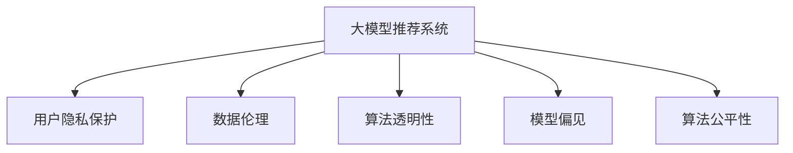
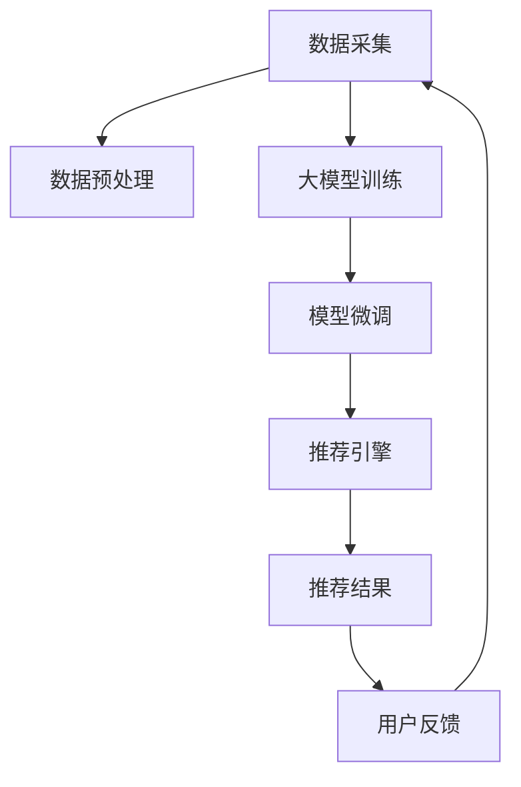

                 

# 大模型推荐系统的伦理考量

> 关键词：大模型推荐系统, 用户隐私保护, 数据伦理, 算法透明性, 模型偏见, 可解释性, 算法公平性

## 1. 背景介绍

### 1.1 问题由来
推荐系统是互联网时代最为常见的应用之一，从电商到视频、新闻、社交，无处不在。随着深度学习技术的发展，基于大模型的推荐系统逐步取代了传统的协同过滤等方法，成为推荐领域的主流。大模型如BERT、GPT、Graph Neural Networks等，通过海量数据预训练，学习到丰富的用户和物品特征，能够在用户画像、物品画像缺失或不完整的情况下，通过用户行为推测个性化推荐。然而，大模型的强大性能并未带来预期的技术红利，反而在数据、算法、社会等诸多层面引发了诸多伦理问题。

### 1.2 问题核心关键点
本文将从伦理角度，探讨当前大模型推荐系统面临的几大关键问题：

1. **用户隐私保护**：在数据采集和使用过程中，如何保护用户隐私。
2. **数据伦理**：数据采集和使用的合法性问题，是否存在数据滥用或侵权。
3. **算法透明性**：推荐系统的决策机制是否可解释，用户能否理解推荐原理。
4. **模型偏见**：大模型是否会学习到社会偏见，从而在推荐中产生歧视。
5. **算法公平性**：推荐系统是否具有公平性，避免对特定群体的不公平对待。

这些伦理问题已经成为大模型推荐系统不能忽视的重要环节，本文将从算法和制度两个层面，全面剖析这些问题的解决途径，以期推动推荐系统的健康发展。

## 2. 核心概念与联系

### 2.1 核心概念概述

为更好地理解大模型推荐系统中的伦理问题，我们首先介绍一些核心概念：

- **大模型推荐系统**：利用深度学习和大模型对用户行为数据进行建模，推荐系统通过学习用户特征和物品特征，进行个性化推荐。
- **用户隐私保护**：推荐系统在用户数据采集和使用过程中，需要遵循数据保护法规，保护用户隐私。
- **数据伦理**：数据收集和使用需要遵循伦理准则，确保数据使用的透明性和合规性。
- **算法透明性**：推荐系统的决策过程需要透明，用户应能理解算法的工作原理。
- **模型偏见**：由于训练数据中存在偏见，模型可能在推荐过程中产生歧视行为。
- **算法公平性**：推荐系统应保证对所有用户公平，避免对特定群体的歧视。

这些概念之间的关系可以通过以下Mermaid流程图来展示：



### 2.2 核心概念原理和架构的 Mermaid 流程图



该图展示了基于大模型的推荐系统的一般架构：

1. 数据采集：收集用户行为数据、物品属性数据等。
2. 数据预处理：清洗、归一化、特征工程等预处理步骤。
3. 大模型训练：在大规模数据上对大模型进行预训练，学习通用特征。
4. 模型微调：在特定任务上对大模型进行微调，获得推荐模型。
5. 推荐引擎：利用微调后的模型进行个性化推荐。
6. 用户反馈：收集用户反馈，优化模型和算法。
7. 数据采集：基于用户反馈，进一步收集用户数据。

## 3. 核心算法原理 & 具体操作步骤
### 3.1 算法原理概述

基于大模型的推荐系统，其核心算法原理主要基于用户行为数据和物品属性数据，构建用户画像和物品画像。通过大模型对用户画像和物品画像进行学习，结合推荐策略，生成个性化推荐结果。

假设推荐系统通过用户行为数据构建了用户画像 $u$，通过物品属性数据构建了物品画像 $i$。用户画像和物品画像的表示为高维向量：

$$
u = \{x_1, x_2, \ldots, x_d\}, \quad i = \{y_1, y_2, \ldots, y_d\}
$$

其中 $d$ 表示特征维度。用户画像和物品画像在大模型 $M$ 上进行特征匹配，得到推荐结果：

$$
\hat{r} = M(u, i)
$$

其中 $\hat{r}$ 表示推荐结果，通常为实数或向量。结合推荐策略，将推荐结果映射为最终的推荐物品列表。

### 3.2 算法步骤详解

基于大模型的推荐系统一般包括以下关键步骤：

**Step 1: 数据收集与预处理**
- 收集用户行为数据和物品属性数据，构建用户画像和物品画像。
- 对数据进行清洗、归一化、特征工程等预处理步骤，提升数据质量。

**Step 2: 模型训练与微调**
- 在大规模数据上对大模型进行预训练，学习通用特征。
- 在特定任务上对大模型进行微调，获得推荐模型。

**Step 3: 推荐引擎设计**
- 设计推荐策略，如基于协同过滤、基于深度学习等方法。
- 结合微调后的模型，生成推荐结果。

**Step 4: 反馈机制设计**
- 设计用户反馈机制，收集用户对推荐结果的评价。
- 根据反馈结果，不断优化模型和算法。

**Step 5: 模型部署与应用**
- 将训练好的模型部署到推荐系统中，进行实时推荐。
- 监控推荐系统的运行状态，确保其稳定性和安全性。

### 3.3 算法优缺点

基于大模型的推荐系统具有以下优点：

1. **高效性**：在用户画像和物品画像缺失或不完整的情况下，仍能根据用户行为进行推荐，提升推荐效率。
2. **鲁棒性**：通过大规模数据预训练和微调，模型具有一定的鲁棒性，能够适应多种场景和数据分布。
3. **准确性**：基于深度学习和大模型的推荐系统，通常在准确性方面优于传统方法，能够推荐用户真正感兴趣的物品。

同时，该方法也存在一些局限性：

1. **数据隐私**：在数据采集和使用过程中，存在隐私泄露的风险。
2. **数据伦理**：数据收集和使用可能存在伦理问题，如数据滥用、数据侵权等。
3. **算法透明性**：大模型的决策过程复杂，用户难以理解推荐原理。
4. **模型偏见**：由于训练数据中的社会偏见，模型可能产生歧视性推荐。
5. **算法公平性**：模型可能存在不公平行为，对某些用户群体不友好。

### 3.4 算法应用领域

基于大模型的推荐系统已经在电商、视频、新闻、社交等多个领域得到了广泛应用，推动了互联网行业的数字化转型。以下是几个典型应用场景：

- **电商推荐**：根据用户浏览历史和购物记录，推荐用户可能感兴趣的商品。
- **视频推荐**：根据用户观看历史和评分，推荐用户可能喜欢的视频。
- **新闻推荐**：根据用户阅读历史和点击记录，推荐用户感兴趣的新闻。
- **社交推荐**：根据用户互动历史，推荐用户可能感兴趣的朋友或内容。

## 4. 数学模型和公式 & 详细讲解 & 举例说明

### 4.1 数学模型构建

在基于大模型的推荐系统中，我们通常采用以下数学模型：

假设用户画像 $u$ 和物品画像 $i$ 的表示为 $d$ 维向量，分别为 $u \in \mathbb{R}^d, i \in \mathbb{R}^d$。用户画像和物品画像在大模型 $M$ 上进行特征匹配，得到推荐结果 $\hat{r} \in \mathbb{R}$。

### 4.2 公式推导过程

假设推荐模型为 $M$，其参数为 $\theta$。用户画像 $u$ 和物品画像 $i$ 在大模型 $M$ 上进行特征匹配，得到推荐结果 $\hat{r}$：

$$
\hat{r} = M(u, i) = \theta^T(u \otimes i)
$$

其中 $\otimes$ 表示向量点乘操作。推荐结果 $\hat{r}$ 与用户真实评分 $r$ 之间的损失函数为均方误差损失：

$$
\mathcal{L} = \frac{1}{N}\sum_{i=1}^N (r_i - \hat{r}_i)^2
$$

其中 $N$ 为样本数量，$(r_i, \hat{r}_i)$ 为样本 $i$ 的用户评分和模型预测推荐分数。

### 4.3 案例分析与讲解

以电商推荐为例，用户画像 $u$ 包含用户的浏览历史、购物记录、兴趣标签等特征，物品画像 $i$ 包含商品的描述、属性、用户评分等特征。通过大模型 $M$ 对这些特征进行匹配，输出推荐分数 $\hat{r}$，结合推荐策略，最终生成推荐列表。

在推荐模型训练过程中，为了平衡推荐准确性和多样性，通常会引入多样性损失：

$$
\mathcal{L} = \frac{1}{N}\sum_{i=1}^N (r_i - \hat{r}_i)^2 + \lambda \mathcal{D}(\hat{r})
$$

其中 $\mathcal{D}(\hat{r})$ 为多样性损失函数，通常为负熵函数。$\lambda$ 为正则化系数，控制推荐结果的多样性。

## 5. 项目实践：代码实例和详细解释说明
### 5.1 开发环境搭建

在进行推荐系统开发前，我们需要准备好开发环境。以下是使用Python进行PyTorch开发的环境配置流程：

1. 安装Anaconda：从官网下载并安装Anaconda，用于创建独立的Python环境。

2. 创建并激活虚拟环境：
```bash
conda create -n recsys-env python=3.8 
conda activate recsys-env
```

3. 安装PyTorch：根据CUDA版本，从官网获取对应的安装命令。例如：
```bash
conda install pytorch torchvision torchaudio cudatoolkit=11.1 -c pytorch -c conda-forge
```

4. 安装TensorFlow：
```bash
conda install tensorflow tensorflow-gpu==2.6.0
```

5. 安装其他工具包：
```bash
pip install numpy pandas scikit-learn scipy tqdm jupyter notebook ipython
```

完成上述步骤后，即可在`recsys-env`环境中开始推荐系统开发。

### 5.2 源代码详细实现

以下是使用PyTorch实现基于大模型的电商推荐系统的代码实现。

```python
import torch
import torch.nn as nn
import torch.optim as optim
from torch.utils.data import DataLoader
from torchvision import datasets, transforms

class Recommender(nn.Module):
    def __init__(self, emb_dim):
        super(Recommender, self).__init__()
        self.u_emb = nn.Embedding(num_users, emb_dim)
        self.i_emb = nn.Embedding(num_items, emb_dim)
        self.F = nn.Linear(emb_dim * emb_dim, emb_dim)
        self.linear = nn.Linear(emb_dim, 1)

    def forward(self, u, i):
        u = self.u_emb(u)
        i = self.i_emb(i)
        x = u @ i
        x = self.F(x)
        x = torch.sigmoid(self.linear(x))
        return x

def train(model, data_loader, optimizer, device):
    model.train()
    for batch in data_loader:
        u, i, r = batch
        u, i, r = u.to(device), i.to(device), r.to(device)
        optimizer.zero_grad()
        y = model(u, i)
        loss = nn.MSELoss()(y, r)
        loss.backward()
        optimizer.step()

def evaluate(model, data_loader, device):
    model.eval()
    y_hat = []
    y_true = []
    with torch.no_grad():
        for batch in data_loader:
            u, i, r = batch
            u, i, r = u.to(device), i.to(device), r.to(device)
            y = model(u, i)
            y_hat.append(y.cpu().numpy())
            y_true.append(r.cpu().numpy())
    return np.mean(np.square(y_true - y_hat))

# 设置参数
num_users = 10000
num_items = 10000
emb_dim = 128

# 构建数据集
train_data = ...
test_data = ...

# 构建模型
model = Recommender(emb_dim).to(device)

# 设置优化器
optimizer = optim.Adam(model.parameters(), lr=0.001)

# 训练模型
for epoch in range(10):
    train(model, train_data_loader, optimizer, device)
    test_loss = evaluate(model, test_data_loader, device)
    print(f"Epoch {epoch+1}, test loss: {test_loss:.4f}")

# 保存模型
torch.save(model.state_dict(), 'recommender.pt')
```

### 5.3 代码解读与分析

**Recommender类**：
- `__init__`方法：定义了用户嵌入层、物品嵌入层、全连接层和线性输出层。
- `forward`方法：实现前向传播，将用户和物品嵌入向量通过全连接层和线性层输出推荐分数。

**train和evaluate函数**：
- `train`函数：对模型进行前向传播、计算损失、反向传播和参数更新。
- `evaluate`函数：对模型进行前向传播，并计算推荐结果与真实评分的均方误差。

**训练和评估过程**：
- 在训练过程中，使用Adam优化器进行参数更新，每轮训练一个epoch。
- 在评估过程中，计算测试集上的均方误差，以衡量推荐系统的效果。

## 6. 实际应用场景
### 6.1 电商推荐

电商推荐是推荐系统最为常见的应用之一。通过大模型推荐系统，可以实时分析用户行为，为用户推荐可能感兴趣的商品，提升用户满意度和购物转化率。在实际应用中，电商推荐系统可以：

1. **个性化推荐**：根据用户浏览历史、购物记录、点击率等行为数据，为用户推荐感兴趣的商品。
2. **新商品推荐**：在用户没有购买或浏览过某类商品时，根据用户画像推荐相关商品，增加用户探索新商品的机会。
3. **跨领域推荐**：在不同领域之间进行推荐，如从电影推荐到书籍推荐，提升用户体验的多样性。

### 6.2 视频推荐

视频推荐是另一个典型的应用场景。视频平台通过大模型推荐系统，可以根据用户观看历史和评分，为用户推荐可能喜欢的视频。视频推荐系统的应用包括：

1. **个性化视频推荐**：根据用户观看历史、评分等行为数据，推荐用户可能感兴趣的视频。
2. **视频内容推荐**：在用户观看视频时，推荐相关视频，提升用户体验。
3. **热门视频推荐**：推荐平台上的热门视频，增加用户对平台的粘性。

### 6.3 新闻推荐

新闻推荐是信息推荐系统的重要应用场景。新闻平台通过大模型推荐系统，可以根据用户阅读历史和点击记录，为用户推荐感兴趣的新闻。新闻推荐系统的应用包括：

1. **个性化新闻推荐**：根据用户阅读历史、点击记录等行为数据，推荐用户可能感兴趣的新闻。
2. **新闻内容推荐**：在用户阅读新闻时，推荐相关新闻，提升用户体验。
3. **热门新闻推荐**：推荐平台上的热门新闻，增加用户对平台的粘性。

## 7. 工具和资源推荐
### 7.1 学习资源推荐

为了帮助开发者系统掌握大模型推荐系统的技术基础和应用实践，这里推荐一些优质的学习资源：

1. 《深度学习推荐系统》课程：由斯坦福大学开设的深度学习课程，系统讲解了推荐系统的工作原理和前沿技术。
2. 《推荐系统实践》书籍：介绍了推荐系统的设计原理、算法实现和工程实践，适合开发人员阅读。
3. 《Recommender Systems》书籍：系统介绍推荐系统的理论基础、算法框架和应用案例，适合学术研究人员阅读。
4. Kaggle推荐系统竞赛：通过参加Kaggle的推荐系统竞赛，可以学习到推荐的最新实践和数据处理技巧。
5. Coursera推荐系统课程：涵盖推荐系统理论、算法实现和推荐系统工程，适合系统开发者阅读。

通过对这些资源的学习实践，相信你一定能够快速掌握大模型推荐系统的精髓，并用于解决实际的推荐问题。

### 7.2 开发工具推荐

高效的开发离不开优秀的工具支持。以下是几款用于推荐系统开发的常用工具：

1. PyTorch：基于Python的开源深度学习框架，灵活动态的计算图，适合快速迭代研究。大部分推荐系统都有PyTorch版本的实现。
2. TensorFlow：由Google主导开发的开源深度学习框架，生产部署方便，适合大规模工程应用。
3. Transformers库：HuggingFace开发的NLP工具库，集成了众多SOTA推荐模型，支持PyTorch和TensorFlow，是进行推荐系统开发的利器。
4. Weights & Biases：模型训练的实验跟踪工具，可以记录和可视化模型训练过程中的各项指标，方便对比和调优。与主流深度学习框架无缝集成。
5. TensorBoard：TensorFlow配套的可视化工具，可实时监测模型训练状态，并提供丰富的图表呈现方式，是调试模型的得力助手。

合理利用这些工具，可以显著提升推荐系统开发的效率，加快创新迭代的步伐。

### 7.3 相关论文推荐

推荐系统的发展源于学界的持续研究。以下是几篇奠基性的相关论文，推荐阅读：

1. "Factorization Machines"：提出了FM算法，通过特征交叉增强推荐效果。
2. "Wide & Deep Learning for Recommender Systems"：结合宽模型和深度学习，提升推荐系统的效果。
3. "Deep Neural Networks for News Recommendation"：提出深度学习在新闻推荐中的应用，提升了推荐系统的效果。
4. "A Neural Topic Model for Intent Prediction"：提出神经网络模型用于意图预测，提升了推荐系统的准确性。
5. "A Survey on Deep Learning-based Recommendation Systems"：系统回顾了深度学习在推荐系统中的应用，介绍了不同深度学习模型的效果。

这些论文代表了大模型推荐系统的发展脉络。通过学习这些前沿成果，可以帮助研究者把握学科前进方向，激发更多的创新灵感。

## 8. 总结：未来发展趋势与挑战
### 8.1 总结

本文对基于大模型的推荐系统进行了全面系统的介绍。首先阐述了推荐系统在大模型时代的实现原理和应用场景，明确了推荐系统在用户画像缺失或数据量不足情况下，仍能进行个性化推荐的优势。其次，从数据隐私、数据伦理、算法透明性、模型偏见、算法公平性等角度，深入探讨了推荐系统面临的伦理问题，并给出了详细的解决方案。最后，通过实际应用案例，展示了推荐系统在电商、视频、新闻等多个领域的落地应用。

通过本文的系统梳理，可以看到，基于大模型的推荐系统已经成为互联网推荐领域的重要范式，极大地提升了推荐效率和准确性。但在大模型推荐系统带来的技术红利的同时，也面临着诸多挑战和伦理问题。如何平衡技术发展和用户权益，是未来推荐系统发展的关键。

### 8.2 未来发展趋势

展望未来，大模型推荐系统将呈现以下几个发展趋势：

1. **数据隐私保护**：随着数据隐私保护法规的完善，推荐系统将更加注重用户隐私保护。如差分隐私、联邦学习等技术，将在大模型推荐系统中有广泛应用。
2. **数据伦理约束**：推荐系统在数据收集和使用过程中，将更加注重数据伦理，防止数据滥用和侵权。
3. **算法透明性提升**：推荐系统的决策机制将更加透明，用户能够更好地理解推荐原理，提升信任度。
4. **模型偏见消除**：通过引入对抗训练、重采样等技术，消除模型中的社会偏见，提升推荐系统的公平性。
5. **跨模态推荐**：结合文本、图像、视频等多模态数据，提升推荐系统的准确性和多样性。

以上趋势凸显了大模型推荐系统的广阔前景。这些方向的探索发展，必将进一步提升推荐系统的性能和应用范围，为互联网用户带来更好的体验。

### 8.3 面临的挑战

尽管大模型推荐系统已经取得了瞩目成就，但在迈向更加智能化、普适化应用的过程中，它仍面临着诸多挑战：

1. **数据隐私**：在数据采集和使用过程中，存在隐私泄露的风险。如何在隐私保护和推荐效果之间找到平衡，是一大难题。
2. **数据伦理**：数据收集和使用可能存在伦理问题，如数据滥用、数据侵权等。如何在保护用户隐私的同时，实现数据的高效利用，是需要进一步探讨的问题。
3. **算法透明性**：大模型的决策过程复杂，用户难以理解推荐原理。如何在提升算法透明性的同时，不牺牲推荐效果，是需要进一步研究的方向。
4. **模型偏见**：由于训练数据中的社会偏见，模型可能产生歧视性推荐。如何在消除模型偏见的同时，保证推荐系统的性能，是需要进一步解决的问题。
5. **算法公平性**：模型可能存在不公平行为，对某些用户群体不友好。如何在提升算法公平性的同时，不增加计算复杂度，是需要进一步研究的课题。

### 8.4 研究展望

面对大模型推荐系统所面临的伦理挑战，未来的研究需要在以下几个方面寻求新的突破：

1. **数据隐私保护技术**：探索差分隐私、联邦学习等技术，保护用户隐私。
2. **数据伦理框架**：制定推荐系统的伦理准则，确保数据使用的透明性和合规性。
3. **算法透明性提升**：引入可解释性技术，提升推荐系统的透明性。
4. **模型偏见消除**：引入对抗训练、重采样等技术，消除模型中的社会偏见。
5. **算法公平性保障**：引入公平性评估指标，确保推荐系统的公平性。

这些研究方向将推动大模型推荐系统向更加智能、透明、公平的方向发展，为互联网用户带来更好的体验。

## 9. 附录：常见问题与解答

**Q1: 大模型推荐系统是否适用于所有推荐场景？**

A: 大模型推荐系统在大多数推荐场景中都能取得不错的效果，特别是在用户画像和物品画像缺失或不完整的情况下，仍能根据用户行为进行推荐。但对于一些特定领域的推荐场景，如医疗、金融等，仅仅依靠通用语料预训练的模型可能难以很好地适应。此时需要在特定领域语料上进一步预训练，再进行微调，才能获得理想效果。

**Q2: 推荐系统如何保护用户隐私？**

A: 推荐系统在数据采集和使用过程中，需要遵循数据保护法规，保护用户隐私。具体措施包括：
1. 数据匿名化：在数据采集时，去除或模糊用户标识信息，保护用户隐私。
2. 数据加密：在数据传输和存储过程中，使用加密技术保护数据安全。
3. 差分隐私：在数据处理过程中，引入差分隐私技术，防止数据泄露。

**Q3: 推荐系统在数据伦理方面需要注意哪些问题？**

A: 推荐系统在数据收集和使用过程中，可能存在数据滥用或侵权问题，需要注意以下几点：
1. 数据合法性：确保数据收集和使用符合法律法规，不侵犯用户权益。
2. 数据透明性：数据收集和使用过程需要透明，用户应知情并同意。
3. 数据公平性：避免对某些用户群体进行不公正对待，如基于种族、性别等歧视性特征的推荐。

**Q4: 推荐系统的决策过程如何保证透明性？**

A: 推荐系统的决策过程需要透明，用户应能理解推荐原理。具体措施包括：
1. 用户反馈：收集用户对推荐结果的评价，进行持续改进。
2. 模型解释：通过可解释性技术，解释推荐系统的决策机制。
3. 公开透明：在推荐系统的设计和运行过程中，保持公开透明，让用户了解推荐过程。

**Q5: 推荐系统如何避免模型偏见？**

A: 推荐系统在训练过程中，可能学习到社会偏见，需要在数据预处理和模型设计中避免偏见。具体措施包括：
1. 数据预处理：对训练数据进行预处理，去除偏见数据，增加数据多样性。
2. 模型设计：引入公平性评估指标，设计公平性目标函数。
3. 对抗训练：在训练过程中，引入对抗样本，增强模型鲁棒性，避免偏见。

**Q6: 推荐系统如何保证算法公平性？**

A: 推荐系统需要保证对所有用户公平，避免对特定群体的不公平对待。具体措施包括：
1. 公平性评估：设计公平性评估指标，监控推荐系统行为。
2. 重采样技术：通过重采样技术，增加少数群体的样本量，避免歧视。
3. 对抗训练：在训练过程中，引入对抗样本，增强模型鲁棒性，避免偏见。

这些常见问题的解答，展示了推荐系统在大模型时代面临的伦理挑战，并给出了详细的解决方案。希望这些内容能够帮助开发者更好地理解和应用大模型推荐系统，提升用户体验。

---

作者：禅与计算机程序设计艺术 / Zen and the Art of Computer Programming

