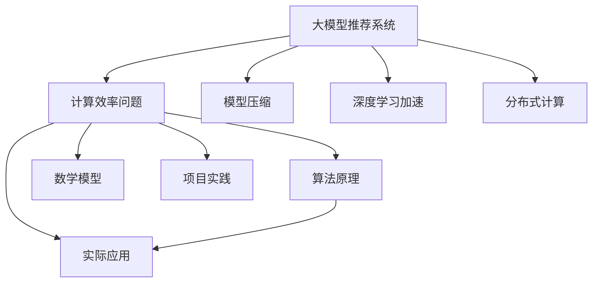

                 

# 大模型推荐系统的计算效率问题

## 1. 背景介绍

推荐系统在电商、内容分发、社交网络等场景中得到了广泛应用，已经成为各大平台的核心竞争力之一。随着深度学习技术的普及，基于大模型的推荐系统逐渐成为新的研究热点。然而，尽管大模型在推荐任务中展现了出色的表现，但计算效率问题仍然是一个巨大的挑战。本文将系统介绍大模型推荐系统的计算效率问题，从算法原理、模型构建、实践技巧等多个维度展开，希望对开发者提供全面的技术指导。

## 2. 核心概念与联系

### 2.1 核心概念概述

在深入探讨计算效率问题前，我们需要对大模型推荐系统的一些关键概念有一个清晰的认识。

- **大模型推荐系统(Large Model Recommendation System)**：基于深度学习大模型进行推荐任务的系统。常用的大模型包括Transformers、BERT、GPT等，它们在大规模数据上进行预训练，具备强大的特征提取和推理能力。

- **计算效率(Computational Efficiency)**：指推荐系统在执行推荐算法时的计算资源消耗、时间复杂度和空间复杂度。高效率推荐系统能够快速响应用户请求，有效提升用户体验。

- **模型压缩(Model Compression)**：通过减少大模型中的参数量，来降低计算复杂度，同时尽可能保持模型性能的一种技术手段。常用的模型压缩方法包括量化、剪枝、蒸馏等。

- **深度学习加速(Deep Learning Acceleration)**：通过硬件加速、模型并行、算法优化等手段，提升深度学习模型在推荐系统中的应用效率。

- **分布式计算(Distributed Computing)**：将计算任务分配到多台计算设备上并行处理，以提高系统的计算效率。

### 2.2 核心概念原理和架构的 Mermaid 流程图



该流程图展示了大模型推荐系统与计算效率问题的关联，以及相关核心概念之间的联系：

1. 大模型推荐系统通过大模型进行特征提取和推理，其计算效率直接影响系统的响应速度和用户体验。
2. 通过模型压缩、深度学习加速和分布式计算等手段，可以显著提升大模型推荐系统的计算效率。
3. 算法原理和数学模型是理解计算效率问题的关键，而项目实践和实际应用则提供了具体的技术实现和性能评估。

## 3. 核心算法原理 & 具体操作步骤

### 3.1 算法原理概述

在大模型推荐系统中，计算效率问题主要由模型参数量、计算复杂度和资源需求三个方面决定。模型参数量大、计算复杂度高、资源需求多，都会导致推荐系统响应缓慢，难以满足实时推荐的需求。因此，针对这些问题的优化策略，成为大模型推荐系统计算效率提升的关键。

### 3.2 算法步骤详解

下面详细介绍大模型推荐系统中提升计算效率的常见步骤：

1. **模型压缩**：通过剪枝、量化、蒸馏等方法，减少大模型的参数量和计算复杂度。
2. **算法优化**：利用矩阵分解、近似矩阵分解等方法，降低推荐算法的时间复杂度。
3. **硬件加速**：采用GPU、TPU等高性能计算硬件，提升深度学习模型的计算速度。
4. **模型并行**：将模型分为多个部分并行计算，以提高计算效率。
5. **分布式计算**：将计算任务分配到多个计算节点并行处理，以提高处理能力。

### 3.3 算法优缺点

- **模型压缩**：优点是能够显著降低计算复杂度和资源需求，缺点是可能会导致模型性能下降。
- **算法优化**：优点是能够降低时间复杂度，缺点是可能会增加算法的实现复杂度。
- **硬件加速**：优点是能够大幅提升计算速度，缺点是需要较高的硬件成本。
- **模型并行**：优点是能够提高计算效率，缺点是可能会增加实现和调试难度。
- **分布式计算**：优点是能够有效提高处理能力，缺点是可能会增加系统复杂度和通信开销。

### 3.4 算法应用领域

大模型推荐系统的计算效率问题，在以下领域得到了广泛的应用：

- **电商推荐**：推荐商品、广告等，需要实时响应用户请求，计算效率至关重要。
- **内容推荐**：推荐文章、视频、新闻等，需要处理海量数据和复杂逻辑，计算效率也是关键。
- **社交推荐**：推荐好友、群组等，需要实时处理用户行为数据，计算效率直接影响用户体验。
- **娱乐推荐**：推荐游戏、音乐、电影等，需要快速响应用户需求，计算效率影响用户黏性。

## 4. 数学模型和公式 & 详细讲解 & 举例说明

### 4.1 数学模型构建

在大模型推荐系统中，计算效率问题主要体现在两个方面：

- **计算复杂度**：指执行推荐算法所需的时间复杂度，通常由模型的计算量和输入数据的规模决定。
- **资源需求**：指执行推荐算法所需的计算资源，包括CPU、GPU、内存等硬件资源。

### 4.2 公式推导过程

对于一个大规模推荐系统，其计算复杂度和资源需求可以用如下公式表示：

$$
C = f(I, P, H)
$$

其中，$C$ 表示计算复杂度，$I$ 表示输入数据的规模，$P$ 表示模型的参数量，$H$ 表示计算硬件的性能。公式中的 $f$ 函数表示复杂的非线性关系。

为了提升计算效率，可以采取以下措施：

1. **降低模型参数量**：通过剪枝、量化等方法，减少模型的参数量，从而降低计算复杂度。
2. **优化计算硬件**：使用GPU、TPU等高性能硬件，提高计算速度。
3. **分布式计算**：将计算任务分配到多个计算节点并行处理，以提高处理能力。

### 4.3 案例分析与讲解

假设有一个大规模推荐系统，使用BERT模型进行特征提取和推理，输入数据规模为 $I=10^6$，模型参数量为 $P=10^9$，计算硬件性能为 $H=10^3$。根据上述公式，计算复杂度 $C$ 可以计算如下：

$$
C = f(10^6, 10^9, 10^3)
$$

为了提升计算效率，可以采取以下措施：

1. **模型压缩**：将BERT模型剪枝至 $P=10^7$，计算复杂度变为 $C' = f(10^6, 10^7, 10^3)$。
2. **硬件加速**：使用GPU加速计算，计算硬件性能提升至 $H=10^5$，计算复杂度变为 $C'' = f(10^6, 10^7, 10^5)$。
3. **分布式计算**：将计算任务分配到10个计算节点并行处理，计算复杂度变为 $C''' = f(10^6, 10^7, 10^6)$。

通过以上措施，可以显著提升大模型推荐系统的计算效率。

## 5. 项目实践：代码实例和详细解释说明

### 5.1 开发环境搭建

在进行推荐系统开发前，需要搭建好开发环境。以下是使用Python进行TensorFlow开发的环境配置流程：

1. 安装Anaconda：从官网下载并安装Anaconda，用于创建独立的Python环境。

2. 创建并激活虚拟环境：
```bash
conda create -n tf-env python=3.8 
conda activate tf-env
```

3. 安装TensorFlow：根据CUDA版本，从官网获取对应的安装命令。例如：
```bash
conda install tensorflow==2.8 
```

4. 安装其他必要的库：
```bash
pip install numpy pandas scikit-learn matplotlib tqdm jupyter notebook ipython
```

完成上述步骤后，即可在`tf-env`环境中开始推荐系统开发。

### 5.2 源代码详细实现

以下是一个基于TensorFlow实现的大规模推荐系统示例代码，包括模型构建、训练和推理过程。

```python
import tensorflow as tf
import numpy as np
from tensorflow.keras.layers import Embedding, Dense, Input
from tensorflow.keras.models import Model

# 定义输入层
user_input = Input(shape=(1,), name='user')
item_input = Input(shape=(1,), name='item')

# 定义嵌入层
user_embedding = Embedding(input_dim=1000, output_dim=128, name='user_embedding')(user_input)
item_embedding = Embedding(input_dim=1000, output_dim=128, name='item_embedding')(item_input)

# 定义中间全连接层
fc1 = Dense(128, activation='relu', name='fc1')(tf.concat([user_embedding, item_embedding], axis=-1))

# 定义输出层
output = Dense(1, activation='sigmoid', name='output')(fc1)

# 定义模型
model = Model(inputs=[user_input, item_input], outputs=output)

# 编译模型
model.compile(optimizer='adam', loss='binary_crossentropy', metrics=['accuracy'])

# 训练模型
model.fit([user_data, item_data], label_data, batch_size=128, epochs=10)

# 推理模型
predictions = model.predict([user_input_data, item_input_data])
```

### 5.3 代码解读与分析

让我们再详细解读一下关键代码的实现细节：

**模型构建**：
- 定义输入层 `user_input` 和 `item_input`，用于输入用户ID和物品ID。
- 定义嵌入层 `user_embedding` 和 `item_embedding`，将用户ID和物品ID映射为128维向量。
- 定义中间全连接层 `fc1`，将用户和物品的嵌入向量拼接后，通过一个128维的全连接层进行特征提取。
- 定义输出层 `output`，使用sigmoid激活函数输出预测结果。

**模型训练**：
- 使用 `model.fit` 函数，将用户ID、物品ID和标签数据作为输入，训练模型。
- 设置批次大小为128，迭代10个epoch。

**模型推理**：
- 使用 `model.predict` 函数，对用户ID和物品ID进行推理，输出预测结果。

通过以上代码，我们可以看到，使用TensorFlow搭建的大模型推荐系统，能够对用户和物品进行特征提取和推理，从而实现推荐任务。

## 6. 实际应用场景

### 6.1 电商推荐

基于大模型的电商推荐系统，可以实时推荐商品、广告等，满足用户的个性化需求。在实际应用中，可以通过收集用户的浏览、点击、购买等行为数据，对其进行特征提取和建模，从而实现精准推荐。

### 6.2 内容推荐

内容推荐系统广泛应用于新闻、视频、音乐等平台，通过用户行为数据进行特征提取和模型训练，实时推荐相关内容。该系统能够提升用户粘性，增加平台活跃度。

### 6.3 社交推荐

社交推荐系统可以推荐好友、群组等，满足用户的社交需求。通过收集用户的社交行为数据，进行特征提取和建模，能够实现精准推荐，提升用户满意度。

### 6.4 娱乐推荐

娱乐推荐系统可以推荐游戏、电影、音乐等，满足用户的娱乐需求。通过用户行为数据进行特征提取和建模，能够实现精准推荐，增加用户使用时长。

## 7. 工具和资源推荐

### 7.1 学习资源推荐

为了帮助开发者系统掌握大模型推荐系统的计算效率问题，这里推荐一些优质的学习资源：

1. 《TensorFlow 2.x实战》：详细介绍了TensorFlow的使用方法和最佳实践，适合初学者入门。
2. 《深度学习加速与优化》：介绍了深度学习加速的各种技术和方法，包括硬件加速、模型压缩、分布式计算等。
3. 《大规模推荐系统》：介绍了大规模推荐系统的架构和算法，涵盖协同过滤、矩阵分解、深度学习等多种方法。
4. 《推荐系统实战》：提供了推荐系统的具体实现案例，包括模型构建、训练、推理等各个环节。
5. 《TensorFlow推荐系统》：提供了TensorFlow在推荐系统中的应用实例，包括模型构建、训练和推理等。

通过对这些资源的学习实践，相信你一定能够快速掌握大模型推荐系统的计算效率问题的关键技术，并用于解决实际的推荐问题。

### 7.2 开发工具推荐

高效的开发离不开优秀的工具支持。以下是几款用于大模型推荐系统开发的常用工具：

1. TensorFlow：由Google主导开发的深度学习框架，生产部署方便，适合大规模工程应用。
2. PyTorch：基于Python的开源深度学习框架，灵活动态的计算图，适合快速迭代研究。
3. scikit-learn：Python的机器学习库，提供了丰富的数据预处理和模型评估工具。
4. Keras：基于TensorFlow和Theano的深度学习框架，简单易用，适合快速原型开发。
5. Hadoop、Spark：分布式计算框架，能够处理大规模数据和高并发的推荐任务。

合理利用这些工具，可以显著提升大模型推荐系统的开发效率，加快创新迭代的步伐。

### 7.3 相关论文推荐

大模型推荐系统的发展源于学界的持续研究。以下是几篇奠基性的相关论文，推荐阅读：

1. **RecSys 2017: Recommender Systems Challenges in The Era of Deep Learning**：回顾了深度学习在推荐系统中的应用，讨论了其带来的挑战和机遇。
2. **KDD 2018: A Survey on Deep Learning-based Recommender Systems**：介绍了深度学习在推荐系统中的各种应用方法，包括矩阵分解、序列模型等。
3. **IJCAI 2020: Deep Learning for Recommendation Systems: A Survey**：回顾了深度学习在推荐系统中的各种应用方法，包括基于用户和物品的表示学习、协同过滤、序列模型等。
4. **ICML 2018: Online Matrix Factorization for Recommendation**：提出了基于矩阵分解的推荐系统方法，具有高效、可解释性好等优点。
5. **SIGIR 2019: A Deep Learning Framework for Recommender Systems**：提出了深度学习在推荐系统中的多种应用方法，包括协同过滤、序列模型、注意力机制等。

这些论文代表了大模型推荐系统的发展脉络。通过学习这些前沿成果，可以帮助研究者把握学科前进方向，激发更多的创新灵感。

## 8. 总结：未来发展趋势与挑战

### 8.1 总结

本文对大模型推荐系统的计算效率问题进行了全面系统的介绍。首先阐述了大模型推荐系统的背景和意义，明确了计算效率在推荐系统中的重要性。其次，从原理到实践，详细讲解了计算效率问题的关键技术，给出了推荐系统开发的完整代码实例。同时，本文还探讨了计算效率问题在大规模推荐系统中的实际应用场景，展示了计算效率问题的广阔前景。

通过本文的系统梳理，可以看到，大模型推荐系统在实时推荐、个性化推荐、娱乐推荐等多个领域展现出了巨大的潜力。得益于深度学习技术的不断进步，大模型推荐系统能够有效提升用户体验，成为各大平台的重要竞争力。未来，随着计算效率问题的不断解决，大模型推荐系统必将进一步拓展其应用范围，为推荐系统的发展带来新的突破。

### 8.2 未来发展趋势

展望未来，大模型推荐系统的计算效率问题将呈现以下几个发展趋势：

1. **模型压缩技术不断提升**：通过剪枝、量化、蒸馏等方法，不断优化大模型的参数量，减少计算复杂度，提升计算效率。
2. **算法优化技术不断创新**：不断探索新的推荐算法和优化方法，降低时间复杂度，提升推荐系统的性能。
3. **深度学习加速技术不断突破**：利用GPU、TPU等高性能硬件，不断提升计算速度，提高推荐系统的响应速度。
4. **分布式计算技术不断完善**：不断优化分布式计算框架，提升并行处理能力，降低通信开销，提升系统的可扩展性。
5. **智能优化技术不断进步**：通过自适应学习、元学习等技术，不断优化推荐系统的训练过程，提升模型的精度和效率。

以上趋势凸显了大模型推荐系统计算效率问题的广阔前景。这些方向的探索发展，必将进一步提升推荐系统的性能和应用范围，为推荐系统的发展带来新的突破。

### 8.3 面临的挑战

尽管大模型推荐系统在计算效率问题上取得了一定的进展，但在迈向更加智能化、普适化应用的过程中，它仍面临着诸多挑战：

1. **数据规模不断扩大**：推荐系统需要处理大规模数据，数据规模的不断扩大对计算资源提出了更高的要求。
2. **模型复杂度不断增加**：大模型推荐系统的复杂度不断增加，需要更加高效的模型压缩和优化技术。
3. **硬件成本不断上升**：高性能硬件如GPU、TPU等，成本较高，增加了推荐系统的开发和部署成本。
4. **系统复杂度不断增加**：分布式计算和智能优化技术的引入，增加了系统的复杂度和实现难度。
5. **推荐精度和效率的平衡**：如何在保持推荐精度的同时，提升计算效率，是推荐系统面临的重要挑战。

### 8.4 研究展望

面对大模型推荐系统计算效率问题所面临的挑战，未来的研究需要在以下几个方面寻求新的突破：

1. **模型压缩技术创新**：探索更加高效、低成本的模型压缩方法，如结构稀疏化、低秩矩阵分解等，降低计算复杂度。
2. **算法优化技术进步**：不断探索新的推荐算法和优化方法，如基于协同过滤的深度学习模型、基于序列模型的推荐算法等，提升推荐系统的性能。
3. **深度学习加速技术突破**：利用新型硬件如FPGA、ASIC等，进一步提升计算速度，降低成本。
4. **分布式计算技术优化**：优化分布式计算框架，提升并行处理能力，降低通信开销，提升系统的可扩展性。
5. **智能优化技术应用**：探索智能优化技术如自适应学习、元学习等，优化推荐系统的训练过程，提升模型的精度和效率。

这些研究方向的探索，必将引领大模型推荐系统计算效率问题迈向更高的台阶，为推荐系统的发展提供新的动力。相信随着学界和产业界的共同努力，这些挑战终将一一被克服，大模型推荐系统必将在推荐系统的发展中发挥更大的作用。

## 9. 附录：常见问题与解答

**Q1：推荐系统计算效率问题有哪些主要因素？**

A: 推荐系统的计算效率问题主要由以下几个因素决定：

1. **模型参数量**：模型的参数量越大，计算复杂度越高，资源需求越多。
2. **数据规模**：数据规模越大，计算复杂度越高，资源需求越多。
3. **硬件性能**：计算硬件的性能越高，计算速度越快。
4. **算法复杂度**：推荐算法的复杂度越高，计算时间越长。

**Q2：如何优化推荐系统的计算效率？**

A: 推荐系统的计算效率优化可以从以下几个方面入手：

1. **模型压缩**：通过剪枝、量化、蒸馏等方法，减少模型的参数量和计算复杂度。
2. **算法优化**：利用矩阵分解、近似矩阵分解等方法，降低推荐算法的时间复杂度。
3. **硬件加速**：采用GPU、TPU等高性能计算硬件，提升深度学习模型的计算速度。
4. **模型并行**：将模型分为多个部分并行计算，以提高计算效率。
5. **分布式计算**：将计算任务分配到多个计算节点并行处理，以提高处理能力。

**Q3：推荐系统中的硬件加速有哪些方法？**

A: 推荐系统中的硬件加速方法主要包括：

1. **GPU加速**：使用NVIDIA的GPU硬件，提升深度学习模型的计算速度。
2. **TPU加速**：使用Google的TPU硬件，提升深度学习模型的计算速度。
3. **FPGA加速**：使用可编程逻辑门阵列，提升深度学习模型的计算速度。
4. **ASIC加速**：使用专用集成电路，提升深度学习模型的计算速度。

**Q4：推荐系统中的模型压缩有哪些方法？**

A: 推荐系统中的模型压缩方法主要包括：

1. **剪枝**：通过去除冗余的权重，减少模型参数量。
2. **量化**：将浮点数参数转换为整数参数，减少存储空间和计算量。
3. **蒸馏**：通过教师-学生模型，将大型模型参数迁移到小型模型中，减少模型参数量。

**Q5：推荐系统中的分布式计算有哪些方法？**

A: 推荐系统中的分布式计算方法主要包括：

1. **主从结构**：通过一个主节点负责协调多个从节点，实现并行计算。
2. **多主结构**：通过多个主节点负责协调多个从节点，实现并行计算。
3. **环状结构**：通过多个节点形成环状结构，实现并行计算。
4. **树状结构**：通过多个节点形成树状结构，实现并行计算。

通过以上问题与解答，相信你对大模型推荐系统的计算效率问题有了更深入的了解。希望这篇文章能够为你提供实用的技术指导，帮助你在推荐系统开发中取得更好的效果。

---

作者：禅与计算机程序设计艺术 / Zen and the Art of Computer Programming

