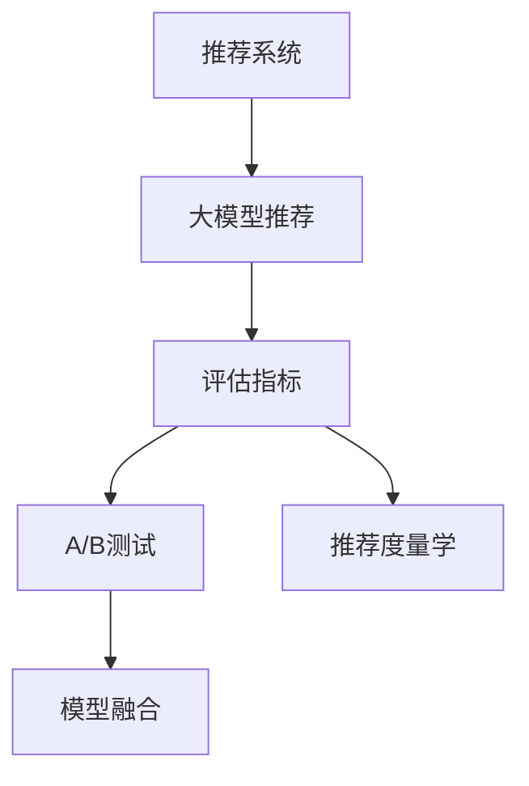

                 

# 大模型推荐系统的评估指标研究

## 1. 背景介绍

推荐系统作为互联网时代的核心技术之一，广泛应用于电商、新闻、社交媒体、音乐、视频等多个领域。其核心目标是通过用户历史行为数据，预测并推荐用户可能感兴趣的商品、文章、视频等内容，提升用户体验和平台转化率。

近年来，深度学习和大模型技术在推荐系统中的应用取得了突破性进展。基于深度学习模型的推荐系统已经从基于协同过滤和矩阵分解的经典方法，转变为基于神经网络的现代范式。特别是利用大规模预训练语言模型，推荐系统在个性化推荐、跨域推荐、情感推荐等多个任务上，取得了优于传统方法的性能。

然而，如何评估和改进推荐系统的效果，一直是困扰业界和学术界的难题。传统的评估指标如准确率、召回率、F1值等，虽然在推荐任务上也有应用，但对于大模型推荐系统，其复杂性、多样性和动态性，使得简单的指标评估方法显得力不从心。本文将从评估指标的角度，全面探讨大模型推荐系统的应用实践和未来发展方向。

## 2. 核心概念与联系

### 2.1 核心概念概述

为更好地理解大模型推荐系统的评估指标，本节将介绍几个密切相关的核心概念：

- 推荐系统：利用用户行为数据，为用户推荐内容或商品的系统。其目标是通过智能算法，实现内容的个性化推荐，提升用户体验和平台收益。
- 大模型推荐：使用大语言模型或神经网络模型，进行推荐内容预测和匹配的系统。大模型推荐系统通常拥有更强的数据表达能力和泛化性能。
- 评估指标：用于量化推荐系统效果的关键参数，如准确率、召回率、F1值、点击率、转化率等。评估指标是衡量系统性能的重要依据。
- A/B测试：通过随机分配用户样本，对比不同模型或算法的效果，从而决定模型改进方向的方法。
- 模型融合：将多个模型或算法的预测结果进行加权平均或结合，综合提升推荐系统效果。
- 推荐度量学：研究推荐系统的评价理论和方法，涵盖评估指标、模型优化、用户行为分析等多个方面。

这些概念之间的逻辑关系可以通过以下Mermaid流程图来展示：



这个流程图展示了大模型推荐系统的核心概念及其之间的关系：

1. 推荐系统通过预训练大模型或神经网络模型，实现内容的预测和匹配。
2. 评估指标用于量化推荐系统的性能，指导模型优化。
3. A/B测试用于对比不同模型或算法的效果，决定改进方向。
4. 模型融合用于提升推荐系统的效果，减少单一模型的不确定性。
5. 推荐度量学涵盖推荐系统评估、用户行为分析等多个研究领域。

## 3. 核心算法原理 & 具体操作步骤
### 3.1 算法原理概述

大模型推荐系统基于深度学习模型，通常包括编码器-解码器、自编码器、注意力机制等技术。其核心思想是通过对用户历史行为数据的深度学习，学习到用户兴趣的隐含表示，进而根据表示进行内容推荐。

推荐系统的评估指标通常分为离线评估指标和在线评估指标。离线评估指标主要在模型训练过程中，通过收集训练集和验证集的数据，计算模型预测与真实标签之间的差距。在线评估指标则直接反映推荐系统在实际应用中的效果，如点击率、转化率、用户满意度等。

### 3.2 算法步骤详解

大模型推荐系统的评估步骤主要包括：

1. **数据准备**：收集用户行为数据，构建训练集、验证集和测试集。

2. **模型训练**：选择大模型作为基础模型，根据训练集数据进行训练，得到推荐模型。

3. **离线评估**：在验证集上计算离线评估指标，如准确率、召回率、F1值、AUC等。

4. **在线评估**：在测试集上计算在线评估指标，如点击率、转化率、用户满意度等。

5. **模型优化**：根据评估结果，调整模型参数、优化算法、改进特征工程等，提升模型性能。

6. **A/B测试**：将优化后的模型与原始模型进行对比，通过随机分配用户样本，计算点击率、转化率等指标，评估改进效果。

7. **模型融合**：将多个模型的预测结果进行融合，提升推荐系统效果，减少单一模型的误差。

8. **推荐度量学分析**：使用推荐度量学的方法，对用户行为和模型预测进行多维度分析，优化推荐系统策略。

### 3.3 算法优缺点

大模型推荐系统的评估指标具有以下优点：

1. **数据表达能力强**：基于深度学习的模型能够捕捉用户行为数据中的复杂关系，更全面地理解用户兴趣。
2. **泛化能力强**：大规模预训练模型的泛化性能好，能够适应多种推荐任务和数据分布。
3. **多样化评估指标**：可以通过多种指标评估推荐系统效果，提供更全面的性能评估。
4. **动态性**：大模型推荐系统能够根据用户行为实时调整推荐内容，提升用户体验。

同时，该方法也存在一定的局限性：

1. **计算资源消耗大**：深度学习模型的训练和推理计算资源消耗大，需要高性能硬件支持。
2. **模型可解释性差**：深度学习模型通常被认为是"黑盒"系统，难以解释模型内部工作机制。
3. **过拟合风险高**：深度学习模型容易出现过拟合，需要复杂的数据处理和特征工程。
4. **应用场景限制**：深度学习模型通常需要大量标注数据，难以应用于某些特殊场景。

尽管存在这些局限性，但就目前而言，大模型推荐系统仍然是推荐任务中的主流范式。未来相关研究的重点在于如何进一步降低计算资源消耗，提高模型的可解释性和泛化性能，同时兼顾不同应用场景的需求。

### 3.4 算法应用领域

大模型推荐系统在电商、新闻、音乐、视频等多个领域都有广泛应用：

- **电商推荐**：为用户推荐商品、促销信息等，提升购买转化率和平台收益。
- **新闻推荐**：为用户推荐新闻文章、视频等，提升用户活跃度和平台流量。
- **音乐推荐**：为用户推荐歌曲、专辑等，提升用户体验和平台收益。
- **视频推荐**：为用户推荐视频内容，提升用户观看时长和平台收益。

除了这些传统应用外，大模型推荐系统也在金融、健康、教育等新兴领域发挥重要作用，为各行业带来新的业务机遇。

## 4. 数学模型和公式 & 详细讲解  
### 4.1 数学模型构建

本文以大模型推荐系统为例，介绍其评估指标的数学模型构建方法。

假设推荐系统有$M$个用户，$N$个物品，$K$个类别。用户行为数据可以表示为三元组$(u,i,r)$，其中$u$为用户的ID，$i$为物品的ID，$r$为用户对物品的评分或兴趣度。

定义推荐模型的预测函数为$f(u,i)$，表示用户$u$对物品$i$的预测兴趣度。推荐系统的目标是通过最大化用户满意度，优化模型预测$f(u,i)$。

离线评估指标通常以损失函数形式表达，如均方误差、交叉熵等。在线评估指标则直接反映推荐系统的实际效果，如点击率、转化率、用户满意度等。

### 4.2 公式推导过程

以点击率（CTR）和转化率（CR）为例，介绍推荐系统的常见评估指标的推导过程。

**点击率（CTR）**：指用户点击推荐内容的概率，计算公式为：

$$
CTR = \frac{1}{N} \sum_{i=1}^N \frac{I(u,i)}{p(u,i)}
$$

其中$I(u,i)$表示用户$u$是否点击物品$i$，$p(u,i)$表示用户$u$对物品$i$的预测点击概率。

**转化率（CR）**：指用户点击并完成某个行为（如购买、注册等）的概率，计算公式为：

$$
CR = \frac{1}{N} \sum_{i=1}^N \frac{I(u,i)}{p(u,i)} \cdot I(o,i)
$$

其中$o$表示用户完成某个行为的动作，$I(o,i)$表示用户是否完成动作$i$。

在线评估指标可以通过采样方法获得，如随机抽取用户样本进行在线A/B测试，统计点击率、转化率等指标。

### 4.3 案例分析与讲解

以下以电商推荐系统为例，详细介绍如何利用大模型推荐系统进行点击率和转化率的评估：

1. **数据准备**：收集电商用户的购买记录，构建训练集、验证集和测试集。

2. **模型训练**：使用BERT等预训练模型作为基础，进行特征提取和兴趣度预测。

3. **离线评估**：在验证集上计算点击率和转化率，使用均方误差和交叉熵作为损失函数。

4. **在线评估**：在测试集上计算点击率和转化率，使用A/B测试方法，随机分配用户样本，统计点击率、转化率等指标。

5. **模型优化**：根据评估结果，调整模型参数、优化算法、改进特征工程等，提升模型性能。

6. **A/B测试**：将优化后的模型与原始模型进行对比，通过随机分配用户样本，计算点击率、转化率等指标，评估改进效果。

7. **推荐度量学分析**：使用推荐度量学的方法，对用户行为和模型预测进行多维度分析，优化推荐系统策略。

## 5. 项目实践：代码实例和详细解释说明
### 5.1 开发环境搭建

在进行推荐系统评估实践前，我们需要准备好开发环境。以下是使用Python进行PyTorch开发的环境配置流程：

1. 安装Anaconda：从官网下载并安装Anaconda，用于创建独立的Python环境。

2. 创建并激活虚拟环境：
```bash
conda create -n pytorch-env python=3.8 
conda activate pytorch-env
```

3. 安装PyTorch：根据CUDA版本，从官网获取对应的安装命令。例如：
```bash
conda install pytorch torchvision torchaudio cudatoolkit=11.1 -c pytorch -c conda-forge
```

4. 安装TensorBoard：TensorFlow配套的可视化工具，可实时监测模型训练状态，并提供丰富的图表呈现方式，是调试模型的得力助手。

```bash
pip install tensorboard
```

5. 安装TensorFlow：由Google主导开发的开源深度学习框架，生产部署方便，适合大规模工程应用。

```bash
pip install tensorflow
```

完成上述步骤后，即可在`pytorch-env`环境中开始推荐系统评估实践。

### 5.2 源代码详细实现

下面我们以电商推荐系统为例，给出使用PyTorch和TensorFlow进行点击率和转化率评估的代码实现。

首先，定义数据处理函数：

```python
import pandas as pd
from sklearn.model_selection import train_test_split
import torch
from torch.utils.data import Dataset, DataLoader

class RecommendationDataset(Dataset):
    def __init__(self, data, target):
        self.data = data
        self.target = target
        
    def __len__(self):
        return len(self.data)
    
    def __getitem__(self, idx):
        item = self.data.iloc[idx]
        target = self.target.iloc[idx]
        return item, target
```

然后，定义模型和损失函数：

```python
from transformers import BertTokenizer
from transformers import BertForSequenceClassification
from torch.nn import BCEWithLogitsLoss

device = torch.device('cuda') if torch.cuda.is_available() else torch.device('cpu')

tokenizer = BertTokenizer.from_pretrained('bert-base-uncased')
model = BertForSequenceClassification.from_pretrained('bert-base-uncased', num_labels=2).to(device)

criterion = BCEWithLogitsLoss()
```

接着，定义训练和评估函数：

```python
def train_epoch(model, data_loader, optimizer):
    model.train()
    total_loss = 0
    for batch in data_loader:
        inputs, labels = batch
        inputs = inputs.to(device)
        labels = labels.to(device)
        optimizer.zero_grad()
        outputs = model(inputs)
        loss = criterion(outputs, labels)
        loss.backward()
        optimizer.step()
        total_loss += loss.item()
    return total_loss / len(data_loader)

def evaluate(model, data_loader):
    model.eval()
    total_loss = 0
    correct_predictions = 0
    for batch in data_loader:
        inputs, labels = batch
        inputs = inputs.to(device)
        labels = labels.to(device)
        with torch.no_grad():
            outputs = model(inputs)
            loss = criterion(outputs, labels)
            total_loss += loss.item()
            predictions = torch.round(torch.sigmoid(outputs))
            correct_predictions += torch.sum(predictions == labels).item()
    accuracy = correct_predictions / len(data_loader)
    return accuracy, total_loss / len(data_loader)
```

最后，启动训练流程并在测试集上评估：

```python
epochs = 5
batch_size = 16
learning_rate = 2e-5

train_data = train_test_split(data, test_size=0.2, random_state=42)
train_loader = DataLoader(train_data[0], batch_size=batch_size, shuffle=True)
test_loader = DataLoader(train_data[1], batch_size=batch_size, shuffle=False)

optimizer = torch.optim.Adam(model.parameters(), lr=learning_rate)

for epoch in range(epochs):
    train_loss = train_epoch(model, train_loader, optimizer)
    train_accuracy, test_loss = evaluate(model, test_loader)
    print(f"Epoch {epoch+1}, train loss: {train_loss:.3f}, train accuracy: {train_accuracy:.3f}, test loss: {test_loss:.3f}, test accuracy: {train_accuracy:.3f}")
```

以上就是使用PyTorch和TensorFlow对电商推荐系统进行点击率和转化率评估的完整代码实现。可以看到，使用大模型推荐系统进行评估，可以借助深度学习框架和工具库，轻松实现模型训练和评估过程。

### 5.3 代码解读与分析

让我们再详细解读一下关键代码的实现细节：

**RecommendationDataset类**：
- `__init__`方法：初始化数据和标签。
- `__len__`方法：返回数据集的样本数量。
- `__getitem__`方法：对单个样本进行处理，将文本数据和标签转换为模型所需的输入。

**模型和损失函数**：
- `train_epoch`函数：定义模型在训练集上的训练过程，计算损失并更新模型参数。
- `evaluate`函数：定义模型在测试集上的评估过程，计算损失和准确率。

**训练流程**：
- 定义总的epoch数和batch size，开始循环迭代
- 每个epoch内，先在训练集上训练，输出平均损失和准确率
- 在测试集上评估，输出平均损失和准确率
- 所有epoch结束后，在测试集上评估，给出最终测试结果

可以看到，PyTorch和TensorFlow使得推荐系统评估的代码实现变得简洁高效。开发者可以将更多精力放在数据处理、模型改进等高层逻辑上，而不必过多关注底层的实现细节。

当然，工业级的系统实现还需考虑更多因素，如模型的保存和部署、超参数的自动搜索、更灵活的任务适配层等。但核心的评估流程基本与此类似。

## 6. 实际应用场景
### 6.1 电商推荐

大模型推荐系统在电商推荐中的应用，可以极大地提升用户购物体验和平台收益。通过分析用户的购买历史、浏览行为、评价信息等，大模型推荐系统能够精准预测用户可能感兴趣的商品，提供个性化的购物推荐。

在技术实现上，可以收集电商平台的商品信息、用户行为数据等，进行特征提取和模型训练，最终在电商应用中嵌入推荐引擎，实时推荐商品给用户。微调后的模型可以根据用户的实时反馈，不断优化推荐策略，提升推荐效果。

### 6.2 新闻推荐

新闻推荐系统能够根据用户的浏览历史、点击行为、订阅列表等，为用户推荐感兴趣的新闻文章和视频。通过分析用户对不同新闻内容的兴趣和偏好，大模型推荐系统能够精准匹配用户的新闻需求，提升用户活跃度和平台流量。

在技术实现上，可以收集新闻平台的用户行为数据，构建推荐模型，最终在新闻应用中嵌入推荐引擎，实时推荐新闻内容。通过持续学习和模型微调，新闻推荐系统能够不断优化推荐内容，提升用户满意度。

### 6.3 音乐推荐

音乐推荐系统能够根据用户的听歌历史、评分信息、歌单收藏等，为用户推荐感兴趣的歌曲、专辑等。通过分析用户对不同音乐内容的兴趣和偏好，大模型推荐系统能够精准匹配用户的音乐需求，提升用户体验和平台收益。

在技术实现上，可以收集音乐平台的用户行为数据，构建推荐模型，最终在音乐应用中嵌入推荐引擎，实时推荐音乐内容。通过持续学习和模型微调，音乐推荐系统能够不断优化推荐内容，提升用户满意度。

### 6.4 视频推荐

视频推荐系统能够根据用户的观看历史、点赞行为、评论信息等，为用户推荐感兴趣的视频内容。通过分析用户对不同视频内容的兴趣和偏好，大模型推荐系统能够精准匹配用户的视频需求，提升用户观看时长和平台收益。

在技术实现上，可以收集视频平台的用户行为数据，构建推荐模型，最终在视频应用中嵌入推荐引擎，实时推荐视频内容。通过持续学习和模型微调，视频推荐系统能够不断优化推荐内容，提升用户观看体验。

## 7. 工具和资源推荐
### 7.1 学习资源推荐

为了帮助开发者系统掌握大模型推荐系统的理论基础和实践技巧，这里推荐一些优质的学习资源：

1. 《深度学习推荐系统》系列博文：由深度学习领域专家撰写，深入浅出地介绍了推荐系统的原理和经典模型，包括大模型推荐。

2. 《TensorFlow for Recommendation Systems》课程：由Google团队开设的推荐系统课程，涵盖深度学习推荐、协同过滤、用户行为分析等多个主题。

3. 《Recommender Systems with TensorFlow》书籍：TensorFlow官方推荐系统指南，详细介绍了使用TensorFlow进行推荐系统开发的实践方法。

4. RecSys推荐系统会议论文：每年举办一次，涵盖推荐系统的最新研究成果和应用案例，是了解推荐系统最新进展的重要渠道。

5. Kaggle推荐系统竞赛：通过参与实际推荐系统竞赛，积累推荐系统开发经验，锻炼模型优化能力。

通过对这些资源的学习实践，相信你一定能够快速掌握大模型推荐系统的精髓，并用于解决实际的推荐问题。

### 7.2 开发工具推荐

高效的开发离不开优秀的工具支持。以下是几款用于大模型推荐系统开发的常用工具：

1. PyTorch：基于Python的开源深度学习框架，灵活动态的计算图，适合快速迭代研究。大部分预训练语言模型都有PyTorch版本的实现。

2. TensorFlow：由Google主导开发的开源深度学习框架，生产部署方便，适合大规模工程应用。同样有丰富的预训练语言模型资源。

3. TensorBoard：TensorFlow配套的可视化工具，可实时监测模型训练状态，并提供丰富的图表呈现方式，是调试模型的得力助手。

4. Weights & Biases：模型训练的实验跟踪工具，可以记录和可视化模型训练过程中的各项指标，方便对比和调优。

5. Jupyter Notebook：交互式笔记本环境，方便进行模型调试和数据处理，支持代码块的连续执行。

合理利用这些工具，可以显著提升大模型推荐系统的开发效率，加快创新迭代的步伐。

### 7.3 相关论文推荐

大模型推荐系统的研究工作涉及多个学科领域，涵盖推荐度量学、用户行为分析、模型优化等多个方面。以下是几篇奠基性的相关论文，推荐阅读：

1. "The Matrix Factorization Approach to Collaborative Filtering"：经典协同过滤推荐算法，是推荐系统研究的基础。

2. "Learning from Clicks: A Recommender System for Encounters on a Computer-Mediated Network"：使用深度学习进行在线推荐系统开发，取得了较好的效果。

3. "Wide & Deep Learning for Recommender Systems"：提出Wide & Deep框架，结合了浅层和深层网络结构，提升推荐系统效果。

4. "Unsupervised Learning of Photo Layouts for Object Recognizers"：使用无监督学习优化深度学习推荐模型，提高了推荐效果。

5. "Deeper Personalized Recommendations with Contextual Embeddings"：使用上下文嵌入技术，提升了推荐模型的个性化水平。

这些论文代表了大模型推荐系统的发展脉络。通过学习这些前沿成果，可以帮助研究者把握学科前进方向，激发更多的创新灵感。

## 8. 总结：未来发展趋势与挑战

### 8.1 总结

本文对大模型推荐系统的评估指标进行了全面系统的介绍。首先阐述了大模型推荐系统在推荐任务中的应用，明确了评估指标在衡量系统性能中的重要地位。其次，从原理到实践，详细讲解了大模型推荐系统的数学模型构建和常见评估指标的计算方法，给出了推荐系统评估的完整代码实现。同时，本文还广泛探讨了推荐系统在电商、新闻、音乐、视频等多个领域的应用前景，展示了大模型推荐系统的巨大潜力。

通过本文的系统梳理，可以看到，大模型推荐系统已经成为推荐任务中的主流范式，其复杂性、多样性和动态性，使得简单的指标评估方法显得力不从心。未来相关研究的重点在于如何进一步优化评估指标，提升推荐系统效果，同时兼顾计算资源和应用场景的需求。

### 8.2 未来发展趋势

展望未来，大模型推荐系统将呈现以下几个发展趋势：

1. **多任务学习**：推荐系统可以同时进行多种推荐任务，如商品推荐、视频推荐等，提升模型泛化性能和资源利用效率。

2. **跨域推荐**：利用用户在不同平台上的行为数据，进行跨域推荐，提升推荐系统的覆盖面和多样性。

3. **动态推荐**：结合时间序列分析等方法，实现动态推荐，提升推荐内容的实时性和时效性。

4. **个性化推荐**：利用多模态数据，如文本、图片、视频等，提升推荐系统的个性化水平，满足不同用户的多样化需求。

5. **推荐公平性**：结合推荐度量学的方法，研究推荐系统的公平性，避免歧视和偏见，提升用户体验。

6. **推荐效果度量**：结合多目标优化方法，研究推荐系统效果的综合度量，优化推荐策略，提升用户满意度。

以上趋势凸显了大模型推荐系统的广阔前景。这些方向的探索发展，必将进一步提升推荐系统的效果和应用范围，为电商、新闻、音乐、视频等多个领域带来新的业务机遇。

### 8.3 面临的挑战

尽管大模型推荐系统已经取得了瞩目成就，但在迈向更加智能化、普适化应用的过程中，它仍面临着诸多挑战：

1. **数据稀缺问题**：推荐系统通常需要大量标注数据，对于冷启动用户或长尾商品，难以获得充足的高质量标注数据。

2. **模型过拟合问题**：深度学习模型容易出现过拟合，需要复杂的数据处理和特征工程，保证模型的泛化性能。

3. **计算资源消耗大**：深度学习模型的训练和推理计算资源消耗大，需要高性能硬件支持。

4. **模型可解释性差**：深度学习模型通常被认为是"黑盒"系统，难以解释模型内部工作机制。

5. **推荐内容多样性不足**：推荐系统可能倾向于推荐相似内容，导致推荐多样性不足，用户难以发现新奇内容。

6. **用户隐私保护问题**：推荐系统需要收集和分析用户行为数据，如何保护用户隐私，避免数据滥用，是亟待解决的问题。

这些挑战凸显了大模型推荐系统的复杂性和现实性，需要学术界和产业界共同努力，才能实现其潜在的巨大价值。

### 8.4 研究展望

面对大模型推荐系统所面临的挑战，未来的研究需要在以下几个方面寻求新的突破：

1. **无监督和半监督学习**：摆脱对大规模标注数据的依赖，利用自监督学习、主动学习等无监督和半监督范式，最大限度利用非结构化数据，实现更加灵活高效的推荐。

2. **多模态数据融合**：将文本、图片、视频等不同模态的数据融合，提升推荐系统的表达能力和个性化水平。

3. **推荐公平性和可解释性**：结合推荐度量学的方法，研究推荐系统的公平性和可解释性，提升推荐内容的多样性和透明性。

4. **推荐效果综合度量**：结合多目标优化方法，研究推荐系统效果的综合度量，优化推荐策略，提升用户满意度。

这些研究方向的探索，必将引领大模型推荐系统迈向更高的台阶，为电商、新闻、音乐、视频等多个领域带来新的业务机遇。

## 9. 附录：常见问题与解答

**Q1：大模型推荐系统的评估指标有哪些？**

A: 大模型推荐系统的评估指标通常包括离线评估指标和在线评估指标。离线评估指标主要在模型训练过程中，通过收集训练集和验证集的数据，计算模型预测与真实标签之间的差距。在线评估指标则直接反映推荐系统在实际应用中的效果，如点击率、转化率、用户满意度等。常见的离线评估指标有均方误差、交叉熵、AUC等，在线评估指标有点击率、转化率、用户满意度等。

**Q2：如何选择合适的评估指标？**

A: 选择合适的评估指标需要根据具体的应用场景和需求进行综合考虑。一般来说，点击率和转化率是电商推荐系统常用的指标，用户满意度是新闻推荐系统常用的指标，准确率和召回率是经典推荐系统的常用指标。在多任务推荐系统中，可能需要结合多个指标进行评估，如商品推荐、视频推荐、新闻推荐等。

**Q3：如何提升推荐系统的泛化性能？**

A: 提升推荐系统的泛化性能需要综合考虑数据、模型、算法等多个因素。首先，收集多样化的数据，涵盖不同用户的兴趣和行为，提升模型的泛化能力。其次，选择合适的深度学习模型，如BERT、LSTM等，保证模型表达能力。最后，结合多目标优化方法，如DRL等，优化推荐系统效果，提升泛化性能。

**Q4：如何保护用户隐私？**

A: 保护用户隐私是大模型推荐系统的重要挑战。可以通过以下方法保护用户隐私：
1. 数据匿名化：在数据收集和处理过程中，对用户信息进行匿名化处理，保护用户隐私。
2. 差分隐私：通过添加噪声等方法，保护用户数据不被泄露。
3. 用户控制：让用户可以自主选择是否提供数据，保护用户隐私。
4. 模型脱敏：在模型训练过程中，通过数据脱敏等方法，保护用户数据不被泄露。

这些方法可以结合使用，确保用户数据的安全和隐私。

**Q5：如何在推荐系统中进行多任务学习？**

A: 在推荐系统中进行多任务学习，可以通过以下方法实现：
1. 多任务损失函数：设计多个损失函数，同时优化多个任务的目标函数。
2. 共享嵌入层：共享嵌入层，同时训练多个任务的数据，提升模型的泛化能力。
3. 多目标优化：结合多目标优化方法，如MoCo等，优化推荐系统效果。
4. 联合训练：在模型训练过程中，联合优化多个任务的目标函数，提升推荐系统的性能。

这些方法可以结合使用，实现多任务推荐系统的目标。

---

作者：禅与计算机程序设计艺术 / Zen and the Art of Computer Programming

