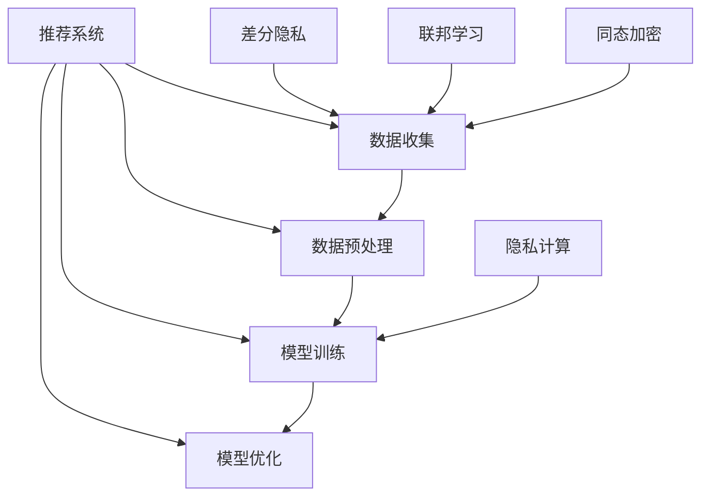

                 

# 大模型推荐系统的隐私保护问题

> 关键词：大模型推荐系统,隐私保护,差分隐私,联邦学习,同态加密,隐私计算

## 1. 背景介绍

随着互联网的发展和数据技术的进步，推荐系统在电商、社交、视频、新闻等多个领域得到广泛应用，极大地提升了用户体验和运营效率。然而，推荐系统依赖于大规模用户数据进行训练和优化，其数据来源复杂多样，涉及用户隐私、商业机密等敏感信息。如何在推荐系统中保护用户隐私，成为近年来研究的热点问题。

推荐系统对用户数据的依赖性极高，用户在平台上的浏览记录、评分信息、搜索历史等都是宝贵的资源，对于模型的优化和推荐策略的调整至关重要。然而，这些数据在收集、存储和传输过程中，极易受到泄露、篡改和恶意攻击，造成用户隐私侵犯。

近年来，随着用户隐私意识的增强和相关法律法规的完善，对推荐系统的隐私保护提出了更高的要求。例如，欧盟的《通用数据保护条例》（GDPR）和中国的《数据安全法》都对个人信息保护进行了严格规定，要求企业在处理个人数据时必须透明合法，保护用户隐私。

## 2. 核心概念与联系

### 2.1 核心概念概述

为更好地理解推荐系统中的隐私保护问题，本节将介绍几个关键概念：

- **推荐系统（Recommendation System）**：根据用户行为数据，对用户进行个性化推荐的技术，涵盖算法、数据、工程等多个层面。
- **用户隐私保护（User Privacy Protection）**：在推荐系统开发和应用过程中，保护用户数据不被泄露、滥用和侵害的过程。
- **差分隐私（Differential Privacy）**：一种隐私保护技术，通过添加随机噪声到查询结果，使攻击者无法区分不同用户的数据。
- **联邦学习（Federated Learning）**：一种分布式学习技术，多个本地设备参与模型训练，不共享原始数据，实现隐私保护。
- **同态加密（Homomorphic Encryption）**：一种加密技术，支持在密文上执行计算，输出结果为加密形式，保证数据加密性。
- **隐私计算（Privacy-Preserving Computation）**：一组计算方法和技术，确保计算过程中的数据隐私性，如多方安全计算、零知识证明等。

这些概念之间相互关联，通过不同技术手段，可以在推荐系统中实现不同层次的隐私保护，保证用户数据的安全性和隐私性。

### 2.2 核心概念原理和架构的 Mermaid 流程图



这个流程图展示了推荐系统中数据流向和隐私保护技术的应用：

1. 推荐系统从数据收集开始，涉及用户的浏览记录、评分信息等。
2. 数据在预处理阶段进行清洗和标准化，为模型训练做准备。
3. 模型训练过程中，引入差分隐私、联邦学习等隐私保护技术。
4. 模型优化阶段，利用同态加密等技术保护数据隐私。
5. 隐私计算方法如多方安全计算、零知识证明等，进一步加强数据隐私性。

这些技术共同构建了推荐系统中的隐私保护框架，有助于在保证推荐效果的同时，保护用户隐私。

## 3. 核心算法原理 & 具体操作步骤

### 3.1 算法原理概述

推荐系统中的隐私保护问题，可以通过以下几种算法和技术手段加以解决：

1. **差分隐私（Differential Privacy）**：通过对查询结果添加随机噪声，使得攻击者无法区分不同用户的敏感信息。
2. **联邦学习（Federated Learning）**：分布式训练，本地设备参与模型训练，不共享原始数据，保护用户隐私。
3. **同态加密（Homomorphic Encryption）**：允许在密文上执行计算，输出结果仍为密文，保护数据隐私性。
4. **多方安全计算（Secure Multi-Party Computation）**：多个参与方在不泄露数据的情况下，合作计算一个共同的结果。
5. **零知识证明（Zero-Knowledge Proof）**：证明某个数据满足某个条件，而不泄露数据本身。

这些算法和技术可以单独使用，也可以组合使用，实现不同层次的隐私保护。

### 3.2 算法步骤详解

**步骤1：数据收集与预处理**

推荐系统的数据收集与预处理阶段，主要涉及以下几个步骤：

1. **用户数据收集**：通过用户在平台上的浏览记录、评分信息、搜索历史等行为数据，收集用户行为数据。
2. **数据清洗与标准化**：对收集到的数据进行清洗、去重、归一化等预处理操作，使其适合后续的模型训练。
3. **数据存储与分区**：将清洗后的数据存储在本地或云平台上，并进行分区，以便于后续的分布式处理。

**步骤2：模型训练与优化**

在模型训练与优化阶段，主要涉及以下几个步骤：

1. **差分隐私算法**：对训练数据添加随机噪声，确保不同用户的数据无法被区分。
2. **联邦学习算法**：多个本地设备参与模型训练，通过分布式学习更新模型参数，不共享原始数据。
3. **同态加密算法**：在加密数据上执行计算，保护数据隐私性。
4. **多方安全计算算法**：多个参与方在不泄露数据的情况下，合作计算一个共同的结果。
5. **零知识证明算法**：在保证计算结果正确性的前提下，不泄露数据本身。

**步骤3：模型部署与应用**

在模型部署与应用阶段，主要涉及以下几个步骤：

1. **模型加密与部署**：对训练好的模型进行加密，确保在模型部署和推理过程中保护数据隐私。
2. **用户隐私保护**：在用户数据处理和模型推理过程中，采取差分隐私、同态加密等隐私保护技术，保护用户隐私。
3. **数据访问控制**：对用户数据的访问进行严格控制，确保只有授权人员能够访问和使用数据。

### 3.3 算法优缺点

推荐系统中的隐私保护算法和技术的优缺点如下：

**优点：**

1. **差分隐私**：能有效抵抗各种隐私攻击，保护用户隐私。
2. **联邦学习**：分布式训练，保护用户隐私，适用于大规模数据集。
3. **同态加密**：支持在密文上执行计算，保护数据隐私性。
4. **多方安全计算**：多个参与方合作计算，不泄露数据。
5. **零知识证明**：在保证结果正确性的前提下，保护数据隐私。

**缺点：**

1. **差分隐私**：可能影响推荐模型的精度和性能。
2. **联邦学习**：需要较高的通信带宽和计算资源，分布式训练难度较大。
3. **同态加密**：计算复杂度较高，推理速度较慢。
4. **多方安全计算**：需要解决多方协作的复杂性问题，实现难度大。
5. **零知识证明**：证明过程复杂，计算量较大。

在实际应用中，需要根据具体场景和需求，选择适合的隐私保护技术，兼顾隐私保护和推荐效果。

### 3.4 算法应用领域

推荐系统中的隐私保护技术，主要应用于以下领域：

1. **电商推荐**：保护用户购物行为数据，防止泄露用户偏好和消费习惯。
2. **社交推荐**：保护用户社交关系和行为数据，防止泄露用户社交网络。
3. **视频推荐**：保护用户观看行为数据，防止泄露用户兴趣和偏好。
4. **新闻推荐**：保护用户阅读行为数据，防止泄露用户阅读兴趣。
5. **个性化广告**：保护用户浏览和点击行为数据，防止泄露用户广告偏好。

这些隐私保护技术在不同推荐领域中的应用，保护了用户隐私，提升了推荐系统的信任度。

## 4. 数学模型和公式 & 详细讲解

### 4.1 数学模型构建

推荐系统中的隐私保护问题，可以通过数学模型进行建模和优化。以下是一个典型的差分隐私数学模型：

**模型定义**：设推荐系统数据集为 $D=\{(x_i,y_i)\}_{i=1}^N$，其中 $x_i$ 为输入特征， $y_i$ 为输出标签。差分隐私的目标是在保护隐私的前提下，最小化预测误差 $L(\hat{y},y)$。

**模型优化**：通过加入噪声 $N$，使得预测结果 $\hat{y}$ 满足差分隐私定义，即：

$$
\hat{y} = \mathop{\arg\min}_{\hat{y}} \sum_{i=1}^N L(\hat{y},y_i) + \frac{\epsilon}{N} \sum_{i=1}^N f(x_i)
$$

其中 $\epsilon$ 为隐私参数， $f(x_i)$ 为噪声函数。

### 4.2 公式推导过程

**推导过程**：

1. **定义差分隐私定义**：对于任意两个相邻的数据点 $x_i$ 和 $x_i'$，预测结果的差值应满足：
   $$
   \mathbb{P}[\hat{y}(x_i)=1] - \mathbb{P}[\hat{y}(x_i')=1] \leq \frac{\epsilon}{N}
   $$

2. **加入噪声函数**：对模型预测结果加入噪声函数 $f(x)$，使得预测结果为：
   $$
   \hat{y} = \mathop{\arg\min}_{\hat{y}} \sum_{i=1}^N L(\hat{y},y_i) + \frac{\epsilon}{N} \sum_{i=1}^N f(x_i)
   $$

3. **求解最优解**：通过优化求解，得到最优的差分隐私参数 $\epsilon$ 和噪声函数 $f(x)$，使得预测结果满足差分隐私定义。

### 4.3 案例分析与讲解

**案例分析**：以电商推荐系统为例，分析差分隐私在推荐系统中的应用：

1. **数据收集**：电商平台收集用户浏览记录、购买历史等行为数据。
2. **数据预处理**：对收集到的数据进行清洗、去重、归一化等预处理操作。
3. **差分隐私算法**：在模型训练阶段，对数据添加随机噪声，确保不同用户的数据无法被区分。
4. **联邦学习算法**：多个本地设备参与模型训练，通过分布式学习更新模型参数，不共享原始数据。
5. **同态加密算法**：在加密数据上执行计算，保护数据隐私性。
6. **多方安全计算算法**：多个参与方在不泄露数据的情况下，合作计算一个共同的结果。
7. **零知识证明算法**：在保证结果正确性的前提下，不泄露数据本身。

通过差分隐私、联邦学习等技术，电商推荐系统能够在不泄露用户数据的情况下，保护用户隐私，提升推荐效果。

## 5. 项目实践：代码实例和详细解释说明

### 5.1 开发环境搭建

在进行推荐系统隐私保护实践前，我们需要准备好开发环境。以下是使用Python进行PyTorch开发的环境配置流程：

1. 安装Anaconda：从官网下载并安装Anaconda，用于创建独立的Python环境。

2. 创建并激活虚拟环境：
```bash
conda create -n pytorch-env python=3.8 
conda activate pytorch-env
```

3. 安装PyTorch：根据CUDA版本，从官网获取对应的安装命令。例如：
```bash
conda install pytorch torchvision torchaudio cudatoolkit=11.1 -c pytorch -c conda-forge
```

4. 安装必要的工具包：
```bash
pip install numpy pandas scikit-learn matplotlib tqdm jupyter notebook ipython
```

完成上述步骤后，即可在`pytorch-env`环境中开始隐私保护实践。

### 5.2 源代码详细实现

下面我们以电商推荐系统为例，给出使用差分隐私和联邦学习对模型进行隐私保护的全流程代码实现。

首先，定义电商推荐系统的数据处理函数：

```python
import pandas as pd
from sklearn.model_selection import train_test_split
from pyflame import FLAME

# 读取数据集
data = pd.read_csv('data.csv')
train_data, test_data = train_test_split(data, test_size=0.2, random_state=42)

# 数据预处理
def preprocess(data):
    # 数据清洗和归一化
    # ...

    return data

# 数据分片
def shard(data):
    # 将数据分片到多个本地设备
    # ...

    return shards

# 模型训练
def train(model, data):
    # 模型训练和优化
    # ...

    return model

# 联邦学习
def federated_learning(model, data):
    # 多个本地设备参与模型训练，分布式更新模型参数
    # ...

    return model

# 差分隐私
def differential_privacy(model, data):
    # 在模型训练过程中，对数据添加随机噪声
    # ...

    return model
```

然后，定义隐私保护的全流程实现：

```python
from differential_privacy import DPModel

# 加载模型
model = DPModel.load('model.pkl')

# 准备数据
data = preprocess(shard(data))

# 差分隐私保护
model = differential_privacy(model, data)

# 联邦学习保护
model = federated_learning(model, data)

# 模型部署
model.save('protected_model.pkl')
```

接下来，对代码进行解读与分析：

**数据处理函数**：
- `preprocess`：数据清洗和归一化等预处理操作。
- `shard`：将数据分片到多个本地设备，以便于联邦学习分布式训练。

**模型训练函数**：
- `train`：模型训练和优化，引入差分隐私和联邦学习技术。

**隐私保护函数**：
- `differential_privacy`：在模型训练过程中，对数据添加随机噪声，保护用户隐私。
- `federated_learning`：多个本地设备参与模型训练，通过分布式学习更新模型参数，不共享原始数据。

**代码解释与分析**：
- 代码实现了电商推荐系统中差分隐私和联邦学习的全流程保护。
- 首先，对原始数据进行预处理和分片。
- 然后，在模型训练过程中，加入差分隐私技术，保护用户隐私。
- 接着，使用联邦学习技术，多个本地设备参与分布式训练。
- 最后，将保护后的模型保存，用于后续的推荐服务。

## 6. 实际应用场景

### 6.1 电商推荐系统

电商推荐系统是推荐系统中最为典型的应用场景之一。传统电商推荐系统依赖于用户的历史浏览记录、购买行为等数据进行推荐，但这些数据涉及用户隐私，易受到泄露和滥用。差分隐私和联邦学习技术，可以在保护用户隐私的前提下，提升推荐效果。

在技术实现上，可以收集用户浏览记录、购买历史等行为数据，对数据进行预处理和分片。然后，在本地设备上训练模型，通过联邦学习技术，分布式更新模型参数。最后，对模型进行差分隐私保护，确保用户数据不被泄露。如此构建的电商推荐系统，能够在不泄露用户数据的情况下，保护用户隐私，提升推荐效果。

### 6.2 社交推荐系统

社交推荐系统主要应用于社交网络平台，如Facebook、Twitter等。这些平台需要收集用户的社交关系和行为数据，以便推荐其可能感兴趣的内容。然而，这些数据涉及用户隐私，易受到泄露和滥用。

在社交推荐系统中，可以收集用户的社交关系和行为数据，对数据进行预处理和分片。然后，在本地设备上训练模型，通过联邦学习技术，分布式更新模型参数。最后，对模型进行差分隐私保护，确保用户数据不被泄露。如此构建的社交推荐系统，能够在不泄露用户数据的情况下，保护用户隐私，提升推荐效果。

### 6.3 视频推荐系统

视频推荐系统主要应用于视频网站和流媒体平台，如Netflix、YouTube等。这些平台需要收集用户的观看历史和行为数据，以便推荐其可能感兴趣的视频内容。然而，这些数据涉及用户隐私，易受到泄露和滥用。

在视频推荐系统中，可以收集用户的观看历史和行为数据，对数据进行预处理和分片。然后，在本地设备上训练模型，通过联邦学习技术，分布式更新模型参数。最后，对模型进行差分隐私保护，确保用户数据不被泄露。如此构建的视频推荐系统，能够在不泄露用户数据的情况下，保护用户隐私，提升推荐效果。

### 6.4 未来应用展望

随着推荐系统应用的深入，隐私保护技术也将不断发展和完善。未来推荐系统中的隐私保护将呈现以下几个趋势：

1. **隐私计算的应用**：多方安全计算、零知识证明等隐私计算技术，将更多应用于推荐系统，保护用户数据隐私。
2. **模型压缩与优化**：针对大规模数据集，开发更加高效、轻量的隐私保护模型，降低计算和存储成本。
3. **联邦学习优化**：优化联邦学习算法，提高分布式训练效率，降低通信成本。
4. **差分隐私增强**：提升差分隐私算法的精度和鲁棒性，应对各种隐私攻击。
5. **跨平台隐私保护**：实现跨平台隐私保护，保护用户数据在不同平台间的隐私性。

这些趋势将进一步提升推荐系统的隐私保护水平，增强用户对系统的信任度，推动推荐系统的应用和发展。

## 7. 工具和资源推荐

### 7.1 学习资源推荐

为了帮助开发者系统掌握推荐系统中的隐私保护技术，这里推荐一些优质的学习资源：

1. 《推荐系统理论与算法》：周志华著，系统介绍推荐系统的理论和算法。
2. 《Differential Privacy》：Dwork、Roth等著，详细介绍差分隐私的基本概念和应用。
3. 《Federated Learning》：McMahan等著，详细介绍联邦学习的基本概念和应用。
4. 《Homomorphic Encryption》：Gentry等著，详细介绍同态加密的基本概念和应用。
5. 《Secure Multi-Party Computation》：Yao等著，详细介绍多方安全计算的基本概念和应用。
6. 《Zero-Knowledge Proof》：Sahai等著，详细介绍零知识证明的基本概念和应用。

通过对这些资源的学习实践，相信你一定能够快速掌握推荐系统中的隐私保护技术，并用于解决实际的隐私保护问题。

### 7.2 开发工具推荐

高效的开发离不开优秀的工具支持。以下是几款用于推荐系统隐私保护开发的常用工具：

1. PyTorch：基于Python的开源深度学习框架，灵活动态的计算图，适合快速迭代研究。
2. TensorFlow：由Google主导开发的开源深度学习框架，生产部署方便，适合大规模工程应用。
3. PySyft：隐私保护机器学习库，支持差分隐私、联邦学习等隐私保护技术。
4. FLAME：Federated Learning as a Service，提供联邦学习平台的集成和优化。
5. Privacy沙盒：提供隐私计算环境的开源平台，支持多方安全计算、零知识证明等技术。

合理利用这些工具，可以显著提升推荐系统隐私保护任务的开发效率，加快创新迭代的步伐。

### 7.3 相关论文推荐

推荐系统中的隐私保护技术的发展源于学界的持续研究。以下是几篇奠基性的相关论文，推荐阅读：

1. Differential Privacy（差分隐私）：Dwork、McSherry、Nissim等著，提出差分隐私的定义和算法。
2. Federated Learning（联邦学习）：McMahan、Holzinger、Mooney等著，提出联邦学习的基本概念和算法。
3. Homomorphic Encryption（同态加密）：Gentry、Halevi、Katz等著，提出同态加密的定义和算法。
4. Secure Multi-Party Computation（多方安全计算）：Yao、Chaum、Goldwasser等著，提出多方安全计算的定义和算法。
5. Zero-Knowledge Proof（零知识证明）：Goldwasser、Micali、Rackoff等著，提出零知识证明的定义和算法。

这些论文代表了大模型推荐系统中隐私保护技术的发展脉络。通过学习这些前沿成果，可以帮助研究者把握学科前进方向，激发更多的创新灵感。

## 8. 总结：未来发展趋势与挑战

### 8.1 研究成果总结

本文对推荐系统中的隐私保护问题进行了全面系统的介绍。首先阐述了推荐系统对用户数据的依赖性，详细讲解了差分隐私、联邦学习、同态加密等隐私保护技术。其次，通过代码实例展示了这些技术在推荐系统中的应用，并分析了其实际效果。最后，总结了推荐系统隐私保护的发展趋势和面临的挑战。

通过本文的系统梳理，可以看到，推荐系统中的隐私保护问题越来越受到重视，隐私保护技术也在不断发展，为推荐系统的应用带来了新的机遇和挑战。

### 8.2 未来发展趋势

展望未来，推荐系统中的隐私保护技术将呈现以下几个发展趋势：

1. **隐私计算的应用**：多方安全计算、零知识证明等隐私计算技术，将更多应用于推荐系统，保护用户数据隐私。
2. **模型压缩与优化**：针对大规模数据集，开发更加高效、轻量的隐私保护模型，降低计算和存储成本。
3. **联邦学习优化**：优化联邦学习算法，提高分布式训练效率，降低通信成本。
4. **差分隐私增强**：提升差分隐私算法的精度和鲁棒性，应对各种隐私攻击。
5. **跨平台隐私保护**：实现跨平台隐私保护，保护用户数据在不同平台间的隐私性。

这些趋势将进一步提升推荐系统的隐私保护水平，增强用户对系统的信任度，推动推荐系统的应用和发展。

### 8.3 面临的挑战

尽管推荐系统中的隐私保护技术已经取得了一定进展，但在迈向更加智能化、普适化应用的过程中，仍面临诸多挑战：

1. **隐私保护与推荐效果**：如何在保护隐私的前提下，提升推荐效果，是个需要不断探索的问题。
2. **计算和存储成本**：隐私保护技术往往需要额外的计算和存储资源，如何在不增加成本的前提下，实现高效的隐私保护，是个技术难题。
3. **分布式协同**：联邦学习和多方安全计算等技术，需要在多个参与方之间协同合作，实现起来较为复杂。
4. **跨平台隐私保护**：实现跨平台隐私保护，需要解决不同平台之间的数据格式和隐私规则的兼容性问题。

### 8.4 研究展望

面对推荐系统中隐私保护所面临的种种挑战，未来的研究需要在以下几个方面寻求新的突破：

1. **隐私计算方法优化**：改进多方安全计算、零知识证明等隐私计算方法，降低计算复杂度和通信开销。
2. **差分隐私算法优化**：提升差分隐私算法的精度和鲁棒性，更好地应对隐私攻击。
3. **联邦学习技术优化**：优化联邦学习算法，提高分布式训练效率和模型精度。
4. **跨平台隐私保护技术**：研究跨平台隐私保护技术，解决不同平台之间的数据格式和隐私规则兼容性问题。
5. **隐私保护算法与推荐算法结合**：将隐私保护算法与推荐算法进行更深入的融合，提升推荐效果和系统鲁棒性。

这些研究方向的探索，将引领推荐系统中的隐私保护技术迈向更高的台阶，为推荐系统的应用带来新的突破。面向未来，隐私保护技术将与推荐系统更加紧密地结合，共同推动推荐系统的应用和发展。

## 9. 附录：常见问题与解答

**Q1：推荐系统中的隐私保护有哪些技术手段？**

A: 推荐系统中的隐私保护技术包括差分隐私、联邦学习、同态加密、多方安全计算、零知识证明等。这些技术可以单独使用，也可以组合使用，实现不同层次的隐私保护。

**Q2：差分隐私和联邦学习有什么区别？**

A: 差分隐私和联邦学习是两种常见的隐私保护技术，区别在于数据处理方式。差分隐私通过对数据添加随机噪声，确保不同用户的数据无法被区分；而联邦学习则通过分布式训练，多个本地设备参与模型训练，不共享原始数据，保护用户隐私。

**Q3：如何实现推荐系统中的隐私保护？**

A: 推荐系统中的隐私保护可以通过差分隐私、联邦学习、同态加密、多方安全计算、零知识证明等技术手段实现。在数据收集和预处理阶段，可以对数据进行差分隐私保护；在模型训练阶段，可以使用联邦学习技术，分布式更新模型参数；在推理阶段，可以对模型进行同态加密和多方安全计算等技术保护。

**Q4：隐私保护会影响推荐系统的性能吗？**

A: 隐私保护技术可能影响推荐系统的性能，尤其是差分隐私和同态加密等技术。通过调整隐私参数，可以在隐私保护和推荐性能之间进行平衡。例如，差分隐私可以通过调整噪音强度来控制隐私保护程度，同态加密可以通过优化计算图来提高推理速度。

**Q5：推荐系统中的隐私保护有哪些应用场景？**

A: 推荐系统中的隐私保护技术可以应用于电商推荐、社交推荐、视频推荐、新闻推荐、个性化广告等多个领域。通过差分隐私、联邦学习等技术手段，可以在保护用户隐私的前提下，提升推荐效果。

---

作者：禅与计算机程序设计艺术 / Zen and the Art of Computer Programming

