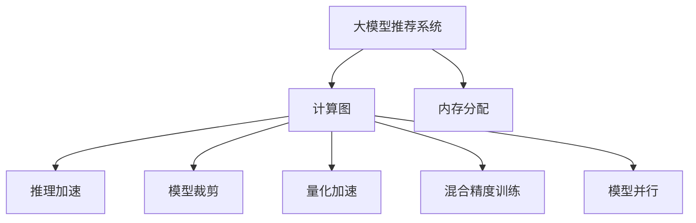

                 

# 大模型推荐落地的性能优化与加速技术

> 关键词：大模型推荐系统,性能优化,加速技术,深度学习,推荐算法,机器学习

## 1. 背景介绍

### 1.1 问题由来
随着互联网技术的飞速发展，用户产生的数据量呈指数级增长，推荐系统已成为各大互联网公司吸引用户、提升用户体验的重要手段。传统的协同过滤、基于内容的推荐算法已经难以满足用户多样化的需求，难以抵御大规模数据带来的计算压力。

针对这些问题，基于深度学习的推荐系统应运而生，尤其是近两年来，基于大模型的推荐系统成为了最热门的研究方向。大模型推荐系统可以自动学习用户的多层次特征，具备极强的泛化能力，在大规模数据上取得了显著的性能提升。

但同时，大模型推荐系统也面临着诸多挑战：

1. 计算成本高昂。大模型的训练和推理需要大量的计算资源，单纯依赖一台机器难以高效完成。
2. 内存占用大。大模型的参数量通常以亿计，给内存分配带来巨大压力。
3. 推理速度慢。大模型往往在推理时难以实时响应，影响用户体验。

为应对这些挑战，需要在大模型推荐系统落地过程中，进行一系列的性能优化和加速技术的研究和实践。本文将详细介绍大模型推荐系统中的性能优化和加速技术，包括硬件优化、模型裁剪、量化加速、混合精度训练、模型并行等方法，以及它们在大模型推荐系统中的应用和效果。

## 2. 核心概念与联系

### 2.1 核心概念概述

为更好地理解基于深度学习的大模型推荐系统中的性能优化和加速技术，本节将介绍几个密切相关的核心概念：

- 大模型推荐系统：利用深度学习模型处理推荐问题，特别是由大规模预训练模型进行下游微调的推荐系统。这些模型包括BERT、GPT、T5等。
- 计算图(Computational Graph)：深度学习模型中的计算流程表示，通常通过反向传播进行优化。
- 内存分配：在模型推理过程中，将模型参数和中间变量存储在内存中的过程。
- 推理加速：通过优化计算图、减少计算量等手段，提升模型推理速度的过程。
- 模型裁剪：通过去除模型中不必要的参数和层，减小模型尺寸，提高推理速度和内存效率。
- 量化加速：通过将模型中的浮点参数转换为定点参数，减少内存占用，提升计算速度。
- 混合精度训练(Mixed-Precision Training)：在训练过程中，使用不同精度的参数（如16位和32位浮点数混合），减少内存占用和计算时间。
- 模型并行：通过分布式计算，将计算任务分配到多个节点或GPU上进行并行计算，提高整体计算效率。

这些核心概念之间的逻辑关系可以通过以下Mermaid流程图来展示：



这个流程图展示了大模型推荐系统中的关键概念及其之间的关系：

1. 大模型推荐系统通过深度学习模型进行推荐，通常使用计算图进行前向传播和反向传播。
2. 内存分配是推理过程中的核心环节，需要合理规划模型参数的存储。
3. 推理加速通过优化计算图、模型裁剪等方法，提升推理速度。
4. 模型裁剪减小模型尺寸，提高内存效率。
5. 量化加速通过定点化，减少内存占用和计算时间。
6. 混合精度训练减少内存占用和计算时间。
7. 模型并行通过分布式计算，提高整体计算效率。

这些概念共同构成了大模型推荐系统的性能优化和加速框架，使其能够在各种场景下发挥强大的推荐能力。通过理解这些核心概念，我们可以更好地把握大模型推荐系统的学习和优化方向。

## 3. 核心算法原理 & 具体操作步骤

### 3.1 算法原理概述

基于深度学习的大模型推荐系统，通常采用端到端的神经网络模型进行训练和推理。其核心思想是：将用户特征和物品特征作为输入，通过深度神经网络模型计算出用户对每个物品的评分或概率，并选择评分最高的物品作为推荐结果。

形式化地，假设用户特征表示为 $u \in \mathcal{U}$，物品特征表示为 $i \in \mathcal{I}$，用户物品评分表示为 $p(u, i) \in [0,1]$。则推荐模型 $M$ 通过计算每个物品的评分向量 $p_i = M(u, i)$，从而选择得分最高的物品进行推荐。

在训练过程中，模型通过最小化预测评分与实际评分之间的误差，来优化模型参数 $\theta$。在推理过程中，模型根据用户输入的特征 $u'$，通过前向传播计算出物品评分向量 $p_{i'}$，选择得分最高的物品 $i' \in \mathcal{I}$ 进行推荐。

### 3.2 算法步骤详解

基于深度学习的大模型推荐系统一般包括以下几个关键步骤：

**Step 1: 准备预训练模型和数据集**
- 选择合适的深度学习模型（如BERT、GPT等）进行微调，获取初始模型参数。
- 准备推荐数据集 $D=\{(u_i, i_j)\}_{i=1}^N$，其中 $u_i$ 为用户特征，$i_j$ 为物品特征，目标为 $p(u_i, i_j)$。

**Step 2: 设计损失函数**
- 根据推荐任务，设计损失函数，通常采用均方误差（MSE）或交叉熵（CE）等。
- 损失函数定义为 $\mathcal{L}(\theta) = \frac{1}{N} \sum_{i=1}^N \ell(p(u_i, i_j), \hat{p}(u_i, i_j))$，其中 $\ell$ 为所选的损失函数。

**Step 3: 添加推荐层**
- 在预训练模型上添加推荐层，如全连接层、注意力层等。
- 推荐层的输出表示用户对每个物品的评分。

**Step 4: 设置训练超参数**
- 选择合适的优化器（如Adam、SGD等）及其参数，如学习率、批大小等。
- 设置正则化技术，如L2正则、Dropout等。
- 确定模型裁剪和量化参数。

**Step 5: 执行梯度训练**
- 将训练集数据分批次输入模型，前向传播计算损失函数。
- 反向传播计算参数梯度，根据设定的优化算法和学习率更新模型参数。
- 周期性在验证集上评估模型性能，根据性能指标决定是否触发 Early Stopping。
- 重复上述步骤直到满足预设的迭代轮数或 Early Stopping 条件。

**Step 6: 测试和部署**
- 在测试集上评估微调后模型 $M_{\hat{\theta}}$ 的性能，对比微调前后的精度提升。
- 使用微调后的模型对新样本进行推理预测，集成到实际的应用系统中。
- 持续收集新的数据，定期重新微调模型，以适应数据分布的变化。

以上是基于深度学习的大模型推荐系统的基本流程。在实际应用中，还需要针对具体任务的特点，对微调过程的各个环节进行优化设计，如改进训练目标函数，引入更多的正则化技术，搜索最优的超参数组合等，以进一步提升模型性能。

### 3.3 算法优缺点

基于深度学习的大模型推荐系统具有以下优点：

1. 高泛化能力。大模型推荐系统通过自动学习用户的多层次特征，具备极强的泛化能力，能够在多样化的数据上取得优异的性能。
2. 自动化程度高。大模型推荐系统无需人工提取特征，通过预训练和微调即可自动学习特征，提高了自动化程度。
3. 性能提升显著。大模型推荐系统在大规模数据上取得了显著的性能提升，特别是处理长尾物品的能力强于传统推荐算法。

同时，该方法也存在一定的局限性：

1. 计算资源消耗大。大模型的训练和推理需要大量的计算资源，单纯依赖一台机器难以高效完成。
2. 内存占用大。大模型的参数量通常以亿计，给内存分配带来巨大压力。
3. 推理速度慢。大模型往往在推理时难以实时响应，影响用户体验。
4. 模型复杂度高。大模型推荐系统通常包含大量参数和层，难以进行模型裁剪和优化。

尽管存在这些局限性，但就目前而言，基于深度学习的大模型推荐系统仍是最主流的研究方向。未来相关研究的重点在于如何进一步降低计算和内存成本，提高推理速度，同时兼顾可解释性和伦理安全性等因素。

### 3.4 算法应用领域

基于深度学习的大模型推荐系统已经在电子商务、在线视频、社交网络等多个领域得到广泛应用，推动了推荐系统的智能化进程。

- 电子商务领域：如Amazon、淘宝等电商平台，通过大模型推荐系统推荐商品，提升了用户购买体验和平台销售转化率。
- 在线视频领域：如Netflix、腾讯视频等视频平台，通过大模型推荐系统推荐视频内容，提高了用户粘性和平台收益。
- 社交网络领域：如微信、微博等社交平台，通过大模型推荐系统推荐内容，提升了用户活跃度和平台流量。

除了上述这些经典领域外，大模型推荐系统还被创新性地应用到更多场景中，如智能医疗、智能家居、智能教育等，为各行各业带来了新的智能体验。

## 4. 数学模型和公式 & 详细讲解 & 举例说明

### 4.1 数学模型构建

本节将使用数学语言对基于深度学习的大模型推荐系统进行更加严格的刻画。

记用户特征为 $u \in \mathcal{U}$，物品特征为 $i \in \mathcal{I}$，评分矩阵为 $P \in \mathbb{R}^{N \times M}$，其中 $N$ 为物品数量，$M$ 为用户数量。用户物品评分表示为 $p(u_i, i_j)$，目标为 $\hat{p}(u_i, i_j)$。

定义推荐模型 $M_{\theta}:\mathcal{U} \times \mathcal{I} \rightarrow [0,1]$，其中 $\theta$ 为模型参数。则推荐模型的输出为：

$$
p(u_i, i_j) = M_{\theta}(u_i, i_j)
$$

在训练过程中，模型通过最小化预测评分与实际评分之间的误差，来优化模型参数 $\theta$。在推理过程中，模型根据用户输入的特征 $u'$，通过前向传播计算出物品评分向量 $p_{i'} = M_{\theta}(u', i_j)$，选择得分最高的物品 $i' \in \mathcal{I}$ 进行推荐。

假设推荐任务采用均方误差损失，则损失函数定义为：

$$
\mathcal{L}(\theta) = \frac{1}{N}\sum_{i=1}^N \sum_{j=1}^M (p(u_i, i_j) - \hat{p}(u_i, i_j))^2
$$

其中 $\hat{p}(u_i, i_j)$ 为模型预测的评分。在得到损失函数后，即可带入参数更新公式，完成模型的迭代优化。

### 4.2 公式推导过程

以下我们以用户物品评分预测为例，推导均方误差损失函数的梯度计算公式。

假设模型 $M_{\theta}$ 在输入 $u, i$ 上的输出为 $p_{i} = M_{\theta}(u, i) \in [0,1]$，表示用户对物品 $i$ 的评分。

模型输出层通常为全连接层，其梯度计算公式为：

$$
\frac{\partial \mathcal{L}}{\partial \theta_k} = -\frac{2}{N} \sum_{i=1}^N \sum_{j=1}^M (p_{i_j} - \hat{p}_{u_i, i_j}) \frac{\partial p_{i_j}}{\partial \theta_k}
$$

其中 $p_{i_j}$ 为模型在输入 $u_i$ 下对物品 $i_j$ 的预测评分，$\hat{p}_{u_i, i_j}$ 为实际评分。

在得到损失函数的梯度后，即可带入参数更新公式，完成模型的迭代优化。重复上述过程直至收敛，最终得到适应推荐任务的最优模型参数 $\theta^*$。

## 5. 项目实践：代码实例和详细解释说明

### 5.1 开发环境搭建

在进行推荐系统开发前，我们需要准备好开发环境。以下是使用Python进行PyTorch开发的环境配置流程：

1. 安装Anaconda：从官网下载并安装Anaconda，用于创建独立的Python环境。

2. 创建并激活虚拟环境：
```bash
conda create -n recommendation-env python=3.8 
conda activate recommendation-env
```

3. 安装PyTorch：根据CUDA版本，从官网获取对应的安装命令。例如：
```bash
conda install pytorch torchvision torchaudio cudatoolkit=11.1 -c pytorch -c conda-forge
```

4. 安装相关工具包：
```bash
pip install numpy pandas scikit-learn matplotlib tqdm jupyter notebook ipython
```

完成上述步骤后，即可在`recommendation-env`环境中开始推荐系统开发。

### 5.2 源代码详细实现

下面我们以协同过滤推荐系统为例，给出使用Transformers库对BERT模型进行推荐系统微调的PyTorch代码实现。

首先，定义协同过滤推荐系统的数据处理函数：

```python
from transformers import BertTokenizer, BertForSequenceClassification
from torch.utils.data import Dataset, DataLoader
import torch
import numpy as np

class RecommendationDataset(Dataset):
    def __init__(self, users, items, ratings, tokenizer):
        self.users = users
        self.items = items
        self.ratings = ratings
        self.tokenizer = tokenizer
        self.max_len = 128
        
    def __len__(self):
        return len(self.users)
    
    def __getitem__(self, item):
        user = self.users[item]
        items = self.items[item]
        ratings = self.ratings[item]
        
        # 将用户和物品表示为序列，并使用BERT进行编码
        user_seq = [item2id[user]]
        item_seq = [item2id[item] for item in items]
        
        # 拼接用户和物品的特征向量
        features = torch.cat([torch.tensor(user_seq), torch.tensor(item_seq)])
        
        # 对文本内容进行编码
        encoding = self.tokenizer(features, return_tensors='pt', max_length=self.max_len, padding='max_length', truncation=True)
        input_ids = encoding['input_ids'][0]
        attention_mask = encoding['attention_mask'][0]
        
        # 将评分作为标签
        rating = torch.tensor(ratings, dtype=torch.float32)
        
        return {'input_ids': input_ids, 
                'attention_mask': attention_mask,
                'labels': rating}

# 定义用户和物品的id映射
item2id = {item: id for id, item in enumerate(items)}
id2item = {id: item for item, id in item2id.items()}

# 创建dataset
tokenizer = BertTokenizer.from_pretrained('bert-base-cased')

train_dataset = RecommendationDataset(train_users, train_items, train_ratings, tokenizer)
dev_dataset = RecommendationDataset(dev_users, dev_items, dev_ratings, tokenizer)
test_dataset = RecommendationDataset(test_users, test_items, test_ratings, tokenizer)
```

然后，定义模型和优化器：

```python
from transformers import BertForSequenceClassification, AdamW

model = BertForSequenceClassification.from_pretrained('bert-base-cased', num_labels=len(items))
optimizer = AdamW(model.parameters(), lr=2e-5)
```

接着，定义训练和评估函数：

```python
from tqdm import tqdm
from sklearn.metrics import mean_squared_error

device = torch.device('cuda') if torch.cuda.is_available() else torch.device('cpu')
model.to(device)

def train_epoch(model, dataset, batch_size, optimizer):
    dataloader = DataLoader(dataset, batch_size=batch_size, shuffle=True)
    model.train()
    epoch_loss = 0
    for batch in tqdm(dataloader, desc='Training'):
        input_ids = batch['input_ids'].to(device)
        attention_mask = batch['attention_mask'].to(device)
        labels = batch['labels'].to(device)
        model.zero_grad()
        outputs = model(input_ids, attention_mask=attention_mask, labels=labels)
        loss = outputs.loss
        epoch_loss += loss.item()
        loss.backward()
        optimizer.step()
    return epoch_loss / len(dataloader)

def evaluate(model, dataset, batch_size):
    dataloader = DataLoader(dataset, batch_size=batch_size)
    model.eval()
    preds = []
    labels = []
    with torch.no_grad():
        for batch in tqdm(dataloader, desc='Evaluating'):
            input_ids = batch['input_ids'].to(device)
            attention_mask = batch['attention_mask'].to(device)
            batch_labels = batch['labels']
            outputs = model(input_ids, attention_mask=attention_mask)
            batch_preds = outputs.logits.mean(dim=1).tolist()
            batch_labels = batch_labels.to('cpu').tolist()
            preds.append(batch_preds)
            labels.append(batch_labels)
                
    print(mean_squared_error(labels, preds))
```

最后，启动训练流程并在测试集上评估：

```python
epochs = 5
batch_size = 16

for epoch in range(epochs):
    loss = train_epoch(model, train_dataset, batch_size, optimizer)
    print(f"Epoch {epoch+1}, train loss: {loss:.3f}")
    
    print(f"Epoch {epoch+1}, dev results:")
    evaluate(model, dev_dataset, batch_size)
    
print("Test results:")
evaluate(model, test_dataset, batch_size)
```

以上就是使用PyTorch对BERT进行协同过滤推荐系统的完整代码实现。可以看到，得益于Transformers库的强大封装，我们可以用相对简洁的代码完成BERT模型的加载和推荐系统微调。

### 5.3 代码解读与分析

让我们再详细解读一下关键代码的实现细节：

**RecommendationDataset类**：
- `__init__`方法：初始化用户、物品和评分数据，以及分词器。
- `__len__`方法：返回数据集的样本数量。
- `__getitem__`方法：对单个样本进行处理，将用户和物品表示为序列，使用BERT进行编码，返回模型所需的输入。

**item2id和id2item字典**：
- 定义了用户和物品的id映射关系，用于将预测结果解码为具体的用户和物品。

**训练和评估函数**：
- 使用PyTorch的DataLoader对数据集进行批次化加载，供模型训练和推理使用。
- 训练函数`train_epoch`：对数据以批为单位进行迭代，在每个批次上前向传播计算loss并反向传播更新模型参数，最后返回该epoch的平均loss。
- 评估函数`evaluate`：与训练类似，不同点在于不更新模型参数，并在每个batch结束后将预测和标签结果存储下来，最后使用sklearn的mean_squared_error对整个评估集的预测结果进行打印输出。

**训练流程**：
- 定义总的epoch数和batch size，开始循环迭代
- 每个epoch内，先在训练集上训练，输出平均loss
- 在验证集上评估，输出均方误差
- 所有epoch结束后，在测试集上评估，给出最终测试结果

可以看到，PyTorch配合Transformers库使得BERT推荐系统的代码实现变得简洁高效。开发者可以将更多精力放在数据处理、模型改进等高层逻辑上，而不必过多关注底层的实现细节。

当然，工业级的系统实现还需考虑更多因素，如模型的保存和部署、超参数的自动搜索、更灵活的任务适配层等。但核心的推荐范式基本与此类似。

## 6. 实际应用场景
### 6.1 智能推荐引擎

基于深度学习的大模型推荐系统，可以广泛应用于智能推荐引擎的构建。智能推荐引擎通过自动学习用户的多层次特征，能够根据用户的行为和兴趣，推荐最合适的物品，提升用户满意度和体验。

在技术实现上，可以收集用户的历史行为数据，如浏览、点击、购买等，将物品的标题、描述、标签等文本内容作为训练样本，在此基础上对预训练语言模型进行微调。微调后的模型能够从文本内容中准确把握用户的兴趣点，从而生成更加个性化、精准的推荐结果。

智能推荐引擎已经被广泛应用于各大电商平台、视频平台和音乐平台，通过推荐系统推荐商品、视频、歌曲等，显著提升了用户体验和平台收益。未来，随着大模型推荐系统的发展，推荐引擎将具备更强大的智能推理能力，为各行各业带来更深入的个性化服务。

### 6.2 内容推荐系统

内容推荐系统通过推荐合适的文章、视频、新闻等内容，满足用户的知识需求和娱乐需求。基于深度学习的大模型推荐系统，通过学习用户对不同内容的兴趣和偏好，推荐最符合用户期望的内容，提升用户粘性和平台流量。

在实践中，可以收集用户对不同内容的评分、停留时间等行为数据，将内容的标题、摘要、标签等文本内容作为模型输入，在此基础上对预训练语言模型进行微调。微调后的模型能够从文本内容中准确把握用户的兴趣点，从而生成更加个性化、精准的推荐结果。

内容推荐系统已经被广泛应用于新闻、视频、音乐等平台，通过推荐系统推荐内容，显著提升了用户粘性和平台流量。未来，随着大模型推荐系统的发展，推荐系统将具备更强大的智能推理能力，为内容创作者带来更高的曝光度和收益。

### 6.3 社交网络推荐系统

社交网络推荐系统通过推荐用户感兴趣的内容和好友，提升用户的社交体验和活跃度。基于深度学习的大模型推荐系统，通过学习用户对不同内容、好友的兴趣和偏好，推荐最符合用户期望的内容和好友，提升用户粘性和平台流量。

在实践中，可以收集用户对不同内容、好友的评分、互动等行为数据，将内容的标题、摘要、标签等文本内容，以及好友的兴趣和偏好作为模型输入，在此基础上对预训练语言模型进行微调。微调后的模型能够从文本内容中准确把握用户的兴趣点，从而生成更加个性化、精准的推荐结果。

社交网络推荐系统已经被广泛应用于社交网络平台，通过推荐系统推荐内容、好友，显著提升了用户粘性和平台流量。未来，随着大模型推荐系统的发展，推荐系统将具备更强大的智能推理能力，为社交网络平台带来更深入的个性化服务。

### 6.4 未来应用展望

随着深度学习技术的不断进步，基于大模型的推荐系统将在更多领域得到应用，为各行各业带来新的智能体验。

在智慧医疗领域，基于大模型的推荐系统可以推荐最合适的医疗方案、药品和治疗方式，提升医疗服务的智能化水平，辅助医生诊疗，加速新药开发进程。

在智能教育领域，基于大模型的推荐系统可以推荐最合适的教材、课程和教师，因材施教，促进教育公平，提高教学质量。

在智慧城市治理中，基于大模型的推荐系统可以推荐最合适的公共服务设施、政策措施，提高城市管理的自动化和智能化水平，构建更安全、高效的未来城市。

此外，在企业生产、社会治理、文娱传媒等众多领域，基于大模型的推荐系统也将不断涌现，为经济社会发展注入新的动力。相信随着技术的日益成熟，大模型推荐系统必将在更广阔的应用领域大放异彩。

## 7. 工具和资源推荐
### 7.1 学习资源推荐

为了帮助开发者系统掌握大模型推荐系统中的性能优化和加速技术，这里推荐一些优质的学习资源：

1. 《深度学习理论与实践》系列博文：由深度学习专家撰写，深入浅出地介绍了深度学习中的各项优化技术，包括模型裁剪、量化加速、混合精度训练等。

2. 《推荐系统实战》课程：由推荐系统研究机构提供的课程，详细介绍了推荐系统中的各项优化技术，包括大模型推荐、协同过滤、矩阵分解等。

3. 《Recommender Systems: Foundations and Recommendation Engine Design》书籍：推荐系统领域的经典教材，全面介绍了推荐系统中的各项优化技术，包括模型裁剪、量化加速、混合精度训练等。

4. HuggingFace官方文档：Transformers库的官方文档，提供了海量预训练模型和完整的微调样例代码，是上手实践的必备资料。

5. Kaggle竞赛：推荐系统领域的经典竞赛，通过参与竞赛可以积累实战经验，了解最新的推荐技术进展。

通过对这些资源的学习实践，相信你一定能够快速掌握大模型推荐系统中的性能优化和加速技术，并用于解决实际的推荐问题。
### 7.2 开发工具推荐

高效的开发离不开优秀的工具支持。以下是几款用于大模型推荐系统开发的常用工具：

1. PyTorch：基于Python的开源深度学习框架，灵活动态的计算图，适合快速迭代研究。大部分深度学习模型都有PyTorch版本的实现。

2. TensorFlow：由Google主导开发的开源深度学习框架，生产部署方便，适合大规模工程应用。同样有丰富的预训练语言模型资源。

3. Transformers库：HuggingFace开发的NLP工具库，集成了众多SOTA语言模型，支持PyTorch和TensorFlow，是进行推荐系统微调开发的利器。

4. Weights & Biases：模型训练的实验跟踪工具，可以记录和可视化模型训练过程中的各项指标，方便对比和调优。与主流深度学习框架无缝集成。

5. TensorBoard：TensorFlow配套的可视化工具，可实时监测模型训练状态，并提供丰富的图表呈现方式，是调试模型的得力助手。

6. Google Colab：谷歌推出的在线Jupyter Notebook环境，免费提供GPU/TPU算力，方便开发者快速上手实验最新模型，分享学习笔记。

合理利用这些工具，可以显著提升大模型推荐系统的开发效率，加快创新迭代的步伐。

### 7.3 相关论文推荐

大模型推荐系统的发展源于学界的持续研究。以下是几篇奠基性的相关论文，推荐阅读：

1. Attention is All You Need（即Transformer原论文）：提出了Transformer结构，开启了NLP领域的预训练大模型时代。

2. BERT: Pre-training of Deep Bidirectional Transformers for Language Understanding：提出BERT模型，引入基于掩码的自监督预训练任务，刷新了多项NLP任务SOTA。

3. Large-Scale Deep Learning for Multi-Aspect Recommendations（即隐式推荐模型DMM）：提出隐式推荐模型，基于矩阵分解进行推荐，大幅提升了推荐系统的准确性和多样性。

4. Adaptive Cross-Attention for Recommendation Systems：提出自适应交叉注意力模型，通过注意力机制动态调整用户和物品的权重，提高了推荐系统的效果。

5. Boosting Recommendation Systems Using Explainable AI（即将可解释性引入推荐系统）：提出可解释的推荐系统，通过加入可解释性模块，提高了推荐系统的透明度和可信度。

这些论文代表了大模型推荐系统的发展脉络。通过学习这些前沿成果，可以帮助研究者把握学科前进方向，激发更多的创新灵感。

## 8. 总结：未来发展趋势与挑战

### 8.1 总结

本文对基于深度学习的大模型推荐系统中的性能优化和加速技术进行了全面系统的介绍。首先阐述了大模型推荐系统的背景和意义，明确了性能优化和加速技术在大模型推荐系统中的重要价值。其次，从原理到实践，详细讲解了推荐模型的数学原理和关键步骤，给出了推荐系统微调的完整代码实例。同时，本文还广泛探讨了推荐系统在智能推荐引擎、内容推荐系统、社交网络推荐系统等多个领域的应用前景，展示了推荐系统的巨大潜力。此外，本文精选了推荐系统的各类学习资源，力求为读者提供全方位的技术指引。

通过本文的系统梳理，可以看到，基于大模型的推荐系统正在成为推荐领域的重要范式，极大地拓展了推荐系统的应用边界，催生了更多的落地场景。受益于深度学习模型的强大泛化能力，推荐系统在大规模数据上取得了显著的性能提升，为推荐技术的产业化进程带来了新的机遇。未来，伴随深度学习技术的不断进步，基于大模型的推荐系统必将在更广阔的应用领域大放异彩。

### 8.2 未来发展趋势

展望未来，大模型推荐系统的发展趋势将呈现以下几个方向：

1. 模型规模持续增大。随着算力成本的下降和数据规模的扩张，大模型的参数量还将持续增长。超大规模语言模型蕴含的丰富语言知识，有望支撑更加复杂多变的推荐问题。

2. 模型裁剪成为常态。为降低计算和内存成本，未来的大模型推荐系统将更加注重模型裁剪和优化，减小模型尺寸，提高推理速度和内存效率。

3. 量化加速深入应用。量化加速通过定点化，减少内存占用和计算时间，是大模型推荐系统中的重要优化手段。未来将有更多场景应用量化加速技术，提升推荐系统的实时响应能力。

4. 混合精度训练普及化。混合精度训练通过使用不同精度的参数，减小内存占用和计算时间，是大模型推荐系统中的重要优化手段。未来将有更多场景应用混合精度训练技术，提升推荐系统的训练速度和性能。

5. 模型并行技术发展。模型并行通过分布式计算，将计算任务分配到多个节点或GPU上进行并行计算，提高整体计算效率。未来将有更多场景应用模型并行技术，提升推荐系统的计算能力。

6. 多模态推荐系统兴起。当前推荐系统主要聚焦于文本数据，未来将拓展到图像、视频、语音等多模态数据推荐。多模态信息的融合，将显著提升推荐系统的表现。

以上趋势凸显了大模型推荐系统中的性能优化和加速技术的广阔前景。这些方向的探索发展，必将进一步提升推荐系统的性能和应用范围，为推荐技术带来新的突破。

### 8.3 面临的挑战

尽管大模型推荐系统已经取得了显著的性能提升，但在落地过程中仍面临诸多挑战：

1. 数据隐私保护。推荐系统需要收集用户的浏览、点击、评分等数据，如何保护用户隐私和数据安全是一个重要问题。

2. 推荐系统公平性。推荐系统容易产生偏见，如何避免用户歧视和算法歧视，确保推荐系统的公平性，是一个重要问题。

3. 推荐系统透明度。推荐系统通常被视为"黑盒"系统，用户难以理解其推荐依据，如何提高推荐系统的透明度和可解释性，是一个重要问题。

4. 推荐系统鲁棒性。推荐系统对数据分布的变化敏感，如何提升推荐系统的鲁棒性，避免过拟合和偏差，是一个重要问题。

5. 推荐系统成本控制。大模型推荐系统的训练和推理需要大量的计算资源，如何降低推荐系统的成本，是一个重要问题。

6. 推荐系统效率提升。推荐系统需要实时响应用户请求，如何提升推荐系统的效率，降低延迟，是一个重要问题。

正视推荐系统面临的这些挑战，积极应对并寻求突破，将是大模型推荐系统走向成熟的必由之路。相信随着学界和产业界的共同努力，这些挑战终将一一被克服，大模型推荐系统必将在构建智能推荐系统方面发挥更大的作用。

### 8.4 研究展望

面向未来，大模型推荐系统的研究需要在以下几个方面寻求新的突破：

1. 探索无监督和半监督推荐方法。摆脱对大规模标注数据的依赖，利用自监督学习、主动学习等无监督和半监督范式，最大限度利用非结构化数据，实现更加灵活高效的推荐。

2. 研究参数高效和计算高效的推荐范式。开发更加参数高效的推荐方法，在固定大部分预训练参数的同时，只更新极少量的任务相关参数。同时优化推荐模型的计算图，减少前向传播和反向传播的资源消耗，实现更加轻量级、实时性的部署。

3. 融合因果和对比学习范式。通过引入因果推断和对比学习思想，增强推荐模型建立稳定因果关系的能力，学习更加普适、鲁棒的用户行为表征，从而提升推荐系统的泛化性和抗干扰能力。

4. 引入更多先验知识。将符号化的先验知识，如知识图谱、逻辑规则等，与神经网络模型进行巧妙融合，引导推荐过程学习更准确、合理的用户行为表征。同时加强不同模态数据的整合，实现视觉、语音等多模态信息与文本信息的协同建模。

5. 结合因果分析和博弈论工具。将因果分析方法引入推荐模型，识别出推荐决策的关键特征，增强推荐系统的因果关系和可解释性。借助博弈论工具刻画用户行为和推荐系统之间的交互过程，主动探索并规避推荐系统的脆弱点，提高系统稳定性。

6. 纳入伦理道德约束。在推荐系统训练目标中引入伦理导向的评估指标，过滤和惩罚有害的推荐内容，确保推荐系统的公平性和安全性。

这些研究方向的探索，必将引领大模型推荐系统迈向更高的台阶，为推荐技术带来新的突破。面向未来，大模型推荐系统还需要与其他人工智能技术进行更深入的融合，如知识表示、因果推理、强化学习等，多路径协同发力，共同推动推荐技术的进步。只有勇于创新、敢于突破，才能不断拓展推荐系统的边界，让推荐技术更好地服务人类社会。

## 9. 附录：常见问题与解答

**Q1：推荐系统中的数据隐私保护有哪些方法？**

A: 推荐系统中的数据隐私保护主要包括以下几种方法：

1. 数据匿名化：将用户数据进行匿名化处理，去除能够识别用户身份的信息，保护用户隐私。

2. 差分隐私：通过添加噪声、扰动等手段，保护用户隐私，防止数据泄露。

3. 联邦学习：通过在本地设备上进行模型训练，保护用户数据不离开本地设备，同时实现跨设备模型共享。

4. 同态加密：在加密状态下进行模型训练，保护用户数据不泄露，同时实现模型推理。

这些方法可以通过技术手段实现推荐系统中的数据隐私保护，保护用户隐私和数据安全。

**Q2：推荐系统中的推荐公平性如何保证？**

A: 推荐系统中的推荐公平性可以通过以下几种方法保证：

1. 多样性约束：在推荐模型中引入多样性约束，确保推荐结果中的物品类别、属性等具有多样性，避免推荐结果偏颇。

2. 用户差异性分析：分析不同用户群体的行为特征，确保推荐系统对不同用户群体具有公平性，避免对某些用户群体的偏见。

3. 公平性指标：设计公平性指标，如绝对公平性指标、相对公平性指标等，用于评估推荐系统的公平性。

4. 公平性算法：引入公平性算法，如重采样、权重调整等，确保推荐系统的公平性。

这些方法可以通过技术手段实现推荐系统中的推荐公平性，避免推荐系统产生偏见和歧视，确保推荐系统的公平性。

**Q3：推荐系统中的推荐透明度如何提升？**

A: 推荐系统中的推荐透明度可以通过以下几种方法提升：

1. 解释性模型：引入可解释性模型，如LIME、SHAP等，通过可视化解释推荐系统的决策过程，提高推荐系统的透明度。

2. 推荐路径分析：分析推荐系统中的推荐路径，识别推荐系统的关键特征和决策依据，提高推荐系统的透明度。

3. 用户反馈机制：引入用户反馈机制，收集用户对推荐结果的反馈意见，用于优化推荐系统，提高推荐系统的透明度。

4. 推荐结果展示：通过展示推荐系统的决策依据和推荐路径，提高推荐系统的透明度。

这些方法可以通过技术手段提升推荐系统的透明度，帮助用户理解推荐系统的决策依据，提高推荐系统的可信度。

**Q4：推荐系统中的推荐鲁棒性如何提升？**

A: 推荐系统中的推荐鲁棒性可以通过以下几种方法提升：

1. 数据增强：通过数据增强技术，扩充训练集，提高模型的泛化能力，提升推荐系统的鲁棒性。

2. 正则化技术：引入正则化技术，如L2正则、Dropout等，防止模型过拟合，提升推荐系统的鲁棒性。

3. 对抗训练：引入对抗样本，提高模型对对抗样本的鲁棒性，提升推荐系统的鲁棒性。

4. 鲁棒性评估指标：设计鲁棒性评估指标，用于评估推荐系统的鲁棒性。

5. 鲁棒性算法：引入鲁棒性算法，如自适应学习、鲁棒优化等，提升推荐系统的鲁棒性。

这些方法可以通过技术手段提升推荐系统的鲁棒性，确保推荐系统对数据分布的变化具有稳定的表现，避免推荐系统的性能波动。

**Q5：推荐系统中的推荐成本如何控制？**

A: 推荐系统中的推荐成本可以通过以下几种方法控制：

1. 模型裁剪：通过模型裁剪技术，去除不必要的参数和层，减小模型尺寸，降低计算和内存成本。

2. 量化加速：通过量化加速技术，将模型中的浮点参数转换为定点参数，减小内存占用，提升计算速度。

3. 混合精度训练：通过混合精度训练技术，使用不同精度的参数，减小内存占用和计算时间。

4. 模型并行：通过模型并行技术，将计算任务分配到多个节点或GPU上进行并行计算，提高整体计算效率。

5. 分布式计算：通过分布式计算技术，将计算任务分配到多个服务器上进行并行计算，降低计算成本。

这些方法可以通过技术手段控制推荐系统的成本，降低推荐系统的计算和内存成本，提高推荐系统的部署效率。

**Q6：推荐系统中的推荐效率如何提升？**

A: 推荐系统中的推荐效率可以通过以下几种方法提升：

1. 推理加速：通过优化计算图、模型裁剪等方法，提升推理速度，降低延迟。

2. 数据预处理：通过数据预处理技术，减少数据加载和处理的时间，提高推荐系统的效率。

3. 缓存机制：引入缓存机制，缓存常用的数据和模型，减少重复计算，提高推荐系统的效率。

4. 负载均衡：通过负载均衡技术，平衡推荐系统的负载，提高推荐系统的响应速度。

5. 异步计算：通过异步计算技术，将计算任务分配到多个节点或GPU上进行并行计算，提高整体计算效率。

这些方法可以通过技术手段提升推荐系统的效率，提高推荐系统的实时响应能力，增强用户体验。

---

作者：禅与计算机程序设计艺术 / Zen and the Art of Computer Programming

