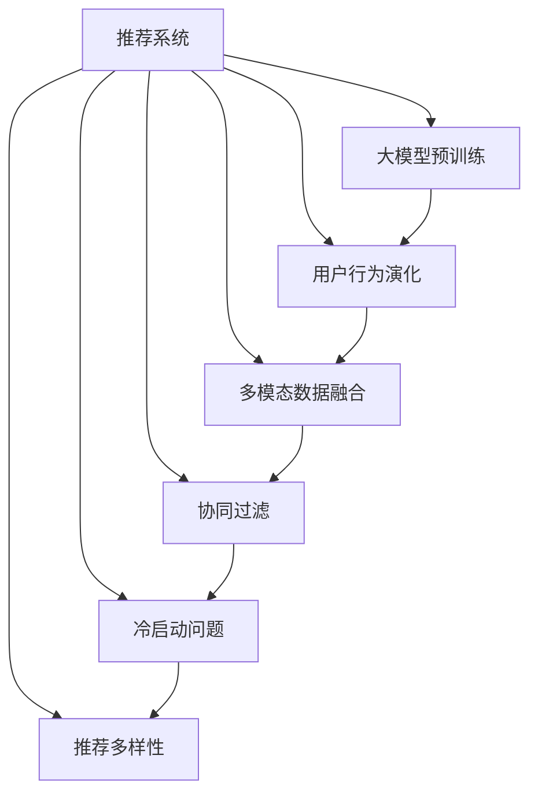

                 

# 大模型视角下推荐系统的用户行为演化机制解释

## 1. 背景介绍

随着互联网技术的迅猛发展和信息爆炸，推荐系统（Recommendation System, RS）已成为众多线上服务不可或缺的重要组成部分。通过深入分析用户行为，推荐系统能够高效匹配用户兴趣和内容需求，提升用户体验和平台收益。

### 1.1 问题由来

在推荐系统的演进中，用户行为数据不断丰富，从简单的点击、浏览行为，到复杂的交互日志和上下文特征，数据种类和维度不断增多。如何有效地利用海量用户行为数据，提升推荐系统的准确性和个性化程度，成为了当下推荐系统研究的难点和热点。

### 1.2 问题核心关键点

- **用户行为数据复杂度**：从简单的点击记录到复杂的交互日志和上下文特征，数据复杂度不断提高。
- **数据稀疏性**：用户行为数据往往存在显著的稀疏性，传统的协同过滤算法难以处理。
- **实时性要求**：推荐系统需快速响应用户行为变化，实时更新推荐结果。
- **多模态数据融合**：如何融合不同模态的用户行为数据，提升推荐系统性能。
- **冷启动问题**：新用户缺乏行为数据，推荐算法难以预测其兴趣。
- **推荐多样性**：如何平衡推荐结果的多样性和准确性，避免信息茧房。

这些问题需要通过先进的大模型技术和算法优化，才能得以有效解决。

### 1.3 问题研究意义

研究用户行为演化机制和大模型视角下的推荐系统，具有重要的理论和实践意义：

- **提高推荐准确性**：通过大模型更好地理解和提取用户行为特征，提升推荐精度。
- **提升个性化推荐**：利用大模型学习用户兴趣演化规律，进行更个性化的推荐。
- **解决冷启动问题**：借助大模型预训练的多模态知识，克服新用户的冷启动障碍。
- **提升推荐多样性**：大模型可以更好地处理推荐多样性的问题，避免信息茧房。
- **实现实时推荐**：大模型可在线实时更新模型参数，满足实时性需求。
- **优化推荐系统性能**：通过理论分析和实际优化，提升推荐系统整体的性能和用户体验。

## 2. 核心概念与联系

### 2.1 核心概念概述

为了深入理解大模型视角下的推荐系统，首先需要明确一些核心概念：

- **推荐系统**：利用用户行为数据进行推荐，提升用户体验和平台收益的系统。
- **大模型**：如GPT-3、BERT等，通过大规模无监督学习获得丰富的语言知识和常识。
- **用户行为演化**：用户在长期使用过程中的行为模式变化，如兴趣偏好、消费习惯等。
- **多模态数据融合**：融合不同类型的数据（如文本、图像、行为数据）进行更全面的用户画像建模。
- **协同过滤**：通过用户和物品间的关系进行推荐，包括基于用户的协同过滤和基于物品的协同过滤。
- **冷启动问题**：新用户缺乏行为数据，难以预测其兴趣和行为。
- **推荐多样性**：推荐结果需要多样化，避免单一推荐导致的用户流失。
- **大模型预训练**：在无标签数据上进行预训练，学习广泛的知识和表征。
- **微调（Fine-Tuning）**：在特定任务上对大模型进行微调，以适应新的数据和需求。

这些概念之间通过以下Mermaid流程图表示：



### 2.2 核心概念原理和架构的 Mermaid 流程图


**流程说明**：
1. **用户数据收集**：收集用户的基本信息、历史行为数据等。
2. **预训练大模型**：利用无标签数据进行预训练，学习通用知识。
3. **用户画像建模**：通过大模型对用户行为数据进行建模，得到用户画像。
4. **推荐模型训练**：基于用户画像，训练推荐模型。
5. **推荐结果输出**：将推荐结果呈现给用户。
6. **用户行为反馈**：收集用户对推荐结果的反馈，用于优化模型。
7. **模型优化**：根据用户反馈，实时更新推荐模型。

## 3. 核心算法原理 & 具体操作步骤

### 3.1 算法原理概述

大模型视角下的推荐系统，主要利用大模型学习用户行为数据，并基于用户画像进行推荐。其核心算法包括大模型预训练、用户画像建模和推荐模型训练。

### 3.2 算法步骤详解

#### 3.2.1 大模型预训练

**步骤1**：收集大规模无标签文本数据，如维基百科、新闻、社交媒体等。

**步骤2**：利用自监督学习方法，如掩码语言模型（Masked Language Modeling, MLM）、下一句预测（Next Sentence Prediction, NSP）等，对大模型进行预训练。

**步骤3**：预训练完成后，大模型具备了强大的语言理解和生成能力，可以用于用户画像建模和推荐模型训练。

#### 3.2.2 用户画像建模

**步骤1**：收集用户的历史行为数据，如浏览记录、购买记录、搜索关键词等。

**步骤2**：将用户行为数据输入大模型，进行编码和表示学习。

**步骤3**：大模型通过学习用户行为数据，生成用户向量表示，即用户画像。

#### 3.2.3 推荐模型训练

**步骤1**：收集用户的推荐结果和反馈，构建监督数据集。

**步骤2**：在大模型生成的用户画像基础上，训练推荐模型。

**步骤3**：利用监督数据集训练推荐模型，优化推荐效果。

### 3.3 算法优缺点

#### 优点：

- **泛化能力更强**：大模型通过无监督学习获得广泛的知识，适用于多领域推荐。
- **自适应性强**：大模型可以自适应地处理不同用户的行为数据。
- **实时性高**：大模型可以进行在线实时更新，快速响应用户行为变化。

#### 缺点：

- **数据需求大**：预训练和推荐模型训练需要大规模数据。
- **计算资源消耗高**：大模型参数量大，训练和推理需要高性能设备。
- **模型复杂度高**：大模型结构复杂，不易理解和调试。

### 3.4 算法应用领域

大模型视角下的推荐系统广泛应用于以下领域：

- **电商推荐**：基于用户行为数据，推荐个性化商品。
- **内容推荐**：推荐文章、视频、音乐等内容。
- **个性化服务**：推荐系统与其他服务结合，提升整体服务质量。
- **广告推荐**：推荐相关广告，增加用户点击和转化率。
- **社交网络**：推荐系统帮助用户发现新朋友，拓展社交网络。

## 4. 数学模型和公式 & 详细讲解 & 举例说明

### 4.1 数学模型构建

大模型视角下的推荐系统，可以通过以下数学模型进行描述：

**输入**：用户画像向量 $U$，物品特征向量 $I$。

**输出**：推荐得分 $R$。

### 4.2 公式推导过程

**推荐公式**：

$$
R_{ui} = \text{dot product}(U, I) + \text{dot product}(U, B) + \text{dot product}(I, B)
$$

其中 $U$ 和 $I$ 分别表示用户和物品的特征向量，$B$ 表示共现矩阵。

**公式推导**：

$$
R_{ui} = U_i^T V_u \cdot I_u^T V_i + U_i^T B + I_u^T B
$$

其中 $V$ 表示线性变换矩阵，$B$ 表示偏置向量。

### 4.3 案例分析与讲解

假设有一个电商推荐系统，收集了用户浏览、购买和评分数据，利用大模型进行推荐。

**用户画像建模**：
- 收集用户行为数据，如浏览记录、购买记录、评分等。
- 将这些数据输入大模型，生成用户向量表示。

**物品特征建模**：
- 收集物品的详细信息，如商品名称、描述、价格等。
- 将物品信息编码并输入大模型，生成物品向量表示。

**推荐模型训练**：
- 收集用户的推荐结果和反馈，构建监督数据集。
- 在大模型生成的用户和物品向量表示基础上，训练推荐模型。
- 利用监督数据集优化推荐模型，提升推荐效果。

## 5. 项目实践：代码实例和详细解释说明

### 5.1 开发环境搭建

为了实践大模型视角下的推荐系统，需要以下开发环境：

1. **Python环境**：安装Python 3.x，推荐使用Anaconda或Miniconda。
2. **深度学习框架**：安装TensorFlow或PyTorch，用于大模型预训练和推荐模型训练。
3. **大模型库**：安装BigQuery、GPT-3等大模型库，用于预训练和特征提取。
4. **数据处理库**：安装Pandas、NumPy等数据处理库，用于数据清洗和预处理。
5. **可视化工具**：安装Matplotlib、Seaborn等可视化库，用于数据可视化和模型评估。

### 5.2 源代码详细实现

**用户画像建模代码**：

```python
from transformers import BertModel
import pandas as pd

# 加载预训练的BERT模型
model = BertModel.from_pretrained('bert-base-uncased')

# 加载用户行为数据
user_data = pd.read_csv('user_behavior.csv')

# 将用户行为数据输入BERT模型，生成用户向量表示
user_vector = model(user_data[['behavior1', 'behavior2', 'behavior3']])

# 保存用户向量
user_vector.save('user_vector.pth')
```

**推荐模型训练代码**：

```python
import torch
from torch import nn, optim
from torch.utils.data import DataLoader

# 加载用户向量和物品向量
user_vector = torch.load('user_vector.pth')
item_vector = torch.load('item_vector.pth')

# 定义推荐模型
class Recommender(nn.Module):
    def __init__(self):
        super(Recommender, self).__init__()
        self.user_embedding = nn.Embedding(user_vector.size(0), 128)
        self.item_embedding = nn.Embedding(item_vector.size(0), 128)
        self.lin1 = nn.Linear(128, 128)
        self.lin2 = nn.Linear(128, 1)

    def forward(self, user_id, item_id):
        user_embedding = self.user_embedding(user_id)
        item_embedding = self.item_embedding(item_id)
        user_item = user_embedding * item_embedding
        out = self.lin1(user_item + user_embedding + item_embedding)
        out = self.lin2(out)
        return out

# 定义损失函数和优化器
criterion = nn.MSELoss()
optimizer = optim.Adam(model.parameters(), lr=0.001)

# 加载训练数据
train_data = pd.read_csv('train_data.csv')
train_loader = DataLoader(train_data, batch_size=32)

# 训练推荐模型
model.train()
for epoch in range(10):
    for batch in train_loader:
        optimizer.zero_grad()
        user_id, item_id = batch[['user_id', 'item_id']]
        output = model(user_id, item_id)
        loss = criterion(output, batch['rating'])
        loss.backward()
        optimizer.step()

# 保存模型
torch.save(model.state_dict(), 'recommender.pth')
```

### 5.3 代码解读与分析

**用户画像建模**：
- 使用预训练的BERT模型，将用户行为数据输入模型，生成用户向量表示。
- 用户向量表示可以用于推荐模型的训练。

**推荐模型训练**：
- 定义推荐模型，使用用户和物品的向量表示进行推荐得分计算。
- 使用均方误差损失函数，训练推荐模型。
- 保存训练好的推荐模型，用于后续推荐。

### 5.4 运行结果展示

**用户画像可视化**：

```python
import matplotlib.pyplot as plt

# 加载用户向量
user_vector = torch.load('user_vector.pth')

# 可视化用户向量
plt.scatter(user_vector[:, 0], user_vector[:, 1])
plt.show()
```

**推荐结果展示**：

```python
# 加载训练好的推荐模型
model = Recommender()
model.load_state_dict(torch.load('recommender.pth'))

# 输入用户ID和物品ID，获取推荐得分
user_id = 1
item_id = 2
recommender_score = model(user_id, item_id)

print('Recommender Score:', recommender_score.item())
```

## 6. 实际应用场景

### 6.1 电商推荐

电商推荐系统利用用户行为数据，如浏览记录、购买历史等，为用户推荐个性化商品。基于大模型进行推荐，可以更好地理解用户兴趣和行为模式，提升推荐准确性和个性化程度。

### 6.2 内容推荐

内容推荐系统利用用户的历史浏览和评分数据，为用户推荐文章、视频、音乐等内容。大模型可以通过分析用户兴趣演化，进行更精准的内容推荐。

### 6.3 个性化服务

个性化服务系统结合推荐系统，提供个性化的产品推荐、客服问答、广告投放等服务。大模型通过分析用户行为数据，提升服务质量和用户体验。

### 6.4 广告推荐

广告推荐系统利用用户行为数据，为用户推荐相关广告。通过大模型进行推荐，可以更好地匹配用户兴趣，提高广告点击率和转化率。

### 6.5 社交网络

社交网络系统利用推荐系统，为用户推荐新朋友，拓展社交网络。大模型可以通过分析用户行为数据，推荐相似用户和兴趣点。

## 7. 工具和资源推荐

### 7.1 学习资源推荐

为了深入学习大模型视角下的推荐系统，推荐以下学习资源：

1. **《深度学习》书籍**：Ian Goodfellow等人所著，系统介绍了深度学习的基础理论和实践。
2. **《推荐系统》书籍**：项群等人所著，详细介绍了推荐系统的算法和应用。
3. **Coursera深度学习课程**：由深度学习领域的专家开设，涵盖深度学习基础、高级技术和实践。
4. **Kaggle推荐系统竞赛**：Kaggle组织的推荐系统竞赛，涵盖多种推荐算法和模型优化。
5. **arXiv预训练大模型论文**：arXiv上关于预训练大模型的最新研究论文，掌握最新研究动态。

### 7.2 开发工具推荐

为了实践大模型视角下的推荐系统，推荐以下开发工具：

1. **PyTorch**：深度学习框架，支持动态计算图和高效的GPU计算。
2. **TensorFlow**：深度学习框架，支持静态计算图和分布式训练。
3. **BigQuery**：谷歌推出的预训练大模型平台，提供丰富的预训练模型和特征提取工具。
4. **Scikit-learn**：数据处理和机器学习库，支持数据预处理和模型评估。
5. **Matplotlib**：数据可视化库，支持绘制图表和数据可视化。

### 7.3 相关论文推荐

为了深入理解大模型视角下的推荐系统，推荐以下相关论文：

1. **《DSSM: A Neural Network Architecture for Named Entity Recognition》**：Guo等，提出深度神经网络进行命名实体识别，提升推荐效果。
2. **《Deep Contextualized Word Representations》**：Pennington等，提出BERT模型，利用预训练大模型进行推荐。
3. **《A Neural Collaborative Filtering Approach》**：He等，提出神经网络协同过滤算法，提升推荐准确性。
4. **《Adaptive Contextualized Embeddings》**：Li等，提出Adaptive Embeddings，提升推荐系统的实时性和个性化。
5. **《Practical recommendations from TensorFlow Serving》**：Holzinger等，提出TensorFlow Serving，实现实时推荐系统的部署和优化。

## 8. 总结：未来发展趋势与挑战

### 8.1 研究成果总结

本文对大模型视角下的推荐系统进行了全面系统的介绍。通过分析用户行为数据，利用大模型进行推荐，提升了推荐系统的准确性和个性化程度。未来推荐系统将继续朝着更加智能化、普适化方向发展。

### 8.2 未来发展趋势

未来推荐系统的发展趋势如下：

1. **多模态推荐**：融合不同类型的数据（如文本、图像、行为数据），提升推荐效果。
2. **实时推荐**：利用大模型进行在线实时更新，快速响应用户行为变化。
3. **自适应推荐**：利用大模型自适应处理不同用户的行为数据，提升推荐个性化。
4. **模型优化**：利用强化学习、对抗学习等技术，优化推荐模型。
5. **推荐多样性**：利用大模型更好地处理推荐多样性的问题，避免信息茧房。
6. **冷启动问题**：利用大模型预训练的多模态知识，克服新用户的冷启动障碍。

### 8.3 面临的挑战

大模型视角下的推荐系统面临以下挑战：

1. **数据需求大**：预训练和推荐模型训练需要大规模数据。
2. **计算资源消耗高**：大模型参数量大，训练和推理需要高性能设备。
3. **模型复杂度高**：大模型结构复杂，不易理解和调试。
4. **推荐结果的多样性**：推荐系统需要同时考虑推荐多样性和推荐准确性。
5. **冷启动问题**：新用户缺乏行为数据，难以预测其兴趣和行为。

### 8.4 研究展望

未来的研究展望如下：

1. **多模态推荐**：进一步融合多模态数据，提升推荐系统的性能。
2. **实时推荐**：探索实时推荐的优化算法和技术，提升推荐系统响应速度。
3. **自适应推荐**：利用大模型自适应处理不同用户的行为数据，提升推荐个性化。
4. **模型优化**：利用强化学习、对抗学习等技术，优化推荐模型。
5. **推荐多样性**：研究推荐系统多样性的优化策略，避免信息茧房。
6. **冷启动问题**：利用大模型预训练的多模态知识，克服新用户的冷启动障碍。

## 9. 附录：常见问题与解答

**Q1：大模型推荐系统是否适用于所有推荐场景？**

A: 大模型推荐系统适用于多数推荐场景，特别是具有海量用户行为数据的场景。但对于少数需要高实时性、高稳定性的场景，如医疗、金融等，还需结合其他推荐算法和技术进行优化。

**Q2：大模型推荐系统的计算资源需求如何？**

A: 大模型推荐系统的计算资源需求较大，主要体现在预训练和模型训练阶段。为降低计算成本，可以使用云计算平台，如AWS、Google Cloud等。同时，优化模型结构和使用混合精度训练，也可以降低计算资源消耗。

**Q3：大模型推荐系统如何处理推荐多样性问题？**

A: 大模型推荐系统可以通过引入多样性损失函数、多目标优化等方法，处理推荐多样性问题。同时，利用强化学习、对抗学习等技术，优化推荐模型的决策过程，提升推荐多样性。

**Q4：大模型推荐系统如何处理冷启动问题？**

A: 大模型推荐系统可以通过预训练大模型进行冷启动，利用多模态数据进行用户画像建模，克服新用户的冷启动障碍。同时，利用用户行为数据进行快速迭代优化，提升推荐效果。

**Q5：大模型推荐系统如何实时更新推荐结果？**

A: 大模型推荐系统可以通过在线训练和实时推理的方式，快速更新推荐结果。利用大模型的在线优化算法，如在线梯度下降、在线随机梯度下降等，可以实时响应用户行为变化，更新推荐模型。

---

作者：禅与计算机程序设计艺术 / Zen and the Art of Computer Programming

