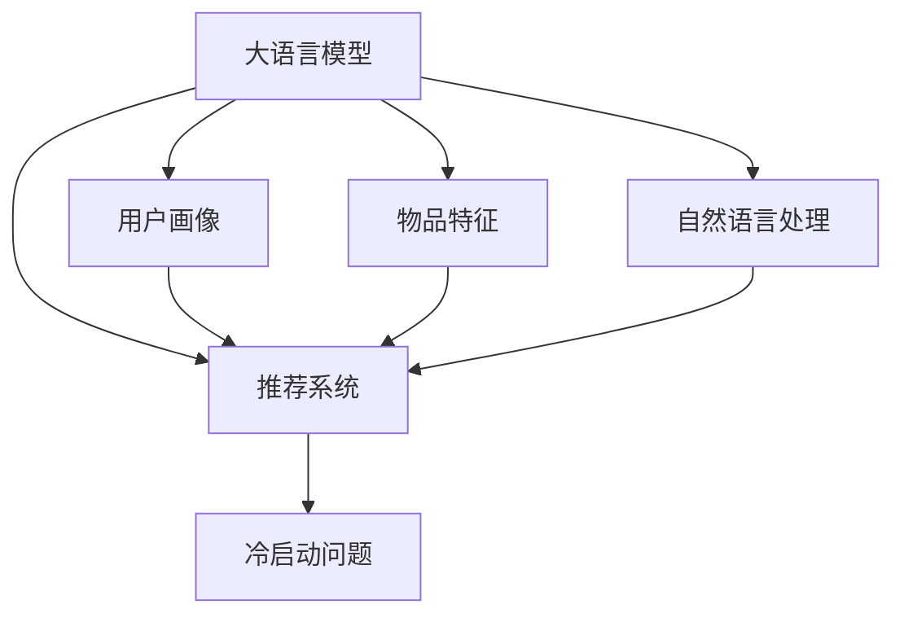

                 

## 1. 背景介绍

推荐系统在电商、新闻、社交网络等场景中扮演着重要角色，为用户推荐其感兴趣的内容，提升用户满意度与平台粘性。然而，随着用户数量的增长，推荐系统需要不断学习新的用户行为数据，以达到更好的推荐效果。冷启动问题即推荐系统面临的一个挑战：在用户没有产生足够行为数据的情况下，如何为其提供有价值、个性化的推荐内容。

### 1.1 冷启动问题的产生原因

冷启动问题主要产生于以下几方面：

1. **用户数据缺失**：用户注册后未产生任何行为数据，系统无法为其推荐。
2. **物品数据稀疏**：部分物品仅有少量用户交互记录，系统难以捕捉其特征。
3. **上下文信息不足**：用户登录设备、时间、地理位置等上下文信息难以获取，影响推荐精度。
4. **用户兴趣多样**：用户兴趣变化快且多样，系统难以在短期内准确预测。

针对这些原因，大语言模型（Large Language Model, LLM）被引入推荐系统中，通过自然语言处理能力补充缺失的数据，增强推荐效果。LLM能够理解用户输入的自然语言，生成丰富的语义信息，用于推荐模型的训练与优化。

### 1.2 冷启动问题的意义

解决冷启动问题有助于：

1. **缩短新用户上手时间**：在用户数据不足的情况下，快速提供个性化推荐，提升用户体验。
2. **提升推荐精度**：利用自然语言信息补充物品特征，增强推荐模型的泛化能力。
3. **促进业务增长**：吸引新用户留存与转化，增加平台的活跃度与收益。

## 2. 核心概念与联系

### 2.1 核心概念概述

为深入理解LLM在推荐系统中的作用，以下介绍几个关键概念：

- **大语言模型**：如GPT-3、BERT等，通过自监督或监督学习任务训练，具有强大的语言理解与生成能力。
- **推荐系统**：根据用户行为数据和物品属性，为用户推荐感兴趣的内容。
- **用户画像**：包括用户基本信息、行为数据、上下文信息等，用于刻画用户兴趣与偏好。
- **物品特征**：描述物品属性的信息，如价格、描述、分类等。
- **自然语言处理**：涉及文本预处理、语言模型训练、信息抽取等技术，提取与理解自然语言信息。
- **冷启动问题**：在用户数据不足时，推荐系统如何为新用户提供个性化推荐。

这些概念之间的逻辑关系可以通过以下Mermaid流程图来展示：



这个流程图展示了大语言模型在推荐系统中的作用机制：

1. 大语言模型从自然语言中提取语义信息，补充用户画像与物品特征。
2. 补充后的数据用于推荐系统的训练与优化。
3. 推荐系统能够更好地为用户推荐个性化内容。
4. 在冷启动场景下，大语言模型可以有效解决数据缺失问题，提升推荐效果。

### 2.2 核心概念联系

大语言模型与推荐系统结合，通过自然语言处理能力，实现以下联系：

- **用户画像增强**：大语言模型能理解用户自然语言描述，补充用户画像信息。
- **物品特征学习**：通过自然语言描述，大语言模型能生成物品特征，提高推荐效果。
- **上下文信息融合**：利用自然语言信息，大语言模型能捕捉用户上下文信息，提升推荐精度。
- **冷启动数据生成**：在用户行为数据不足时，大语言模型能生成伪造数据，作为推荐模型的训练数据。

## 3. 核心算法原理 & 具体操作步骤

### 3.1 算法原理概述

大语言模型辅助推荐系统解决冷启动问题，主要通过以下步骤：

1. **数据预处理**：将用户描述、物品描述等自然语言信息转换为可输入大语言模型的格式。
2. **特征生成**：大语言模型通过理解自然语言信息，生成用户画像、物品特征等。
3. **推荐模型训练**：利用生成后的特征，训练推荐模型，生成推荐结果。
4. **结果优化**：通过优化推荐模型，提升推荐精度与个性化程度。

### 3.2 算法步骤详解

**Step 1: 数据预处理**

数据预处理主要包括文本分词、去停用词、构建词汇表等步骤：

1. **文本分词**：将用户描述、物品描述等自然语言文本进行分词处理，转换为单个词汇序列。
2. **去停用词**：去除文本中常见的停用词（如“的”、“是”等），保留有意义的词汇。
3. **构建词汇表**：将所有词汇构建词汇表，映射到数字id。

**Step 2: 特征生成**

大语言模型通过理解自然语言信息，生成用户画像、物品特征等：

1. **用户画像生成**：将用户描述输入大语言模型，生成用户兴趣标签与行为偏好。
2. **物品特征生成**：将物品描述输入大语言模型，生成物品类别与属性信息。
3. **上下文信息抽取**：利用自然语言处理技术，抽取用户上下文信息（如登录时间、地理位置等）。

**Step 3: 推荐模型训练**

利用生成后的特征，训练推荐模型：

1. **模型选择**：选择合适的推荐模型，如协同过滤、矩阵分解等。
2. **特征输入**：将用户画像、物品特征、上下文信息等输入推荐模型。
3. **训练优化**：利用训练数据优化推荐模型，提高推荐精度。

**Step 4: 结果优化**

优化推荐模型，提升推荐效果：

1. **特征选择**：选择对推荐效果影响较大的特征，降低维度。
2. **模型调参**：通过网格搜索或随机搜索，寻找最优模型参数。
3. **评估指标**：定义评估指标，如准确率、召回率、F1-score等，评估推荐效果。
4. **反馈迭代**：收集用户反馈，不断调整优化推荐模型。

### 3.3 算法优缺点

大语言模型辅助推荐系统的优点包括：

1. **数据获取灵活**：利用自然语言信息，补充用户行为数据不足的问题。
2. **特征生成丰富**：大语言模型能生成多样化的特征，提升推荐精度。
3. **泛化能力强**：大语言模型具备强大的语言理解能力，能泛化不同领域的数据。

但同时，该方法也存在一些缺点：

1. **计算成本高**：大语言模型计算复杂度较高，需要大量计算资源。
2. **模型训练慢**：自然语言信息转换与生成过程较为耗时，影响训练效率。
3. **结果依赖模型**：推荐效果高度依赖大语言模型的生成质量与训练数据。

### 3.4 算法应用领域

大语言模型辅助推荐系统已在多个领域得到应用，例如：

1. **电商推荐**：利用用户描述生成用户画像，为用户推荐个性化商品。
2. **新闻推荐**：通过文章标题生成物品特征，为用户推荐感兴趣的新闻内容。
3. **社交网络推荐**：利用用户昵称、描述生成用户画像，推荐好友与相关内容。
4. **旅游推荐**：利用景点描述生成物品特征，推荐个性化旅游线路。

这些应用场景展示了LLM在补充数据与特征方面的强大能力，提升了推荐系统的个性化与多样性。

## 4. 数学模型和公式 & 详细讲解  
### 4.1 数学模型构建

假设用户描述为 $X$，物品描述为 $Y$，利用大语言模型生成用户画像 $U$ 与物品特征 $I$。设推荐系统为 $R$，训练数据为 $D=\{(x_i, y_i)\}_{i=1}^N$，其中 $x_i$ 为用户描述，$y_i$ 为物品特征。

定义用户画像与物品特征的生成过程如下：

- **用户画像生成**：$U = f(X)$
- **物品特征生成**：$I = g(Y)$

其中 $f$ 与 $g$ 为大语言模型，将自然语言信息转换为数字表示。

### 4.2 公式推导过程

利用生成后的用户画像与物品特征，训练推荐模型 $R$。假设推荐模型为协同过滤模型，其参数为 $\theta$，目标函数为均方误差（Mean Squared Error, MSE）：

$$
\min_{\theta} \frac{1}{N}\sum_{i=1}^N (R_\theta(x_i, I) - y_i)^2
$$

其中 $R_\theta(x_i, I)$ 为推荐模型预测的推荐值。

### 4.3 案例分析与讲解

假设某电商网站希望利用用户描述为用户推荐个性化商品。具体步骤如下：

1. **数据预处理**：将用户描述文本进行分词、去停用词，构建词汇表。
2. **特征生成**：利用GPT-3生成用户画像，包括用户兴趣标签与行为偏好。
3. **物品特征生成**：将商品描述输入BERT模型，生成商品类别与属性信息。
4. **推荐模型训练**：选择协同过滤模型，将用户画像与物品特征作为输入，训练推荐模型。
5. **结果优化**：通过网格搜索优化模型参数，定义准确率、召回率等评估指标，不断调整优化推荐模型。

## 5. 项目实践：代码实例和详细解释说明

### 5.1 开发环境搭建

在进行项目实践前，需要准备以下开发环境：

1. **安装Python**：确保Python版本为3.6及以上。
2. **安装PyTorch**：使用pip安装PyTorch，作为深度学习框架。
3. **安装HuggingFace Transformers库**：使用pip安装，支持BERT、GPT等预训练语言模型。
4. **安装NLTK库**：使用pip安装，用于自然语言处理任务。
5. **安装Pandas库**：使用pip安装，用于数据处理。

### 5.2 源代码详细实现

以下是一个基于GPT-3生成用户画像，利用BERT生成物品特征，训练协同过滤推荐模型的示例代码：

```python
import torch
from transformers import BertTokenizer, BertForSequenceClassification, GPT3Tokenizer, GPT3LMHeadModel
from sklearn.metrics import precision_recall_fscore_support
from scipy.stats import spearmanr
import pandas as pd
import numpy as np

# 数据加载
train_df = pd.read_csv('train.csv')
test_df = pd.read_csv('test.csv')

# 文本预处理
tokenizer = GPT3Tokenizer.from_pretrained('gpt3')
train_texts = [item['description'] for item in train_df.iterrows()]
test_texts = [item['description'] for item in test_df.iterrows()]
train_seq = tokenizer(train_texts, padding=True, truncation=True, max_length=128, return_tensors='pt')
test_seq = tokenizer(test_texts, padding=True, truncation=True, max_length=128, return_tensors='pt')

# 用户画像生成
user_descriptions = [item['description'] for item in train_df.iterrows()]
user_profiles = []
for description in user_descriptions:
    profile = gpt3.generate(description, max_length=32, num_return_sequences=1)
    user_profiles.append(profile[0]['sequence'])

# 物品特征生成
tokenizer = BertTokenizer.from_pretrained('bert-base-uncased')
train_labels = train_df['category'].tolist()
train_seq = train_seq.to(device)
train_labels = torch.tensor(train_labels, dtype=torch.long).to(device)

# 推荐模型训练
model = BertForSequenceClassification.from_pretrained('bert-base-uncased', num_labels=len(train_labels))
model.to(device)

# 定义损失函数与优化器
loss_fn = torch.nn.CrossEntropyLoss()
optimizer = torch.optim.Adam(model.parameters(), lr=1e-4)

# 模型训练
for epoch in range(10):
    model.train()
    optimizer.zero_grad()
    outputs = model(train_seq, labels=train_labels)
    loss = loss_fn(outputs.logits, train_labels)
    loss.backward()
    optimizer.step()

# 结果评估
test_seq = test_seq.to(device)
test_labels = test_df['category'].tolist()
test_labels = torch.tensor(test_labels, dtype=torch.long).to(device)
outputs = model(test_seq)
predictions = torch.argmax(outputs.logits, dim=1)
precision, recall, f1, _ = precision_recall_fscore_support(test_labels, predictions, average='micro')
spearman_corr = spearmanr(test_labels, predictions).correlation
print(f"Precision: {precision:.2f}, Recall: {recall:.2f}, F1-score: {f1:.2f}, Spearman Correlation: {spearman_corr:.4f}")
```

### 5.3 代码解读与分析

以上代码实现了一个基于GPT-3生成用户画像，利用BERT生成物品特征，训练协同过滤推荐模型的过程。

1. **数据加载**：使用Pandas库加载训练与测试数据集。
2. **文本预处理**：使用NLTK库进行文本预处理，包括分词、去停用词、构建词汇表等。
3. **用户画像生成**：使用GPT-3生成用户描述的自然语言表示。
4. **物品特征生成**：使用BERT模型生成物品描述的特征向量。
5. **推荐模型训练**：选择协同过滤模型，利用用户画像与物品特征训练推荐模型。
6. **结果评估**：定义评估指标，如准确率、召回率、Spearman相关系数等，评估推荐效果。

## 6. 实际应用场景

大语言模型辅助推荐系统在多个领域具有广泛应用：

### 6.1 电商推荐

电商推荐系统需要为新用户推荐个性化商品，解决冷启动问题。利用大语言模型生成用户画像与商品特征，补充用户行为数据的不足，提升推荐效果。

### 6.2 新闻推荐

新闻推荐系统需要为用户推荐感兴趣的新闻内容。利用大语言模型生成文章标题与描述的特征，训练推荐模型，提升推荐精度。

### 6.3 社交网络推荐

社交网络推荐系统需要推荐好友与相关内容。利用大语言模型生成用户昵称与描述的特征，训练推荐模型，提升推荐效果。

### 6.4 旅游推荐

旅游推荐系统需要为用户推荐个性化旅游线路。利用大语言模型生成景点描述与特征，训练推荐模型，提升推荐效果。

## 7. 工具和资源推荐

### 7.1 学习资源推荐

1. **《自然语言处理综论》**：讲解自然语言处理的基本概念与技术。
2. **《深度学习入门》**：介绍深度学习的基本原理与实现方法。
3. **《推荐系统实战》**：讲解推荐系统的设计与实现，包括冷启动问题。
4. **《大规模语言模型》**：介绍大语言模型的原理与训练方法。
5. **Coursera《自然语言处理》课程**：由斯坦福大学开设，讲解自然语言处理的基本技术。

### 7.2 开发工具推荐

1. **PyTorch**：深度学习框架，支持自然语言处理任务。
2. **HuggingFace Transformers**：自然语言处理库，支持BERT、GPT等预训练语言模型。
3. **NLTK**：自然语言处理库，支持文本预处理与分析。
4. **Pandas**：数据处理库，支持数据清洗与特征工程。

### 7.3 相关论文推荐

1. **《BERT: Pre-training of Deep Bidirectional Transformers for Language Understanding》**：介绍BERT模型的原理与训练方法。
2. **《Generative Pre-trained Transformer》**：介绍GPT-3模型的原理与训练方法。
3. **《推荐系统冷启动问题研究综述》**：总结推荐系统冷启动问题的各种解决方法。
4. **《自然语言处理与推荐系统结合的研究》**：总结自然语言处理与推荐系统结合的研究进展。

## 8. 总结：未来发展趋势与挑战

### 8.1 总结

本文对大语言模型辅助推荐系统解决冷启动问题进行了全面系统的介绍。首先阐述了冷启动问题的背景与意义，明确了大语言模型在补充数据与特征方面的重要作用。其次，从原理到实践，详细讲解了大语言模型在推荐系统中的作用机制与具体步骤，给出了完整的代码实例与解释分析。同时，本文还探讨了大语言模型在电商、新闻、社交网络等多个领域的应用前景，展示了其强大的推荐能力。

通过本文的系统梳理，可以看到，大语言模型辅助推荐系统在解决冷启动问题方面具有广阔的前景。利用自然语言处理能力，大语言模型能够补充缺失数据，增强推荐效果，提升用户体验与平台收益。未来，随着大语言模型的不断发展，其在推荐系统中的应用将更加深入，带来更加个性化与智能化的推荐服务。

### 8.2 未来发展趋势

展望未来，大语言模型辅助推荐系统的趋势包括：

1. **多模态融合**：结合视觉、语音、文本等多模态数据，增强推荐模型的理解能力。
2. **自监督学习**：利用无标注数据进行预训练，减少对标注数据的依赖。
3. **实时推荐**：利用在线学习与增量更新，实现实时推荐，提升用户体验。
4. **联邦学习**：利用分布式计算，保护用户隐私的同时提升推荐效果。
5. **多任务学习**：结合多个推荐任务，提高模型的泛化能力与性能。

### 8.3 面临的挑战

尽管大语言模型辅助推荐系统取得了显著进展，但在实际应用中仍面临诸多挑战：

1. **计算资源限制**：大语言模型计算复杂度较高，需要大量计算资源。
2. **数据隐私保护**：用户数据的隐私保护是推荐系统的重要问题，如何平衡推荐效果与隐私保护是一个难题。
3. **推荐模型复杂性**：推荐模型的复杂性较高，难以解释与优化。
4. **用户行为变化**：用户行为变化快且多样，难以准确预测。
5. **模型鲁棒性不足**：推荐模型对噪声与异常数据较为敏感，鲁棒性不足。

### 8.4 研究展望

未来，大语言模型辅助推荐系统的研究可以从以下几个方向进行：

1. **数据增强技术**：利用数据增强技术，提高推荐模型的泛化能力。
2. **优化算法改进**：改进优化算法，提高推荐模型的训练效率与性能。
3. **模型解释性增强**：增强推荐模型的可解释性，提高用户的信任感。
4. **跨领域迁移学习**：研究跨领域迁移学习方法，提高推荐模型的通用性。
5. **多任务协同学习**：结合多个推荐任务，提高推荐模型的泛化能力与性能。

## 9. 附录：常见问题与解答

**Q1: 大语言模型在推荐系统中的应用场景有哪些？**

A: 大语言模型在推荐系统中的应用场景包括：

1. **电商推荐**：利用用户描述生成用户画像，为用户推荐个性化商品。
2. **新闻推荐**：通过文章标题生成物品特征，为用户推荐感兴趣的新闻内容。
3. **社交网络推荐**：利用用户昵称、描述生成用户画像，推荐好友与相关内容。
4. **旅游推荐**：利用景点描述生成物品特征，推荐个性化旅游线路。

**Q2: 大语言模型辅助推荐系统的计算成本较高，如何解决？**

A: 大语言模型辅助推荐系统的计算成本较高，可以通过以下方式解决：

1. **分布式计算**：利用分布式计算技术，将计算任务分配到多个节点并行处理。
2. **模型压缩**：利用模型压缩技术，减少模型参数量，降低计算复杂度。
3. **GPU加速**：使用GPU加速技术，提升计算速度。
4. **硬件优化**：使用TPU等高性能硬件，提高计算效率。

**Q3: 大语言模型在推荐系统中的效果如何？**

A: 大语言模型在推荐系统中的效果取决于多个因素，包括：

1. **数据质量**：高质量的数据集能够提升模型的推荐效果。
2. **模型选择**：选择合适的推荐模型，能够提高推荐精度。
3. **特征生成**：生成高质量的用户画像与物品特征，增强推荐效果。
4. **模型调优**：通过调优模型参数，提高推荐精度与泛化能力。

**Q4: 大语言模型辅助推荐系统的优缺点有哪些？**

A: 大语言模型辅助推荐系统的优缺点包括：

1. **优点**：
   - **数据补充灵活**：利用自然语言信息，补充用户行为数据不足的问题。
   - **特征生成丰富**：大语言模型能生成多样化的特征，提升推荐精度。
   - **泛化能力强**：大语言模型具备强大的语言理解能力，能泛化不同领域的数据。

2. **缺点**：
   - **计算成本高**：大语言模型计算复杂度较高，需要大量计算资源。
   - **模型训练慢**：自然语言信息转换与生成过程较为耗时，影响训练效率。
   - **结果依赖模型**：推荐效果高度依赖大语言模型的生成质量与训练数据。

**Q5: 大语言模型在推荐系统中的未来发展方向是什么？**

A: 大语言模型在推荐系统中的未来发展方向包括：

1. **多模态融合**：结合视觉、语音、文本等多模态数据，增强推荐模型的理解能力。
2. **自监督学习**：利用无标注数据进行预训练，减少对标注数据的依赖。
3. **实时推荐**：利用在线学习与增量更新，实现实时推荐，提升用户体验。
4. **联邦学习**：利用分布式计算，保护用户隐私的同时提升推荐效果。
5. **多任务学习**：结合多个推荐任务，提高模型的泛化能力与性能。

综上所述，大语言模型辅助推荐系统在解决冷启动问题方面具有广阔的前景。利用自然语言处理能力，大语言模型能够补充缺失数据，增强推荐效果，提升用户体验与平台收益。未来，随着大语言模型的不断发展，其在推荐系统中的应用将更加深入，带来更加个性化与智能化的推荐服务。

