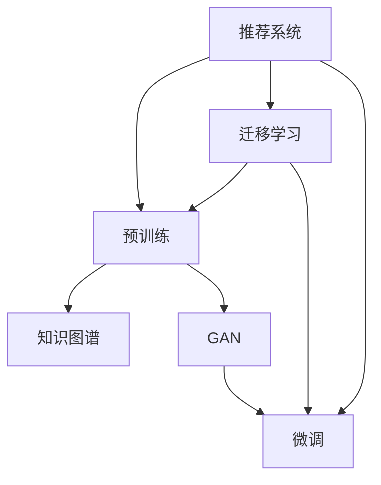

                 

# 大模型驱动的推荐系统冷启动问题解决方案

> 关键词：大模型推荐,冷启动,迁移学习,推荐系统,预训练,知识图谱,生成对抗网络(GAN)

## 1. 背景介绍

### 1.1 问题由来
在当今互联网时代，个性化推荐系统（Recommender System）作为提高用户满意度、增加点击率、提升转化率的有效手段，在电商、新闻、视频、社交媒体等多个领域中得到了广泛应用。然而，推荐系统面临一个普遍的挑战：冷启动问题。冷启动指的是在用户和物品库刚开始构建时，由于缺乏足够的历史行为数据，推荐系统无法精准预测用户偏好和物品质量，难以提供有价值的推荐。

推荐系统冷启动问题的解决通常依赖于数据积累和特征工程，然而，这些方法往往需要时间成本和数据成本较高。随着深度学习和大模型（Large Model）的发展，大模型驱动的推荐系统开始涌现，并展现出其强大的潜力。大模型通过预训练获得广泛的先验知识，能够快速适应新用户和物品，并在少量数据上实现较好的推荐效果。

### 1.2 问题核心关键点
推荐系统冷启动的核心在于如何在缺乏历史数据的情况下，快速预测用户和物品的潜在关系。大模型驱动的推荐系统通过迁移学习（Transfer Learning）的方法，利用大模型的预训练知识，在少量数据上对模型进行微调（Fine-Tuning），从而解决冷启动问题。具体而言，该方法包括：

- 预训练：在大规模数据上预训练一个通用的大模型，使其获得对用户和物品的基本理解。
- 迁移学习：将预训练模型的部分或全部知识迁移到推荐系统上，从而提高推荐系统的准确性和泛化能力。
- 微调：针对具体的推荐任务，在少量标注数据上进行微调，优化模型在推荐场景中的表现。

## 2. 核心概念与联系

### 2.1 核心概念概述

为更好地理解大模型驱动的推荐系统冷启动方法，本节将介绍几个关键概念：

- 推荐系统（Recommender System）：利用用户的历史行为数据，预测用户可能感兴趣的商品或内容，从而提供个性化的推荐。
- 预训练（Pre-training）：在大量无标签数据上进行自监督学习，学习模型的基础表示，通常用于大模型的训练。
- 迁移学习（Transfer Learning）：将预训练模型应用于下游任务，利用已有知识提高模型性能。
- 微调（Fine-Tuning）：在预训练模型的基础上，使用下游任务的少量标注数据进行有监督学习，优化模型在新任务上的表现。
- 知识图谱（Knowledge Graph）：一种结构化的语义模型，用于描述实体和它们之间的关系，辅助推荐系统理解复杂的语义信息。
- 生成对抗网络（GAN）：一种生成模型，通过对抗训练，生成高质量的合成数据，扩充推荐系统的训练集。

这些概念之间的逻辑关系可以通过以下Mermaid流程图来展示：



这个流程图展示了大模型推荐系统的核心概念及其之间的关系：

1. 推荐系统通过迁移学习和微调方法，利用大模型的预训练知识。
2. 预训练模型可以通过知识图谱和GAN进行进一步增强。
3. 迁移学习将预训练模型的知识迁移到推荐系统。
4. 微调进一步优化推荐模型，解决冷启动问题。

## 3. 核心算法原理 & 具体操作步骤
### 3.1 算法原理概述

大模型驱动的推荐系统冷启动方法主要基于迁移学习和微调技术，其核心思想是：利用大模型的预训练知识，通过迁移学习将知识迁移到推荐系统中，再通过微调针对推荐任务进行优化，从而提高推荐系统的准确性和泛化能力。

形式化地，假设推荐系统的训练集为 $D=\{(u_i, i_j)\}_{i=1}^N, u_i$ 为用户，$i_j$ 为物品。定义模型 $M_{\theta}$ 在输入 $u_i$ 和 $i_j$ 上的输出为 $p_{ij}=M_{\theta}(u_i, i_j) \in [0,1]$，表示用户 $u_i$ 对物品 $i_j$ 的偏好概率。推荐系统的优化目标是最小化误差 $E$，即找到最优参数 $\theta$：

$$
\theta^* = \mathop{\arg\min}_{\theta} E(M_{\theta}, D)
$$

其中 $E$ 为推荐系统定义的误差函数，如均方误差、交叉熵等。

### 3.2 算法步骤详解

大模型驱动的推荐系统冷启动方法一般包括以下几个关键步骤：

**Step 1: 准备预训练模型和数据集**
- 选择合适的预训练模型 $M_{\theta_{pre}}$ 作为初始化参数，如BERT、GPT等。
- 准备推荐系统数据集 $D=\{(u_i, i_j, r_{ij})\}_{i=1}^N, r_{ij}$ 为用户对物品 $i_j$ 的评分，通常为0-1之间的值。

**Step 2: 添加任务适配层**
- 根据推荐任务类型，在预训练模型顶层设计合适的输出层和损失函数。
- 对于评分预测任务，通常在顶层添加线性分类器和交叉熵损失函数。
- 对于排序任务，通常使用Top-K排序的排名损失函数。

**Step 3: 设置微调超参数**
- 选择合适的优化算法及其参数，如 AdamW、SGD 等，设置学习率、批大小、迭代轮数等。
- 设置正则化技术及强度，包括权重衰减、Dropout、Early Stopping等。
- 确定冻结预训练参数的策略，如仅微调顶层，或全部参数都参与微调。

**Step 4: 执行梯度训练**
- 将训练集数据分批次输入模型，前向传播计算损失函数。
- 反向传播计算参数梯度，根据设定的优化算法和学习率更新模型参数。
- 周期性在验证集上评估模型性能，根据性能指标决定是否触发 Early Stopping。
- 重复上述步骤直到满足预设的迭代轮数或 Early Stopping 条件。

**Step 5: 测试和部署**
- 在测试集上评估微调后模型 $M_{\hat{\theta}}$ 的性能，对比微调前后的精度提升。
- 使用微调后的模型对新样本进行推理预测，集成到实际的应用系统中。
- 持续收集新的数据，定期重新微调模型，以适应数据分布的变化。

以上是基于迁移学习和微调技术的大模型推荐系统冷启动方法的一般流程。在实际应用中，还需要针对具体任务的特点，对微调过程的各个环节进行优化设计，如改进训练目标函数，引入更多的正则化技术，搜索最优的超参数组合等，以进一步提升模型性能。

### 3.3 算法优缺点

基于迁移学习和微调技术的大模型推荐系统具有以下优点：

- 快速收敛：利用大模型的预训练知识，可以在少量数据上快速收敛，解决冷启动问题。
- 泛化能力强：大模型具有较强的泛化能力，可以适应不同类型的推荐任务。
- 效果好：利用大模型的先验知识，推荐系统能够获得较好的推荐效果。

同时，该方法也存在一定的局限性：

- 数据依赖：微调的效果很大程度上取决于标注数据的质量和数量，获取高质量标注数据的成本较高。
- 迁移能力有限：当目标任务与预训练数据的分布差异较大时，微调的性能提升有限。
- 过拟合风险：模型可能在少量数据上过度拟合，导致过拟合。

尽管存在这些局限性，但就目前而言，基于迁移学习和微调技术的方法仍是推荐系统冷启动问题的主流范式。未来相关研究的重点在于如何进一步降低微调对标注数据的依赖，提高模型的泛化能力和少样本学习能力，同时兼顾可解释性和伦理安全性等因素。

### 3.4 算法应用领域

大模型驱动的推荐系统冷启动方法已经在推荐系统领域得到了广泛的应用，覆盖了多种推荐场景，例如：

- 电商推荐：对用户的购物行为进行建模，预测用户可能感兴趣的商品。
- 新闻推荐：根据用户的历史阅读行为，推荐相关的新闻内容。
- 视频推荐：分析用户对视频内容的喜好，推荐类似的视频内容。
- 社交推荐：分析用户间的互动关系，推荐可能感兴趣的朋友和内容。

除了上述这些经典应用外，大模型推荐系统还创新性地应用于更多场景中，如用户行为预测、个性化内容生成、商品推荐组合优化等，为推荐系统带来了新的突破。

## 4. 数学模型和公式 & 详细讲解  
### 4.1 数学模型构建

本节将使用数学语言对大模型驱动的推荐系统冷启动过程进行更加严格的刻画。

记推荐系统的训练集为 $D=\{(u_i, i_j, r_{ij})\}_{i=1}^N, u_i$ 为用户，$i_j$ 为物品，$r_{ij}$ 为用户对物品 $i_j$ 的评分。

定义模型 $M_{\theta}$ 在输入 $u_i$ 和 $i_j$ 上的输出为 $p_{ij}=M_{\theta}(u_i, i_j) \in [0,1]$，表示用户 $u_i$ 对物品 $i_j$ 的偏好概率。推荐系统的优化目标是最小化误差 $E$，即找到最优参数 $\theta$：

$$
\theta^* = \mathop{\arg\min}_{\theta} E(M_{\theta}, D)
$$

其中 $E$ 为推荐系统定义的误差函数，如均方误差、交叉熵等。

### 4.2 公式推导过程

以下我们以评分预测任务为例，推导交叉熵损失函数及其梯度的计算公式。

假设模型 $M_{\theta}$ 在输入 $u_i$ 和 $i_j$ 上的输出为 $\hat{p}_{ij}=M_{\theta}(u_i, i_j) \in [0,1]$，真实标签 $r_{ij} \in [0,1]$。则交叉熵损失函数定义为：

$$
\ell(M_{\theta}(u_i, i_j), r_{ij}) = -[r_{ij}\log \hat{p}_{ij} + (1-r_{ij})\log (1-\hat{p}_{ij})]
$$

将其代入经验风险公式，得：

$$
\mathcal{L}(\theta) = -\frac{1}{N}\sum_{i=1}^N \sum_{j=1}^N [r_{ij}\log M_{\theta}(u_i, i_j)+(1-r_{ij})\log(1-M_{\theta}(u_i, i_j))]
$$

根据链式法则，损失函数对参数 $\theta_k$ 的梯度为：

$$
\frac{\partial \mathcal{L}(\theta)}{\partial \theta_k} = -\frac{1}{N}\sum_{i=1}^N \sum_{j=1}^N (\frac{r_{ij}}{M_{\theta}(u_i, i_j)}-\frac{1-r_{ij}}{1-M_{\theta}(u_i, i_j)}) \frac{\partial M_{\theta}(u_i, i_j)}{\partial \theta_k}
$$

其中 $\frac{\partial M_{\theta}(u_i, i_j)}{\partial \theta_k}$ 可进一步递归展开，利用自动微分技术完成计算。

在得到损失函数的梯度后，即可带入参数更新公式，完成模型的迭代优化。重复上述过程直至收敛，最终得到适应推荐任务的最优模型参数 $\theta^*$。

## 5. 项目实践：代码实例和详细解释说明
### 5.1 开发环境搭建

在进行推荐系统开发前，我们需要准备好开发环境。以下是使用Python进行PyTorch开发的环境配置流程：

1. 安装Anaconda：从官网下载并安装Anaconda，用于创建独立的Python环境。

2. 创建并激活虚拟环境：
```bash
conda create -n pytorch-env python=3.8 
conda activate pytorch-env
```

3. 安装PyTorch：根据CUDA版本，从官网获取对应的安装命令。例如：
```bash
conda install pytorch torchvision torchaudio cudatoolkit=11.1 -c pytorch -c conda-forge
```

4. 安装TensorFlow：
```bash
pip install tensorflow
```

5. 安装各类工具包：
```bash
pip install numpy pandas scikit-learn matplotlib tqdm jupyter notebook ipython
```

完成上述步骤后，即可在`pytorch-env`环境中开始推荐系统开发。

### 5.2 源代码详细实现

这里以评分预测任务为例，给出使用Transformers库对BERT模型进行推荐系统微调的PyTorch代码实现。

首先，定义推荐任务的数据处理函数：

```python
from transformers import BertTokenizer
from torch.utils.data import Dataset
import torch

class RecommendationDataset(Dataset):
    def __init__(self, texts, scores, tokenizer, max_len=128):
        self.texts = texts
        self.scores = scores
        self.tokenizer = tokenizer
        self.max_len = max_len
        
    def __len__(self):
        return len(self.texts)
    
    def __getitem__(self, item):
        text = self.texts[item]
        score = self.scores[item]
        
        encoding = self.tokenizer(text, return_tensors='pt', max_length=self.max_len, padding='max_length', truncation=True)
        input_ids = encoding['input_ids'][0]
        attention_mask = encoding['attention_mask'][0]
        
        # 对评分进行编码
        encoded_scores = [score] * (self.max_len - 1)
        labels = torch.tensor(encoded_scores, dtype=torch.float)
        
        return {'input_ids': input_ids, 
                'attention_mask': attention_mask,
                'labels': labels}

# 创建dataset
tokenizer = BertTokenizer.from_pretrained('bert-base-cased')

train_dataset = RecommendationDataset(train_texts, train_scores, tokenizer)
dev_dataset = RecommendationDataset(dev_texts, dev_scores, tokenizer)
test_dataset = RecommendationDataset(test_texts, test_scores, tokenizer)
```

然后，定义模型和优化器：

```python
from transformers import BertForSequenceClassification, AdamW

model = BertForSequenceClassification.from_pretrained('bert-base-cased', num_labels=1)

optimizer = AdamW(model.parameters(), lr=2e-5)
```

接着，定义训练和评估函数：

```python
from torch.utils.data import DataLoader
from tqdm import tqdm
from sklearn.metrics import mean_absolute_error

device = torch.device('cuda') if torch.cuda.is_available() else torch.device('cpu')
model.to(device)

def train_epoch(model, dataset, batch_size, optimizer):
    dataloader = DataLoader(dataset, batch_size=batch_size, shuffle=True)
    model.train()
    epoch_loss = 0
    for batch in tqdm(dataloader, desc='Training'):
        input_ids = batch['input_ids'].to(device)
        attention_mask = batch['attention_mask'].to(device)
        labels = batch['labels'].to(device)
        model.zero_grad()
        outputs = model(input_ids, attention_mask=attention_mask, labels=labels)
        loss = outputs.loss
        epoch_loss += loss.item()
        loss.backward()
        optimizer.step()
    return epoch_loss / len(dataloader)

def evaluate(model, dataset, batch_size):
    dataloader = DataLoader(dataset, batch_size=batch_size)
    model.eval()
    mae = mean_absolute_error(y_true=labels.flatten(), y_pred=preds.flatten())
    return mae
```

最后，启动训练流程并在测试集上评估：

```python
epochs = 5
batch_size = 16

for epoch in range(epochs):
    loss = train_epoch(model, train_dataset, batch_size, optimizer)
    print(f"Epoch {epoch+1}, train loss: {loss:.3f}")
    
    print(f"Epoch {epoch+1}, dev results:")
    mae = evaluate(model, dev_dataset, batch_size)
    print(f"Mean Absolute Error (MAE): {mae:.4f}")
    
print("Test results:")
mae = evaluate(model, test_dataset, batch_size)
print(f"Mean Absolute Error (MAE): {mae:.4f}")
```

以上就是使用PyTorch对BERT进行评分预测任务推荐系统微调的完整代码实现。可以看到，得益于Transformers库的强大封装，我们可以用相对简洁的代码完成BERT模型的加载和微调。

### 5.3 代码解读与分析

让我们再详细解读一下关键代码的实现细节：

**RecommendationDataset类**：
- `__init__`方法：初始化文本、评分、分词器等关键组件。
- `__len__`方法：返回数据集的样本数量。
- `__getitem__`方法：对单个样本进行处理，将文本输入编码为token ids，将评分编码为数字，并对其进行定长padding，最终返回模型所需的输入。

**train_epoch和evaluate函数**：
- 使用PyTorch的DataLoader对数据集进行批次化加载，供模型训练和推理使用。
- 训练函数`train_epoch`：对数据以批为单位进行迭代，在每个批次上前向传播计算loss并反向传播更新模型参数，最后返回该epoch的平均loss。
- 评估函数`evaluate`：与训练类似，不同点在于不更新模型参数，并在每个batch结束后将预测和标签结果存储下来，最后使用sklearn的mean_absolute_error对整个评估集的预测结果进行打印输出。

**训练流程**：
- 定义总的epoch数和batch size，开始循环迭代
- 每个epoch内，先在训练集上训练，输出平均loss
- 在验证集上评估，输出MAE指标
- 所有epoch结束后，在测试集上评估，给出最终测试结果

可以看到，PyTorch配合Transformers库使得BERT微调的代码实现变得简洁高效。开发者可以将更多精力放在数据处理、模型改进等高层逻辑上，而不必过多关注底层的实现细节。

当然，工业级的系统实现还需考虑更多因素，如模型的保存和部署、超参数的自动搜索、更灵活的任务适配层等。但核心的微调范式基本与此类似。

## 6. 实际应用场景
### 6.1 电商平台推荐系统

大模型推荐系统可以广泛应用于电商平台的推荐任务。传统电商推荐系统往往依赖用户历史行为数据，但在新用户进入平台初期，由于缺乏足够的历史行为数据，推荐效果难以保证。使用大模型推荐系统，可以通过预训练模型和少量用户行为数据，快速构建推荐模型，提升新用户的推荐体验。

在技术实现上，可以收集用户对商品的浏览、点击、收藏、购买等行为数据，提取商品标题、描述、图片等文本特征，在大型电商商品库上预训练大模型。预训练模型可以学习到商品的基本特征和关联关系，然后利用迁移学习将知识迁移到推荐系统上，最后通过微调优化推荐模型。这样，即使在少量用户行为数据的情况下，推荐系统也能提供较为准确的商品推荐。

### 6.2 新闻内容推荐系统

新闻推荐系统主要通过分析用户对新闻内容的阅读历史，预测用户可能感兴趣的新闻。传统的新闻推荐系统依赖于用户历史行为数据，然而在新闻系统刚刚上线时，用户数据量往往不足，无法快速构建推荐模型。基于大模型推荐系统，可以通过预训练模型和少量用户阅读数据，快速构建推荐模型，提升新闻推荐的准确性和个性化。

具体而言，可以收集用户在新闻平台上的阅读历史，提取文章标题、摘要、关键字等文本特征，在大型新闻库上预训练大模型。预训练模型可以学习到新闻的基本特征和关联关系，然后利用迁移学习将知识迁移到推荐系统上，最后通过微调优化推荐模型。这样，即使在少量用户阅读数据的情况下，推荐系统也能提供较为准确的个性化新闻推荐。

### 6.3 视频内容推荐系统

视频推荐系统主要通过分析用户对视频内容的观看历史，预测用户可能感兴趣的视频内容。传统的视频推荐系统依赖于用户历史行为数据，然而在视频平台刚刚上线时，用户数据量往往不足，无法快速构建推荐模型。基于大模型推荐系统，可以通过预训练模型和少量用户观看数据，快速构建推荐模型，提升视频推荐的准确性和个性化。

具体而言，可以收集用户在视频平台上的观看历史，提取视频标题、描述、标签等文本特征，在大型视频库上预训练大模型。预训练模型可以学习到视频的基本特征和关联关系，然后利用迁移学习将知识迁移到推荐系统上，最后通过微调优化推荐模型。这样，即使在少量用户观看数据的情况下，推荐系统也能提供较为准确的视频推荐。

### 6.4 未来应用展望

随着大模型推荐系统的发展，其在推荐系统领域的应用前景将更加广阔。未来，大模型推荐系统将不断拓展其应用场景，为更多行业带来变革性影响：

- 金融推荐系统：通过分析用户的历史交易行为，预测用户可能感兴趣的金融产品。
- 教育推荐系统：通过分析学生的学习历史，预测学生可能感兴趣的课程和资料。
- 医疗推荐系统：通过分析病人的历史治疗记录，预测病人可能感兴趣的治疗方案和药品。
- 旅游推荐系统：通过分析用户的旅游历史，预测用户可能感兴趣的目的地和旅游线路。

以上应用场景只是冰山一角，大模型推荐系统将在更多垂直行业得到应用，为各行各业带来智能化升级。

## 7. 工具和资源推荐
### 7.1 学习资源推荐

为了帮助开发者系统掌握大模型推荐系统的理论基础和实践技巧，这里推荐一些优质的学习资源：

1. 《Recommender System》系列博文：由大模型技术专家撰写，深入浅出地介绍了推荐系统的基本概念和常用算法，包括冷启动问题。

2. 《深度学习推荐系统》课程：斯坦福大学开设的推荐系统课程，涵盖推荐系统理论、算法和实现，是入门推荐系统的良好资源。

3. 《Recommender Systems: Architectures and Algorithms》书籍：推荐系统领域的经典教材，系统介绍了推荐系统的理论基础和实践技术。

4. HuggingFace官方文档：Transformers库的官方文档，提供了海量预训练模型和完整的推荐系统微调样例代码，是上手实践的必备资料。

5. RecSys开源项目：推荐系统领域的开源项目，包含多种推荐算法和评估指标，是学习和实验推荐系统的有力工具。

通过对这些资源的学习实践，相信你一定能够快速掌握大模型推荐系统的精髓，并用于解决实际的推荐问题。
###  7.2 开发工具推荐

高效的开发离不开优秀的工具支持。以下是几款用于大模型推荐系统开发和评估的常用工具：

1. PyTorch：基于Python的开源深度学习框架，灵活动态的计算图，适合快速迭代研究。大部分预训练语言模型都有PyTorch版本的实现。

2. TensorFlow：由Google主导开发的开源深度学习框架，生产部署方便，适合大规模工程应用。同样有丰富的预训练语言模型资源。

3. Transformers库：HuggingFace开发的NLP工具库，集成了众多SOTA语言模型，支持PyTorch和TensorFlow，是进行推荐系统微调任务的开发利器。

4. Weights & Biases：模型训练的实验跟踪工具，可以记录和可视化模型训练过程中的各项指标，方便对比和调优。与主流深度学习框架无缝集成。

5. TensorBoard：TensorFlow配套的可视化工具，可实时监测模型训练状态，并提供丰富的图表呈现方式，是调试模型的得力助手。

6. Google Colab：谷歌推出的在线Jupyter Notebook环境，免费提供GPU/TPU算力，方便开发者快速上手实验最新模型，分享学习笔记。

合理利用这些工具，可以显著提升大模型推荐系统的开发效率，加快创新迭代的步伐。

### 7.3 相关论文推荐

大模型推荐系统的发展源于学界的持续研究。以下是几篇奠基性的相关论文，推荐阅读：

1. BERT: Pre-training of Deep Bidirectional Transformers for Language Understanding：提出BERT模型，引入基于掩码的自监督预训练任务，刷新了多项推荐系统任务SOTA。

2. Attention is All You Need：提出Transformer结构，开启了NLP领域的预训练大模型时代。

3. Generative Adversarial Networks：提出GAN模型，通过对抗训练，生成高质量的合成数据，扩充推荐系统的训练集。

4. Knowledge-aware Recommender Systems：提出知识图谱与推荐系统结合的方法，增强推荐系统的语义理解能力。

5. Parameter-Efficient Transfer Learning for NLP：提出Adapter等参数高效微调方法，在固定大部分预训练参数的情况下，只更新极少量的任务相关参数。

这些论文代表了大模型推荐系统的发展脉络。通过学习这些前沿成果，可以帮助研究者把握学科前进方向，激发更多的创新灵感。

## 8. 总结：未来发展趋势与挑战

### 8.1 总结

本文对基于大模型驱动的推荐系统冷启动问题进行了全面系统的介绍。首先阐述了大模型推荐系统的背景和重要性，明确了其在推荐系统冷启动问题上的独特优势。其次，从原理到实践，详细讲解了大模型推荐系统的数学模型和算法流程，给出了推荐系统微调的完整代码实例。同时，本文还广泛探讨了大模型推荐系统在电商、新闻、视频、社交媒体等多个行业领域的应用前景，展示了其在推荐系统中的强大潜力。此外，本文精选了推荐系统相关的学习资源，力求为读者提供全方位的技术指引。

通过本文的系统梳理，可以看到，基于大模型驱动的推荐系统已经在推荐系统领域展现出其独特的优势，特别是在冷启动问题上，表现出色。大模型推荐系统不仅能够快速适应新用户和新物品，而且在少量数据上也能取得较好的推荐效果，为推荐系统的发展提供了新的突破口。未来，伴随预训练模型和微调方法的持续演进，推荐系统必将在更广阔的领域得到应用，为各行各业带来智能化升级。

### 8.2 未来发展趋势

展望未来，大模型推荐系统将呈现以下几个发展趋势：

1. 模型规模持续增大。随着算力成本的下降和数据规模的扩张，预训练语言模型的参数量还将持续增长。超大规模语言模型蕴含的丰富语言知识，有望支撑更加复杂多变的推荐任务。

2. 推荐算法多样化。除了传统的基于深度学习的推荐算法，未来将涌现更多元化的推荐方法，如基于符号知识推理、增强学习等，进一步提升推荐系统的精度和效果。

3. 实时推荐能力提升。随着边缘计算和分布式计算的发展，推荐系统将具备更强的实时推荐能力，实现低延迟的个性化推荐。

4. 跨模态融合增强。推荐系统将更多地融合图像、视频、音频等多模态信息，增强对用户行为的综合理解能力，提供更加个性化的推荐服务。

5. 推荐系统的伦理与隐私保护。随着推荐系统的广泛应用，其伦理与隐私问题愈发受到重视。如何在推荐算法中融入伦理导向的评估指标，保护用户隐私，将是未来研究的重要方向。

6. 推荐系统的可视化与解释。推荐系统需要更好的可视化手段，帮助用户理解推荐结果背后的原因和逻辑，提升系统的透明度和可信度。

以上趋势凸显了大模型推荐系统的广阔前景。这些方向的探索发展，必将进一步提升推荐系统的性能和应用范围，为人类社会的智能化升级提供新的动力。

### 8.3 面临的挑战

尽管大模型推荐系统已经在推荐系统领域取得了显著进展，但在迈向更加智能化、普适化应用的过程中，它仍面临着诸多挑战：

1. 数据收集与标注成本高。大规模数据和高质量标注数据是构建高质量大模型推荐系统的必要条件，但数据收集和标注往往需要大量人力和物力。如何降低数据成本，提高数据利用效率，将是未来的一个重要课题。

2. 模型泛化能力不足。尽管大模型推荐系统在少量数据上表现较好，但在不同用户和物品库上，模型的泛化能力可能有限。如何构建更具通用性的推荐模型，适应不同领域和场景，将是未来的研究方向。

3. 推荐系统的公平性问题。推荐系统可能存在偏见和歧视，对某些用户和物品的推荐不公平。如何构建公平、公正的推荐系统，消除偏见和歧视，将是未来研究的重点。

4. 推荐系统的隐私保护。推荐系统需要处理大量用户隐私数据，如何保护用户隐私，防止数据泄露和滥用，将是未来研究的重要方向。

5. 推荐系统的透明性与可解释性。推荐系统需要提供更好的可视化手段和解释性，帮助用户理解推荐结果背后的原因和逻辑，提升系统的透明度和可信度。

6. 推荐系统的计算效率问题。随着推荐系统的规模化应用，计算资源和计算效率将成为一个重要瓶颈。如何优化推荐系统的计算图，提高计算效率，将是未来需要解决的问题。

这些挑战反映了当前大模型推荐系统面临的实际问题，需要学界和工业界共同努力，通过持续的研究和实践，逐步克服这些挑战。

### 8.4 研究展望

未来的大模型推荐系统需要从以下几个方面进行深入探索：

1. 无监督与半监督推荐方法。在推荐系统训练数据不足的情况下，如何利用用户行为数据以外的其他信息，进行无监督或半监督推荐，提高推荐系统的泛化能力。

2. 参数高效与计算高效的推荐方法。如何设计更高效的推荐算法，在固定大部分预训练参数的情况下，只更新极少量的任务相关参数，减少计算资源消耗。

3. 跨模态推荐方法。如何更好地融合图像、视频、音频等多模态信息，增强对用户行为的综合理解能力，提供更加个性化的推荐服务。

4. 推荐系统的伦理与隐私保护。如何在推荐算法中融入伦理导向的评估指标，保护用户隐私，防止数据泄露和滥用。

5. 推荐系统的可视化与解释。如何更好地可视化推荐结果，提升系统的透明度和可信度，帮助用户理解推荐结果背后的原因和逻辑。

6. 推荐系统的实时推荐能力。如何提升推荐系统的实时推荐能力，实现低延迟的个性化推荐，满足用户实时需求。

7. 推荐系统的知识表示与融合。如何将知识图谱等结构化信息与推荐系统结合，增强推荐系统的语义理解能力，提高推荐系统的精度和效果。

这些研究方向将引领大模型推荐系统的发展方向，推动其在推荐系统领域的进一步应用和普及。

## 9. 附录：常见问题与解答

**Q1：大模型推荐系统是否适用于所有推荐任务？**

A: 大模型推荐系统在大多数推荐任务上都能取得较好的效果，特别是对于数据量较小的任务。但对于一些特定领域的任务，如医疗、金融等，仅仅依靠通用语料预训练的模型可能难以很好地适应。此时需要在特定领域语料上进一步预训练，再进行微调，才能获得理想效果。此外，对于一些需要时效性、个性化很强的任务，如对话、推荐等，微调方法也需要针对性的改进优化。

**Q2：在微调过程中如何选择合适的学习率？**

A: 微调的学习率一般要比预训练时小1-2个数量级，如果使用过大的学习率，容易破坏预训练权重，导致过拟合。一般建议从1e-5开始调参，逐步减小学习率，直至收敛。也可以使用warmup策略，在开始阶段使用较小的学习率，再逐渐过渡到预设值。需要注意的是，不同的优化器(如AdamW、Adafactor等)以及不同的学习率调度策略，可能需要设置不同的学习率阈值。

**Q3：推荐系统冷启动过程中如何利用先验知识？**

A: 在推荐系统冷启动过程中，可以利用先验知识来增强模型的泛化能力。例如，可以通过构建知识图谱，将实体和关系信息融合到推荐系统中，利用图神经网络等技术，对推荐系统进行增强。同时，可以利用外部知识库、规则库等专家知识，辅助推荐系统进行决策。

**Q4：在推荐系统中，如何处理长尾物品问题？**

A: 长尾物品问题是指在推荐系统中，少数物品的点击率远低于热门物品，难以获得推荐。为了解决这个问题，可以采用以下几种方法：
1. 分层抽样：在训练集中对长尾物品进行分层抽样，增加长尾物品在训练集中的数量。
2. 加权学习：在训练过程中，对长尾物品进行加权处理，增加其权重。
3. 生成对抗网络（GAN）：利用GAN生成高质量的合成数据，扩充训练集，提高长尾物品的点击率。

这些方法可以有效地提升长尾物品在推荐系统中的表现，提高推荐系统的覆盖面和公平性。

**Q5：推荐系统推荐结果的多样性问题如何解决？**

A: 推荐系统推荐结果的多样性问题是指推荐结果过于集中，难以满足用户的多样化需求。为了解决这个问题，可以采用以下几种方法：
1. 多样性损失函数：在训练过程中，加入多样性损失函数，引导模型生成多样化的推荐结果。
2. 推荐组合策略：结合多种推荐算法，生成多样化的推荐结果，满足用户的多样化需求。
3. 个性化推荐：根据用户的历史行为和偏好，生成个性化的推荐结果，提高推荐的相关性和多样性。

这些方法可以有效提高推荐系统推荐结果的多样性，满足用户的多样化需求。

通过本文的系统梳理，可以看到，基于大模型驱动的推荐系统已经在推荐系统领域展现出其独特的优势，特别是在冷启动问题上，表现出色。大模型推荐系统不仅能够快速适应新用户和新物品，而且在少量数据上也能取得较好的推荐效果，为推荐系统的发展提供了新的突破口。未来，伴随预训练模型和微调方法的持续演进，推荐系统必将在更广阔的领域得到应用，为各行各业带来智能化升级。

---

作者：禅与计算机程序设计艺术 / Zen and the Art of Computer Programming

