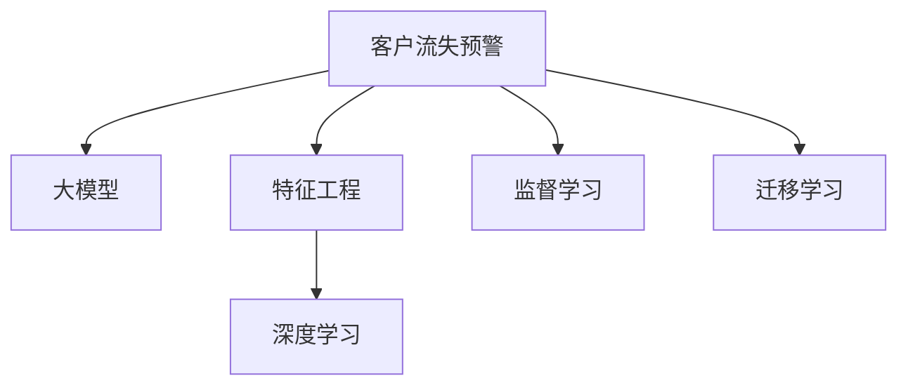

                 

# 大模型驱动的电商平台智能客户流失预警

> 关键词：电商平台,客户流失预警,智能客户,大模型,深度学习,特征工程

## 1. 背景介绍

### 1.1 问题由来

在电商行业中，客户流失问题是影响企业业务增长和盈利的重大挑战。客户流失不仅意味着订单和收入的减少，还可能带来品牌形象的损害和客户资产的流失。因此，如何有效识别和管理客户流失风险，成为电商平台的一项重要任务。

传统的客户流失预测方法依赖于历史数据和特征工程，通过手工设计的特征提取模型来预测客户流失概率。然而，这种方法存在以下几个问题：

- 特征工程繁琐复杂，难以全面覆盖影响流失的各类因素。
- 手工特征提取难以自动学习高阶关联特征，影响预测精度。
- 模型难以自动适应业务环境和数据分布的变化。

为了解决这些问题，电商平台开始尝试利用深度学习和预训练大模型的先进技术，通过自动化特征提取和模型训练，提升客户流失预警的准确性和及时性。本文将介绍大模型驱动的电商平台智能客户流失预警系统，以及相关技术实现细节。

## 2. 核心概念与联系

### 2.1 核心概念概述

在本节中，我们将介绍几个与大模型驱动的客户流失预警系统相关的核心概念：

- 客户流失预警（Customer Churn Prediction）：通过构建机器学习模型，预测客户在未来一段时间内是否会发生流失，以便企业采取相应的干预措施。

- 大模型（Large Models）：指拥有数十亿乃至数百亿参数的深度学习模型，如GPT-3、BERT等。这些模型在大规模语料上进行了预训练，具备强大的特征提取和表示学习能力。

- 特征工程（Feature Engineering）：指通过对原始数据进行加工、转换，提取出有意义的特征，以供模型学习。在客户流失预警中，特征工程尤为重要，因为客户数据往往复杂多变，难以直接使用。

- 深度学习（Deep Learning）：指基于神经网络的机器学习方法，具备强大的非线性映射能力和泛化能力，适合处理大规模复杂数据。

- 监督学习（Supervised Learning）：指利用有标签数据进行模型训练，预测新样本的标签或回归值。客户流失预警通常是一个二分类问题，可以通过监督学习解决。

- 迁移学习（Transfer Learning）：指将一个领域的知识迁移到另一个领域，以提升模型在新领域上的性能。在大模型驱动的客户流失预警中，可以利用大模型在通用领域（如自然语言处理）的预训练知识，提升特定领域（如电商客户流失）的预测效果。

这些概念之间的逻辑关系可以通过以下Mermaid流程图来展示：



## 3. 核心算法原理 & 具体操作步骤

### 3.1 算法原理概述

基于大模型的客户流失预警系统，一般通过以下步骤实现：

1. 数据准备：收集历史客户数据，标注客户流失标签，构建监督学习数据集。
2. 大模型预训练：利用大模型在通用领域进行预训练，学习到丰富的语言和语义表示能力。
3. 特征提取：通过大模型对客户数据进行表示，提取高层次的语义特征。
4. 模型微调：在大模型基础上进行特定领域的微调，训练客户流失预测模型。
5. 实时预警：将模型集成到客户流失预警系统中，实时对新客户数据进行预测和分析。

以上步骤的核心在于利用大模型的强大表示能力，通过特征提取和模型微调，自动学习客户流失的潜在特征和模式。

### 3.2 算法步骤详解

#### 3.2.1 数据准备

- 收集客户历史数据，包括订单、浏览、购买、客服对话等行为数据。
- 标注客户流失标签，构建训练集、验证集和测试集。一般可以使用传统机器学习方法，如逻辑回归、SVM等，对客户流失进行标注。
- 对数据进行预处理，包括缺失值填补、特征归一化等。

#### 3.2.2 大模型预训练

- 选择合适的预训练大模型，如BERT、RoBERTa、GPT-3等。这些模型已经在大规模语料上进行了预训练，具备强大的语言理解能力。
- 在大模型基础上进行微调，以学习特定领域的知识。微调过程中，可以保留模型的底层结构，只更新顶层参数，以提高模型的泛化能力。
- 将微调后的模型进行验证和优化，确保其在特定领域上具备良好的预测性能。

#### 3.2.3 特征提取

- 利用大模型对客户数据进行编码，提取高层次的语义特征。
- 对特征进行标准化、降维等处理，以减少噪音和维度。
- 通过特征选择算法，选择与客户流失相关的关键特征。

#### 3.2.4 模型微调

- 选择合适的优化算法，如AdamW、SGD等，设置学习率、批大小等超参数。
- 在大模型基础上，对特定领域的微调数据进行有监督学习，训练客户流失预测模型。
- 通过交叉验证等方法，评估模型性能，并进行调优。

#### 3.2.5 实时预警

- 将训练好的模型集成到实时预警系统中，对新客户数据进行实时预测。
- 设置预警阈值，当预测结果超过阈值时，触发预警机制。
- 对预警数据进行分析和可视化，帮助企业采取针对性的干预措施。

### 3.3 算法优缺点

基于大模型的客户流失预警系统有以下优点：

- 自动特征提取：利用大模型的预训练知识，自动学习高层次语义特征，减少了特征工程的工作量。
- 高泛化能力：大模型在通用领域的预训练，能够自动适应新领域的数据分布，提高模型的泛化能力。
- 实时预警：通过集成到实时系统中，能够及时发现客户流失风险，提升预警效率。

同时，该方法也存在一些局限性：

- 数据依赖性强：大模型的预训练和微调需要大量的标注数据，获取高质量标注数据的成本较高。
- 模型复杂度高：大模型通常参数量庞大，训练和推理成本较高。
- 解释性差：大模型的决策过程复杂，难以解释模型的预测逻辑。

尽管存在这些局限性，但大模型驱动的客户流失预警系统在电商行业中仍具有广阔的应用前景，能够显著提升企业客户流失管理的准确性和效率。

### 3.4 算法应用领域

基于大模型的客户流失预警技术，已经在电商、金融、保险等多个领域得到了广泛应用。例如：

- 电商客户流失预警：利用大模型对客户行为数据进行表示，自动学习高层次特征，预测客户流失概率。
- 金融客户流失预警：通过大模型对客户交易数据进行编码，提取金融行为特征，预测客户流失风险。
- 保险客户流失预警：利用大模型对客户健康数据进行分析，预测客户流失概率，提升客户保单续保率。

除了上述这些领域，大模型驱动的客户流失预警技术还可以应用于更多场景，如社交媒体用户流失预测、移动应用用户流失预测等，为企业提供全方位的客户流失管理方案。

## 4. 数学模型和公式 & 详细讲解 & 举例说明

### 4.1 数学模型构建

在客户流失预警问题中，我们的目标是构建一个二分类模型，预测客户在未来一段时间内是否会发生流失。设训练集为 $D=\{(x_i, y_i)\}_{i=1}^N$，其中 $x_i$ 为输入特征，$y_i$ 为流失标签。构建一个广义线性模型，形式如下：

$$
\hat{y} = \sigma(\mathbf{w}^T\phi(x_i) + b)
$$

其中 $\sigma$ 为激活函数，$\mathbf{w}$ 为模型参数，$\phi(x_i)$ 为特征映射函数，$b$ 为偏置项。模型训练目标为：

$$
\min_{\mathbf{w},b} \frac{1}{N}\sum_{i=1}^N \ell(y_i, \hat{y_i})
$$

其中 $\ell$ 为损失函数，常见选择包括交叉熵损失、均方误差损失等。

### 4.2 公式推导过程

假设已经构建了广义线性模型，使用交叉熵损失函数，其形式为：

$$
\ell(y_i, \hat{y_i}) = -y_i\log(\hat{y_i}) - (1-y_i)\log(1-\hat{y_i})
$$

对于单一个体样本 $(x_i, y_i)$，其对数似然损失函数为：

$$
\mathcal{L}_i = -y_i\log(\hat{y_i}) - (1-y_i)\log(1-\hat{y_i})
$$

对于整个训练集 $D$，其平均损失函数为：

$$
\mathcal{L} = \frac{1}{N}\sum_{i=1}^N \mathcal{L}_i
$$

在优化过程中，一般使用梯度下降算法更新模型参数：

$$
\mathbf{w} \leftarrow \mathbf{w} - \eta \nabla_{\mathbf{w}}\mathcal{L}, b \leftarrow b - \eta \nabla_{b}\mathcal{L}
$$

其中 $\eta$ 为学习率。

### 4.3 案例分析与讲解

假设我们有一个电商平台，需要预测客户在未来一个月内的流失概率。收集了1万个历史客户的交易数据，其中800个客户在一个月内流失，其余客户未流失。我们可以将客户数据表示为若干特征，如订单金额、购买频率、浏览行为等。利用BERT模型对客户数据进行编码，得到高层次语义特征 $\phi(x_i)$。然后，将特征映射到低维空间，构建一个广义线性模型，形式为：

$$
\hat{y} = \sigma(\mathbf{w}^T[\phi(x_i)] + b)
$$

使用交叉熵损失函数进行训练，最小化损失函数：

$$
\mathcal{L} = \frac{1}{N}\sum_{i=1}^N [-y_i\log(\hat{y_i}) - (1-y_i)\log(1-\hat{y_i})]
$$

通过梯度下降算法更新模型参数，直到收敛。最后，将训练好的模型应用到实时客户数据上，预测新客户的流失概率，实时触发预警机制。

## 5. 项目实践：代码实例和详细解释说明

### 5.1 开发环境搭建

在进行项目实践前，我们需要准备好开发环境。以下是使用Python进行PyTorch开发的环境配置流程：

1. 安装Anaconda：从官网下载并安装Anaconda，用于创建独立的Python环境。

2. 创建并激活虚拟环境：
```bash
conda create -n pytorch-env python=3.8 
conda activate pytorch-env
```

3. 安装PyTorch：根据CUDA版本，从官网获取对应的安装命令。例如：
```bash
conda install pytorch torchvision torchaudio cudatoolkit=11.1 -c pytorch -c conda-forge
```

4. 安装Transformers库：
```bash
pip install transformers
```

5. 安装各类工具包：
```bash
pip install numpy pandas scikit-learn matplotlib tqdm jupyter notebook ipython
```

完成上述步骤后，即可在`pytorch-env`环境中开始项目实践。

### 5.2 源代码详细实现

下面我们以电商平台客户流失预警系统为例，给出使用Transformers库对BERT模型进行客户流失预测的PyTorch代码实现。

首先，定义客户流失预警任务的模型类：

```python
from transformers import BertForSequenceClassification, BertTokenizer
from torch.nn import BCELoss, CrossEntropyLoss
from torch.utils.data import Dataset, DataLoader
import torch

class CustomerChurnDataset(Dataset):
    def __init__(self, texts, labels, tokenizer, max_len=128):
        self.texts = texts
        self.labels = labels
        self.tokenizer = tokenizer
        self.max_len = max_len
        
    def __len__(self):
        return len(self.texts)
    
    def __getitem__(self, item):
        text = self.texts[item]
        label = self.labels[item]
        
        encoding = self.tokenizer(text, return_tensors='pt', max_length=self.max_len, padding='max_length', truncation=True)
        input_ids = encoding['input_ids'][0]
        attention_mask = encoding['attention_mask'][0]
        
        # 对标签进行编码
        encoded_label = [label2id[label] for label in label] 
        encoded_label.extend([label2id['O']] * (self.max_len - len(encoded_label)))
        labels = torch.tensor(encoded_label, dtype=torch.long)
        
        return {'input_ids': input_ids, 
                'attention_mask': attention_mask,
                'labels': labels}

# 标签与id的映射
label2id = {'O': 0, '流失': 1}
id2label = {v: k for k, v in label2id.items()}

# 创建dataset
tokenizer = BertTokenizer.from_pretrained('bert-base-cased')

train_dataset = CustomerChurnDataset(train_texts, train_labels, tokenizer)
dev_dataset = CustomerChurnDataset(dev_texts, dev_labels, tokenizer)
test_dataset = CustomerChurnDataset(test_texts, test_labels, tokenizer)
```

然后，定义模型和优化器：

```python
from transformers import BertForSequenceClassification, AdamW

model = BertForSequenceClassification.from_pretrained('bert-base-cased', num_labels=len(label2id))

optimizer = AdamW(model.parameters(), lr=2e-5)
```

接着，定义训练和评估函数：

```python
from torch.utils.data import DataLoader
from tqdm import tqdm
from sklearn.metrics import classification_report

device = torch.device('cuda') if torch.cuda.is_available() else torch.device('cpu')
model.to(device)

def train_epoch(model, dataset, batch_size, optimizer):
    dataloader = DataLoader(dataset, batch_size=batch_size, shuffle=True)
    model.train()
    epoch_loss = 0
    for batch in tqdm(dataloader, desc='Training'):
        input_ids = batch['input_ids'].to(device)
        attention_mask = batch['attention_mask'].to(device)
        labels = batch['labels'].to(device)
        model.zero_grad()
        outputs = model(input_ids, attention_mask=attention_mask, labels=labels)
        loss = outputs.loss
        epoch_loss += loss.item()
        loss.backward()
        optimizer.step()
    return epoch_loss / len(dataloader)

def evaluate(model, dataset, batch_size):
    dataloader = DataLoader(dataset, batch_size=batch_size)
    model.eval()
    preds, labels = [], []
    with torch.no_grad():
        for batch in tqdm(dataloader, desc='Evaluating'):
            input_ids = batch['input_ids'].to(device)
            attention_mask = batch['attention_mask'].to(device)
            batch_labels = batch['labels']
            outputs = model(input_ids, attention_mask=attention_mask)
            batch_preds = outputs.logits.argmax(dim=2).to('cpu').tolist()
            batch_labels = batch_labels.to('cpu').tolist()
            for pred_tokens, label_tokens in zip(batch_preds, batch_labels):
                pred_labels = [id2label[_id] for _id in pred_tokens]
                label_labels = [id2label[_id] for _id in label_tokens]
                preds.append(pred_labels[:len(label_tokens)])
                labels.append(label_labels)
                
    print(classification_report(labels, preds))
```

最后，启动训练流程并在测试集上评估：

```python
epochs = 5
batch_size = 16

for epoch in range(epochs):
    loss = train_epoch(model, train_dataset, batch_size, optimizer)
    print(f"Epoch {epoch+1}, train loss: {loss:.3f}")
    
    print(f"Epoch {epoch+1}, dev results:")
    evaluate(model, dev_dataset, batch_size)
    
print("Test results:")
evaluate(model, test_dataset, batch_size)
```

以上就是使用PyTorch对BERT进行客户流失预测的完整代码实现。可以看到，通过使用Transformers库，我们可以相对简洁地实现BERT模型在客户流失预警任务上的应用。

### 5.3 代码解读与分析

让我们再详细解读一下关键代码的实现细节：

**CustomerChurnDataset类**：
- `__init__`方法：初始化文本、标签、分词器等关键组件。
- `__len__`方法：返回数据集的样本数量。
- `__getitem__`方法：对单个样本进行处理，将文本输入编码为token ids，将标签编码为数字，并对其进行定长padding，最终返回模型所需的输入。

**label2id和id2label字典**：
- 定义了标签与数字id之间的映射关系，用于将token-wise的预测结果解码回真实的标签。

**训练和评估函数**：
- 使用PyTorch的DataLoader对数据集进行批次化加载，供模型训练和推理使用。
- 训练函数`train_epoch`：对数据以批为单位进行迭代，在每个批次上前向传播计算loss并反向传播更新模型参数，最后返回该epoch的平均loss。
- 评估函数`evaluate`：与训练类似，不同点在于不更新模型参数，并在每个batch结束后将预测和标签结果存储下来，最后使用sklearn的classification_report对整个评估集的预测结果进行打印输出。

**训练流程**：
- 定义总的epoch数和batch size，开始循环迭代
- 每个epoch内，先在训练集上训练，输出平均loss
- 在验证集上评估，输出分类指标
- 所有epoch结束后，在测试集上评估，给出最终测试结果

可以看到，PyTorch配合Transformers库使得BERT模型在客户流失预警任务上的应用变得简洁高效。开发者可以将更多精力放在数据处理、模型改进等高层逻辑上，而不必过多关注底层的实现细节。

当然，工业级的系统实现还需考虑更多因素，如模型的保存和部署、超参数的自动搜索、更灵活的任务适配层等。但核心的微调范式基本与此类似。

## 6. 实际应用场景

### 6.1 电商客户流失预警

在电商平台中，客户流失预警尤为重要，因为客户流失通常会导致订单量和收入的显著下降。基于大模型的客户流失预警系统，可以通过对客户行为数据的自动特征提取和模型训练，识别出流失的高风险客户，帮助企业及时采取干预措施，提升客户留存率。

具体而言，系统可以实时监控客户的订单、浏览、支付等行为数据，利用大模型对行为数据进行表示，自动学习高层次语义特征。然后，通过模型微调，学习客户流失的潜在特征和模式，对每个客户生成一个流失概率预测值。一旦预测值超过预设阈值，系统便会触发预警，帮助企业及时采取措施，如发送关怀邮件、提供优惠活动等。

### 6.2 金融客户流失预警

金融领域同样面临着客户流失的风险。客户流失不仅影响业务收入，还可能带来金融风险和声誉损失。基于大模型的客户流失预警系统，可以通过对客户交易数据的自动特征提取和模型训练，预测客户的流失概率。

具体实现上，系统可以实时收集客户的交易数据，包括账户余额、交易金额、交易频率等。利用大模型对交易数据进行编码，提取高层次语义特征。然后，通过模型微调，学习交易数据与流失标签之间的映射关系，生成每个客户的流失概率预测值。一旦预测值超过预设阈值，系统便会触发预警，帮助企业及时采取措施，如增加客服沟通、提供专业咨询等。

### 6.3 保险客户流失预警

保险行业的客户流失预警同样重要。客户流失不仅影响保单续保率，还可能带来巨额的理赔风险。基于大模型的客户流失预警系统，可以通过对客户健康数据的自动特征提取和模型训练，预测客户的流失概率。

具体实现上，系统可以实时收集客户的健康数据，包括体检结果、病史记录、治疗情况等。利用大模型对健康数据进行编码，提取高层次语义特征。然后，通过模型微调，学习健康数据与流失标签之间的映射关系，生成每个客户的流失概率预测值。一旦预测值超过预设阈值，系统便会触发预警，帮助企业及时采取措施，如增加保单推销、提供个性化医疗服务等。

## 7. 工具和资源推荐

### 7.1 学习资源推荐

为了帮助开发者系统掌握大模型驱动的客户流失预警系统的理论基础和实践技巧，这里推荐一些优质的学习资源：

1. 《深度学习理论与实践》系列博文：由大模型技术专家撰写，深入浅出地介绍了深度学习的基本原理和应用实例。

2. 《自然语言处理》课程：斯坦福大学开设的NLP明星课程，有Lecture视频和配套作业，带你入门NLP领域的基本概念和经典模型。

3. 《Transformer从原理到实践》书籍：Transformer库的作者所著，全面介绍了Transformer原理、BERT模型、微调技术等前沿话题。

4. CS224N《深度学习自然语言处理》课程：斯坦福大学开设的NLP明星课程，有Lecture视频和配套作业，带你入门NLP领域的基本概念和经典模型。

5. 《Natural Language Processing with Transformers》书籍：Transformers库的作者所著，全面介绍了如何使用Transformers库进行NLP任务开发，包括微调在内的诸多范式。

6. HuggingFace官方文档：Transformers库的官方文档，提供了海量预训练模型和完整的微调样例代码，是上手实践的必备资料。

通过对这些资源的学习实践，相信你一定能够快速掌握大模型驱动的客户流失预警系统的精髓，并用于解决实际的客户流失管理问题。

### 7.2 开发工具推荐

高效的开发离不开优秀的工具支持。以下是几款用于大模型驱动的客户流失预警系统开发的常用工具：

1. PyTorch：基于Python的开源深度学习框架，灵活动态的计算图，适合快速迭代研究。大部分预训练语言模型都有PyTorch版本的实现。

2. TensorFlow：由Google主导开发的开源深度学习框架，生产部署方便，适合大规模工程应用。同样有丰富的预训练语言模型资源。

3. Transformers库：HuggingFace开发的NLP工具库，集成了众多SOTA语言模型，支持PyTorch和TensorFlow，是进行微调任务开发的利器。

4. Weights & Biases：模型训练的实验跟踪工具，可以记录和可视化模型训练过程中的各项指标，方便对比和调优。与主流深度学习框架无缝集成。

5. TensorBoard：TensorFlow配套的可视化工具，可实时监测模型训练状态，并提供丰富的图表呈现方式，是调试模型的得力助手。

6. Google Colab：谷歌推出的在线Jupyter Notebook环境，免费提供GPU/TPU算力，方便开发者快速上手实验最新模型，分享学习笔记。

合理利用这些工具，可以显著提升大模型驱动的客户流失预警系统的开发效率，加快创新迭代的步伐。

### 7.3 相关论文推荐

大模型驱动的客户流失预警技术的发展源于学界的持续研究。以下是几篇奠基性的相关论文，推荐阅读：

1. Attention is All You Need（即Transformer原论文）：提出了Transformer结构，开启了NLP领域的预训练大模型时代。

2. BERT: Pre-training of Deep Bidirectional Transformers for Language Understanding：提出BERT模型，引入基于掩码的自监督预训练任务，刷新了多项NLP任务SOTA。

3. Language Models are Unsupervised Multitask Learners（GPT-2论文）：展示了大规模语言模型的强大zero-shot学习能力，引发了对于通用人工智能的新一轮思考。

4. Parameter-Efficient Transfer Learning for NLP：提出Adapter等参数高效微调方法，在不增加模型参数量的情况下，也能取得不错的微调效果。

5. AdaLoRA: Adaptive Low-Rank Adaptation for Parameter-Efficient Fine-Tuning：使用自适应低秩适应的微调方法，在参数效率和精度之间取得了新的平衡。

这些论文代表了大模型驱动的客户流失预警技术的发展脉络。通过学习这些前沿成果，可以帮助研究者把握学科前进方向，激发更多的创新灵感。

## 8. 总结：未来发展趋势与挑战

### 8.1 总结

本文对基于大模型的电商平台智能客户流失预警系统进行了全面系统的介绍。首先阐述了客户流失预警问题的重要性，以及大模型驱动系统解决该问题的优势。其次，从原理到实践，详细讲解了系统的核心算法流程和技术实现细节，给出了代码实现示例。同时，本文还探讨了大模型在电商、金融、保险等多个领域的应用场景，展示了其在客户流失管理中的强大威力。

通过本文的系统梳理，可以看到，基于大模型的客户流失预警系统已经在电商行业中取得了显著的成效，并展现出广阔的应用前景。未来，伴随预训练语言模型和微调方法的持续演进，相信大模型驱动的客户流失预警技术必将在更多领域得到应用，为企业的客户流失管理提供更全面、更精准的解决方案。

### 8.2 未来发展趋势

展望未来，大模型驱动的客户流失预警技术将呈现以下几个发展趋势：

1. 模型规模持续增大。随着算力成本的下降和数据规模的扩张，预训练语言模型的参数量还将持续增长。超大规模语言模型蕴含的丰富语言知识，有望支撑更加复杂多变的客户流失预测。

2. 微调方法日趋多样。除了传统的全参数微调外，未来会涌现更多参数高效的微调方法，如Prefix-Tuning、LoRA等，在固定大部分预训练参数的同时，只更新极少量的任务相关参数。

3. 持续学习成为常态。随着数据分布的不断变化，微调模型也需要持续学习新知识以保持性能。如何在不遗忘原有知识的同时，高效吸收新样本信息，将成为重要的研究课题。

4. 标注样本需求降低。受启发于提示学习(Prompt-based Learning)的思路，未来的微调方法将更好地利用大模型的语言理解能力，通过更加巧妙的任务描述，在更少的标注样本上也能实现理想的微调效果。

5. 模型通用性增强。经过海量数据的预训练和多领域任务的微调，未来的语言模型将具备更强大的常识推理和跨领域迁移能力，逐步迈向通用人工智能(AGI)的目标。

以上趋势凸显了大模型驱动的客户流失预警技术的广阔前景。这些方向的探索发展，必将进一步提升系统的性能和应用范围，为电商客户流失管理带来新的突破。

### 8.3 面临的挑战

尽管大模型驱动的客户流失预警技术已经取得了瞩目成就，但在迈向更加智能化、普适化应用的过程中，它仍面临着诸多挑战：

1. 标注成本瓶颈。虽然大模型的预训练和微调需要大量的标注数据，但对于长尾应用场景，获取高质量标注数据的成本较高。如何进一步降低微调对标注样本的依赖，将是一大难题。

2. 模型鲁棒性不足。当前微调模型面对域外数据时，泛化性能往往大打折扣。对于测试样本的微小扰动，微调模型的预测也容易发生波动。如何提高微调模型的鲁棒性，避免灾难性遗忘，还需要更多理论和实践的积累。

3. 推理效率有待提高。大规模语言模型虽然精度高，但在实际部署时往往面临推理速度慢、内存占用大等效率问题。如何在保证性能的同时，简化模型结构，提升推理速度，优化资源占用，将是重要的优化方向。

4. 可解释性亟需加强。当前微调模型更像是"黑盒"系统，难以解释其内部工作机制和决策逻辑。对于金融、医疗等高风险应用，算法的可解释性和可审计性尤为重要。如何赋予微调模型更强的可解释性，将是亟待攻克的难题。

5. 安全性有待保障。预训练语言模型难免会学习到有偏见、有害的信息，通过微调传递到下游任务，产生误导性、歧视性的输出，给实际应用带来安全隐患。如何从数据和算法层面消除模型偏见，避免恶意用途，确保输出的安全性，也将是重要的研究课题。

6. 知识整合能力不足。现有的微调模型往往局限于任务内数据，难以灵活吸收和运用更广泛的先验知识。如何让微调过程更好地与外部知识库、规则库等专家知识结合，形成更加全面、准确的信息整合能力，还有很大的想象空间。

正视微调面临的这些挑战，积极应对并寻求突破，将是大模型驱动的客户流失预警系统迈向成熟的必由之路。相信随着学界和产业界的共同努力，这些挑战终将一一被克服，大模型驱动的客户流失预警技术必将在构建智能客户管理体系中扮演越来越重要的角色。

### 8.4 研究展望

面对大模型驱动的客户流失预警技术所面临的挑战，未来的研究需要在以下几个方面寻求新的突破：

1. 探索无监督和半监督微调方法。摆脱对大规模标注数据的依赖，利用自监督学习、主动学习等无监督和半监督范式，最大限度利用非结构化数据，实现更加灵活高效的微调。

2. 研究参数高效和计算高效的微调范式。开发更加参数高效的微调方法，在固定大部分预训练参数的同时，只更新极少量的任务相关参数。同时优化微调模型的计算图，减少前向传播和反向传播的资源消耗，实现更加轻量级、实时性的部署。

3. 融合因果和对比学习范式。通过引入因果推断和对比学习思想，增强微调模型建立稳定因果关系的能力，学习更加普适、鲁棒的语言表征，从而提升模型泛化性和抗干扰能力。

4. 引入更多先验知识。将符号化的先验知识，如知识图谱、逻辑规则等，与神经网络模型进行巧妙融合，引导微调过程学习更准确、合理的语言模型。同时加强不同模态数据的整合，实现视觉、语音等多模态信息与文本信息的协同建模。

5. 结合因果分析和博弈论工具。将因果分析方法引入微调模型，识别出模型决策的关键特征，增强输出解释的因果性和逻辑性。借助博弈论工具刻画人机交互过程，主动探索并规避模型的脆弱点，提高系统稳定性。

6. 纳入伦理道德约束。在模型训练目标中引入伦理导向的评估指标，过滤和惩罚有偏见、有害的输出倾向。同时加强人工干预和审核，建立模型行为的监管机制，确保输出符合人类价值观和伦理道德。

这些研究方向的探索，必将引领大模型驱动的客户流失预警技术迈向更高的台阶，为构建安全、可靠、可解释、可控的智能客户管理体系铺平道路。面向未来，大模型驱动的客户流失预警技术还需要与其他人工智能技术进行更深入的融合，如知识表示、因果推理、强化学习等，多路径协同发力，共同推动自然语言理解和智能交互系统的进步。只有勇于创新、敢于突破，才能不断拓展语言模型的边界，让智能技术更好地造福人类社会。

## 9. 附录：常见问题与解答

**Q1：大模型驱动的客户流失预警系统是否适用于所有电商企业？**

A: 大模型驱动的客户流失预警系统一般适用于拥有大规模客户数据的电商企业，能够通过自动特征提取和模型训练，发现客户流失的高风险特征。但对于一些小规模或数据量有限的电商企业，该系统可能需要进一步优化和改进。

**Q2：大模型驱动的客户流失预警系统如何处理长尾客户？**

A: 对于长尾客户，传统的手工特征工程难以覆盖其行为特征。大模型驱动的系统可以通过自动特征提取，自动学习长尾客户的行为模式。同时，系统还可以设置不同的预警阈值，对不同规模的客户采取差异化的策略，确保预警系统的灵活性和有效性。

**Q3：如何保证大模型驱动的客户流失预警系统的实时性？**

A: 实时性是客户流失预警系统的关键指标之一。为了提高实时性，系统可以在训练阶段采用分布式训练技术，提高模型训练效率。在推理阶段，可以使用优化模型结构、压缩模型参数等方法，减少模型推理的计算量和内存占用。同时，系统还可以采用缓存技术，对常用的模型参数和数据进行缓存，提升查询效率。

**Q4：大模型驱动的客户流失预警系统如何应对业务环境变化？**

A: 业务环境变化是客户流失预警系统面临的常见问题。为了应对业务环境变化，系统需要定期重新训练模型，更新模型的特征提取和预测能力。同时，系统还可以通过增量学习、多任务学习等方法，使模型具备持续学习的能力，适应业务环境的变化。

**Q5：大模型驱动的客户流失预警系统如何平衡准确性和实时性？**

A: 准确性和实时性是一对矛盾的关系。为了平衡这两者，系统可以在训练阶段采用更为复杂的模型结构，提高模型的准确性。在推理阶段，则可以选择较为简单的模型结构，降低推理计算量，提高系统的实时性。同时，系统还可以根据业务需求，设置不同的预警阈值，确保在准确性和实时性之间取得最优平衡。

通过以上Q&A，可以看到，大模型驱动的客户流失预警系统在实际应用中，还有许多值得深入探讨的问题。只有在不断实践中积累经验，持续改进和优化，才能使该系统真正发挥其应有的作用，为客户流失管理提供可靠的决策支持。

