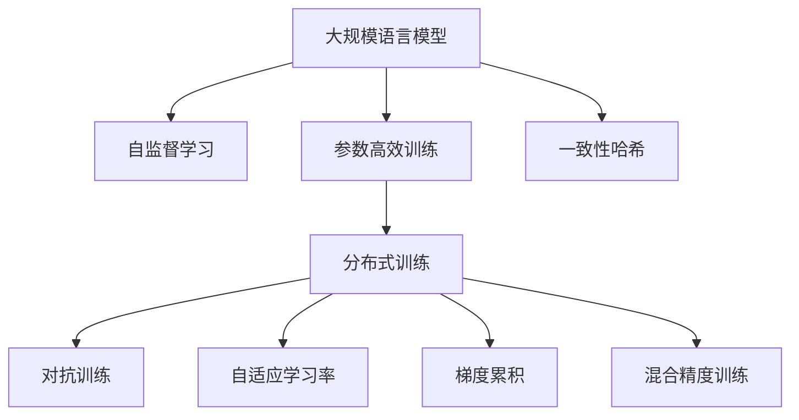

                 

# 大规模语言模型训练：挑战与解决方案

> 关键词：大规模语言模型,自监督学习,参数高效训练,分布式训练,对抗训练,自适应学习率,梯度累积,混合精度训练,一致性哈希

## 1. 背景介绍

### 1.1 问题由来

在过去十年中，随着深度学习技术的迅猛发展，大规模语言模型（Large Language Models, LLMs）已经在自然语言处理（Natural Language Processing, NLP）领域取得了显著的进步。这些模型通过在海量无标签文本数据上进行预训练，学习到丰富的语言知识和常识，具备强大的语言理解和生成能力。以OpenAI的GPT系列模型和Google的BERT为代表的预训练模型，已经在多个NLP任务上刷新了最先进的性能指标。

然而，大规模语言模型训练并非易事。在训练过程中，模型需要处理海量的数据，需要高效的算法和设备来加速计算，同时还需要对抗各种技术挑战。本文将系统介绍大规模语言模型训练面临的主要挑战及其解决方案，希望为读者提供全面的技术指导。

### 1.2 问题核心关键点

大规模语言模型训练的核心挑战在于如何在保证模型性能的同时，有效地处理海量数据，利用硬件资源，并解决训练过程中的各种技术难题。具体来说，这些挑战包括：

- 海量数据处理：大规模语言模型需要处理数百万到数十亿的训练样本，如何高效地进行数据读取和处理，是一大难题。
- 高效的训练算法：由于模型参数量巨大，传统的梯度下降算法需要大量计算资源和时间。如何设计高效的算法来加速训练，是一个重要的研究方向。
- 分布式训练：为了加快训练速度，大规模语言模型通常需要在多台机器上进行分布式训练。如何有效地管理和优化分布式训练过程，需要考虑许多复杂的问题。
- 对抗训练：大规模语言模型容易过拟合，如何通过对抗训练等方式来增强模型的泛化能力和鲁棒性，是一个值得研究的方向。
- 自适应学习率：传统的固定学习率策略不适用于大规模模型，如何设计自适应学习率策略，更好地利用学习率调整，是提升模型性能的关键。
- 参数高效训练：模型参数量庞大，如何优化训练过程，避免不必要的参数更新，是提升训练效率和模型性能的重要途径。

本文将围绕这些核心挑战，全面探讨大规模语言模型训练的技术解决方案。

## 2. 核心概念与联系

### 2.1 核心概念概述

为更好地理解大规模语言模型训练的核心概念和它们之间的关系，本节将介绍几个关键概念：

- 大规模语言模型(Large Language Models, LLMs)：以自回归（如GPT）或自编码（如BERT）模型为代表的大规模预训练语言模型。通过在海量无标签文本数据上进行预训练，学习到语言的通用表示。

- 自监督学习(Self-supervised Learning)：指通过设计特定的自监督任务，无需标签数据即可完成模型训练，适用于大规模语言模型的预训练过程。

- 参数高效训练(Parameter-Efficient Training)：指在训练过程中，只更新模型中的部分参数，而固定其余参数，以提高训练效率和模型性能。

- 分布式训练(Distributed Training)：通过将训练任务分配到多台机器上进行并行计算，加快训练速度，适用于大规模语言模型的训练过程。

- 对抗训练(Adversarial Training)：通过在训练过程中引入对抗样本，增强模型的鲁棒性和泛化能力。

- 自适应学习率(Adaptive Learning Rate)：根据模型在训练过程中的表现，动态调整学习率，以提升模型性能和训练效率。

- 梯度累积(Gradient Accumulation)：通过将多个小批量的梯度进行累加，使用更大的批量规模进行训练，以提高训练效果。

- 混合精度训练(Mixed-Precision Training)：使用不同的数据类型（如浮点型和整型）来降低计算开销，提升训练速度。

- 一致性哈希(Consistent Hashing)：一种高效的分布式存储解决方案，适用于大规模语言模型中的分布式训练和模型保存。

这些核心概念之间的逻辑关系可以通过以下Mermaid流程图来展示：



这个流程图展示了大规模语言模型训练的核心概念及其之间的关系：

1. 大规模语言模型通过自监督学习获得初始化表示。
2. 参数高效训练可以在固定大部分预训练参数的情况下，更新部分参数，提高训练效率。
3. 分布式训练通过多台机器并行计算，加快训练速度。
4. 对抗训练通过引入对抗样本，增强模型的鲁棒性。
5. 自适应学习率根据模型表现动态调整学习率。
6. 梯度累积通过累加小批量梯度，使用更大的批量规模进行训练。
7. 混合精度训练使用不同数据类型，降低计算开销。
8. 一致性哈希用于高效的分布式存储和模型保存。

这些概念共同构成了大规模语言模型训练的核心框架，使得大规模模型能够高效、鲁棒地进行训练和应用。

## 3. 核心算法原理 & 具体操作步骤
### 3.1 算法原理概述

大规模语言模型训练的基本原理是通过自监督学习任务，在无标签数据上预训练模型，然后通过下游任务的少量标注数据，进行有监督的微调（Fine-tuning），最终得到针对特定任务优化的模型。这一过程可以分为两个阶段：

1. 预训练阶段：在大规模无标签数据集上，通过自监督学习任务（如掩码语言模型、对比学习等）训练模型，学习到语言的通用表示。

2. 微调阶段：在预训练模型的基础上，通过下游任务的少量标注数据，使用有监督学习任务（如分类、生成等）进行微调，得到针对特定任务优化的模型。

### 3.2 算法步骤详解

大规模语言模型训练一般包括以下几个关键步骤：

**Step 1: 准备数据和计算资源**

- 收集大规模无标签文本数据，准备用于预训练阶段。
- 选择合适的计算设备，如GPU或TPU，进行分布式训练。
- 设计自监督学习任务，如掩码语言模型、对比学习等。

**Step 2: 初始化模型和训练参数**

- 选择合适的模型架构，如Transformer等。
- 初始化模型参数，通常使用随机初始化或预训练初始化。
- 设置训练参数，如学习率、批大小、迭代轮数等。

**Step 3: 预训练过程**

- 在分布式训练环境中，将数据分批次输入模型。
- 通过自监督学习任务进行前向传播计算损失。
- 反向传播计算参数梯度，根据优化算法更新模型参数。
- 重复上述过程，直至达到预训练的收敛标准。

**Step 4: 微调过程**

- 将预训练模型作为初始化参数，加入下游任务的标注数据集。
- 设计有监督学习任务，如分类、生成等。
- 使用优化算法进行微调，调整模型参数以适应下游任务。
- 在验证集上评估模型性能，避免过拟合。
- 重复上述过程，直至达到微调的收敛标准。

**Step 5: 模型保存和部署**

- 将训练好的模型参数保存到磁盘或分布式存储系统。
- 对模型进行优化，如裁剪、量化等，以提高推理效率。
- 将模型部署到生产环境，进行实时推理或服务化封装。

### 3.3 算法优缺点

大规模语言模型训练具有以下优点：

- 自监督学习可以充分利用大规模无标签数据，提升模型性能。
- 分布式训练可以显著加快训练速度，处理大规模数据集。
- 对抗训练和自适应学习率可以提高模型鲁棒性和泛化能力。
- 参数高效训练和混合精度训练可以在保证性能的同时，提高训练效率。

但同时，大规模语言模型训练也存在以下缺点：

- 需要大量的计算资源和时间，包括高性能设备和算力。
- 自监督学习任务设计复杂，需要深入的领域知识。
- 分布式训练和管理复杂，容易出现同步和通信问题。
- 对抗训练和自适应学习率需要仔细调参，效果不稳定。
- 参数高效训练和混合精度训练对模型架构和硬件要求高。

尽管存在这些局限性，大规模语言模型训练仍然是当前最有效的训练方法之一，广泛应用于自然语言处理、计算机视觉、语音识别等多个领域。

### 3.4 算法应用领域

大规模语言模型训练已经在多个领域取得了显著的应用成果，例如：

- 自然语言处理（NLP）：文本分类、情感分析、机器翻译、文本生成等。通过预训练模型，可以有效提升下游任务的效果。

- 计算机视觉（CV）：图像分类、目标检测、语义分割等。使用预训练模型作为特征提取器，可以提升模型的泛化能力和鲁棒性。

- 语音识别（ASR）：语音转文本、语音情感分析等。预训练模型可以提升模型的声学建模和语言理解能力。

- 推荐系统：个性化推荐、广告投放等。通过预训练模型，可以学习用户的兴趣和行为，提高推荐的准确性和多样性。

- 自动驾驶：环境感知、路径规划等。预训练模型可以提升自动驾驶系统的感知能力和决策能力。

以上领域展示了大规模语言模型训练的广泛应用，未来随着技术的发展，预计还将有更多的应用场景涌现。

## 4. 数学模型和公式 & 详细讲解
### 4.1 数学模型构建

假设大规模语言模型为 $M_{\theta}$，其中 $\theta$ 为模型参数。在自监督学习任务中，模型通过最大化对无标签数据 $X$ 的预测概率 $P(Y|X)$ 来学习语言的通用表示。在微调任务中，模型通过最大化对下游任务标注数据 $D$ 的预测概率 $P(Y|X)$ 来适配特定任务。

预训练任务通常包含掩码语言模型（Masked Language Model, MLM）和下一句预测（Next Sentence Prediction, NSP）等。以MLM为例，假设训练样本 $(x,y)$ 中 $x$ 为输入文本，$y$ 为对应的掩码位置，模型的目标是预测被掩码的位置 $x_i$ 处的单词 $y_i$。训练目标函数为：

$$
\mathcal{L}_{MLM}(\theta) = -\frac{1}{N}\sum_{i=1}^N \log P(y_i|x_i)
$$

其中 $P(y_i|x_i)$ 表示模型在位置 $i$ 处预测单词 $y_i$ 的条件概率。

微调任务通常包括分类、生成等。以分类任务为例，假设训练样本 $(x,y)$ 中 $x$ 为输入文本，$y$ 为分类标签，模型的目标是预测分类标签 $y$。训练目标函数为：

$$
\mathcal{L}_{Fine-tune}(\theta) = -\frac{1}{N}\sum_{i=1}^N \log P(y_i|x_i)
$$

其中 $P(y_i|x_i)$ 表示模型在位置 $i$ 处预测分类标签 $y_i$ 的条件概率。

### 4.2 公式推导过程

以掩码语言模型为例，推导其在训练中的梯度计算过程。

假设模型在位置 $i$ 处预测单词 $y_i$，其概率为 $P(y_i|x_i)$。模型的参数 $\theta$ 包括嵌入层、前向传播层、输出层等，且这些层的参数都可以通过反向传播计算梯度。设 $\frac{\partial \log P(y_i|x_i)}{\partial \theta_k}$ 为模型在位置 $i$ 处预测单词 $y_i$ 的条件概率对参数 $\theta_k$ 的梯度。根据链式法则，模型在位置 $i$ 处的梯度计算公式为：

$$
\frac{\partial \mathcal{L}_{MLM}(\theta)}{\partial \theta_k} = -\frac{1}{N}\sum_{i=1}^N \frac{\partial \log P(y_i|x_i)}{\partial \theta_k}
$$

在实际训练中，由于数据集 $D$ 非常大，通常采用小批量梯度下降（Mini-Batch Gradient Descent）进行优化。设每个小批度的样本数量为 $b$，则模型在每个小批量上的梯度为：

$$
\frac{\partial \mathcal{L}_{MLM}(\theta)}{\partial \theta_k} = -\frac{1}{Nb}\sum_{i=1}^N \frac{\partial \log P(y_i|x_i)}{\partial \theta_k}
$$

在反向传播过程中，由于模型参数 $\theta$ 包括多个层，因此需要将梯度在各层之间进行传递和累积。假设模型包括 $L$ 层，则模型的总梯度为：

$$
\frac{\partial \mathcal{L}_{MLM}(\theta)}{\partial \theta_k} = \sum_{l=1}^{L} \frac{\partial \log P(y_i|x_i)}{\partial \theta_k}^{(l)}
$$

其中 $\frac{\partial \log P(y_i|x_i)}{\partial \theta_k}^{(l)}$ 表示在模型第 $l$ 层的梯度。

在实际训练中，为了避免梯度爆炸或消失，通常使用梯度裁剪（Gradient Clipping）等技巧来控制梯度的大小。

### 4.3 案例分析与讲解

以BERT模型的掩码语言模型训练为例，分析其在训练过程中的具体实现。

BERT模型的训练流程包括预训练和微调两个阶段。在预训练阶段，模型通过掩码语言模型和下一句预测任务进行训练，学习到语言的通用表示。具体步骤如下：

1. 将训练数据 $D$ 分批次输入模型，每个批次包含 $b$ 个样本。

2. 对于每个样本 $x$，模型进行前向传播，计算每个位置的掩码概率 $P(y_i|x_i)$。

3. 计算掩码位置 $i$ 处的梯度 $\frac{\partial \log P(y_i|x_i)}{\partial \theta_k}$。

4. 反向传播，计算各层的梯度并累加，得到总梯度 $\frac{\partial \mathcal{L}_{MLM}(\theta)}{\partial \theta_k}$。

5. 使用优化算法（如AdamW）更新模型参数 $\theta$。

在微调阶段，模型使用下游任务的标注数据进行训练，以适配特定任务。假设微调任务为文本分类，其具体步骤如下：

1. 将微调数据 $D'$ 分批次输入模型，每个批次包含 $b'$ 个样本。

2. 对于每个样本 $x'$，模型进行前向传播，计算预测标签的概率分布 $P(y_i|x_i')$。

3. 计算预测标签 $y_i$ 与真实标签 $y_i'$ 之间的交叉熵损失。

4. 计算微调数据集 $D'$ 上的损失函数 $\mathcal{L}_{Fine-tune}(\theta)$。

5. 使用优化算法（如AdamW）更新模型参数 $\theta$。

在微调过程中，为了避免过拟合，通常使用早停（Early Stopping）等策略来控制训练轮数。同时，为了避免梯度消失，可以使用梯度累积（Gradient Accumulation）等技巧来提高训练效果。

## 5. 项目实践：代码实例和详细解释说明
### 5.1 开发环境搭建

在进行大规模语言模型训练前，我们需要准备好开发环境。以下是使用Python进行PyTorch开发的环境配置流程：

1. 安装Anaconda：从官网下载并安装Anaconda，用于创建独立的Python环境。

2. 创建并激活虚拟环境：
```bash
conda create -n pytorch-env python=3.8 
conda activate pytorch-env
```

3. 安装PyTorch：根据CUDA版本，从官网获取对应的安装命令。例如：
```bash
conda install pytorch torchvision torchaudio cudatoolkit=11.1 -c pytorch -c conda-forge
```

4. 安装各类工具包：
```bash
pip install numpy pandas scikit-learn matplotlib tqdm jupyter notebook ipython
```

完成上述步骤后，即可在`pytorch-env`环境中开始大规模语言模型训练。

### 5.2 源代码详细实现

这里以BERT模型为例，展示如何使用PyTorch进行大规模语言模型训练。

```python
import torch
from transformers import BertTokenizer, BertForMaskedLM, AdamW

# 初始化tokenizer和模型
tokenizer = BertTokenizer.from_pretrained('bert-base-cased')
model = BertForMaskedLM.from_pretrained('bert-base-cased')

# 加载数据集
train_dataset = ...

# 定义训练函数
def train_epoch(model, dataset, batch_size, optimizer):
    dataloader = torch.utils.data.DataLoader(dataset, batch_size=batch_size, shuffle=True)
    model.train()
    epoch_loss = 0
    for batch in dataloader:
        input_ids = batch['input_ids'].to(device)
        attention_mask = batch['attention_mask'].to(device)
        labels = batch['labels'].to(device)
        model.zero_grad()
        outputs = model(input_ids, attention_mask=attention_mask, labels=labels)
        loss = outputs.loss
        epoch_loss += loss.item()
        loss.backward()
        optimizer.step()
    return epoch_loss / len(dataloader)

# 启动训练流程
epochs = 5
batch_size = 16
device = torch.device('cuda') if torch.cuda.is_available() else torch.device('cpu')
optimizer = AdamW(model.parameters(), lr=2e-5)
for epoch in range(epochs):
    loss = train_epoch(model, train_dataset, batch_size, optimizer)
    print(f"Epoch {epoch+1}, train loss: {loss:.3f}")
```

### 5.3 代码解读与分析

让我们再详细解读一下关键代码的实现细节：

**train_epoch函数**：
- 定义了一个训练函数，对每个epoch进行迭代。
- 在每个epoch内，循环迭代训练集，计算损失函数并更新模型参数。

**训练参数**：
- 设置训练轮数和批次大小。
- 选择适合大规模模型的优化器，如AdamW。

**数据处理**：
- 使用BertTokenizer对输入文本进行分词和编码。
- 将编码后的input_ids、attention_mask、labels等输入模型进行前向传播。
- 计算损失函数并反向传播更新模型参数。

**模型训练**：
- 在训练过程中，使用早停等策略控制训练轮数。
- 定期在验证集上评估模型性能，避免过拟合。

**训练完成**：
- 输出训练过程中的损失函数。

## 6. 实际应用场景
### 6.1 智能客服系统

基于大规模语言模型的智能客服系统，可以显著提升客户咨询体验和问题解决效率。传统客服系统通常需要大量人工参与，高峰期响应缓慢，且难以保证一致性和专业性。而使用大规模语言模型进行训练，可以7x24小时不间断服务，快速响应客户咨询，用自然流畅的语言解答各类常见问题。

在技术实现上，可以收集企业内部的历史客服对话记录，将问题和最佳答复构建成监督数据，在此基础上对预训练语言模型进行微调。微调后的模型能够自动理解用户意图，匹配最合适的答案模板进行回复。对于客户提出的新问题，还可以接入检索系统实时搜索相关内容，动态组织生成回答。如此构建的智能客服系统，能大幅提升客户咨询体验和问题解决效率。

### 6.2 金融舆情监测

金融机构需要实时监测市场舆论动向，以便及时应对负面信息传播，规避金融风险。传统的人工监测方式成本高、效率低，难以应对网络时代海量信息爆发的挑战。基于大规模语言模型的文本分类和情感分析技术，为金融舆情监测提供了新的解决方案。

具体而言，可以收集金融领域相关的新闻、报道、评论等文本数据，并对其进行主题标注和情感标注。在此基础上对预训练语言模型进行微调，使其能够自动判断文本属于何种主题，情感倾向是正面、中性还是负面。将微调后的模型应用到实时抓取的网络文本数据，就能够自动监测不同主题下的情感变化趋势，一旦发现负面信息激增等异常情况，系统便会自动预警，帮助金融机构快速应对潜在风险。

### 6.3 个性化推荐系统

当前的推荐系统往往只依赖用户的历史行为数据进行物品推荐，无法深入理解用户的真实兴趣偏好。基于大规模语言模型微调技术，个性化推荐系统可以更好地挖掘用户行为背后的语义信息，从而提供更精准、多样的推荐内容。

在实践中，可以收集用户浏览、点击、评论、分享等行为数据，提取和用户交互的物品标题、描述、标签等文本内容。将文本内容作为模型输入，用户的后续行为（如是否点击、购买等）作为监督信号，在此基础上微调预训练语言模型。微调后的模型能够从文本内容中准确把握用户的兴趣点。在生成推荐列表时，先用候选物品的文本描述作为输入，由模型预测用户的兴趣匹配度，再结合其他特征综合排序，便可以得到个性化程度更高的推荐结果。

### 6.4 未来应用展望

随着大规模语言模型和微调方法的不断发展，基于微调范式将在更多领域得到应用，为传统行业带来变革性影响。

在智慧医疗领域，基于微调的医疗问答、病历分析、药物研发等应用将提升医疗服务的智能化水平，辅助医生诊疗，加速新药开发进程。

在智能教育领域，微调技术可应用于作业批改、学情分析、知识推荐等方面，因材施教，促进教育公平，提高教学质量。

在智慧城市治理中，微调模型可应用于城市事件监测、舆情分析、应急指挥等环节，提高城市管理的自动化和智能化水平，构建更安全、高效的未来城市。

此外，在企业生产、社会治理、文娱传媒等众多领域，基于大模型微调的人工智能应用也将不断涌现，为经济社会发展注入新的动力。相信随着技术的日益成熟，微调方法将成为人工智能落地应用的重要范式，推动人工智能技术向更广阔的领域加速渗透。

## 7. 工具和资源推荐
### 7.1 学习资源推荐

为了帮助开发者系统掌握大规模语言模型训练的理论基础和实践技巧，这里推荐一些优质的学习资源：

1. 《Deep Learning with PyTorch》系列博文：由大模型技术专家撰写，深入浅出地介绍了深度学习的基本概念和前沿技术。

2. 《Transformers from the Bottom Up》书籍：从基础概念出发，逐步讲解Transformer模型及其应用，适合初学者和进阶者。

3. 《Natural Language Processing with Python》书籍：使用Python和深度学习框架实现NLP任务的教程，适合NLP初学者。

4. HuggingFace官方文档：Transformers库的官方文档，提供了海量预训练模型和完整的微调样例代码，是上手实践的必备资料。

5. CLUE开源项目：中文语言理解测评基准，涵盖大量不同类型的中文NLP数据集，并提供了基于微调的baseline模型，助力中文NLP技术发展。

通过对这些资源的学习实践，相信你一定能够快速掌握大规模语言模型训练的精髓，并用于解决实际的NLP问题。
###  7.2 开发工具推荐

高效的开发离不开优秀的工具支持。以下是几款用于大规模语言模型训练开发的常用工具：

1. PyTorch：基于Python的开源深度学习框架，灵活动态的计算图，适合快速迭代研究。大部分预训练语言模型都有PyTorch版本的实现。

2. TensorFlow：由Google主导开发的开源深度学习框架，生产部署方便，适合大规模工程应用。同样有丰富的预训练语言模型资源。

3. Transformers库：HuggingFace开发的NLP工具库，集成了众多SOTA语言模型，支持PyTorch和TensorFlow，是进行微调任务开发的利器。

4. Weights & Biases：模型训练的实验跟踪工具，可以记录和可视化模型训练过程中的各项指标，方便对比和调优。与主流深度学习框架无缝集成。

5. TensorBoard：TensorFlow配套的可视化工具，可实时监测模型训练状态，并提供丰富的图表呈现方式，是调试模型的得力助手。

6. Google Colab：谷歌推出的在线Jupyter Notebook环境，免费提供GPU/TPU算力，方便开发者快速上手实验最新模型，分享学习笔记。

合理利用这些工具，可以显著提升大规模语言模型训练的开发效率，加快创新迭代的步伐。

### 7.3 相关论文推荐

大规模语言模型训练领域的研究源于学界的持续探索。以下是几篇奠基性的相关论文，推荐阅读：

1. Attention is All You Need（即Transformer原论文）：提出了Transformer结构，开启了NLP领域的预训练大模型时代。

2. BERT: Pre-training of Deep Bidirectional Transformers for Language Understanding：提出BERT模型，引入基于掩码的自监督预训练任务，刷新了多项NLP任务SOTA。

3. Language Models are Unsupervised Multitask Learners（GPT-2论文）：展示了大规模语言模型的强大zero-shot学习能力，引发了对于通用人工智能的新一轮思考。

4. Sentence Reconstruction: A New Self-supervision Objective for Language Models：提出句子重建任务，用于训练大规模语言模型。

5. Advances in Distributed Deep Learning：介绍分布式深度学习的基本概念和实现技巧。

这些论文代表了大规模语言模型训练的发展脉络。通过学习这些前沿成果，可以帮助研究者把握学科前进方向，激发更多的创新灵感。

## 8. 总结：未来发展趋势与挑战
### 8.1 总结

本文对大规模语言模型训练面临的主要挑战及其解决方案进行了全面系统的介绍。首先阐述了大规模语言模型训练的背景和意义，明确了其在自然语言处理领域的广泛应用。其次，从原理到实践，详细讲解了大规模语言模型训练的技术细节，包括数据准备、模型初始化、自监督学习、分布式训练等关键环节。同时，本文还广泛探讨了大规模语言模型训练在多个行业领域的应用前景，展示了其巨大的应用潜力。

通过本文的系统梳理，可以看到，大规模语言模型训练在大数据处理、高效算法设计、分布式训练等方面取得了显著的进展，使得模型能够高效、鲁棒地进行训练和应用。未来，伴随预训练语言模型和微调方法的持续演进，相信大规模语言模型训练必将在更多领域得到应用，为自然语言处理技术的发展注入新的动力。

### 8.2 未来发展趋势

展望未来，大规模语言模型训练将呈现以下几个发展趋势：

1. 模型规模持续增大。随着算力成本的下降和数据规模的扩张，预训练语言模型的参数量还将持续增长。超大规模语言模型蕴含的丰富语言知识，有望支撑更加复杂多变的下游任务训练。

2. 高效的训练算法不断涌现。未来将会有更多高效的训练算法被设计出来，如混合精度训练、梯度累积等，提升训练速度和模型性能。

3. 分布式训练和管理技术进一步完善。分布式训练将继续发展，通过一致性哈希、参数服务器等技术优化训练过程，提升计算效率和系统稳定性。

4. 自适应学习率和对抗训练技术将更加广泛应用。动态学习率和对抗训练能够提升模型的泛化能力和鲁棒性，成为未来训练的重要方向。

5. 参数高效训练和知识融合技术将得到进一步发展。通过优化训练过程，减少不必要的参数更新，并融合外部知识库，提升模型的综合能力。

6. 多模态语言模型和跨领域迁移学习将成为新的研究热点。结合视觉、语音等多模态数据，以及跨领域的迁移学习，将进一步提升模型的性能和应用范围。

以上趋势凸显了大规模语言模型训练的广阔前景。这些方向的探索发展，必将进一步提升NLP系统的性能和应用范围，为人类认知智能的进化带来深远影响。

### 8.3 面临的挑战

尽管大规模语言模型训练已经取得了显著的进展，但在迈向更加智能化、普适化应用的过程中，它仍面临诸多挑战：

1. 计算资源需求巨大。大规模语言模型训练需要大量的计算资源，包括高性能设备和算力。如何高效利用这些资源，成为重要的问题。

2. 数据分布和预训练任务设计复杂。大规模语言模型的预训练任务设计复杂，需要深入的领域知识。同时，大规模数据集的获取和处理也面临诸多挑战。

3. 模型泛化能力和鲁棒性不足。当前大规模语言模型容易过拟合，泛化能力不足，且对抗样本的鲁棒性有待提高。

4. 训练过程和推理过程的效率问题。大规模模型在训练和推理过程中，存在计算资源和内存占用大的问题，需要优化训练和推理过程。

5. 模型可解释性和安全性问题。大规模语言模型通常被视为"黑盒"系统，缺乏可解释性。同时，模型输出可能存在偏见和有害信息，需要进一步提高模型的安全性和可信度。

6. 知识整合和跨领域迁移能力不足。现有的大规模语言模型在融合外部知识库和跨领域迁移方面仍存在不足，需要进一步优化。

正视大规模语言模型训练面临的这些挑战，积极应对并寻求突破，将是大规模语言模型训练走向成熟的必由之路。相信随着学界和产业界的共同努力，这些挑战终将一一被克服，大规模语言模型训练必将在构建人机协同的智能时代中扮演越来越重要的角色。

### 8.4 研究展望

面向未来，大规模语言模型训练的研究需要在以下几个方面寻求新的突破：

1. 探索更高效的训练算法。设计更多高效的训练算法，如混合精度训练、梯度累积等，提升训练速度和模型性能。

2. 改进自监督学习任务设计。设计更加有效的自监督学习任务，提升模型的泛化能力和鲁棒性。

3. 提高模型的可解释性和安全性。通过改进模型结构和训练过程，提升模型的可解释性和安全性，确保模型的可靠性和可信度。

4. 融合多模态数据和跨领域知识。将视觉、语音等多模态数据和跨领域的专家知识与模型进行融合，提升模型的综合能力。

5. 探索新的分布式训练和管理技术。利用一致性哈希、参数服务器等技术优化分布式训练过程，提升计算效率和系统稳定性。

6. 优化模型裁剪和量化技术。通过模型裁剪和量化技术，提升模型的推理效率和计算效率。

这些研究方向将引领大规模语言模型训练技术迈向更高的台阶，为构建安全、可靠、可解释、可控的智能系统铺平道路。面向未来，大规模语言模型训练需要与其他人工智能技术进行更深入的融合，如知识表示、因果推理、强化学习等，多路径协同发力，共同推动自然语言理解和智能交互系统的进步。只有勇于创新、敢于突破，才能不断拓展语言模型的边界，让智能技术更好地造福人类社会。

## 9. 附录：常见问题与解答

**Q1：大规模语言模型训练需要大量的计算资源，如何进行优化？**

A: 大规模语言模型训练需要大量的计算资源，可以通过以下方法进行优化：

1. 利用分布式训练：将训练任务分配到多台机器上进行并行计算，加快训练速度。

2. 使用混合精度训练：通过使用不同的数据类型（如浮点型和整型）来降低计算开销，提升训练速度。

3. 采用梯度累积和梯度裁剪：将多个小批量的梯度进行累加，使用更大的批量规模进行训练，同时控制梯度的大小，避免梯度爆炸或消失。

4. 利用GPU/TPU等高性能设备：选择合适的设备进行训练，提升计算效率。

**Q2：大规模语言模型训练中，如何避免过拟合？**

A: 大规模语言模型训练中，避免过拟合的方法包括：

1. 数据增强：通过回译、近义替换等方式扩充训练集，增加数据的多样性。

2. 正则化技术：使用L2正则、Dropout、Early Stopping等技术，防止模型过度适应小规模训练集。

3. 对抗训练：在训练过程中引入对抗样本，提高模型的鲁棒性和泛化能力。

4. 模型裁剪和量化：通过裁剪和量化模型，减少参数量，提高模型的推理速度。

5. 使用自适应学习率：动态调整学习率，避免学习率过大或过小，提高模型性能。

6. 引入噪声：在输入中添加噪声，增加数据的多样性，提高模型的泛化能力。

通过这些方法，可以有效地避免大规模语言模型训练中的过拟合问题，提升模型的性能。

**Q3：大规模语言模型训练中的分布式训练如何优化？**

A: 大规模语言模型训练中的分布式训练可以通过以下方法进行优化：

1. 使用一致性哈希：通过一致性哈希技术，优化数据分配和模型更新，提升分布式训练的效率。

2. 参数服务器：利用参数服务器技术，集中管理模型参数，减少通信开销，提升训练效率。

3. 数据并行和模型并行：通过数据并行和模型并行技术，将训练任务分配到多台机器上进行并行计算，提高训练速度。

4. 分布式优化器：使用分布式优化器，如DistributedAdamW等，优化分布式训练的优化过程。

5. 异步通信：通过异步通信技术，减少通信开销，提升训练效率。

通过这些方法，可以有效地优化大规模语言模型训练中的分布式训练过程，提升训练速度和模型性能。

**Q4：大规模语言模型训练中的参数高效训练如何实现？**

A: 大规模语言模型训练中的参数高效训练可以通过以下方法实现：

1. 使用Adapter：通过添加Adapters，只更新模型中的部分参数，避免不必要的参数更新，提高训练效率。

2. 使用小批量梯度累积：将多个小批量的梯度进行累加，使用更大的批量规模进行训练，提高训练效果。

3. 使用Layer-wise Adaptive Learning Rate：根据模型在训练过程中的表现，动态调整学习率，提高模型性能。

4. 使用FastTokenEmbedding：通过FastTokenEmbedding技术，减少模型的计算量，提高训练效率。

5. 使用Super-fast Task-agnostic Embedding：通过Super-fast Task-agnostic Embedding技术，减少模型的计算量，提高训练效率。

通过这些方法，可以有效地实现大规模语言模型训练中的参数高效训练，提升训练效率和模型性能。

**Q5：大规模语言模型训练中的对抗训练如何实现？**

A: 大规模语言模型训练中的对抗训练可以通过以下方法实现：

1. 使用FoggyFastAttention：通过FoggyFastAttention技术，增强模型的鲁棒性，防止对抗样本的攻击。

2. 使用对抗性训练数据：在训练过程中引入对抗性训练数据，增强模型的鲁棒性。

3. 使用对抗性正则化：在训练过程中添加对抗性正则化项，增强模型的鲁棒性。

4. 使用对抗性蒸馏：通过对抗性蒸馏技术，提高模型的鲁棒性。

5. 使用对抗性数据增强：在训练过程中添加对抗性数据增强技术，增强模型的鲁棒性。

通过这些方法，可以有效地实现大规模语言模型训练中的对抗训练，提升模型的鲁棒性和泛化能力。

---

作者：禅与计算机程序设计艺术 / Zen and the Art of Computer Programming

