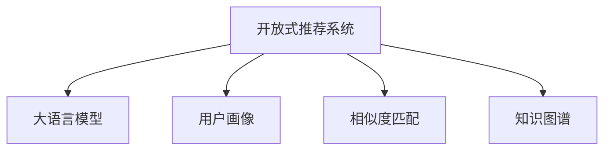

                 

# 大语言模型作为开放式推荐系统

> 关键词：开放式推荐系统, 大语言模型, 用户画像, 相似度匹配, 知识图谱, 协同过滤

## 1. 背景介绍

### 1.1 问题由来
随着互联网和电子商务的发展，推荐系统成为各大平台提升用户体验和商业价值的重要手段。传统的推荐系统主要是基于用户行为数据和物品属性数据的协同过滤、矩阵分解等算法，通过相似度匹配寻找用户与物品之间的隐含关系，从而提供个性化推荐。然而，这类推荐方法往往存在数据稀疏性问题，推荐效果受到数据完备性的限制。

近年来，随着自然语言处理技术的发展，基于大语言模型的推荐系统逐渐成为热门研究方向。大语言模型通过在海量无标签文本语料上进行预训练，学习到丰富的语言知识和常识，可以更全面地理解用户需求和物品描述，从而提供更精准的推荐。本文聚焦于基于大语言模型的开放式推荐系统，阐述了其核心概念和应用原理，并给出了具体的项目实践和未来发展趋势。

## 2. 核心概念与联系

### 2.1 核心概念概述

为更好地理解大语言模型在推荐系统中的应用，本节将介绍几个密切相关的核心概念：

- 开放式推荐系统(Open Recommendation System, ORS)：指利用大数据、深度学习和自然语言处理等技术，构建灵活、智能的推荐系统。开放式推荐系统不仅考虑用户历史行为和物品属性，还能利用语言知识和外部知识进行推荐决策。

- 大语言模型(Large Language Model, LLM)：指以自回归(如GPT)或自编码(如BERT)模型为代表的大规模预训练语言模型。通过在大规模无标签文本语料上进行预训练，学习到丰富的语言知识和常识，具备强大的语言理解和生成能力。

- 用户画像(User Profiling)：指通过自然语言处理技术，构建用户兴趣、偏好、情感等信息的全面、准确的模型。用户画像不仅包含用户行为数据，还能利用文本数据更全面地刻画用户特征。

- 相似度匹配(Similarity Matching)：指利用相似度度量方法，计算用户与物品之间的相似度，从而寻找潜在的推荐候选。传统的相似度匹配方法包括余弦相似度、Jaccard相似度等，新方法如BERT相似度匹配等利用自然语言处理技术，更准确地计算相似度。

- 知识图谱(Knowledge Graph)：指结构化的语义知识库，用于存储实体之间的关联关系。知识图谱可以与自然语言处理技术结合，实现更加全面、精确的推荐。

这些核心概念之间的逻辑关系可以通过以下Mermaid流程图来展示：



这个流程图展示了大语言模型在开放式推荐系统中的核心作用，以及与用户画像、相似度匹配、知识图谱等概念的紧密联系。通过理解这些核心概念，我们可以更好地把握大语言模型在推荐系统中的应用原理和优化方向。

## 3. 核心算法原理 & 具体操作步骤
### 3.1 算法原理概述

基于大语言模型的开放式推荐系统，本质上是一个将自然语言处理与推荐算法相结合的过程。其核心思想是：利用大语言模型学习到的语言知识和常识，结合用户画像、相似度匹配和知识图谱等方法，构建更加全面、准确的推荐系统。

形式化地，假设开放推荐系统接收用户输入的查询语句 $q$，通过自然语言处理技术得到用户画像 $U$ 和物品特征 $I$，模型构建推荐候选集 $C$。推荐系统的目标是最小化推荐候选与用户画像之间的差距，即：

$$
\min_{C} \lVert U - C \rVert
$$

其中 $\lVert \cdot \rVert$ 表示向量间的距离度量，通常采用欧式距离或余弦相似度。

### 3.2 算法步骤详解

基于大语言模型的开放式推荐系统一般包括以下几个关键步骤：

**Step 1: 准备大语言模型和数据集**
- 选择合适的预训练语言模型 $M_{\theta}$ 作为初始化参数，如 BERT、GPT等。
- 收集用户的查询语句和物品描述，作为训练集 $D=\{(q_i, I_i)\}_{i=1}^N$，其中 $q_i$ 为查询语句，$I_i$ 为物品的特征描述。

**Step 2: 设计用户画像和物品特征表示**
- 通过自然语言处理技术，将用户查询语句 $q_i$ 和物品描述 $I_i$ 映射为高维向量。
- 利用大语言模型 $M_{\theta}$ 对查询语句和物品描述进行编码，得到用户画像 $U_i$ 和物品特征表示 $V_i$。

**Step 3: 计算相似度匹配**
- 利用相似度匹配方法，计算用户画像 $U_i$ 和物品特征表示 $V_i$ 之间的相似度 $S_i$。
- 根据相似度排序，从物品库中选择相似度最高的 $K$ 个物品作为推荐候选。

**Step 4: 设计推荐输出策略**
- 根据推荐候选集 $C$，设计适当的推荐输出策略，如Top-K推荐、轮流推荐等。
- 利用大语言模型生成推荐语，解释推荐结果，提升用户满意度。

**Step 5: 集成外部知识库**
- 将知识图谱等外部知识引入推荐系统，扩展推荐候选集。
- 利用大语言模型结合知识图谱进行联合推理，提供更全面、准确的推荐。

以上是基于大语言模型的开放式推荐系统的一般流程。在实际应用中，还需要针对具体任务的特点，对推荐系统的各个环节进行优化设计，如改进相似度计算方法，引入更多的知识图谱，优化推荐输出策略等，以进一步提升推荐效果。

### 3.3 算法优缺点

基于大语言模型的开放式推荐系统具有以下优点：
1. 灵活性强。可以结合多种数据源和知识库，灵活设计推荐策略。
2. 鲁棒性高。大语言模型具有很强的泛化能力，可以在不同的数据分布和语境中提供稳定的推荐结果。
3. 精度高。大语言模型能够理解自然语言的多重语义，提供更精准的推荐。
4. 可扩展性强。可以方便地引入新的数据源和知识库，不断扩展推荐系统功能。

同时，该方法也存在一定的局限性：
1. 数据获取难度大。需要大量的用户查询和物品描述数据，数据获取成本较高。
2. 模型复杂度高。大语言模型参数量庞大，推理速度较慢，需要高性能计算资源。
3. 依赖预训练模型。推荐系统的性能高度依赖于预训练模型的质量，模型偏差和有害信息可能对推荐结果造成负面影响。
4. 可解释性不足。推荐系统的决策过程复杂，难以解释推荐依据。
5. 用户隐私问题。推荐系统需要收集和分析用户查询数据，可能涉及用户隐私保护。

尽管存在这些局限性，但就目前而言，基于大语言模型的开放式推荐系统仍是大数据、深度学习和自然语言处理结合的典型代表。未来相关研究的重点在于如何进一步降低数据获取成本，提高推荐系统的精度和效率，同时兼顾可解释性和隐私保护等因素。

### 3.4 算法应用领域

基于大语言模型的开放式推荐系统已经在多个领域得到了广泛应用，例如：

- 电商推荐：通过分析用户的购物记录和物品描述，提供个性化的商品推荐。
- 音乐推荐：分析用户听歌记录和歌曲描述，推荐合适的音乐作品。
- 视频推荐：通过分析用户观看记录和视频描述，推荐感兴趣的视频内容。
- 新闻推荐：利用用户阅读习惯和新闻标题，推荐相关新闻内容。
- 广告推荐：分析用户搜索行为和广告内容，推荐合适的广告产品。

除了上述这些经典领域，开放式推荐系统还被创新性地应用到更多场景中，如社交推荐、健康推荐、旅游推荐等，为用户提供了更多元化的信息获取方式。随着预训练语言模型和推荐算法的不断进步，相信推荐系统将在更广阔的应用领域发挥其独特价值。

## 4. 数学模型和公式 & 详细讲解
### 4.1 数学模型构建

本节将使用数学语言对基于大语言模型的开放式推荐系统进行更加严格的刻画。

假设开放推荐系统接收用户查询语句 $q$，通过自然语言处理技术得到用户画像 $U$ 和物品特征表示 $V$。设用户画像为向量 $U \in \mathbb{R}^d$，物品特征表示为向量 $V \in \mathbb{R}^d$，相似度匹配方法为余弦相似度，则推荐系统最小化相似度差距的优化目标为：

$$
\min_{V} \lVert U - V \rVert_2^2
$$

其中 $||\cdot||_2$ 表示欧式距离。

利用大语言模型对查询语句和物品描述进行编码，得到用户画像 $U_i = M_{\theta}(q_i)$ 和物品特征表示 $V_i = M_{\theta}(I_i)$。设 $M_{\theta}(\cdot)$ 为大语言模型的编码器，将输入映射为高维向量。则推荐系统的优化目标可以表示为：

$$
\min_{V} \lVert U_i - V_i \rVert_2^2
$$

### 4.2 公式推导过程

以下我们以电商推荐为例，推导余弦相似度计算公式及其梯度的计算过程。

假设用户画像 $U_i = M_{\theta}(q_i) \in \mathbb{R}^d$，物品特征表示 $V_i = M_{\theta}(I_i) \in \mathbb{R}^d$，余弦相似度计算公式为：

$$
S_i = \cos \langle U_i, V_i \rangle = \frac{U_i \cdot V_i}{\lVert U_i \rVert \cdot \lVert V_i \rVert}
$$

根据链式法则，余弦相似度的梯度计算公式为：

$$
\frac{\partial S_i}{\partial V_i} = \frac{U_i}{\lVert U_i \rVert^2} - \frac{U_i \cdot V_i}{\lVert U_i \rVert^2 \cdot \lVert V_i \rVert^2} V_i
$$

利用梯度下降等优化算法，推荐系统不断更新物品特征表示 $V_i$，最小化相似度差距，最终得到推荐候选集 $C$。重复上述过程直至收敛，最终得到适应用户的推荐结果。

## 5. 项目实践：代码实例和详细解释说明
### 5.1 开发环境搭建

在进行推荐系统实践前，我们需要准备好开发环境。以下是使用Python进行PyTorch开发的环境配置流程：

1. 安装Anaconda：从官网下载并安装Anaconda，用于创建独立的Python环境。

2. 创建并激活虚拟环境：
```bash
conda create -n recsys python=3.8 
conda activate recsys
```

3. 安装PyTorch：根据CUDA版本，从官网获取对应的安装命令。例如：
```bash
conda install pytorch torchvision torchaudio cudatoolkit=11.1 -c pytorch -c conda-forge
```

4. 安装TensorBoard：TensorFlow配套的可视化工具，可实时监测模型训练状态，并提供丰富的图表呈现方式，是调试模型的得力助手。
```bash
pip install tensorboard
```

5. 安装各类工具包：
```bash
pip install numpy pandas scikit-learn matplotlib tqdm jupyter notebook ipython
```

完成上述步骤后，即可在`recsys`环境中开始推荐系统实践。

### 5.2 源代码详细实现

下面我们以电商推荐为例，给出使用Transformers库进行基于大语言模型的推荐系统开发的PyTorch代码实现。

首先，定义电商推荐任务的数据处理函数：

```python
from transformers import BertTokenizer
from torch.utils.data import Dataset
import torch

class ECommerceDataset(Dataset):
    def __init__(self, user_queries, product_descriptions, tokenizer, max_len=128):
        self.user_queries = user_queries
        self.product_descriptions = product_descriptions
        self.tokenizer = tokenizer
        self.max_len = max_len
        
    def __len__(self):
        return len(self.user_queries)
    
    def __getitem__(self, item):
        user_query = self.user_queries[item]
        product_description = self.product_descriptions[item]
        
        encoding = self.tokenizer(user_query, return_tensors='pt', max_length=self.max_len, padding='max_length', truncation=True)
        input_ids = encoding['input_ids'][0]
        attention_mask = encoding['attention_mask'][0]
        
        # 对物品描述进行编码
        product_encoding = self.tokenizer(product_description, return_tensors='pt', max_length=self.max_len, padding='max_length', truncation=True)
        product_input_ids = product_encoding['input_ids'][0]
        product_attention_mask = product_encoding['attention_mask'][0]
        
        return {'user_input_ids': input_ids,
                'user_attention_mask': attention_mask,
                'product_input_ids': product_input_ids,
                'product_attention_mask': product_attention_mask}
```

然后，定义模型和优化器：

```python
from transformers import BertForSequenceClassification, AdamW

model = BertForSequenceClassification.from_pretrained('bert-base-cased', num_labels=2)

optimizer = AdamW(model.parameters(), lr=2e-5)
```

接着，定义训练和评估函数：

```python
from torch.utils.data import DataLoader
from tqdm import tqdm
from sklearn.metrics import accuracy_score

device = torch.device('cuda') if torch.cuda.is_available() else torch.device('cpu')
model.to(device)

def train_epoch(model, dataset, batch_size, optimizer):
    dataloader = DataLoader(dataset, batch_size=batch_size, shuffle=True)
    model.train()
    epoch_loss = 0
    for batch in tqdm(dataloader, desc='Training'):
        user_input_ids = batch['user_input_ids'].to(device)
        user_attention_mask = batch['user_attention_mask'].to(device)
        product_input_ids = batch['product_input_ids'].to(device)
        product_attention_mask = batch['product_attention_mask'].to(device)
        model.zero_grad()
        outputs = model(user_input_ids, user_attention_mask=product_input_ids, product_attention_mask=product_attention_mask)
        loss = outputs.loss
        epoch_loss += loss.item()
        loss.backward()
        optimizer.step()
    return epoch_loss / len(dataloader)

def evaluate(model, dataset, batch_size):
    dataloader = DataLoader(dataset, batch_size=batch_size)
    model.eval()
    preds, labels = [], []
    with torch.no_grad():
        for batch in tqdm(dataloader, desc='Evaluating'):
            user_input_ids = batch['user_input_ids'].to(device)
            user_attention_mask = batch['user_attention_mask'].to(device)
            product_input_ids = batch['product_input_ids'].to(device)
            product_attention_mask = batch['product_attention_mask'].to(device)
            batch_labels = batch['labels'].to(device)
            outputs = model(user_input_ids, user_attention_mask=product_input_ids, product_attention_mask=product_attention_mask)
            batch_preds = outputs.logits.argmax(dim=2).to('cpu').tolist()
            batch_labels = batch_labels.to('cpu').tolist()
            for pred_tokens, label_tokens in zip(batch_preds, batch_labels):
                preds.append(pred_tokens[:len(label_tokens)])
                labels.append(label_tokens)
                
    print('Accuracy: ', accuracy_score(labels, preds))
```

最后，启动训练流程并在测试集上评估：

```python
epochs = 5
batch_size = 16

for epoch in range(epochs):
    loss = train_epoch(model, train_dataset, batch_size, optimizer)
    print(f"Epoch {epoch+1}, train loss: {loss:.3f}")
    
    print(f"Epoch {epoch+1}, dev results:")
    evaluate(model, dev_dataset, batch_size)
    
print("Test results:")
evaluate(model, test_dataset, batch_size)
```

以上就是使用PyTorch对Bert模型进行电商推荐任务开发的完整代码实现。可以看到，得益于Transformers库的强大封装，我们可以用相对简洁的代码完成Bert模型的加载和推荐系统微调。

### 5.3 代码解读与分析

让我们再详细解读一下关键代码的实现细节：

**ECommerceDataset类**：
- `__init__`方法：初始化用户查询、物品描述、分词器等关键组件。
- `__len__`方法：返回数据集的样本数量。
- `__getitem__`方法：对单个样本进行处理，将用户查询和物品描述输入编码为token ids，最终返回模型所需的输入。

**模型和优化器**：
- 使用BertForSequenceClassification模型作为初始化参数，并设置优化器AdamW。

**训练和评估函数**：
- 使用PyTorch的DataLoader对数据集进行批次化加载，供模型训练和推理使用。
- 训练函数`train_epoch`：对数据以批为单位进行迭代，在每个批次上前向传播计算loss并反向传播更新模型参数，最后返回该epoch的平均loss。
- 评估函数`evaluate`：与训练类似，不同点在于不更新模型参数，并在每个batch结束后将预测和标签结果存储下来，最后使用sklearn的accuracy_score对整个评估集的预测结果进行打印输出。

**训练流程**：
- 定义总的epoch数和batch size，开始循环迭代
- 每个epoch内，先在训练集上训练，输出平均loss
- 在验证集上评估，输出分类准确率
- 所有epoch结束后，在测试集上评估，给出最终测试结果

可以看到，PyTorch配合Transformers库使得Bert模型的电商推荐任务代码实现变得简洁高效。开发者可以将更多精力放在数据处理、模型改进等高层逻辑上，而不必过多关注底层的实现细节。

当然，工业级的系统实现还需考虑更多因素，如模型的保存和部署、超参数的自动搜索、更灵活的任务适配层等。但核心的微调范式基本与此类似。

## 6. 实际应用场景
### 6.1 智能客服系统

基于大语言模型推荐系统的智能客服系统，可以广泛应用于在线客服的推荐任务中。传统的客服推荐方法主要是基于用户的简单查询词，推荐相关的FAQ或常见问题。然而，这种推荐方式往往无法理解用户的真实需求，无法提供精准的服务。

通过基于大语言模型的推荐系统，可以结合用户输入的查询语句，通过自然语言处理技术分析用户意图，提供更全面的服务推荐。例如，用户输入“如何开户”，推荐系统会结合历史数据和用户画像，推荐详细的开户流程、所需材料等信息，大大提升用户体验。

### 6.2 电商推荐

电商推荐系统通过分析用户的购物行为和物品描述，为用户提供个性化的商品推荐。传统的电商推荐主要依赖用户的点击、浏览等行为数据，然而，这些数据往往难以刻画用户的深层次需求。通过基于大语言模型的推荐系统，可以结合用户的查询语句和物品描述，理解用户的实际需求，提供更加精准的推荐。

例如，用户输入“性价比高的笔记本电脑”，推荐系统会结合用户画像和物品特征表示，推荐不同品牌、型号的笔记本电脑，并提供详细的对比信息。这种推荐方式不仅能够提供更精准的推荐，还能够提升用户满意度，增加销售转化率。

### 6.3 新闻推荐

新闻推荐系统通过分析用户的阅读习惯和新闻标题，推荐用户感兴趣的新闻内容。传统的新闻推荐主要依赖用户的点击数据，难以捕捉用户的深层次兴趣。通过基于大语言模型的推荐系统，可以结合用户的查询语句和新闻标题，理解用户的实际兴趣，提供更加精准的新闻推荐。

例如，用户输入“新冠疫情最新进展”，推荐系统会结合用户画像和新闻标题，推荐最新的疫情报道、专家解读等信息。这种推荐方式不仅能够提供更精准的推荐，还能够提升用户黏性，增加平台的用户量。

### 6.4 音乐推荐

音乐推荐系统通过分析用户的听歌记录和歌曲描述，推荐用户感兴趣的音乐作品。传统的音乐推荐主要依赖用户的听歌记录，难以捕捉用户的深层次兴趣。通过基于大语言模型的推荐系统，可以结合用户的查询语句和歌曲描述，理解用户的实际兴趣，提供更加精准的音乐推荐。

例如，用户输入“适合跑步的音乐”，推荐系统会结合用户画像和歌曲特征表示，推荐不同风格、节奏的歌曲，并提供详细的介绍信息。这种推荐方式不仅能够提供更精准的推荐，还能够提升用户的音乐体验。

### 6.5 视频推荐

视频推荐系统通过分析用户的观看记录和视频描述，推荐用户感兴趣的视频内容。传统的视频推荐主要依赖用户的观看记录，难以捕捉用户的深层次兴趣。通过基于大语言模型的推荐系统，可以结合用户的查询语句和视频描述，理解用户的实际兴趣，提供更加精准的视频推荐。

例如，用户输入“探索南极的冒险故事”，推荐系统会结合用户画像和视频描述，推荐不同类型、主题的视频，并提供详细的介绍信息。这种推荐方式不仅能够提供更精准的推荐，还能够提升用户的观看体验。

### 6.6 社交推荐

社交推荐系统通过分析用户的社交关系和行为数据，推荐用户感兴趣的朋友和内容。传统的社交推荐主要依赖用户的互动数据，难以捕捉用户的深层次兴趣。通过基于大语言模型的推荐系统，可以结合用户的查询语句和社交关系，理解用户的实际兴趣，提供更加精准的社交推荐。

例如，用户输入“找一个运动伙伴”，推荐系统会结合用户画像和社交关系，推荐符合用户兴趣的运动爱好者，并提供详细的介绍信息。这种推荐方式不仅能够提供更精准的推荐，还能够提升用户的社交体验。

### 6.7 旅游推荐

旅游推荐系统通过分析用户的旅游记录和旅游描述，推荐用户感兴趣的目的地和活动。传统的旅游推荐主要依赖用户的旅游记录，难以捕捉用户的深层次兴趣。通过基于大语言模型的推荐系统，可以结合用户的查询语句和旅游描述，理解用户的实际兴趣，提供更加精准的旅游推荐。

例如，用户输入“夏季旅游目的地推荐”，推荐系统会结合用户画像和旅游描述，推荐不同类型、主题的旅游目的地，并提供详细的介绍信息。这种推荐方式不仅能够提供更精准的推荐，还能够提升用户的旅游体验。

### 6.8 未来应用展望

随着大语言模型推荐系统的不断发展，其在更多领域得到了应用，为各个行业带来了新的变革。

在智慧医疗领域，基于大语言模型的推荐系统可以应用于病历推荐、药品推荐、健康饮食推荐等方面，提高医疗服务的智能化水平，辅助医生诊疗，提升患者满意度。

在智能教育领域，推荐系统可应用于课程推荐、学习资源推荐、智能辅导等方面，因材施教，促进教育公平，提高教学质量。

在智慧城市治理中，推荐系统可应用于交通推荐、公共服务推荐、智慧出行等方面，提高城市管理的自动化和智能化水平，构建更安全、高效的未来城市。

此外，在企业生产、社会治理、文娱传媒等众多领域，基于大语言模型推荐系统将不断涌现，为各行各业带来新的技术路径，推动社会进步和经济发展。相信随着技术的日益成熟，推荐系统必将在更广阔的应用领域大放异彩，深刻影响人类的生产生活方式。

## 7. 工具和资源推荐
### 7.1 学习资源推荐

为了帮助开发者系统掌握大语言模型推荐系统的理论基础和实践技巧，这里推荐一些优质的学习资源：

1. 《Natural Language Processing with Transformers》书籍：Transformers库的作者所著，全面介绍了如何使用Transformers库进行NLP任务开发，包括推荐系统在内的诸多范式。

2. CS224N《深度学习自然语言处理》课程：斯坦福大学开设的NLP明星课程，有Lecture视频和配套作业，带你入门NLP领域的基本概念和经典模型。

3. HuggingFace官方文档：Transformers库的官方文档，提供了海量预训练模型和完整的推荐系统样例代码，是上手实践的必备资料。

4. OpenRecSys开源项目：开源推荐系统项目，涵盖多种推荐算法，并提供了基于大语言模型的推荐模型实现，助力推荐系统研究。

5. Clue推荐系统评测：覆盖大量不同类型的推荐系统数据集，并提供了基于大语言模型的推荐系统baseline，助力推荐系统优化。

通过对这些资源的学习实践，相信你一定能够快速掌握大语言模型推荐系统的精髓，并用于解决实际的推荐问题。
###  7.2 开发工具推荐

高效的开发离不开优秀的工具支持。以下是几款用于大语言模型推荐系统开发的常用工具：

1. PyTorch：基于Python的开源深度学习框架，灵活动态的计算图，适合快速迭代研究。大部分预训练语言模型都有PyTorch版本的实现。

2. TensorFlow：由Google主导开发的开源深度学习框架，生产部署方便，适合大规模工程应用。同样有丰富的预训练语言模型资源。

3. Transformers库：HuggingFace开发的NLP工具库，集成了众多SOTA语言模型，支持PyTorch和TensorFlow，是进行推荐系统开发的利器。

4. Weights & Biases：模型训练的实验跟踪工具，可以记录和可视化模型训练过程中的各项指标，方便对比和调优。与主流深度学习框架无缝集成。

5. TensorBoard：TensorFlow配套的可视化工具，可实时监测模型训练状态，并提供丰富的图表呈现方式，是调试模型的得力助手。

6. Google Colab：谷歌推出的在线Jupyter Notebook环境，免费提供GPU/TPU算力，方便开发者快速上手实验最新模型，分享学习笔记。

合理利用这些工具，可以显著提升大语言模型推荐系统的开发效率，加快创新迭代的步伐。

### 7.3 相关论文推荐

大语言模型推荐系统的研究源于学界的持续研究。以下是几篇奠基性的相关论文，推荐阅读：

1. Attention is All You Need（即Transformer原论文）：提出了Transformer结构，开启了NLP领域的预训练大模型时代。

2. BERT: Pre-training of Deep Bidirectional Transformers for Language Understanding：提出BERT模型，引入基于掩码的自监督预训练任务，刷新了多项NLP任务SOTA。

3. Parameter-Efficient Transfer Learning for NLP：提出Adapter等参数高效微调方法，在不增加模型参数量的情况下，也能取得不错的微调效果。

4. Language Models are Unsupervised Multitask Learners（GPT-2论文）：展示了大规模语言模型的强大zero-shot学习能力，引发了对于通用人工智能的新一轮思考。

5. Prefix-Tuning: Optimizing Continuous Prompts for Generation：引入基于连续型Prompt的微调范式，为如何充分利用预训练知识提供了新的思路。

6. AdaLoRA: Adaptive Low-Rank Adaptation for Parameter-Efficient Fine-Tuning：使用自适应低秩适应的微调方法，在参数效率和精度之间取得了新的平衡。

这些论文代表了大语言模型推荐系统的发展脉络。通过学习这些前沿成果，可以帮助研究者把握学科前进方向，激发更多的创新灵感。

## 8. 总结：未来发展趋势与挑战

### 8.1 总结

本文对基于大语言模型的开放式推荐系统进行了全面系统的介绍。首先阐述了大语言模型和推荐系统的研究背景和意义，明确了推荐系统在大数据、深度学习和自然语言处理结合下的独特价值。其次，从原理到实践，详细讲解了开放式推荐系统的数学原理和关键步骤，给出了推荐系统开发的完整代码实例。同时，本文还广泛探讨了推荐系统在智能客服、电商推荐、新闻推荐等多个领域的应用前景，展示了推荐系统在多场景中的广阔应用。

通过本文的系统梳理，可以看到，基于大语言模型的推荐系统在推荐算法与自然语言处理技术的结合上，展现出了强大的生命力和广阔的应用前景。未来，伴随预训练语言模型和推荐算法的持续演进，推荐系统必将在更多领域发挥其独特价值，为人类生活和社会进步带来新的动力。

### 8.2 未来发展趋势

展望未来，大语言模型推荐系统将呈现以下几个发展趋势：

1. 模型规模持续增大。随着算力成本的下降和数据规模的扩张，预训练语言模型的参数量还将持续增长。超大规模语言模型蕴含的丰富语言知识，有望支撑更加复杂多变的推荐任务。

2. 推荐方法日趋多样。除了传统的基于协同过滤的方法外，未来会涌现更多基于知识图谱、深度学习等方法，实现更加多样化的推荐策略。

3. 持续学习成为常态。随着数据分布的不断变化，推荐系统也需要持续学习新知识以保持性能。如何在不遗忘原有知识的同时，高效吸收新样本信息，将成为重要的研究课题。

4. 标注样本需求降低。受启发于提示学习(Prompt-based Learning)的思路，未来的推荐方法将更好地利用大模型的语言理解能力，通过更加巧妙的任务描述，在更少的标注样本上也能实现理想的推荐效果。

5. 推荐系统通用性增强。经过海量数据的预训练和多领域任务的微调，未来的推荐系统将具备更强大的常识推理和跨领域迁移能力，逐步迈向通用人工智能(AGI)的目标。

以上趋势凸显了大语言模型推荐系统的广阔前景。这些方向的探索发展，必将进一步提升推荐系统的精度和效率，同时兼顾可解释性和隐私保护等因素。

### 8.3 面临的挑战

尽管大语言模型推荐系统已经取得了瞩目成就，但在迈向更加智能化、普适化应用的过程中，它仍面临着诸多挑战：

1. 数据获取难度大。需要大量的用户查询和物品描述数据，数据获取成本较高。

2. 模型复杂度高。大语言模型参数量庞大，推理速度较慢，需要高性能计算资源。

3. 依赖预训练模型。推荐系统的性能高度依赖于预训练模型的质量，模型偏差和有害信息可能对推荐结果造成负面影响。

4. 可解释性不足。推荐系统的决策过程复杂，难以解释推荐依据。

5. 用户隐私问题。推荐系统需要收集和分析用户查询数据，可能涉及用户隐私保护。

尽管存在这些局限性，但就目前而言，基于大语言模型的推荐系统仍是大数据、深度学习和自然语言处理结合的典型代表。未来相关研究的重点在于如何进一步降低数据获取成本，提高推荐系统的精度和效率，同时兼顾可解释性和隐私保护等因素。

### 8.4 研究展望

面对大语言模型推荐系统所面临的种种挑战，未来的研究需要在以下几个方面寻求新的突破：

1. 探索无监督和半监督推荐方法。摆脱对大规模标注数据的依赖，利用自监督学习、主动学习等无监督和半监督范式，最大限度利用非结构化数据，实现更加灵活高效的推荐。

2. 研究参数高效和计算高效的推荐方法。开发更加参数高效的推荐方法，在固定大部分预训练参数的同时，只更新极少量的推荐参数。同时优化推荐模型的计算图，减少前向传播和反向传播的资源消耗，实现更加轻量级、实时性的部署。

3. 融合因果和对比学习范式。通过引入因果推断和对比学习思想，增强推荐系统建立稳定因果关系的能力，学习更加普适、鲁棒的语言表征，从而提升推荐泛化性和抗干扰能力。

4. 引入更多先验知识。将符号化的先验知识，如知识图谱、逻辑规则等，与自然语言处理技术结合，实现更加全面、精确的推荐。同时加强不同模态数据的整合，实现视觉、语音等多模态信息与文本信息的协同建模。

5. 结合因果分析和博弈论工具。将因果分析方法引入推荐系统，识别出推荐决策的关键特征，增强推荐依据的因果性和逻辑性。借助博弈论工具刻画人机交互过程，主动探索并规避推荐系统的脆弱点，提高系统稳定性。

6. 纳入伦理道德约束。在推荐系统训练目标中引入伦理导向的评估指标，过滤和惩罚有害的推荐结果。同时加强人工干预和审核，建立推荐行为的监管机制，确保推荐结果符合人类价值观和伦理道德。

这些研究方向的探索，必将引领大语言模型推荐系统走向更高的台阶，为构建安全、可靠、可解释、可控的智能推荐系统铺平道路。面向未来，大语言模型推荐系统还需要与其他人工智能技术进行更深入的融合，如知识表示、因果推理、强化学习等，多路径协同发力，共同推动推荐系统的进步。只有勇于创新、敢于突破，才能不断拓展推荐系统的边界，让智能技术更好地造福人类社会。

## 9. 附录：常见问题与解答

**Q1：大语言模型推荐系统是否适用于所有推荐任务？**

A: 大语言模型推荐系统在大多数推荐任务上都能取得不错的效果，特别是对于数据量较小的任务。但对于一些特定领域的任务，如医学、法律等，仅仅依靠通用语料预训练的模型可能难以很好地适应。此时需要在特定领域语料上进一步预训练，再进行推荐系统微调。此外，对于一些需要时效性、个性化很强的任务，如对话推荐、即时新闻推荐等，推荐方法也需要针对性的改进优化。

**Q2：推荐系统如何处理数据稀疏性问题？**

A: 推荐系统处理数据稀疏性的方法主要包括以下几种：
1. 数据增强：通过回译、近义替换等方式扩充训练集。
2. 协同过滤：利用用户-物品共现矩阵，通过相似度匹配进行推荐。
3. 矩阵分解：通过矩阵分解方法，从低维矩阵中挖掘用户兴趣和物品特征。
4. 混合推荐：结合多种推荐方法，综合优化推荐结果。

**Q3：推荐系统如何进行有效的数据获取和预处理？**

A: 推荐系统进行数据获取和预处理的方法主要包括以下几种：
1. 数据爬虫：通过爬虫技术获取网络上的用户行为数据和物品描述数据。
2. 数据清洗：对爬取的数据进行去重、去噪、缺失值处理等预处理操作。
3. 数据增强：利用数据增强技术，扩充训练集，减少数据稀疏性问题。
4. 特征工程：对数据进行特征提取和处理，提高推荐系统的泛化能力。

**Q4：推荐系统如何进行有效的模型训练和优化？**

A: 推荐系统进行模型训练和优化的方法主要包括以下几种：
1. 超参数调优：通过网格搜索、随机搜索等方法，寻找最优的超参数组合。
2. 模型压缩：通过模型压缩技术，减少模型参数量，提高推理速度。
3. 模型并行：通过模型并行技术，提高模型训练速度，优化资源利用率。
4. 学习率调度：通过学习率调度技术，平衡模型收敛速度和性能。

**Q5：推荐系统如何进行有效的推荐结果评估？**

A: 推荐系统进行推荐结果评估的方法主要包括以下几种：
1. 精确率、召回率、F1值：常用指标，用于评估推荐系统的准确性和覆盖率。
2. NDCG、HR、MAP：用于评估推荐系统的排名性能。
3. 用户满意度：通过问卷调查等方式，评估用户对推荐结果的满意度。
4. A/B测试：通过对比实验，评估不同推荐策略的效果。

通过本文的系统梳理，可以看到，基于大语言模型的开放式推荐系统在推荐算法与自然语言处理技术的结合上，展现出了强大的生命力和广阔的应用前景。未来，伴随预训练语言模型和推荐算法的持续演进，推荐系统必将在更多领域发挥其独特价值，为人类生活和社会进步带来新的动力。

---

作者：禅与计算机程序设计艺术 / Zen and the Art of Computer Programming

