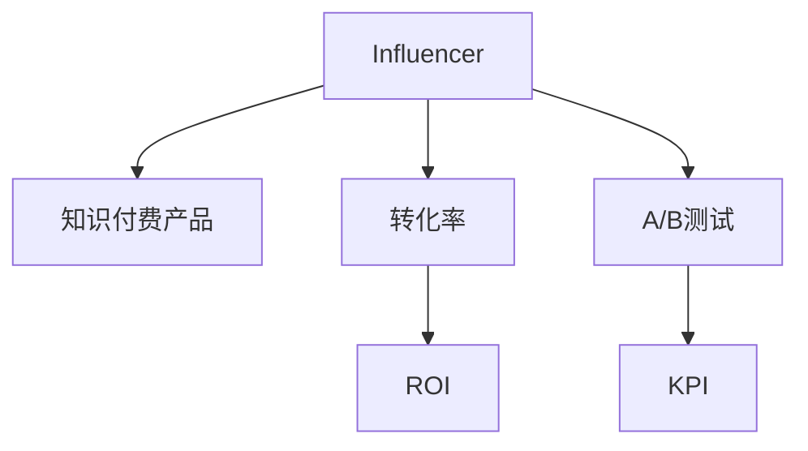

                 

# 如何利用influencer营销推广知识付费产品

在知识付费行业，如何有效推广自己的产品和服务，直接影响到收入和用户增长。传统的营销手段，如广告投放、SEO优化等，虽然有效，但成本高昂且效果难以持久。相比之下，利用Influencer（影响力者）营销，不仅成本低廉，还能带来更高的用户参与度和信任度。本文将从原理到实践，全面剖析Influencer营销推广知识付费产品的核心技术和操作方法，帮助读者更好地理解和运用这一高效的营销策略。

## 1. 背景介绍

### 1.1 问题由来
随着知识付费的兴起，越来越多的平台和个人通过线上线下渠道销售自己的课程和内容。传统营销手段如广告投放和SEO优化成本高昂，效果难以持久。相比之下，利用Influencer营销推广产品，不仅成本低廉，还能带来更高的用户参与度和信任度。

### 1.2 问题核心关键点
Influencer营销的核心在于选择具有高影响力的目标用户，通过其对产品的宣传，提高产品的曝光度和用户转化率。这一过程包括以下几个关键步骤：
1. **选择合适的Influencer**：确定与产品定位和受众相匹配的影响力者。
2. **建立合作关系**：与Influencer沟通并达成合作意向。
3. **制定营销方案**：制定具体的推广计划，如推广内容、时间节点、预算分配等。
4. **执行与监测**：执行推广计划，并通过数据分析跟踪效果，不断调整优化。

### 1.3 问题研究意义
Influencer营销在知识付费产品推广中具有重要的战略意义：
1. **降低营销成本**：相较于传统营销手段，Influencer营销成本低廉，适合初创平台和小众课程。
2. **提升用户信任**：Influencer的推荐比广告更具有说服力，能够建立用户信任，提高转化率。
3. **多渠道曝光**：Influencer通常拥有广泛的社交媒体和粉丝基础，能够在多个渠道进行推广。
4. **数据驱动优化**：通过数据分析实时调整推广策略，提高投资回报率。

## 2. 核心概念与联系

### 2.1 核心概念概述

为了更好地理解Influencer营销的原理和应用，本节将介绍几个关键概念及其相互联系：

- **Influencer**：具有高度影响力，能够吸引和影响大量受众的目标用户。
- **知识付费产品**：通过线上线下渠道，以付费形式提供有价值的知识、课程和技能的学习平台。
- **转化率**：在Influencer推广后，实际购买产品的用户数与总曝光用户数的比例。
- **ROI（投资回报率）**：Influencer营销带来的实际收益与投入成本的比率。
- **A/B测试**：通过对比不同的推广方案，选择最优策略的方法。
- **KPI（关键绩效指标）**：用于衡量Influencer营销效果的各项指标，如曝光量、互动率、转化率等。

这些概念之间的联系可以通过以下Mermaid流程图来展示：



这个流程图展示了下游任务Influencer营销的关键概念及其相互关系：

1. Influencer是推广的主体，负责提升知识付费产品的曝光度和信任度。
2. 转化率是衡量Influencer营销效果的直接指标，反映了产品实际购买的用户比例。
3. ROI是评估Influencer营销投资效益的重要指标，反映了实际收益与成本的关系。
4. A/B测试是优化推广策略的关键工具，通过对比不同方案，选择最有效的推广手段。
5. KPI是衡量推广效果的依据，通过数据分析跟踪各项关键指标的变化。

## 3. 核心算法原理 & 具体操作步骤

### 3.1 算法原理概述

Influencer营销的算法原理可以简要概括为：通过选择与产品定位和受众相匹配的Influencer，制定科学的推广计划，并借助A/B测试不断优化推广策略，以最小的成本获取最大的曝光和收益。

具体而言，Influencer营销的算法包括以下几个关键步骤：

1. **Influencer选择**：确定与产品定位和受众相匹配的影响力者。
2. **合作方案制定**：与Influencer沟通并达成合作意向，制定具体的推广计划。
3. **推广执行与监测**：执行推广计划，并通过数据分析跟踪效果，不断调整优化。
4. **效果评估与反馈**：根据KPI等指标评估推广效果，对Influencer选择和推广策略进行反馈优化。

### 3.2 算法步骤详解

以下是Influencer营销推广知识付费产品的具体操作步骤：

#### 3.2.1 Influencer选择

1. **目标受众分析**：分析产品的目标受众群体，包括年龄、性别、职业、兴趣爱好等。
2. **Influencer筛选**：通过社交媒体、行业论坛等渠道，筛选出符合目标受众特征的Influencer。
3. **影响力评估**：利用第三方平台（如Social Blade、BuzzSumo等）评估Influencer的影响力指数、粉丝增长速度和互动率等。
4. **选择Influencer**：综合评估结果，选择最具影响力的Influencer进行合作。

#### 3.2.2 合作方案制定

1. **推广内容确定**：与Influencer沟通，确定推广内容，如产品介绍、用户评价、使用心得等。
2. **时间节点安排**：制定推广时间表，安排Influencer在不同时间节点发布推广内容。
3. **预算分配**：根据推广方式（如社交媒体、直播、视频等）分配推广预算。
4. **效果评估指标设定**：设定KPI指标，如曝光量、互动率、转化率等，作为效果评估依据。

#### 3.2.3 推广执行与监测

1. **内容创作与发布**：Influencer创作推广内容，并通过社交媒体等渠道发布。
2. **数据跟踪与分析**：利用第三方工具（如Google Analytics、社交媒体分析工具等）跟踪推广数据，如曝光量、互动率、点击率等。
3. **效果评估**：根据设定KPI评估推广效果，评估推广内容与受众反馈。
4. **优化调整**：根据评估结果，对推广内容、时间节点和预算分配进行调整，优化推广策略。

#### 3.2.4 效果评估与反馈

1. **ROI计算**：计算推广带来的实际收益与成本的比率，评估投资效益。
2. **用户反馈分析**：收集用户反馈，分析推广效果，优化产品内容和服务体验。
3. **策略调整**：根据数据分析结果，调整推广策略，进一步提升效果。

### 3.3 算法优缺点

Influencer营销推广知识付费产品具有以下优点：

1. **成本低廉**：相较于传统营销手段，Influencer营销成本低廉，适合初创平台和小众课程。
2. **用户信任度高**：Influencer的推荐比广告更具有说服力，能够建立用户信任，提高转化率。
3. **多渠道曝光**：Influencer通常拥有广泛的社交媒体和粉丝基础，能够在多个渠道进行推广。
4. **数据驱动优化**：通过数据分析实时调整推广策略，提高投资回报率。

同时，这一方法也存在一定的局限性：

1. **质量难以把控**：Influencer的质量和真实性难以把控，存在虚假宣传的风险。
2. **推广效果难以预测**：Influencer的影响力和受众特征各异，推广效果难以准确预测。
3. **合作成本高**：优质Influencer通常价格较高，成本投入较大。
4. **依赖关系复杂**：Influencer与产品的关系复杂，合作过程中可能存在矛盾和误解。

### 3.4 算法应用领域

Influencer营销在知识付费产品推广中得到了广泛应用，覆盖了从课程推广到品牌宣传的多个领域：

- **课程推广**：通过Influencer在社交媒体上推荐和介绍课程，吸引潜在用户。
- **品牌宣传**：利用Influencer在行业内传播品牌信息，提升品牌知名度。
- **用户转化**：借助Influencer的用户信任和推荐，提高用户购买和转化的成功率。
- **社交互动**：通过Influencer与用户互动，增强用户粘性和忠诚度。

此外，Influencer营销还应用于教育培训、职业认证、在线课程等多个领域，为知识付费产品的推广提供了新的思路和方法。

## 4. 数学模型和公式 & 详细讲解 & 举例说明

### 4.1 数学模型构建

Influencer营销的数学模型可以构建为以下形式：

设产品推广的总曝光量为 $X$，转化率为 $\eta$，平均每个Influencer带来的曝光量为 $x_i$，总预算为 $B$，每个Influencer的费用为 $c_i$，则Influencer营销带来的实际收益 $R$ 可以表示为：

$$
R = \eta \cdot \sum_{i=1}^n x_i \cdot p_i - \sum_{i=1}^n c_i
$$

其中 $p_i$ 为第 $i$ 个Influencer带来的实际转化用户数，$n$ 为参与推广的Influencer数量。

### 4.2 公式推导过程

1. **曝光量计算**：设每个Influencer推广的平均曝光量为 $x_i$，则总曝光量 $X$ 为：

$$
X = \sum_{i=1}^n x_i
$$

2. **转化率计算**：设每个Influencer推广的平均转化率为 $\eta_i$，则总转化率 $\eta$ 为：

$$
\eta = \frac{1}{n} \sum_{i=1}^n \eta_i
$$

3. **实际收益计算**：设每个Influencer推广的平均转化用户数为 $p_i$，则总实际收益 $R$ 为：

$$
R = \eta \cdot \sum_{i=1}^n p_i
$$

4. **成本计算**：设每个Influencer的费用为 $c_i$，则总预算 $B$ 为：

$$
B = \sum_{i=1}^n c_i
$$

### 4.3 案例分析与讲解

假设某知识付费平台推广一门课程，预算为 $10,000 元，计划邀请 5 位Influencer进行推广，每位Influencer的费用为 $2,000 元。设每位Influencer推广的平均曝光量为 $5,000$，平均转化率为 $0.01$，实际转化用户数为 $100$。

根据上述模型，计算Influencer营销带来的实际收益 $R$：

$$
R = 0.01 \cdot 5 \cdot 100 - 5 \cdot 2000 = 500 - 10000 = -9500
$$

这表明，当前的推广策略可能存在问题，需要进一步优化。

## 5. 项目实践：代码实例和详细解释说明

### 5.1 开发环境搭建

在进行Influencer营销推广的实践前，需要先准备好开发环境。以下是使用Python进行Influencer营销推广的环境配置流程：

1. 安装Python：从官网下载并安装Python 3.8。
2. 安装Pip：在命令行中输入 `python -m ensurepip --default-pip` 安装Pip。
3. 创建虚拟环境：
```bash
python -m venv influencer-env
source influencer-env/bin/activate
```
4. 安装相关库：
```bash
pip install beautifulsoup4 requests pandas matplotlib
```

### 5.2 源代码详细实现

以下是使用Python进行Influencer营销推广的代码实现，以提取和分析Influencer社交媒体上的推广数据为例：

```python
import requests
from bs4 import BeautifulSoup
import pandas as pd

# 提取Influencer的社交媒体推广数据
def extract_influencer_data(influencer_url):
    response = requests.get(influencer_url)
    soup = BeautifulSoup(response.text, 'html.parser')
    
    # 提取推广内容、曝光量、互动率等数据
    data = {}
    for tag in soup.find_all('div', class_='post'):
        title = tag.find('h2').text.strip()
        link = tag.find('a')['href']
        time = tag.find('time')['datetime']
         likes = tag.find('span', class_='like-count').text.strip()
         shares = tag.find('span', class_='share-count').text.strip()
         comments = tag.find('span', class_='comment-count').text.strip()
         data[title] = {
             'link': link,
             'time': time,
             'likes': int(likes),
             'shares': int(shares),
             'comments': int(comments)
         }
    
    # 保存数据到CSV文件
    df = pd.DataFrame(data.values())
    df.to_csv('influencer_data.csv', index=False)

# 分析Influencer推广效果
def analyze_influencer_data(data):
    # 计算平均曝光量、互动率等指标
    average_likes = data['likes'].mean()
    average_shares = data['shares'].mean()
    average_comments = data['comments'].mean()
    
    # 可视化效果分析
    import matplotlib.pyplot as plt
    plt.bar(data['title'], data['likes'], color='blue', label='Likes')
    plt.bar(data['title'], data['shares'], bottom=data['likes'], color='red', label='Shares')
    plt.bar(data['title'], data['comments'], bottom=data['likes']+data['shares'], color='green', label='Comments')
    plt.legend()
    plt.xlabel('Post Title')
    plt.ylabel('Number')
    plt.show()

# 测试代码
influencer_url = 'https://www.example.com/influencer'
extract_influencer_data(influencer_url)
analyze_influencer_data(pd.read_csv('influencer_data.csv'))
```

以上代码实现了提取和分析Influencer社交媒体推广数据的功能。开发者可以根据实际需求，进一步扩展功能，如数据可视化、效果评估等。

### 5.3 代码解读与分析

在代码中，我们使用了requests和BeautifulSoup库，提取了Influencer的推广数据，并利用Pandas进行数据处理和分析。具体实现过程如下：

1. `extract_influencer_data`函数：使用requests获取Influencer的社交媒体推广数据，使用BeautifulSoup解析HTML，提取每个推广内容的标题、链接、发布时间、点赞数、分享数和评论数，并保存到CSV文件中。

2. `analyze_influencer_data`函数：读取CSV文件中的数据，计算平均曝光量、互动率等指标，并使用matplotlib绘制柱状图，直观展示推广效果。

代码简洁明了，易于理解，能够满足基本的Influencer数据提取和分析需求。

## 6. 实际应用场景

### 6.1 课程推广

在课程推广中，可以通过Influencer在社交媒体上推荐和介绍课程，吸引潜在用户。例如，某知识付费平台邀请知名教师在Instagram上发布课程介绍视频，并搭配简洁明了的文字说明，吸引大量关注和转发，提高课程曝光率和转化率。

### 6.2 品牌宣传

利用Influencer在行业内传播品牌信息，提升品牌知名度。例如，某在线教育平台邀请多位知名教育专家在微博上分享自己的课程内容和教学心得，借助专家的影响力和信任度，提升品牌影响力。

### 6.3 用户转化

借助Influencer的用户信任和推荐，提高用户购买和转化的成功率。例如，某知识付费平台邀请多位忠实用户分享自己的学习体验和成果，借助用户的口碑效应，吸引更多潜在用户加入课程。

### 6.4 未来应用展望

未来，Influencer营销将在知识付费产品推广中发挥更大的作用。随着社交媒体的普及和用户信任度的提升，Influencer的影响力和作用将越来越重要。Influencer营销将不仅仅局限于社交媒体，还将在直播、视频、线下活动等多种渠道发挥作用。

## 7. 工具和资源推荐

### 7.1 学习资源推荐

为了帮助开发者系统掌握Influencer营销的理论基础和实践技巧，这里推荐一些优质的学习资源：

1. **《Influencer Marketing: How to Become a Social Media Star》**：详细介绍了Influencer营销的原理、策略和应用案例，是学习Influencer营销的必备资源。
2. **《Social Media Marketing All-in-One For Dummies》**：涵盖了社交媒体营销的全面知识，包括Influencer营销在内，适合入门学习。
3. **《Influencer Marketing: Creating Buzz, Generating Buzz, and Getting Results》**：介绍了Influencer营销的最新趋势和实践技巧，适合进阶学习。
4. **《Influencer Marketing Academy》**：提供系统化的Influencer营销课程，包括策略、工具和案例分析等，适合系统学习。

### 7.2 开发工具推荐

高效的Influencer营销开发离不开优秀的工具支持。以下是几款常用的Influencer营销开发工具：

1. **Hootsuite**：社交媒体管理工具，支持多平台统一管理和发布，适合批量管理和优化Influencer内容。
2. **BuzzSumo**：社交媒体分析工具，帮助分析Influencer的影响力和内容效果，支持数据可视化。
3. **Google Analytics**：网站流量分析工具，帮助跟踪Influencer推广的效果和转化率。
4. **KAZZOO**：社交媒体内容创作工具，支持多种格式和风格的内容制作，适合快速生成推广素材。

### 7.3 相关论文推荐

Influencer营销在学术界和业界已经得到了广泛研究。以下是几篇具有代表性的论文，推荐阅读：

1. **《The Influence of Social Media on Consumer Behavior》**：研究社交媒体对消费者行为的影响，包括Influencer对品牌认知和购买决策的影响。
2. **《Influencer Marketing: A Review of the Literature》**：综述了Influencer营销的研究进展，包括影响力和效果评估方法。
3. **《How Effective Are Influencers in Social Media?》**：评估Influencer营销的实际效果，包括ROI计算和效果评估指标。
4. **《A Comparative Study of Influencer Marketing Strategies》**：比较了不同Influencer营销策略的效果和适用场景，为选择推广方式提供参考。

## 8. 总结：未来发展趋势与挑战

### 8.1 总结

本文对Influencer营销推广知识付费产品的方法进行了全面系统的介绍。首先阐述了Influencer营销的背景和意义，明确了Influencer营销在知识付费推广中的战略价值。其次，从原理到实践，详细讲解了Influencer营销的数学模型和具体操作步骤，提供了完整的代码实现和分析解读。同时，本文还探讨了Influencer营销在实际应用中的多个场景，展示了其在推广知识付费产品中的广泛应用前景。最后，本文精选了Influencer营销的学习资源、开发工具和相关论文，力求为读者提供全方位的技术指引。

通过本文的系统梳理，可以看到，Influencer营销在知识付费产品推广中具有重要的战略意义，其低成本、高信任度和多渠道曝光等优势，使得Influencer营销成为知识付费推广的重要手段。未来，随着Influencer影响力的持续提升和社交媒体的普及，Influencer营销将在知识付费产品推广中发挥更大的作用。

### 8.2 未来发展趋势

展望未来，Influencer营销将呈现以下几个发展趋势：

1. **技术工具不断升级**：随着AI和大数据分析技术的发展，Influencer营销工具将更加智能化，能够自动优化推广方案，提高ROI。
2. **内容形式多样化**：Influencer营销将不仅仅局限于社交媒体，还将扩展到视频、直播、线下活动等多种形式。
3. **数据驱动决策**：Influencer营销将更加依赖数据驱动，通过实时跟踪和分析推广效果，不断优化推广策略。
4. **全球化推广**：随着社交媒体的全球化，Influencer营销将不再局限于本地市场，而是在全球范围内进行推广。
5. **社交电商融合**：Influencer营销将与社交电商融合，通过影响力者的推荐和推广，实现产品销售。

这些趋势将进一步推动Influencer营销的创新和应用，为知识付费产品推广提供更多可能性。

### 8.3 面临的挑战

尽管Influencer营销在知识付费产品推广中具有诸多优势，但在实际应用中仍面临以下挑战：

1. **质量难以把控**：Influencer的质量和真实性难以把控，存在虚假宣传的风险。
2. **推广效果难以预测**：Influencer的影响力和受众特征各异，推广效果难以准确预测。
3. **合作成本高**：优质Influencer通常价格较高，成本投入较大。
4. **依赖关系复杂**：Influencer与产品的关系复杂，合作过程中可能存在矛盾和误解。
5. **数据隐私和安全**：Influencer营销过程中涉及大量用户数据，数据隐私和安全问题需要重视。

### 8.4 研究展望

面对Influencer营销所面临的挑战，未来的研究需要在以下几个方面寻求新的突破：

1. **质量筛选和评估**：开发更智能的Influencer筛选工具，利用AI和大数据分析技术，实时评估Influencer的影响力和可信度。
2. **效果预测和优化**：利用机器学习和深度学习技术，建立Influencer营销效果的预测模型，优化推广策略。
3. **合作模式创新**：探索新的合作模式，如共享收益、平台分成等，降低合作成本。
4. **多渠道融合**：将Influencer营销与多种渠道融合，如社交媒体、直播、线下活动等，提升推广效果。
5. **数据隐私保护**：开发数据隐私保护技术，确保Influencer营销过程中的数据安全和用户隐私。

这些研究方向将进一步提升Influencer营销的质量和效果，为其在知识付费产品推广中的应用提供更多保障。总之，Influencer营销需要从数据、技术、合作模式等多个维度协同发力，才能实现其潜在的战略价值，推动知识付费产品推广的持续发展。

