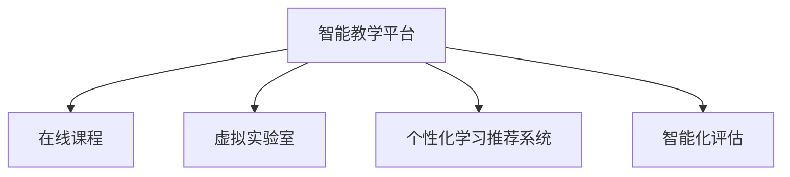
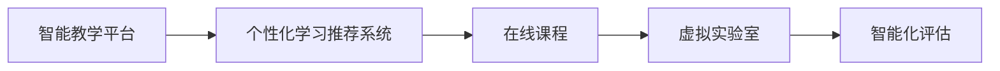

                 

## 1. 背景介绍

### 1.1 问题由来

在当今数字化、信息化的社会背景下，教育领域也面临着前所未有的变革和挑战。传统的教室讲授模式已经不能满足学生个性化、互动化的学习需求，而在线教育、智能教育等新兴形式又面临着教师资源不足、学习效果评估困难等问题。技术的创新应用，成为了教育创新的关键。

教育技术的发展，使得传统的教学手段和评估方式得以更新，教育资源的利用效率大幅提高，学生学习体验得到显著改善。然而，技术应用在提升教学效果的同时，也带来了新的挑战。如何有效整合技术资源，提升教师和学生对新技术的适应能力，是实现教育创新的关键。

### 1.2 问题核心关键点

教育技术的核心在于如何通过技术手段，为教育过程提供个性化、互动化的支持，提升教学效果和学习体验。技术在教育中的作用，不应该是替代传统的教师和课堂，而应该是辅助教学，提升教学效率，增强学习互动。

目前，教育技术的应用涉及多个方面，包括智能教学平台、在线课程、虚拟实验室、个性化学习推荐系统等。这些技术的成功应用，需要结合具体的教育场景，进行深入研究和实践。

### 1.3 问题研究意义

教育技术的发展，对于提升教育质量、促进教育公平、推动教育现代化具有重要意义。通过技术手段，可以实现以下目标：

1. **个性化学习**：根据学生的学习习惯、知识水平、兴趣爱好等，提供个性化的学习计划和资源。
2. **互动化教学**：通过虚拟现实、增强现实等技术，实现虚拟课堂、互动练习，增强学生的参与感。
3. **智能化评估**：利用数据分析技术，实时评估学生的学习效果，及时调整教学策略。
4. **教育资源的均衡分配**：通过技术手段，缓解优质教育资源不足的问题，促进教育公平。
5. **教师工作效率提升**：利用自动化工具，减轻教师的重复性工作，提高教学质量。

因此，深入研究教育技术的原理和应用方法，对于推动教育创新，提高教育质量，具有重要价值。

## 2. 核心概念与联系

### 2.1 核心概念概述

教育技术（Educational Technology, EdTech）是指在教育过程中应用的各种技术手段，包括但不限于计算机软件、智能硬件、移动终端、虚拟现实等。其核心目标是通过技术手段，优化教学过程，提升教育质量，促进教育公平。

教育技术的核心概念包括以下几个方面：

- **智能教学平台**：利用大数据、人工智能等技术，提供个性化的学习方案和互动化的学习体验。
- **在线课程**：通过网络平台，提供丰富的教学资源和互动方式，实现教育资源的共享和普及。
- **虚拟实验室**：利用虚拟现实技术，创建虚拟实验环境，支持学生进行实验操作和数据采集。
- **个性化学习推荐系统**：通过机器学习算法，分析学生行为数据，推荐适合的学习内容和资源。
- **智能化评估**：利用数据分析技术，实时评估学生的学习效果，提供个性化反馈和建议。

这些概念之间的逻辑关系可以通过以下Mermaid流程图来展示：



### 2.2 核心概念原理和架构的 Mermaid 流程图



以上流程图示意了智能教学平台如何通过个性化学习推荐、在线课程、虚拟实验室和智能化评估等子系统，提供全方位的教育支持。

## 3. 核心算法原理 & 具体操作步骤

### 3.1 算法原理概述

教育技术的核心算法原理涉及多个方面，包括机器学习、数据分析、自然语言处理、计算机视觉等。这里以个性化学习推荐系统为例，介绍其核心算法原理。

个性化学习推荐系统的目标是，根据学生的学习行为数据，推荐适合的学习内容和资源，以提升学习效果。其核心算法原理包括：

1. **数据采集与处理**：收集学生的学习行为数据，如课程观看时长、练习成绩、阅读笔记等。
2. **特征工程**：从学习行为数据中提取特征，如课程难度、知识点掌握程度、学习兴趣等。
3. **模型训练**：利用机器学习算法，训练推荐模型。常用的算法包括协同过滤、矩阵分解、深度学习等。
4. **推荐计算**：根据训练好的推荐模型，计算每个课程对每个学生的推荐分数，筛选出最合适的学习内容。

### 3.2 算法步骤详解

以下以深度学习在个性化学习推荐系统中的应用为例，详细讲解其算法步骤：

**Step 1: 数据采集与处理**

- 收集学生的学习行为数据，如在线课程的观看时长、练习题目的完成情况、阅读笔记等。
- 对数据进行清洗和预处理，去除噪声和异常值，保证数据质量。
- 将数据转化为模型所需的格式，如将文本数据转化为数值特征。

**Step 2: 特征工程**

- 从学习行为数据中提取特征，如课程难度、知识点掌握程度、学习兴趣等。
- 使用TF-IDF、词向量等方法，将文本数据转化为数值特征。
- 进行特征选择，筛选出对学习效果影响较大的特征。

**Step 3: 模型训练**

- 选择深度学习算法，如神经网络、卷积神经网络（CNN）、循环神经网络（RNN）等。
- 对模型进行训练，调整超参数，如学习率、批大小等。
- 使用交叉验证等技术，评估模型性能，防止过拟合。

**Step 4: 推荐计算**

- 使用训练好的推荐模型，对每个学生计算推荐分数。
- 根据推荐分数，筛选出最合适的学习内容，生成推荐列表。
- 对推荐结果进行展示和反馈，收集学生反馈数据，进一步优化推荐模型。

### 3.3 算法优缺点

个性化学习推荐系统具有以下优点：

1. **提高学习效率**：根据学生的学习习惯和知识水平，推荐适合的学习内容，减少无效学习。
2. **个性化推荐**：能够提供个性化的学习方案，满足不同学生的学习需求。
3. **实时反馈**：通过数据分析，实时评估学习效果，及时调整学习策略。

然而，该算法也存在以下缺点：

1. **数据依赖**：推荐效果很大程度上依赖于数据的质量和数量，数据获取成本较高。
2. **冷启动问题**：新学生没有足够的历史数据，难以进行有效的推荐。
3. **算法复杂**：深度学习模型复杂度高，计算资源消耗大，需要高性能计算设备支持。
4. **隐私问题**：学生学习行为数据的隐私保护是重要问题，需要合理设计数据存储和传输机制。

### 3.4 算法应用领域

个性化学习推荐系统在教育领域有着广泛的应用，涵盖了以下多个方面：

1. **在线课程推荐**：推荐适合学生的在线课程，提高学习效果。
2. **学习路径规划**：根据学生的学习进度和掌握情况，推荐后续课程和学习资料。
3. **学习内容推荐**：推荐适合学生的学习内容，如视频、练习题等。
4. **考试准备**：推荐适合学生的考试资料，帮助学生提高考试成绩。
5. **兴趣扩展**：推荐适合学生的兴趣课程和资源，扩展学生知识面。

## 4. 数学模型和公式 & 详细讲解 & 举例说明

### 4.1 数学模型构建

个性化学习推荐系统的数学模型可以表示为：

$$
R_{i,j} = \theta^T f(X_j) + b
$$

其中，$R_{i,j}$表示学生$i$对课程$j$的推荐分数，$\theta$为模型参数，$f(X_j)$为特征映射函数，$b$为偏置项。

特征映射函数$f(X_j)$可以将学生的学习行为数据转化为数值特征，常用的方法包括：

- **TF-IDF**：计算文本数据的词频-逆文档频率。
- **词向量**：如Word2Vec、GloVe等，将单词映射为高维向量。
- **矩阵分解**：将用户和课程之间的评分矩阵分解为低秩矩阵。

### 4.2 公式推导过程

假设学生的学习行为数据$X$包含$n$个特征，$R$为推荐分数矩阵，$y$为目标变量，则最小二乘法的损失函数为：

$$
\mathcal{L}(\theta) = \frac{1}{2N}\sum_{i=1}^N \sum_{j=1}^M (R_{i,j} - y_{i,j})^2
$$

其中$N$为学生数，$M$为课程数。

模型的训练目标是最小化损失函数$\mathcal{L}(\theta)$，即：

$$
\hat{\theta} = \mathop{\arg\min}_{\theta} \mathcal{L}(\theta)
$$

通过梯度下降等优化算法，最小化损失函数，得到模型参数$\hat{\theta}$。

### 4.3 案例分析与讲解

以下是一个简单的推荐系统的示例：

**数据集**：包含100个学生的学习行为数据，每个学生学习5门课程，每个课程有100个学生。

**特征**：课程难度、知识点掌握程度、学习兴趣等。

**模型**：神经网络模型，包含一个输入层、一个隐藏层和一个输出层。

**训练过程**：

1. 收集数据，对数据进行预处理和特征提取。
2. 构建神经网络模型，选择适当的超参数。
3. 使用随机梯度下降等优化算法，训练模型。
4. 对测试数据进行预测，评估推荐效果。

## 5. 项目实践：代码实例和详细解释说明

### 5.1 开发环境搭建

以下是使用Python进行TensorFlow深度学习项目开发的常见环境配置流程：

1. 安装Anaconda：从官网下载并安装Anaconda，用于创建独立的Python环境。

2. 创建并激活虚拟环境：
```bash
conda create -n tf-env python=3.8 
conda activate tf-env
```

3. 安装TensorFlow：根据CUDA版本，从官网获取对应的安装命令。例如：
```bash
conda install tensorflow-gpu=2.6.0
```

4. 安装其他必要的Python库：
```bash
pip install numpy pandas scikit-learn tensorflow-metadata tf-estimator
```

5. 安装TensorFlow Eager Execution：
```bash
pip install tf-nightly
```

完成上述步骤后，即可在`tf-env`环境中开始TensorFlow项目开发。

### 5.2 源代码详细实现

以下是使用TensorFlow进行个性化学习推荐系统的Python代码实现：

```python
import tensorflow as tf
import numpy as np
from sklearn.preprocessing import MinMaxScaler

# 生成随机数据
n_students = 100
n_courses = 5
data = np.random.rand(n_students, n_courses)  # 课程评分矩阵

# 特征工程
scaler = MinMaxScaler(feature_range=(0, 1))
data = scaler.fit_transform(data)

# 构建模型
model = tf.keras.Sequential([
    tf.keras.layers.Dense(32, activation='relu', input_shape=(n_courses,)),
    tf.keras.layers.Dense(1)
])

# 编译模型
model.compile(optimizer=tf.keras.optimizers.Adam(), loss='mse')

# 训练模型
model.fit(data, data, epochs=10, batch_size=32, verbose=0)

# 评估模型
test_data = np.random.rand(10, n_courses)  # 测试数据
test_data = scaler.transform(test_data)
predictions = model.predict(test_data)
```

### 5.3 代码解读与分析

让我们再详细解读一下关键代码的实现细节：

**特征工程**：
- 使用MinMaxScaler对数据进行归一化处理，保证模型输入数据的范围一致。

**模型构建**：
- 使用Sequential模型，构建一个包含一个隐藏层和一个输出层的神经网络。

**模型编译**：
- 选择Adam优化器，使用均方误差作为损失函数。

**模型训练**：
- 使用fit方法进行模型训练，设置epochs和batch size等超参数。

**模型评估**：
- 对测试数据进行预测，计算预测结果与真实数据的均方误差。

## 6. 实际应用场景

### 6.1 智能教学平台

智能教学平台可以整合多种教育技术，为学生提供一站式的学习体验。其核心功能包括：

- **个性化学习方案**：根据学生的学习数据，提供个性化的学习计划和资源。
- **互动化课堂**：利用虚拟现实、增强现实等技术，创建虚拟课堂，实现互动教学。
- **智能评估系统**：实时评估学生的学习效果，提供个性化反馈和建议。

智能教学平台能够显著提升教学效果，增强学生参与感。例如，在学习数学时，可以通过虚拟实验室进行实验操作，增强理解；通过智能评估系统，实时了解学习进展，及时调整学习策略。

### 6.2 在线课程推荐系统

在线课程推荐系统可以根据学生的学习历史、兴趣偏好等，推荐适合的在线课程。其核心功能包括：

- **学习路径规划**：根据学生的学习进度和掌握情况，推荐后续课程和学习资料。
- **课程推荐算法**：利用机器学习算法，推荐适合的学习内容。
- **个性化学习路径**：根据学生的学习行为数据，生成个性化的学习路径。

在线课程推荐系统能够帮助学生提高学习效率，节省时间成本。例如，一个新学生可以通过推荐系统，快速找到适合自己的在线课程，避免盲目选择。

### 6.3 虚拟实验室

虚拟实验室利用虚拟现实技术，创建虚拟实验环境，支持学生进行实验操作和数据采集。其核心功能包括：

- **虚拟实验平台**：利用VR技术，创建虚拟实验环境。
- **数据采集与分析**：通过传感器采集实验数据，进行分析与处理。
- **互动化实验教学**：利用AR技术，增强实验互动性。

虚拟实验室能够帮助学生进行实践操作，增强学习效果。例如，在物理实验中，学生可以在虚拟实验室进行实验操作，实时查看实验结果，增强理解。

### 6.4 未来应用展望

随着教育技术的不断发展，未来的教育将更加智能化、个性化、互动化。教育技术将在以下几个方面发挥更大作用：

1. **虚拟现实**：通过VR技术，创建虚拟课堂、实验室等，增强学生学习体验。
2. **增强现实**：利用AR技术，增强实验互动性，提供沉浸式学习体验。
3. **人工智能**：利用AI技术，实现个性化学习方案和智能评估系统。
4. **大数据分析**：通过大数据分析，实时评估学习效果，提供个性化反馈和建议。
5. **区块链技术**：利用区块链技术，保障教育数据的隐私和安全。

未来教育技术的发展，将为学生提供更加丰富、高效、个性化的学习体验，推动教育现代化进程。

## 7. 工具和资源推荐

### 7.1 学习资源推荐

为了帮助开发者系统掌握教育技术的理论基础和实践技巧，这里推荐一些优质的学习资源：

1. **《深度学习》系列书籍**：由深度学习领域的权威专家撰写，系统介绍了深度学习的基本概念和算法，适用于初学者和进阶开发者。
2. **TensorFlow官方文档**：TensorFlow的官方文档，包含详细的API文档、教程和示例代码，是学习和实践TensorFlow的重要资源。
3. **Coursera在线课程**：Coursera提供了一系列深度学习、机器学习、自然语言处理等领域的在线课程，由全球顶尖大学和专家授课。
4. **Kaggle数据竞赛**：Kaggle提供大量真实世界的数据集和比赛，有助于开发者提升数据分析和机器学习能力。
5. **PyTorch官方文档**：PyTorch的官方文档，提供了丰富的学习资源和示例代码，适用于TensorFlow用户。

通过对这些资源的学习实践，相信你一定能够快速掌握教育技术的精髓，并用于解决实际的教育问题。

### 7.2 开发工具推荐

高效的开发离不开优秀的工具支持。以下是几款用于教育技术开发的常用工具：

1. **Jupyter Notebook**：Python开发中常用的交互式环境，支持代码编写、运行和结果展示，适用于教育技术项目的开发。
2. **TensorFlow**：Google主导的开源深度学习框架，生产部署方便，适合大规模工程应用。
3. **TensorBoard**：TensorFlow配套的可视化工具，可实时监测模型训练状态，提供丰富的图表呈现方式。
4. **Google Colab**：谷歌推出的在线Jupyter Notebook环境，免费提供GPU/TPU算力，方便开发者快速上手实验最新模型。
5. **Git**：版本控制系统，用于管理代码的版本和协作开发，适用于团队合作的项目开发。

合理利用这些工具，可以显著提升教育技术项目的开发效率，加快创新迭代的步伐。

### 7.3 相关论文推荐

教育技术的发展源于学界的持续研究。以下是几篇奠基性的相关论文，推荐阅读：

1. **《基于深度学习的学生学习行为预测》**：提出利用深度学习模型预测学生学习行为的方法，为个性化推荐系统提供了理论基础。
2. **《利用增强现实技术进行实验教学》**：探讨了利用AR技术增强实验教学的可行性，提出了一些实际应用案例。
3. **《基于人工智能的在线课程推荐系统》**：利用机器学习算法推荐适合的学习内容，提升了在线课程的推荐效果。
4. **《虚拟现实技术在教育中的应用》**：介绍了虚拟现实技术在教育中的多种应用场景，包括虚拟课堂、虚拟实验室等。
5. **《基于区块链的教育数据安全技术》**：探讨了利用区块链技术保障教育数据隐私和安全的方法，具有重要的实践意义。

这些论文代表了大数据、机器学习、增强现实、虚拟现实等前沿技术在教育中的应用，有助于开发者深入理解教育技术的发展方向和应用潜力。

## 8. 总结：未来发展趋势与挑战

### 8.1 总结

本文对教育技术的原理和应用进行了全面系统的介绍。首先阐述了教育技术的背景和意义，明确了技术在教育中的重要作用。其次，从原理到实践，详细讲解了个性化推荐系统的数学模型和算法步骤，给出了教育技术项目的完整代码实例。同时，本文还探讨了智能教学平台、在线课程推荐系统、虚拟实验室等实际应用场景，展示了教育技术的广阔前景。

通过本文的系统梳理，可以看到，教育技术的核心在于通过技术手段，为教育过程提供个性化、互动化的支持，提升教学效果和学习体验。未来，教育技术将在更多领域得到应用，为教育创新提供新的思路和方法。

### 8.2 未来发展趋势

展望未来，教育技术的发展趋势如下：

1. **个性化学习**：根据学生的个性化需求，提供定制化的学习方案，提升学习效果。
2. **智能评估系统**：利用人工智能技术，实时评估学生的学习效果，提供个性化反馈和建议。
3. **虚拟现实和增强现实**：利用VR和AR技术，增强实验互动性，提供沉浸式学习体验。
4. **大数据分析**：通过大数据分析，实时监测学生学习行为，优化教学策略。
5. **区块链技术**：利用区块链技术，保障教育数据的隐私和安全。

这些趋势凸显了教育技术的广阔前景，为教育创新提供了新的技术路径。

### 8.3 面临的挑战

尽管教育技术已经取得了瞩目成就，但在迈向更加智能化、普适化应用的过程中，它仍面临着诸多挑战：

1. **数据隐私问题**：学生的学习行为数据涉及个人隐私，如何合理收集、存储和保护数据，是重要问题。
2. **算法公平性**：教育技术的推荐算法可能存在偏见，如何消除偏见，保障公平性，是重要研究方向。
3. **资源不均衡**：教育资源在不同地区和学校的分布不均，如何利用教育技术缩小差距，是重要问题。
4. **教师适应性**：教师对新技术的适应性不足，如何提高教师的技术素养，是重要课题。
5. **技术成本**：教育技术的应用需要高性能计算设备和大量数据，如何降低成本，是重要问题。

这些挑战需要学术界和产业界的共同努力，积极应对并寻求突破，才能实现教育技术的普及和应用。

### 8.4 研究展望

未来的教育技术研究需要在以下几个方面寻求新的突破：

1. **隐私保护技术**：研究如何保护学生数据的隐私，合理收集、存储和保护数据。
2. **算法公平性**：研究如何消除算法偏见，保障推荐系统的公平性。
3. **资源优化**：研究如何利用教育技术，优化教育资源的分配和利用，缩小地区和学校之间的差距。
4. **教师培训**：研究如何提高教师的技术素养，使其更好地利用教育技术。
5. **成本控制**：研究如何降低教育技术的成本，提高其普及率。

这些研究方向的探索，必将引领教育技术迈向更高的台阶，为教育创新提供新的技术路径。

## 9. 附录：常见问题与解答

**Q1：教育技术是否可以应用于所有教育场景？**

A: 教育技术的应用场景非常广泛，但并非所有教育场景都适合使用技术手段。例如，一些情感教育、人文素养教育等，更适合通过师生互动来实现。

**Q2：教育技术是否会取代传统教育方式？**

A: 教育技术不应取代传统教育方式，而是应该与传统教育方式相结合，取长补短，相辅相成。教育技术的核心在于提升教育质量和效率，而不是取代教师和课堂。

**Q3：如何确保教育技术的安全性和可靠性？**

A: 教育技术的安全性和可靠性是重要问题，需要在以下几个方面进行保障：
1. 数据隐私保护：合理收集、存储和保护学生数据。
2. 算法公平性：消除算法偏见，保障推荐系统的公平性。
3. 教师培训：提高教师的技术素养，使其更好地利用教育技术。
4. 技术成本：降低教育技术的成本，提高其普及率。

**Q4：教育技术在提升教育质量方面有哪些具体应用？**

A: 教育技术在提升教育质量方面有以下具体应用：
1. 个性化学习：根据学生的个性化需求，提供定制化的学习方案。
2. 互动化教学：利用VR和AR技术，增强实验互动性。
3. 智能评估系统：实时评估学生的学习效果，提供个性化反馈和建议。
4. 大数据分析：实时监测学生学习行为，优化教学策略。
5. 区块链技术：保障教育数据的隐私和安全。

**Q5：如何合理利用教育技术进行教育创新？**

A: 合理利用教育技术进行教育创新，需要在以下几个方面进行思考：
1. 选择适合的场景：根据教育目标和需求，选择合适的教育技术手段。
2. 整合多种技术：将多种教育技术手段进行整合，提供全面的教育支持。
3. 重视教师和学生体验：确保教师和学生能够适应和接受教育技术，提高使用率。
4. 持续优化和改进：根据使用反馈和效果评估，持续优化和改进教育技术。

通过合理利用教育技术，可以为教育创新提供新的技术路径，推动教育现代化的进程。

---

作者：禅与计算机程序设计艺术 / Zen and the Art of Computer Programming

