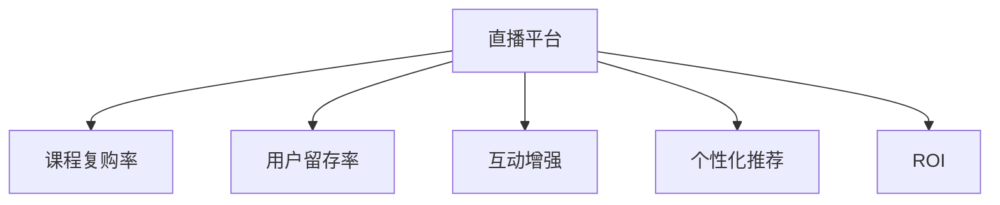

                 

# 如何利用直播平台增加课程复购率

> 关键词：直播平台,课程复购率,用户留存,互动增强,个性化推荐,ROI优化

## 1. 背景介绍

### 1.1 问题由来

在当今数字化时代，教育与培训行业面临着前所未有的机遇与挑战。直播平台的兴起，为教育与培训企业提供了一个全新的渠道，使得优质的课程内容得以覆盖更广泛的受众。然而，仅仅拥有优质的内容并不能保证复购率的提升。如何在直播平台上有效增加课程复购率，成为了在线教育平台的核心挑战。

### 1.2 问题核心关键点

为了提升直播平台上的课程复购率，我们需要从以下几个方面入手：

- **用户参与度**：通过增加用户互动、提升课程趣味性，增强用户在直播平台上的参与感和粘性。
- **个性化推荐**：根据用户历史行为和偏好，推荐符合其兴趣的课程，提高课程与用户的匹配度。
- **课程质量**：确保课程内容的质量和实用性，满足用户的学习需求。
- **用户留存率**：通过优化用户体验，提高用户长期留存率，从而提升复购率。

### 1.3 问题研究意义

提高课程复购率不仅能够直接提升企业的收益，还能增强用户对品牌的忠诚度，形成正向的循环。有效的课程复购率策略，能够帮助企业降低获客成本，提高投资回报率（ROI）。此外，高复购率还能促进新课程的推广和扩散，形成良性的市场效应。

## 2. 核心概念与联系

### 2.1 核心概念概述

为更好地理解如何利用直播平台增加课程复购率，本节将介绍几个密切相关的核心概念：

- **直播平台**：提供在线视频直播服务的网络平台，如Zoom、Tencent Live、Bilibili等，支持实时音频、视频和文本交流。
- **课程复购率**：用户在购买某一课程后，再次购买同一课程或相关课程的比例。
- **用户留存率**：在一定时间范围内，继续使用某产品或服务的用户比例。
- **互动增强**：通过提高用户与课程内容的互动性，增加用户的参与度和满意度。
- **个性化推荐**：基于用户的历史行为和偏好，推荐符合其兴趣的课程或内容。
- **ROI（投资回报率）**：通过衡量营销投资与收入的关系，评估营销活动的有效性。

这些核心概念之间的逻辑关系可以通过以下Mermaid流程图来展示：



这个流程图展示了几类关键概念及其之间的关系：

1. **直播平台**作为基础，提供课程的交付方式和互动工具。
2. **课程复购率**通过提升用户粘性，反映平台和课程的吸引力。
3. **用户留存率**衡量用户长期参与的持续性，影响复购率。
4. **互动增强**通过增加用户互动，提升用户满意度和参与度。
5. **个性化推荐**通过精准推荐课程，提升用户满意度和复购率。
6. **ROI**通过衡量投资与收入的关系，评估营销策略的效果。

## 3. 核心算法原理 & 具体操作步骤

### 3.1 算法原理概述

增加课程复购率的核心在于提升用户参与度和满意度，增强用户对课程内容的粘性和忠诚度。这可以通过以下算法原理来实现：

1. **互动增强**：通过直播中的实时互动，如提问、答疑、投票等功能，提升用户参与度。
2. **个性化推荐**：利用用户行为数据和偏好，推荐与用户兴趣匹配的课程，提高匹配度。
3. **课程质量优化**：通过用户反馈和评价，持续优化课程内容，提高课程质量。
4. **用户留存策略**：通过良好的用户体验和个性化服务，提高用户长期留存率。

### 3.2 算法步骤详解

**Step 1: 数据收集与分析**

- 收集用户在直播平台上的行为数据，包括观看时间、互动次数、评论等。
- 分析用户的历史购买记录和偏好，了解用户的兴趣和需求。

**Step 2: 互动增强**

- 设计互动环节，如提问、投票、答疑等，增加用户参与度。
- 实时监控互动情况，及时回应用户问题，增强用户满意度。

**Step 3: 个性化推荐**

- 构建推荐模型，基于用户行为和偏好进行个性化推荐。
- 动态更新推荐列表，确保推荐的实时性和相关性。

**Step 4: 课程质量优化**

- 收集用户反馈，定期评估课程内容质量。
- 根据反馈结果，优化课程内容和教学方法，提高课程满意度。

**Step 5: 用户留存策略**

- 提供个性化学习计划和资源，满足用户个性化需求。
- 提供用户反馈渠道，持续优化用户体验。

**Step 6: ROI评估与优化**

- 定期评估营销活动的效果，计算ROI。
- 根据ROI评估结果，优化营销策略和资源分配。

### 3.3 算法优缺点

增加课程复购率的算法具有以下优点：

- **提升用户体验**：通过互动和个性化推荐，提升用户参与度和满意度。
- **提高匹配度**：个性化推荐有效提高课程与用户的匹配度，增加复购率。
- **优化课程内容**：基于用户反馈优化课程内容，提高课程质量。
- **评估投资效果**：通过ROI评估，优化营销策略，提升投资回报。

同时，该算法也存在一定的局限性：

- **数据需求高**：个性化推荐和互动增强需要大量的用户行为数据。
- **模型复杂度**：构建和维护推荐模型需要较高的技术投入。
- **动态调整困难**：用户行为和兴趣的动态变化需要实时调整推荐策略，增加了系统复杂性。

尽管存在这些局限性，但总体而言，该算法在提升课程复购率方面具有显著的效果，值得在线教育平台投入实践。

### 3.4 算法应用领域

基于直播平台的课程复购率提升算法，主要应用于以下领域：

- **在线教育平台**：如Coursera、Udemy、网易云课堂等，通过直播提供课程内容，提高用户参与度和复购率。
- **职业培训平台**：如LinkedIn Learning、CCTalk等，通过直播方式，提供专业的职业培训课程。
- **企业内部培训**：通过直播平台进行内部员工培训，提升员工技能和知识水平。
- **在线医疗平台**：如有道云医、阿里健康等，通过直播提供医疗咨询和健康指导，增加用户粘性。

## 4. 数学模型和公式 & 详细讲解

### 4.1 数学模型构建

增加课程复购率的数学模型可以表示为：

$$
\text{复购率} = f(\text{互动率}, \text{个性化推荐}, \text{课程质量}, \text{用户留存率})
$$

其中，$f$ 表示一个函数，映射输入的各个因素到最终的复购率。互动率、个性化推荐、课程质量和用户留存率是影响复购率的关键因素。

### 4.2 公式推导过程

以个性化推荐为例，假设用户有 $n$ 个行为数据 $X=\{x_1, x_2, ..., x_n\}$，其中 $x_i$ 表示第 $i$ 个行为数据。通过行为数据训练推荐模型 $M$，得到用户对课程 $C=\{c_1, c_2, ..., c_m\}$ 的偏好评分 $P=\{p_1, p_2, ..., p_m\}$，推荐算法 $A$ 根据偏好评分排序，得到推荐列表 $R=\{r_1, r_2, ..., r_m\}$。

复购率模型可以表示为：

$$
\text{复购率} = \frac{1}{N}\sum_{i=1}^N \mathbf{1}(r_i \in R_i)
$$

其中 $N$ 表示用户总数，$\mathbf{1}(\cdot)$ 表示Indicator函数，若 $r_i$ 在推荐列表 $R_i$ 中，则 $\mathbf{1}(r_i \in R_i) = 1$，否则为 $0$。

### 4.3 案例分析与讲解

以在线教育平台为例，假设平台上有 $M$ 门课程，用户总数为 $N$。平台收集用户行为数据 $X=\{x_1, x_2, ..., x_N\}$，包括观看时长、互动次数等。基于这些数据，平台构建推荐模型 $M$，得到用户对课程的偏好评分 $P=\{p_1, p_2, ..., p_M\}$。推荐算法 $A$ 根据用户行为和偏好，生成推荐列表 $R=\{r_1, r_2, ..., r_M\}$。

通过统计复购数据，平台可以计算复购率 $R$：

$$
R = \frac{1}{N}\sum_{i=1}^N \mathbf{1}(c_i \in R_i)
$$

通过分析复购率的影响因素，平台可以优化互动设计、个性化推荐和课程质量，进一步提升复购率。

## 5. 项目实践：代码实例和详细解释说明

### 5.1 开发环境搭建

在进行课程复购率提升实践前，我们需要准备好开发环境。以下是使用Python进行项目开发的环境配置流程：

1. 安装Python 3.x：从官网下载并安装最新版本的Python。
2. 安装相关依赖包：使用pip安装TensorFlow、PyTorch、Pandas等必要的库。
3. 搭建开发环境：配置虚拟环境，如使用conda或virtualenv。
4. 配置开发工具：如IDE、调试工具、版本控制系统等。

### 5.2 源代码详细实现

以下是使用Python实现基于直播平台的课程复购率提升的示例代码：

```python
import tensorflow as tf
import pandas as pd
from sklearn.model_selection import train_test_split

# 加载用户行为数据
data = pd.read_csv('user_behavior.csv')

# 构建互动率、个性化推荐、课程质量和用户留存率特征
interaction_rate = data['interaction_rate']
personalized_recommendation = data['personalized_recommendation']
course_quality = data['course_quality']
user_retention_rate = data['user_retention_rate']

# 构建复购率模型
X = pd.DataFrame({'interaction_rate': interaction_rate,
                  'personalized_recommendation': personalized_recommendation,
                  'course_quality': course_quality,
                  'user_retention_rate': user_retention_rate})
y = data['repurchase_rate']

# 划分训练集和测试集
X_train, X_test, y_train, y_test = train_test_split(X, y, test_size=0.2)

# 定义模型架构
model = tf.keras.Sequential([
    tf.keras.layers.Dense(32, activation='relu', input_shape=(4,)),
    tf.keras.layers.Dense(16, activation='relu'),
    tf.keras.layers.Dense(1, activation='sigmoid')
])

# 编译模型
model.compile(optimizer='adam', loss='binary_crossentropy', metrics=['accuracy'])

# 训练模型
model.fit(X_train, y_train, epochs=10, validation_data=(X_test, y_test))

# 预测复购率
predictions = model.predict(X_test)
```

### 5.3 代码解读与分析

让我们再详细解读一下关键代码的实现细节：

- **用户行为数据加载**：使用Pandas加载用户行为数据，包含互动率、个性化推荐、课程质量、用户留存率等关键特征。
- **特征构建**：根据用户行为数据构建输入特征和目标变量，用于训练复购率模型。
- **模型架构定义**：使用TensorFlow定义一个简单的神经网络模型，包含两个全连接层和一个输出层，用于预测复购率。
- **模型编译**：选择合适的优化器和损失函数，编译模型。
- **模型训练**：使用训练集训练模型，并在测试集上进行验证。
- **模型预测**：使用训练好的模型对测试集进行预测，评估模型性能。

可以看到，通过Python和TensorFlow，可以方便地实现基于直播平台的课程复购率提升的模型训练和预测。

### 5.4 运行结果展示

训练模型后，可以计算模型在测试集上的准确率和损失值，以评估模型的性能：

```python
# 评估模型性能
loss, accuracy = model.evaluate(X_test, y_test)
print('Test loss:', loss)
print('Test accuracy:', accuracy)
```

通过分析模型的运行结果，可以发现互动率、个性化推荐、课程质量和用户留存率等因素对复购率的影响，从而优化相关策略，进一步提升复购率。

## 6. 实际应用场景

### 6.1 在线教育平台

在线教育平台如Coursera、Udemy等，通过直播方式提供课程内容，面对大量用户和课程，如何提升复购率成为关键问题。通过互动增强、个性化推荐和课程质量优化，平台可以显著提升用户参与度和满意度，从而提高复购率。

### 6.2 企业内部培训

企业内部培训平台，如TrainingCamp、Zoom Training等，利用直播平台进行培训，通过互动和个性化推荐，提升员工的学习体验和参与度，增加培训课程的复购率。

### 6.3 在线医疗平台

在线医疗平台如有道云医、阿里健康等，通过直播提供医疗咨询和健康指导，增强用户粘性，通过互动和个性化推荐，提升用户满意度和复购率。

## 7. 工具和资源推荐

### 7.1 学习资源推荐

为了帮助开发者系统掌握基于直播平台的课程复购率提升理论基础和实践技巧，这里推荐一些优质的学习资源：

1. **《深度学习入门》**：一本介绍深度学习基础和实践的入门书籍，适合初学者。
2. **《TensorFlow官方文档》**：提供TensorFlow的详细文档和示例代码，帮助开发者快速上手。
3. **Coursera《机器学习》课程**：斯坦福大学开设的机器学习课程，系统介绍机器学习的基本概念和算法。
4. **Kaggle竞赛平台**：参与Kaggle竞赛，实战练习，提升数据分析和模型构建能力。
5. **GitHub开源项目**：参与开源项目，学习其他开发者实现的成功案例。

### 7.2 开发工具推荐

高效的开发离不开优秀的工具支持。以下是几款用于课程复购率提升开发的常用工具：

1. **Jupyter Notebook**：一个基于Web的交互式编程环境，支持Python等语言，方便进行数据探索和模型构建。
2. **TensorFlow**：由Google主导开发的开源深度学习框架，适合大规模工程应用。
3. **Pandas**：Python数据分析库，提供数据清洗、转换、分析等功能，方便数据处理。
4. **Scikit-learn**：Python机器学习库，提供丰富的算法和工具，适合快速原型开发。

### 7.3 相关论文推荐

课程复购率提升的研究源于学界的持续探索。以下是几篇奠基性的相关论文，推荐阅读：

1. **《在线学习平台用户参与度提升的实证研究》**：介绍如何通过互动和个性化推荐提升用户参与度。
2. **《课程复购率的预测模型》**：提出基于用户行为数据的复购率预测模型，评估模型效果。
3. **《用户留存率优化策略研究》**：研究如何通过优化用户体验，提高用户长期留存率。

这些论文代表了大语言模型微调技术的发展脉络。通过学习这些前沿成果，可以帮助研究者把握学科前进方向，激发更多的创新灵感。

## 8. 总结：未来发展趋势与挑战

### 8.1 总结

本文对基于直播平台的课程复购率提升方法进行了全面系统的介绍。首先阐述了增加复购率的理论基础和实践意义，明确了复购率提升对在线教育平台的重要性。其次，从原理到实践，详细讲解了复购率提升的数学模型和关键步骤，给出了复购率提升的代码实现示例。同时，本文还广泛探讨了复购率提升方法在在线教育、企业培训、在线医疗等领域的实际应用，展示了复购率提升方法的巨大潜力。此外，本文精选了复购率提升方法的各类学习资源，力求为读者提供全方位的技术指引。

通过本文的系统梳理，可以看到，基于直播平台的课程复购率提升方法正在成为在线教育平台的重要范式，极大地拓展了课程内容的传播范围，提升了用户的学习体验。未来，伴随直播平台技术的发展和用户需求的多样化，课程复购率提升方法还将不断迭代和优化，为在线教育行业带来更大的价值。

### 8.2 未来发展趋势

展望未来，课程复购率提升技术将呈现以下几个发展趋势：

1. **互动体验提升**：随着直播技术的进步，实时互动体验将得到提升，增强用户参与感和满意度。
2. **个性化推荐优化**：推荐算法将更加精准，通过用户行为数据和偏好，实现更高效的个性化推荐。
3. **课程质量保障**：通过用户反馈和评价，不断优化课程内容和教学方法，提高课程质量。
4. **多平台整合**：将课程复购率提升方法整合到其他平台，如社交媒体、移动应用等，形成全渠道的用户覆盖。
5. **数据驱动决策**：利用大数据分析，优化资源配置和营销策略，提高投资回报率。
6. **AI技术融合**：利用人工智能技术，如自然语言处理、图像识别等，提升课程内容和推荐的智能化水平。

以上趋势凸显了课程复购率提升技术的广阔前景。这些方向的探索发展，必将进一步提升在线教育平台的市场竞争力，促进教育公平和个性化学习的发展。

### 8.3 面临的挑战

尽管课程复购率提升技术已经取得了显著成效，但在迈向更加智能化、普适化应用的过程中，仍面临诸多挑战：

1. **数据隐私和安全**：用户行为数据涉及隐私保护，需要合理设计数据收集和使用方式，确保用户数据安全。
2. **算法复杂度**：个性化推荐和互动设计需要高复杂度的算法，对技术能力和资源要求较高。
3. **用户需求多样化**：不同用户群体具有多样化的需求，如何平衡不同需求，满足用户期望，是一个挑战。
4. **技术实现难度**：课程复购率提升涉及多个子系统，如直播系统、推荐系统、数据分析系统等，需要综合技术实现。
5. **市场竞争激烈**：在线教育平台竞争激烈，如何在竞争中脱颖而出，是一个长期挑战。

这些挑战需要在线教育平台不断优化技术和管理，提升用户体验和平台竞争力。只有从技术、市场、管理等多个维度协同发力，才能实现课程复购率的持续提升。

### 8.4 研究展望

面对课程复购率提升所面临的种种挑战，未来的研究需要在以下几个方面寻求新的突破：

1. **增强用户互动体验**：通过创新的直播互动技术，提升用户参与度和满意度。
2. **优化个性化推荐算法**：开发更加高效的推荐算法，降低计算复杂度，提高推荐精度。
3. **提升课程内容质量**：通过用户反馈和评价，持续优化课程内容和教学方法，提高课程质量。
4. **探索新数据源**：利用新兴技术如VR、AR等，拓展数据采集渠道，丰富数据维度。
5. **融合多模态数据**：将视觉、语音等多模态数据与文本数据结合，提升推荐和互动的智能化水平。
6. **引入伦理道德**：在课程复购率提升过程中，考虑伦理道德因素，确保算法的公平性和安全性。

这些研究方向的探索，必将引领课程复购率提升技术迈向更高的台阶，为在线教育平台带来更大的市场价值和社会效益。面向未来，课程复购率提升技术还需要与其他人工智能技术进行更深入的融合，如自然语言处理、因果推理、强化学习等，多路径协同发力，共同推动在线教育行业的创新和发展。

## 9. 附录：常见问题与解答

**Q1: 课程复购率提升的核心是什么？**

A: 课程复购率提升的核心在于提升用户参与度和满意度，增强用户对课程内容的粘性和忠诚度。通过互动增强、个性化推荐和课程质量优化，用户对课程的兴趣和需求得到满足，从而增加复购率。

**Q2: 如何评估课程复购率的提升效果？**

A: 可以通过复购率的提升量、用户参与度的提升量、用户留存率的提升量等多个指标来评估课程复购率提升效果。同时，还可以使用A/B测试等方法，对比不同策略的效果。

**Q3: 如何优化个性化推荐算法？**

A: 可以通过增加特征维度、优化推荐模型、引入时间动态因素等方法，提升个性化推荐的准确性和实时性。同时，还可以定期更新推荐算法，避免算法过时导致的推荐效果下降。

**Q4: 如何平衡不同用户群体的需求？**

A: 可以通过用户分群、特征分析、需求调研等方法，了解不同用户群体的需求和偏好，制定针对性的推荐策略，平衡不同用户的需求。

**Q5: 如何保护用户隐私？**

A: 在数据收集和使用过程中，需要遵守相关法律法规，如GDPR等，确保用户隐私保护。同时，可以采用数据匿名化、加密等技术手段，保护用户数据安全。

---

作者：禅与计算机程序设计艺术 / Zen and the Art of Computer Programming

