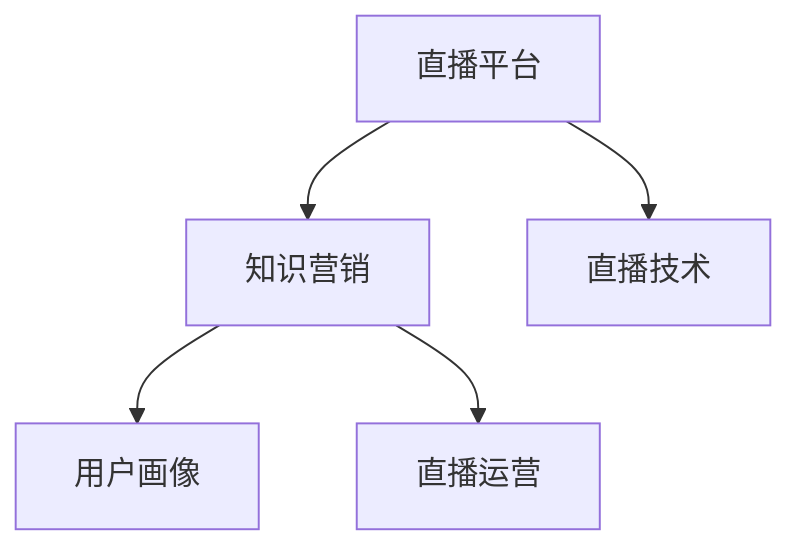

                 

# 如何利用直播平台进行知识营销

## 1. 背景介绍

### 1.1 问题由来
在数字化时代，知识营销已经成为企业品牌建设和用户互动的重要手段。传统的知识营销模式往往以图文形式为主，形式单一，缺乏互动性。随着互联网技术的快速发展，直播平台逐渐成为知识营销的新风口。直播技术不仅能提供沉浸式视听体验，还能实现实时互动，为知识传播注入了新的活力。

### 1.2 问题核心关键点
直播平台知识营销的核心在于通过直播技术，将知识内容以实时、互动的方式呈现给目标用户。其关键点包括：

- 选择合适的直播平台：根据目标用户特征和营销目的，选择合适的直播平台。
- 设计有吸引力的内容：针对目标用户需求，设计具有高度相关性和趣味性的知识内容。
- 建立互动机制：通过提问、抽奖、讨论等互动方式，提升用户参与度。
- 选择适合的直播工具：利用专业的直播软件和硬件设备，确保直播效果和用户体验。
- 持续优化和迭代：根据用户反馈和数据表现，不断优化直播内容和策略。

### 1.3 问题研究意义
直播平台知识营销具有以下几个显著优势：

1. **沉浸式体验**：直播平台通过视频、音频等多模态内容，提供了更直观、沉浸式的知识体验，提高了用户的参与度和学习效率。
2. **实时互动**：实时互动功能让观众能够即时反馈，与主播进行有效沟通，增强了用户粘性。
3. **高曝光率**：直播具有高观看量和高曝光率，能迅速扩大品牌影响力，吸引大量目标用户。
4. **数据分析**：直播平台通常配备强大的数据分析工具，能够实时跟踪用户行为，为后续营销优化提供数据支持。

直播平台知识营销不仅可以帮助企业构建品牌认知，还能够有效提升用户转化率和品牌忠诚度，推动知识传播和价值转化。

## 2. 核心概念与联系

### 2.1 核心概念概述

为更好地理解直播平台知识营销的原理和实施步骤，本节将介绍几个核心概念及其相互关系：

- **直播平台**：提供实时视频和音频播放服务的互联网平台，如抖音、B站、快手等。
- **知识营销**：通过有价值的知识内容，向目标用户传递产品或服务价值，增强用户品牌认知和信任。
- **直播技术**：包括视频编码、流媒体传输、实时互动等功能，是实现知识营销的重要技术支撑。
- **用户画像**：根据用户行为数据、历史互动等信息，构建用户特征模型，指导内容生产和互动策略设计。
- **直播运营**：涵盖直播前的准备、直播中的管理、直播后的分析等多个环节，是直播平台知识营销的保障。

这些核心概念之间的逻辑关系可以通过以下Mermaid流程图来展示：



这个流程图展示了直播平台知识营销的核心组件及其相互关系：

1. 直播平台作为知识传播的媒介，利用其技术优势提供互动和传播服务。
2. 知识营销依托于直播平台，通过有价值的内容提升用户价值感知。
3. 直播技术是直播平台的基础，支撑实时视频和音频的稳定传输和互动功能。
4. 用户画像指导内容设计和互动策略，确保知识营销更具针对性和效果。
5. 直播运营贯穿整个知识营销过程，确保每个环节的顺利进行和效果优化。

## 3. 核心算法原理 & 具体操作步骤

### 3.1 算法原理概述

直播平台知识营销的基本原理可以概括为：通过实时直播技术，结合精心设计的内容和互动机制，在直播平台上向目标用户传递有价值的信息，从而提高用户对品牌或产品的认知和信任，促成知识传播和价值转化。

具体来说，知识营销的关键在于：

1. **内容设计**：设计内容要紧贴目标用户需求，具有高度相关性和吸引力。
2. **互动机制**：通过互动问答、抽奖活动、讨论等形式，提升用户参与度。
3. **数据监控**：利用直播平台的数据分析工具，实时跟踪用户行为，优化直播内容和互动策略。

### 3.2 算法步骤详解

直播平台知识营销的主要操作步骤包括以下几个关键步骤：

**Step 1: 准备直播内容**
- 根据目标用户需求，设计直播内容主题和形式，如专家访谈、产品演示、技术讲解等。
- 准备相关素材，如PPT、视频、音频等，确保内容丰富、多样。

**Step 2: 选择合适的直播平台**
- 根据目标用户特征和营销目的，选择适合的直播平台，如面向年轻用户的抖音、面向专业人士的B站等。
- 了解平台特色功能，如互动工具、用户画像分析等，指导后续操作。

**Step 3: 建立互动机制**
- 设计互动问题，引导用户参与讨论和提问。
- 设置抽奖和奖励机制，激发用户参与热情。
- 利用弹幕和评论功能，实时收集用户反馈和问题。

**Step 4: 进行直播**
- 利用直播平台提供的直播工具，进行直播前的调试和设置，确保技术流畅。
- 进行直播过程中，按既定计划展示内容，保持互动，实时回答用户问题。
- 利用数据分析工具，实时监控直播效果，调整策略。

**Step 5: 直播后的总结和优化**
- 根据直播效果，总结经验和不足。
- 利用用户反馈和数据分析，优化后续直播内容和策略。
- 将直播内容转化为其他形式的传播渠道，如录播、文章、报告等，延续知识传播效果。

### 3.3 算法优缺点

直播平台知识营销具有以下优点：

1. **实时互动**：直播形式具有实时性，用户可以即时反馈，增强了互动性和用户体验。
2. **高曝光率**：直播平台的高观看量和高曝光率，有助于品牌快速提升知名度和影响力。
3. **用户粘性高**：通过互动和参与感，直播平台知识营销能够有效提升用户粘性，增强品牌忠诚度。
4. **数据支持**：直播平台通常具备强大的数据分析能力，能够提供丰富的用户行为数据，支持后续优化。

然而，直播平台知识营销也存在以下缺点：

1. **准备复杂**：相比于图文内容，直播准备复杂，需要更多的技术和人力投入。
2. **易受干扰**：直播过程中可能遇到网络波动、设备故障等问题，影响直播效果。
3. **内容传播局限**：直播内容受到时间、平台的限制，难以持久传播和保存。

### 3.4 算法应用领域

直播平台知识营销在以下几个领域具有广泛应用：

1. **品牌推广**：通过直播展示品牌故事、产品介绍、企业文化等，提高品牌认知度。
2. **产品营销**：利用直播展示产品特性、使用方法、用户评价等，直接促成产品销售。
3. **技术分享**：通过专家访谈、技术讲解等形式，分享前沿技术和知识，提升品牌技术影响力。
4. **教育培训**：利用直播平台进行在线课程、技术培训等，提高用户技能和知识水平。
5. **客户服务**：通过直播解答用户疑问、展示产品操作等，提供实时客服支持。

此外，直播平台知识营销还可应用于公关活动、文化推广、品牌公益等多个领域，为品牌带来多维度的价值提升。

## 4. 数学模型和公式 & 详细讲解  
### 4.1 数学模型构建

直播平台知识营销的数学模型构建主要涉及以下几个关键要素：

- **内容相关性**：衡量内容与目标用户需求的相关性，通常使用Cosine相似度计算。
- **用户参与度**：通过用户互动数据（如评论、点赞、分享等）计算用户参与度，常用指标包括评论率、参与率等。
- **互动效果**：利用用户反馈和数据分析，评估互动机制的效果，通常使用A/B测试等方法。
- **转化率**：通过用户行为数据计算直播营销的转化率，常用指标包括订单量、注册量等。

### 4.2 公式推导过程

以内容相关性为例，假设有$m$个内容，用户需求向量为$u$，内容向量为$c_i$，则内容相关性计算公式为：

$$
\text{Relevance} = \cos(\theta) = \frac{\vec{u} \cdot \vec{c_i}}{\|\vec{u}\| \cdot \|\vec{c_i}\|}
$$

其中$\theta$为向量夹角，$\vec{u}$和$\vec{c_i}$为需求向量和内容向量。

用户参与度计算公式如下：

$$
\text{Engagement} = \frac{\text{互动次数}}{\text{总观看时间}} = \frac{N}{T}
$$

其中$N$为互动次数，$T$为总观看时间。

互动效果评估公式如下：

$$
\text{Interaction Effect} = \frac{\text{互动后的转化率} - \text{互动前的转化率}}{\text{互动前的转化率}}
$$

转化率计算公式如下：

$$
\text{Conversion Rate} = \frac{\text{成功转化次数}}{\text{直播总观看次数}}
$$

### 4.3 案例分析与讲解

以某教育机构在抖音上进行直播为例，分析直播效果和优化策略：

1. **直播内容设计**：
   - 根据目标用户（高中生）需求，设计了关于高考备考的直播内容。
   - 准备了高考真题解析、备考策略、名师访谈等素材，确保内容多样、丰富。

2. **平台选择**：
   - 选择抖音平台，利用其庞大的用户基础和互动功能。
   - 了解抖音直播工具，如抖音直播小助手，指导内容制作和互动设计。

3. **互动机制**：
   - 设计互动问题，如“高考备考最困难的部分是什么？”“你最想问名师什么问题？”。
   - 设置抽奖活动，奖励课程优惠券和名师签名，激发用户参与。
   - 利用弹幕和评论功能，实时收集用户反馈和问题，调整互动策略。

4. **直播过程**：
   - 进行直播前的调试和设置，确保设备和技术流畅。
   - 进行直播过程中，按既定计划展示内容，保持互动，实时回答用户问题。
   - 利用抖音直播小助手，实时监控直播效果，调整策略。

5. **直播总结和优化**：
   - 根据直播效果，总结经验和不足，如内容讲解不够生动、互动不足等。
   - 利用用户反馈和数据分析，优化后续直播内容和策略，如增加互动环节、调整内容形式等。
   - 将直播内容转化为其他形式的传播渠道，如录播、文章、报告等，延续知识传播效果。

## 5. 项目实践：代码实例和详细解释说明
### 5.1 开发环境搭建

在进行直播平台知识营销开发前，我们需要准备好开发环境。以下是使用Python进行抖音直播开发的环境配置流程：

1. 安装Python：从官网下载并安装Python，选择最新版本的Python解释器。
2. 安装抖音API：从抖音开发者平台下载并配置抖音API，获得必要的开发密钥和App ID。
3. 安装相关库：安装抖音SDK、Pandas、Matplotlib等必要的库。

完成上述步骤后，即可在开发环境中进行直播平台知识营销的开发实践。

### 5.2 源代码详细实现

这里我们以某电商平台在B站上进行直播为例，给出一个简单的代码实现，演示如何使用Python和抖音SDK进行直播。

```python
import tiktokapi

# 配置抖音API信息
api_key = 'your_api_key'
api_secret = 'your_api_secret'
app_id = 'your_app_id'
app_secret = 'your_app_secret'

# 创建抖音API对象
api = tiktokapi.TikTokApi(api_key, api_secret, app_id, app_secret)

# 创建直播室
room_id = api.create_live_room()

# 开始直播
live_stream = api.start_live_stream(room_id)

# 发送直播内容
while live_stream.is_live:
    live_stream.send_message('欢迎各位观众来到我们的直播间！')
    time.sleep(30)

# 结束直播
api.stop_live_stream(room_id)
```

在上述代码中，我们首先配置了抖音API的信息，然后使用抖音SDK的API方法创建直播室并开始直播。在直播过程中，我们发送了一条欢迎信息，并使用time模块控制发送间隔，确保直播内容的稳定输出。最后，我们停止了直播室。

### 5.3 代码解读与分析

**抖音API信息**：
- `api_key`和`api_secret`为API Key和Secret，用于验证API请求。
- `app_id`和`app_secret`为App ID和Secret，用于App的认证和授权。

**创建直播室**：
- `create_live_room()`方法用于创建直播室，返回直播室ID。

**开始直播**：
- `start_live_stream(room_id)`方法用于启动直播，返回直播流对象。

**发送直播内容**：
- `send_message()`方法用于发送直播消息。
- `time.sleep(30)`用于控制消息发送间隔，确保直播内容的稳定输出。

**结束直播**：
- `stop_live_stream(room_id)`方法用于停止直播，释放资源。

可以看到，通过抖音SDK的API方法，我们可以方便地进行直播室的创建、启动和内容发送。尽管这只是一个简单的示例，但它展示了直播平台知识营销的基本实现流程和技术要点。

## 6. 实际应用场景
### 6.1 智能客服系统

直播平台知识营销在智能客服系统中具有广泛应用。传统的客服模式往往依赖人工，效率低下且难以扩展。通过直播平台，企业可以构建基于知识库的智能客服系统，提供24/7不间断服务，快速响应客户咨询。

具体而言，企业可以将常见问题整理成知识库，并在直播中展示。观众可以通过弹幕或评论提出问题，客服系统自动匹配知识库中的答案进行回复。对于新问题，系统还可以动态搜索并生成答案，提供实时客服支持。

### 6.2 教育培训

直播平台知识营销在教育培训中具有重要价值。通过直播平台，教育机构可以实时分享知识、展示课程内容、进行互动讨论，提高教学效果和学习体验。

教育机构可以利用直播平台展示名师讲解、课程演示、学生作业等，通过实时互动增强学生的参与感和学习兴趣。直播过程中，可以安排互动环节，如提问、讨论、抽奖等，提升学习效果。

### 6.3 新产品发布

新产品发布是企业品牌营销的重要环节。通过直播平台，企业可以在全球范围内进行新品发布会，吸引大量用户关注和参与。

企业可以利用直播平台展示产品特性、技术优势、用户体验等，实时回答用户问题，增强用户对新品的了解和信任。直播过程中，可以设置互动环节，如抽奖、问答等，提高用户参与度和购买意愿。

### 6.4 未来应用展望

随着直播平台知识营销的不断发展和普及，其应用场景将更加广泛和深入：

1. **虚拟试衣间**：利用直播平台，用户可以实时查看虚拟试衣间中的试穿效果，提高购物体验和决策效率。
2. **远程医疗**：利用直播平台，医生可以实时解答患者问题，进行远程诊疗，提高医疗服务的覆盖面和效率。
3. **在线办公**：利用直播平台，企业可以进行远程会议、培训、产品演示等，提高办公效率和协作效果。
4. **虚拟旅游**：利用直播平台，用户可以实时观看虚拟旅游直播，体验沉浸式旅游体验，拓展旅游市场的边界。

直播平台知识营销不仅能够提升品牌的知名度和影响力，还能够带来显著的经济效益和社会价值，成为未来知识传播的重要手段。

## 7. 工具和资源推荐
### 7.1 学习资源推荐

为了帮助开发者系统掌握直播平台知识营销的理论基础和实践技巧，这里推荐一些优质的学习资源：

1. **抖音开发者文档**：抖音开发者平台提供详细的API文档和示例代码，帮助开发者快速上手抖音API开发。
2. **B站开发者文档**：B站开发者平台提供丰富的直播功能介绍和API文档，指导开发者进行直播平台知识营销的实现。
3. **《直播平台知识营销实战》书籍**：介绍直播平台知识营销的案例分析、策略设计、技术实现等，适合实战学习。
4. **直播平台营销培训课程**：如腾讯课堂、网易云课堂等平台提供直播平台知识营销的在线课程，提供系统学习资源。

通过对这些资源的学习实践，相信你一定能够快速掌握直播平台知识营销的精髓，并用于解决实际的营销问题。

### 7.2 开发工具推荐

高效的开发离不开优秀的工具支持。以下是几款用于直播平台知识营销开发的常用工具：

1. **Python**：作为最流行的编程语言之一，Python在直播平台知识营销开发中广泛应用，具有简洁高效的特点。
2. **抖音SDK**：抖音提供丰富的API和SDK，支持直播、互动、用户管理等功能，是直播平台知识营销开发的重要工具。
3. **Matplotlib**：用于绘制图表，展示数据趋势和效果，辅助直播平台知识营销的决策和优化。
4. **Jupyter Notebook**：提供交互式环境，方便进行数据处理和模型训练，支持直播平台知识营销的实验和迭代。

合理利用这些工具，可以显著提升直播平台知识营销的开发效率，加快创新迭代的步伐。

### 7.3 相关论文推荐

直播平台知识营销的发展源于学界的持续研究。以下是几篇奠基性的相关论文，推荐阅读：

1. **《基于直播平台的知识传播研究》**：探讨直播平台在知识传播中的应用，提出基于直播的知识传播模型和策略。
2. **《直播平台用户行为分析》**：通过数据分析方法，研究直播平台用户行为特征，指导内容设计和互动策略。
3. **《智能客服系统的直播应用》**：介绍直播平台在智能客服系统中的应用，提高客服效率和用户体验。
4. **《直播平台营销效果评估》**：通过A/B测试等方法，评估直播平台知识营销的效果，提出优化建议。

这些论文代表了大语言模型微调技术的发展脉络。通过学习这些前沿成果，可以帮助研究者把握学科前进方向，激发更多的创新灵感。

## 8. 总结：未来发展趋势与挑战

### 8.1 总结

本文对直播平台知识营销进行了全面系统的介绍。首先阐述了直播平台知识营销的研究背景和意义，明确了直播平台在知识传播和营销中的重要价值。其次，从原理到实践，详细讲解了直播平台知识营销的数学模型和关键步骤，给出了知识营销任务开发的完整代码实例。同时，本文还广泛探讨了直播平台知识营销在智能客服、教育培训、新产品发布等多个领域的应用前景，展示了直播平台知识营销的巨大潜力。此外，本文精选了知识营销技术的各类学习资源，力求为读者提供全方位的技术指引。

通过本文的系统梳理，可以看到，直播平台知识营销正在成为企业品牌建设和用户互动的重要手段，为知识传播和价值转化注入了新的活力。直播平台知识营销不仅能够提升品牌的知名度和影响力，还能够带来显著的经济效益和社会价值，成为未来知识传播的重要手段。

### 8.2 未来发展趋势

展望未来，直播平台知识营销将呈现以下几个发展趋势：

1. **多模态融合**：直播平台知识营销将与其他多模态技术（如AR、VR等）结合，提供更加丰富的知识传播体验。
2. **智能化升级**：通过AI技术的应用，直播平台知识营销将变得更加智能化，能够实现自动内容生成、用户行为预测等功能。
3. **个性化推荐**：利用AI推荐算法，直播平台知识营销能够根据用户兴趣和行为，推送更加个性化的内容和互动策略。
4. **数据驱动优化**：通过大数据和机器学习技术，直播平台知识营销能够持续优化内容设计和互动机制，提升效果。
5. **全球化推广**：直播平台知识营销将突破地域限制，通过全球化的直播平台进行推广，提升品牌全球影响力。

以上趋势凸显了直播平台知识营销的广阔前景。这些方向的探索发展，必将进一步提升直播平台知识营销的效果，为品牌带来更多价值。

### 8.3 面临的挑战

尽管直播平台知识营销已经取得了瞩目成就，但在迈向更加智能化、普适化应用的过程中，它仍面临诸多挑战：

1. **技术复杂性**：直播平台知识营销涉及多学科技术，如视频编码、流媒体传输、数据分析等，技术复杂性较高。
2. **资源投入大**：直播平台知识营销需要高质量的内容和设备，初期投入成本较高。
3. **互动机制设计**：设计有效的互动机制需要深入理解用户需求和行为，难度较大。
4. **用户参与度提升**：如何有效提升用户参与度，需要不断优化内容和互动策略，需大量试验和调整。
5. **数据隐私和安全**：直播平台知识营销涉及大量用户数据，需保证数据安全和隐私保护。

这些挑战需要在技术、策略、管理等多个维度共同努力，才能进一步提升直播平台知识营销的效果和应用范围。

### 8.4 研究展望

面向未来，直播平台知识营销的研究方向包括以下几个方面：

1. **智能内容生成**：利用AI技术自动生成直播内容和互动策略，降低人力成本。
2. **跨平台协同**：探索跨平台的知识营销机制，实现不同平台间的协同推广和内容共享。
3. **用户行为分析**：深入研究用户行为和偏好，设计更加个性化和精准的知识营销策略。
4. **伦理和社会责任**：在知识营销中加强伦理和社会责任的关注，避免误导性和有害信息的传播。
5. **全球化推广**：研究全球化背景下的直播平台知识营销策略，提升品牌的全球影响力。

这些研究方向将进一步推动直播平台知识营销技术的成熟和应用，为品牌带来更多价值和创新。

## 9. 附录：常见问题与解答

**Q1: 直播平台知识营销是否适用于所有企业？**

A: 直播平台知识营销适用于大部分企业，尤其是那些具备较强品牌影响力和用户基础的企业。但对于一些初创企业和中小型企业，由于资源和技术限制，可能需要更加灵活和低成本的营销方式。

**Q2: 如何选择合适的直播平台？**

A: 选择直播平台应根据企业的品牌特征和目标用户特点进行评估。如B站适合面向年轻用户和专业领域，抖音适合面向大众用户和娱乐内容。

**Q3: 直播平台知识营销需要哪些技术支持？**

A: 直播平台知识营销需要以下技术支持：
1. 直播平台API和SDK。
2. 视频编解码和流媒体传输技术。
3. 用户行为数据分析和处理技术。
4. AI推荐算法和智能内容生成技术。

**Q4: 直播平台知识营销的效果如何评估？**

A: 直播平台知识营销的效果评估可以从以下几个方面进行：
1. 用户参与度（如互动率、观看时间等）。
2. 用户转化率（如订单量、注册量等）。
3. 品牌知名度和影响力（如关注度、分享量等）。

**Q5: 直播平台知识营销需要注意哪些安全问题？**

A: 直播平台知识营销需要注意以下安全问题：
1. 用户隐私保护，确保用户数据的安全性和隐私性。
2. 内容审核机制，避免传播有害和误导性信息。
3. 网络安全防护，防止数据泄露和攻击。

这些问题的处理需要综合考虑技术、策略和管理等多个维度，才能确保直播平台知识营销的安全性和合规性。

---

作者：禅与计算机程序设计艺术 / Zen and the Art of Computer Programming

