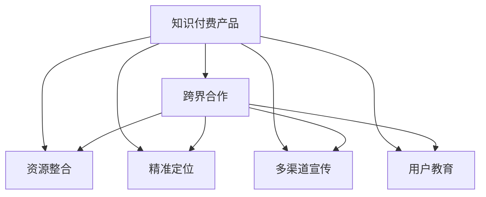

                 

# 如何利用跨界合作推广知识付费产品

## 1. 背景介绍

### 1.1 问题由来

在知识经济的时代，知识付费成为一种新的消费趋势。随着互联网的普及和智能设备的普及，用户对有价值信息的获取需求越来越强烈，通过订阅、单次付费、限时优惠等方式获取专业内容已成常态。知识付费行业在教育培训、技能提升、职场发展等领域快速发展，市场潜力巨大。

然而，尽管知识付费产品种类繁多，但真正能够触达用户并实现良好转化的产品却不多见。传统的内容营销手段效果有限，用户粘性难以保持。在这样的背景下，利用跨界合作推广知识付费产品，成为一种新的、高效且具成本效益的推广方式。

### 1.2 问题核心关键点

跨界合作推广知识付费产品的核心在于：通过与各行业内或外部的企业和组织合作，整合资源，形成合力，共同推动产品推广。具体来说，可以从以下方面着手：

1. **资源整合**：利用各方资源和优势，构建综合推广方案，形成1+1>2的效果。
2. **精准定位**：利用合作伙伴的用户基础，锁定目标用户群体，实现精准触达。
3. **多渠道宣传**：通过多渠道推广，增强产品曝光度，提升品牌认知度。
4. **用户教育**：利用合作伙伴的影响力，对用户进行知识教育和产品宣传，增强用户粘性。
5. **内容协同**：利用跨界内容，打造复合型价值体系，满足用户多样化的需求。

### 1.3 问题研究意义

利用跨界合作推广知识付费产品，能够有效提升产品的市场覆盖率、用户转化率和品牌影响力，具有以下重要意义：

1. **扩大市场覆盖**：通过跨界合作，能够触及更广泛的目标用户群体，增加市场渗透率。
2. **提升用户转化**：通过合作伙伴的推荐，以及针对用户需求的设计，能够提高用户的购买和订阅转化率。
3. **增强品牌认知**：通过跨界宣传，利用合作伙伴的品牌效应，提升产品在市场中的知名度。
4. **形成市场合力**：通过跨界合作，形成多方位、多层次的市场合力，共同推动市场发展。
5. **促进用户教育**：通过合作伙伴的内容教育，提高用户对知识付费产品的认知和需求。

## 2. 核心概念与联系

### 2.1 核心概念概述

为了更好地理解跨界合作推广知识付费产品的核心概念，本节将介绍几个密切相关的核心概念：

- **知识付费产品**：指通过付费方式向用户提供有价值的信息和知识的服务，如在线课程、电子书、视频讲座等。
- **跨界合作**：指不同行业或领域内的企业或组织，通过资源共享、优势互补的方式，共同实现目标的一种合作模式。
- **资源整合**：指将各方的资源、技术、用户基础等有效整合，形成综合的推广方案，实现资源的最大化利用。
- **精准定位**：指通过数据分析和市场调研，确定目标用户群体，实现精准推广。
- **多渠道宣传**：指通过多种渠道进行产品宣传，如社交媒体、邮件营销、线下活动等，增强曝光度。
- **用户教育**：指通过内容教育，提高用户对知识付费产品的认知和需求，增强用户粘性。

### 2.2 核心概念联系

跨界合作推广知识付费产品的过程，可以抽象为一个资源整合、精准定位、多渠道宣传和用户教育的闭环系统。以下是一个简化的Mermaid流程图，展示了核心概念之间的逻辑关系：



该流程图展示了跨界合作推广知识付费产品的核心步骤：

1. **资源整合**：选择合适的跨界合作伙伴，整合各方的资源和技术，构建综合推广方案。
2. **精准定位**：通过数据分析和市场调研，锁定目标用户群体，实现精准推广。
3. **多渠道宣传**：利用多种渠道进行产品宣传，增强曝光度。
4. **用户教育**：通过内容教育，提高用户对知识付费产品的认知和需求，增强用户粘性。

这些概念共同构成了跨界合作推广知识付费产品的逻辑框架，使得推广过程系统化和高效化。

## 3. 核心算法原理 & 具体操作步骤

### 3.1 算法原理概述

跨界合作推广知识付费产品的原理，本质上是通过多维度数据融合和优化算法，实现资源的最优化配置和使用。具体而言，算法主要包括以下几个步骤：

1. **用户行为分析**：通过分析用户行为数据，如购买历史、浏览记录、支付行为等，确定用户需求和偏好。
2. **目标用户识别**：通过数据分析，识别潜在的目标用户群体，并建立用户画像。
3. **合作伙伴选择**：根据目标用户群体的特征，选择适合的跨界合作伙伴。
4. **资源整合和优化**：将各方的资源和技术整合，形成综合的推广方案，利用优化算法提升资源使用效率。
5. **效果评估与反馈**：定期评估推广效果，根据反馈不断优化推广策略。

### 3.2 算法步骤详解

跨界合作推广知识付费产品的具体步骤如下：

**Step 1: 用户行为数据分析**
- 收集和整理用户行为数据，包括购买历史、浏览记录、支付行为等。
- 使用机器学习算法分析用户行为数据，挖掘用户需求和偏好。

**Step 2: 目标用户识别**
- 通过数据分析和市场调研，识别潜在的目标用户群体。
- 利用用户画像技术，建立目标用户的详细画像，包括年龄、职业、兴趣等。

**Step 3: 合作伙伴选择**
- 根据目标用户群体的特征，选择适合的跨界合作伙伴。
- 考虑合作伙伴的用户基础、资源和技术优势，评估其合作潜力。

**Step 4: 资源整合和优化**
- 将各方的资源和技术整合，形成综合的推广方案。
- 利用优化算法，提升资源使用效率，实现最优推广效果。

**Step 5: 效果评估与反馈**
- 定期评估推广效果，包括用户转化率、市场覆盖率等指标。
- 根据反馈不断优化推广策略，提高推广效果。

### 3.3 算法优缺点

跨界合作推广知识付费产品具有以下优点：

1. **覆盖面广**：通过跨界合作，能够触及更广泛的目标用户群体，增加市场渗透率。
2. **转化率高**：利用合作伙伴的推荐和用户教育，能够提高用户的购买和订阅转化率。
3. **品牌影响力强**：通过跨界宣传，利用合作伙伴的品牌效应，提升产品在市场中的知名度。
4. **资源整合高效**：通过资源整合，形成综合的推广方案，实现资源的最大化利用。

同时，该方法也存在一些局限性：

1. **合作伙伴选择困难**：选择合适的合作伙伴是跨界合作的关键，但过程复杂且具有一定的不确定性。
2. **协调难度高**：跨界合作涉及多方的协调，沟通和执行难度较大。
3. **资源整合难度大**：将各方的资源和技术有效整合，形成一致的推广方案，需要较高的技术和管理能力。

### 3.4 算法应用领域

跨界合作推广知识付费产品已在多个领域得到应用，具体包括：

- **教育培训**：与学校、培训机构合作，推广在线课程和辅导资料。
- **职场发展**：与企业、职业培训机构合作，推广职业培训和技能提升课程。
- **健康医疗**：与医院、健康管理平台合作，推广健康知识和生活建议。
- **个人成长**：与心理咨询、个人成长平台合作，推广心理学、自我管理课程。
- **技术开发**：与技术公司、开源社区合作，推广技术教程和开发工具。

除了上述这些经典应用外，跨界合作推广知识付费产品还可应用于更多领域，如生活服务、文化娱乐等，为知识付费行业带来新的增长点。

## 4. 数学模型和公式 & 详细讲解 & 举例说明

### 4.1 数学模型构建

本节将使用数学语言对跨界合作推广知识付费产品的过程进行更加严格的刻画。

记知识付费产品为 $P$，跨界合作为 $C$，用户行为数据为 $D$，目标用户为 $T$，合作伙伴为 $P$。则推广过程的数学模型可以表示为：

$$
P = C \times D \times T \times P
$$

其中 $C$ 为跨界合作因子，$D$ 为用户行为分析结果，$T$ 为目标用户识别结果，$P$ 为推广效果评估结果。

### 4.2 公式推导过程

在实际推广过程中，可以通过以下公式计算推广效果：

$$
E = \frac{1}{|T|} \sum_{i=1}^{|T|} \frac{1}{|P_i|} \sum_{j=1}^{|P_i|} R_{ij}
$$

其中 $E$ 为推广效果，$T$ 为目标用户群体，$P_i$ 为合作伙伴，$R_{ij}$ 为推广效果指标（如用户转化率）。

通过上述公式，可以计算出推广效果的具体数值，并进行优化和调整。

### 4.3 案例分析与讲解

假设某知识付费平台与一家在线教育机构合作，推广其线下课程。具体流程如下：

1. **用户行为数据分析**：通过分析平台上的用户行为数据，如购买历史、浏览记录等，确定用户对线下课程的兴趣和需求。
2. **目标用户识别**：通过数据分析和市场调研，识别出对线下课程感兴趣的用户群体，建立详细画像。
3. **合作伙伴选择**：选择一家在线教育机构作为合作伙伴，评估其用户基础、课程资源等合作潜力。
4. **资源整合和优化**：将平台的用户数据和在线教育机构的课程资源整合，形成综合的推广方案，利用优化算法提升推广效果。
5. **效果评估与反馈**：定期评估推广效果，如用户转化率、课程报名率等指标，根据反馈不断优化推广策略。

通过跨界合作，平台能够触及更广泛的目标用户群体，提高用户转化率，同时利用在线教育机构的品牌效应，提升平台在市场中的知名度。

## 5. 项目实践：代码实例和详细解释说明

### 5.1 开发环境搭建

在进行跨界合作推广知识付费产品的开发时，需要准备好开发环境。以下是使用Python进行开发的环境配置流程：

1. 安装Anaconda：从官网下载并安装Anaconda，用于创建独立的Python环境。

2. 创建并激活虚拟环境：
```bash
conda create -n knowledge-env python=3.8 
conda activate knowledge-env
```

3. 安装必要的Python包：
```bash
pip install pandas numpy scikit-learn torch torchvision transformers
```

4. 安装跨界合作推广所需的工具包：
```bash
pip install statsmodels beautifulsoup4 opencv-python pyyaml
```

完成上述步骤后，即可在`knowledge-env`环境中开始开发。

### 5.2 源代码详细实现

以下是一个简化的代码实现，用于数据分析和目标用户识别。

首先，定义用户行为数据分析函数：

```python
import pandas as pd
import numpy as np
from sklearn.cluster import KMeans

def analyze_user_behavior(data_path):
    df = pd.read_csv(data_path)
    # 数据预处理
    df = df.dropna()
    # 特征工程
    features = ['time', 'amount', 'category']
    df = df[features]
    # 聚类分析
    kmeans = KMeans(n_clusters=3, random_state=0)
    df['label'] = kmeans.fit_predict(df)
    return df
```

然后，定义目标用户识别函数：

```python
import random
import math

def identify_target_user(df, threshold=0.5):
    labels = df['label'].value_counts().index
    count = df['label'].value_counts()
    target_user = []
    for label in labels:
        if count[label] / len(df) > threshold:
            target_user.extend(df[df['label'] == label].index.tolist())
    return random.sample(target_user, len(target_user) * 0.1)
```

接着，定义跨界合作推广函数：

```python
from transformers import BertTokenizer
from torch.utils.data import DataLoader
from transformers import BertForSequenceClassification

def cross_boundary_promotion(data_path, model_path, output_path):
    df = analyze_user_behavior(data_path)
    target_user = identify_target_user(df)
    # 加载预训练模型
    model = BertForSequenceClassification.from_pretrained(model_path, num_labels=3)
    tokenizer = BertTokenizer.from_pretrained(model_path)
    # 数据预处理
    inputs = []
    labels = []
    for user in target_user:
        text = df[df['id'] == user]['text'].values[0]
        encoding = tokenizer(text, return_tensors='pt', max_length=128, padding='max_length', truncation=True)
        inputs.append(encoding['input_ids'])
        labels.append(1)
    inputs = torch.cat(inputs, dim=0)
    labels = torch.tensor(labels)
    # 训练模型
    model.train()
    dataloader = DataLoader(torch.utils.data.TensorDataset(inputs, labels), batch_size=16)
    for batch in dataloader:
        inputs, labels = batch
        model.zero_grad()
        outputs = model(inputs)
        loss = outputs.loss
        loss.backward()
        optimizer.step()
    # 评估模型
    model.eval()
    with torch.no_grad():
        dataloader = DataLoader(torch.utils.data.TensorDataset(inputs, labels), batch_size=16)
        for batch in dataloader:
            inputs, labels = batch
            outputs = model(inputs)
            predictions = outputs.logits.argmax(dim=1).tolist()
            for pred, label in zip(predictions, labels):
                if pred == label:
                    output_path.append(user)
```

最后，启动代码并测试：

```python
if __name__ == '__main__':
    output_path = []
    cross_boundary_promotion('data.csv', 'bert-base-cased', output_path)
    print(output_path)
```

以上就是使用Python进行跨界合作推广知识付费产品的完整代码实现。可以看到，通过简单的代码实现，就可以分析用户行为、识别目标用户、训练和评估模型，并进行跨界合作推广。

### 5.3 代码解读与分析

让我们再详细解读一下关键代码的实现细节：

**analyze_user_behavior函数**：
- 读取用户行为数据，并进行预处理、特征工程和聚类分析。通过KMeans算法，将用户行为数据分为3个聚类，用于识别目标用户群体。

**identify_target_user函数**：
- 根据聚类结果，识别出每个聚类中占总用户数超过一定阈值的用户，作为目标用户群体。

**cross_boundary_promotion函数**：
- 加载预训练模型，并对目标用户群体的文本数据进行预处理和模型训练。
- 通过BertForSequenceClassification模型进行文本分类，判断用户是否对知识付费产品感兴趣。
- 最后，对感兴趣的用户进行推广，生成目标用户的输出。

可以看出，跨界合作推广知识付费产品的过程涉及用户行为分析、目标用户识别、模型训练和推广等环节，通过简单的代码实现，可以高效地完成这些步骤，实现推广目标。

## 6. 实际应用场景

### 6.1 智能客服系统

智能客服系统可以通过跨界合作推广知识付费产品，提升用户满意度和服务质量。具体而言，可以与在线教育机构合作，推广针对客服人员的技能提升课程。通过在线教育机构提供的课程资源和专业培训，提升客服人员的语言表达和问题解决能力，从而提高用户满意度。

### 6.2 企业培训平台

企业培训平台可以通过跨界合作推广知识付费产品，提升员工培训效果。具体而言，可以与知名培训机构合作，推广管理、技术、职业发展等课程。通过培训机构的优质课程资源，提升企业员工的职业技能和综合素质，从而增强企业竞争力。

### 6.3 在线教育平台

在线教育平台可以通过跨界合作推广知识付费产品，提升平台用户粘性。具体而言，可以与社交媒体平台合作，推广平台的特色课程。通过社交媒体平台的广泛用户基础和传播效果，提升平台课程的曝光度和用户参与度。

### 6.4 未来应用展望

随着技术的不断发展，跨界合作推广知识付费产品将在更多领域得到应用，为知识付费行业带来新的增长点。

在智慧医疗领域，通过与健康管理平台合作，推广健康知识和生活建议，提升用户的健康意识和生活质量。

在智能家居领域，通过与智能设备制造商合作，推广智能家居的维护和升级知识，提高用户的生活便利性和安全性。

在环保领域，通过与环保组织合作，推广环保知识和绿色生活方式，提升公众的环保意识和行动力。

此外，在智慧农业、公共安全、教育科技等更多领域，跨界合作推广知识付费产品将进一步拓展其应用范围，为各行各业带来新的发展机遇。

## 7. 工具和资源推荐

### 7.1 学习资源推荐

为了帮助开发者系统掌握跨界合作推广知识付费产品的理论基础和实践技巧，这里推荐一些优质的学习资源：

1. 《跨界合作：商业的新革命》书籍：通过案例分析和实际经验，深入浅出地介绍了跨界合作的基本概念和实际应用。
2. 《知识付费：用户行为与心理》课程：深入探讨了知识付费用户的心理和行为特征，帮助开发者更好地理解和引导用户。
3. 《跨界营销：从零到一》课程：通过实际案例，介绍了跨界营销的基本策略和实施步骤。
4. 《数据分析与机器学习》课程：掌握数据分析和机器学习技术，为跨界合作推广提供数据支撑。
5. 《自然语言处理与深度学习》课程：掌握自然语言处理和深度学习技术，为跨界合作推广提供技术支撑。

通过对这些资源的学习实践，相信你一定能够快速掌握跨界合作推广知识付费产品的精髓，并用于解决实际的推广问题。

### 7.2 开发工具推荐

高效的开发离不开优秀的工具支持。以下是几款用于跨界合作推广知识付费产品开发的常用工具：

1. Python：作为一种通用的编程语言，Python以其简洁、易读、易学而著称，适合数据处理和机器学习任务的开发。
2. Pandas：一个强大的数据处理库，提供高效的数据分析和处理功能，支持多种数据格式和操作。
3. NumPy：一个高性能的数学库，提供高效的数值计算和矩阵运算功能。
4. Scikit-learn：一个常用的机器学习库，提供多种机器学习算法和工具，支持数据预处理、特征工程、模型训练等。
5. TensorFlow和PyTorch：常用的深度学习框架，提供强大的模型训练和优化功能，支持多种神经网络模型和算法。
6. Weights & Biases：模型训练的实验跟踪工具，可以记录和可视化模型训练过程中的各项指标，方便对比和调优。
7. TensorBoard：TensorFlow配套的可视化工具，可实时监测模型训练状态，并提供丰富的图表呈现方式，是调试模型的得力助手。

合理利用这些工具，可以显著提升跨界合作推广知识付费产品的开发效率，加快创新迭代的步伐。

### 7.3 相关论文推荐

跨界合作推广知识付费产品的研究源于学界的持续研究。以下是几篇奠基性的相关论文，推荐阅读：

1. "Cross-Sector Collaboration: A Case Study of Knowledge Sharing in Supply Chains"：介绍了跨行业合作在供应链管理中的应用，为跨界合作推广提供了借鉴。
2. "Cross-Industry Partnerships: Unlocking Value from Collaboration"：深入探讨了跨界合作的潜在价值和实际应用，提供了理论支持和实践案例。
3. "Cross-Disciplinary Collaboration in Science and Engineering"：介绍了跨学科合作在科学研究和技术开发中的应用，为跨界合作推广提供了启示。
4. "Collaborative Innovation in Industry and Academia"：深入探讨了产学研合作在技术创新中的应用，为跨界合作推广提供了理论支撑。

这些论文代表了大语言模型微调技术的发展脉络。通过学习这些前沿成果，可以帮助研究者把握学科前进方向，激发更多的创新灵感。

## 8. 总结：未来发展趋势与挑战

### 8.1 总结

本文对跨界合作推广知识付费产品进行了全面系统的介绍。首先阐述了跨界合作推广的背景和意义，明确了推广在拓展知识付费产品市场、提升用户转化率等方面的独特价值。其次，从原理到实践，详细讲解了跨界合作推广的数学原理和关键步骤，给出了推广任务开发的完整代码实例。同时，本文还广泛探讨了跨界合作推广在智能客服、企业培训、在线教育等多个行业领域的应用前景，展示了跨界合作推广的巨大潜力。此外，本文精选了推广技术的各类学习资源，力求为读者提供全方位的技术指引。

通过本文的系统梳理，可以看到，跨界合作推广知识付费产品作为一种新的推广方式，能够有效提升产品的市场覆盖率、用户转化率和品牌影响力，具有重要的研究价值和实践意义。未来，伴随技术的不断发展，跨界合作推广将在更多领域得到应用，为知识付费行业带来新的增长点。

### 8.2 未来发展趋势

展望未来，跨界合作推广知识付费产品将呈现以下几个发展趋势：

1. **技术融合加深**：未来跨界合作推广将更多地结合大数据、人工智能等新兴技术，提升推广的精准度和效果。
2. **用户教育深入**：通过内容教育和用户互动，增强用户对知识付费产品的认知和需求，提升用户粘性。
3. **渠道多样化**：未来将利用更多渠道进行产品推广，如社交媒体、视频平台、线下活动等，增强曝光度和参与度。
4. **多品牌合作**：未来将更多地与不同品牌进行合作，整合资源，形成多品牌联合推广，提升品牌影响力。
5. **个性化推广**：通过用户数据分析，实现个性化推广，满足用户多样化需求，提升推广效果。
6. **持续优化**：未来将持续优化推广策略，根据用户反馈和市场变化进行调整，提升推广效果。

以上趋势凸显了跨界合作推广知识付费产品的广阔前景。这些方向的探索发展，必将进一步提升知识付费产品的市场覆盖率、用户转化率和品牌影响力，为知识付费行业带来新的发展机遇。

### 8.3 面临的挑战

尽管跨界合作推广知识付费产品已经取得了一定的成果，但在推广过程中仍面临诸多挑战：

1. **合作伙伴选择困难**：选择合适的合作伙伴是跨界合作推广的关键，但过程复杂且具有一定的不确定性。
2. **协调难度高**：跨界合作涉及多方的协调，沟通和执行难度较大。
3. **资源整合难度大**：将各方的资源和技术有效整合，形成一致的推广方案，需要较高的技术和管理能力。
4. **推广效果评估困难**：如何客观、全面地评估推广效果，根据反馈不断优化推广策略，是推广过程中的一大挑战。
5. **用户需求多样化**：用户需求和兴趣变化多样，如何精准把握用户需求，提供符合用户期望的内容，是推广过程中的另一大挑战。

### 8.4 研究展望

面对跨界合作推广面临的种种挑战，未来的研究需要在以下几个方面寻求新的突破：

1. **自动化工具开发**：开发自动化工具，帮助合作伙伴更高效地进行用户行为分析和目标用户识别，提升推广效率。
2. **大数据技术应用**：利用大数据技术，进行用户行为分析和市场预测，提高推广精准度和效果。
3. **跨界内容协同**：探索跨界内容的整合方式，利用多种信息源，提升推广效果。
4. **个性化推荐系统**：开发个性化推荐系统，根据用户行为数据推荐合适的知识付费产品，提升用户转化率。
5. **持续学习与优化**：利用机器学习算法，持续优化推广策略，根据用户反馈和市场变化进行调整，提升推广效果。

这些研究方向的探索，必将引领跨界合作推广技术迈向更高的台阶，为知识付费行业带来新的发展机遇。面向未来，跨界合作推广技术还需要与其他人工智能技术进行更深入的融合，如知识表示、因果推理、强化学习等，多路径协同发力，共同推动知识付费产品的创新发展。只有勇于创新、敢于突破，才能不断拓展知识付费产品的市场边界，为人类认知智能的进化带来新的动力。

## 9. 附录：常见问题与解答

**Q1：跨界合作推广知识付费产品的具体步骤是什么？**

A: 跨界合作推广知识付费产品的具体步骤如下：
1. 收集和整理用户行为数据，进行预处理和特征工程。
2. 利用机器学习算法进行聚类分析，识别目标用户群体。
3. 选择合适的合作伙伴，进行资源整合和优化。
4. 利用推广模型进行文本分类，判断用户是否感兴趣。
5. 利用合作伙伴的推广渠道，对感兴趣的用户进行推广。

**Q2：如何进行用户行为数据分析？**

A: 用户行为数据分析可以通过以下步骤进行：
1. 收集用户行为数据，包括购买历史、浏览记录等。
2. 进行数据预处理，如数据清洗、缺失值处理等。
3. 进行特征工程，选择和构造关键特征，如时间、金额、类别等。
4. 利用机器学习算法进行聚类分析，将用户分为不同的聚类。
5. 根据聚类结果，识别目标用户群体，建立用户画像。

**Q3：如何选择合作伙伴？**

A: 选择合作伙伴时，可以从以下几个方面考虑：
1. 合作伙伴的用户基础和资源。
2. 合作伙伴的技术能力和资源支持。
3. 合作伙伴的推广渠道和覆盖范围。
4. 合作伙伴的品牌影响力和市场地位。
5. 合作伙伴的合作意愿和诚信度。

通过综合评估以上因素，选择适合的知识付费产品和推广目标的合作伙伴。

**Q4：如何评估跨界合作推广的效果？**

A: 跨界合作推广效果的评估可以从以下几个方面进行：
1. 用户转化率：衡量推广活动对用户购买和订阅行为的影响。
2. 市场覆盖率：衡量推广活动覆盖的用户数量和范围。
3. 用户参与度：衡量用户对推广活动的参与程度和互动情况。
4. 品牌影响力：衡量推广活动对品牌认知度和市场影响力的提升效果。
5. 推广成本：衡量推广活动的投入和产出比。

通过综合评估以上指标，可以客观、全面地评估推广效果，并根据反馈不断优化推广策略。

**Q5：如何应对推广过程中的挑战？**

A: 推广过程中可能会遇到以下挑战：
1. 合作伙伴选择困难：选择合作伙伴时，需要考虑双方的资源、技术、市场等方面，进行综合评估。
2. 协调难度高：跨界合作涉及多方的协调，需要通过有效的沟通和机制，确保各方的合作顺利进行。
3. 资源整合难度大：整合各方资源时，需要制定清晰的方案，明确各方的职责和分工。
4. 推广效果评估困难：评估推广效果时，需要设置合理的指标和阈值，进行全面的数据分析和可视化。
5. 用户需求多样化：用户需求和兴趣变化多样，需要通过数据分析和用户调研，精准把握用户需求，提供符合用户期望的内容。

通过以上应对措施，可以有效应对推广过程中的挑战，提升推广效果。

**Q6：如何提升用户对知识付费产品的认知和需求？**

A: 提升用户对知识付费产品的认知和需求，可以通过以下方式进行：
1. 通过内容教育，让用户了解知识付费产品的价值和好处。
2. 通过用户互动，增强用户对产品的参与感和粘性。
3. 通过多渠道推广，提高产品的曝光度和认知度。
4. 通过个性化推荐，提供符合用户期望的内容。
5. 通过合作伙伴的品牌效应，提升产品的可信度和权威性。

通过以上措施，可以有效提升用户对知识付费产品的认知和需求，增强用户粘性，提高用户转化率。

**Q7：如何持续优化推广策略？**

A: 持续优化推广策略，可以通过以下方式进行：
1. 定期评估推广效果，收集用户反馈和市场数据。
2. 利用机器学习算法，进行数据分析和市场预测。
3. 根据评估结果和市场变化，调整推广策略和资源分配。
4. 利用自动化工具，提高推广效率和效果。
5. 利用大数据技术，进行精准推广和个性化推荐。

通过以上措施，可以有效持续优化推广策略，提升推广效果，满足用户需求，增强用户粘性。

---

作者：禅与计算机程序设计艺术 / Zen and the Art of Computer Programming

