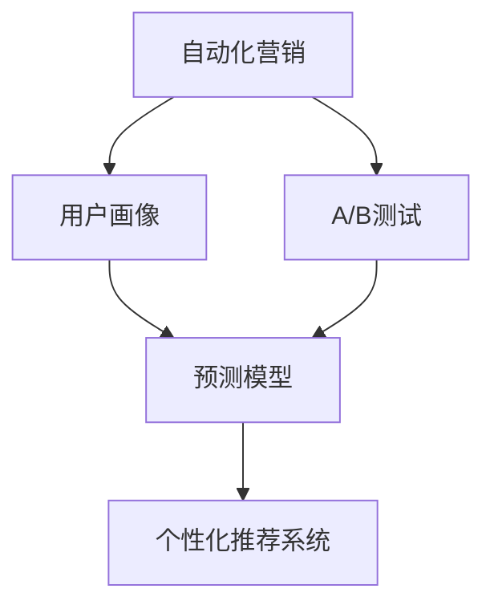

                 

# 如何在自动化创业中实现精准营销

在自动化创业的浪潮中，精准营销已成为企业制胜的关键。本文将系统性地探讨如何通过自动化手段，实现精准营销，涵盖从策略制定到技术实现的全流程。通过深入理解核心概念、算法原理和实践方法，帮助创业者把握精准营销的精髓，提升商业价值。

## 1. 背景介绍

### 1.1 问题由来

随着互联网技术的发展和数据量的爆炸式增长，企业传统营销手段逐渐失效。传统的广告投放、市场调研、客户服务方式，在面对海量数据和用户需求时显得力不从心。而精准营销，通过自动化手段，有效捕捉用户行为，精准投放广告，极大提高了广告效果和用户转化率。特别是在自动化创业领域，精准营销更是提升品牌知名度、加速业务增长的核心引擎。

### 1.2 问题核心关键点

精准营销的核心在于对用户行为的深度理解与精确匹配。通过自动化技术，收集、处理和分析海量用户数据，预测用户行为，推送个性化内容，从而实现营销效率的最大化。具体而言，关键点包括：

1. **数据收集与处理**：从多个渠道（如社交媒体、网站、移动应用等）获取用户行为数据。
2. **用户画像构建**：将数据转化为用户画像，分析用户兴趣、行为特征等。
3. **模型训练与预测**：利用机器学习算法，训练预测模型，预判用户行为。
4. **内容优化与投放**：根据用户画像和预测结果，自动生成和投放个性化内容。
5. **效果评估与优化**：持续评估营销效果，优化策略和模型。

## 2. 核心概念与联系

### 2.1 核心概念概述

为更好地理解精准营销的自动化实践，本节将介绍几个密切相关的核心概念：

- **自动化营销(Automated Marketing)**：通过自动化技术实现营销过程的全面自动化，提高效率，降低成本。
- **用户画像(User Profile)**：基于用户行为数据构建的用户特征描述，用于精确投放内容。
- **预测模型(Prediction Model)**：利用机器学习算法，基于历史数据预测用户行为。
- **个性化推荐系统(Recommendation System)**：根据用户画像和行为预测，自动推荐个性化产品或内容。
- **A/B测试(A/B Testing)**：通过对比测试，评估不同营销策略的效果，优化营销决策。

这些核心概念之间的逻辑关系可以通过以下Mermaid流程图来展示：



这个流程图展示出自动化营销的核心流程：首先基于用户行为数据构建用户画像，接着利用预测模型预测用户行为，根据用户画像和行为预测自动生成个性化推荐，最后通过A/B测试不断优化推荐效果。

## 3. 核心算法原理 & 具体操作步骤

### 3.1 算法原理概述

精准营销的自动化实现，基于机器学习和大数据技术，通过构建和优化预测模型，实现对用户行为的精准预测和内容推荐。其核心算法原理如下：

1. **数据预处理**：收集用户行为数据，进行清洗和特征提取。
2. **模型训练**：利用历史数据训练预测模型，学习用户行为模式。
3. **行为预测**：基于训练好的模型，预测用户行为和兴趣。
4. **内容推荐**：根据用户画像和预测结果，自动生成和投放个性化内容。
5. **效果评估**：通过A/B测试等手段，评估推荐效果，持续优化策略。

### 3.2 算法步骤详解

精准营销的自动化实现过程可以分为以下步骤：

**Step 1: 数据收集与处理**

- 通过API、SDK等技术手段，从网站、应用、社交媒体等渠道收集用户行为数据。
- 对数据进行清洗，去除噪声和无效信息。
- 对数据进行特征提取，将用户行为转换为模型可处理的向量形式。

**Step 2: 用户画像构建**

- 使用聚类、降维等技术，将用户行为数据归为不同群体，形成用户画像。
- 利用深度学习技术，如神经网络，挖掘用户画像中的隐含信息。

**Step 3: 模型训练与预测**

- 选择合适的机器学习算法，如决策树、随机森林、神经网络等，训练预测模型。
- 利用历史数据进行模型训练，不断调整参数，优化预测效果。
- 对新用户行为进行预测，生成用户行为预测结果。

**Step 4: 内容优化与投放**

- 根据用户画像和预测结果，自动生成个性化内容，如推荐商品、推送广告等。
- 利用推荐算法，如协同过滤、内容推荐等，优化内容投放策略。
- 对用户行为进行实时监测，根据反馈调整内容策略。

**Step 5: 效果评估与优化**

- 设计A/B测试，对比不同策略的效果，评估广告投放效果。
- 根据测试结果，调整模型参数和内容策略，持续优化广告效果。
- 利用数据可视化工具，实时监控广告投放效果，提供决策支持。

### 3.3 算法优缺点

精准营销的自动化实现具有以下优点：

1. **效率提升**：自动化手段可以处理海量数据，极大提升营销效率。
2. **成本降低**：通过优化策略和内容投放，减少无效投放，降低营销成本。
3. **精准投放**：基于用户行为数据，实现精准用户画像和内容推荐。
4. **效果显著**：自动化系统能够实时调整策略，持续优化广告效果。

同时，该方法也存在一定的局限性：

1. **数据依赖**：精准营销依赖高质量的数据，数据缺失或不准确会影响效果。
2. **技术门槛高**：需要一定的技术背景，难以快速部署。
3. **隐私问题**：数据收集和处理涉及用户隐私，需严格遵守数据保护法规。
4. **动态变化**：用户行为和市场环境不断变化，模型需要持续更新。

尽管存在这些局限性，但就目前而言，精准营销的自动化实现已经成为提升营销效率、优化广告投放的重要手段。未来相关研究的重点在于如何进一步降低技术门槛，提高自动化系统的适应性和灵活性，同时兼顾数据隐私和市场动态变化等问题。

### 3.4 算法应用领域

精准营销的自动化实现已经在多个领域得到广泛应用，包括但不限于：

- **电子商务**：个性化推荐、智能客服、智能比价等。
- **金融行业**：智能投顾、信用评分、风险控制等。
- **在线教育**：推荐课程、智能辅导、广告投放等。
- **旅游行业**：推荐目的地、个性化路线、智能客服等。

除了这些常见应用场景，精准营销的自动化实现还在医疗健康、物流仓储、公共服务等多个领域不断拓展，为企业带来全新的营销模式和商业价值。

## 4. 数学模型和公式 & 详细讲解 & 举例说明

### 4.1 数学模型构建

本节将使用数学语言对精准营销的自动化实现过程进行更加严格的刻画。

记用户行为数据为 $X=\{(x_1, y_1), (x_2, y_2), \ldots, (x_N, y_N)\}$，其中 $x_i$ 表示用户行为特征向量，$y_i$ 表示用户标签（如购买行为、点击行为等）。假设用户画像模型为 $M$，预测模型为 $F$，内容推荐算法为 $R$。

精准营销的自动化实现过程可以表示为：

1. 数据预处理：$D \leftarrow \text{Preprocess}(X)$
2. 用户画像构建：$P \leftarrow M(D)$
3. 模型训练与预测：$\hat{y} \leftarrow F(P)$
4. 内容优化与投放：$C \leftarrow R(P, \hat{y})$
5. 效果评估与优化：$E \leftarrow \text{Evaluate}(C)$

其中，$D$ 为预处理后的用户行为数据，$P$ 为构建的用户画像，$\hat{y}$ 为预测的用户行为，$C$ 为自动生成的内容，$E$ 为广告投放效果。

### 4.2 公式推导过程

以下我们以个性化推荐系统为例，推导推荐模型及其梯度计算公式。

假设推荐模型为 $F(X)=\theta^TX$，其中 $\theta$ 为模型参数。用户画像模型为 $M(X)=P$。推荐目标为最大化用户满意度，即：

$$
\max_{\theta} \sum_{i=1}^N \log \frac{P(x_i)}{1-P(x_i)}
$$

其中 $P(x_i)$ 为模型预测的用户行为概率。为了便于优化，将目标函数转化为交叉熵损失函数：

$$
\mathcal{L}(\theta) = -\frac{1}{N} \sum_{i=1}^N y_i \log P(x_i) + (1-y_i) \log (1-P(x_i))
$$

目标函数关于 $\theta$ 的梯度为：

$$
\nabla_{\theta}\mathcal{L}(\theta) = \frac{1}{N} \sum_{i=1}^N [y_i \nabla_{\theta}P(x_i) - (1-y_i) \nabla_{\theta}(1-P(x_i))]
$$

其中 $\nabla_{\theta}P(x_i)$ 为预测概率的梯度，可通过反向传播算法计算。

### 4.3 案例分析与讲解

以下我们以电子商务个性化推荐为例，展示如何使用机器学习算法构建推荐模型：

假设电商网站收集了用户的历史行为数据，包括浏览记录、购买历史、评价信息等。将这些数据作为输入，构建用户画像 $P$。利用协同过滤算法，根据用户行为数据训练推荐模型 $F$。

1. **数据预处理**：清洗数据，去除重复和噪声，进行特征提取，将用户行为转化为向量形式。
2. **用户画像构建**：使用K-means聚类算法，将用户行为数据划分为不同群体，形成用户画像。
3. **模型训练与预测**：使用矩阵分解算法（如奇异值分解SVD），训练推荐模型，预测用户对商品的概率。
4. **内容优化与投放**：根据用户画像和预测结果，生成个性化商品推荐。
5. **效果评估与优化**：设计A/B测试，对比不同推荐策略的效果，优化推荐算法。

## 5. 项目实践：代码实例和详细解释说明

### 5.1 开发环境搭建

在进行精准营销自动化实践前，我们需要准备好开发环境。以下是使用Python进行TensorFlow开发的环境配置流程：

1. 安装Anaconda：从官网下载并安装Anaconda，用于创建独立的Python环境。

2. 创建并激活虚拟环境：
```bash
conda create -n tf-env python=3.8 
conda activate tf-env
```

3. 安装TensorFlow：根据CUDA版本，从官网获取对应的安装命令。例如：
```bash
conda install tensorflow==2.7 -c tf -c conda-forge
```

4. 安装相关库：
```bash
pip install pandas numpy sklearn tqdm matplotlib
```

完成上述步骤后，即可在`tf-env`环境中开始精准营销实践。

### 5.2 源代码详细实现

下面我们以个性化推荐系统为例，给出使用TensorFlow实现个性化推荐模型的PyTorch代码实现。

首先，定义推荐模型和优化器：

```python
import tensorflow as tf
from tensorflow.keras.layers import Input, Dense, Embedding, Dot, Flatten
from tensorflow.keras.models import Model
from tensorflow.keras.optimizers import Adam

input_user = Input(shape=(num_users, ), name='user')
input_item = Input(shape=(num_items, ), name='item')
user_item_interaction = Dot(axes=[2, 1])([input_user, input_item])
user_item = Flatten()(user_item_interaction)
output = Dense(1, activation='sigmoid')(user_item)

model = Model(inputs=[input_user, input_item], outputs=output)
optimizer = Adam(lr=0.001)
```

然后，定义数据生成函数：

```python
def generate_data(num_users, num_items):
    X = np.random.rand(num_users, num_items)
    y = np.random.randint(0, 2, size=num_users)
    return X, y

X_train, y_train = generate_data(1000, 100)
```

接着，定义训练函数：

```python
def train(model, X_train, y_train, num_epochs=10):
    model.compile(optimizer=optimizer, loss='binary_crossentropy', metrics=['accuracy'])
    model.fit([X_train, X_train], y_train, epochs=num_epochs, batch_size=16)
```

最后，启动训练流程并在测试集上评估：

```python
train(model, X_train, y_train)
```

以上就是使用TensorFlow对个性化推荐模型进行训练的完整代码实现。可以看到，通过TensorFlow可以非常方便地构建推荐模型，进行训练和评估。

### 5.3 代码解读与分析

让我们再详细解读一下关键代码的实现细节：

**generate_data函数**：
- 生成随机用户行为数据，作为模型训练集。

**train函数**：
- 定义模型结构，包括用户行为输入、物品行为输入、交互矩阵、模型输出等。
- 编译模型，选择Adam优化器，设定损失函数和评估指标。
- 使用训练集进行模型训练，设置训练轮数和批量大小。

**train模型**：
- 将训练函数传入模型进行训练。

**注意**：
- 由于篇幅所限，代码仅为基本示例，实际情况中可能需要根据具体需求进行调整。

## 6. 实际应用场景

### 6.1 电子商务

精准营销的自动化实现已经在电子商务领域得到广泛应用。传统的电商推荐系统主要依赖商品标签进行推荐，但缺乏对用户行为和偏好的深入理解。通过构建精准用户画像，结合预测模型和推荐算法，电商推荐系统可以实现更个性化、更精准的推荐。

在具体应用中，电商网站可以收集用户浏览、购买、评价等行为数据，构建用户画像。利用协同过滤、内容推荐等算法，对用户进行行为预测，生成个性化商品推荐。通过A/B测试，不断优化推荐策略，提升用户转化率和满意度。

### 6.2 金融行业

金融行业对精准营销的需求同样迫切。传统的金融广告投放方式缺乏针对性，难以有效转化潜在客户。通过自动化精准营销，金融行业可以实现更精准的客户定位和产品推荐。

具体而言，金融机构可以收集客户的行为数据，包括投资偏好、交易记录、风险承受能力等。利用机器学习算法构建预测模型，对客户行为进行预测。根据预测结果，自动生成个性化产品推荐和营销信息，通过智能投顾平台推送给客户。通过A/B测试评估效果，优化推荐策略。

### 6.3 在线教育

在线教育领域对个性化推荐的需求同样显著。传统的在线课程推荐主要依赖课程标签，难以满足不同用户的学习需求。通过构建精准用户画像，结合预测模型和推荐算法，在线教育平台可以实现更个性化、更精准的课程推荐。

具体而言，在线教育平台可以收集用户的学习行为数据，包括课程观看记录、测试成绩、学习进度等。利用协同过滤、内容推荐等算法，对用户进行行为预测，生成个性化课程推荐。通过A/B测试评估效果，优化推荐策略。

### 6.4 未来应用展望

随着精准营销自动化技术的不断进步，未来将有更多场景可以应用该技术，为各行各业带来变革性影响。

在智慧医疗领域，基于精准营销的技术，可以个性化推荐医生和药品，提高医疗服务质量。

在智能制造领域，可以通过精准营销，对生产设备进行预测性维护，提升生产效率和设备利用率。

在智慧城市治理中，可以精准推送公共服务信息，提升市民生活体验。

此外，在智能家居、智能出行、智能营销等多个领域，精准营销的自动化实现都将带来新的业务模式和商业价值。相信随着技术的不断成熟，精准营销必将在更多领域大放异彩，深刻影响人类的生产生活方式。

## 7. 工具和资源推荐

### 7.1 学习资源推荐

为了帮助开发者系统掌握精准营销的自动化实践，这里推荐一些优质的学习资源：

1. 《深度学习与数据挖掘》课程：由斯坦福大学开设的机器学习课程，全面介绍深度学习算法和数据挖掘技术，涵盖推荐系统等内容。
2. 《Python机器学习》书籍：机器学习领域的经典教材，详细介绍机器学习算法和实战应用，推荐系统部分有详细讲解。
3. 《推荐系统》课程：由清华大学开设的在线课程，全面介绍推荐系统算法和实践，包括协同过滤、内容推荐、深度学习推荐等。
4. TensorFlow官方文档：TensorFlow的详细文档，提供丰富的API和教程，方便开发者学习使用。
5. Scikit-learn官方文档：Scikit-learn的详细文档，提供各种机器学习算法的实现和示例，适合入门学习。

通过对这些资源的学习实践，相信你一定能够快速掌握精准营销自动化的精髓，并用于解决实际的业务问题。

### 7.2 开发工具推荐

高效的开发离不开优秀的工具支持。以下是几款用于精准营销自动化开发的常用工具：

1. TensorFlow：由Google主导开发的深度学习框架，支持大规模模型训练和部署。
2. PyTorch：由Facebook开发的深度学习框架，灵活的动态计算图，适合研究和原型开发。
3. Scikit-learn：Scikit-learn提供丰富的机器学习算法实现，适合构建推荐系统等应用。
4. Keras：Keras是一个高级神经网络API，可以方便地构建和训练深度学习模型。
5. Jupyter Notebook：轻量级的数据分析和实验环境，适合快速迭代和共享实验结果。

合理利用这些工具，可以显著提升精准营销自动化的开发效率，加快创新迭代的步伐。

### 7.3 相关论文推荐

精准营销自动化的发展源于学界的持续研究。以下是几篇奠基性的相关论文，推荐阅读：

1. "Collaborative Filtering for Implicit Feedback Datasets"：提出协同过滤推荐算法，广泛应用于电子商务和在线视频推荐中。
2. "Personalization With Implicit Feedback Using Matrix Factorization"：利用矩阵分解算法，对用户行为数据进行建模，提升推荐精度。
3. "Deep Interest Evolution for Personalized Recommendation"：提出深度兴趣演化模型，结合用户兴趣的动态变化，提升推荐效果。
4. "Adaptive Partitioning for Scalable Collaborative Filtering"：提出自适应分区方法，提高协同过滤算法的可扩展性和准确性。
5. "Rendezvous: Reranking with Sparse Pretraining"：利用预训练方法提升推荐模型的性能，减少对标注数据的依赖。

这些论文代表了大数据推荐系统的发展脉络。通过学习这些前沿成果，可以帮助研究者把握学科前进方向，激发更多的创新灵感。

## 8. 总结：未来发展趋势与挑战

### 8.1 总结

本文对精准营销自动化的过程进行了全面系统的介绍。首先阐述了精准营销自动化的背景和意义，明确了自动化手段在提升营销效率、优化广告投放中的核心价值。其次，从原理到实践，详细讲解了精准营销自动化的数学原理和关键步骤，给出了推荐系统的代码实现。同时，本文还广泛探讨了精准营销自动化在电子商务、金融、在线教育等多个领域的应用前景，展示了自动化技术的广阔前景。此外，本文精选了精准营销自动化的学习资源，力求为读者提供全方位的技术指引。

通过本文的系统梳理，可以看到，精准营销自动化技术已经成为提升营销效率、优化广告投放的重要手段。该技术在多领域的应用，极大地提高了企业的市场竞争力，带来了显著的经济效益。未来，伴随技术的不断进步，精准营销自动化必将在更多场景中发挥作用，成为驱动行业发展的核心动力。

### 8.2 未来发展趋势

展望未来，精准营销自动化的发展趋势如下：

1. **个性化程度提升**：利用深度学习等技术，对用户行为进行更深入的分析和建模，提升推荐系统的个性化水平。
2. **跨模态推荐**：结合用户的多模态数据（如文本、图像、音频等），提升推荐系统的综合能力。
3. **实时推荐**：利用流计算和大数据技术，实现对用户行为数据的实时分析，提供实时推荐服务。
4. **联邦学习**：在保护用户隐私的前提下，实现多机构间的协同推荐，提升推荐效果。
5. **元学习**：通过元学习算法，快速适应新领域和用户，提高推荐系统的迁移能力。

以上趋势凸显了精准营销自动化的广阔前景。这些方向的探索发展，必将进一步提升推荐系统的性能和用户体验，为用户带来更好的服务体验。

### 8.3 面临的挑战

尽管精准营销自动化技术已经取得了显著成果，但在迈向更加智能化、普适化应用的过程中，仍面临诸多挑战：

1. **数据隐私**：用户行为数据的收集和处理涉及隐私保护，需严格遵守数据保护法规。
2. **模型鲁棒性**：推荐系统面对不同的用户需求和市场环境，模型需具备良好的鲁棒性和适应性。
3. **计算资源**：推荐系统的训练和部署需大量的计算资源，如何优化资源使用成为重要课题。
4. **推荐效果**：推荐系统的性能受多种因素影响，如何优化推荐算法，提升推荐效果，是持续关注的重点。

尽管存在这些挑战，但精准营销自动化技术的不断进步，已经为企业带来了显著的业务价值。未来相关研究的重点在于如何进一步降低技术门槛，提高自动化系统的灵活性和适应性，同时兼顾数据隐私和市场动态变化等问题。

### 8.4 研究展望

面对精准营销自动化所面临的挑战，未来的研究需要在以下几个方面寻求新的突破：

1. **隐私保护**：探索隐私保护技术，如差分隐私、联邦学习等，在保障用户隐私的前提下，实现精准推荐。
2. **模型优化**：结合深度学习、强化学习等技术，优化推荐模型，提升推荐效果和实时性。
3. **跨领域推荐**：结合多领域数据，构建跨领域推荐模型，提升推荐系统的普适性。
4. **用户反馈**：引入用户反馈机制，利用反馈数据不断优化推荐策略，提升推荐系统的精准度。
5. **实时性**：利用流计算和大数据技术，实现对用户行为数据的实时分析，提升推荐系统的实时性。

这些研究方向的探索，必将引领精准营销自动化技术迈向更高的台阶，为构建智能化的推荐系统提供新的思路和路径。面对未来，精准营销自动化技术需要不断创新和突破，才能真正实现全面覆盖和深度优化，为用户的个性化需求提供更加精准的推荐服务。

## 9. 附录：常见问题与解答

**Q1：如何选择合适的推荐算法？**

A: 推荐算法的选择应根据具体应用场景和业务需求来决定。常见的推荐算法包括协同过滤、内容推荐、深度学习推荐等。协同过滤适用于高维稀疏数据，内容推荐适用于用户兴趣明确的数据，深度学习推荐则适用于大规模数据和高维特征。具体选择应考虑数据特点、算法效率和效果等因素。

**Q2：推荐系统的用户画像如何构建？**

A: 用户画像的构建是推荐系统的关键。可以通过用户行为数据（如浏览记录、购买历史等）进行聚类、降维等处理，形成用户画像。利用深度学习技术，如神经网络，挖掘用户画像中的隐含信息，提升推荐效果。

**Q3：如何评估推荐系统的效果？**

A: 推荐系统的效果评估主要通过A/B测试来实现。设计对比实验，测试不同推荐策略的效果，评估用户满意度、转化率、点击率等指标。同时，利用数据分析工具，实时监控推荐效果，提供决策支持。

**Q4：推荐系统面对数据动态变化应如何应对？**

A: 推荐系统需具备一定的动态适应能力，以应对数据和市场环境的快速变化。可以通过引入元学习、在线学习等技术，快速适应新领域和用户需求。同时，定期重新训练模型，更新推荐策略，保持系统活力。

**Q5：推荐系统如何保护用户隐私？**

A: 推荐系统在数据收集和处理过程中需严格遵守数据保护法规，保护用户隐私。可以采用差分隐私、联邦学习等隐私保护技术，在保障用户隐私的前提下，实现精准推荐。

通过以上问题的解答，希望能帮助你更好地理解精准营销自动化的核心概念和技术实现，提升实际应用中的决策能力。

---

作者：禅与计算机程序设计艺术 / Zen and the Art of Computer Programming

