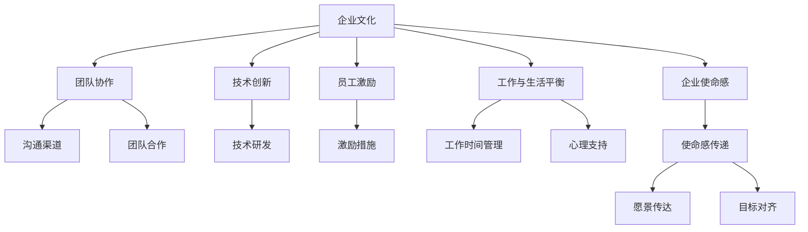

                 

## 1. 背景介绍

### 1.1 问题由来

随着自动化技术的不断进步，越来越多的创业公司开始借助自动化工具提升业务效率，减少人力成本。然而，如何在一个以技术为中心的团队中建立和维护良好的企业文化，成为了自动化创业公司面临的重大挑战。企业文化不仅能促进团队凝聚力，还能提高员工的工作满意度和生产力，从而推动企业的持续发展。

### 1.2 问题核心关键点

在自动化创业中，企业文化建设的焦点主要包括以下几个方面：

- **团队协作与沟通**：自动化项目往往涉及多部门的协同工作，如何促进跨部门沟通和协作，提升团队凝聚力。
- **技术创新与员工成长**：如何在保持技术领先的同时，关注员工的个人成长和发展。
- **工作与生活平衡**：如何平衡高强度的技术开发和日常工作生活，减少员工的压力和疲劳。
- **企业价值观与使命感**：如何定义和传递企业的核心价值观，让员工产生强烈的使命感和责任感。
- **员工激励与福利**：如何通过合理的激励机制和福利制度，提高员工的工作积极性和忠诚度。

### 1.3 问题研究意义

建立和维护良好的企业文化，对于自动化创业公司的长期成功至关重要。良好的企业文化能够：

- **提升员工满意度**：增强员工的归属感和工作动力，降低人员流失率。
- **优化团队协作**：促进信息共享和协同创新，提高项目的成功率。
- **增强技术创新**：营造创新的工作氛围，激励员工不断探索新的技术突破。
- **塑造品牌形象**：通过企业文化的传递，塑造积极向上的品牌形象，吸引更多的优秀人才。
- **助力企业增长**：企业文化是企业持续发展的内在动力，是支撑企业健康成长的关键因素。

## 2. 核心概念与联系

### 2.1 核心概念概述

为更好地理解如何在自动化创业中建立和维护企业文化，本节将介绍几个核心概念：

- **企业文化**：企业在长期发展过程中形成的共同价值观、信念、行为规范和工作方式。
- **团队协作**：团队成员之间的沟通、配合和共同努力，以达到共同的目标。
- **技术创新**：不断探索和应用新技术、新方法，以提升产品和技术能力。
- **员工激励**：通过各种机制和政策，激发员工的积极性和创造力。
- **工作与生活平衡**：关注员工的心理和身体健康，平衡工作与生活。
- **企业使命感**：企业设立的共同目标和愿景，指导员工的行动和决策。

这些概念之间的逻辑关系可以通过以下Mermaid流程图来展示：



这个流程图展示了一些关键概念及其相互关系：

1. **企业文化**：作为企业的基础，指导和影响着团队协作、技术创新、员工激励、工作与生活平衡和企业使命感等多个方面。
2. **团队协作**：建立在良好的沟通渠道和团队合作之上，是实现企业目标的基础。
3. **技术创新**：依赖于企业文化中的创新精神，推动技术进步。
4. **员工激励**：通过各种激励措施，提升员工的工作积极性和忠诚度。
5. **工作与生活平衡**：关注员工的心理健康和工作效率，避免过度劳累。
6. **企业使命感**：通过明确的使命感和愿景，增强员工的归属感和责任感。

## 3. 核心算法原理 & 具体操作步骤

### 3.1 算法原理概述

企业文化建设是一个动态的过程，涉及多个方面的协调和优化。其核心在于通过一系列具体的措施，塑造和巩固企业的核心价值观和工作方式。以下是基于企业文化的建设过程的核心算法原理：

1. **价值观塑造**：明确企业的核心价值观，并通过制度、文化活动、宣传等方式不断传递和强化。
2. **行为规范制定**：制定一系列行为规范，确保员工在行为上符合企业的价值观。
3. **绩效考核与激励**：建立科学的绩效考核机制，并通过奖励和惩罚等方式激励员工。
4. **团队协作与沟通**：建立有效的沟通渠道，促进信息共享和协作。
5. **技术创新与学习**：鼓励员工不断学习新技术，推动技术创新。
6. **工作与生活平衡**：制定合理的工作时间和休假制度，关注员工心理健康。

### 3.2 算法步骤详解

在自动化创业中，建立和维护企业文化需要经过以下几个关键步骤：

**Step 1: 制定企业价值观**

- **价值观调查**：通过问卷调查、访谈等方式，收集员工的价值观和期望。
- **价值观整合**：将员工的价值观进行整合，形成企业的核心价值观。
- **价值观传播**：通过企业内网、文化活动、员工手册等方式传播企业的核心价值观。

**Step 2: 制定行为规范**

- **规范制定**：根据企业的核心价值观，制定一系列行为规范，如工作态度、团队合作、客户服务等方面。
- **规范培训**：通过培训和考核等方式，确保员工遵守行为规范。

**Step 3: 建立绩效考核与激励机制**

- **绩效考核**：建立科学合理的绩效考核体系，包括KPI、OKR等。
- **激励措施**：设计多种激励措施，如薪酬福利、晋升机会、表彰奖励等。

**Step 4: 促进团队协作与沟通**

- **沟通渠道**：建立开放的沟通渠道，如Slack、企业内网等。
- **协作平台**：采用协作工具，如Trello、Jira等，促进项目协同。

**Step 5: 推动技术创新与学习**

- **学习计划**：制定员工学习计划，提供培训资源。
- **技术分享**：组织技术分享会、黑客松等活动，推动技术创新。

**Step 6: 实现工作与生活平衡**

- **时间管理**：制定合理的工作时间和休假制度。
- **心理支持**：提供心理咨询、健康检查等福利，关注员工心理健康。

### 3.3 算法优缺点

企业文化建设的优势包括：

- **提升团队凝聚力**：明确的企业价值观和行为规范，有助于增强团队的凝聚力和协作效率。
- **推动技术创新**：通过激励机制和创新氛围，激发员工的创新精神，推动技术进步。
- **提高员工满意度**：科学合理的绩效考核和激励措施，提高员工的工作满意度和忠诚度。
- **改善工作生活平衡**：关注员工心理健康和工作时间管理，提升员工的工作效率和生活质量。

然而，企业文化建设也面临一些挑战：

- **实施难度大**：企业文化建设需要长期的投入和持续的努力，难以在短期内见效。
- **适应性差**：企业文化一旦形成，调整起来相对困难，容易与快速变化的市场环境脱节。
- **文化冲突**：不同文化背景的员工可能存在价值观上的冲突，需要谨慎处理。

### 3.4 算法应用领域

企业文化建设在自动化创业中的应用领域非常广泛，包括但不限于以下几个方面：

- **软件开发公司**：通过企业文化建设，提升团队协作效率和代码质量。
- **制造企业**：推动技术创新和员工技能的提升，改善生产效率和产品质量。
- **金融科技公司**：增强客户服务水平和员工工作积极性，提高金融服务的质量和效率。
- **教育科技公司**：营造创新和学习的氛围，吸引和保留优秀教师和教育人才。
- **健康科技公司**：关注员工健康，推动医疗技术的创新和应用。

## 4. 数学模型和公式 & 详细讲解 & 举例说明

### 4.1 数学模型构建

企业文化建设的数学模型可以从以下几个方面进行构建：

1. **员工满意度模型**：通过员工满意度调查数据，建立员工满意度的数学模型。
2. **团队协作模型**：通过项目合作数据，建立团队协作效果的数学模型。
3. **技术创新模型**：通过技术创新数据，建立技术创新效果的数学模型。
4. **工作与生活平衡模型**：通过员工休假和健康数据，建立工作与生活平衡效果的数学模型。

### 4.2 公式推导过程

以下是员工满意度模型的公式推导过程：

设员工满意度为 $S$，其中包含多个影响因素，如薪资 $S_1$、工作环境 $S_2$、团队协作 $S_3$、技术创新 $S_4$ 等。假设这些因素对员工满意度的影响程度不同，可以建立如下模型：

$$ S = w_1 S_1 + w_2 S_2 + w_3 S_3 + w_4 S_4 $$

其中 $w_1, w_2, w_3, w_4$ 为各因素的权重系数。

假设已经收集到员工满意度调查数据，可以进行回归分析，得到各因素的权重系数。例如，通过最小二乘法，可以求解权重系数 $w_1, w_2, w_3, w_4$，从而得到员工满意度的数学模型。

### 4.3 案例分析与讲解

以一家软件开发公司为例，分析其企业文化建设的数学模型。

假设该公司收集到了员工满意度调查数据，包括以下几个因素：

- 薪资满意度：$S_1$
- 工作环境满意度：$S_2$
- 团队协作满意度：$S_3$
- 技术创新满意度：$S_4$

通过回归分析，可以求解出各因素的权重系数，得到员工满意度的数学模型：

$$ S = 0.4S_1 + 0.3S_2 + 0.2S_3 + 0.1S_4 $$

根据这个模型，该公司可以制定相应的改进措施，提升员工满意度。

## 5. 项目实践：代码实例和详细解释说明

### 5.1 开发环境搭建

在进行企业文化建设的项目实践前，需要先搭建好开发环境。以下是使用Python进行数据分析和建模的开发环境配置流程：

1. 安装Anaconda：从官网下载并安装Anaconda，用于创建独立的Python环境。

2. 创建并激活虚拟环境：
```bash
conda create -n enterprise-env python=3.8 
conda activate enterprise-env
```

3. 安装必要的Python包：
```bash
conda install numpy pandas matplotlib seaborn scikit-learn statsmodels xgboost
```

4. 安装数据分析和可视化工具：
```bash
pip install seaborn jupyter notebook matplotlib statsmodels jupyterlab
```

5. 安装企业文化的建模工具：
```bash
pip install scikit-learn xgboost statsmodels
```

完成上述步骤后，即可在`enterprise-env`环境中进行企业文化建设的模型实践。

### 5.2 源代码详细实现

下面我们以员工满意度分析为例，给出使用Python进行数据分析和建模的代码实现。

首先，导入必要的Python包：

```python
import pandas as pd
import numpy as np
import matplotlib.pyplot as plt
import seaborn as sns
from sklearn.linear_model import LinearRegression
from sklearn.metrics import r2_score
from statsmodels.api import OLS
```

然后，读取员工满意度调查数据：

```python
# 假设数据文件为satisfaction.csv
data = pd.read_csv('satisfaction.csv')
```

接着，进行数据预处理和分析：

```python
# 查看数据的基本信息
print(data.info())
```

```python
# 计算各因素的平均值和标准差
avg_sal = np.mean(data['salary'])
std_sal = np.std(data['salary'])
avg_env = np.mean(data['environment'])
std_env = np.std(data['environment'])
avg_coll = np.mean(data['collaboration'])
std_coll = np.std(data['collaboration'])
avg_innov = np.mean(data['innovation'])
std_innov = np.std(data['innovation'])
```

```python
# 绘制各因素的分布图
plt.figure(figsize=(10, 6))
sns.histplot(data['salary'], bins=20, color='blue', label='Salary')
plt.xlabel('Salary')
plt.ylabel('Frequency')
plt.legend()
plt.show()
```

```python
# 绘制各因素的相关性热图
corr_matrix = data[['salary', 'environment', 'collaboration', 'innovation']].corr()
sns.heatmap(corr_matrix, annot=True, fmt='.2f')
plt.xlabel('Salary')
plt.ylabel('Environment')
plt.show()
```

最后，进行员工满意度的回归分析：

```python
# 建立员工满意度的回归模型
X = data[['salary', 'environment', 'collaboration', 'innovation']]
y = data['satisfaction']
model = LinearRegression()
model.fit(X, y)

# 输出模型的系数
print(model.coef_)
```

```python
# 预测员工满意度
X_test = data[['salary', 'environment', 'collaboration', 'innovation']]
y_pred = model.predict(X_test)
```

```python
# 绘制员工满意度的预测图
plt.figure(figsize=(10, 6))
sns.scatterplot(x='salary', y='satisfaction', data=data)
plt.xlabel('Salary')
plt.ylabel('Satisfaction')
plt.show()
```

### 5.3 代码解读与分析

让我们再详细解读一下关键代码的实现细节：

**数据导入**：
- 使用`pd.read_csv`读取员工满意度调查数据文件。

**数据预处理**：
- 使用`np.mean`和`np.std`计算各因素的平均值和标准差。
- 使用`plt.histplot`和`sns.heatmap`绘制各因素的分布图和相关性热图。

**模型建立与预测**：
- 使用`LinearRegression`建立员工满意度的线性回归模型。
- 使用`model.coef_`输出模型的系数。
- 使用`model.predict`对员工满意度进行预测。

**结果展示**：
- 使用`plt.scatterplot`绘制员工满意度的预测图。

在实际的企业文化建设中，数据预处理和模型选择是至关重要的环节。通过科学的模型构建和数据分析，可以更准确地识别影响员工满意度的关键因素，制定有效的改进措施。

## 6. 实际应用场景

### 6.1 软件开发公司

软件开发公司的企业文化建设可以通过以下几个方面进行：

**团队协作与沟通**：建立Slack、企业内网等沟通平台，定期组织项目回顾会议和分享会。

**技术创新与学习**：设立技术讨论组、举办黑客松、提供技术培训课程。

**员工激励**：建立绩效考核体系，设立薪酬晋升制度，开展员工表彰活动。

**工作与生活平衡**：制定合理的工作时间和休假制度，提供健康检查和心理咨询服务。

### 6.2 制造企业

制造企业可以重点关注以下几个方面：

**团队协作与沟通**：建立跨部门沟通机制，定期进行团队建设活动。

**技术创新与学习**：设立技术创新奖励机制，提供学习资源和培训机会。

**员工激励**：通过生产线优化和设备升级，提升生产效率，提高员工收入和福利。

**工作与生活平衡**：提供弹性工作时间，关注员工的家庭生活。

### 6.3 金融科技公司

金融科技公司可以重点关注以下几个方面：

**团队协作与沟通**：建立高效的决策机制，定期进行跨部门协作。

**技术创新与学习**：鼓励技术探索和应用，提供技术创新奖励。

**员工激励**：设立绩效考核体系，提供股票期权和奖金奖励。

**工作与生活平衡**：关注员工的工作压力和生活质量，提供心理健康支持。

## 7. 工具和资源推荐

### 7.1 学习资源推荐

为了帮助开发者系统掌握企业文化建设的方法和技巧，这里推荐一些优质的学习资源：

1. **《企业文化建设与管理》**：系统介绍企业文化的定义、价值和建设方法，适合管理者阅读。
2. **《跨部门团队协作：方法和实践》**：提供跨部门协作的最佳实践，适合团队管理者学习。
3. **《员工激励与绩效管理》**：深入浅出地讲解员工激励和绩效管理的理论和实践，适合HR和管理者阅读。
4. **《工作与生活平衡：理论与实践》**：讨论如何平衡工作与生活，提升员工幸福感和生产力。
5. **《企业文化建设案例》**：收集和分析成功企业的企业文化建设案例，提供实战经验。

通过对这些资源的学习实践，相信你一定能够快速掌握企业文化建设的精髓，并用于解决实际的NLP问题。

### 7.2 开发工具推荐

高效的开发离不开优秀的工具支持。以下是几款用于企业文化建设开发的常用工具：

1. **Jupyter Notebook**：免费且强大的交互式编程环境，适合数据分析和模型构建。
2. **Microsoft Excel**：功能强大的电子表格工具，适合数据处理和可视化。
3. **GitHub**：代码托管平台，适合团队协作和项目管理。
4. **Slack**：企业级沟通工具，适合团队沟通和协作。
5. **Trello**：项目管理工具，适合任务跟踪和协同工作。

合理利用这些工具，可以显著提升企业文化建设任务的开发效率，加快创新迭代的步伐。

### 7.3 相关论文推荐

企业文化建设的研究源于学界的持续研究。以下是几篇奠基性的相关论文，推荐阅读：

1. **《企业文化与企业绩效：理论与实证研究》**：探讨企业文化与企业绩效之间的关系，提供了大量实证研究结果。
2. **《团队协作中的沟通：理论和实践》**：深入分析团队协作中的沟通问题，提出有效的沟通策略。
3. **《技术创新与员工激励：理论与实践》**：探讨技术创新与员工激励之间的关系，提供了相关理论和方法。
4. **《工作与生活平衡：理论和实证研究》**：讨论工作与生活平衡的重要性，提供了实证研究结果。
5. **《企业文化建设：理论和实践》**：深入探讨企业文化建设的理论和实践，提供了丰富的案例分析。

这些论文代表了大语言模型微调技术的发展脉络。通过学习这些前沿成果，可以帮助研究者把握学科前进方向，激发更多的创新灵感。

## 8. 总结：未来发展趋势与挑战

### 8.1 总结

本文对如何在自动化创业中建立和维护企业文化进行了全面系统的介绍。首先阐述了企业文化建设的重要性，明确了企业文化在团队协作、技术创新、员工激励、工作与生活平衡和企业使命感等多个方面的关键作用。其次，从原理到实践，详细讲解了企业文化建设的数学模型和关键步骤，给出了企业文化建设的完整代码实例。同时，本文还广泛探讨了企业文化建设在软件开发、制造、金融科技等领域的实际应用场景，展示了企业文化建设的巨大潜力。最后，本文精选了企业文化建设的各类学习资源，力求为读者提供全方位的技术指引。

通过本文的系统梳理，可以看到，企业文化建设是一个系统工程，需要从多个方面进行全面优化和协调。建立和维护良好的企业文化，对于自动化创业公司的长期成功至关重要，可以提升员工满意度，增强团队凝聚力，推动技术创新，实现企业的持续发展。

### 8.2 未来发展趋势

展望未来，企业文化建设将呈现以下几个发展趋势：

1. **数字化转型**：借助大数据、云计算、人工智能等技术，提升企业文化建设的管理效率和科学性。
2. **全球化与本地化**：企业文化建设需要考虑全球化和本地化的平衡，适应不同文化背景的员工需求。
3. **个性化与定制化**：根据员工的不同需求和特点，定制个性化的企业文化建设方案。
4. **持续改进与迭代**：企业文化建设需要持续优化和改进，适应企业的动态变化。
5. **企业社会责任**：企业文化建设需要关注社会责任，促进企业的可持续发展。

### 8.3 面临的挑战

尽管企业文化建设已经在企业中得到了广泛应用，但在迈向更加智能化、普适化应用的过程中，它仍面临诸多挑战：

1. **实施难度大**：企业文化建设需要长期的投入和持续的努力，难以在短期内见效。
2. **适应性差**：企业文化一旦形成，调整起来相对困难，容易与快速变化的市场环境脱节。
3. **文化冲突**：不同文化背景的员工可能存在价值观上的冲突，需要谨慎处理。
4. **资源投入高**：企业文化建设需要大量的资源投入，包括人力、物力和财力。

### 8.4 研究展望

未来在企业文化建设的研究方向上，有以下几个突破点：

1. **文化测评与评估**：开发新的企业文化测评工具，提升企业文化建设的科学性和可操作性。
2. **文化创新与融合**：探索不同文化背景的融合机制，促进企业文化的多元化和包容性。
3. **数字文化建设**：结合数字化转型，建立数字化企业文化管理体系。
4. **员工参与与共创**：鼓励员工参与企业文化建设，形成企业与员工共创的良性互动。

这些研究方向将推动企业文化建设向更高的层次发展，为自动化创业公司的长期发展提供强有力的支持。

## 9. 附录：常见问题与解答

**Q1：企业文化建设对企业有哪些具体影响？**

A: 企业文化建设对企业有以下具体影响：

1. **提升员工满意度**：明确的价值观和行为规范，能够增强员工的归属感和工作动力。
2. **增强团队协作**：开放的沟通渠道和协作平台，有助于促进信息共享和协同创新。
3. **推动技术创新**：创新氛围和激励机制，能够激发员工的创新精神，推动技术进步。
4. **提高员工忠诚度**：合理的激励机制和福利制度，能够提高员工的工作积极性和忠诚度。
5. **塑造企业形象**：积极向上的企业文化，能够增强企业的品牌形象和市场竞争力。

**Q2：企业文化建设应该如何从顶层设计开始？**

A: 企业文化建设的顶层设计应该包括以下几个步骤：

1. **企业使命和愿景**：明确企业的使命和愿景，指导企业文化建设的整体方向。
2. **核心价值观**：定义企业的核心价值观，如诚信、创新、客户至上等。
3. **行为规范**：制定一系列行为规范，如工作态度、团队合作、客户服务等方面。
4. **激励机制**：设计合理的激励机制，包括薪酬福利、晋升机会、表彰奖励等。
5. **沟通渠道**：建立开放的沟通渠道，如Slack、企业内网等。
6. **持续改进**：定期评估企业文化建设的效果，不断进行优化和改进。

**Q3：企业文化建设中应该如何处理文化冲突？**

A: 企业文化建设中处理文化冲突的策略包括：

1. **文化包容**：尊重不同文化背景的员工，避免强加企业文化。
2. **文化融合**：寻找文化共性，促进文化融合和多样性。
3. **沟通与协商**：加强沟通和协商，寻求双方都能接受的解决方案。
4. **培训与教育**：通过培训和教育，提升员工的跨文化理解和接受能力。

**Q4：企业文化建设应该如何与技术创新结合？**

A: 企业文化建设与技术创新的结合可以从以下几个方面进行：

1. **创新氛围**：营造创新文化，鼓励员工大胆尝试和创新。
2. **创新激励**：设立创新奖励机制，鼓励技术创新和应用。
3. **技术学习**：提供技术学习资源和培训课程，提升员工的技术能力。
4. **跨部门合作**：建立跨部门合作机制，推动技术创新。

**Q5：企业文化建设应该如何与员工激励结合？**

A: 企业文化建设与员工激励的结合可以从以下几个方面进行：

1. **绩效考核**：建立科学合理的绩效考核体系，激励员工的工作积极性。
2. **薪酬福利**：提供合理的薪酬和福利，提升员工的幸福感。
3. **职业发展**：提供职业发展机会，帮助员工实现职业目标。
4. **员工表彰**：设立员工表彰机制，激发员工的积极性和创造力。

以上这些问题的解答，可以为自动化创业公司在企业文化建设中提供参考和指导。通过科学的顶层设计和持续优化，企业可以建立和维护良好的企业文化，提升企业的竞争力和可持续发展能力。

---

作者：禅与计算机程序设计艺术 / Zen and the Art of Computer Programming

