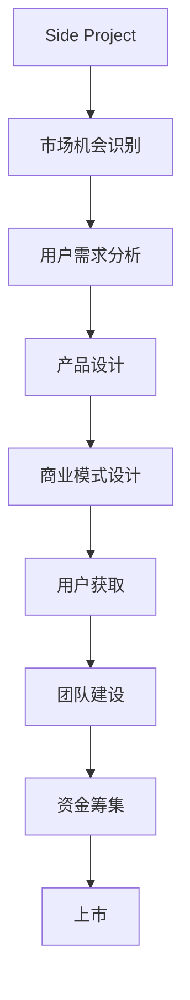

                 

# 如何将Side Project转化为估值上亿的创业公司

## 1. 背景介绍

### 1.1 问题由来
在互联网行业，将一个个人兴趣项目（Side Project）转化为估值上亿的创业公司（Unicorn）并非易事，但并非不可能。成功的例子，如Slack、Dropbox和GitHub，证明了即使是个人项目，通过精心规划、市场机遇和商业模式的正确选择，也可以成为行业巨头。本文将详细探讨如何将个人兴趣项目转化为商业成功，为有志于实现这一目标的创业者提供指导。

### 1.2 问题核心关键点
将Side Project转化为创业公司的关键在于：

- **市场机会**：识别并深入理解目标市场的潜在需求和问题。
- **商业模式**：设计出可行、可持续的商业模式。
- **用户获取**：有效推广产品，吸引大量用户。
- **团队建设**：组建一个具有强大执行力、互补技能和共同愿景的团队。
- **资金筹集**：通过各种融资渠道，确保项目持续发展。

## 2. 核心概念与联系

### 2.1 核心概念概述

- **Side Project**：指个人在闲暇时间开发的项目，通常是为了解决特定的兴趣或问题，而不以盈利为目的。
- **创业公司**：指专注于特定市场或领域，以盈利为目的的公司。
- **市场机会**：指特定市场中未被满足的消费者需求或问题。
- **商业模式**：指企业通过提供价值获取收入的策略和渠道，包括产品、定价、推广和渠道。
- **用户获取**：指通过各种策略吸引并留住用户的过程，包括社交媒体、SEO、内容营销等。
- **团队建设**：指招募、培养和激励团队成员，建立文化认同和合作精神。
- **资金筹集**：指通过风险投资、众筹、贷款等方式获取必要的启动资金和运营资金。

这些概念之间的联系可以通过以下Mermaid流程图来展示：



这个流程图展示了一个Side Project转化为创业公司的主要流程：从识别市场机会开始，经过需求分析、产品设计、商业模式设计、用户获取、团队建设和资金筹集，最终实现公司的上市。

## 3. 核心算法原理 & 具体操作步骤

### 3.1 算法原理概述

将Side Project转化为创业公司，本质上是一个从0到1的创业过程，涉及多个阶段的综合决策和执行。每个阶段都需要对市场、产品、商业和团队进行全面分析，以确保项目成功。以下是核心算法原理和具体操作步骤：

### 3.2 算法步骤详解

**Step 1: 市场机会识别**

- **市场研究**：使用SWOT分析（优势、劣势、机会、威胁）和PEST分析（政治、经济、社会、技术）等方法，全面分析目标市场的潜在机会。
- **用户调研**：通过问卷、访谈和用户测试等手段，深入了解目标用户的痛点和需求。
- **竞争分析**：研究竞争对手的优劣势，识别市场空白和机会。

**Step 2: 商业模式设计**

- **价值主张**：明确产品或服务为用户提供的核心价值。
- **收入模型**：确定主要的收入来源，如订阅、广告、交易佣金等。
- **成本结构**：分析项目启动和运营所需的成本，包括固定成本和变动成本。
- **盈利预测**：基于市场假设，预测公司的收入和利润。

**Step 3: 产品设计**

- **用户界面设计**：设计直观易用的产品界面，提升用户体验。
- **功能规划**：确定核心功能及其优先级，确保产品能够满足用户需求。
- **技术选型**：选择合适的前端和后端技术，确保产品性能和可扩展性。

**Step 4: 用户获取**

- **营销策略**：制定推广计划，包括社交媒体、SEO、内容营销、付费广告等。
- **渠道选择**：选择适当的销售渠道，如官网、App Store、Google Play等。
- **用户反馈**：通过用户反馈不断改进产品和服务，提高用户满意度。

**Step 5: 团队建设**

- **角色分工**：根据团队成员的技能和兴趣，明确各自职责。
- **文化建设**：建立共同的目标和价值观，增强团队凝聚力。
- **培训与发展**：提供持续的培训和发展机会，提升团队能力。

**Step 6: 资金筹集**

- **财务规划**：制定详细的财务计划，包括预算、资金需求和融资策略。
- **投资者关系**：建立与潜在投资者的联系，准备投资者演示和商业计划书。
- **融资渠道**：选择适合的项目融资方式，包括风险投资、天使投资、众筹和贷款等。

**Step 7: 上市与扩张**

- **上市准备**：完成所有必要的法律和财务准备工作，准备上市。
- **扩张策略**：根据市场需求，制定全球或区域扩张计划。
- **持续发展**：持续关注市场变化，及时调整产品和服务策略。

### 3.3 算法优缺点

将Side Project转化为创业公司的方法具有以下优点：

- **低成本创业**：相较于传统创业，Side Project通常初始投资较小，风险较低。
- **市场验证**：通过Side Project初步验证市场潜力，降低正式创业的风险。
- **持续迭代**：Side Project可以不断迭代，优化产品和服务，提高成功概率。

但该方法也存在一些缺点：

- **资源限制**：Side Project通常缺乏正式创业的资源，包括资金、时间和团队。
- **商业化挑战**：将兴趣项目商业化需要重新规划产品策略，可能遇到创新瓶颈。
- **市场适应性**：个人兴趣项目可能未能完全满足市场需求，需要进一步市场调研。

## 4. 数学模型和公式 & 详细讲解 & 举例说明

### 4.1 数学模型构建

假设有一个Side Project A，其市场机会为 $M_A$，用户需求为 $D_A$，成本结构为 $C_A$，收入模型为 $I_A$，营销预算为 $B_A$，团队规模为 $T_A$。

**目标函数**：最大化公司利润 $P$，即 $P = I_A - C_A$。

**约束条件**：
- 用户需求满足度 $D_A \geq \theta \cdot M_A$
- 营销预算 $B_A \geq \phi \cdot M_A$
- 团队规模 $T_A \geq \psi \cdot M_A$

其中，$\theta$、$\phi$ 和 $\psi$ 为预设的比例系数。

### 4.2 公式推导过程

设市场机会 $M_A$ 为 $x$，用户需求 $D_A$ 为 $y$，则目标函数和约束条件可以表示为：

$$
\max P(x, y) = I_A(x, y) - C_A(x, y)
$$

约束条件为：

$$
\begin{cases}
y \geq \theta \cdot x \\
B_A(x) \geq \phi \cdot x \\
T_A(x) \geq \psi \cdot x
\end{cases}
$$

其中，$I_A(x, y)$ 为收入函数，$C_A(x, y)$ 为成本函数，$B_A(x)$ 为营销预算函数，$T_A(x)$ 为团队规模函数。

**优化问题**：

$$
\begin{aligned}
\max & \quad I_A(x, y) - C_A(x, y) \\
\text{subject to} & \quad 
\begin{cases}
y \geq \theta \cdot x \\
B_A(x) \geq \phi \cdot x \\
T_A(x) \geq \psi \cdot x
\end{cases}
\end{aligned}
$$

### 4.3 案例分析与讲解

**案例一：Slack的崛起**

Slack的前身是一个个人项目，其创始人在大学时发现团队沟通效率低下，于是利用业余时间开发了Slack。

**市场机会识别**：创始人在项目初期通过调研和用户反馈，确认Slack能够解决企业沟通效率低下的问题，市场潜力巨大。

**商业模式设计**：Slack采用订阅模式，提供免费的基础版本和高级功能的付费订阅。

**产品设计**：产品设计简洁、易于使用，支持多平台接入和丰富的插件生态。

**用户获取**：通过早期用户口碑和定向营销，吸引大量企业用户。

**团队建设**：初期团队成员不多，但凝聚力强，共同愿景明确。

**资金筹集**：通过天使投资和风险投资，获得充足的启动资金。

**上市与扩张**：Slack最终被Salesforce收购，成为市场领导者。

## 5. 项目实践：代码实例和详细解释说明

### 5.1 开发环境搭建

开发环境搭建主要涉及以下步骤：

- **选择编程语言**：选择Python、Java、JavaScript等适合的编程语言。
- **搭建开发环境**：安装所需开发工具，如IDE、版本控制系统等。
- **部署测试环境**：准备测试服务器，搭建测试环境，确保代码能够在真实环境中运行。

**具体步骤**：

1. 安装Python、Java或JavaScript IDE。
2. 安装版本控制系统（如Git）。
3. 搭建测试服务器，安装Web服务器和数据库等组件。
4. 部署测试环境，配置测试数据和脚本。

### 5.2 源代码详细实现

**代码示例**：

```python
# 导入所需的库和模块
import requests
from flask import Flask, request

# 初始化Flask应用
app = Flask(__name__)

# 定义API接口
@app.route('/api/hello', methods=['GET'])
def hello():
    # 获取请求参数
    name = request.args.get('name')
    # 返回JSON响应
    return {'message': f'Hello, {name}!'} if name else {'error': 'Please provide a name'}

# 运行Flask应用
if __name__ == '__main__':
    app.run(debug=True, port=5000)
```

**解释说明**：
1. 导入Python的requests库和Flask框架。
2. 定义Flask应用和API接口。
3. 实现API接口，根据请求参数返回不同响应。
4. 运行应用，监听指定端口。

### 5.3 代码解读与分析

**代码解读**：

- **requests库**：用于发送HTTP请求，获取数据。
- **Flask框架**：轻量级Web框架，用于快速搭建Web应用。
- **JSON响应**：返回JSON格式的响应，便于前端处理。

**分析**：

- **优势**：代码简单、易读，可以快速搭建原型。
- **劣势**：限制较大，不适合复杂逻辑和大量并发请求。

## 6. 实际应用场景

### 6.4 未来应用展望

### 6.5 实际应用场景

**场景一：SaaS应用**

SaaS（Software as a Service）应用是Side Project转化为创业公司的常见模式。通过SaaS模式，企业可以通过订阅收入实现盈利。

**案例**：Salesforce的Lightning

**应用过程**：
1. **市场机会识别**：通过调研和用户反馈，确定市场对企业级协作工具的需求。
2. **商业模式设计**：采用订阅模式，提供基础和高级功能的不同定价方案。
3. **产品设计**：设计直观易用的界面，支持多平台接入和丰富的插件生态。
4. **用户获取**：通过定向营销和早期用户口碑，吸引大量企业用户。
5. **团队建设**：组建专业的技术团队，不断优化产品和服务。
6. **资金筹集**：通过风险投资和上市融资，获得充足的资金支持。

**场景二：B2B SaaS应用**

B2B SaaS应用面向企业用户，通过提供专业化的解决方案和定制服务，实现高收入和高毛利。

**案例**：Zendesk

**应用过程**：
1. **市场机会识别**：通过调研和用户反馈，确定市场对客户支持解决方案的需求。
2. **商业模式设计**：采用订阅模式，提供基础和高级功能的不同定价方案，并提供定制化服务。
3. **产品设计**：设计专业化的产品界面，支持多渠道接入和丰富的插件生态。
4. **用户获取**：通过定向营销和早期用户口碑，吸引大量企业用户。
5. **团队建设**：组建专业的技术团队，不断优化产品和服务。
6. **资金筹集**：通过风险投资和上市融资，获得充足的资金支持。

## 7. 工具和资源推荐

### 7.1 学习资源推荐

**资源一：在线课程**

1. Coursera《创业基础》：由斯坦福大学教授提供，涵盖创业的各个方面，包括市场调研、商业模式设计、资金筹集等。
2. Udacity《创业之路》：由知名创业公司CEO提供，涵盖创业的各个阶段，包括项目评估、用户获取、团队建设等。
3. edX《创业与创新》：由MIT教授提供，涵盖创业的各个方面，包括市场调研、商业模式设计、资金筹集等。

**资源二：书籍**

1. 《精益创业》：埃里克·莱斯著，讲述了精益创业的方法论，帮助创业者快速迭代产品和服务。
2. 《创业公司生存指南》：特拉维斯·克劳福德著，讲述了创业公司的生存和发展策略。
3. 《创业者的财务与会计》：曼尼什·迪帕克著，讲述了创业公司的财务和会计管理。

**资源三：网站和博客**

1. Y Combinator：全球领先的创业加速器，提供丰富的资源和信息。
2. TechCrunch：全球领先的科技新闻网站，涵盖最新的创业动态和投资信息。
3. Startup School：由知名创业公司Y Combinator提供的创业指南和资源。

### 7.2 开发工具推荐

**开发工具一：Python**

Python是Web开发中最常用的编程语言之一，其简洁易懂的语法和丰富的库支持，使得Web应用开发变得简单高效。

**工具推荐**：

1. Flask：轻量级的Web框架，易于上手。
2. Django：全功能的Web框架，适合复杂项目。
3. FastAPI：快速、高效、异步的Web框架，适合高并发场景。

**开发工具二：JavaScript**

JavaScript是Web前端开发中最常用的编程语言，其生态系统和框架支持丰富。

**工具推荐**：

1. React：流行的JavaScript库，用于构建动态用户界面。
2. Angular：全功能的JavaScript框架，提供丰富的功能和组件。
3. Vue.js：轻量级的JavaScript框架，易于上手。

**开发工具三：Python环境**

Python环境搭建是项目开发的基础，以下推荐几种常用的环境搭建方法：

1. Anaconda：Python的集成发行版，包含大量科学计算和数据分析的库。
2. Miniconda：轻量级的Python环境，适合快速搭建。
3. PyEnv：管理Python版本和环境的工具，方便切换和维护。

### 7.3 相关论文推荐

**论文一：《从0到1：创业公司的革命之路》** 

作者：彼得·蒂尔，讲述了从0到1的创业之路，包含市场调研、商业模式设计、资金筹集等关键环节。

**论文二：《精益创业》** 

作者：埃里克·莱斯，讲述了精益创业的方法论，强调快速迭代和用户反馈。

**论文三：《从1到10：打造成长型公司的策略》** 

作者：布莱克·雪莉，讲述了成长型公司的构建和管理策略，涵盖用户获取、团队建设、文化建设等。

## 8. 总结：未来发展趋势与挑战

### 8.1 研究成果总结

本文系统探讨了将Side Project转化为创业公司的各个关键环节，包括市场机会识别、商业模式设计、产品设计、用户获取、团队建设和资金筹集等。通过案例分析，展示了成功的创业公司如Slack、Salesforce和Zendesk的转型过程，提供了有价值的实践经验。

### 8.2 未来发展趋势

**趋势一：SaaS应用的普及**

SaaS应用已成为创业公司的主流模式，通过订阅收入实现盈利。未来SaaS应用将更加普及，市场规模将进一步扩大。

**趋势二：B2B SaaS应用的发展**

B2B SaaS应用将面向企业用户，提供专业化的解决方案和定制服务，实现高收入和高毛利。

**趋势三：AI和ML技术的应用**

人工智能和机器学习技术将深度融入创业公司的发展，提供更高效、更精准的解决方案。

**趋势四：生态系统的构建**

创业公司将更多地关注生态系统的构建，通过合作伙伴、插件和API等方式扩展业务范围。

### 8.3 面临的挑战

**挑战一：市场竞争激烈**

随着创业公司数量的增加，市场竞争将更加激烈，企业需要不断创新和优化产品和服务。

**挑战二：技术更新快速**

技术更新迭代迅速，创业公司需要持续关注最新技术动态，不断优化产品技术。

**挑战三：资金压力**

创业公司需要大量资金支持，资金筹集和财务管理成为关键挑战。

**挑战四：团队建设**

创业公司的团队建设需要耗费大量时间和精力，如何吸引和留住优秀人才是一个重要问题。

### 8.4 研究展望

未来，创业公司将需要更深入地研究市场、技术和团队建设等方面的挑战，结合最新技术和趋势，实现业务的持续发展和创新。

## 9. 附录：常见问题与解答

**Q1: Side Project和创业公司有何区别？**

A: Side Project是指个人在业余时间开发的项目，通常不以盈利为目的，更多是兴趣驱动；而创业公司是指以盈利为目的，专注于特定市场或领域的企业。

**Q2: 如何识别市场机会？**

A: 通过市场调研和用户反馈，了解潜在需求和问题，结合自身优势和资源，确定最有潜力的市场机会。

**Q3: 如何设计商业模式？**

A: 明确核心价值主张，确定主要收入来源，分析成本结构和盈利预测，确保商业模式可行和可持续。

**Q4: 如何获取用户？**

A: 制定有效的营销策略，选择适当的销售渠道，不断优化产品和服务，提高用户满意度和留存率。

**Q5: 如何筹集资金？**

A: 通过风险投资、天使投资、众筹和贷款等方式，获取充足的启动资金和运营资金，确保项目持续发展。

---

作者：禅与计算机程序设计艺术 / Zen and the Art of Computer Programming

