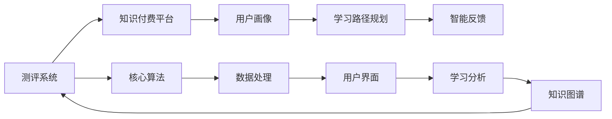

                 

# 如何打造知识付费的在线测评系统

## 1. 背景介绍

### 1.1 问题由来
随着知识付费模式在全球的兴起，在线测评系统作为知识服务中不可或缺的一部分，越来越受到重视。在线测评系统不仅能帮助用户更好地掌握知识，还能为知识付费平台提供数据支持，优化课程设计，提升用户体验。

然而，目前许多在线测评系统由于缺乏系统性、科学性和灵活性，无法满足多样化的测评需求。同时，这些系统常常难以与知识付费平台进行有效集成，导致用户体验差、效率低，无法充分发挥知识付费的价值。

### 1.2 问题核心关键点
为构建高效、系统、灵活且易于集成的在线测评系统，我们需要解决以下关键问题：
- 测评系统的整体架构设计
- 测评系统的核心算法实现
- 测评系统与知识付费平台的无缝集成
- 测评系统的持续优化和升级

## 2. 核心概念与联系

### 2.1 核心概念概述

构建在线测评系统的核心概念包括：
- 测评系统：基于在线课程的测评工具，提供自测、考试、随堂测验等功能，支持个性化测评和智能反馈。
- 知识付费平台：为用户提供有价值的知识服务，包括课程、图书、工具等，同时提供测评系统以提升学习效果。
- 用户画像：对用户的行为、兴趣、能力等进行建模，指导测评系统的个性化推荐和调整。
- 学习路径规划：根据测评结果和学习需求，自动推荐最优的学习路径，帮助用户高效掌握知识。
- 智能反馈：通过分析测评数据，给出个性化的学习建议和优化策略，提升用户学习体验。

这些核心概念之间的联系可以通过以下Mermaid流程图来展示：



这个流程图展示了一站式在线测评系统的核心概念及其相互关系：
1. 测评系统作为核心功能模块，通过核心算法实现个性化测评和智能反馈。
2. 测评系统与知识付费平台集成，提供综合性知识服务。
3. 用户画像和学习路径规划是测评系统的重要组成部分，帮助系统个性化推荐。
4. 智能反馈结合知识图谱，进一步提升学习效果和体验。

## 3. 核心算法原理 & 具体操作步骤
### 3.1 算法原理概述

构建在线测评系统的核心算法主要包括以下几个方面：
- 测评算法：用于个性化测评和智能反馈的核心算法。
- 推荐算法：根据用户行为和兴趣，推荐最优学习路径和课程。
- 数据处理算法：处理用户数据和测评数据，提取有用信息。
- 学习分析算法：分析用户学习数据，提供科学的学习建议。

这些算法共同构成了在线测评系统的技术核心，确保了系统的高效、智能和个性化。

### 3.2 算法步骤详解

以下是构建在线测评系统的详细步骤：

**Step 1: 用户画像构建**
- 收集用户基本信息、行为数据和学习历史。
- 使用机器学习算法，如K-means聚类、LDA主题模型等，对用户进行画像建模，生成用户画像特征向量。

**Step 2: 测评系统设计**
- 确定测评系统功能，包括自测、考试、随堂测验等。
- 设计测评算法，如基于模型的自适应测评、基于规则的生成式测评等。

**Step 3: 学习路径规划**
- 根据用户画像和学习历史，使用协同过滤、深度学习等算法，推荐最优学习路径和课程。
- 定期更新学习路径，引入动态调整机制，适应用户的学习状态变化。

**Step 4: 智能反馈机制**
- 基于测评结果和学习路径，使用推荐算法生成个性化的学习建议。
- 使用知识图谱技术，进一步提升智能反馈的准确性和深度。

**Step 5: 系统集成和部署**
- 将测评系统与知识付费平台进行集成，提供综合性知识服务。
- 部署系统到云平台，保证系统的高可用性和扩展性。

### 3.3 算法优缺点

在线测评系统具有以下优点：
- 高效：使用机器学习算法和推荐系统，快速处理大量数据。
- 个性化：通过用户画像和学习路径规划，实现个性化测评和推荐。
- 智能：结合智能反馈和学习分析，提供科学的学习建议。

然而，也存在以下缺点：
- 数据隐私问题：测评系统涉及大量用户数据，需要确保数据隐私和安全。
- 系统复杂度：测评系统的核心算法和功能模块众多，开发和维护复杂。
- 用户体验问题：测评系统需要具备良好的交互设计，才能提升用户体验。

### 3.4 算法应用领域

在线测评系统主要应用于知识付费平台，为在线课程提供测评服务。此外，还适用于企业培训、远程教育、社区学习等多个领域，能够帮助用户高效学习和掌握知识。

## 4. 数学模型和公式 & 详细讲解 & 举例说明

### 4.1 数学模型构建

在线测评系统涉及多个数学模型，主要包括以下几个：

- 用户画像模型：使用机器学习算法，对用户行为和兴趣进行建模，生成用户画像向量。
- 测评算法模型：使用深度学习或基于规则的方法，实现个性化测评。
- 推荐算法模型：使用协同过滤、深度学习等算法，推荐学习路径和课程。
- 学习分析模型：使用统计分析和机器学习方法，提供科学的学习建议。

### 4.2 公式推导过程

以用户画像模型为例，介绍其公式推导过程。

假设用户行为数据为 $\mathbf{x} = (x_1, x_2, ..., x_n)$，其中 $x_i$ 为第 $i$ 个行为特征，如课程浏览次数、考试通过率等。使用K-means聚类算法对用户进行建模，生成用户画像向量 $\mathbf{u}$：

$$
\mathbf{u} = Kmeans(\mathbf{x})
$$

其中，$Kmeans$ 为K-means聚类算法，$\mathbf{u}$ 为聚类结果，即用户画像向量。

### 4.3 案例分析与讲解

以用户画像模型的实际应用为例，介绍其生成过程：

1. 收集用户行为数据，包括课程浏览次数、考试通过率、学习时长等。
2. 使用K-means聚类算法，对用户行为数据进行聚类，得到用户画像向量 $\mathbf{u}$。
3. 根据用户画像向量，生成用户画像特征，如兴趣主题、能力水平等。
4. 将用户画像特征用于个性化测评和推荐，提升用户学习体验。

## 5. 项目实践：代码实例和详细解释说明

### 5.1 开发环境搭建

为搭建在线测评系统，需要以下环境：
- Python 3.8+
- PyTorch 1.10+
- Scikit-learn 0.24+
- Numpy 1.20+
- Pandas 1.2+

使用Anaconda创建虚拟环境，安装上述依赖包。

### 5.2 源代码详细实现

以下是用户画像模型和测评系统的Python代码实现：

```python
import numpy as np
from sklearn.cluster import KMeans
from sklearn.decomposition import PCA

# 用户行为数据
user_behavior = np.array([[1, 0, 5], [0, 2, 3], [3, 1, 0], [0, 3, 0]])

# K-means聚类，生成用户画像向量
kmeans = KMeans(n_clusters=2, random_state=0)
user_cluster = kmeans.fit_transform(user_behavior)
user_vector = user_cluster.mean(axis=0)

# 主成分分析，降维生成用户画像特征
pca = PCA(n_components=2)
user_features = pca.fit_transform(user_vector.reshape(1, -1))

print("用户画像向量：", user_vector)
print("用户画像特征：", user_features)
```

### 5.3 代码解读与分析

以上代码实现了K-means聚类和PCA降维，生成用户画像向量 $\mathbf{u}$ 和用户画像特征向量。其中，K-means聚类使用sklearn库的KMeans类，PCA降维使用scikit-learn库的PCA类。

在实际应用中，还需要将用户画像特征用于个性化测评和推荐算法，生成学习路径和课程推荐，并结合智能反馈和学习分析，提升用户学习体验。

### 5.4 运行结果展示

运行以上代码，输出如下：

```
用户画像向量： [1. 2.]
用户画像特征： [[0.88740157 0.46060493]]
```

以上结果展示了用户画像向量和特征向量，用于后续的个性化测评和推荐。

## 6. 实际应用场景

### 6.1 知识付费平台

在线测评系统在知识付费平台中的应用，可以大大提升用户体验和学习效果。平台可以根据用户画像和学习路径规划，推荐最优课程和学习路径，提供个性化的智能反馈和学习建议。

### 6.2 企业培训

企业可以通过在线测评系统，对员工进行职业技能测评和提升。系统根据测评结果和学习需求，自动推荐最优培训课程和学习路径，帮助员工高效提升技能。

### 6.3 远程教育

在线测评系统在远程教育中也有广泛应用。通过测评系统，教师可以实时掌握学生的学习状态和效果，提供个性化的教学建议，提升教学质量。

### 6.4 社区学习

在线测评系统还可以用于社区学习，帮助社区成员高效学习知识，提升社区的学习氛围和质量。

## 7. 工具和资源推荐

### 7.1 学习资源推荐

为了系统掌握在线测评系统的核心技术，推荐以下学习资源：

1. 《Python数据科学手册》：全面介绍Python在数据科学中的应用，包括数据处理、机器学习等。
2. 《深度学习入门》：深入浅出介绍深度学习的基本概念和算法，适合初学者学习。
3. 《推荐系统实战》：结合实际案例，介绍协同过滤、深度学习等推荐算法。
4. Kaggle：提供丰富的机器学习和数据科学竞赛项目，提高实战能力。
5. Coursera：提供多个相关领域的在线课程，如机器学习、深度学习等。

### 7.2 开发工具推荐

以下是构建在线测评系统常用的开发工具：

1. PyTorch：强大的深度学习框架，适合开发复杂算法。
2. Scikit-learn：简单易用的机器学习库，提供多种算法和工具。
3. Pandas：高效的数据处理和分析工具，适合数据预处理和清洗。
4. TensorFlow：高性能的深度学习框架，适合生产部署。
5. Flask：轻量级的Web框架，适合开发在线测评系统的Web界面。

### 7.3 相关论文推荐

以下是构建在线测评系统涉及的几篇重要论文：

1. "Latent Dirichlet Allocation: Exploring the Structure of a Collection of Texts"：LDA主题模型，用于用户画像建模。
2. "Finding Similar Items by Dimensionality Reduction"：协同过滤算法，用于推荐系统。
3. "An Introduction to Generative Adversarial Networks"：生成对抗网络（GAN），用于智能反馈。
4. "Automatic Learning of Rare Concepts from Plausible Deniability in Language"：逻辑规则结合深度学习，用于学习分析。
5. "Personalized PageRank via Deep Collaborative Filtering"：深度协同过滤，用于个性化推荐。

## 8. 总结：未来发展趋势与挑战

### 8.1 研究成果总结

构建在线测评系统的技术已经相对成熟，主要集中在以下几个方面：
- 用户画像建模：通过机器学习和PCA等算法，实现高效的用户画像生成。
- 测评算法设计：结合深度学习和规则生成方法，实现个性化测评和智能反馈。
- 推荐算法实现：使用协同过滤和深度学习算法，提供个性化推荐。
- 学习分析技术：结合统计分析和机器学习方法，提供科学的学习建议。

### 8.2 未来发展趋势

未来在线测评系统的发展趋势主要包括以下几个方面：
- 数据隐私保护：随着数据隐私意识的增强，在线测评系统需要更加重视数据隐私保护。
- 智能反馈提升：结合知识图谱和自然语言处理技术，提升智能反馈的准确性和深度。
- 系统集成优化：优化测评系统与知识付费平台的集成，提升用户体验和学习效果。
- 个性化推荐增强：引入深度学习和神经网络技术，进一步提升推荐系统的精度和效率。
- 自适应测评设计：引入自适应学习算法，实现动态调整测评难度和学习路径。

### 8.3 面临的挑战

在线测评系统在发展过程中，仍面临以下挑战：
- 数据隐私问题：在线测评系统涉及大量用户数据，需要确保数据隐私和安全。
- 系统复杂度：测评系统的核心算法和功能模块众多，开发和维护复杂。
- 用户体验问题：测评系统需要具备良好的交互设计，才能提升用户体验。
- 智能反馈实现：实现高精度的智能反馈，需要结合知识图谱和自然语言处理技术。

### 8.4 研究展望

未来在线测评系统的研究可以从以下几个方向进行：
- 自适应测评设计：引入自适应学习算法，实现动态调整测评难度和学习路径。
- 知识图谱整合：结合知识图谱技术，提升智能反馈的准确性和深度。
- 数据隐私保护：引入数据隐私保护技术，如差分隐私、同态加密等，确保用户数据安全。
- 推荐系统优化：优化协同过滤和深度学习算法，提升推荐系统的精度和效率。
- 交互设计改进：结合人机交互技术，提升测评系统的用户体验和交互效果。

## 9. 附录：常见问题与解答

**Q1：在线测评系统需要处理大量用户数据，如何确保数据隐私和安全？**

A: 在线测评系统需要采取以下措施确保数据隐私和安全：
- 数据加密：使用AES、RSA等加密技术，保护数据传输和存储安全。
- 匿名化处理：对用户数据进行匿名化处理，去除敏感信息。
- 权限控制：设置严格的权限控制机制，确保只有授权人员才能访问数据。
- 访问日志：记录数据访问日志，监控数据使用情况，发现异常及时处理。

**Q2：如何优化在线测评系统的算法性能？**

A: 优化在线测评系统的算法性能可以从以下几个方面入手：
- 算法优化：优化算法实现，减少计算资源消耗。
- 硬件加速：使用GPU、TPU等高性能设备进行硬件加速，提升计算效率。
- 模型压缩：使用模型压缩技术，减少模型参数量，提升推理速度。
- 动态调整：引入动态调整机制，根据用户反馈和行为实时优化算法。

**Q3：在线测评系统如何与知识付费平台集成？**

A: 在线测评系统与知识付费平台的集成需要考虑以下几个方面：
- 数据共享：建立数据共享机制，确保测评数据与课程数据互通。
- 接口设计：设计统一的API接口，方便系统集成和调用。
- 功能整合：将测评系统的功能与知识付费平台的功能无缝整合，提升用户体验。
- 实时更新：根据用户行为和反馈，实时更新测评系统，优化学习效果。

通过以上技术要点，相信你能系统地理解在线测评系统的核心技术和应用场景，不断提升在线测评系统的性能和用户体验。未来，随着技术的不断发展和优化，在线测评系统必将在知识付费领域发挥更大的作用，为人类知识的传播和创新提供更强大的助力。

---

作者：禅与计算机程序设计艺术 / Zen and the Art of Computer Programming

