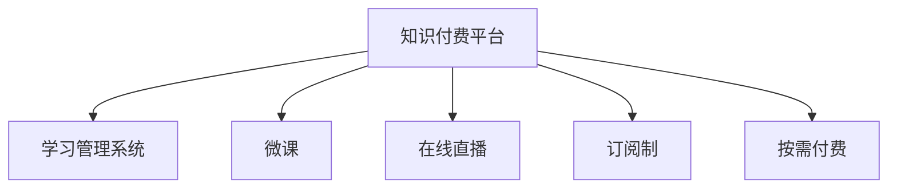

                 

## 1. 背景介绍

### 1.1 问题由来
在互联网和人工智能技术迅猛发展的今天，程序员的知识付费市场也日益壮大。一方面，随着软件工程复杂度的增加，程序员对于高层次、系统性、实用性强知识的渴望愈发强烈；另一方面，通过付费形式获取知识和经验，也成为程序员提高自我能力、解决工作问题的有效途径。

面对这样的市场需求，如何打造一款具有高认可度的程序员知识付费产品，成为众多在线教育平台和企业重点关注的问题。本文将详细探讨如何基于用户需求、市场定位、内容质量、运营策略等多维度，打造出满足广大程序员需求的知识付费产品。

### 1.2 问题核心关键点
一款成功的程序员知识付费产品需具备以下核心要素：
- **用户需求精准匹配**：充分理解目标用户需求，提供与需求高度契合的内容。
- **高质量教学内容**：内容严谨、实用性强，提供实际问题解决方案。
- **互动性和参与感**：构建用户与讲师、学员之间的互动，增加平台粘性。
- **数据驱动的迭代优化**：通过数据分析不断优化内容和用户体验，持续提升产品价值。
- **合理的商业模式**：实现内容价值和付费用户增长的良性循环。

本文将从这些关键点出发，为打造高认可度的程序员知识付费产品提供详细的策略和方法。

## 2. 核心概念与联系

### 2.1 核心概念概述

为了更好地理解如何打造高认可度的程序员知识付费产品，本节将介绍几个密切相关的核心概念：

- **知识付费平台(Knowledge-Pay Platform)**：为满足用户知识需求而搭建的在线教育平台，通过收取一定费用，提供高质量教学内容，并搭建用户交流互动社区。
- **学习管理系统(Learning Management System, LMS)**：提供课程管理、学员管理、考试测评等功能，帮助平台组织和运营课程。
- **微课(Micro-course)**：短小精悍的课程单元，通常时长数小时，主题明确，便于快速掌握某项技能。
- **在线直播(Live Streaming)**：讲师实时与学员互动，进行问题解答、代码演示、实践操作等，增加课程的互动性和参与感。
- **订阅制(Subscription Model)**：用户定期支付一定费用，即可获取平台上的全部课程内容，适用于知识深度高、需求持续更新的场景。
- **按需付费(Pay-As-You-Go Model)**：用户根据自身需求选择课程进行付费，适用于单次性强、短期高效提升的需求。

这些核心概念之间的逻辑关系可以通过以下Mermaid流程图来展示：



这个流程图展示了一些核心概念及其之间的关系：

1. 知识付费平台是整个系统的核心，通过集成多种功能模块，满足用户的学习需求。
2. 学习管理系统是知识付费平台的核心组件，负责课程和学员的管理。
3. 微课和在线直播是平台的教学形式，以短平快和互动性强的特点，吸引用户。
4. 订阅制和按需付费是平台的盈利模式，满足不同用户需求，保持平台长期发展。

## 3. 核心算法原理 & 具体操作步骤
### 3.1 算法原理概述

打造高认可度的程序员知识付费产品，本质上是一个涉及用户需求、产品设计、内容创作、运营推广等多个环节的复杂系统工程。从算法和步骤角度，可以大致分为以下几步：

1. **市场调研与用户需求分析**：了解目标用户的特点、需求、痛点，从而设计符合其期望的产品功能和内容。
2. **内容策划与课程设计**：围绕用户需求，策划并设计具有实用性和系统性的课程内容。
3. **技术架构设计与开发实现**：设计高效、稳定的技术架构，并开发实现相关功能模块。
4. **用户体验优化与迭代更新**：不断收集用户反馈，优化产品功能和界面，提升用户体验。
5. **市场营销与用户获取**：通过有效的市场推广策略，吸引和留存用户。

### 3.2 算法步骤详解

以下是具体详细的步骤：

**Step 1: 市场调研与用户需求分析**

- 收集用户反馈和市场数据：通过问卷调查、用户访谈、数据分析等手段，收集用户对现有知识付费产品的评价和建议。
- 分析用户画像和需求分布：利用机器学习算法，对用户特征进行聚类分析，识别不同用户群体的需求和痛点。
- 确定核心课程主题：根据用户需求分布，确定高关注度和需求高的核心课程主题。

**Step 2: 内容策划与课程设计**

- 定义课程目标和预期效果：明确每门课程的目标、受众、知识点和技能点，确定课程内容结构和难度。
- 设计课程结构和课程内容：根据课程目标，设计课程框架和每节微课的具体内容。
- 邀请专家和讲师参与课程制作：选择行业专家和资深讲师，参与课程的讲授和内容编写。

**Step 3: 技术架构设计与开发实现**

- 设计前后端架构：确定数据库、API、缓存、消息队列等技术组件，搭建前后端架构。
- 实现课程管理模块：包括课程发布、编辑、审核、上线等功能。
- 实现学员管理模块：包括学员注册、登录、订阅、学习进度跟踪等功能。
- 实现互动交流模块：包括直播、讨论区、问答、评分等功能。
- 集成第三方服务：如第三方支付、短信通知、邮件服务等，方便用户操作。

**Step 4: 用户体验优化与迭代更新**

- 收集用户使用数据：通过日志、使用数据、反馈等，分析用户使用情况和问题。
- 优化用户体验：根据用户反馈和数据分析，优化课程内容、界面设计、操作流程等。
- 进行迭代更新：定期发布新版本，持续改进产品功能和性能。

**Step 5: 市场营销与用户获取**

- 制定市场策略：包括内容推广、SEO优化、广告投放、合作联动等策略。
- 使用多渠道营销：通过社交媒体、技术社区、线下活动、推荐系统等多种渠道进行推广。
- 进行用户获取和留存：通过优惠活动、推荐机制、积分奖励等方式吸引和留存新用户。

### 3.3 算法优缺点

打造高认可度的程序员知识付费产品，具有以下优点：
1. **满足用户需求**：基于用户调研和数据分析，提供精准匹配的内容，满足用户实际需求。
2. **系统性和实用性**：通过精心策划和系统设计，课程内容实用性强，可操作性高。
3. **互动性强**：通过在线直播、讨论区等互动功能，增加用户参与感，提高学习效果。
4. **持续优化**：通过数据分析和用户反馈，不断优化产品功能和体验，保持竞争力。
5. **商业模式可持续**：通过合理的订阅和按需付费策略，实现内容价值的最大化。

同时，也存在一些局限性：
1. **高成本投入**：内容创作、讲师邀请、技术开发等成本较高。
2. **市场竞争激烈**：知识付费市场竞争者众多，获取和留存用户难度大。
3. **用户需求复杂多变**：不同用户的需求和兴趣差异大，难以全面满足。
4. **内容更新压力大**：新知识不断涌现，内容需要不断更新和迭代。

尽管存在这些局限性，但只要精准定位、系统设计、持续优化，知识付费产品仍有可能在竞争激烈的市场中脱颖而出，实现商业成功。

### 3.4 算法应用领域

知识付费产品的应用领域非常广泛，以下是几个典型场景：

1. **技术培训和认证**：面向编程语言、框架、工具等技术培训，提供系统化学习和认证考试。
2. **项目实战和开发工具**：提供实战项目、开发工具、软件工程方法等知识，帮助开发者提升技能。
3. **行业应用和专业技能**：提供行业应用场景、专业技能培训，如金融科技、人工智能、大数据等。
4. **个人发展和职业规划**：提供职业规划、软技能培训、个人品牌建设等，帮助用户实现职业发展。
5. **企业培训和团队提升**：面向企业内训，提供定制化课程、团队合作技能等，提升团队绩效。

这些应用领域展示了知识付费产品在技术、职业和个人发展等多方面的价值。

## 4. 数学模型和公式 & 详细讲解 & 举例说明

### 4.1 数学模型构建

本节将使用数学语言对知识付费产品的内容设计和用户管理进行严格的刻画。

**用户画像模型**：
- 用户特征 $X$：包括用户的基本信息、学习历史、行为数据等。
- 用户需求 $Y$：通过聚类算法 $F$ 将用户特征映射为不同需求类别。

**课程推荐模型**：
- 课程特征 $X'$：包括课程名称、内容、讲师、用户评分等。
- 用户特征 $X$：与用户画像模型一致。
- 课程推荐 $Z$：通过推荐算法 $G$ 将课程特征和用户特征映射为推荐度评分。

**互动交流模型**：
- 用户互动 $I$：包括在线直播参与度、讨论区活跃度、课程评分等。
- 课程质量 $Q$：包括课程评分、学员反馈、讲师教学效果等。
- 互动效果 $J$：通过回归算法 $H$ 将用户互动和课程质量映射为互动效果评分。

### 4.2 公式推导过程

以下我们以用户推荐模型为例，推导基于协同过滤的用户推荐公式。

假设用户画像模型为 $F(X)$，课程推荐模型为 $G(X', X)$，设 $U$ 为用户集，$C$ 为课程集，$R_{u,c}$ 为用户 $u$ 对课程 $c$ 的评分。

设用户 $u$ 对课程 $c$ 的预测评分 $\hat{R}_{u,c}$，使用协同过滤方法，即：

$$
\hat{R}_{u,c} = \hat{\theta}_u \cdot \hat{\theta}_c^T + b_u + b_c
$$

其中 $\hat{\theta}_u, \hat{\theta}_c$ 分别为用户和课程的潜在因子向量，$b_u, b_c$ 为偏置项。

通过最小化预测误差 $||R_{u,c} - \hat{R}_{u,c}||^2$，可以求解出 $\hat{\theta}_u, \hat{\theta}_c$。

**用户画像模型**：
- 聚类算法：$F(X) = \{X_i\}_{i=1}^{K}$，其中 $X_i$ 为第 $i$ 个聚类。
- 相似度度量：$S(X_u, X_v) = cosine(X_u, X_v)$。

**课程推荐模型**：
- 协同过滤算法：$G(X', X) = \alpha \cdot X' \cdot W \cdot X + \beta$
- 权重矩阵 $W = \frac{A}{A^T \cdot A + \epsilon I}$，其中 $A$ 为用户和课程的评分矩阵，$\epsilon$ 为正则化参数。

**互动交流模型**：
- 回归算法：$H(I, Q) = \theta_0 + \theta_1 \cdot I + \theta_2 \cdot Q$
- 互动效果评分：$J = \hat{H}(I, Q)$。

通过以上模型，可以系统性地构建知识付费产品的内容推荐和互动分析系统，为用户提供个性化推荐和优质互动体验。

## 5. 项目实践：代码实例和详细解释说明
### 5.1 开发环境搭建

在进行知识付费产品开发前，我们需要准备好开发环境。以下是使用Python进行Flask开发的环境配置流程：

1. 安装Anaconda：从官网下载并安装Anaconda，用于创建独立的Python环境。

2. 创建并激活虚拟环境：
```bash
conda create -n flask-env python=3.8 
conda activate flask-env
```

3. 安装Flask：
```bash
pip install Flask
```

4. 安装SQLAlchemy：
```bash
pip install SQLAlchemy
```

5. 安装Flask-WTF：
```bash
pip install Flask-WTF
```

6. 安装WTForms：
```bash
pip install WTForms
```

完成上述步骤后，即可在`flask-env`环境中开始知识付费产品的开发。

### 5.2 源代码详细实现

下面我们以基于Flask的在线直播课程系统为例，给出完整的开发实现代码。

首先，定义Flask应用和数据库连接：

```python
from flask import Flask, render_template, request, redirect, url_for
from flask_sqlalchemy import SQLAlchemy
from flask_login import LoginManager, login_user, logout_user, login_required
from flask_wtf import FlaskForm
from wtforms import StringField, PasswordField, SubmitField, TextAreaField
from wtforms.validators import DataRequired, Length, Email, EqualTo
from werkzeug.security import generate_password_hash, check_password_hash

app = Flask(__name__)
app.config['SQLALCHEMY_DATABASE_URI'] = 'sqlite:///users.db'
app.config['SECRET_KEY'] = 'super-secret-key'
app.config['SQLALCHEMY_TRACK_MODIFICATIONS'] = False

db = SQLAlchemy(app)
login_manager = LoginManager()
login_manager.init_app(app)

class User(db.Model):
    id = db.Column(db.Integer, primary_key=True)
    username = db.Column(db.String(80), unique=True, nullable=False)
    email = db.Column(db.String(120), unique=True, nullable=False)
    password_hash = db.Column(db.String(60))

@login_manager.user_loader
def load_user(user_id):
    return User.query.get(int(user_id))

class LoginForm(FlaskForm):
    email = StringField('Email', validators=[DataRequired(), Email()])
    password = PasswordField('Password', validators=[DataRequired()])
    submit = SubmitField('Log In')

class RegisterForm(FlaskForm):
    email = StringField('Email', validators=[DataRequired(), Email()])
    password = PasswordField('Password', validators=[DataRequired()])
    confirm_password = PasswordField('Confirm Password', validators=[DataRequired(), EqualTo('password')])
    submit = SubmitField('Sign Up')
```

然后，定义直播课程相关模型：

```python
class Course(db.Model):
    id = db.Column(db.Integer, primary_key=True)
    title = db.Column(db.String(120), nullable=False)
    description = db.Column(db.Text, nullable=False)
    instructor = db.Column(db.String(80), nullable=False)
    start_time = db.Column(db.DateTime, nullable=False)
    end_time = db.Column(db.DateTime, nullable=False)
    status = db.Column(db.String(10), nullable=False)
    lecture = db.relationship('Lecture', backref='course', lazy=True)

class Lecture(db.Model):
    id = db.Column(db.Integer, primary_key=True)
    course_id = db.Column(db.Integer, db.ForeignKey('course.id'), nullable=False)
    lecture_url = db.Column(db.String(200), nullable=False)
    start_time = db.Column(db.DateTime, nullable=False)
    end_time = db.Column(db.DateTime, nullable=False)

class Student(db.Model):
    id = db.Column(db.Integer, primary_key=True)
    course_id = db.Column(db.Integer, db.ForeignKey('course.id'), nullable=False)
    student_id = db.Column(db.String(80), nullable=False)
    status = db.Column(db.String(10), nullable=False)
```

接着，定义用户注册、登录、课程管理等功能：

```python
@app.route('/login', methods=['GET', 'POST'])
def login():
    form = LoginForm()
    if form.validate_on_submit():
        user = User.query.filter_by(email=form.email.data).first()
        if user and check_password_hash(user.password_hash, form.password.data):
            login_user(user)
            return redirect(url_for('index'))
    return render_template('login.html', form=form)

@app.route('/register', methods=['GET', 'POST'])
def register():
    form = RegisterForm()
    if form.validate_on_submit():
        hashed_password = generate_password_hash(form.password.data, method='sha256')
        user = User(username=form.email.data, email=form.email.data, password_hash=hashed_password)
        db.session.add(user)
        db.session.commit()
        login_user(user)
        return redirect(url_for('index'))
    return render_template('register.html', form=form)

@app.route('/')
@login_required
def index():
    courses = Course.query.all()
    return render_template('index.html', courses=courses)

@app.route('/course/<id>')
@login_required
def course(id):
    course = Course.query.get_or_404(id)
    return render_template('course.html', course=course)

@app.route('/course/lecture/<id>')
@login_required
def lecture(id):
    lecture = Lecture.query.get_or_404(id)
    return render_template('lecture.html', lecture=lecture)

@app.route('/logout')
@login_required
def logout():
    logout_user()
    return redirect(url_for('index'))
```

最后，实现直播课程的展示和互动：

```python
@app.route('/lecture/<int:id>')
@login_required
def start_lecture(id):
    lecture = Lecture.query.get_or_404(id)
    return render_template('lecture.html', lecture=lecture)

@app.route('/lecture/<int:id>/start', methods=['POST'])
@login_required
def start_lecture_start(id):
    lecture = Lecture.query.get_or_404(id)
    lecture.start_time = datetime.datetime.now()
    db.session.commit()
    return redirect(url_for('lecture', id=lecture.id))

@app.route('/lecture/<int:id>/end', methods=['POST'])
@login_required
def start_lecture_end(id):
    lecture = Lecture.query.get_or_404(id)
    lecture.end_time = datetime.datetime.now()
    db.session.commit()
    return redirect(url_for('lecture', id=lecture.id))
```

以上就是基于Flask的在线直播课程系统的完整代码实现。可以看到，通过Flask的灵活设计，我们可以便捷地实现用户注册、登录、课程管理、直播互动等功能。

### 5.3 代码解读与分析

让我们再详细解读一下关键代码的实现细节：

**用户注册与登录**：
- `User`模型定义了用户的基本信息。
- `login_manager`和`login_required`装饰器用于用户认证和权限控制。
- `LoginForm`和`RegisterForm`使用WTForms库，设计了简洁易用的登录和注册表单。

**直播课程管理**：
- `Course`模型定义了课程的基本信息，包括讲师、时间等。
- `Lecture`模型定义了直播课程的具体信息，包括URL和时间。
- 前端使用Flask的模板引擎，实现课程和直播课程的展示和操作。

**直播互动**：
- `start_lecture_start`和`start_lecture_end`方法实现了直播课程的启动和结束，通过修改数据库记录来记录课程状态。

通过以上代码，我们可以快速搭建一个功能丰富、易用的知识付费产品，同时确保系统的稳定性和安全性。

## 6. 实际应用场景
### 6.1 技术培训平台

技术培训平台是知识付费产品的重要应用场景之一。通过平台，技术开发者可以系统化学习各类编程语言、框架和工具，迅速提升技术能力。

例如，某编程技术培训机构可以利用平台提供系统化培训课程，包括Java、Python、Web开发、数据科学等。平台可以设计多层次、多阶段的课程，涵盖入门到高级，以满足不同技术水平用户的需求。同时，课程可以配合在线直播、课后练习、项目实战等形式，增强学习效果。

### 6.2 企业内训系统

企业内训系统也是知识付费产品的重要应用方向。通过平台，企业可以为员工提供系统化培训课程，帮助员工掌握新技能，提升团队绩效。

例如，某金融科技公司可以利用平台提供人工智能、大数据、区块链等前沿技术的培训课程，帮助员工了解最新技术动态，提升专业能力。同时，平台可以与企业内部培训部门协同工作，根据员工需求，定制个性化培训方案。

### 6.3 在线教育平台

在线教育平台为知识付费产品的另一个重要应用场景。通过平台，学习者可以根据自身需求，自由选择课程进行学习，实现知识积累和技能提升。

例如，某在线教育平台可以利用平台提供各类编程语言、软件开发、机器学习等课程。平台可以引入行业专家和资深讲师，提供高质量的课程内容，同时支持在线互动和社区交流，增强学习效果。

### 6.4 未来应用展望

未来，知识付费产品将向更多领域扩展，为各行各业提供知识赋能。

1. **医疗健康**：提供在线医疗咨询、健康管理等知识服务，帮助用户提升健康水平。
2. **教育培训**：提供中小学教育、职业技能培训等，提升教育公平。
3. **农业科技**：提供农业种植、养殖技术培训，推动农业现代化。
4. **文化创意**：提供绘画、写作、音乐等创意类课程，丰富文化生活。

此外，知识付费产品还将与更多技术手段融合，如AI助教、VR虚拟课堂、AR互动等，提供更丰富、更具互动性的学习体验。

## 7. 工具和资源推荐
### 7.1 学习资源推荐

为了帮助开发者系统掌握知识付费产品的理论和实践，这里推荐一些优质的学习资源：

1. **《知识付费平台设计与运营》书籍**：详细介绍知识付费产品的设计、运营和商业模式，提供系统化知识。
2. **Coursera《知识付费产品设计》课程**：来自斯坦福大学的课程，涵盖知识付费产品的设计理念和运营策略。
3. **Udemy《知识付费平台实战》课程**：通过实战案例，系统介绍知识付费产品的开发和运营。
4. **Zhihu Live《知识付费产品沙龙》活动**：邀请行业专家和创业公司，分享知识付费产品的实践经验。
5. **Medium《知识付费产品设计》系列文章**：来自行业专家，提供丰富的知识付费产品案例和经验分享。

通过对这些资源的学习实践，相信你一定能够快速掌握知识付费产品的核心技术和运营策略，打造出高认可度的知识付费产品。

### 7.2 开发工具推荐

高效的开发离不开优秀的工具支持。以下是几款用于知识付费产品开发的常用工具：

1. **Flask**：轻量级Web框架，简单易用，适合快速迭代和开发原型。
2. **SQLAlchemy**：Python ORM框架，支持多种数据库，方便进行数据管理和操作。
3. **WTForms**：Python表单库，支持前端和后端表单的快速构建。
4. **Flask-WTF**：WTForms与Flask的结合，提供简洁的表单处理和验证功能。
5. **Flask-Login**：用户认证和管理模块，方便实现用户登录、登出和权限控制。

合理利用这些工具，可以显著提升知识付费产品的开发效率，实现更加高效、安全、稳定的系统。

### 7.3 相关论文推荐

知识付费产品的研究涉及多个学科，以下是几篇相关的重要论文，推荐阅读：

1. **《知识付费平台的运营模式分析》**：分析知识付费平台的商业模式，探讨其发展趋势和前景。
2. **《在线教育平台的系统设计与实现》**：介绍在线教育平台的设计理念和实现细节，提供系统化的设计方案。
3. **《知识付费产品的内容推荐算法》**：探讨协同过滤、深度学习等推荐算法在知识付费产品中的应用。
4. **《在线学习平台的用户行为分析》**：通过数据分析，优化课程推荐、用户互动等模块，提升平台的用户体验。
5. **《知识付费产品的用户获取与留存策略》**：分析知识付费产品的用户获取和留存策略，提供实用的营销和运营建议。

这些论文展示了知识付费产品的学术研究进展，为实际应用提供了理论支撑和实践参考。

## 8. 总结：未来发展趋势与挑战
### 8.1 总结

本文对如何打造高认可度的程序员知识付费产品进行了系统阐述。首先介绍了知识付费市场的背景和需求，明确了知识付费产品的核心要素。其次，从用户需求匹配、内容策划、技术架构、用户体验优化、市场推广等多个维度，详细探讨了知识付费产品的实现方法。最后，结合实际应用场景，探讨了知识付费产品的未来发展趋势和面临的挑战。

通过本文的系统梳理，可以看到，知识付费产品作为一种新兴的教育模式，正受到越来越多企业和用户的认可。只要精准定位、系统设计、持续优化，知识付费产品必将在教育、技术培训、企业内训等众多领域大放异彩，为社会各界提供优质知识服务。

### 8.2 未来发展趋势

未来，知识付费产品将呈现以下几个发展趋势：

1. **AI助教和个性化推荐**：通过AI技术，实现课程内容的个性化推荐，提升学习效果。
2. **多模态互动和虚拟课堂**：结合视频、音频、图像等多模态信息，增强学习体验。
3. **在线社区和实时互动**：建立知识付费社区，提供实时互动和社区交流功能，增强用户参与感。
4. **实时化学习与即时反馈**：通过实时反馈和即时答疑，帮助用户即时解决学习问题，提高学习效率。
5. **混合学习模式**：结合线上线下学习，提供混合学习模式，灵活应对用户需求。

这些趋势将进一步提升知识付费产品的用户体验和学习效果，为用户带来更加丰富、高效、个性化的学习体验。

### 8.3 面临的挑战

尽管知识付费产品前景广阔，但在实际落地过程中，仍面临以下挑战：

1. **内容质量控制**：课程质量良莠不齐，如何保证课程内容的专业性和实用性，是知识付费平台的重要任务。
2. **市场竞争激烈**：知识付费市场竞争者众多，如何打造独特的竞争优势，获取和留存用户，是知识付费平台的主要挑战。
3. **用户需求复杂**：不同用户的需求和兴趣差异大，如何精准匹配和满足，是知识付费平台的核心难题。
4. **技术实现难度**：知识付费产品涉及多种技术组件和算法，如何高效、稳定地实现，是技术团队的重要任务。
5. **用户信任和留存**：如何建立用户信任，增强用户粘性，是知识付费平台的重要课题。

这些挑战需要知识付费平台在内容质量、技术实现、市场推广等多个方面不断优化，方能取得持续发展和成功。

### 8.4 研究展望

未来的知识付费产品研究，可以从以下几个方向进行探索：

1. **内容推荐算法**：结合深度学习和推荐系统，提升课程推荐效果，提高用户满意度。
2. **互动交流设计**：引入社交网络和社区平台，增强用户互动，提升学习效果。
3. **用户行为分析**：利用数据挖掘和大数据分析技术，了解用户行为和需求，优化产品功能。
4. **多模态学习**：结合多媒体信息，提供多模态学习体验，提升学习效果。
5. **AI助教和智能导师**：利用AI技术，实现智能化助教和智能导师功能，提升学习体验。

这些研究方向将进一步推动知识付费产品的发展，为教育、技术培训、企业内训等众多领域提供优质知识服务。

## 9. 附录：常见问题与解答
**Q1：如何设计高质量的课程内容？**

A: 高质量的课程内容应具备以下特点：
1. **系统性和实用性**：课程内容应系统性介绍某一主题，包括基础知识、核心技能和实际应用。
2. **案例驱动**：通过实际案例和项目实战，帮助用户掌握知识，提升技能。
3. **互动性强**：通过在线直播、讨论区、课后练习等方式，增强学习互动性。
4. **多媒体结合**：结合视频、音频、图像等多媒体信息，丰富学习体验。

**Q2：如何提升课程推荐效果？**

A: 提升课程推荐效果主要通过以下方法：
1. **协同过滤**：通过分析用户行为和课程评分，推荐用户可能感兴趣的课程。
2. **深度学习**：利用神经网络模型，学习用户和课程的潜在表示，提升推荐效果。
3. **知识图谱**：构建课程之间的关系图谱，利用图神经网络等技术，优化推荐效果。

**Q3：如何建立用户信任和留存？**

A: 建立用户信任和留存主要通过以下方法：
1. **内容质量**：提供高质量、实用性强的内容，满足用户需求。
2. **服务质量**：提供优质的技术支持、快速响应的客服和售后服务，提升用户满意度。
3. **社区互动**：建立用户社区，增强用户参与感和归属感。
4. **定期更新**：定期更新课程内容和技术，保持平台内容的新鲜度和时效性。

**Q4：如何应对市场竞争激烈的问题？**

A: 应对市场竞争激烈主要通过以下方法：
1. **独特卖点**：打造独特的课程内容和服务，形成竞争优势。
2. **品牌建设**：通过品牌建设和市场推广，提升品牌知名度和用户认可度。
3. **用户运营**：利用用户数据和社区互动，增强用户粘性和留存率。
4. **合作联动**：与教育机构、企业内训部门等进行合作，拓展市场渠道。

**Q5：如何平衡收益和用户体验？**

A: 平衡收益和用户体验主要通过以下方法：
1. **多层次收费**：设置不同层次的付费方案，满足不同用户的需求。
2. **用户激励**：通过积分奖励、会员特权等方式，提升用户参与度。
3. **广告合作**：通过合作广告等方式，平衡商业化和用户体验。
4. **技术优化**：优化产品性能和用户体验，提升用户满意度。

通过以上问题与解答，相信读者能够更加深入理解知识付费产品的设计和运营，打造出高认可度的程序员知识付费产品。

---

作者：禅与计算机程序设计艺术 / Zen and the Art of Computer Programming

