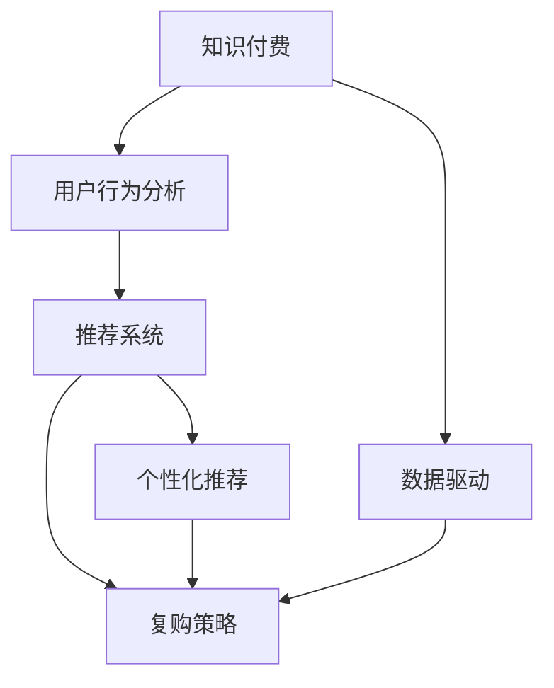

                 

# 如何提高知识付费产品的复购率

> 关键词：知识付费, 用户行为分析, 推荐系统, 个性化, 复购策略, 用户留存, 数据驱动

## 1. 背景介绍

在知识付费快速发展的今天，越来越多的用户选择通过付费获取知识。然而，由于市场竞争激烈、用户选择多、用户需求多样化等因素，知识付费产品的复购率成为企业关注的焦点。如何提高用户复购率，不仅有助于企业的商业模式可持续性，也能够在激烈的市场竞争中取得优势。本文将从用户行为分析、推荐系统、个性化推荐、复购策略等多个角度，探讨如何有效提高知识付费产品的复购率。

## 2. 核心概念与联系

### 2.1 核心概念概述

为更好地理解如何提高知识付费产品的复购率，本节将介绍几个密切相关的核心概念：

- **知识付费**：通过互联网平台提供专业、有价值的知识和信息，用户需支付一定费用以获取。
- **用户行为分析**：通过分析用户的行为数据（如浏览历史、购买行为等），深入了解用户需求和行为特征。
- **推荐系统**：基于用户的历史行为和偏好，推荐可能感兴趣的内容，以提升用户体验和满意度。
- **个性化推荐**：根据用户个体的特征和偏好，提供定制化的内容推荐，以提升用户黏性。
- **复购策略**：通过一系列的策略和技术手段，促进用户重复购买知识付费产品。
- **用户留存**：通过提升用户满意度和忠诚度，延长用户使用周期，降低用户流失率。
- **数据驱动**：以数据为决策依据，对用户行为进行科学分析和预测，指导产品优化和策略调整。

这些核心概念之间的逻辑关系可以通过以下Mermaid流程图来展示：



这个流程图展示了几者之间的关系：

1. 知识付费产品的基础是内容质量和推荐系统的优化。
2. 用户行为分析帮助了解用户需求和偏好。
3. 个性化推荐系统基于用户行为分析，提供定制化内容推荐。
4. 复购策略是提升用户满意度和忠诚度的重要手段。
5. 数据驱动贯穿于整个过程，提供科学决策依据。

## 3. 核心算法原理 & 具体操作步骤
### 3.1 算法原理概述

提高知识付费产品复购率的算法原理主要包括以下几个关键步骤：

1. **用户行为分析**：收集和分析用户的行为数据，如浏览时间、点击率、购买次数等，以识别用户偏好和行为模式。
2. **推荐系统优化**：构建推荐系统，利用协同过滤、内容推荐、混合推荐等技术，提高内容推荐的相关性和个性化程度。
3. **个性化推荐**：根据用户行为数据，生成个性化推荐列表，进一步提升用户满意度和粘性。
4. **复购策略设计**：通过优惠券、内容优惠、用户提醒等策略，刺激用户复购。
5. **数据驱动的决策优化**：通过A/B测试等手段，不断优化推荐算法和复购策略，以提升用户留存和复购率。

### 3.2 算法步骤详解

**Step 1: 用户行为数据收集**
- 定义需要收集的数据项，如浏览时长、点击次数、购买时间等。
- 使用日志文件、数据库等手段，收集和存储用户行为数据。

**Step 2: 用户行为分析**
- 使用统计分析、机器学习等方法，分析用户行为数据，识别用户的兴趣点、购买频率等特征。
- 可以采用聚类、分类、关联规则挖掘等算法，对用户行为进行更深层次的挖掘。

**Step 3: 推荐系统优化**
- 根据用户行为分析结果，构建推荐模型，如协同过滤、基于内容的推荐等。
- 优化推荐算法，引入特征工程、模型训练等步骤，提高推荐结果的准确性和多样性。

**Step 4: 个性化推荐生成**
- 根据推荐模型，生成针对用户的个性化推荐列表。
- 可以结合用户历史行为和实时数据，生成动态推荐内容。

**Step 5: 复购策略设计**
- 根据推荐结果，设计复购策略，如优惠券、限时优惠、用户推荐计划等。
- 通过邮件、短信、APP通知等方式，将推荐和复购策略推送给用户。

**Step 6: 数据驱动的决策优化**
- 利用A/B测试等手段，验证和优化推荐算法和复购策略。
- 不断收集反馈数据，迭代优化模型和策略。

### 3.3 算法优缺点

提高知识付费产品复购率的算法具有以下优点：
1. 个性化推荐提升用户体验，增加用户黏性。
2. 复购策略刺激用户重复购买，提升业务收入。
3. 数据驱动优化决策，提高运营效率和效果。

同时，该算法也存在以下局限性：
1. 数据隐私和安全问题：用户行为数据涉及个人隐私，需严格保护。
2. 数据质量和完整性问题：不完整或不准确的数据会导致分析结果失真。
3. 用户行为多样性问题：不同用户的需求和行为模式差异大，难以统一建模。
4. 算法复杂度问题：个性化推荐和复购策略设计需要复杂的算法和计算资源。
5. 用户需求快速变化问题：用户需求快速变化，需不断调整推荐策略和复购方案。

尽管存在这些局限性，但通过合理设计和优化，这些算法可以显著提高知识付费产品的复购率，提升企业的市场竞争力。

### 3.4 算法应用领域

基于以上算法原理，提高知识付费产品复购率的方法广泛应用于以下领域：

- **在线教育**：通过个性化推荐和复购策略，提高在线课程的完成率和续订率。
- **金融服务**：利用推荐系统帮助用户发现符合其风险偏好的金融产品，促进用户复购。
- **健康管理**：通过个性化内容推荐和复购策略，提升用户对健康管理的粘性。
- **图书出版**：提供个性化的书籍推荐和订阅计划，增加用户复购率。
- **文化娱乐**：推荐用户感兴趣的内容，如电影、音乐、书籍等，提升用户满意度。

## 4. 数学模型和公式 & 详细讲解 & 举例说明（备注：数学公式请使用latex格式，latex嵌入文中独立段落使用 $$，段落内使用 $)
### 4.1 数学模型构建

为更好地理解复购率的提升过程，本节将使用数学语言对推荐系统进行严格描述。

设用户 $i$ 在时间 $t$ 前的行为数据为 $X_i = (x_1, x_2, ..., x_t)$，其中 $x_t$ 为用户在时间 $t$ 的点击、浏览、购买等行为。假设推荐系统根据用户行为数据 $X_i$ 生成推荐列表 $Y_i = (y_1, y_2, ..., y_N)$，其中 $y_j$ 为用户可能感兴趣的内容，如视频、课程、书籍等。

定义用户对推荐内容 $y_j$ 的兴趣度 $R_{ij}$，可以根据用户的购买、点击、评价等行为，使用如下评分函数计算：

$$
R_{ij} = w_1x_{it} + w_2x_{it-1} + ... + w_kx_{it-k} + b
$$

其中 $w_k$ 为权重向量，$b$ 为截距。推荐系统的目标是最大化用户对推荐内容的满意度和复购率，即：

$$
\max_{X_i, Y_i} \sum_{i=1}^M \sum_{j=1}^N R_{ij} \times I(y_j \in Y_i)
$$

其中 $M$ 为用户数，$N$ 为推荐内容数，$I$ 为指示函数，表示内容 $y_j$ 是否在推荐列表 $Y_i$ 中。

### 4.2 公式推导过程

以下我们以协同过滤算法为例，推导协同过滤的数学模型。

协同过滤算法是一种基于用户行为相似性的推荐方法，假设用户 $i$ 和 $j$ 的行为相似度为 $S_{ij}$，可以使用余弦相似度、皮尔逊相关系数等方法计算。协同过滤的目标是找到与用户 $i$ 行为相似的用户 $j$，根据其行为推荐相似的内容，即：

$$
\hat{Y_i} = \{y_j | S_{ij} \geq \theta\}
$$

其中 $\theta$ 为阈值，表示相似度越高，推荐的内容越多。协同过滤的具体过程如下：

1. 构建用户-物品矩阵 $R$，用户对物品的评分矩阵 $R$ 可以表示为用户对所有物品的评分矩阵 $[r_{ij}]$。
2. 计算用户 $i$ 和物品 $j$ 之间的相似度 $S_{ij}$。
3. 根据相似度排序，选择与用户 $i$ 相似度最高的用户 $j$，推荐其评分较高的物品。

通过协同过滤算法，可以生成针对用户的个性化推荐列表，提高用户满意度和复购率。

### 4.3 案例分析与讲解

我们以Coursera为例，分析其如何通过推荐系统提升用户复购率。Coursera 利用用户的浏览、搜索、购买等行为数据，构建了复杂的推荐系统。Coursera 的推荐系统包括两个部分：内容推荐和用户推荐。

**内容推荐**：Coursera 根据用户浏览的课程内容，使用协同过滤算法，推荐用户可能感兴趣的相关课程。例如，用户浏览了计算机科学课程，推荐系统会根据类似课程的评分数据，推荐相关的计算机科学课程。

**用户推荐**：Coursera 根据用户的购买和浏览行为，推荐类似兴趣和需求的用户，增加用户粘性和复购率。例如，用户浏览了多个计算机科学课程，推荐系统会根据浏览记录，推荐同样对计算机科学感兴趣的用户，并展示这些用户购买的课程。

Coursera 通过深度学习技术优化推荐系统，根据用户的历史行为和实时行为，动态调整推荐策略。例如，用户第一次访问某个课程，系统会推荐该课程的相关课程；当用户再次访问该课程时，系统会推荐更多相似课程，以促进用户复购。

## 5. 项目实践：代码实例和详细解释说明
### 5.1 开发环境搭建

在进行复购率提升实践前，我们需要准备好开发环境。以下是使用Python进行PyTorch开发的环境配置流程：

1. 安装Anaconda：从官网下载并安装Anaconda，用于创建独立的Python环境。

2. 创建并激活虚拟环境：
```bash
conda create -n pytorch-env python=3.8 
conda activate pytorch-env
```

3. 安装PyTorch：根据CUDA版本，从官网获取对应的安装命令。例如：
```bash
conda install pytorch torchvision torchaudio cudatoolkit=11.1 -c pytorch -c conda-forge
```

4. 安装Pandas、NumPy等工具包：
```bash
pip install pandas numpy
```

5. 安装推荐系统库：
```bash
pip install lightfm
```

完成上述步骤后，即可在`pytorch-env`环境中开始复购率提升实践。

### 5.2 源代码详细实现

下面我们以Coursera为例，给出使用PyTorch进行推荐系统开发的代码实现。

首先，定义推荐系统的数据集和预处理函数：

```python
import pandas as pd
import numpy as np
from sklearn.preprocessing import MinMaxScaler

# 定义数据集
data = pd.read_csv('data.csv', index_col='user_id')

# 数据预处理
def preprocess_data(data):
    # 特征缩放
    features = data[['click', 'search', 'purchase']]
    features = MinMaxScaler().fit_transform(features)
    data['features'] = features
    
    # 构建用户-物品评分矩阵
    R = data.groupby('user_id')['features'].apply(lambda x: x.values)
    R = pd.DataFrame(R, columns=['course_id'], index=R.index)
    
    return data, R

# 数据预处理
data, R = preprocess_data(data)
```

然后，定义协同过滤算法的代码实现：

```python
from lightfm.datasets import FetchMl1m
from lightfm import LightFM
from lightfm.metrics import precision_recall_curve

# 构建协同过滤模型
model = LightFM(factors=10, loss='warp')

# 训练模型
train_data = FetchMl1m('ml-1m.train')
test_data = FetchMl1m('ml-1m.test')

model.fit(train_data, epochs=10, verbose=True)

# 推荐系统预测
predictions = model.predict(test_data['user_id'], test_data['course_id'])
predictions = predictions.argsort()[:, -10:]  # 推荐前10个课程

# 评估推荐系统效果
precision, recall, threshold = precision_recall_curve(test_data['course_id'], predictions)
print('Precision: {:.2f}%'.format(precision * 100))
print('Recall: {:.2f}%'.format(recall * 100))
```

最后，定义复购策略的代码实现：

```python
from datetime import datetime
from email.mime.text import MIMEText
from smtplib import SMTP

# 定义优惠券策略
def apply_coupon(user_id):
    # 生成优惠券
    coupon_code = 'ABC123'
    # 发送优惠券邮件
    msg = MIMEText('您的优惠券已发送，请查收！')
    msg['Subject'] = '您的优惠券'
    msg['From'] = 'admin@coursera.com'
    msg['To'] = user_id + '@gmail.com'
    msg['Date'] = datetime.now().strftime('%a, %d %b %Y %H:%M:%S %z')
    with SMTP('smtp.gmail.com', 587) as smtp:
        smtp.starttls()
        smtp.login('admin@coursera.com', 'password')
        smtp.send_message(msg)
    
# 定义复购提醒策略
def send_reminder(user_id):
    # 发送复购提醒邮件
    msg = MIMEText('您的课程即将到期，现在购买享受优惠！')
    msg['Subject'] = '课程复购提醒'
    msg['From'] = 'admin@coursera.com'
    msg['To'] = user_id + '@gmail.com'
    msg['Date'] = datetime.now().strftime('%a, %d %b %Y %H:%M:%S %z')
    with SMTP('smtp.gmail.com', 587) as smtp:
        smtp.starttls()
        smtp.login('admin@coursera.com', 'password')
        smtp.send_message(msg)
```

### 5.3 代码解读与分析

让我们再详细解读一下关键代码的实现细节：

**数据预处理函数**：
- 将数据集中的行为特征进行归一化处理。
- 构建用户-物品评分矩阵，作为协同过滤的输入。

**协同过滤模型**：
- 使用lightfm库构建协同过滤模型，指定因子数量和损失函数。
- 使用Ml1m数据集进行模型训练，设置迭代次数和日志输出。
- 使用预测函数获取推荐结果，根据评分排序，推荐前10个课程。
- 使用精度-召回曲线评估推荐系统效果，输出精度和召回率。

**复购策略函数**：
- 定义优惠券生成和发送函数，根据用户ID生成优惠券并发送邮件。
- 定义复购提醒函数，根据用户ID发送课程复购提醒邮件。

这些函数和代码能够帮助我们搭建一个基于协同过滤和复购策略的推荐系统，实现对知识付费产品的复购率提升。

## 6. 实际应用场景
### 6.1 在线教育平台

在线教育平台可以通过推荐系统提高用户复购率，例如Coursera、edX等。这些平台利用用户的浏览、购买、评价等行为数据，生成个性化推荐列表，刺激用户复购。

具体而言，在线教育平台可以设计以下复购策略：

1. 优惠活动：定期推出优惠券、折扣码等促销活动，刺激用户复购。
2. 用户提醒：在课程到期前，发送课程复购提醒邮件，增加用户复购机会。
3. 推荐内容：根据用户的历史行为和实时行为，推荐相关课程，增加用户粘性。

通过这些策略，在线教育平台可以有效提高用户复购率，增加收益。

### 6.2 金融服务

金融服务机构可以通过推荐系统提高用户复购率，例如银行理财、基金投资等。这些机构利用用户的购买记录、交易数据等行为数据，生成个性化推荐列表，促进用户复购。

具体而言，金融服务机构可以设计以下复购策略：

1. 产品推荐：根据用户的历史投资行为，推荐相似的产品，增加用户复购机会。
2. 风险评估：根据用户的投资偏好和风险承受能力，推荐匹配度高的产品，提高用户满意度。
3. 用户提醒：在产品到期前，发送产品复购提醒邮件，增加用户复购机会。

通过这些策略，金融服务机构可以有效提高用户复购率，增加用户粘性和收益。

### 6.3 健康管理

健康管理平台可以通过推荐系统提高用户复购率，例如Fitbit、MyFitnessPal等。这些平台利用用户的运动数据、饮食数据等行为数据，生成个性化推荐列表，增加用户粘性。

具体而言，健康管理平台可以设计以下复购策略：

1. 运动计划：根据用户的运动习惯和健康目标，推荐个性化的运动计划，增加用户粘性。
2. 饮食建议：根据用户的饮食数据，推荐健康的饮食计划，提高用户满意度。
3. 用户提醒：在运动计划到期前，发送运动复购提醒邮件，增加用户复购机会。

通过这些策略，健康管理平台可以有效提高用户复购率，增加用户粘性和收益。

## 7. 工具和资源推荐
### 7.1 学习资源推荐

为了帮助开发者系统掌握推荐系统理论基础和实践技巧，这里推荐一些优质的学习资源：

1. 《推荐系统实战》系列书籍：全面介绍了推荐系统的工作原理、算法选择和实现技巧。
2. 《Python推荐系统开发实战》课程：使用Python实现推荐系统，涵盖了协同过滤、内容推荐、混合推荐等经典算法。
3. Kaggle推荐系统竞赛：通过参与Kaggle推荐系统竞赛，实战学习推荐系统算法和优化技巧。
4. 《Recommender Systems Handbook》：推荐系统领域权威著作，深入浅出地介绍了推荐系统的理论和实践。
5. Apache Mahout社区：提供了多种推荐算法和工具，是学习推荐系统的良好资源。

通过这些资源的学习实践，相信你一定能够快速掌握推荐系统的工作原理和优化方法，并应用于实际项目中。

### 7.2 开发工具推荐

高效的开发离不开优秀的工具支持。以下是几款用于推荐系统开发的常用工具：

1. PyTorch：基于Python的开源深度学习框架，支持高效的推荐系统算法实现。
2. TensorFlow：由Google主导开发的开源深度学习框架，适合大规模推荐系统工程应用。
3. LightFM：Facebook开发的推荐系统库，支持高效的协同过滤和混合推荐算法。
4. Scikit-learn：开源机器学习库，提供丰富的推荐算法和模型评估工具。
5. Hadoop和Spark：用于分布式数据处理和存储，适合处理大规模推荐数据。

合理利用这些工具，可以显著提升推荐系统的开发效率，加快创新迭代的步伐。

### 7.3 相关论文推荐

推荐系统的发展离不开学界的持续研究。以下是几篇奠基性的相关论文，推荐阅读：

1. "Trustworthy Online Recommendations"：提出了基于信任的推荐系统，减少了推荐误导的风险。
2. "Collaborative Filtering for Implicit Feedback Datasets"：提出了基于隐式反馈数据的协同过滤算法，提高了推荐系统的效果。
3. "A Bayesian Approach to Automatic Software Testing"：介绍了贝叶斯优化的推荐系统，优化了模型参数和推荐效果。
4. "The BellKor 2010 Recommender Challenge"：描述了推荐系统竞赛的背景和算法，展示了推荐系统在实际应用中的效果。
5. "Advances in recommender systems: A survey and taxonomy"：系统总结了推荐系统的研究现状和未来发展方向，值得深入阅读。

这些论文代表了大语言模型微调技术的发展脉络。通过学习这些前沿成果，可以帮助研究者把握学科前进方向，激发更多的创新灵感。

## 8. 总结：未来发展趋势与挑战

### 8.1 总结

本文对提高知识付费产品复购率的算法进行了全面系统的介绍。首先阐述了复购率提升在知识付费领域的重要性，明确了推荐系统在用户行为分析和个性化推荐中的关键作用。其次，从推荐系统构建、个性化推荐生成、复购策略设计等多个角度，详细讲解了推荐系统的算法原理和操作步骤。同时，本文还广泛探讨了推荐系统在多个行业领域的应用前景，展示了推荐范式的巨大潜力。此外，本文精选了推荐系统的各类学习资源，力求为读者提供全方位的技术指引。

通过本文的系统梳理，可以看到，推荐系统在知识付费产品复购率提升中扮演着重要角色。这些方向的探索发展，必将进一步提升推荐系统的性能和应用范围，为知识付费领域带来新的突破。

### 8.2 未来发展趋势

展望未来，推荐系统的发展趋势将包括以下几个方向：

1. **个性化推荐算法**：未来的推荐系统将更加注重个性化，结合用户行为数据和外部信息，提供更精准的推荐结果。
2. **实时推荐**：通过实时数据流处理技术，实现动态推荐，提升推荐的时效性和效果。
3. **跨领域推荐**：推荐系统将跨越不同领域和平台，实现多场景下的推荐整合。
4. **混合推荐**：结合协同过滤、内容推荐、基于知识的推荐等多种算法，提升推荐系统的综合效果。
5. **数据融合与知识图谱**：融合多源数据和知识图谱，提升推荐系统的数据质量和学习能力。
6. **隐私保护与公平性**：引入隐私保护技术和公平性算法，解决推荐系统的数据隐私和偏见问题。

这些趋势凸显了推荐系统在知识付费产品复购率提升中的广阔前景。这些方向的探索发展，必将进一步提升推荐系统的性能和应用范围，为知识付费领域带来新的突破。

### 8.3 面临的挑战

尽管推荐系统已经取得了显著进展，但在迈向更加智能化、普适化应用的过程中，仍面临诸多挑战：

1. **数据质量和完整性**：不完整或不准确的数据会导致推荐结果失真，影响用户体验。
2. **数据隐私和安全**：用户行为数据涉及个人隐私，需严格保护。
3. **推荐系统的鲁棒性和公平性**：推荐系统易受到对抗攻击，存在推荐偏见等问题。
4. **推荐系统的计算复杂度**：高复杂度的推荐算法需高效优化，以支持大规模应用。
5. **推荐系统的实时性**：实时推荐系统需高效处理数据流，避免延迟。
6. **推荐系统的多样性和新颖性**：推荐系统需多样化推荐，以应对用户的多样化需求。

尽管存在这些挑战，但通过不断优化推荐算法和用户行为模型，可以显著提升推荐系统的性能和用户满意度。

### 8.4 研究展望

面对推荐系统面临的挑战，未来的研究需要在以下几个方面寻求新的突破：

1. **多源数据融合**：结合多源数据和知识图谱，提升推荐系统的数据质量和效果。
2. **鲁棒性和公平性优化**：引入鲁棒性算法和公平性评估指标，解决推荐系统的偏见问题。
3. **推荐系统的实时化**：研究高效的实时推荐算法，提升推荐系统的响应速度和效果。
4. **用户行为模型优化**：构建更加全面和精准的用户行为模型，提升推荐系统的个性化能力。
5. **推荐系统的安全性**：引入隐私保护技术和安全性评估指标，保障用户数据安全和推荐系统的安全稳定。

这些研究方向的探索，必将引领推荐系统迈向更高的台阶，为知识付费产品复购率提升提供新的突破。相信随着技术的不断进步，推荐系统将在推荐效果、用户满意度、数据隐私等方面不断取得新的突破，为知识付费领域带来更加智能化的推荐服务。

## 9. 附录：常见问题与解答

**Q1：推荐系统如何处理用户行为数据？**

A: 推荐系统通常需要处理用户的行为数据，如浏览、点击、购买等行为。通过分析这些行为数据，推荐系统可以了解用户的行为模式和偏好，生成个性化推荐。数据处理的过程一般包括以下几个步骤：

1. 数据清洗：去除无效数据和噪声数据，确保数据质量。
2. 特征工程：提取和选择对推荐系统有用的特征，如用户ID、物品ID、行为时间等。
3. 数据预处理：将数据转换为模型可用的格式，如向量化、归一化等。
4. 数据存储：将处理后的数据存储在数据库或分布式文件系统中，以便于模型训练和推理。

**Q2：推荐系统的推荐效果如何评估？**

A: 推荐系统的推荐效果通常使用以下几个指标进行评估：

1. 精确度（Precision）：推荐的物品中，用户实际感兴趣物品的比例。
2. 召回率（Recall）：用户实际感兴趣的物品中，被推荐出来的比例。
3. F1值（F1-score）：精确度和召回率的调和平均数，综合考虑了二者的平衡。
4. ROC曲线和AUC：通过绘制ROC曲线，计算AUC值，评估推荐系统的排序能力。
5. 个性化指标：如个性化推荐覆盖率、多样性等，评估推荐系统的个性化程度。

**Q3：推荐系统如何避免过拟合？**

A: 推荐系统容易出现过拟合问题，即模型过度适应训练数据，导致推荐效果在实际应用中表现不佳。避免过拟合的方法包括：

1. 数据增强：通过增加训练数据的数量和多样性，减少过拟合风险。
2. 正则化：引入L2正则、Dropout等技术，防止模型过度复杂化。
3. 模型简化：减少模型的复杂度，降低过拟合风险。
4. 特征选择：选择对推荐系统有用的特征，避免引入无用特征。
5. 模型验证：通过交叉验证、留出验证等方法，评估模型的泛化能力。

**Q4：推荐系统的实时推荐如何实现？**

A: 实现实时推荐系统需要高效的数据流处理技术，通常包括以下几个步骤：

1. 数据采集：实时收集用户的行为数据，如浏览、点击、购买等。
2. 数据预处理：对实时数据进行清洗、去重、过滤等预处理。
3. 模型推理：使用实时数据流处理技术，如Storm、Flink等，进行模型推理，生成推荐结果。
4. 结果推送：将实时推荐结果推送到用户界面，实现即时推荐。

**Q5：推荐系统如何保护用户隐私？**

A: 推荐系统需严格保护用户隐私，常见的方法包括：

1. 数据匿名化：去除用户ID等敏感信息，保护用户隐私。
2. 差分隐私：在模型训练和推理过程中，引入差分隐私技术，保护用户数据的安全性。
3. 访问控制：通过访问控制技术，限制用户数据的访问权限。
4. 安全传输：使用安全传输协议，如HTTPS等，保护数据在传输过程中的安全性。

通过合理设计和优化推荐系统，可以显著提升知识付费产品的复购率，同时保障用户隐私和数据安全。

