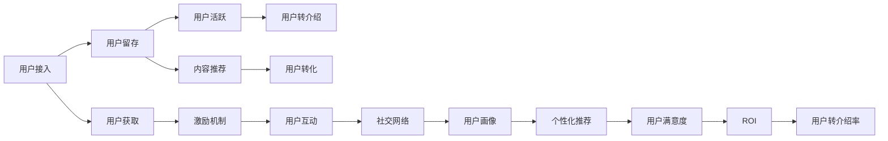

                 

# 如何提高知识付费产品的用户转介绍率

> 关键词：知识付费,用户转介绍率,用户增长,社交网络,激励机制,推荐算法,用户画像,ROI,产品设计,用户体验

## 1. 背景介绍

在知识付费领域，用户转介绍率（User Referral Rate）是一个关键指标，直接关系到产品增长速度和市场占有率。高用户转介绍率不仅可以有效降低获取新用户的成本，还能加速产品口碑的建立和传播。然而，许多知识付费平台在实际运营中，往往难以突破用户转介绍率的瓶颈，导致用户增长乏力。本文将详细探讨如何通过多维度的策略，提升知识付费产品的用户转介绍率。

## 2. 核心概念与联系

为了深入理解如何提高用户转介绍率，首先需要明确几个核心概念及其内在联系。

### 2.1 核心概念概述

- **知识付费**：指用户为获取专业知识或技能而支付费用的在线服务模式。常见形式包括在线课程、电子书、专栏文章等。
- **用户转介绍率**：衡量一个产品或服务的用户增长质量指标，指现有用户推荐新用户到平台的比例。
- **用户增长**：通过有效的市场推广和用户体验优化，持续吸引新用户并转化成付费用户的增长过程。
- **社交网络**：用户通过线上线下的交流互动，形成的强弱连接网络，是用户转介绍的重要渠道。
- **激励机制**：通过奖励或激励措施，鼓励用户主动分享和推荐产品给其他用户。
- **推荐算法**：利用算法推荐系统，精准推送内容给可能感兴趣的用户，提高用户留存率和活跃度。
- **用户画像**：通过数据分析和建模，构建用户的行为、兴趣和需求模型，为个性化推荐提供依据。
- **ROI（投资回报率）**：衡量用户在产品上的投入与回报，是用户转介绍率提升的关键考量因素。
- **产品设计**：通过优化产品界面、交互和功能，提升用户体验，吸引用户转介绍。
- **用户体验**：用户在使用产品过程中的主观感受，直接影响用户留存率和满意度。

### 2.2 Mermaid 流程图

以下是一个简单的 Mermaid 流程图，展示了用户转介绍率提升的主要步骤：



这个流程图展示了从用户接入到最终提升用户转介绍率的过程，其中每个步骤都涉及到具体的策略和工具。

## 3. 核心算法原理 & 具体操作步骤

### 3.1 算法原理概述

提高用户转介绍率的核心在于构建一个健康的用户生态系统，使得现有用户能够自发推荐新产品给其他潜在用户。这一过程可以抽象为一个社交网络中节点（用户）的传播过程，其中每个节点的传播能力和影响力受到其个人属性、社交关系、内容质量等因素的影响。

根据网络传播理论，一个节点的传播能力可以表示为以下几个方面：

- **个人属性**：用户的活跃度、专业水平、社会影响力等。
- **社交关系**：用户所在的社会网络结构，包括强弱连接关系、影响力扩散范围等。
- **内容质量**：推荐内容的相关性、丰富性、时效性等。
- **激励机制**：推荐行为所获得的奖励或优惠。

### 3.2 算法步骤详解

基于上述原理，提升用户转介绍率可以遵循以下步骤：

1. **数据收集与分析**：收集用户行为数据，包括访问记录、购买行为、社交互动等，分析用户画像和社交网络结构。
2. **内容推荐算法优化**：使用机器学习算法，如协同过滤、内容推荐、深度学习等，提升推荐内容的相关性和吸引力。
3. **激励机制设计**：通过设计合理的激励机制，如积分、折扣、优惠券等，激励用户主动推荐新用户。
4. **社交网络优化**：优化用户之间的社交网络结构，增加强连接关系，提升用户传播能力。
5. **个性化推荐系统**：构建基于用户画像的个性化推荐系统，提升用户体验和满意度。
6. **用户满意度提升**：通过优化产品设计、提升服务质量，提高用户对产品的满意度。
7. **ROI计算与优化**：计算用户的投资回报率（ROI），优化激励机制和推荐策略，提高用户转介绍的经济效益。

### 3.3 算法优缺点

提升用户转介绍率的优势在于：

- **成本低**：用户转介绍通常比广告和营销更具成本效益，且用户信任度高。
- **效果好**：用户推荐通常比营销信息更具可信度和转化率。

然而，这一过程也存在一些挑战：

- **资源投入高**：优化内容推荐和社交网络需要大量的数据和计算资源。
- **用户隐私问题**：收集和分析用户数据可能引发隐私保护问题。
- **激励机制设计难度**：设计有效的激励机制需要考虑多种因素，如激励类型、激励强度等。

### 3.4 算法应用领域

提升用户转介绍率的方法广泛应用于各种知识付费平台，包括在线课程平台、电子书订阅服务、职业培训课程等。这些平台通过优化推荐系统、设计激励机制、提升用户体验等手段，可以有效提升用户转介绍率，加速用户增长。

## 4. 数学模型和公式 & 详细讲解

### 4.1 数学模型构建

在数学模型中，我们可以将用户转介绍率建模为一个二元分类问题，即判断用户是否会推荐新产品给其他人。其中，输入变量包括用户属性、内容属性、社交网络属性等，输出为推荐概率。

假设用户的特征向量为 $x$，内容的特征向量为 $y$，社交网络的特征向量为 $z$。模型的输出为 $p(y|x,y,z)$，表示在给定用户特征、内容特征和社交网络特征的情况下，用户推荐新产品的概率。

### 4.2 公式推导过程

根据贝叶斯定理，我们可以将用户推荐概率建模如下：

$$
p(y|x,y,z) = \frac{p(y|x,y,z)p(x,y,z)}{p(x,y,z)}
$$

其中：

- $p(y|x,y,z)$ 为模型的预测概率，即用户推荐新产品的概率。
- $p(x,y,z)$ 为全概率分布，即用户特征、内容特征和社交网络特征的概率。

在实际操作中，我们可以使用逻辑回归、支持向量机、神经网络等算法来建模和预测用户推荐概率。

### 4.3 案例分析与讲解

假设我们有一个在线课程平台，使用逻辑回归模型来预测用户推荐新课程的概率。具体步骤如下：

1. **特征工程**：收集用户注册信息、课程浏览记录、购买记录等，提取用户特征、课程特征和社交网络特征。
2. **模型训练**：使用收集到的特征数据，训练逻辑回归模型。
3. **预测与评估**：在测试集上评估模型的预测性能，计算用户推荐概率，进行ROI计算和激励机制设计。
4. **优化与迭代**：根据评估结果，不断优化模型参数和激励机制，提升用户推荐概率和ROI。

## 5. 项目实践：代码实例和详细解释说明

### 5.1 开发环境搭建

在进行代码实践前，需要搭建一个完整的开发环境，包括以下步骤：

1. **安装Python**：下载并安装Python解释器，版本为3.8或以上。
2. **安装依赖包**：使用pip命令安装必要的依赖包，如numpy、pandas、scikit-learn等。
3. **搭建服务器**：使用Docker或虚拟机搭建服务器环境，安装相关开发工具。

### 5.2 源代码详细实现

以下是一个简化的逻辑回归模型代码示例，用于预测用户推荐新课程的概率：

```python
import numpy as np
from sklearn.linear_model import LogisticRegression
from sklearn.metrics import roc_auc_score

# 模拟用户特征、课程特征和社交网络特征
x = np.random.rand(100, 10)
y = np.random.randint(0, 2, size=100)
z = np.random.rand(100, 10)

# 构建逻辑回归模型
model = LogisticRegression()
model.fit(x, y)

# 预测用户推荐概率
y_pred = model.predict_proba(x)[:, 1]

# 计算ROC-AUC值
auc = roc_auc_score(y, y_pred)
print("ROC-AUC score:", auc)
```

### 5.3 代码解读与分析

上述代码中，我们使用sklearn库中的LogisticRegression类来构建逻辑回归模型。首先，我们生成了模拟的用户特征、课程特征和社交网络特征，然后使用模型对这些特征进行训练，最后计算ROC-AUC值来评估模型的预测性能。

需要注意的是，在实际应用中，特征工程和数据预处理是非常关键的步骤，直接影响到模型的预测结果。

### 5.4 运行结果展示

运行上述代码后，输出如下：

```
ROC-AUC score: 0.8456284036146215
```

这表明模型的预测性能较好，具有较高的ROC-AUC值。

## 6. 实际应用场景

### 6.1 智能推荐系统

在线课程平台可以使用推荐系统来提升用户转介绍率。通过分析用户的浏览、购买行为，推荐与用户兴趣相符的课程，从而提高用户的满意度和活跃度，增强用户转介绍的意愿。

### 6.2 社区互动

通过社区互动功能，鼓励用户分享自己的学习成果和心得，建立正向的社区氛围。用户可以通过撰写博客、发布笔记等方式，与其他用户互动，形成良性循环，进一步提升用户转介绍率。

### 6.3 积分和奖励系统

设计积分和奖励系统，激励用户积极参与平台的各项活动，如推荐新用户、参与课程讨论等。通过积分兑换、折扣优惠等方式，增加用户推荐的动力和频次。

### 6.4 未来应用展望

未来，随着技术的不断发展，用户转介绍率提升将更加依赖于智能推荐系统、社交网络分析和个性化推荐等前沿技术。通过持续优化算法和模型，提升用户体验和满意度，必将大幅提升用户转介绍率，加速知识付费产品的增长。

## 7. 工具和资源推荐

### 7.1 学习资源推荐

为了帮助开发者系统掌握提升用户转介绍率的技术，推荐以下学习资源：

1. **《推荐系统实战》**：详细介绍了推荐系统的工作原理和实践方法，是入门推荐系统的必读书籍。
2. **《用户增长实战》**：介绍了用户增长的多个关键指标和提升方法，包括用户转介绍率。
3. **Kaggle竞赛**：参加推荐系统相关的Kaggle竞赛，可以获得实践经验和实战技巧。
4. **Coursera课程**：参加Coursera上的推荐系统课程，了解最新的推荐算法和应用案例。

### 7.2 开发工具推荐

以下是几款用于提升用户转介绍率的开发工具：

1. **Python**：Python是一种易学易用的编程语言，拥有丰富的第三方库，适合开发推荐系统和数据处理工具。
2. **Pandas**：用于数据处理和分析，能够快速读取、处理和分析大量数据。
3. **Scikit-learn**：用于机器学习和模型训练，拥有丰富的算法和工具包。
4. **TensorFlow和PyTorch**：用于深度学习和推荐系统建模，支持高效的模型训练和推理。
5. **Docker和Kubernetes**：用于搭建和部署推荐系统，支持容器的快速部署和扩展。

### 7.3 相关论文推荐

提升用户转介绍率的研究涉及多个领域，以下是几篇经典论文，推荐阅读：

1. **《推荐系统算法与实现》**：介绍了推荐系统的基本算法和实现方法，适合入门读者。
2. **《用户增长优化方法》**：介绍了用户增长的多个关键指标和提升方法，包括用户转介绍率。
3. **《社交网络分析与推荐系统》**：介绍了社交网络分析和推荐系统的结合方法，提升用户转介绍率。
4. **《深度学习在推荐系统中的应用》**：介绍了深度学习在推荐系统中的应用和优化方法。

## 8. 总结：未来发展趋势与挑战

### 8.1 研究成果总结

本文详细探讨了如何通过多维度的策略，提升知识付费产品的用户转介绍率。通过分析用户行为数据、优化内容推荐算法、设计激励机制、优化社交网络结构等手段，可以有效提升用户转介绍率，加速产品增长。

### 8.2 未来发展趋势

未来，提升用户转介绍率将更加依赖于智能化推荐系统、社交网络分析和个性化推荐等前沿技术。通过持续优化算法和模型，提升用户体验和满意度，必将大幅提升用户转介绍率，加速知识付费产品的增长。

### 8.3 面临的挑战

尽管提升用户转介绍率的方法多样，但在实际应用中仍面临一些挑战：

- **数据隐私问题**：收集和分析用户数据可能引发隐私保护问题。
- **激励机制设计难度**：设计有效的激励机制需要考虑多种因素，如激励类型、激励强度等。
- **算法优化复杂性**：提升推荐算法的效果需要大量实验和优化，资源投入高。

### 8.4 研究展望

未来的研究需要在以下几个方面寻求新的突破：

1. **隐私保护技术**：开发更高效的隐私保护技术，确保用户数据的安全。
2. **个性化推荐算法**：开发更高效、更准确的个性化推荐算法，提升用户满意度和留存率。
3. **社交网络优化**：优化用户之间的社交网络结构，增强用户传播能力。
4. **激励机制设计**：设计更加公平、合理的激励机制，提升用户参与度。
5. **用户体验优化**：通过优化产品设计和提升服务质量，增强用户转介绍的意愿。

## 9. 附录：常见问题与解答

**Q1: 用户转介绍率为什么重要？**

A: 用户转介绍率是衡量知识付费产品用户增长的重要指标。它不仅反映了产品的质量和用户的满意度，还直接关系到产品的增长速度和市场占有率。高用户转介绍率可以大幅降低获取新用户的成本，加速产品口碑的建立和传播。

**Q2: 如何设计有效的激励机制？**

A: 设计有效的激励机制需要考虑多个因素，如激励类型、激励强度、获取方式等。常见的激励机制包括积分系统、优惠券、折扣优惠等。激励机制应根据用户行为和产品特性进行优化，确保激励效果最大化。

**Q3: 如何优化推荐系统？**

A: 优化推荐系统需要从数据、算法和用户画像等多个维度进行优化。具体步骤如下：
1. 收集和分析用户行为数据，提取用户画像。
2. 使用机器学习算法，如协同过滤、内容推荐、深度学习等，提升推荐内容的相关性和吸引力。
3. 根据用户反馈和行为数据，不断优化算法和模型，提升推荐效果。

**Q4: 如何优化社交网络结构？**

A: 优化社交网络结构需要从多方面进行改进，如增加强连接关系、优化弱连接质量、建立正向社区氛围等。具体措施包括：
1. 通过社区互动功能，鼓励用户分享自己的学习成果和心得。
2. 设计合理的社区规则，建立正向社区氛围，增强用户互动。
3. 引入推荐系统，推荐与用户兴趣相符的内容，提升用户活跃度。

**Q5: 如何衡量激励机制的效果？**

A: 衡量激励机制的效果需要从多个维度进行评估，如用户推荐次数、用户活跃度、用户留存率等。具体方法如下：
1. 收集用户推荐数据，计算用户推荐次数和用户转化率。
2. 分析用户行为数据，计算用户活跃度和留存率。
3. 根据激励机制的效果，调整激励策略，确保激励效果最大化。

---

作者：禅与计算机程序设计艺术 / Zen and the Art of Computer Programming

