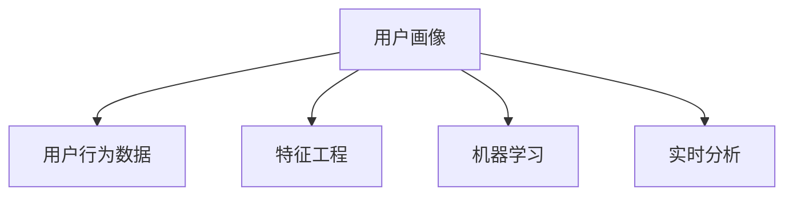

                 

# 如何进行有效的用户画像更新

## 1. 背景介绍

在数字化时代，用户画像(User Persona)的构建已成为企业数据驱动决策的基础。用户画像是对目标用户特征的全面刻画，通常包含性别、年龄、地域、兴趣、行为等多个维度，是企业在市场营销、产品设计、用户体验优化等方面的重要参考。然而，用户画像的构建并非一蹴而就，其是一个动态变化的系统工程。特别是在快速变化的市场环境中，用户画像的更新显得尤为重要。

### 1.1 问题由来

用户画像的更新是用户行为数据持续收集、分析和反馈的过程。这个过程涉及到数据采集、模型训练、特征工程、数据分析等多个环节。传统的数据驱动营销方式在快速变化的市场环境中显得捉襟见肘，数据收集的滞后性、模型训练的复杂性、特征工程的高难度等问题，常常使得企业难以快速响应市场变化，无法及时调整用户画像，影响决策的及时性和准确性。

## 2. 核心概念与联系

### 2.1 核心概念概述

为更好地理解用户画像的更新过程，本节将介绍几个核心概念：

- **用户画像(User Persona)**：对目标用户特征的全面描述，包含人口统计特征、行为特征、心理特征等多个维度。用户画像用于指导企业决策，优化用户体验，提升市场竞争力。

- **用户行为数据(User Behavior Data)**：用户在各种场景下的行为记录，如网页浏览记录、购物记录、应用使用记录等。这些数据是构建和更新用户画像的基础。

- **特征工程(Feature Engineering)**：从原始数据中提取、构造有意义的特征，提升模型预测性能的过程。在用户画像构建中，特征工程尤为重要，直接决定画像的精度和深度。

- **机器学习(Machine Learning)**：一种通过数据驱动进行模式发现和决策制定的方法。在用户画像更新中，机器学习模型被用来分析和预测用户行为，提取有意义的特征。

- **实时分析(Real-time Analysis)**：指对数据进行实时处理和分析，以快速响应市场变化，提升决策的及时性和准确性。

这些核心概念之间的逻辑关系可以通过以下Mermaid流程图来展示：



这个流程图展示了大数据和机器学习在用户画像更新中的重要作用，及其与其他相关概念之间的联系。

## 3. 核心算法原理 & 具体操作步骤

### 3.1 算法原理概述

用户画像的更新通常分为两个主要步骤：数据采集和特征更新。数据采集过程是通过各种渠道收集用户行为数据，特征更新则是通过机器学习模型对用户行为数据进行分析，提取有意义的特征，更新用户画像。

### 3.2 算法步骤详解

#### 3.2.1 数据采集

数据采集是用户画像更新的第一步，主要包括：

- **定义采集目标**：明确需要采集的数据类型、来源和频率。
- **选择合适的采集工具**：如Google Analytics、Mixpanel、Amplitude等，根据具体业务场景选择合适的工具。
- **设计采集方案**：确定数据采集流程，如事件触发、参数设置等，确保数据的准确性和完整性。

#### 3.2.2 特征更新

特征更新是用户画像更新的核心步骤，主要包括以下几个关键步骤：

- **数据清洗**：对采集到的数据进行清洗，去除无效、重复、异常的数据，确保数据的质量。
- **特征选择**：根据业务需求和模型性能，选择有意义的特征进行模型训练。
- **特征提取**：通过机器学习算法，从原始数据中提取有意义的特征，如PCA、LDA、Word2Vec等。
- **模型训练**：选择合适的机器学习模型，如线性回归、逻辑回归、神经网络等，训练预测模型，更新用户画像。
- **特征更新**：根据新采集到的数据，不断更新用户画像，保持画像的实时性和准确性。

### 3.3 算法优缺点

用户画像更新方法具有以下优点：

- **数据驱动**：通过机器学习模型进行数据分析和预测，保证用户画像的准确性和可靠性。
- **动态调整**：用户画像的更新是一个动态过程，能够及时响应市场变化，提升决策的及时性和准确性。
- **成本效益**：相比传统的定性分析方法，数据驱动的用户画像更新成本更低，效益更高。

同时，该方法也存在一定的局限性：

- **数据质量依赖**：用户画像的精度直接依赖于数据的质量，数据采集和处理过程中可能出现偏差。
- **模型复杂度高**：机器学习模型的复杂度较高，需要专业的技术支持。
- **隐私问题**：用户行为数据的采集和分析过程中可能涉及用户隐私，需要严格遵守相关法律法规。

### 3.4 算法应用领域

用户画像更新方法在多个领域具有广泛的应用，包括但不限于：

- **市场营销**：用于细分目标用户群体，优化广告投放策略，提升营销效果。
- **产品设计**：根据用户画像的特征，指导产品功能设计和迭代，提升用户满意度。
- **用户体验优化**：通过用户画像，深入了解用户需求，优化产品界面和交互体验。
- **客户服务**：用于分析客户行为，提升客户服务质量和满意度。
- **风险控制**：通过用户画像，识别和预测潜在风险，提升风险管理能力。

## 4. 数学模型和公式 & 详细讲解 & 举例说明

### 4.1 数学模型构建

用户画像的更新通常涉及多个数据源和多个维度，因此需要构建一个多维度的数学模型来描述和分析用户行为。常见的用户画像数学模型包括：

- **基于多维度的用户画像模型**：如PCA降维模型，通过多维数据变换，找到最具代表性的维度。
- **基于时序的用户画像模型**：如LSTM、GRU等时间序列模型，分析用户行为的时间演变趋势。
- **基于情感的用户画像模型**：如情感分析模型，从用户评论中提取情感信息，丰富用户画像。

### 4.2 公式推导过程

以LSTM模型为例，推导用户行为时间序列分析的过程。LSTM模型是一种用于处理时间序列数据的深度学习模型，能够有效捕捉时间序列数据中的长期依赖关系。

假设用户行为数据为 $X_t = [x_{t-1}, x_{t-2}, \dots, x_1]$，其中 $x_t$ 表示用户在第 $t$ 个时间点上的行为数据，如浏览记录、购物记录等。

LSTM模型的基本结构如图1所示，其中 $h_t$ 表示第 $t$ 个时间步的隐藏状态，$c_t$ 表示第 $t$ 个时间步的细胞状态。


LSTM模型的输入输出关系如下：

$$
h_t = f(h_{t-1}, X_t; \theta) + g(c_{t-1}, X_t; \theta)
$$

$$
c_t = f(c_{t-1}, X_t; \theta) + g(c_{t-1}, X_t; \theta)
$$

其中，$f$ 和 $g$ 是LSTM模型的门函数，$\theta$ 是模型参数。

### 4.3 案例分析与讲解

假设某电商平台的客户行为数据，包含用户的浏览、点击、购买行为。通过对这些数据进行LSTM模型训练，可以得到不同时间段内用户的购买意愿。具体过程如下：

1. **数据准备**：将用户行为数据按照时间顺序排列，形成时间序列数据。
2. **特征工程**：对数据进行归一化、降维等预处理操作，提取有用的特征。
3. **模型训练**：使用LSTM模型对数据进行训练，得到用户行为预测模型。
4. **特征更新**：根据用户新的行为数据，不断更新模型参数，更新用户画像。

通过LSTM模型，可以实时分析用户行为，预测用户的购买意愿，提升电商平台的营销效果。

## 5. 项目实践：代码实例和详细解释说明

### 5.1 开发环境搭建

在进行用户画像更新实践前，我们需要准备好开发环境。以下是使用Python进行TensorFlow开发的环境配置流程：

1. 安装Anaconda：从官网下载并安装Anaconda，用于创建独立的Python环境。

2. 创建并激活虚拟环境：
```bash
conda create -n tf-env python=3.8 
conda activate tf-env
```

3. 安装TensorFlow：根据CUDA版本，从官网获取对应的安装命令。例如：
```bash
conda install tensorflow -c conda-forge -c pytorch -c nvidia
```

4. 安装其他必要工具包：
```bash
pip install pandas numpy scikit-learn matplotlib tensorflow-probability
```

完成上述步骤后，即可在`tf-env`环境中开始用户画像更新实践。

### 5.2 源代码详细实现

以下是一个使用TensorFlow实现LSTM模型的用户行为时间序列分析的Python代码实现。

```python
import tensorflow as tf
import numpy as np
import pandas as pd

# 准备数据
data = pd.read_csv('user_behavior.csv')

# 数据预处理
data = data.dropna()
data = data.groupby('user_id').agg('mean').reset_index()

# 划分训练集和测试集
train_size = int(len(data) * 0.8)
train_data = data[:train_size]
test_data = data[train_size:]

# 数据转换
def to_categorical(y, num_classes=None, dtype='float32'):
    y = np.array(y, dtype='float32')
    if num_classes is None:
        num_classes = np.max(y) + 1
    y = tf.keras.utils.to_categorical(y, num_classes)
    return y

train_X = train_data[['time', '浏览', '点击', '浏览时间']]
train_y = to_categorical(train_data['购买'], num_classes=2)

test_X = test_data[['time', '浏览', '点击', '浏览时间']]
test_y = to_categorical(test_data['购买'], num_classes=2)

# 构建LSTM模型
model = tf.keras.Sequential([
    tf.keras.layers.LSTM(64, input_shape=(train_X.shape[1],)),
    tf.keras.layers.Dropout(0.2),
    tf.keras.layers.Dense(64, activation='relu'),
    tf.keras.layers.Dropout(0.2),
    tf.keras.layers.Dense(2, activation='softmax')
])

model.compile(loss='categorical_crossentropy',
              optimizer='adam',
              metrics=['accuracy'])

# 训练模型
model.fit(train_X, train_y, epochs=50, batch_size=32, validation_data=(test_X, test_y))

# 模型预测
predictions = model.predict(test_X)
```

以上代码实现了LSTM模型的用户行为时间序列分析过程。具体步骤如下：

1. **数据准备**：通过Pandas库读取用户行为数据，并进行预处理，如去除缺失值、计算平均值等。
2. **数据转换**：将分类标签转换为独热编码，构建训练集和测试集。
3. **模型构建**：使用TensorFlow的Sequential模型构建LSTM网络，包括输入层、LSTM层、Dropout层、输出层。
4. **模型训练**：使用fit方法训练模型，并设置训练轮数和批量大小。
5. **模型预测**：使用模型对测试集进行预测，输出结果。

### 5.3 代码解读与分析

让我们再详细解读一下关键代码的实现细节：

**data = pd.read_csv('user_behavior.csv')**：通过Pandas库读取用户行为数据，数据格式为csv文件。

**data = data.dropna()**：去除缺失值，保持数据完整性。

**data = data.groupby('user_id').agg('mean').reset_index()**：按照用户ID进行分组，计算每个用户的行为平均值，并进行数据转换，构建用户ID和行为特征的映射关系。

**train_size = int(len(data) * 0.8)**：将数据划分为训练集和测试集，训练集占总数据的80%。

**train_X = train_data[['time', '浏览', '点击', '浏览时间']]**：构建训练集的特征矩阵，包含用户ID、时间、浏览、点击和浏览时间。

**train_y = to_categorical(train_data['购买'], num_classes=2)**：将训练集的购买标签转换为独热编码，标记用户是否购买。

**test_X = test_data[['time', '浏览', '点击', '浏览时间']]**：构建测试集的特征矩阵，包含用户ID、时间、浏览、点击和浏览时间。

**test_y = to_categorical(test_data['购买'], num_classes=2)**：将测试集的购买标签转换为独热编码，标记用户是否购买。

**model = tf.keras.Sequential([...])**：使用TensorFlow的Sequential模型构建LSTM网络，包括输入层、LSTM层、Dropout层、输出层。

**model.compile(...)**：编译模型，设置损失函数、优化器和评估指标。

**model.fit(...)**：训练模型，设置训练轮数和批量大小，并设置验证集。

**predictions = model.predict(test_X)**：使用模型对测试集进行预测，输出预测结果。

可以看到，通过TensorFlow构建LSTM模型，可以轻松实现用户行为时间序列分析。开发者可以将更多精力放在数据处理、模型改进等高层逻辑上，而不必过多关注底层的实现细节。

## 6. 实际应用场景

### 6.1 电商平台

在电商平台，用户画像更新可以用于预测用户的购买意愿，优化个性化推荐系统。通过对用户的历史行为数据进行分析，构建用户画像，预测用户是否会购买某件商品，从而在合适的时间向用户推送个性化推荐。

具体而言，可以使用LSTM模型对用户的行为数据进行分析，得到不同时间段内用户的购买意愿。将模型预测结果作为推荐系统的输入，实时更新推荐结果，提升用户的购买体验和满意度。

### 6.2 在线教育

在在线教育平台，用户画像更新可以用于优化课程推荐和用户学习路径设计。通过对用户的课程浏览、观看记录进行分析，构建用户画像，预测用户对某门课程的兴趣和学习进度，从而推荐合适的课程，提供个性化的学习路径。

具体而言，可以使用LSTM模型对用户的课程浏览、观看记录进行分析，得到用户对不同课程的兴趣和学习进度。将模型预测结果作为推荐系统的输入，实时更新推荐结果，提升用户的学习体验和满意度。

### 6.3 社交媒体

在社交媒体平台，用户画像更新可以用于分析用户的内容消费习惯，优化内容推荐和广告投放。通过对用户的内容浏览、互动记录进行分析，构建用户画像，预测用户对不同内容的兴趣和偏好，从而推荐合适的内容，优化广告投放策略。

具体而言，可以使用LSTM模型对用户的内容浏览、互动记录进行分析，得到用户对不同内容的兴趣和偏好。将模型预测结果作为推荐系统的输入，实时更新推荐结果，提升用户的内容消费体验和满意度。

### 6.4 未来应用展望

随着用户画像更新技术的不断发展，未来的应用场景将更加广泛和深入，带来新的商业机会和创新点。以下是几个可能的未来应用方向：

- **智能客服**：在智能客服系统中，用户画像更新可以用于分析用户的历史互动记录，预测用户的意图和需求，提供更加个性化的客服服务。
- **金融科技**：在金融科技领域，用户画像更新可以用于分析用户的交易记录和行为模式，预测用户的风险偏好和信用等级，优化风险管理策略。
- **智慧城市**：在智慧城市管理中，用户画像更新可以用于分析居民的行为模式和需求偏好，优化城市服务和资源配置，提升城市治理水平。
- **医疗健康**：在医疗健康领域，用户画像更新可以用于分析患者的健康数据和行为模式，预测疾病的风险和预后，优化诊疗方案和健康管理。

用户画像更新技术的广泛应用，将为用户和商家带来更加精准、高效、个性化的服务体验，推动数字化时代的全面发展。

## 7. 工具和资源推荐

### 7.1 学习资源推荐

为了帮助开发者系统掌握用户画像更新的理论基础和实践技巧，这里推荐一些优质的学习资源：

1. 《深度学习基础》课程：斯坦福大学开设的深度学习入门课程，详细介绍了深度学习的基本原理和算法，适合初学者入门。

2. 《机器学习实战》书籍：介绍机器学习的基本概念和算法，并通过实际案例进行讲解，适合动手实践。

3. 《Python数据科学手册》书籍：介绍了Python在数据科学领域的应用，包括数据清洗、特征工程、模型训练等，适合中级开发者。

4. TensorFlow官方文档：提供丰富的TensorFlow教程和示例代码，适合快速上手TensorFlow。

5. Weights & Biases：模型训练的实验跟踪工具，可以记录和可视化模型训练过程中的各项指标，方便对比和调优。

6. Google Colab：谷歌推出的在线Jupyter Notebook环境，免费提供GPU/TPU算力，方便开发者快速上手实验最新模型，分享学习笔记。

通过对这些资源的学习实践，相信你一定能够快速掌握用户画像更新的精髓，并用于解决实际的NLP问题。

### 7.2 开发工具推荐

高效的开发离不开优秀的工具支持。以下是几款用于用户画像更新开发的常用工具：

1. TensorFlow：基于Python的开源深度学习框架，灵活动态的计算图，适合快速迭代研究。TensorFlow提供了丰富的预训练模型和数据处理工具，适合用户画像更新。

2. PyTorch：基于Python的开源深度学习框架，动态图机制，适合灵活的模型构建和调试。PyTorch也提供了丰富的深度学习库和工具，适合用户画像更新。

3. Keras：基于Python的高层深度学习框架，提供简单易用的API，适合快速原型开发。Keras也支持TensorFlow和PyTorch后端，方便用户画像更新的实现。

4. Weights & Biases：模型训练的实验跟踪工具，可以记录和可视化模型训练过程中的各项指标，方便对比和调优。与主流深度学习框架无缝集成。

5. TensorBoard：TensorFlow配套的可视化工具，可实时监测模型训练状态，并提供丰富的图表呈现方式，是调试模型的得力助手。

6. Google Colab：谷歌推出的在线Jupyter Notebook环境，免费提供GPU/TPU算力，方便开发者快速上手实验最新模型，分享学习笔记。

合理利用这些工具，可以显著提升用户画像更新任务的开发效率，加快创新迭代的步伐。

### 7.3 相关论文推荐

用户画像更新技术的发展源于学界的持续研究。以下是几篇奠基性的相关论文，推荐阅读：

1. "User Profiling with LSTM-based Deep Learning Models"（LSTM用于用户画像建模）：提出使用LSTM模型对用户行为数据进行建模，构建用户画像。

2. "Deep Learning for Personalization: A Systematic Survey"（深度学习用于个性化推荐）：系统介绍了深度学习在个性化推荐中的应用，包括用户画像构建和模型训练。

3. "Reinforcement Learning for Personalization in Recommendation Systems"（强化学习用于推荐系统个性化）：提出使用强化学习算法优化推荐系统，提升个性化推荐的效果。

4. "A Survey of Multi-modal User Profiling"（多模态用户画像综述）：介绍了多模态数据在用户画像构建中的应用，如文本、图像、声音等。

5. "Personalized Recommendation Systems: A Survey and Taxonomy"（个性化推荐系统综述）：系统总结了个性化推荐系统的研究现状和未来方向，包括用户画像构建和推荐算法。

这些论文代表了大数据和机器学习在用户画像更新中的应用现状，帮助研究者把握学科前进方向，激发更多的创新灵感。

## 8. 总结：未来发展趋势与挑战

### 8.1 总结

本文对用户画像更新方法进行了全面系统的介绍。首先阐述了用户画像更新的研究背景和意义，明确了用户画像更新在数字化营销、个性化推荐、用户体验优化等方面的重要作用。其次，从原理到实践，详细讲解了用户画像的构建和更新过程，给出了用户画像更新任务开发的完整代码实例。同时，本文还广泛探讨了用户画像更新方法在电商平台、在线教育、社交媒体等多个行业领域的应用前景，展示了用户画像更新技术的巨大潜力。此外，本文精选了用户画像更新的各类学习资源，力求为读者提供全方位的技术指引。

通过本文的系统梳理，可以看到，用户画像更新方法正在成为数字化营销和个性化推荐的重要范式，极大地拓展了用户画像的应用边界，催生了更多的落地场景。受益于大数据和机器学习技术的不断发展，用户画像更新技术将持续改进，更好地服务于企业决策和用户体验。

### 8.2 未来发展趋势

展望未来，用户画像更新技术将呈现以下几个发展趋势：

1. **多模态用户画像**：结合文本、图像、声音等多种数据源，构建更加全面、丰富、深入的用户画像，提升个性化推荐和营销效果。

2. **实时用户画像**：通过实时数据分析，动态更新用户画像，实时响应市场变化，提升决策的及时性和准确性。

3. **隐私保护**：在用户画像构建和更新过程中，注重用户隐私保护，采用匿名化、差分隐私等技术，确保用户数据的安全性和隐私性。

4. **交互式用户画像**：通过自然语言处理等技术，实现用户与系统的交互式画像更新，提升用户体验和满意度。

5. **跨平台用户画像**：结合不同平台的用户行为数据，构建统一的跨平台用户画像，提升数据融合和利用效率。

6. **联邦学习**：通过联邦学习技术，在不同设备和平台之间分布式协同训练，提升用户画像更新的效率和准确性。

以上趋势凸显了用户画像更新技术的广阔前景，这些方向的探索发展，必将进一步提升用户画像的精度和深度，提升营销和推荐效果，推动数字化时代的技术进步。

### 8.3 面临的挑战

尽管用户画像更新技术已经取得了瞩目成就，但在迈向更加智能化、普适化应用的过程中，它仍面临着诸多挑战：

1. **数据质量问题**：用户画像的精度直接依赖于数据的质量，数据采集和处理过程中可能出现偏差，如何保证数据的一致性和准确性，仍是一个重要问题。

2. **计算资源限制**：用户画像更新需要大量的计算资源，如何优化算法和模型结构，降低计算成本，提升计算效率，仍是一个技术难题。

3. **隐私和安全问题**：用户画像更新过程中涉及大量用户数据，如何保护用户隐私，避免数据泄露，仍是一个严峻挑战。

4. **跨平台协同**：不同平台的用户画像数据格式和规范可能不同，如何实现跨平台的协同和融合，仍是一个技术难题。

5. **交互性不足**：当前的用户画像更新更多是基于静态数据的分析，如何引入交互性，提升用户的参与度和反馈，仍是一个研究方向。

6. **模型解释性不足**：用户画像更新模型通常较为复杂，如何提升模型的可解释性和可理解性，仍是一个技术挑战。

正视用户画像更新面临的这些挑战，积极应对并寻求突破，将是大数据和机器学习技术不断进步的重要推动力。相信随着技术的不断发展和完善，用户画像更新方法将在数字化营销、个性化推荐、用户体验优化等领域发挥更大的作用。

### 8.4 研究展望

面对用户画像更新所面临的种种挑战，未来的研究需要在以下几个方面寻求新的突破：

1. **数据增强**：通过数据增强技术，丰富用户画像的数据源，提升数据的质量和多样性。

2. **模型优化**：通过模型优化技术，降低计算成本，提升模型效率和可解释性。

3. **隐私保护**：通过隐私保护技术，确保用户数据的安全性和隐私性，提升用户信任度。

4. **跨平台协同**：通过联邦学习等技术，实现跨平台的协同和融合，提升数据融合和利用效率。

5. **交互式更新**：通过交互式技术，提升用户的参与度和反馈，增强用户画像的实时性和动态性。

6. **多模态融合**：通过多模态融合技术，结合文本、图像、声音等多种数据源，构建更加全面、丰富、深入的用户画像。

这些研究方向的探索，必将引领用户画像更新技术迈向更高的台阶，为数字化营销、个性化推荐、用户体验优化等领域带来新的突破。面向未来，用户画像更新技术需要与其他人工智能技术进行更深入的融合，如知识表示、因果推理、强化学习等，多路径协同发力，共同推动数字化时代的全面发展。

## 9. 附录：常见问题与解答

**Q1：用户画像更新需要哪些步骤？**

A: 用户画像更新一般包括以下几个关键步骤：
1. 数据采集：通过各种渠道收集用户行为数据。
2. 数据清洗：去除无效、重复、异常的数据，确保数据的质量。
3. 特征选择：根据业务需求和模型性能，选择有意义的特征进行模型训练。
4. 特征提取：通过机器学习算法，从原始数据中提取有意义的特征。
5. 模型训练：选择合适的机器学习模型，训练预测模型。
6. 特征更新：根据新采集到的数据，不断更新模型参数，更新用户画像。

**Q2：如何选择合适的机器学习模型？**

A: 选择合适的机器学习模型需要考虑以下几个因素：
1. 数据类型：不同的数据类型需要不同的模型，如时间序列数据适合LSTM模型，分类数据适合逻辑回归模型。
2. 数据量：数据量较大的情况下，可以选择复杂的深度学习模型，如神经网络。数据量较小的情况下，可以选择简单的模型，如逻辑回归。
3. 计算资源：计算资源较为有限的情况下，可以选择参数较少的模型，如线性回归。计算资源较为充足的情况下，可以选择参数较多的模型，如深度神经网络。
4. 模型性能：模型性能需要根据具体业务需求和数据特点进行选择，如准确率、召回率、F1值等指标。

**Q3：用户画像更新需要注意哪些问题？**

A: 用户画像更新需要注意以下几个问题：
1. 数据质量：用户画像的精度直接依赖于数据的质量，数据采集和处理过程中可能出现偏差。
2. 计算资源：用户画像更新需要大量的计算资源，如何优化算法和模型结构，降低计算成本，提升计算效率，仍是一个技术难题。
3. 隐私和安全问题：用户画像更新过程中涉及大量用户数据，如何保护用户隐私，避免数据泄露，仍是一个严峻挑战。
4. 跨平台协同：不同平台的用户画像数据格式和规范可能不同，如何实现跨平台的协同和融合，仍是一个技术难题。
5. 交互性不足：当前的用户画像更新更多是基于静态数据的分析，如何引入交互性，提升用户的参与度和反馈，仍是一个研究方向。

**Q4：用户画像更新有哪些实际应用场景？**

A: 用户画像更新在多个领域具有广泛的应用，包括但不限于：
1. 电商平台：用于预测用户的购买意愿，优化个性化推荐系统。
2. 在线教育：用于优化课程推荐和用户学习路径设计。
3. 社交媒体：用于分析用户的内容消费习惯，优化内容推荐和广告投放。
4. 智慧城市：用于分析居民的行为模式和需求偏好，优化城市服务和资源配置。
5. 金融科技：用于分析用户的交易记录和行为模式，优化风险管理策略。
6. 医疗健康：用于分析患者的健康数据和行为模式，预测疾病的风险和预后，优化诊疗方案和健康管理。

**Q5：用户画像更新如何提升决策的及时性和准确性？**

A: 用户画像更新可以实时分析用户行为，预测用户的购买意愿、学习进度、行为模式等，提升决策的及时性和准确性。具体而言，通过用户画像更新，可以实现以下功能：
1. 实时推荐：根据用户画像的实时更新，实时推荐合适的产品、课程、内容，提升用户的满意度和转化率。
2. 个性化营销：根据用户画像的特征，个性化定制营销策略，提高营销效果和ROI。
3. 风险预警：根据用户画像的风险特征，实时监测风险变化，提前预警潜在风险，提升风险管理能力。
4. 用户反馈：根据用户画像的反馈信息，动态调整产品和服务的策略，提升用户满意度和忠诚度。

通过用户画像更新，企业可以更加精准、高效地进行决策，提升市场竞争力和用户满意度。

---

作者：禅与计算机程序设计艺术 / Zen and the Art of Computer Programming

