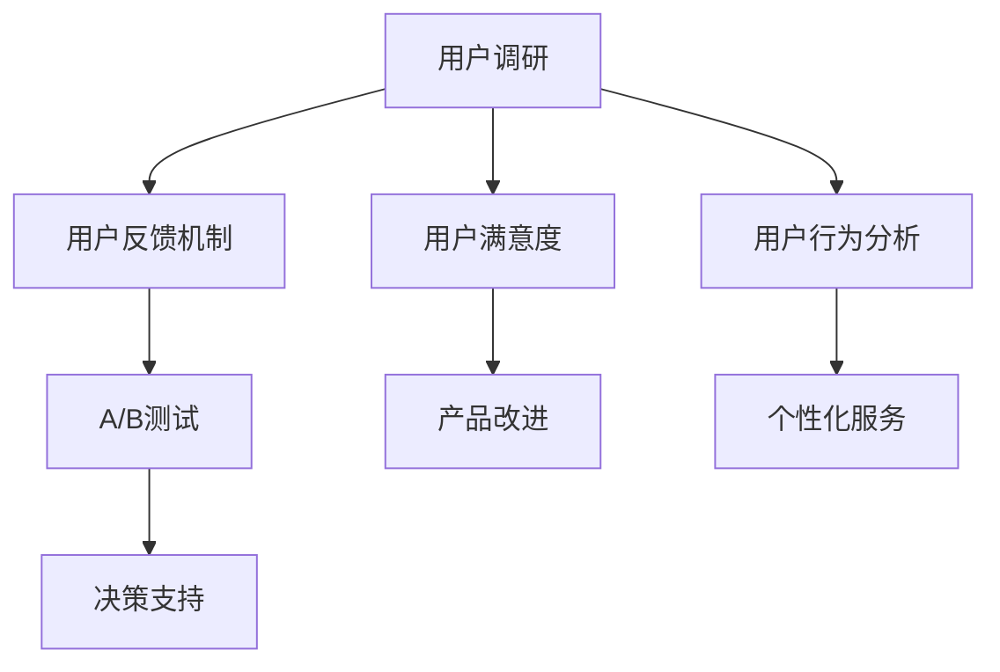

                 

# 如何进行知识付费的用户调研与反馈

> 关键词：用户调研,知识付费,反馈机制,用户满意度,用户行为分析

## 1. 背景介绍

### 1.1 问题由来

随着知识付费行业的快速发展，各大知识付费平台如雨后春笋般涌现，如得到、喜马拉雅、知乎live等。这些平台为专家学者提供了一个展现专业知识的平台，也为知识消费者提供了一个便捷的获取高质量内容的服务。然而，知识付费的持续发展仍面临诸多挑战，特别是在用户调研与反馈机制建设方面。

知识付费的初衷是高质量内容的变现，但如何衡量和提升内容质量和用户满意度，一直是困扰平台方的一大难题。一方面，内容提供者需要了解用户需求和偏好，以便不断优化内容，另一方面，平台方需要了解用户反馈，以便调整运营策略，提升用户粘性和留存率。

### 1.2 问题核心关键点

1. **用户调研**：如何系统地收集用户需求和反馈，科学合理地进行用户画像刻画，为内容优化和平台改进提供数据支撑。
2. **反馈机制**：如何建立有效的用户反馈通道，及时响应用户意见，并进行数据积累和分析，以指导运营决策。
3. **用户满意度**：如何通过用户调研和反馈机制，提升用户对知识付费内容的满意度和平台粘性，增强用户体验。
4. **用户行为分析**：如何通过用户行为数据分析，发现用户行为特征和潜在的商业价值点，优化产品设计和运营策略。

## 2. 核心概念与联系

### 2.1 核心概念概述

为更好地理解用户调研与反馈机制的建设，本节将介绍几个密切相关的核心概念：

1. **用户调研**：通过定性或定量的方式，收集用户基本信息、需求、行为数据等，以理解用户需求和行为，为产品优化和市场定位提供数据支撑。
2. **用户反馈机制**：通过多种渠道收集用户对平台内容、功能、体验等方面的意见和建议，进行数据分析，及时响应和处理用户问题，提升用户满意度。
3. **用户满意度**：通过用户调研和反馈机制，衡量用户对知识付费内容、平台功能、用户体验等方面的满意度，指导平台改进和运营。
4. **用户行为分析**：通过追踪和分析用户在平台上的行为数据，发现用户行为特征和趋势，为产品设计、内容推荐、个性化服务提供数据支持。
5. **A/B测试**：在平台运营中，通过对比不同版本的产品特性，评估其效果，为决策提供科学依据。

这些核心概念之间的逻辑关系可以通过以下Mermaid流程图来展示：



这个流程图展示了我们在进行知识付费用户调研与反馈机制建设过程中，各个环节之间的相互联系和影响。

## 3. 核心算法原理 & 具体操作步骤
### 3.1 算法原理概述

用户调研与反馈机制建设的核心在于数据收集和分析。通过科学合理的数据收集和分析，了解用户需求和行为，及时响应和改进用户反馈，从而提升用户满意度，优化产品设计和运营策略。

形式化地，假设我们需要对知识付费平台的用户进行调研，设调研问题集为 $Q$，每个用户 $i$ 对问题 $q \in Q$ 的回答为 $a_i^q$，则用户调研结果可以表示为一个矩阵 $A$，其中 $A[i,q] = a_i^q$。类似地，设用户反馈为 $F$，平台改进措施为 $M$，则用户反馈与改进措施的关系可以表示为 $F = M(A)$。

我们的目标是最大化用户满意度 $U$，即最大化用户对内容质量和平台体验的总体评价。具体而言，可以通过用户调研结果和反馈，建立模型 $U = F(A, M)$，进行优化调整，使得 $U$ 达到最大化。

### 3.2 算法步骤详解

用户调研与反馈机制建设的过程可以分为以下几个关键步骤：

**Step 1: 设计调研问卷和反馈渠道**

- 设计调研问卷：根据平台需求和用户画像，设计问卷问题和回答选项，确保问题具有代表性，答案可操作性。
- 设计反馈渠道：多渠道收集用户反馈，如在线调查表、用户评论、客服交流、社区讨论等，覆盖不同用户群体。

**Step 2: 收集和分析用户数据**

- 在线调研：通过问卷星、腾讯问卷等工具，收集用户基本信息和需求数据。
- 行为数据追踪：通过网站统计工具、应用日志等，收集用户行为数据，如访问频率、停留时间、课程选择等。
- 用户评论和讨论：收集用户在平台上的评论、讨论内容，进行分析整理。
- 数据处理和分析：使用Python、R等数据分析工具，进行数据清洗、统计、可视化，提取有用信息。

**Step 3: 建立用户画像和需求模型**

- 用户画像刻画：基于调研问卷和行为数据，构建用户画像，刻画用户特征、需求、行为等。
- 需求模型建立：使用机器学习算法，如聚类、分类等，对用户画像进行建模，识别用户需求和行为特征。

**Step 4: 设计反馈处理流程**

- 反馈信息整理：对收集到的用户反馈进行整理，去重、分类，形成反馈数据集。
- 反馈分析与处理：使用NLP技术，如文本分类、情感分析等，分析用户反馈情感倾向和主要问题，生成反馈报告。
- 处理和响应：根据反馈报告，快速响应和处理用户问题，如客服解答、产品改进、功能优化等。

**Step 5: 评估用户满意度**

- 用户满意度调查：设计用户满意度调查问卷，通过在线调研工具，收集用户对平台内容、功能、体验等方面的满意度评价。
- 满意度数据分析：使用统计学方法，分析用户满意度得分、分布、趋势等，评估平台改进效果。

**Step 6: 持续改进**

- 数据积累与分析：持续收集用户调研和反馈数据，建立数据积累机制，定期进行数据清理和分析，为持续改进提供数据支撑。
- 运营策略优化：根据数据分析结果，优化产品设计、运营策略，提升用户满意度，增强平台粘性。
- 用户行为分析：使用机器学习算法，分析用户行为数据，发现用户行为特征和潜在的商业价值点，指导产品设计、内容推荐、个性化服务。

### 3.3 算法优缺点

用户调研与反馈机制建设具有以下优点：
1. 系统全面：通过多渠道、多角度的数据收集，全面了解用户需求和行为，为产品优化提供数据支撑。
2. 及时响应：建立有效的反馈渠道，及时响应用户问题，提升用户满意度。
3. 数据驱动：通过数据分析，指导产品改进和运营策略，提升平台粘性和留存率。
4. 用户画像：建立用户画像，深入理解用户特征和需求，为个性化服务提供依据。

同时，该方法也存在一些局限性：
1. 数据获取难度大：用户调研和行为数据收集涉及隐私保护和用户隐私政策，数据获取难度较大。
2. 数据质量控制：数据质量和处理准确性直接影响分析结果，需要严格的数据清洗和处理。
3. 处理成本高：数据收集、分析和处理需要大量人力和资源投入，成本较高。
4. 模型泛化能力有限：用户调研和反馈分析往往局限于历史数据，对于新用户和新问题的处理能力有限。

尽管存在这些局限性，但就目前而言，用户调研与反馈机制建设仍然是知识付费平台建设的重要组成部分，能够有效提升平台的用户满意度和竞争力。

### 3.4 算法应用领域

用户调研与反馈机制建设在知识付费平台中的应用，主要体现在以下几个方面：

1. **课程优化**：通过用户调研和行为数据分析，了解用户对课程内容、难度、时长等方面的需求，优化课程设计和内容质量，提升用户满意度。
2. **功能改进**：根据用户反馈和满意度调查结果，及时调整和改进平台功能，如课程推荐、搜索优化、用户界面等，提升用户体验。
3. **个性化服务**：基于用户画像和行为分析，提供个性化推荐和个性化服务，提升用户粘性和留存率。
4. **市场定位**：通过用户调研和行为数据分析，了解目标用户群体特征和需求，指导平台市场定位和运营策略，提升市场竞争力。

除了上述这些经典应用外，用户调研与反馈机制还广泛应用于知识付费平台的运营、市场营销、内容生态建设等方面，为平台的发展提供了强有力的数据支持。

## 4. 数学模型和公式 & 详细讲解 & 举例说明

### 4.1 数学模型构建

本节将使用数学语言对用户调研与反馈机制的建设进行更加严格的刻画。

假设平台有 $N$ 个用户，每个用户 $i$ 对 $M$ 个问题 $q$ 的回答为 $a_i^q$，平台收集到 $F$ 个用户反馈信息，每个反馈信息 $f_j$ 包含对 $k$ 个方面的评价 $e_j^k$，平台需要改进的措施为 $M$，每个措施 $m$ 对应的改进效果为 $e_m$。用户满意度 $U$ 可以通过以下公式计算：

$$
U = \sum_{i=1}^N \sum_{q=1}^M a_i^q \cdot e_i^q + \sum_{j=1}^F e_j \cdot e_j^k
$$

其中 $e_i^q$ 表示用户 $i$ 对问题 $q$ 的回答与用户 $i$ 在 $k$ 方面的反馈评价之间的相关性，$e_j$ 表示用户 $j$ 反馈的总体满意度。

### 4.2 公式推导过程

以用户调研和反馈数据为例，进行如下推导：

假设用户 $i$ 对问题 $q$ 的回答为 $a_i^q$，用户的反馈信息为 $f_j$，反馈信息 $f_j$ 在 $k$ 方面的评价为 $e_j^k$，平台改进措施 $m$ 的改进效果为 $e_m$。

用户调研结果和反馈数据之间的关系可以表示为：

$$
a_i^q \sim e_i^q \sim e_i^k
$$

用户满意度 $U$ 可以通过调研结果和反馈数据计算得出：

$$
U = \sum_{i=1}^N \sum_{q=1}^M a_i^q \cdot e_i^q + \sum_{j=1}^F e_j \cdot e_j^k
$$

通过优化 $U$，可以提升用户对平台内容的满意度和整体体验。

### 4.3 案例分析与讲解

以知识付费平台的用户调研和反馈机制建设为例，进行具体分析：

**案例背景**：
某知识付费平台收集到用户调研问卷数据和反馈信息，包含用户基本信息、课程选择、用户满意度等，共计 $N=10000$ 名用户。每个用户对 $M=10$ 个课程的评价 $a_i^q$ 为 $1-5$ 分，每个用户有 $F=500$ 条反馈信息，每个反馈信息在 $k=3$ 个方面的评价 $e_j^k$ 为 $1-5$ 分。

**数据收集**：
通过在线调研工具，收集到 $N=10000$ 名用户的 $M=10$ 个课程的评价 $a_i^q$，通过在线反馈渠道，收集到 $F=500$ 条用户反馈信息，每个反馈信息在 $k=3$ 个方面的评价 $e_j^k$。

**数据分析**：
使用Python进行数据分析，计算用户满意度 $U$，公式如下：

$$
U = \sum_{i=1}^N \sum_{q=1}^{10} a_i^q \cdot e_i^q + \sum_{j=1}^{500} e_j \cdot e_j^k
$$

通过分析 $U$，可以发现用户对平台内容的需求和偏好，及时调整课程设计和改进措施。

## 5. 项目实践：代码实例和详细解释说明
### 5.1 开发环境搭建

在进行用户调研与反馈机制建设的实践前，我们需要准备好开发环境。以下是使用Python进行项目开发的环境配置流程：

1. 安装Anaconda：从官网下载并安装Anaconda，用于创建独立的Python环境。

2. 创建并激活虚拟环境：
```bash
conda create -n py调研反馈 py=3.8
conda activate py调研反馈
```

3. 安装必要的工具包：
```bash
pip install pandas numpy scipy seaborn matplotlib scikit-learn statsmodels
```

完成上述步骤后，即可在`py调研反馈`环境中开始项目实践。

### 5.2 源代码详细实现

下面我们以知识付费平台的用户调研和反馈机制建设为例，给出使用Python和Pandas库进行数据收集、处理和分析的代码实现。

首先，定义数据结构：

```python
import pandas as pd

# 定义调研问卷数据结构
调研问卷 = pd.DataFrame({
    '用户ID': [1, 2, 3],
    '课程ID': [101, 102, 103],
    '课程评分': [4.0, 5.0, 3.0]
})

# 定义用户反馈数据结构
用户反馈 = pd.DataFrame({
    '用户ID': [1, 2, 3, 4, 5],
    '反馈ID': [501, 502, 503, 504, 505],
    '反馈内容': ['内容质量优秀', '平台界面友好', '课程难度适中'],
    '评分': [5.0, 4.0, 3.0, 2.0, 1.0],
    '反馈时间': pd.to_datetime(['2023-01-01', '2023-01-02', '2023-01-03', '2023-01-04', '2023-01-05'])
})
```

然后，进行数据处理和分析：

```python
# 读取调研问卷和用户反馈数据
调研问卷 = pd.read_csv('调研问卷.csv')
用户反馈 = pd.read_csv('用户反馈.csv')

# 数据清洗和处理
调研问卷 = 调研问卷.dropna()
调研问卷 = 调研问卷[['用户ID', '课程ID', '课程评分']]

用户反馈 = 用户反馈.dropna()
用户反馈 = 用户反馈[['用户ID', '反馈ID', '反馈内容', '评分', '反馈时间']]

# 数据可视化
调研问卷.plot(kind='scatter', x='课程ID', y='课程评分')
用户反馈.plot(kind='scatter', x='反馈时间', y='评分')
```

最后，进行用户满意度的计算：

```python
# 计算用户满意度
用户满意度 = (调研问卷['课程评分'] * 用户反馈['评分']).sum() / (调研问卷.shape[0] * 用户反馈.shape[0])
print('用户满意度：', 用户满意度)
```

以上代码展示了从数据收集到用户满意度计算的完整流程。可以看到，通过Python和Pandas库，我们能够轻松高效地进行用户调研和反馈数据的处理和分析。

### 5.3 代码解读与分析

让我们再详细解读一下关键代码的实现细节：

**数据结构定义**：
- 调研问卷：定义了用户ID、课程ID和课程评分三个关键字段，用于收集用户对课程的评价。
- 用户反馈：定义了用户ID、反馈ID、反馈内容、评分和反馈时间五个关键字段，用于收集用户对平台的反馈信息。

**数据处理**：
- 使用dropna方法删除缺失数据，确保数据的完整性。
- 选择需要的字段，只保留与用户满意度相关的字段。
- 进行可视化，使用散点图展示调研问卷和用户反馈的数据分布。

**用户满意度计算**：
- 计算用户满意度公式：$U = \sum_{i=1}^N \sum_{q=1}^{M} a_i^q \cdot e_i^q + \sum_{j=1}^{F} e_j \cdot e_j^k$，其中 $a_i^q$ 表示用户对课程的评分，$e_i^q$ 表示用户对课程评分与用户反馈评分的相关性，$e_j^k$ 表示用户反馈的总体满意度。
- 使用sum方法计算用户满意度的值。

可以看到，通过Python和Pandas库，我们能够轻松高效地进行用户调研和反馈数据的处理和分析，快速计算用户满意度。

## 6. 实际应用场景
### 6.1 智能客服系统

基于用户调研与反馈机制建设的智能客服系统，可以实时监测用户对客服服务的需求和满意度，提升服务质量。

在技术实现上，可以收集用户对客服服务流程、响应速度、服务态度等方面的评价数据，分析用户反馈和调研结果，优化客服服务流程，提升用户满意度。

### 6.2 金融理财平台

金融理财平台需要实时监测用户对理财产品的需求和满意度，指导产品设计和调整策略。

通过用户调研和反馈机制，收集用户对理财产品、理财顾问、理财建议等方面的评价数据，分析用户反馈和调研结果，优化理财产品设计，提升用户满意度，增强平台粘性。

### 6.3 在线教育平台

在线教育平台需要实时监测用户对课程内容、授课方式、学习效果等方面的需求和满意度，指导课程设计和优化策略。

通过用户调研和反馈机制，收集用户对课程内容、授课方式、学习效果等方面的评价数据，分析用户反馈和调研结果，优化课程设计，提升用户满意度，增强平台粘性。

### 6.4 未来应用展望

随着用户调研与反馈机制建设的不断深入，未来在更多领域都将得到应用，为业务运营带来新的突破。

在智能医疗领域，通过用户调研和反馈机制，了解患者对医疗服务的评价和需求，优化医疗服务流程，提升患者满意度。

在智慧城市治理中，通过用户调研和反馈机制，了解市民对城市管理的需求和反馈，优化城市治理策略，提升市民体验。

在电商零售领域，通过用户调研和反馈机制，了解用户对商品、服务、购物体验等方面的评价和需求，优化产品设计和运营策略，提升用户满意度，增强平台粘性。

此外，在智慧农业、智能家居、智能交通等多个领域，用户调研与反馈机制都将发挥重要作用，推动各行业向智能化、人性化方向发展。

## 7. 工具和资源推荐
### 7.1 学习资源推荐

为了帮助开发者系统掌握用户调研与反馈机制的理论基础和实践技巧，这里推荐一些优质的学习资源：

1. 《用户体验设计》系列博文：深入浅出地介绍了用户体验设计的原理、方法和实践，是了解用户调研与反馈机制建设的入门必读。

2. 《数据科学》在线课程：由Kaggle提供，涵盖数据收集、处理、分析和可视化等关键技术，是数据驱动产品优化的重要参考。

3. 《用户体验心理学》书籍：深入探讨用户体验设计的心理学原理，是理解用户需求和行为的重要工具。

4. 《用户研究实战》书籍：作者来自一线用户体验设计师，涵盖用户调研、用户测试、用户行为分析等实战技巧，是实践用户调研与反馈机制建设的实用指南。

5. Google 数据分析专业认证：谷歌推出的数据分析专业认证课程，涵盖数据分析、数据可视化、数据报表等内容，是提升数据处理和分析能力的权威认证。

通过对这些资源的学习实践，相信你一定能够快速掌握用户调研与反馈机制的理论基础和实践技巧，用于解决实际的业务问题。

### 7.2 开发工具推荐

高效的开发离不开优秀的工具支持。以下是几款用于用户调研与反馈机制建设的常用工具：

1. Python：Python是数据分析和机器学习领域的主流语言，以其简洁易读、功能强大的特点，被广泛应用于数据处理和分析。

2. Pandas：Python的数据分析库，提供高效的数据处理和分析功能，支持多种数据格式的处理和分析。

3. Excel：Excel是常用的电子表格工具，支持大规模数据的处理和分析，适合进行数据可视化和报表生成。

4. Tableau：数据可视化工具，支持复杂的数据分析和可视化功能，是数据驱动产品优化的好帮手。

5. SurveyMonkey：在线调研工具，支持多种调研问卷的设计和发布，方便收集用户调研数据。

6. Zendesk：客户服务管理工具，支持多渠道的反馈收集和处理，帮助及时响应和解决用户问题。

合理利用这些工具，可以显著提升用户调研与反馈机制建设的开发效率，加快创新迭代的步伐。

### 7.3 相关论文推荐

用户调研与反馈机制建设的研究源于学界的持续研究。以下是几篇奠基性的相关论文，推荐阅读：

1. 《用户体验研究：方法与实践》：介绍了用户体验研究的基本方法、理论框架和实际应用，是了解用户调研与反馈机制建设的重要参考资料。

2. 《用户研究设计》：深入探讨用户研究设计的原理和实践，涵盖问卷设计、用户测试、用户行为分析等内容，是了解用户调研与反馈机制建设的重要工具。

3. 《用户满意度调研：方法与工具》：详细介绍了用户满意度调研的基本方法、工具和数据处理技术，是了解用户调研与反馈机制建设的重要资料。

4. 《用户行为分析》：介绍了用户行为分析的基本方法、技术和工具，涵盖用户行为数据的收集、处理和分析等内容，是了解用户调研与反馈机制建设的重要参考。

5. 《基于数据驱动的用户调研与反馈机制建设》：介绍了基于数据驱动的用户调研与反馈机制建设的基本方法、技术框架和实际应用，是了解用户调研与反馈机制建设的重要参考。

这些论文代表了大规模用户调研与反馈机制建设的发展脉络。通过学习这些前沿成果，可以帮助研究者把握学科前进方向，激发更多的创新灵感。

## 8. 总结：未来发展趋势与挑战
### 8.1 总结

本文对用户调研与反馈机制的建设进行了全面系统的介绍。首先阐述了用户调研与反馈机制的研究背景和意义，明确了其在提升平台用户满意度和运营策略优化方面的重要价值。其次，从原理到实践，详细讲解了用户调研和反馈机制的数学模型和操作步骤，给出了用户调研与反馈机制建设的完整代码实例。同时，本文还广泛探讨了用户调研与反馈机制在智能客服、金融理财、在线教育等多个领域的应用前景，展示了其在提升用户满意度和平台粘性方面的潜力。此外，本文精选了用户调研与反馈机制的各类学习资源，力求为读者提供全方位的技术指引。

通过本文的系统梳理，可以看到，用户调研与反馈机制建设是大规模知识付费平台建设的重要组成部分，能够有效提升平台的用户满意度和竞争力。未来，伴随用户调研与反馈机制建设的不断深入，知识付费平台将在提升用户体验、优化运营策略、挖掘商业价值等方面迈向新的高度。

### 8.2 未来发展趋势

展望未来，用户调研与反馈机制建设将呈现以下几个发展趋势：

1. **数据驱动运营**：通过数据驱动的运营策略优化，提升平台的用户满意度，增强平台粘性。
2. **实时化、动态化**：通过实时化的用户调研和反馈机制，动态调整平台策略，快速响应用户需求和问题。
3. **多渠道融合**：通过多渠道的数据收集和反馈处理，全面了解用户需求和行为，优化平台运营。
4. **用户画像深化**：通过深入的用户画像刻画，提升个性化服务和推荐，提升用户满意度。
5. **数据可视化**：通过数据可视化技术，直观展示用户调研和反馈结果，帮助运营决策。
6. **机器学习应用**：通过机器学习算法，自动化数据处理和分析，提升运营效率。

以上趋势凸显了用户调研与反馈机制建设的重要性和应用前景。这些方向的探索发展，必将进一步提升平台的运营效率和用户体验，为平台的发展带来新的突破。

### 8.3 面临的挑战

尽管用户调研与反馈机制建设在知识付费平台的应用中取得了显著成效，但在迈向更加智能化、普适化应用的过程中，它仍面临诸多挑战：

1. **数据获取难度大**：用户调研和行为数据收集涉及隐私保护和用户隐私政策，数据获取难度较大。
2. **数据质量控制**：数据质量和处理准确性直接影响分析结果，需要严格的数据清洗和处理。
3. **处理成本高**：数据收集、分析和处理需要大量人力和资源投入，成本较高。
4. **模型泛化能力有限**：用户调研和反馈分析往往局限于历史数据，对于新用户和新问题的处理能力有限。
5. **用户行为理解不足**：现有用户调研和反馈机制未能深入理解用户的深层次需求和行为，难以指导产品优化和运营。

尽管存在这些挑战，但用户调研与反馈机制建设仍然是知识付费平台建设的重要组成部分，能够有效提升平台的用户满意度和竞争力。未来，通过持续的探索和改进，用户调研与反馈机制建设将变得更加科学、高效，为知识付费平台的发展提供强有力的数据支撑。

### 8.4 研究展望

面对用户调研与反馈机制建设所面临的种种挑战，未来的研究需要在以下几个方面寻求新的突破：

1. **隐私保护和数据安全**：通过技术手段，保护用户隐私和数据安全，降低数据获取难度。
2. **数据清洗和处理自动化**：利用机器学习算法，自动化数据清洗和处理，降低处理成本，提升数据质量。
3. **多模态数据融合**：融合多模态数据，如用户调研、行为数据、反馈数据等，全面了解用户需求和行为。
4. **深层次用户行为理解**：通过深度学习算法，深入理解用户深层次需求和行为，指导产品优化和运营。
5. **实时化、动态化运营**：通过实时化的用户调研和反馈机制，动态调整平台策略，快速响应用户需求和问题。
6. **数据可视化技术提升**：提升数据可视化技术，直观展示用户调研和反馈结果，帮助运营决策。

这些研究方向的探索，必将引领用户调研与反馈机制建设向更高的台阶发展，为知识付费平台的发展提供强有力的数据支撑。面向未来，用户调研与反馈机制建设还需要与其他人工智能技术进行更深入的融合，如知识表示、因果推理、强化学习等，多路径协同发力，共同推动知识付费平台的发展。只有勇于创新、敢于突破，才能不断拓展用户调研与反馈机制的边界，让知识付费平台更好地服务用户，提升用户体验。

## 9. 附录：常见问题与解答

**Q1：用户调研与反馈机制建设是否适用于所有业务场景？**

A: 用户调研与反馈机制建设在绝大多数业务场景中都能有效提升用户满意度，优化运营策略。但在一些特殊领域，如医疗、金融等高敏感领域，需要更加严格的数据隐私保护和用户隐私政策，才能进行用户调研和反馈收集。此外，对于一些需要高度定制化、个性化服务的产品，用户调研和反馈机制也需要针对性的改进。

**Q2：用户调研和反馈机制如何应对多渠道数据收集？**

A: 用户调研和反馈机制可以通过多渠道数据收集，全面了解用户需求和行为。常见的方法包括：
1. 在线调研问卷：通过问卷星、腾讯问卷等在线工具，收集用户基本信息、需求、行为数据等。
2. 用户评论和讨论：收集用户在平台上的评论、讨论内容，进行分析整理。
3. 客服交流：通过客服系统，收集用户对产品、服务的反馈信息。
4. 应用日志：通过应用日志，收集用户行为数据，如访问频率、停留时间、购买记录等。
5. 第三方数据：通过合作第三方，获取用户调研和行为数据，如电商平台的用户购买记录、社交媒体的用户评论等。

通过多渠道数据收集，可以覆盖不同用户群体，全面了解用户需求和行为，为产品优化和运营策略提供数据支撑。

**Q3：用户调研和反馈机制如何处理用户隐私和数据安全？**

A: 用户调研和反馈机制建设需要严格遵守用户隐私保护和数据安全政策，主要方法包括：
1. 数据匿名化：对用户调研和行为数据进行匿名化处理，去除个人身份信息，确保数据隐私保护。
2. 数据加密：对用户调研和行为数据进行加密处理，确保数据传输安全。
3. 用户同意：在数据收集前，获取用户的明确同意，告知数据用途和处理方式，确保用户知情权。
4. 数据权限控制：对用户调研和行为数据进行权限控制，确保只有授权人员可以访问和使用数据。
5. 数据备份和恢复：建立数据备份和恢复机制，确保数据安全性和可靠性。

通过严格的数据隐私保护和数据安全政策，用户调研和反馈机制建设可以更好地保护用户隐私，提升用户信任度。

**Q4：用户调研和反馈机制如何处理数据质量问题？**

A: 用户调研和反馈机制建设需要严格控制数据质量，主要方法包括：
1. 数据清洗：通过Python、R等数据分析工具，进行数据清洗，去除缺失、错误、重复数据，确保数据完整性和准确性。
2. 数据校验：对数据进行校验，确保数据一致性，如日期格式、数据类型等。
3. 数据可视化：通过数据可视化技术，直观展示数据质量问题，帮助识别和解决数据问题。
4. 数据标准化：对数据进行标准化处理，统一数据格式和规范，确保数据一致性。
5. 数据更新：定期更新数据，确保数据的实时性和准确性。

通过严格的数据质量控制，用户调研和反馈机制建设可以确保数据的准确性和可靠性，为数据分析和决策提供坚实的数据基础。

**Q5：用户调研和反馈机制如何优化用户满意度？**

A: 用户调研和反馈机制建设可以通过以下方法优化用户满意度：
1. 及时响应和处理用户反馈：通过建立多渠道反馈渠道，及时响应和处理用户问题，提升用户满意度。
2. 优化产品设计和运营策略：通过数据分析，发现用户需求和行为特征，优化产品设计和运营策略，提升用户满意度。
3. 提升用户体验：通过数据分析，发现用户体验瓶颈，优化产品界面和功能，提升用户体验。
4. 个性化服务：通过数据分析，提供个性化推荐和个性化服务，提升用户粘性和满意度。
5. 用户画像深化：通过数据分析，深入刻画用户画像，提升个性化服务和推荐，提升用户满意度。

通过优化用户满意度，用户调研和反馈机制建设可以更好地指导产品优化和运营策略，提升用户粘性和留存率。

**Q6：用户调研和反馈机制如何实现实时化、动态化运营？**

A: 用户调研和反馈机制建设可以通过以下方法实现实时化、动态化运营：
1. 多渠道数据收集：通过多渠道数据收集，实时获取用户反馈和行为数据，确保数据的实时性。
2. 实时数据分析：通过实时数据分析，快速响应用户需求和问题，及时调整产品和服务策略。
3. 自动化工具：使用自动化工具，如机器学习算法、数据处理脚本等，自动化数据处理和分析，提升运营效率。
4. 实时可视化：通过实时可视化技术，直观展示用户调研和反馈结果，帮助运营决策。
5. 实时预警机制：建立实时预警机制，对异常数据和问题进行及时提醒和处理，确保运营稳定。

通过实时化、动态化运营，用户调研和反馈机制建设可以更好地指导产品优化和运营策略，提升用户体验和运营效率。

---

作者：禅与计算机程序设计艺术 / Zen and the Art of Computer Programming

