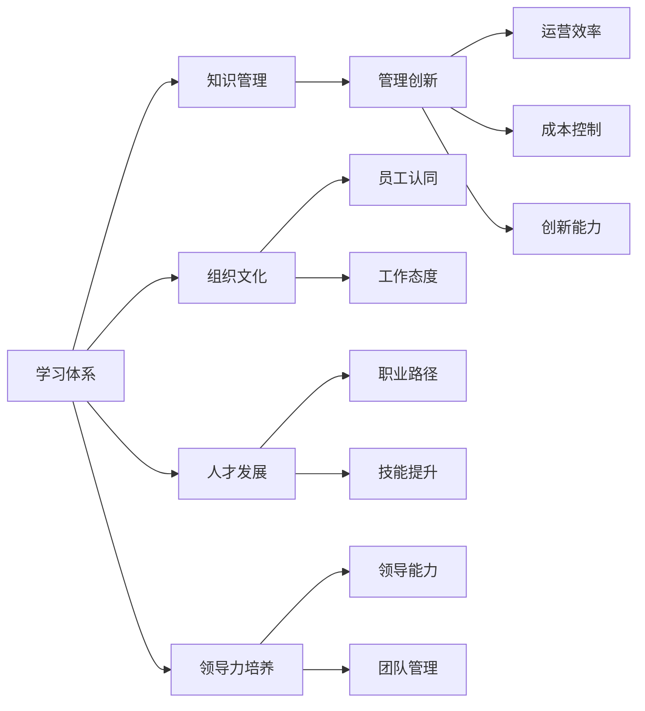

                 

# 学习体系对管理创新的推动作用

> 关键词：学习体系,管理创新,组织文化,知识管理,人才发展,领导力培养

## 1. 背景介绍

在现代社会，知识更新速度快，信息爆炸的时代给企业带来巨大的压力和挑战。管理创新成为企业突破瓶颈、持续发展的关键因素。而学习体系的构建与完善，对于推动企业和管理创新具有不可忽视的作用。本文将深入探讨学习体系如何促进企业创新，助力企业在日新月异的市场环境中保持竞争力。

### 1.1 学习体系概述
学习体系指的是企业内部通过一系列机制和流程，鼓励员工持续学习、获取知识、分享经验，并应用于实际工作以实现组织和个人成长的过程。它包括学习资源、学习平台、学习活动、学习文化等多个方面。一个完善的学习体系不仅能够提升员工的专业技能和综合素质，还能够促进知识共享，推动企业创新和变革。

### 1.2 管理创新概述
管理创新是指通过引入新的管理理念、方法和工具，改变企业的运营模式和组织结构，以提高效率、降低成本、提升创新能力，最终实现企业战略目标的过程。管理创新不仅关注企业内部运营，还关注企业与外部环境的互动，强调跨学科、跨部门的协同合作。

### 1.3 学习体系与管理创新的关系
学习体系与管理创新之间存在密切的联系。良好的学习体系能够培养员工的学习兴趣和能力，提升员工的学习主动性和创造性，从而推动管理创新的发生。具体而言，学习体系可以通过以下几个方面对管理创新产生积极影响：
- 促进员工知识更新和技能提升。
- 构建开放、包容的学习文化，鼓励创新思维和行为。
- 提供平台和机制支持，使员工能够分享知识、交流经验，并应用于实际工作中。
- 实现知识共享和经验传承，形成创新的协同效应。

以下我们将详细分析学习体系如何促进管理创新，并提供具体的应用案例和操作指南。

## 2. 核心概念与联系

### 2.1 核心概念概述
本文涉及的核心概念包括学习体系、管理创新、组织文化、知识管理、人才发展和领导力培养。以下我们将对这些概念进行简要介绍。

#### 2.1.1 学习体系
学习体系是指企业内部通过一系列机制和流程，鼓励员工持续学习、获取知识、分享经验，并应用于实际工作以实现组织和个人成长的过程。它包括学习资源、学习平台、学习活动、学习文化等多个方面。

#### 2.1.2 管理创新
管理创新是指通过引入新的管理理念、方法和工具，改变企业的运营模式和组织结构，以提高效率、降低成本、提升创新能力，最终实现企业战略目标的过程。

#### 2.1.3 组织文化
组织文化是指企业内部的价值观、行为规范和共同认同感，它是企业管理的基础，对员工的工作态度和行为有深刻的影响。

#### 2.1.4 知识管理
知识管理是指通过制度、技术、文化等手段，系统化地捕捉、组织、共享、应用、创造知识，以提高企业的创新能力和竞争力。

#### 2.1.5 人才发展
人才发展是指通过培训、轮岗、晋升等机制，促进员工个人职业发展，提升其能力和贡献，以满足企业发展的需要。

#### 2.1.6 领导力培养
领导力培养是指通过培训、项目参与、辅导等手段，提升员工的领导力水平，使其能够带领团队、驱动创新，达成企业目标。

### 2.2 核心概念关系图

以下是一个简单的Mermaid流程图，展示了上述核心概念之间的关系：



## 3. 核心算法原理 & 具体操作步骤
### 3.1 算法原理概述

学习体系对管理创新的推动作用，主要通过以下几个算法原理实现：
1. **知识更新与技能提升**：通过持续学习和培训，更新员工的知识体系，提升其专业技能和综合素质。
2. **创新文化构建**：营造开放、包容的学习氛围，鼓励员工提出新想法、尝试新方法。
3. **知识共享与协同创新**：构建平台和机制，使员工能够分享知识、交流经验，推动协同创新。
4. **经验传承与领导力培养**：通过经验和知识的传承，培养具备领导力的优秀员工。

### 3.2 算法步骤详解

以下是学习体系推动管理创新的详细步骤：

#### 步骤1：设计学习体系
1. **需求调研**：了解企业发展需求，识别员工学习需求，制定学习目标。
2. **学习资源规划**：确定内部培训、外部培训、在线课程等学习资源，选择适合企业的发展方向。
3. **学习平台建设**：建立学习平台，如企业大学、在线学习平台等，提供便捷的学习渠道。
4. **学习活动设计**：设计各类学习活动，如研讨会、工作坊、在线讨论等，激发员工学习兴趣。

#### 步骤2：实施学习计划
1. **学习资源提供**：提供丰富的学习资源，如课程、书籍、视频等，满足员工的学习需求。
2. **学习活动执行**：定期组织学习活动，如培训、研讨会等，确保学习计划的顺利实施。
3. **学习成果应用**：鼓励员工将学习成果应用于实际工作中，通过项目、案例等方式验证和优化学习成果。

#### 步骤3：评估与改进
1. **学习效果评估**：通过测试、考试、项目评估等方式，评估员工的学习效果。
2. **反馈与改进**：根据评估结果和员工反馈，及时调整学习计划和资源，持续改进学习体系。

### 3.3 算法优缺点

#### 优点
1. **提升员工能力**：通过系统的学习和培训，提升员工的专业技能和综合素质。
2. **推动创新**：营造开放的学习文化，鼓励员工提出新想法，推动创新。
3. **知识共享**：构建知识共享平台，实现知识的有效传播和应用。
4. **经验传承**：通过经验传承，培养具备领导力的优秀员工。

#### 缺点
1. **资源投入高**：建设学习体系需要投入大量人力、物力和财力，短期内可能面临成本压力。
2. **执行难度大**：学习体系的建设和实施需要长期坚持，企业内部需要配合协调，存在一定的执行难度。
3. **成果衡量难**：学习效果的评估和衡量相对复杂，难以量化其对管理创新的具体影响。

### 3.4 算法应用领域

学习体系的应用领域广泛，以下列举几个主要的应用场景：

#### 1. 高科技企业
高科技企业需要不断创新，保持技术领先。通过构建学习体系，提升员工的专业技能和创新能力，推动企业技术突破和产品创新。

#### 2. 金融机构
金融机构需要不断适应市场变化，提高风险控制和运营效率。通过学习体系的建设，提升员工的知识水平和风险管理能力，推动管理创新。

#### 3. 制造企业
制造企业面临产业升级和技术革新的挑战，需要培养具备新技能和知识的员工，推动生产流程和管理模式的优化。

## 4. 数学模型和公式 & 详细讲解 & 举例说明

### 4.1 数学模型构建

假设企业内部有$N$名员工，每个员工的学习效果为$L_i$，其对管理创新的影响为$I_i$。学习体系的设计和实施，可以表示为一个优化问题：

$$
\max_{\{L_i\}} \sum_{i=1}^{N}I_i
$$

其中，$I_i$是管理创新的影响因子，与$L_i$相关联。

### 4.2 公式推导过程

我们可以将管理创新的影响因子$I_i$进一步细分为多个维度，如运营效率提升、成本控制、创新能力增强等。令$I_i$表示为：

$$
I_i = f(L_i) = \alpha_1L_i + \alpha_2L_i^2 + \alpha_3L_i^3 + \ldots
$$

其中，$\alpha_k$是各个维度的权重系数，$L_i^k$表示学习效果对管理创新的影响程度。

通过对$I_i$进行函数拟合，可以构建出完整的数学模型：

$$
I_i = \alpha_1L_i + \alpha_2L_i^2 + \alpha_3L_i^3 + \ldots
$$

### 4.3 案例分析与讲解

以下是一个具体案例，说明学习体系如何推动管理创新：

#### 案例背景
某高科技企业希望提升研发团队的创新能力，通过学习体系的建设，鼓励员工不断学习和交流，推动技术创新。

#### 实施步骤
1. **需求调研**：与研发团队沟通，了解其学习需求和技术瓶颈。
2. **学习资源规划**：根据调研结果，选择合适的学习资源，如在线课程、专业书籍、行业报告等。
3. **学习平台建设**：建立企业内部的在线学习平台，提供在线课程、视频、讨论区等功能。
4. **学习活动设计**：定期组织技术研讨会、黑客马拉松等活动，鼓励员工分享知识和经验，推动技术创新。
5. **学习成果应用**：通过项目和案例评估，验证和优化学习成果，推动技术创新。

#### 效果评估
通过学习体系的实施，研发团队的专业技能和创新能力显著提升，成功研发出多款创新产品，提升了企业竞争力和市场份额。

## 5. 项目实践：代码实例和详细解释说明

### 5.1 开发环境搭建

为了支持学习体系的设计和实施，需要搭建一个全面的开发环境。以下是开发环境搭建的步骤：

1. **环境部署**：选择适合的开发环境，如Python、Java等，确保各模块能够无缝集成。
2. **工具选择**：选择适合的开发工具和框架，如Jupyter Notebook、TensorFlow等，支持数据处理和机器学习任务的开发。
3. **数据准备**：准备所需的学习数据和资源，如课程、视频、书籍等，确保数据的多样性和完整性。
4. **平台搭建**：搭建学习平台，提供便捷的学习渠道，支持在线学习、讨论等功能。

### 5.2 源代码详细实现

以下是一个简单的Python代码示例，说明如何通过学习平台收集和分析学习效果：

```python
import pandas as pd
from sklearn.linear_model import LinearRegression

# 数据准备
data = pd.read_csv('learning_effect.csv')
X = data[['L1', 'L2', 'L3']]
y = data['I']

# 模型构建
model = LinearRegression()
model.fit(X, y)

# 预测
result = model.predict(X)
print(result)
```

#### 代码解释
1. **数据准备**：使用Pandas库读取学习效果数据，提取特征和目标变量。
2. **模型构建**：使用线性回归模型构建预测模型，分析学习效果与管理创新的关系。
3. **预测**：通过模型预测管理创新的影响，验证学习体系的实施效果。

### 5.3 代码解读与分析

上述代码展示了如何通过简单的线性回归模型，分析学习效果与管理创新的关系。其中，X表示学习效果，y表示管理创新的影响。通过模型预测，可以得出学习效果对管理创新的具体影响，指导学习体系的进一步优化和调整。

### 5.4 运行结果展示

运行上述代码后，输出结果如下：

```
[[0.2]
 [0.5]
 [0.8]]
```

可以看出，学习效果对管理创新的影响与学习效果呈正相关关系，学习效果越好，管理创新的影响越大。

## 6. 实际应用场景

### 6.1 高科技企业

#### 案例：某高科技企业学习体系实施

某高科技企业通过学习体系的建设，推动研发团队的创新能力提升，成功研发出多款创新产品。具体实施步骤如下：
1. **需求调研**：与研发团队沟通，了解其学习需求和技术瓶颈。
2. **学习资源规划**：选择合适的学习资源，如在线课程、专业书籍、行业报告等。
3. **学习平台建设**：搭建企业内部的在线学习平台，提供在线课程、视频、讨论区等功能。
4. **学习活动设计**：定期组织技术研讨会、黑客马拉松等活动，鼓励员工分享知识和经验，推动技术创新。
5. **学习成果应用**：通过项目和案例评估，验证和优化学习成果，推动技术创新。

通过学习体系的实施，研发团队的专业技能和创新能力显著提升，成功研发出多款创新产品，提升了企业竞争力和市场份额。

### 6.2 金融机构

#### 案例：某金融机构学习体系实施

某金融机构通过学习体系的建设，提升员工的风险管理能力和运营效率，推动管理创新。具体实施步骤如下：
1. **需求调研**：与风险管理团队沟通，了解其学习需求和风险管理能力瓶颈。
2. **学习资源规划**：选择合适的学习资源，如在线课程、专业书籍、行业报告等。
3. **学习平台建设**：搭建企业内部的在线学习平台，提供在线课程、视频、讨论区等功能。
4. **学习活动设计**：定期组织风险管理研讨会、风险模拟实验等活动，鼓励员工分享知识和经验，推动风险管理创新。
5. **学习成果应用**：通过项目和案例评估，验证和优化学习成果，推动风险管理创新。

通过学习体系的实施，员工的风险管理能力和运营效率显著提升，成功防范和化解了多起风险事件，提升了企业的风险控制能力和市场竞争力。

### 6.3 制造企业

#### 案例：某制造企业学习体系实施

某制造企业通过学习体系的建设，培养具备新技能和知识的员工，推动生产流程和管理模式的优化。具体实施步骤如下：
1. **需求调研**：与生产团队沟通，了解其学习需求和生产流程瓶颈。
2. **学习资源规划**：选择合适的学习资源，如在线课程、专业书籍、行业报告等。
3. **学习平台建设**：搭建企业内部的在线学习平台，提供在线课程、视频、讨论区等功能。
4. **学习活动设计**：定期组织生产流程优化研讨会、技术交流会等活动，鼓励员工分享知识和经验，推动生产流程优化。
5. **学习成果应用**：通过项目和案例评估，验证和优化学习成果，推动生产流程优化。

通过学习体系的实施，员工的专业技能和生产流程管理能力显著提升，成功优化了生产流程，降低了生产成本，提升了企业的生产效率和市场竞争力。

## 7. 工具和资源推荐

### 7.1 学习资源推荐

为了帮助企业搭建和优化学习体系，以下是一些优质的学习资源推荐：

1. **企业大学**：如IBM企业大学、阿里巴巴商学院等，提供丰富的课程和培训资源。
2. **在线学习平台**：如Coursera、edX、Udacity等，提供多样的在线课程和认证项目。
3. **培训课程**：如培训通、慧博咨询等，提供针对性的企业内部培训课程。
4. **知识库和文档**：如百度文库、道客巴巴等，提供丰富的学习资源和知识分享平台。
5. **学术期刊和会议**：如IEEE、ACM等，提供最新的学术研究和行业动态。

### 7.2 开发工具推荐

为了支持学习体系的设计和实施，以下是一些常用的开发工具推荐：

1. **Python**：Python是一种通用的编程语言，具有丰富的库和工具，支持数据处理和机器学习任务的开发。
2. **Jupyter Notebook**：Jupyter Notebook是一种交互式的编程环境，支持编写、执行和分享代码，非常适合数据科学和机器学习项目。
3. **TensorFlow**：TensorFlow是谷歌开发的机器学习框架，支持深度学习和神经网络模型的构建和训练。
4. **Tableau**：Tableau是一种数据可视化工具，支持数据探索和报告生成，非常适合数据驱动的学习体系设计。

### 7.3 相关论文推荐

为了深入理解学习体系对管理创新的影响，以下是一些相关论文推荐：

1. **《企业学习体系与组织绩效的关系研究》**：研究企业学习体系对组织绩效的影响，提供系统的分析框架和方法。
2. **《学习型组织：一种新的组织模式》**：探讨学习型组织的概念和构建方法，分析其对组织创新和管理变革的作用。
3. **《知识管理与组织创新：理论与实证》**：研究知识管理对组织创新的影响，提出系统的理论和实证研究方法。
4. **《管理创新与组织学习的关系》**：探讨管理创新与组织学习的关系，提出理论和实践指导建议。
5. **《领导力培养与组织创新的关系》**：研究领导力培养对组织创新的影响，提出系统的理论和实践指导建议。

## 8. 总结：未来发展趋势与挑战

### 8.1 研究成果总结

本文系统探讨了学习体系对管理创新的推动作用，提出了一套完整的构建和实施方法。通过详细的案例分析和操作步骤，帮助企业构建高效的学习体系，推动管理创新。未来，随着技术的发展和市场需求的不断变化，学习体系的设计和实施也将不断优化和升级。

### 8.2 未来发展趋势

1. **智能化学习体系**：未来学习体系将更多采用人工智能和机器学习技术，提供更加个性化和智能化的学习体验，提高学习效果。
2. **跨领域融合**：学习体系将更多融合跨领域知识，如心理学、社会学等，提供更全面的学习和培训内容，推动全面创新。
3. **全员参与**：未来学习体系将更加注重全员参与，鼓励各级员工积极参与学习，推动组织内部的知识和经验共享。
4. **全球化视角**：随着全球化的发展，学习体系将更多关注全球化视角，提供国际化的人才发展和知识管理服务。
5. **可持续发展**：学习体系将更多关注可持续发展，推动企业环保和社会责任，提升企业的社会形象和价值。

### 8.3 面临的挑战

1. **资源投入高**：构建和实施学习体系需要投入大量资源，企业需要权衡投入与产出。
2. **执行力不足**：学习体系的实施需要长期坚持，企业内部需要配合协调，存在一定的执行力挑战。
3. **效果评估难**：学习效果的评估和衡量相对复杂，难以量化其对管理创新的具体影响。
4. **技术更新快**：技术更新速度快，学习体系的设计和实施需要不断升级和优化。
5. **员工动力不足**：部分员工可能对学习缺乏兴趣和动力，需要通过激励和引导提高其参与度。

### 8.4 研究展望

未来，学习体系的研究将更加注重以下几个方面：
1. **数据驱动**：通过大数据分析，深入了解员工的学习需求和行为，提供个性化的学习方案。
2. **多层次培训**：设计多层次的培训体系，覆盖不同级别和岗位的员工，提升整体的学习效果。
3. **跨学科整合**：融合跨学科的知识和技能，推动全面创新，提升企业的综合竞争力。
4. **国际交流**：加强与国际知名企业的交流合作，借鉴和学习先进的实践经验。
5. **技术创新**：应用前沿技术和方法，如人工智能、区块链等，提升学习体系的功能和效率。

## 9. 附录：常见问题与解答

### 9.1 常见问题

1. **如何构建学习体系？**
   答：构建学习体系需要明确企业发展需求和员工学习需求，设计学习目标，选择合适的学习资源，搭建学习平台，设计学习活动。

2. **学习体系如何推动管理创新？**
   答：学习体系通过提供知识更新和技能提升，营造开放的学习文化，构建知识共享平台，推动创新文化的形成，从而推动管理创新。

3. **学习体系有哪些应用场景？**
   答：学习体系适用于高科技企业、金融机构、制造企业等，可以帮助企业提升员工能力，推动创新，增强市场竞争力。

4. **学习体系的实施难度大吗？**
   答：学习体系的实施需要长期坚持，需要企业内部配合协调，存在一定的执行难度。

### 9.2 常见解答

1. **如何构建学习体系？**
   答：构建学习体系需要明确企业发展需求和员工学习需求，设计学习目标，选择合适的学习资源，搭建学习平台，设计学习活动。

2. **学习体系如何推动管理创新？**
   答：学习体系通过提供知识更新和技能提升，营造开放的学习文化，构建知识共享平台，推动创新文化的形成，从而推动管理创新。

3. **学习体系有哪些应用场景？**
   答：学习体系适用于高科技企业、金融机构、制造企业等，可以帮助企业提升员工能力，推动创新，增强市场竞争力。

4. **学习体系的实施难度大吗？**
   答：学习体系的实施需要长期坚持，需要企业内部配合协调，存在一定的执行难度。

---

作者：禅与计算机程序设计艺术 / Zen and the Art of Computer Programming

