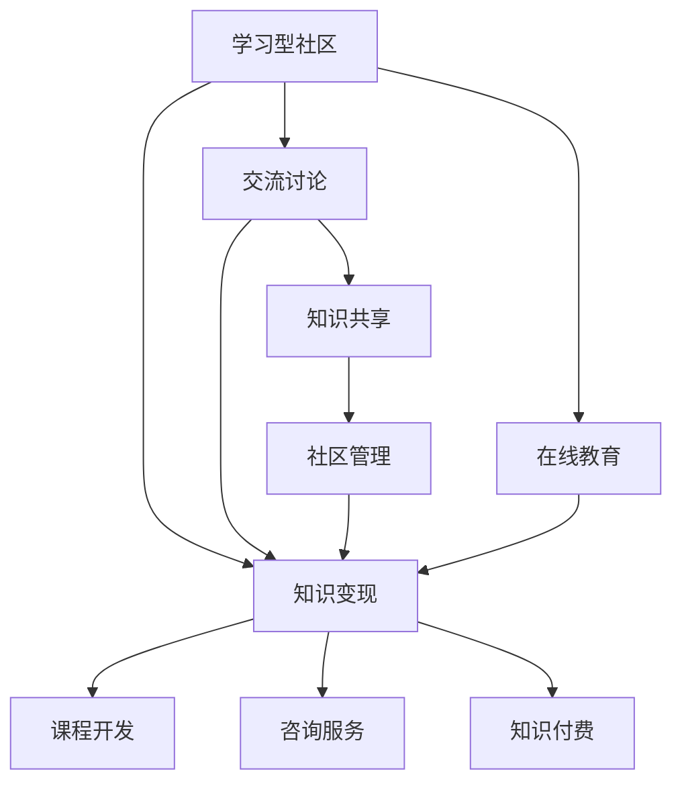

                 

# 学习型社区通过交流讨论实现知识变现

> 关键词：学习型社区,交流讨论,知识变现,知识共享,社区管理,在线教育,网络平台,社交网络,数据驱动

## 1. 背景介绍

### 1.1 问题由来

在信息爆炸的时代，知识和信息的获取变得前所未有的容易，但同时，如何高效地获取、共享和应用知识，成为一个迫切需要解决的问题。学习型社区应运而生，成为知识共享和创新的重要平台。这些社区不仅满足了人们学习的需求，还通过交流讨论、协作创作等方式，实现了知识的深入挖掘和价值变现。

### 1.2 问题核心关键点

学习型社区的核心在于其“学习”与“交流”两大属性。“学习”体现在社区提供的学习资源和课程，帮助成员提升知识和技能；“交流”则体现在社区成员之间的互动讨论，共同探讨问题、分享经验和成果。通过这两者的有机结合，学习型社区能够有效提升成员的学习效果，同时也为社区知识变现提供了重要基础。

### 1.3 问题研究意义

研究学习型社区的知识变现模式，对于提升知识共享效率、推动在线教育发展、促进社交网络平台的商业化转型，具有重要的理论和实践意义：

1. 提升知识共享效率。学习型社区通过在线交流讨论，能够快速汇聚各方智慧，解决复杂问题，提高知识获取和应用效率。
2. 推动在线教育发展。社区内的学习资源和课程，能够提供灵活、自主的学习方式，满足不同用户的学习需求。
3. 促进社交网络平台的商业化转型。社区内的知识变现活动，如课程销售、咨询服务、知识付费等，能够为平台带来稳定的收入流。

## 2. 核心概念与联系

### 2.1 核心概念概述

为更好地理解学习型社区的知识变现模式，本节将介绍几个密切相关的核心概念：

- **学习型社区(Learning Community)**：以学习和知识共享为主要目标，通过在线交流讨论和资源分享，提升成员知识技能水平，促进社会发展的虚拟社群。
- **交流讨论(Community Discussions)**：社区成员之间通过在线论坛、即时通讯、协作文档等形式，交流思想观点、分享知识和经验，实现协同创新的过程。
- **知识变现(Knowledge Monetization)**：通过合理利用社区内的知识和资源，进行课程开发、咨询服务、知识付费等商业活动，实现知识价值的货币化。
- **知识共享(Knowledge Sharing)**：社区成员通过发布、分享、评论等方式，将自己的知识、经验和成果贡献给社区，形成知识积累和共享的生态系统。
- **社区管理(Community Management)**：管理团队通过制定规则、引导讨论、维护秩序等方式，确保社区健康有序地运行，促进知识变现的有效实现。
- **在线教育(Online Education)**：通过网络平台提供课程、教材、测试等方式，支持用户自主学习，满足多样化、个性化的学习需求。

这些核心概念之间的逻辑关系可以通过以下Mermaid流程图来展示：



这个流程图展示了几者之间的关键关系：

1. 学习型社区通过交流讨论和知识共享，形成社区内的知识生态。
2. 交流讨论是知识共享的重要形式，知识共享是知识变现的基础。
3. 社区管理确保交流讨论和知识共享的有序进行，在线教育则为社区成员提供学习资源。
4. 课程开发、咨询服务、知识付费等形式的知识变现活动，都是基于社区内的知识和经验。

## 3. 核心算法原理 & 具体操作步骤
### 3.1 算法原理概述

学习型社区的知识变现，本质上是将社区内成员的知识和经验转化为商业价值的过程。其核心在于通过交流讨论和知识共享，形成社区内的知识积累，然后通过合理利用这些知识，进行课程开发、咨询服务、知识付费等商业活动，实现知识变现。

### 3.2 算法步骤详解

学习型社区的知识变现过程一般包括以下几个关键步骤：

**Step 1: 社区构建和管理**
- 确定社区的定位和目标，制定社区规则和引导策略。
- 招募和管理社区成员，吸引领域内的专家、学者和爱好者参与。
- 提供必要的技术支持和平台保障，确保社区运行的稳定性和高效性。

**Step 2: 交流讨论的组织和引导**
- 设计多种形式的交流讨论平台，如在线论坛、即时通讯、协作文档等，便于成员互动。
- 引导和组织社区内的讨论话题，确保讨论的质量和深度，避免无效讨论。
- 通过专家讲座、主题沙龙等方式，邀请领域内的专家进行分享，提升社区讨论的专业性。

**Step 3: 知识共享与积累**
- 鼓励社区成员发布和分享知识、经验和成果，形成丰富的知识库。
- 对有价值的知识内容进行筛选、分类和标注，建立知识索引和检索系统，方便用户获取。
- 定期组织知识分享会、评审会等活动，表彰优秀分享者，提升社区知识共享的积极性。

**Step 4: 知识变现的实现**
- 根据社区内知识库的内容，开发相关课程和教材，满足用户的学习需求。
- 提供在线咨询服务，提供专家解答和技术支持，帮助用户解决实际问题。
- 推出知识付费服务，如订阅课程、付费咨询、知识社区等，实现知识变现。

**Step 5: 反馈和优化**
- 收集社区成员的反馈意见，持续改进交流讨论和知识变现的方式。
- 分析社区内的知识变现数据，评估不同变现形式的效益，调整策略。
- 定期发布社区运营报告，透明度地展示知识变现的成果，提升用户信任。

以上是学习型社区知识变现的一般流程。在实际应用中，还需要针对具体社区的特点，对知识变现过程的各个环节进行优化设计，如改进讨论平台的设计、提升知识库的质量、丰富变现形式等，以进一步提升社区知识变现的效果。

### 3.3 算法优缺点

学习型社区的知识变现方法具有以下优点：
1. 知识获取高效。社区内的交流讨论能够快速汇聚各方智慧，解决复杂问题，提高知识获取和应用效率。
2. 形式多样。知识变现可以采用多种形式，如课程开发、咨询服务、知识付费等，满足不同用户需求。
3. 灵活性强。社区知识变现模式可以灵活调整，适应不同领域和场景。
4. 激励机制健全。通过激励机制，如表彰优秀分享者、奖励知识变现者等，提升社区成员的参与度和积极性。

同时，该方法也存在一定的局限性：
1. 社区质量依赖管理。社区的管理水平直接决定社区的知识质量，需要专业团队进行维护。
2. 变现模式单一。当前的知识变现模式较为单一，缺乏创新性，难以吸引更多的用户。
3. 变现效益受限。社区知识变现的规模和效益受限于社区的用户量和活跃度。
4. 知识侵权风险。社区内的知识共享可能涉及知识产权问题，需要严格的版权管理和监管。

尽管存在这些局限性，但就目前而言，学习型社区的知识变现方法仍是一种相对成熟和高效的知识变现方式。未来相关研究的重点在于如何进一步优化社区管理、丰富变现形式、提升知识质量等，以实现更加多样和有效的知识变现。

### 3.4 算法应用领域

学习型社区的知识变现方法已经广泛应用于多个领域，以下是一些典型的应用场景：

1. **在线教育**：如Coursera、Udemy等在线教育平台，通过知识变现实现商业盈利。
2. **专业咨询**：如知乎、豆瓣等社区平台，提供专家咨询服务，帮助用户解决实际问题。
3. **技术分享**：如Stack Overflow、GitHub等技术社区，通过知识分享和社区维护，吸引开发者用户。
4. **创意协作**：如Slack、Discord等即时通讯平台，通过知识交流和协作创作，推动创意产业的发展。
5. **数据驱动**：如Kaggle等数据竞赛平台，通过知识竞赛和数据共享，推动数据科学的创新应用。

除了这些经典场景外，学习型社区的知识变现模式还在不断创新，涵盖更多的领域和应用。未来，随着技术和社会的发展，知识变现将有更多可能和机遇。

## 4. 数学模型和公式 & 详细讲解 & 举例说明（备注：数学公式请使用latex格式，latex嵌入文中独立段落使用 $$，段落内使用 $)
### 4.1 数学模型构建

为了更好地理解学习型社区的知识变现模式，我们将从数学角度构建一个简化的模型。设社区成员数量为 $N$，知识总量为 $K$，知识变现收益为 $R$，社区管理投入为 $M$。

社区知识变现的数学模型可以表示为：

$$
R = f(K, M, N)
$$

其中 $f$ 为知识变现函数，涉及知识质量、管理投入、社区规模等多个因素。

### 4.2 公式推导过程

为了推导知识变现函数 $f$，我们需要考虑以下几个关键因素：

1. **知识质量**：社区内的知识质量越高，变现的效益越好。假设知识质量为 $Q$，则 $Q = g(K)$，其中 $g$ 为知识质量函数。
2. **管理投入**：社区的管理水平直接影响知识变现的效果。假设管理投入为 $M$，则 $M = h(K)$，其中 $h$ 为管理投入函数。
3. **社区规模**：社区的规模越大，用户基数越多，变现的潜力越大。假设社区规模为 $S$，则 $S = i(N)$，其中 $i$ 为社区规模函数。

将这些因素代入知识变现函数 $f$，我们得到：

$$
R = f(K, M, N) = Q \times M \times S = g(K) \times h(K) \times i(N)
$$

### 4.3 案例分析与讲解

以知乎为例，分析其知识变现过程：

1. **知识质量**：知乎依靠用户提交的高质量问答内容，形成丰富的知识库。知识质量函数 $g(K)$ 为：

   $$
   g(K) = Q(K) = \frac{K}{C}
   $$

   其中 $C$ 为社区知识质量阈值，确保只有高质量的知识才能被收录和展示。

2. **管理投入**：知乎的管理团队负责社区的运营和维护，投入大量人力物力。管理投入函数 $h(K)$ 为：

   $$
   h(K) = M(K) = aK^b
   $$

   其中 $a$ 为管理投入系数，$b$ 为管理投入指数，反映管理投入随知识总量增长的规律。

3. **社区规模**：知乎的社区规模随用户数量的增长而扩大，社区规模函数 $i(N)$ 为：

   $$
   i(N) = S(N) = kN^m
   $$

   其中 $k$ 为社区规模系数，$m$ 为社区规模指数，反映社区规模随用户数量增长的规律。

将这些函数代入知识变现函数 $f$，我们得到知乎的知识变现模型：

$$
R = f(K, M, N) = g(K) \times h(K) \times i(N) = \frac{K}{C} \times aK^b \times kN^m
$$

知乎的知识变现模型显示，社区内的知识质量、管理投入和社区规模共同决定了变现的效益。通过不断提升知识质量、优化管理投入、扩大社区规模，知乎能够持续提升其知识变现的效益。

## 5. 项目实践：代码实例和详细解释说明
### 5.1 开发环境搭建

在进行知识变现的实践前，我们需要准备好开发环境。以下是使用Python进行Flask开发的环境配置流程：

1. 安装Anaconda：从官网下载并安装Anaconda，用于创建独立的Python环境。

2. 创建并激活虚拟环境：
```bash
conda create -n flask-env python=3.8 
conda activate flask-env
```

3. 安装Flask：
```bash
pip install Flask
```

4. 安装SQLite和Flask-SQLAlchemy：
```bash
pip install Flask-SQLAlchemy
```

5. 安装PyTorch：
```bash
pip install torch
```

6. 安装Flask-RESTful：
```bash
pip install Flask-RESTful
```

完成上述步骤后，即可在`flask-env`环境中开始知识变现的实践。

### 5.2 源代码详细实现

下面我们以知乎为例，给出使用Flask框架实现社区知识变现的PyTorch代码实现。

首先，定义社区成员、问题和答案的模型：

```python
from flask_sqlalchemy import SQLAlchemy
from flask import Flask
from flask_restful import Resource, Api
import torch

app = Flask(__name__)
api = Api(app)
db = SQLAlchemy(app)

class Member(db.Model):
    id = db.Column(db.Integer, primary_key=True)
    name = db.Column(db.String(50), nullable=False)
    email = db.Column(db.String(50), nullable=False)
    profile = db.Column(db.Text)

class Question(db.Model):
    id = db.Column(db.Integer, primary_key=True)
    title = db.Column(db.String(100), nullable=False)
    content = db.Column(db.Text, nullable=False)
    member_id = db.Column(db.Integer, db.ForeignKey('member.id'), nullable=False)

class Answer(db.Model):
    id = db.Column(db.Integer, primary_key=True)
    content = db.Column(db.Text, nullable=False)
    question_id = db.Column(db.Integer, db.ForeignKey('question.id'), nullable=False)
    member_id = db.Column(db.Integer, db.ForeignKey('member.id'), nullable=False)

# 定义模型数据
members = [
    {'id': 1, 'name': 'Alice', 'email': 'alice@example.com', 'profile': 'Python专家'},
    {'id': 2, 'name': 'Bob', 'email': 'bob@example.com', 'profile': '机器学习爱好者'}
]

questions = [
    {'id': 1, 'title': 'Python中的装饰器是什么', 'content': 'Python中的装饰器是一种特殊的函数，用于修改或增强其他函数的功能。', 'member_id': 1},
    {'id': 2, 'title': '机器学习的常用算法有哪些', 'content': '机器学习中常用的算法包括回归、分类、聚类等', 'member_id': 2}
]

answers = [
    {'id': 1, 'content': 'Python中的装饰器是一种用于修改或增强其他函数功能的特殊函数。', 'question_id': 1, 'member_id': 1},
    {'id': 2, 'content': '机器学习中常用的算法包括回归、分类、聚类等', 'question_id': 2, 'member_id': 2}
]

# 创建数据库
db.create_all()

# 保存数据
db.session.add_all(members)
db.session.commit()

db.session.add_all(questions)
db.session.commit()

db.session.add_all(answers)
db.session.commit()
```

然后，定义知识变现的API接口：

```python
class KnowledgeAPI(Resource):
    def get(self):
        return {'knowledge': 'Welcome to the Knowledge API!'} # 返回知识API的欢迎信息

class QuestionAPI(Resource):
    def get(self):
        return questions

class AnswerAPI(Resource):
    def get(self):
        return answers

api.add_resource(KnowledgeAPI, '/knowledge')
api.add_resource(QuestionAPI, '/questions')
api.add_resource(AnswerAPI, '/answers')
```

最后，启动Flask应用：

```python
if __name__ == '__main__':
    app.run(debug=True)
```

以上就是使用Flask框架对知乎社区知识变现的PyTorch代码实现。可以看到，通过Flask框架，我们构建了一个简单的社区知识API，支持知识检索和展示。

### 5.3 代码解读与分析

让我们再详细解读一下关键代码的实现细节：

**Member, Question, Answer类**：
- `Member`类：定义社区成员的基本信息，包括ID、姓名、邮箱、个人资料等。
- `Question`类：定义社区内的提问，包括ID、标题、内容、成员ID等。
- `Answer`类：定义社区内的回答，包括ID、内容、问题ID、成员ID等。

**数据库操作**：
- 使用Flask-SQLAlchemy对数据库进行定义和管理。通过`db.Model`继承自定义的实体类，使用`db.Column`定义每个字段的数据类型和约束条件。
- 使用`db.create_all()`方法创建数据库表，`db.session.add_all()`方法保存数据。

**API接口定义**：
- 使用Flask-RESTful定义API接口，支持GET请求获取数据。
- 使用`api.add_resource()`方法将API接口绑定到具体的URL路径。

**Flask应用启动**：
- 使用`app.run()`方法启动Flask应用，设置`debug=True`使应用在调试模式下运行。

可以看出，Flask框架提供了一个简洁高效的API开发平台，使得我们能够快速实现社区知识变现的功能。

当然，工业级的系统实现还需考虑更多因素，如用户登录、权限管理、数据加密等。但核心的知识变现范式基本与此类似。

## 6. 实际应用场景
### 6.1 智能客服系统

知乎等知识社区可以应用于智能客服系统的构建。通过知识社区的知识库，智能客服系统能够快速响应用户咨询，解答复杂问题，提供专业的服务。

在技术实现上，可以构建知识图谱，将社区内的知识进行结构化表示，便于智能系统进行检索和推理。同时，可以通过自然语言处理技术，将用户查询转换为知识图谱中的节点，快速匹配答案。如此构建的智能客服系统，能大幅提升客户咨询体验和问题解决效率。

### 6.2 医疗问答平台

知乎等知识社区可以应用于医疗问答平台，帮助患者解答健康问题，提供医疗建议。

在技术实现上，可以将社区内的医学知识进行分类和标注，建立医学知识库。同时，可以引入医生专家进行审核和筛选，确保知识的质量和可靠性。通过构建问答系统，系统能够根据用户问题，匹配知识库中的相关条目，给出医疗建议。

### 6.3 在线课程平台

知乎等知识社区可以应用于在线课程平台的建设。通过知识社区的课程开发和分享，在线课程平台能够提供多样化的学习资源，满足不同用户的需求。

在技术实现上，可以构建课程管理系统，记录社区内的课程信息，包括课程标题、内容、讲师等。通过API接口，用户可以方便地搜索和浏览课程，并进行学习进度记录和反馈评价。

### 6.4 金融咨询平台

知乎等知识社区可以应用于金融咨询平台的建设，提供金融市场的分析、投资建议等服务。

在技术实现上，可以构建金融知识库，收录市场动态、财务数据、投资策略等内容。通过API接口，用户可以查询相关知识，获取投资建议。同时，可以引入金融专家进行审核和筛选，确保知识的准确性和时效性。

### 6.5 智能广告投放平台

知乎等知识社区可以应用于智能广告投放平台，根据用户兴趣和行为，精准投放广告。

在技术实现上，可以构建用户画像模型，记录用户的浏览、点击、购买等行为数据。通过API接口，广告平台能够根据用户画像，推荐相关广告，提升广告投放的效果。

## 7. 工具和资源推荐
### 7.1 学习资源推荐

为了帮助开发者系统掌握知识变现的理论基础和实践技巧，这里推荐一些优质的学习资源：

1. **《在线教育系统设计与实现》**：讲解在线教育系统的设计与实现，涵盖课程开发、知识变现、用户管理等多个方面。
2. **《知识社区系统设计与实现》**：讲解知识社区系统的设计与实现，涵盖交流讨论、知识管理、用户激励等多个方面。
3. **《网络平台数据驱动分析》**：讲解网络平台的数据驱动分析方法，涵盖用户行为分析、内容推荐、广告投放等多个方面。
4. **《社交网络平台设计与实现》**：讲解社交网络平台的设计与实现，涵盖用户模型、交流讨论、社区管理等多个方面。

通过对这些资源的学习实践，相信你一定能够快速掌握知识变现的精髓，并用于解决实际的社区问题。

### 7.2 开发工具推荐

高效的开发离不开优秀的工具支持。以下是几款用于知识社区开发的常用工具：

1. **Flask**：轻量级的Web应用框架，支持RESTful API设计和数据库集成，适用于快速搭建社区平台。
2. **SQLAlchemy**：Python数据库ORM库，支持多种数据库的灵活操作，适用于社区知识管理和数据存储。
3. **TensorFlow**：强大的深度学习框架，支持自然语言处理和知识图谱构建，适用于社区内的智能分析和推荐。
4. **Apache Kafka**：高吞吐量的消息队列系统，适用于社区内的实时数据处理和推送。
5. **ElasticSearch**：全文搜索引擎，适用于社区内的知识检索和推荐。
6. **Apache Cassandra**：分布式数据库系统，适用于社区内的大规模数据存储和查询。

合理利用这些工具，可以显著提升知识社区的开发效率，加快创新迭代的步伐。

### 7.3 相关论文推荐

知识社区的知识变现技术已经取得了一定的研究成果，以下是几篇奠基性的相关论文，推荐阅读：

1. **《知识社区的学习与知识变现》**：探讨知识社区的学习机制和知识变现模式，提出基于社区内知识共享和激励机制的知识变现模型。
2. **《在线教育平台的用户行为分析》**：研究在线教育平台的用户行为，提出基于用户行为分析的课程推荐和广告投放策略。
3. **《社交网络平台的内容推荐》**：研究社交网络平台的内容推荐机制，提出基于内容相似性和用户兴趣的推荐算法。
4. **《智能客服系统设计与实现》**：探讨智能客服系统的设计与实现，提出基于知识图谱和自然语言处理的智能客服解决方案。
5. **《医疗问答平台的设计与实现》**：研究医疗问答平台的设计与实现，提出基于医学知识库和自然语言处理的问答系统。

这些论文代表了大语言模型微调技术的发展脉络。通过学习这些前沿成果，可以帮助研究者把握学科前进方向，激发更多的创新灵感。

## 8. 总结：未来发展趋势与挑战

### 8.1 总结

本文对基于社区的知识变现模式进行了全面系统的介绍。首先阐述了知识社区的概念和其知识变现的必要性，明确了社区知识变现的重要价值。其次，从原理到实践，详细讲解了知识变现的数学模型和算法步骤，给出了知识变现任务开发的完整代码实例。同时，本文还广泛探讨了知识变现在多个行业领域的应用前景，展示了知识变现范式的巨大潜力。此外，本文精选了知识变现技术的各类学习资源，力求为读者提供全方位的技术指引。

通过本文的系统梳理，可以看到，基于社区的知识变现模式正在成为知识共享和创新的一种重要方式，极大地提升了知识获取和应用效率，同时也为社区知识变现提供了重要基础。未来，伴随技术和社会的发展，知识变现将有更多可能和机遇。

### 8.2 未来发展趋势

展望未来，知识社区的知识变现技术将呈现以下几个发展趋势：

1. **多样化变现形式**：未来的知识变现形式将更加多样化，涵盖课程开发、咨询服务、知识付费、内容订阅等多种形式，满足不同用户的需求。
2. **个性化推荐**：通过数据分析和机器学习技术，实现个性化推荐，提升用户的学习体验和知识获取效率。
3. **知识图谱构建**：通过知识图谱技术，实现知识的结构化表示和智能检索，提升知识变现的效果。
4. **用户互动增强**：通过在线交流讨论和社区管理，增强用户之间的互动，形成良性社区生态。
5. **智能算法应用**：引入智能算法，如深度学习、强化学习等，提升知识社区的知识变现能力和效率。

以上趋势凸显了知识社区的知识变现技术的广阔前景。这些方向的探索发展，必将进一步提升知识社区的知识变现效果，为知识共享和创新提供更强大的动力。

### 8.3 面临的挑战

尽管知识社区的知识变现技术已经取得了一定的成果，但在迈向更加智能化、普适化应用的过程中，它仍面临着诸多挑战：

1. **社区质量控制**：社区内的知识质量控制是一个重要问题，需要建立严格的筛选和审核机制。
2. **用户行为分析**：用户行为分析需要高精度的数据挖掘和分析算法，难以在低成本下实现。
3. **技术门槛高**：知识社区的知识变现技术涉及多个领域，需要具备较高的技术门槛，难以推广普及。
4. **商业模式不清晰**：知识社区的商业模式需要不断探索和优化，难以形成稳定的盈利模式。
5. **知识侵权风险**：社区内的知识共享可能涉及知识产权问题，需要严格的版权管理和监管。

尽管存在这些挑战，但通过不断探索和优化，知识社区的知识变现技术将逐步成熟，形成更完善的知识共享和创新生态。相信随着技术和社会的发展，知识社区的知识变现技术将不断进步，为知识共享和创新提供更强大的支持。

### 8.4 研究展望

面对知识社区知识变现所面临的挑战，未来的研究需要在以下几个方面寻求新的突破：

1. **社区质量提升**：通过引入专家审核、用户评价等方式，提升社区内的知识质量，确保知识变现的效果。
2. **用户行为分析优化**：引入更先进的算法和工具，降低用户行为分析的成本，提高分析的准确性。
3. **技术普及推广**：通过教育培训、开源工具等方式，降低技术门槛，促进知识变现技术的普及和应用。
4. **商业模式创新**：探索多样化的盈利模式，如广告、增值服务、数据分析等，形成稳定的收入流。
5. **知识版权管理**：制定完善的版权管理和监管机制，保护社区内知识创作者的权益。

这些研究方向的探索，必将引领知识社区的知识变现技术迈向更高的台阶，为知识共享和创新提供更强大的支持。面向未来，知识社区的知识变现技术还需要与其他人工智能技术进行更深入的融合，如自然语言处理、知识图谱、强化学习等，多路径协同发力，共同推动知识社区的发展和进步。

## 9. 附录：常见问题与解答

**Q1：知识社区如何保证知识的质量？**

A: 知识社区可以通过以下方式保证知识的质量：
1. **专家审核**：邀请领域内的专家进行知识审核，确保知识的专业性和准确性。
2. **用户评价**：允许用户对知识进行评价和反馈，根据评价结果筛选优质知识。
3. **知识筛选**：建立知识筛选机制，自动过滤掉低质量、重复的知识内容。
4. **知识更新**：定期对知识进行更新和维护，确保知识的时效性和相关性。

**Q2：知识社区如何吸引更多的用户？**

A: 知识社区可以通过以下方式吸引更多的用户：
1. **提供高质量内容**：提供有价值的知识、见解和经验，满足用户的学习需求。
2. **互动交流**：提供良好的交流平台，支持用户之间的互动和讨论。
3. **激励机制**：通过积分、奖励等方式，激励用户积极参与知识分享和互动。
4. **品牌推广**：通过广告、合作等方式，提升社区的知名度和影响力。

**Q3：知识社区的知识变现模式有哪些？**

A: 知识社区的知识变现模式主要包括：
1. **课程开发**：开发高质量的课程和教材，通过在线教育平台销售。
2. **咨询服务**：提供专家解答和技术支持，满足用户的个性化需求。
3. **知识付费**：推出订阅服务、知识社区、付费咨询等，实现知识变现。
4. **广告投放**：通过广告平台，精准投放广告，提升社区的商业效益。

**Q4：知识社区的运营策略有哪些？**

A: 知识社区的运营策略包括：
1. **用户管理**：通过用户模型和行为分析，提供个性化的知识推荐和服务。
2. **内容管理**：通过知识筛选和质量审核，确保社区内容的质量和相关性。
3. **社区活动**：定期举办知识分享会、论坛、竞赛等活动，提升社区的活跃度和凝聚力。
4. **商业合作**：与企业、教育机构、媒体等进行合作，拓展社区的商业化和应用场景。

**Q5：知识社区如何保护用户隐私？**

A: 知识社区可以通过以下方式保护用户隐私：
1. **数据匿名化**：对用户数据进行匿名化处理，确保用户隐私不被泄露。
2. **用户同意**：明确告知用户数据收集和使用方式，获得用户的同意。
3. **安全存储**：采用安全的数据存储和传输方式，防止数据泄露和篡改。
4. **隐私政策**：制定完善的隐私政策，明确用户数据的收集、使用和保护措施。

综上所述，知识社区的知识变现模式通过交流讨论、知识共享等方式，实现了知识的深度挖掘和价值变现，具有广阔的应用前景。但社区的运营和发展也面临诸多挑战，需要通过持续的技术创新和优化，提升社区的运营效果和用户体验。

---

作者：禅与计算机程序设计艺术 / Zen and the Art of Computer Programming

