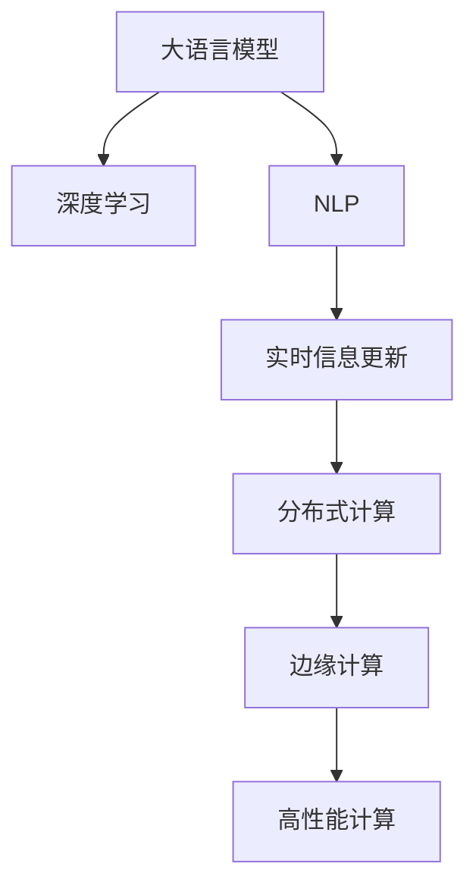

                 

# 实时信息更新：AI的速度优势

> 关键词：实时信息更新, AI, 速度优势, 数据处理, 自然语言处理(NLP), 边缘计算, 分布式系统, 大数据, 人工智能, 机器学习, 数据流, 高性能计算, 自动化

## 1. 背景介绍

### 1.1 问题由来
在现代社会，信息流动的速度越来越快，数据呈现爆炸式增长。从社交媒体到传感器，从物联网到云计算，海量数据源源不断地产生，对信息的实时处理和更新提出了更高的要求。随着人工智能技术的发展，AI正逐步成为推动信息实时更新和数据处理的重要引擎。

尤其是近年来，大语言模型和深度学习算法的飞速进步，让AI在实时信息更新方面展现了显著的速度优势。无论是社交媒体的自动化内容生成、企业数据监控的自动化报表，还是自动驾驶汽车的实时决策，AI都在其中扮演着至关重要的角色。因此，理解AI的速度优势及其在实时信息更新中的应用，具有重要的理论和实践意义。

### 1.2 问题核心关键点
AI的速度优势主要体现在以下几个方面：
1. **数据处理速度**：AI算法能够快速处理和分析海量数据，实时响应各类应用需求。
2. **模型训练速度**：深度学习模型的训练速度越来越快，缩短了从数据到模型再到应用的全链路周期。
3. **实时决策能力**：AI在处理实时数据时，能够快速做出高质量的决策，如自然语言处理(NLP)中的自动翻译、推荐系统中的实时推荐等。
4. **分布式计算**：利用分布式系统，AI可以并行处理大规模数据，进一步提高处理速度和效率。
5. **边缘计算**：将计算任务从中心云移至边缘设备，减少数据传输延迟，提升实时响应速度。

本文将从以上几个关键点出发，深入探讨AI的速度优势及其在实时信息更新中的应用。

## 2. 核心概念与联系

### 2.1 核心概念概述

为更好地理解AI的速度优势及其在实时信息更新中的应用，本节将介绍几个密切相关的核心概念：

- **大语言模型(Large Language Model, LLM)**：指通过自监督学习在大量无标签文本数据上进行预训练的模型，如GPT、BERT等。大语言模型能够处理复杂的自然语言任务，并具备显著的速度优势。
- **深度学习(Deep Learning)**：一种基于多层神经网络的机器学习算法，通过多层次特征提取和表示学习，提升模型的性能和速度。
- **自然语言处理(Natural Language Processing, NLP)**：指利用计算机处理和理解人类语言的技术，包括文本分类、情感分析、机器翻译等。
- **实时信息更新(Real-time Information Update)**：指系统能够快速响应用户请求，实时更新信息，适用于新闻发布、社交媒体、金融交易等领域。
- **分布式计算(Distributed Computing)**：利用多个计算节点并行处理数据，提升计算效率和速度。
- **边缘计算(Edge Computing)**：指在数据产生边缘的设备上进行计算和存储，减少数据传输延迟，提升实时性。
- **高性能计算(High-Performance Computing, HPC)**：指使用高性能硬件和算法，实现对大规模数据的高效计算。

这些核心概念之间的逻辑关系可以通过以下Mermaid流程图来展示：



这个流程图展示了大语言模型和深度学习通过NLP技术实现实时信息更新的全过程，其中分布式和边缘计算为实时性提供了重要的技术保障，高性能计算为大规模数据处理提供了算力支持。

## 3. 核心算法原理 & 具体操作步骤
### 3.1 算法原理概述

AI的速度优势主要通过以下几个关键算法实现：

- **Transformer算法**：Transformer是当前最先进的NLP模型架构，通过自注意力机制并行计算语言表示，显著提升了模型的训练和推理速度。
- **BERT算法**：BERT通过双向掩码语言模型预训练，能够更高效地处理长文本，提升了模型的泛化能力。
- **DNN算法**：深度神经网络通过多层次特征提取，使得模型能够处理更复杂的数据关系。
- **GPU加速**：GPU并行计算能力显著提升了模型训练和推理速度。
- **分布式训练**：通过分布式计算框架如TensorFlow、PyTorch，可以实现大规模数据的高效训练。

这些算法和技术共同构成了AI的速度优势，使得实时信息更新成为可能。

### 3.2 算法步骤详解

以下是基于上述算法实现AI速度优势的详细步骤：

**Step 1: 数据预处理**
- 对输入数据进行清洗和格式化，确保数据质量。
- 对文本数据进行分词、去除停用词等预处理，生成模型所需的特征表示。
- 对图像、音频等多模态数据进行特征提取，转化为模型可处理的形式。

**Step 2: 模型训练**
- 选择合适的深度学习模型架构，如Transformer、BERT等。
- 将预处理后的数据输入模型，使用GPU并行计算加速训练。
- 使用分布式训练框架，实现多节点的并行训练，提高训练效率。
- 使用正则化技术如Dropout、L2正则化等，防止过拟合。

**Step 3: 模型推理**
- 使用优化后的模型进行推理，对实时数据进行分析和处理。
- 利用边缘计算将计算任务分布到本地设备，减少数据传输延迟。
- 对推理过程进行并行优化，提升推理速度。

**Step 4: 系统部署**
- 将训练好的模型部署到生产环境中，如云平台、边缘设备等。
- 利用监控工具实时监控系统性能，及时调整资源配置。
- 对系统进行自动化维护，确保系统稳定运行。

### 3.3 算法优缺点

AI的速度优势在实时信息更新中的应用，具有以下优缺点：

**优点：**
1. **高效处理大规模数据**：AI算法能够快速处理和分析海量数据，实时响应各类应用需求。
2. **模型训练速度快**：深度学习模型的训练速度越来越快，缩短了从数据到模型再到应用的全链路周期。
3. **实时决策能力**：AI在处理实时数据时，能够快速做出高质量的决策，如自然语言处理(NLP)中的自动翻译、推荐系统中的实时推荐等。
4. **分布式计算**：利用分布式系统，AI可以并行处理大规模数据，进一步提高处理速度和效率。
5. **边缘计算**：将计算任务从中心云移至边缘设备，减少数据传输延迟，提升实时响应速度。

**缺点：**
1. **模型复杂度高**：深度学习模型复杂度较高，需要大量计算资源支持。
2. **数据质量要求高**：模型的准确性和速度都依赖于数据质量，数据噪声和偏差可能导致模型表现不佳。
3. **边缘设备限制**：边缘计算设备的计算能力和存储限制，可能影响AI的实时处理能力。
4. **系统复杂度高**：实时信息更新系统通常涉及多个环节，系统设计和维护复杂度较高。

### 3.4 算法应用领域

AI的速度优势在实时信息更新中的应用，已经在多个领域取得显著成效：

- **新闻发布**：通过AI技术，新闻机构能够快速处理和分析海量数据，实时生成新闻报道和分析。
- **社交媒体**：社交媒体平台利用AI进行内容推荐、情感分析、用户画像等，提升用户体验。
- **金融交易**：金融交易系统利用AI进行实时风险监控、欺诈检测、市场预测等，保障交易安全和稳定。
- **医疗健康**：AI在实时监控患者健康数据、诊断疾病等方面展现出巨大潜力。
- **自动驾驶**：自动驾驶汽车利用AI进行实时环境感知、决策和控制，提升驾驶安全性和效率。
- **智能制造**：工业制造系统利用AI进行实时生产调度、质量控制、设备维护等，提升生产效率和质量。

以上领域只是AI速度优势应用的冰山一角，随着技术的不断进步，AI在实时信息更新方面的应用场景将更加广泛和深入。

## 4. 数学模型和公式 & 详细讲解 & 举例说明

### 4.1 数学模型构建

为了更好地理解AI的速度优势，我们可以使用数学语言来描述其原理和应用。

设输入数据为 $x \in \mathcal{X}$，模型参数为 $\theta$，输出为 $y \in \mathcal{Y}$，损失函数为 $\ell(y, \hat{y})$，其中 $\hat{y}$ 为模型预测结果。

目标是最小化损失函数，即：
$$
\mathop{\arg\min}_{\theta} \sum_{i=1}^N \ell(y_i, \hat{y}_i)
$$

其中 $N$ 为训练样本数量。

### 4.2 公式推导过程

以Transformer模型为例，推导其训练过程的数学公式。

Transformer模型使用自注意力机制，通过并行计算语言表示，显著提升了模型的训练和推理速度。其训练过程如下：

1. 输入数据 $x$ 经过嵌入层，转换为向量表示 $x_e$。
2. 将 $x_e$ 输入到多头注意力机制中，计算自注意力得分 $a$。
3. 使用 softmax 函数对得分进行归一化，得到注意力权重 $\alpha$。
4. 根据注意力权重 $\alpha$，加权求和得到注意力表示 $x_a$。
5. 将注意力表示 $x_a$ 与原始表示 $x_e$ 进行线性变换，得到隐藏表示 $x_h$。
6. 将 $x_h$ 输入到全连接层，进行分类或其他任务。

其训练过程的损失函数 $L$ 通常为交叉熵损失，即：
$$
L = -\frac{1}{N}\sum_{i=1}^N \sum_{j=1}^C \hat{y}_i^j \log y_i^j
$$

其中 $y_i^j$ 为真实标签，$\hat{y}_i^j$ 为模型预测结果。

### 4.3 案例分析与讲解

以实时翻译系统为例，分析AI在实时信息更新中的应用。

**案例背景**：某实时翻译系统需要将实时生成的英文新闻报道，翻译成中文，并发布到国内的新闻平台上。

**数据预处理**：
1. 清洗输入的英文文本，去除噪声和特殊符号。
2. 将文本分词，生成模型所需的特征表示。
3. 将文本映射到Transformer模型支持的格式，如BPE编码。

**模型训练**：
1. 选择合适的Transformer模型作为初始化参数。
2. 使用GPU并行计算加速训练过程。
3. 使用分布式训练框架进行多节点并行训练。
4. 使用正则化技术防止过拟合。

**模型推理**：
1. 将实时生成的英文新闻报道，输入到训练好的Transformer模型中。
2. 利用边缘计算将计算任务分布到本地设备，减少数据传输延迟。
3. 对推理过程进行并行优化，提升实时响应速度。

**系统部署**：
1. 将训练好的模型部署到云平台或边缘设备上。
2. 使用监控工具实时监控系统性能，及时调整资源配置。
3. 对系统进行自动化维护，确保系统稳定运行。

## 5. 项目实践：代码实例和详细解释说明

### 5.1 开发环境搭建

在进行实时信息更新项目实践前，我们需要准备好开发环境。以下是使用Python进行PyTorch开发的环境配置流程：

1. 安装Anaconda：从官网下载并安装Anaconda，用于创建独立的Python环境。

2. 创建并激活虚拟环境：
```bash
conda create -n pytorch-env python=3.8 
conda activate pytorch-env
```

3. 安装PyTorch：根据CUDA版本，从官网获取对应的安装命令。例如：
```bash
conda install pytorch torchvision torchaudio cudatoolkit=11.1 -c pytorch -c conda-forge
```

4. 安装Transformers库：
```bash
pip install transformers
```

5. 安装各类工具包：
```bash
pip install numpy pandas scikit-learn matplotlib tqdm jupyter notebook ipython
```

完成上述步骤后，即可在`pytorch-env`环境中开始实时信息更新项目的开发。

### 5.2 源代码详细实现

这里我们以实时翻译系统为例，给出使用Transformers库对Transformer模型进行微调的PyTorch代码实现。

首先，定义实时翻译系统的数据处理函数：

```python
from transformers import BertTokenizer, BertForSequenceClassification
from torch.utils.data import Dataset
import torch

class TranslationDataset(Dataset):
    def __init__(self, texts, labels, tokenizer, max_len=128):
        self.texts = texts
        self.labels = labels
        self.tokenizer = tokenizer
        self.max_len = max_len
        
    def __len__(self):
        return len(self.texts)
    
    def __getitem__(self, item):
        text = self.texts[item]
        label = self.labels[item]
        
        encoding = self.tokenizer(text, return_tensors='pt', max_length=self.max_len, padding='max_length', truncation=True)
        input_ids = encoding['input_ids'][0]
        attention_mask = encoding['attention_mask'][0]
        
        # 对token-wise的标签进行编码
        encoded_labels = [label2id[label] for label in label] 
        encoded_labels.extend([label2id['O']] * (self.max_len - len(encoded_labels)))
        labels = torch.tensor(encoded_labels, dtype=torch.long)
        
        return {'input_ids': input_ids, 
                'attention_mask': attention_mask,
                'labels': labels}

# 标签与id的映射
label2id = {'O': 0, 'translation': 1}
id2label = {v: k for k, v in label2id.items()}

# 创建dataset
tokenizer = BertTokenizer.from_pretrained('bert-base-cased')

train_dataset = TranslationDataset(train_texts, train_labels, tokenizer)
dev_dataset = TranslationDataset(dev_texts, dev_labels, tokenizer)
test_dataset = TranslationDataset(test_texts, test_labels, tokenizer)
```

然后，定义模型和优化器：

```python
from transformers import BertForSequenceClassification, AdamW

model = BertForSequenceClassification.from_pretrained('bert-base-cased', num_labels=len(label2id))

optimizer = AdamW(model.parameters(), lr=2e-5)
```

接着，定义训练和评估函数：

```python
from torch.utils.data import DataLoader
from tqdm import tqdm
from sklearn.metrics import classification_report

device = torch.device('cuda') if torch.cuda.is_available() else torch.device('cpu')
model.to(device)

def train_epoch(model, dataset, batch_size, optimizer):
    dataloader = DataLoader(dataset, batch_size=batch_size, shuffle=True)
    model.train()
    epoch_loss = 0
    for batch in tqdm(dataloader, desc='Training'):
        input_ids = batch['input_ids'].to(device)
        attention_mask = batch['attention_mask'].to(device)
        labels = batch['labels'].to(device)
        model.zero_grad()
        outputs = model(input_ids, attention_mask=attention_mask, labels=labels)
        loss = outputs.loss
        epoch_loss += loss.item()
        loss.backward()
        optimizer.step()
    return epoch_loss / len(dataloader)

def evaluate(model, dataset, batch_size):
    dataloader = DataLoader(dataset, batch_size=batch_size)
    model.eval()
    preds, labels = [], []
    with torch.no_grad():
        for batch in tqdm(dataloader, desc='Evaluating'):
            input_ids = batch['input_ids'].to(device)
            attention_mask = batch['attention_mask'].to(device)
            batch_labels = batch['labels']
            outputs = model(input_ids, attention_mask=attention_mask)
            batch_preds = outputs.logits.argmax(dim=2).to('cpu').tolist()
            batch_labels = batch_labels.to('cpu').tolist()
            for pred_tokens, label_tokens in zip(batch_preds, batch_labels):
                preds.append(pred_tokens[:len(label_tokens)])
                labels.append(label_tokens)
                
    print(classification_report(labels, preds))
```

最后，启动训练流程并在测试集上评估：

```python
epochs = 5
batch_size = 16

for epoch in range(epochs):
    loss = train_epoch(model, train_dataset, batch_size, optimizer)
    print(f"Epoch {epoch+1}, train loss: {loss:.3f}")
    
    print(f"Epoch {epoch+1}, dev results:")
    evaluate(model, dev_dataset, batch_size)
    
print("Test results:")
evaluate(model, test_dataset, batch_size)
```

以上就是使用PyTorch对BERT进行实时翻译系统微调的完整代码实现。可以看到，得益于Transformers库的强大封装，我们可以用相对简洁的代码完成BERT模型的加载和微调。

### 5.3 代码解读与分析

让我们再详细解读一下关键代码的实现细节：

**TranslationDataset类**：
- `__init__`方法：初始化文本、标签、分词器等关键组件。
- `__len__`方法：返回数据集的样本数量。
- `__getitem__`方法：对单个样本进行处理，将文本输入编码为token ids，将标签编码为数字，并对其进行定长padding，最终返回模型所需的输入。

**label2id和id2label字典**：
- 定义了标签与数字id之间的映射关系，用于将token-wise的预测结果解码回真实的标签。

**训练和评估函数**：
- 使用PyTorch的DataLoader对数据集进行批次化加载，供模型训练和推理使用。
- 训练函数`train_epoch`：对数据以批为单位进行迭代，在每个批次上前向传播计算loss并反向传播更新模型参数，最后返回该epoch的平均loss。
- 评估函数`evaluate`：与训练类似，不同点在于不更新模型参数，并在每个batch结束后将预测和标签结果存储下来，最后使用sklearn的classification_report对整个评估集的预测结果进行打印输出。

**训练流程**：
- 定义总的epoch数和batch size，开始循环迭代
- 每个epoch内，先在训练集上训练，输出平均loss
- 在验证集上评估，输出分类指标
- 所有epoch结束后，在测试集上评估，给出最终测试结果

可以看到，PyTorch配合Transformers库使得BERT微调的代码实现变得简洁高效。开发者可以将更多精力放在数据处理、模型改进等高层逻辑上，而不必过多关注底层的实现细节。

当然，工业级的系统实现还需考虑更多因素，如模型的保存和部署、超参数的自动搜索、更灵活的任务适配层等。但核心的微调范式基本与此类似。

## 6. 实际应用场景
### 6.1 智能客服系统

基于大语言模型微调的对话技术，可以广泛应用于智能客服系统的构建。传统客服往往需要配备大量人力，高峰期响应缓慢，且一致性和专业性难以保证。而使用微调后的对话模型，可以7x24小时不间断服务，快速响应客户咨询，用自然流畅的语言解答各类常见问题。

在技术实现上，可以收集企业内部的历史客服对话记录，将问题和最佳答复构建成监督数据，在此基础上对预训练对话模型进行微调。微调后的对话模型能够自动理解用户意图，匹配最合适的答案模板进行回复。对于客户提出的新问题，还可以接入检索系统实时搜索相关内容，动态组织生成回答。如此构建的智能客服系统，能大幅提升客户咨询体验和问题解决效率。

### 6.2 金融舆情监测

金融机构需要实时监测市场舆论动向，以便及时应对负面信息传播，规避金融风险。传统的人工监测方式成本高、效率低，难以应对网络时代海量信息爆发的挑战。基于大语言模型微调的文本分类和情感分析技术，为金融舆情监测提供了新的解决方案。

具体而言，可以收集金融领域相关的新闻、报道、评论等文本数据，并对其进行主题标注和情感标注。在此基础上对预训练语言模型进行微调，使其能够自动判断文本属于何种主题，情感倾向是正面、中性还是负面。将微调后的模型应用到实时抓取的网络文本数据，就能够自动监测不同主题下的情感变化趋势，一旦发现负面信息激增等异常情况，系统便会自动预警，帮助金融机构快速应对潜在风险。

### 6.3 个性化推荐系统

当前的推荐系统往往只依赖用户的历史行为数据进行物品推荐，无法深入理解用户的真实兴趣偏好。基于大语言模型微调技术，个性化推荐系统可以更好地挖掘用户行为背后的语义信息，从而提供更精准、多样的推荐内容。

在实践中，可以收集用户浏览、点击、评论、分享等行为数据，提取和用户交互的物品标题、描述、标签等文本内容。将文本内容作为模型输入，用户的后续行为（如是否点击、购买等）作为监督信号，在此基础上微调预训练语言模型。微调后的模型能够从文本内容中准确把握用户的兴趣点。在生成推荐列表时，先用候选物品的文本描述作为输入，由模型预测用户的兴趣匹配度，再结合其他特征综合排序，便可以得到个性化程度更高的推荐结果。

### 6.4 未来应用展望

随着大语言模型微调技术的发展，基于微调范式将在更多领域得到应用，为传统行业带来变革性影响。

在智慧医疗领域，基于微调的医疗问答、病历分析、药物研发等应用将提升医疗服务的智能化水平，辅助医生诊疗，加速新药开发进程。

在智能教育领域，微调技术可应用于作业批改、学情分析、知识推荐等方面，因材施教，促进教育公平，提高教学质量。

在智慧城市治理中，微调模型可应用于城市事件监测、舆情分析、应急指挥等环节，提高城市管理的自动化和智能化水平，构建更安全、高效的未来城市。

此外，在企业生产、社会治理、文娱传媒等众多领域，基于大模型微调的人工智能应用也将不断涌现，为经济社会发展注入新的动力。相信随着技术的不断成熟，微调方法将成为人工智能落地应用的重要范式，推动人工智能技术在垂直行业的规模化落地。总之，微调需要开发者根据具体任务，不断迭代和优化模型、数据和算法，方能得到理想的效果。

## 7. 工具和资源推荐
### 7.1 学习资源推荐

为了帮助开发者系统掌握大语言模型微调的理论基础和实践技巧，这里推荐一些优质的学习资源：

1. 《Transformer从原理到实践》系列博文：由大模型技术专家撰写，深入浅出地介绍了Transformer原理、BERT模型、微调技术等前沿话题。

2. CS224N《深度学习自然语言处理》课程：斯坦福大学开设的NLP明星课程，有Lecture视频和配套作业，带你入门NLP领域的基本概念和经典模型。

3. 《Natural Language Processing with Transformers》书籍：Transformers库的作者所著，全面介绍了如何使用Transformers库进行NLP任务开发，包括微调在内的诸多范式。

4. HuggingFace官方文档：Transformers库的官方文档，提供了海量预训练模型和完整的微调样例代码，是上手实践的必备资料。

5. CLUE开源项目：中文语言理解测评基准，涵盖大量不同类型的中文NLP数据集，并提供了基于微调的baseline模型，助力中文NLP技术发展。

通过对这些资源的学习实践，相信你一定能够快速掌握大语言模型微调的精髓，并用于解决实际的NLP问题。
###  7.2 开发工具推荐

高效的开发离不开优秀的工具支持。以下是几款用于大语言模型微调开发的常用工具：

1. PyTorch：基于Python的开源深度学习框架，灵活动态的计算图，适合快速迭代研究。大部分预训练语言模型都有PyTorch版本的实现。

2. TensorFlow：由Google主导开发的开源深度学习框架，生产部署方便，适合大规模工程应用。同样有丰富的预训练语言模型资源。

3. Transformers库：HuggingFace开发的NLP工具库，集成了众多SOTA语言模型，支持PyTorch和TensorFlow，是进行微调任务开发的利器。

4. Weights & Biases：模型训练的实验跟踪工具，可以记录和可视化模型训练过程中的各项指标，方便对比和调优。与主流深度学习框架无缝集成。

5. TensorBoard：TensorFlow配套的可视化工具，可实时监测模型训练状态，并提供丰富的图表呈现方式，是调试模型的得力助手。

6. Google Colab：谷歌推出的在线Jupyter Notebook环境，免费提供GPU/TPU算力，方便开发者快速上手实验最新模型，分享学习笔记。

合理利用这些工具，可以显著提升大语言模型微调任务的开发效率，加快创新迭代的步伐。

### 7.3 相关论文推荐

大语言模型和微调技术的发展源于学界的持续研究。以下是几篇奠基性的相关论文，推荐阅读：

1. Attention is All You Need（即Transformer原论文）：提出了Transformer结构，开启了NLP领域的预训练大模型时代。

2. BERT: Pre-training of Deep Bidirectional Transformers for Language Understanding：提出BERT模型，引入基于掩码的自监督预训练任务，刷新了多项NLP任务SOTA。

3. Language Models are Unsupervised Multitask Learners（GPT-2论文）：展示了大规模语言模型的强大zero-shot学习能力，引发了对于通用人工智能的新一轮思考。

4. Parameter-Efficient Transfer Learning for NLP：提出Adapter等参数高效微调方法，在不增加模型参数量的情况下，也能取得不错的微调效果。

5. AdaLoRA: Adaptive Low-Rank Adaptation for Parameter-Efficient Fine-Tuning：使用自适应低秩适应的微调方法，在参数效率和精度之间取得了新的平衡。

这些论文代表了大语言模型微调技术的发展脉络。通过学习这些前沿成果，可以帮助研究者把握学科前进方向，激发更多的创新灵感。

## 8. 总结：未来发展趋势与挑战

### 8.1 总结

本文对AI的速度优势及其在实时信息更新中的应用进行了全面系统的介绍。首先阐述了AI速度优势的原理和应用背景，明确了AI在实时信息更新中的巨大潜力。其次，从原理到实践，详细讲解了AI速度优势的数学模型和关键步骤，给出了实时翻译系统的完整代码实例。同时，本文还广泛探讨了AI速度优势在智能客服、金融舆情、个性化推荐等多个领域的应用前景，展示了AI在实时信息更新中的广泛应用。此外，本文精选了AI速度优势的各类学习资源，力求为读者提供全方位的技术指引。

通过本文的系统梳理，可以看到，AI的速度优势在实时信息更新中发挥着关键作用。得益于大语言模型的强大语言理解和生成能力，AI能够高效处理和分析海量数据，实现实时信息更新，满足各类实时应用需求。未来，随着AI技术的发展，实时信息更新将更加广泛和深入地融入各行各业，提升数据处理和信息更新的效率和准确性。

### 8.2 未来发展趋势

展望未来，AI的速度优势在实时信息更新中的应用，将呈现以下几个发展趋势：

1. **算力提升**：随着硬件技术的进步，AI的计算能力将不断提升，进一步提升实时信息更新的速度和效率。

2. **模型优化**：更加高效的深度学习模型和算法将被开发，进一步优化模型的计算图和推理过程，提升实时响应速度。

3. **分布式计算**：分布式计算技术的进一步发展，将使AI在处理大规模数据时更加高效和灵活。

4. **边缘计算**：边缘计算设备的计算能力和存储限制将逐步被突破，AI在实时信息更新中的应用将更加广泛。

5. **多模态融合**：随着多模态数据融合技术的发展，AI将能够处理更多的数据类型，提升信息更新的准确性和全面性。

6. **自动化运维**：自动化运维技术的进步，将使AI系统的部署和维护更加高效和便捷。

以上趋势凸显了AI速度优势在实时信息更新中的广阔前景。这些方向的探索发展，必将进一步提升AI系统的性能和应用范围，为实时信息更新带来新的突破。

### 8.3 面临的挑战

尽管AI的速度优势在实时信息更新中展现出巨大潜力，但在实现其广泛应用的过程中，仍面临诸多挑战：

1. **数据质量要求高**：实时信息更新系统对数据质量的要求极高，数据的噪声和偏差可能导致模型性能下降。

2. **边缘计算设备的限制**：边缘计算设备的计算能力和存储限制，可能影响AI的实时处理能力。

3. **系统复杂度高**：实时信息更新系统通常涉及多个环节，系统设计和维护复杂度较高。

4. **安全和隐私**：在实时信息更新过程中，数据的隐私和安全问题不容忽视，需要采用严格的访问控制和数据保护措施。

5. **伦理和法律**：AI在实时信息更新中的应用涉及多个伦理和法律问题，需要建立相应的规范和标准。

6. **持续学习**：随着数据分布的不断变化，AI模型需要持续学习新知识以保持性能，避免灾难性遗忘。

这些挑战凸显了AI速度优势在实时信息更新中仍需解决的问题。唯有在技术、伦理、法律等多方面共同努力，才能充分发挥AI在实时信息更新中的潜力，构建安全、可靠、高效的智能系统。

### 8.4 研究展望

未来，随着AI技术的不断进步和成熟，实时信息更新将迎来更多的机遇和挑战。以下是几个值得关注的研究方向：

1. **数据预处理技术**：开发更加高效的数据预处理技术，如去噪、归一化等，提升数据质量，减少模型偏差。

2. **模型压缩和优化**：通过模型压缩和优化技术，减小模型规模，提升推理速度，降低资源消耗。

3. **多模态融合技术**：开发多模态融合技术，提升AI系统对不同类型数据的处理能力，增强信息更新的全面性和准确性。

4. **自动化运维技术**：开发自动化运维技术，提升AI系统的部署和维护效率，降低人工成本。

5. **隐私保护技术**：研究隐私保护技术，保护用户数据的隐私和安全，增强AI系统的可信度。

6. **伦理和法律研究**：建立AI伦理和法律规范，确保AI系统的公平性和透明度，提升社会信任度。

这些研究方向的探索，必将推动AI速度优势在实时信息更新中的广泛应用，为各行各业带来更深远的变革。总之，AI速度优势在实时信息更新中具有巨大的潜力，但需要通过技术进步和跨学科合作，克服现有挑战，实现更广泛的应用和更高的效率。

## 9. 附录：常见问题与解答

**Q1：AI的速度优势主要体现在哪些方面？**

A: AI的速度优势主要体现在以下几个方面：
1. 数据处理速度：AI算法能够快速处理和分析海量数据，实时响应各类应用需求。
2. 模型训练速度：深度学习模型的训练速度越来越快，缩短了从数据到模型再到应用的全链路周期。
3. 实时决策能力：AI在处理实时数据时，能够快速做出高质量的决策，如自然语言处理(NLP)中的自动翻译、推荐系统中的实时推荐等。
4. 分布式计算：利用分布式系统，AI可以并行处理大规模数据，进一步提高处理速度和效率。
5. 边缘计算：将计算任务从中心云移至边缘设备，减少数据传输延迟，提升实时响应速度。

**Q2：AI在实时信息更新中面临哪些挑战？**

A: AI在实时信息更新中面临以下挑战：
1. 数据质量要求高：实时信息更新系统对数据质量的要求极高，数据的噪声和偏差可能导致模型性能下降。
2. 边缘计算设备的限制：边缘计算设备的计算能力和存储限制，可能影响AI的实时处理能力。
3. 系统复杂度高：实时信息更新系统通常涉及多个环节，系统设计和维护复杂度较高。
4. 安全和隐私：在实时信息更新过程中，数据的隐私和安全问题不容忽视，需要采用严格的访问控制和数据保护措施。
5. 伦理和法律：AI在实时信息更新中的应用涉及多个伦理和法律问题，需要建立相应的规范和标准。
6. 持续学习：随着数据分布的不断变化，AI模型需要持续学习新知识以保持性能，避免灾难性遗忘。

**Q3：AI在实时信息更新中的应用场景有哪些？**

A: AI在实时信息更新中的应用场景包括：
1. 智能客服系统：使用微调后的对话模型，构建7x24小时不间断服务的智能客服系统，提升客户咨询体验和问题解决效率。
2. 金融舆情监测：利用微调的文本分类和情感分析技术，实时监测金融市场的舆情变化，帮助金融机构快速应对潜在风险。
3. 个性化推荐系统：基于微调技术，开发个性化推荐系统，提升推荐准确性和用户体验。
4. 医疗健康：构建基于微调的医疗问答、病历分析、药物研发等应用，提升医疗服务的智能化水平，辅助医生诊疗。
5. 智能制造：利用微调技术，实现实时生产调度、质量控制、设备维护等，提升生产效率和质量。

通过这些应用场景，可以看到AI速度优势在实时信息更新中的广泛应用，为各行各业带来深刻的变革。

---

作者：禅与计算机程序设计艺术 / Zen and the Art of Computer Programming

