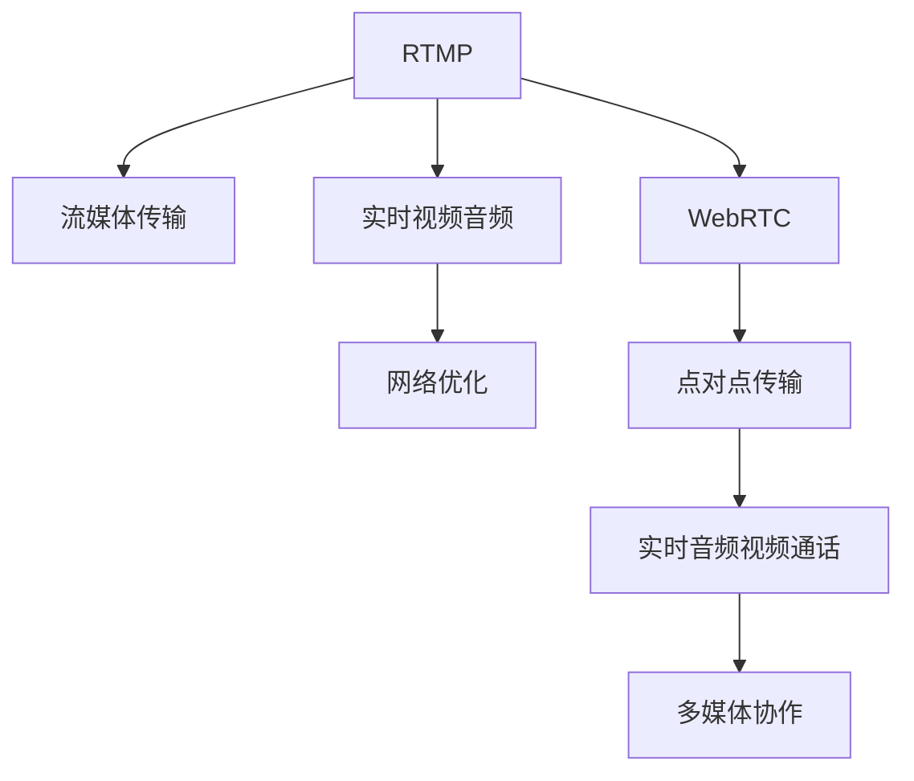

                 

# 实时流媒体协议：RTMP 和 WebRTC

> 关键词：流媒体, 实时通信, 视频会议, 音频视频, 低延时, 安全性, 网络优化

## 1. 背景介绍

### 1.1 问题由来
随着互联网技术的发展和普及，实时流媒体应用如在线视频、远程教育、实时游戏等迅速增长。这些应用对数据传输的时效性和稳定性要求极高，传统的HTTP协议在实时性上存在明显不足。因此，亟需一种能够支持高质量实时视频、音频传输的协议。

### 1.2 问题核心关键点
为了解决实时流媒体传输的需求，出现了两种主流协议：RTMP（Real-Time Messaging Protocol）和WebRTC（Web Real-Time Communication）。RTMP起源于Adobe Flash，广泛应用于传统直播平台和视频点播服务，而WebRTC则是基于Web标准开发，旨在简化和增强实时音频视频通话和多媒体协作功能。

本博客将详细介绍RTMP和WebRTC的核心原理和实现细节，并比较两者的优劣和适用场景，帮助读者深入理解这两种实时流媒体协议。

## 2. 核心概念与联系

### 2.1 核心概念概述

为了更好地理解RTMP和WebRTC的原理和联系，我们首先介绍几个核心概念：

- **RTMP**：Real-Time Messaging Protocol，是一种基于TCP的协议，专为流媒体传输设计，支持实时视频、音频、数据的传输。
- **WebRTC**：Web Real-Time Communication，基于Web标准，支持点对点（P2P）传输，简化实时音频视频通话和多媒体协作功能。
- **流媒体传输**：通过网络实时传输音视频数据，实现音视频同步。
- **网络优化**：通过网络算法和协议设计，优化音视频传输过程，提高传输质量和效率。

这些核心概念之间的逻辑关系可以通过以下Mermaid流程图来展示：



这个流程图展示了RTMP和WebRTC的核心概念及其之间的关系：

1. RTMP和WebRTC都是为流媒体传输而设计的协议。
2. RTMP支持实时视频音频的传输，而WebRTC则主要应用于点对点的音视频通话和多媒体协作。
3. 两者都需要进行网络优化，以提高传输质量和效率。

## 3. 核心算法原理 & 具体操作步骤
### 3.1 算法原理概述

RTMP和WebRTC的算法原理主要涉及以下几个方面：

- **流媒体编码**：将音视频数据编码为适合网络传输的格式。
- **网络传输协议**：通过协议封装音视频数据，并实现可靠传输。
- **实时通信技术**：支持实时音视频交互，包括音视频同步、网络抖动补偿等。
- **点对点传输**：简化音视频通话和多媒体协作的实现过程。

### 3.2 算法步骤详解

#### RTMP协议

RTMP协议的核心步骤如下：

1. **建立TCP连接**：客户端与服务器建立TCP连接，并进行握手。
2. **流数据编码**：客户端将音视频数据编码为AMF格式，并封装为RTMP报文。
3. **数据传输**：RTMP报文通过TCP连接传输至服务器。
4. **数据解码与播放**：服务器对RTMP报文进行解码，并将音视频数据播放给用户。
5. **控制命令**：客户端通过RTMP协议向服务器发送控制命令，实现直播互动等功能。

#### WebRTC协议

WebRTC协议的核心步骤如下：

1. **建立WebRTC连接**：客户端通过ICE协议进行连接，选择最佳的传输路径。
2. **数据编码**：音视频数据编码成WebRTC支持的格式，如VP8、VP9、H264等。
3. **数据传输**：WebRTC通过P2P方式传输音视频数据。
4. **数据解码与播放**：接收端对WebRTC数据包进行解码，并将音视频数据播放给用户。
5. **网络质量反馈**：通过SRTP传输控制协议，实时反馈网络质量，进行动态调整。

### 3.3 算法优缺点

#### RTMP协议

**优点**：
1. **支持多路复用**：一个TCP连接可以同时传输多个流，提高网络带宽利用率。
2. **视频编码效率高**：支持的编码格式丰富，支持高清视频传输。
3. **兼容性较好**：主流直播平台广泛支持RTMP协议。

**缺点**：
1. **安全性差**：基于TCP，存在网络延时和丢包的风险。
2. **跨平台支持较差**：主要应用于Flash插件，无法跨平台使用。
3. **成本高**：需部署独立的流媒体服务器，增加运维成本。

#### WebRTC协议

**优点**：
1. **安全性高**：基于SSL/TLS加密传输，保证数据安全。
2. **跨平台性好**：支持多种浏览器和操作系统，无需安装插件。
3. **低延时**：基于P2P，减少中间环节，提高传输效率。

**缺点**：
1. **编码复杂**：支持的编码格式相对较少，视频质量受限。
2. **技术难度高**：涉及ICE、STUN、SRTP等技术，实现难度较大。
3. **网络带宽要求高**：对网络带宽要求较高，不适合高并发场景。

### 3.4 算法应用领域

#### RTMP协议

RTMP协议广泛应用于以下领域：

1. **直播平台**：如爱奇艺、腾讯、优酷等，实现视频点播和直播功能。
2. **视频会议**：如Zoom、Skype等，提供音视频通话和会议功能。
3. **游戏直播**：如斗鱼、虎牙等，支持游戏直播和互动功能。

#### WebRTC协议

WebRTC协议主要应用于以下领域：

1. **实时视频通话**：如微信、Skype、Zoom等，实现实时音视频通话。
2. **多媒体协作**：如Google Meet、Microsoft Teams等，支持多人协同工作。
3. **桌面共享**：如TeamViewer、AnyDesk等，实现远程桌面控制。

## 4. 数学模型和公式 & 详细讲解 & 举例说明

### 4.1 数学模型构建

#### RTMP协议

RTMP协议的数学模型主要涉及音视频数据编码和网络传输两个方面。

1. **音视频编码**：使用H.264、VP8等编码标准，将音视频数据压缩为适合网络传输的格式。
2. **网络传输**：通过TCP连接传输数据，并进行流量控制和错误重传。

#### WebRTC协议

WebRTC协议的数学模型主要涉及网络传输和数据编码两个方面。

1. **网络传输**：通过ICE协议选择最佳的传输路径，通过SRTP协议进行加密传输。
2. **数据编码**：使用VP8、VP9、H264等编码标准，将音视频数据压缩为适合网络传输的格式。

### 4.2 公式推导过程

#### RTMP协议

RTMP协议的核心公式包括：

1. **音视频编码**：
   $$
   \text{压缩率} = \frac{\text{原始数据大小}}{\text{压缩后数据大小}}
   $$

2. **网络传输**：
   $$
   \text{传输速率} = \frac{\text{发送数据量}}{\text{传输时间}}
   $$

#### WebRTC协议

WebRTC协议的核心公式包括：

1. **网络传输**：
   $$
   \text{传输速率} = \frac{\text{发送数据量}}{\text{传输时间}}
   $$

2. **数据编码**：
   $$
   \text{编码效率} = \frac{\text{压缩后数据大小}}{\text{原始数据大小}}
   $$

### 4.3 案例分析与讲解

#### RTMP协议

RTMP协议的典型应用场景为视频直播。以爱奇艺平台为例，用户可以通过浏览器或客户端向服务器发送视频数据，服务器将数据封装成RTMP报文，并通过TCP连接传输至用户的浏览器或客户端。

#### WebRTC协议

WebRTC协议的典型应用场景为实时视频通话。以Zoom平台为例，用户可以通过浏览器发起视频通话请求，服务器通过ICE协议选择最佳的传输路径，并使用WebRTC协议进行音视频数据的传输和控制。

## 5. 项目实践：代码实例和详细解释说明

### 5.1 开发环境搭建

为了进行RTMP和WebRTC的开发实践，我们需要搭建以下开发环境：

1. **WebRTC环境**：安装WebRTC SDK，并配置好开发环境。
2. **RTMP环境**：安装RTMP SDK，并配置好开发环境。
3. **流媒体服务器**：搭建流媒体服务器，如NGINX等，用于处理音视频数据。

### 5.2 源代码详细实现

#### RTMP协议

RTMP协议的开发主要涉及以下几个方面：

1. **TCP连接建立**：使用Socket库建立TCP连接。
2. **音视频编码**：使用H.264、VP8等编码标准，将音视频数据压缩为适合网络传输的格式。
3. **RTMP报文封装**：将音视频数据封装成RTMP报文。
4. **RTMP数据传输**：通过TCP连接传输RTMP报文。

#### WebRTC协议

WebRTC协议的开发主要涉及以下几个方面：

1. **ICE连接**：使用ICE协议选择最佳的传输路径。
2. **数据编码**：使用VP8、VP9、H264等编码标准，将音视频数据压缩为适合网络传输的格式。
3. **WebRTC数据传输**：使用SRTP协议加密传输音视频数据。
4. **数据解码与播放**：对WebRTC数据包进行解码，并将音视频数据播放给用户。

### 5.3 代码解读与分析

#### RTMP协议

RTMP协议的代码实现主要涉及以下几个方面：

1. **TCP连接建立**：
   ```python
   import socket
   
   server_addr = ('localhost', 1935)
   server_socket = socket.socket(socket.AF_INET, socket.SOCK_STREAM)
   server_socket.bind(server_addr)
   server_socket.listen(5)
   ```

2. **音视频编码**：
   ```python
   import cv2
   
   video_capture = cv2.VideoCapture(0)
   fourcc = cv2.VideoWriter_fourcc(*'XVID')
   video_writer = cv2.VideoWriter('output.avi', fourcc, 30.0, (640, 480))
   
   while True:
       ret, frame = video_capture.read()
       if not ret:
           break
       video_writer.write(frame)
   video_writer.release()
   ```

3. **RTMP报文封装**：
   ```python
   AMFEncoder = encoders.AMF0Encoder()
   
   def on_connect(data):
       print('Connected')
   
   def on_audio(data):
       print('Audio packet received')
   
   def on_video(data):
       print('Video packet received')
   
   def on_publish(data):
       print('Publish packet received')
   
   data = {
       'audio': 0,
       'video': 0,
       'publish': 1
   }
   AMFEncoder.encode(data)
   ```

4. **RTMP数据传输**：
   ```python
   import threading
   
   def on_socket_close():
       server_socket.close()
   
   server_socket.accept()
   connection, addr = server_socket.accept()
   
   def read_data():
       while True:
           data = connection.recv(1024)
           print('Received data:', data)
   
   def write_data():
       while True:
           data = 'hello'
           connection.send(data)
   
   read_thread = threading.Thread(target=read_data)
   write_thread = threading.Thread(target=write_data)
   read_thread.start()
   write_thread.start()
   ```

#### WebRTC协议

WebRTC协议的代码实现主要涉及以下几个方面：

1. **ICE连接**：
   ```javascript
   var pc = new RTCPeerConnection();
   var iceServer = {
       urls: ['stun:stun.l.google.com', 'stun:stun1.google.com', 'stun:stun2.google.com', 'stun:stun3.google.com']
   };
   
   pc.onicecandidate = function(event) {
       var candidate = event.candidate;
       if (candidate) {
           ICE.connect({urls: iceServer.urls}, function() {
               console.log('ICE successfully connected');
           });
       }
   };
   ```

2. **数据编码**：
   ```javascript
   var video = document.getElementById('myVideo');
   var localStream = navigator.mediaDevices.getUserMedia({ video: true });
   localStream.getVideoTracks()[0].onended = function() {
       console.log('Local stream ended');
   };
   
   localStream.getVideoTracks()[0].onloadedmetadata = function(event) {
       console.log('Video metadata loaded');
   };
   
   localStream.getVideoTracks()[0].onplay = function(event) {
       console.log('Video played');
   };
   
   localStream.getVideoTracks()[0].onpause = function(event) {
       console.log('Video paused');
   };
   
   localStream.getVideoTracks()[0].onwaiting = function(event) {
       console.log('Video waiting');
   };
   
   localStream.getVideoTracks()[0].onstalled = function(event) {
       console.log('Video stalled');
   };
   
   localStream.getVideoTracks()[0].onended = function(event) {
       console.log('Video ended');
   };
   
   localStream.getVideoTracks()[0].onseeking = function(event) {
       console.log('Video seeking');
   };
   
   localStream.getVideoTracks()[0].onseeked = function(event) {
       console.log('Video seeking');
   };
   
   localStream.getVideoTracks()[0].onwaiting = function(event) {
       console.log('Video waiting');
   };
   
   localStream.getVideoTracks()[0].onerror = function(event) {
       console.log('Video error');
   };
   
   localStream.getVideoTracks()[0].onplaying = function(event) {
       console.log('Video playing');
   };
   ```

3. **WebRTC数据传输**：
   ```javascript
   pc.ontrack = function(event) {
       var track = event.streams[0].getVideoTracks()[0];
       var videoElement = document.getElementById('myVideo');
       track.attachMediaElement(videoElement);
   };
   
   pc.onicecandidate = function(event) {
       var candidate = event.candidate;
       if (candidate) {
           ICE.connect({urls: iceServer.urls}, function() {
               console.log('ICE successfully connected');
           });
       }
   };
   ```

### 5.4 运行结果展示

#### RTMP协议

RTMP协议的运行结果主要通过Socket库进行TCP连接和数据传输，将音视频数据封装成RTMP报文，并发送至服务器。服务器端接收RTMP报文，并进行解码和播放。

#### WebRTC协议

WebRTC协议的运行结果主要通过ICE协议进行网络连接和数据传输，将音视频数据封装成WebRTC数据包，并发送至接收端。接收端解码WebRTC数据包，并进行播放。

## 6. 实际应用场景

### 6.1 智能直播平台

智能直播平台如B站、抖音等，通过RTMP协议实现音视频数据的传输和直播互动功能，满足用户的高质量直播需求。

### 6.2 实时视频通话

实时视频通话如Skype、Zoom等，通过WebRTC协议实现点对点的音视频通话和多媒体协作功能，提高用户的使用体验。

### 6.3 游戏直播

游戏直播如斗鱼、虎牙等，通过RTMP协议实现游戏直播和互动功能，吸引用户参与游戏比赛。

### 6.4 未来应用展望

随着5G网络的普及和物联网设备的增加，实时流媒体应用将进一步扩展。未来，大带宽、低延时的网络环境将支持更高质量的音视频传输，提升用户体验。同时，实时流媒体协议将更加注重安全性和稳定性，满足不同场景的需求。

## 7. 工具和资源推荐

### 7.1 学习资源推荐

1. **《实时流媒体协议》系列博文**：详细讲解RTMP和WebRTC的原理和实现细节。
2. **《WebRTC实战》书籍**：全面介绍WebRTC的开发和应用，提供丰富的代码实例和实践经验。
3. **《RTMP协议详解》书籍**：深入解析RTMP协议的原理和应用场景，提供实用的开发指南。

### 7.2 开发工具推荐

1. **RTMP SDK**：支持RTMP协议的开发工具包，提供SDK和API接口。
2. **WebRTC SDK**：支持WebRTC协议的开发工具包，提供SDK和API接口。
3. **Socket库**：支持TCP/UDP协议的网络编程库，适用于RTMP协议的开发。

### 7.3 相关论文推荐

1. **《RTMP协议的改进与优化》**：介绍RTMP协议的改进和优化方法，提高传输效率和质量。
2. **《WebRTC的多路复用技术》**：探讨WebRTC的多路复用技术，提高网络带宽利用率。
3. **《WebRTC的跨浏览器兼容性》**：研究WebRTC的跨浏览器兼容性问题，提升跨平台支持能力。

## 8. 总结：未来发展趋势与挑战

### 8.1 研究成果总结

本文详细介绍了RTMP和WebRTC的核心原理和实现细节，比较了两者的优劣和适用场景。通过代码实例和分析，帮助读者深入理解这两种实时流媒体协议。

### 8.2 未来发展趋势

未来，实时流媒体协议将朝着更高的质量、更低的延时、更强的安全性和更广泛的适用性发展。

1. **高清晰度**：支持更高清晰度的音视频传输，提升用户体验。
2. **低延时**：通过网络优化和协议改进，进一步降低网络延时。
3. **安全性**：采用更先进的加密和认证技术，保障数据安全。
4. **跨平台性**：支持更多浏览器和操作系统，提升用户使用体验。

### 8.3 面临的挑战

实时流媒体协议的发展仍面临以下挑战：

1. **网络稳定性**：网络环境变化复杂，需要优化协议以提高稳定性。
2. **编码复杂性**：音视频编码格式多样，需要选择合适的编码标准。
3. **兼容性和可移植性**：跨浏览器、跨平台支持仍有挑战。

### 8.4 研究展望

未来，实时流媒体协议需要进一步优化和扩展，以应对日益增长的应用需求。

1. **实时流媒体协议的优化**：通过算法优化和协议改进，提升实时流媒体的性能和稳定性。
2. **多模态数据传输**：支持语音、文本等多模态数据的传输，提高用户使用体验。
3. **分布式流媒体系统**：通过分布式技术，实现流媒体的分布式传输和存储。

## 9. 附录：常见问题与解答

**Q1：RTMP和WebRTC协议的区别是什么？**

A: RTMP是基于TCP的协议，主要用于流媒体传输，支持多路复用和实时控制命令。WebRTC是基于Web标准开发的协议，主要用于点对点的音视频通话和多媒体协作，采用SSL/TLS加密传输，支持P2P传输和动态调整。

**Q2：如何选择适合的实时流媒体协议？**

A: 根据应用场景选择适合的协议：
1. **直播平台**：RTMP协议，支持多路复用和实时控制命令。
2. **实时视频通话**：WebRTC协议，支持点对点传输和SSL/TLS加密。
3. **游戏直播**：RTMP协议，支持游戏直播和互动功能。

**Q3：如何优化实时流媒体传输？**

A: 优化实时流媒体传输的方法包括：
1. **网络优化**：使用网络优化算法，减少网络抖动和丢包。
2. **编码优化**：选择合适的编码标准，提高音视频质量。
3. **流媒体服务器优化**：优化流媒体服务器的性能，提高传输效率。

**Q4：如何保证实时流媒体的安全性？**

A: 保证实时流媒体的安全性需要采用以下措施：
1. **加密传输**：使用SSL/TLS加密传输音视频数据。
2. **身份认证**：采用身份认证技术，保障用户身份安全。
3. **数据监控**：实时监控音视频数据，防止数据篡改和泄露。

**Q5：如何处理实时流媒体的跨平台兼容性？**

A: 处理实时流媒体的跨平台兼容性需要以下措施：
1. **浏览器兼容性**：选择支持的浏览器，进行兼容性测试。
2. **设备兼容性**：选择支持的设备，进行兼容性测试。
3. **协议兼容性**：选择支持的协议，进行兼容性测试。

本文通过系统介绍RTMP和WebRTC的核心原理和应用实践，帮助读者深入理解这两种实时流媒体协议，并为其实际应用提供指导。希望本文能为读者提供有价值的参考，推动实时流媒体技术的进一步发展。

