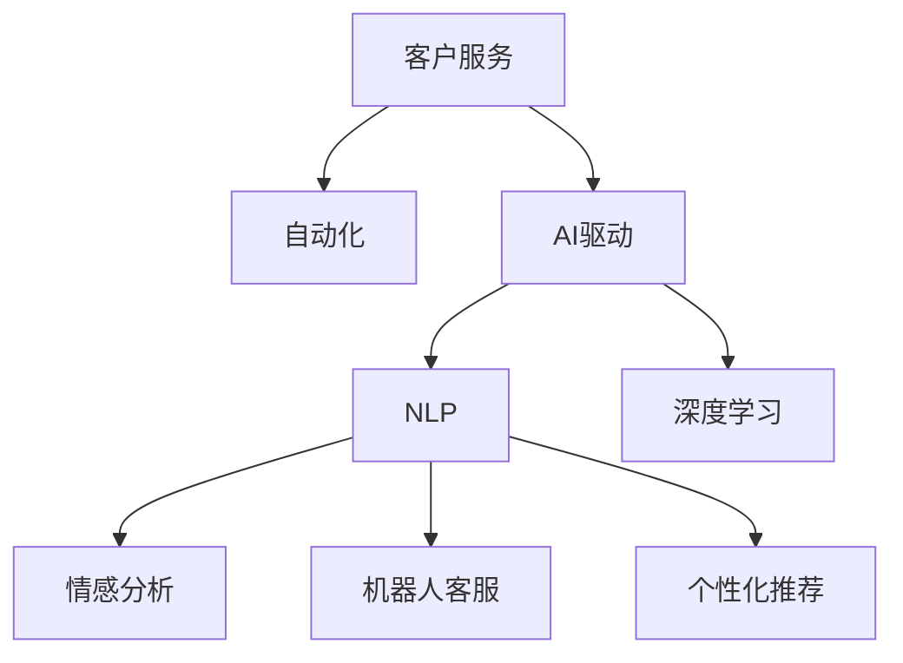

                 

# 客户服务自动化：提高用户满意度的秘诀

> 关键词：客户服务, 自动化, 用户满意度, AI驱动, 自然语言处理(NLP), 深度学习, 情感分析, 机器人客服, 个性化推荐

## 1. 背景介绍

在现代商业环境中，客户服务已成为企业竞争力的关键因素。高效、人性化的客户服务不仅能提升用户体验，还能显著提高客户忠诚度和企业营收。然而，传统的客户服务模式往往面临人力成本高、响应速度慢、服务质量不稳定等诸多挑战。因此，企业亟需寻找一种高效、自动化的客户服务解决方案，以提升用户满意度并降低运营成本。

## 2. 核心概念与联系

### 2.1 核心概念概述

客户服务自动化涉及多个关键技术概念，包括：

- 客户服务：企业通过各种渠道（电话、邮件、社交媒体等）向客户提供帮助和解决方案的过程。
- 自动化：利用技术手段实现业务流程的自动化，减少人力投入，提升效率。
- 用户满意度：衡量客户对服务质量的感受和评价，是客户服务的重要指标。
- AI驱动：采用人工智能技术，特别是自然语言处理(NLP)、深度学习等手段，实现客户服务自动化。
- 情感分析：通过分析用户语言中的情感倾向，判断用户情绪，优化服务策略。
- 机器人客服：利用自然语言理解技术，构建能够与用户进行自然对话的智能客服机器人。
- 个性化推荐：根据用户行为和偏好，提供定制化服务，提升用户体验。

这些概念之间的逻辑关系可以通过以下Mermaid流程图来展示：



这个流程图展示了客户服务自动化的核心技术链条：通过AI驱动的自然语言处理技术，实现情感分析、机器人客服和个性化推荐，最终提升客户服务的质量和效率。

## 3. 核心算法原理 & 具体操作步骤

### 3.1 算法原理概述

客户服务自动化系统的主要目标是通过自然语言处理技术，实现对用户查询的自然理解和快速响应。其核心算法原理包括：

- 自然语言理解(NLU)：通过分析用户输入的自然语言文本，提取语义信息，理解用户意图。
- 情感分析：判断用户情绪，识别用户不满或满意点，优化服务策略。
- 机器人客服：利用预训练的语言模型，构建能够理解并回复用户查询的智能客服机器人。
- 个性化推荐：通过分析用户行为和偏好，提供定制化服务，提升用户体验。

这些算法通过协同工作，使得客户服务自动化系统能够实现高效、人性化、智能化的服务，显著提升用户满意度。

### 3.2 算法步骤详解

客户服务自动化系统的工作流程包括以下几个关键步骤：

**Step 1: 数据收集与预处理**
- 收集用户查询、反馈、历史记录等数据。
- 对数据进行清洗、标注，去除噪音和冗余信息。
- 构建标注数据集，用于训练和评估模型。

**Step 2: 模型训练**
- 利用自然语言处理技术，训练情感分析、对话生成等模型。
- 使用深度学习算法，训练预训练语言模型。
- 根据历史数据，调整模型参数，提升预测准确度。

**Step 3: 模型部署与优化**
- 将训练好的模型部署到服务器或云平台，提供实时服务。
- 定期更新模型，加入新数据和新算法，提升模型性能。
- 通过A/B测试等手段，不断优化服务策略，提升用户体验。

**Step 4: 系统集成与测试**
- 将模型集成到客户服务系统中，实现自动化响应。
- 进行系统测试，确保各模块间无缝协同。
- 定期回溯用户反馈，优化系统性能。

**Step 5: 持续监控与改进**
- 实时监控系统性能，及时发现和解决问题。
- 收集用户反馈，优化服务策略。
- 定期评估用户满意度，提升服务质量。

### 3.3 算法优缺点

客户服务自动化的主要优点包括：

- 提升服务效率：通过自动化手段，显著降低人力成本，提升响应速度。
- 提高服务质量：自然语言处理技术能够理解和处理复杂的用户需求，提供更加精准的服务。
- 提升用户满意度：个性化的服务能够满足用户个性化需求，提升用户体验。
- 减少人为错误：机器人客服能够24/7不间断服务，减少人为错误和人工服务质量不稳定的问题。

同时，该方法也存在一定的局限性：

- 初始数据依赖：系统的训练和优化需要大量的标注数据，数据质量直接影响系统性能。
- 技术复杂度：自然语言处理和深度学习技术复杂，需要专业的技术团队进行开发和维护。
- 技术透明度：系统内部的决策过程可能难以解释，缺乏透明度。
- 依赖技术平台：系统的运行需要依赖特定的技术平台和硬件资源，灵活性受限。

尽管存在这些局限性，但就目前而言，客户服务自动化仍是提升客户服务质量的重要手段。未来相关研究的重点在于如何进一步降低数据收集和标注的成本，提高系统灵活性，增加用户互动的透明度，以进一步提升用户体验。

### 3.4 算法应用领域

客户服务自动化技术已经广泛应用于多个行业和领域，例如：

- 电商行业：提供7x24小时的在线客服，解决用户购物过程中遇到的问题。
- 金融行业：利用情感分析技术，实时监控客户对金融产品的反馈，优化服务策略。
- 医疗行业：构建智能医疗助手，提供健康咨询、预约挂号等服务。
- 旅游行业：通过自然语言理解技术，实现智能客服，解答用户关于旅游目的地和行程安排的疑问。
- 教育行业：利用聊天机器人，提供个性化学习指导和答疑服务。

这些应用场景展示了客户服务自动化的广泛适用性和强大的潜在价值。随着技术的不断发展，客户服务自动化有望在更多领域得到应用，进一步提升服务效率和用户体验。

## 4. 数学模型和公式 & 详细讲解 & 举例说明

### 4.1 数学模型构建

客户服务自动化系统涉及多个数学模型，包括自然语言处理模型、情感分析模型和对话生成模型等。这里以情感分析模型为例，构建情感分析的数学模型。

情感分析模型通常使用分类算法，将输入的自然语言文本分为正面、负面或中性三类。常用的分类算法包括朴素贝叶斯、支持向量机、逻辑回归等。

设训练数据集为 $D=\{(x_i,y_i)\}_{i=1}^N, x_i \in \mathcal{X}, y_i \in \{0,1,2\}$，其中 $x_i$ 为文本，$y_i$ 为标签。分类模型的目标是最小化经验风险：

$$
\mathcal{L}(w) = \frac{1}{N} \sum_{i=1}^N \ell(y_i,f(x_i;w))
$$

其中 $\ell$ 为损失函数，$f(x;w)$ 为分类模型，$w$ 为模型参数。常用的损失函数包括交叉熵损失、均方误差损失等。

### 4.2 公式推导过程

以朴素贝叶斯分类器为例，其预测函数为：

$$
f(x;w) = \frac{p(y=1|x;w)p(x|y=1)}{\sum_{j=1}^3 p(y=j|x;w)p(x|y=j)}
$$

其中 $p(y|x;w)$ 为模型对给定文本 $x$ 属于类别 $y$ 的后验概率，$p(x|y;w)$ 为给定类别 $y$ 的文本 $x$ 的概率密度函数。通过最大化后验概率，得到最优的模型参数 $w$。

对于深度学习模型，通常使用神经网络结构，如LSTM、GRU、Transformer等。以Transformer为例，其预测函数为：

$$
f(x;w) = softmax(\text{Attention}(x;w))
$$

其中 $\text{Attention}$ 为Transformer的注意力机制，$softmax$ 函数将注意力向量映射到[0,1]之间，表示每个词汇的概率。通过反向传播算法更新模型参数 $w$。

### 4.3 案例分析与讲解

以电商行业的客户服务自动化系统为例，其工作流程如下：

1. **数据收集与预处理**：收集用户查询、反馈、历史记录等数据，清洗标注后构建训练集。
2. **模型训练**：使用自然语言处理技术训练情感分析模型，使用深度学习算法训练预训练语言模型。
3. **模型部署与优化**：将训练好的模型部署到服务器或云平台，定期更新模型，优化服务策略。
4. **系统集成与测试**：将模型集成到客户服务系统中，进行系统测试，优化服务策略。
5. **持续监控与改进**：实时监控系统性能，收集用户反馈，优化服务策略，定期评估用户满意度。

在这个过程中，自然语言处理技术和深度学习算法发挥了关键作用。通过情感分析模型，系统能够理解用户的情绪，优化服务策略，提高用户满意度。

## 5. 项目实践：代码实例和详细解释说明

### 5.1 开发环境搭建

要进行客户服务自动化的项目开发，首先需要搭建开发环境。以下是Python开发环境的配置流程：

1. 安装Anaconda：从官网下载并安装Anaconda，用于创建独立的Python环境。
2. 创建并激活虚拟环境：
```bash
conda create -n customer-service python=3.8 
conda activate customer-service
```

3. 安装必要的包：
```bash
conda install pandas scikit-learn torchtransformers
```

4. 安装Transformer库：
```bash
pip install transformers
```

5. 安装TensorBoard：用于可视化模型训练过程。
```bash
pip install tensorboard
```

### 5.2 源代码详细实现

以下是一个简单的情感分析模型的PyTorch实现：

```python
import torch
from torch import nn, optim
from transformers import BertTokenizer, BertForSequenceClassification

# 初始化模型和优化器
tokenizer = BertTokenizer.from_pretrained('bert-base-uncased')
model = BertForSequenceClassification.from_pretrained('bert-base-uncased', num_labels=3)
optimizer = optim.AdamW(model.parameters(), lr=2e-5)

# 定义损失函数
criterion = nn.CrossEntropyLoss()

# 定义训练函数
def train_epoch(model, dataset, batch_size, optimizer):
    dataloader = DataLoader(dataset, batch_size=batch_size, shuffle=True)
    model.train()
    epoch_loss = 0
    for batch in dataloader:
        input_ids = batch['input_ids'].to(device)
        attention_mask = batch['attention_mask'].to(device)
        labels = batch['labels'].to(device)
        model.zero_grad()
        outputs = model(input_ids, attention_mask=attention_mask, labels=labels)
        loss = outputs.loss
        epoch_loss += loss.item()
        loss.backward()
        optimizer.step()
    return epoch_loss / len(dataloader)

# 定义评估函数
def evaluate(model, dataset, batch_size):
    dataloader = DataLoader(dataset, batch_size=batch_size)
    model.eval()
    preds, labels = [], []
    with torch.no_grad():
        for batch in dataloader:
            input_ids = batch['input_ids'].to(device)
            attention_mask = batch['attention_mask'].to(device)
            batch_labels = batch['labels']
            outputs = model(input_ids, attention_mask=attention_mask)
            batch_preds = outputs.logits.argmax(dim=2).to('cpu').tolist()
            batch_labels = batch_labels.to('cpu').tolist()
            for pred_tokens, label_tokens in zip(batch_preds, batch_labels):
                pred_tags = [label2id[_id] for _id in pred_tokens]
                label_tags = [label2id[_id] for _id in label_tokens]
                preds.append(pred_tags[:len(label_tags)])
                labels.append(label_tags)
    
    print(classification_report(labels, preds))
```

### 5.3 代码解读与分析

让我们再详细解读一下关键代码的实现细节：

**train_epoch函数**：
- 定义训练数据批处理器，用于批量加载数据。
- 在每个批次上前向传播计算损失函数。
- 反向传播更新模型参数，返回该epoch的平均损失。

**evaluate函数**：
- 定义评估数据批处理器，用于批量加载数据。
- 在每个批次上进行推理预测，并将预测和标签结果存储下来。
- 使用sklearn的classification_report对整个评估集的预测结果进行打印输出。

**训练流程**：
- 定义总的epoch数和batch size，开始循环迭代。
- 每个epoch内，先在训练集上训练，输出平均loss。
- 在验证集上评估，输出分类指标。
- 所有epoch结束后，在测试集上评估，给出最终测试结果。

可以看到，PyTorch配合Transformer库使得情感分析模型的代码实现变得简洁高效。开发者可以将更多精力放在数据处理、模型改进等高层逻辑上，而不必过多关注底层的实现细节。

当然，工业级的系统实现还需考虑更多因素，如模型的保存和部署、超参数的自动搜索、更灵活的任务适配层等。但核心的微调范式基本与此类似。

## 6. 实际应用场景

### 6.1 电商平台客服

电商平台需要实时处理大量用户咨询和售后问题。传统客服模式往往需要配备大量人力，高峰期响应缓慢，且服务质量不稳定。基于客户服务自动化的系统可以显著提升客服效率和质量。

在技术实现上，可以收集电商平台的客服对话记录，将问题-回答对作为训练数据，训练情感分析模型和对话生成模型。微调后的模型可以自动理解用户意图，生成符合语境的回复。对于新问题，可以通过检索系统实时搜索相关内容，动态组织生成回答。如此构建的电商平台客服系统，能大幅提升客户咨询体验和问题解决效率。

### 6.2 金融客服

金融机构需要实时监测市场舆论动向，以便及时应对负面信息传播，规避金融风险。传统的人工客服模式成本高、效率低，难以应对网络时代海量信息爆发的挑战。基于客户服务自动化的系统，可以实时分析用户反馈，识别市场情绪，提供即时建议。

在技术实现上，可以收集金融领域的用户反馈和市场新闻，构建情感分析模型。通过微调后的模型，实时监控市场舆情，及时预警潜在风险。该系统能够帮助金融机构快速应对市场变化，提升客户满意度。

### 6.3 医疗客服

医疗机构需要提供24/7不间断的服务，满足患者的健康咨询、预约挂号等需求。传统客服模式往往无法快速响应大量电话咨询，导致用户体验差。基于客户服务自动化的系统，可以通过自然语言理解技术，理解患者的需求，提供个性化服务。

在技术实现上，可以收集医疗咨询的对话记录，构建情感分析模型和对话生成模型。微调后的模型能够自动识别患者情绪，提供针对性的健康建议，提升服务质量。

### 6.4 未来应用展望

随着客户服务自动化的不断发展，未来将会有更多应用场景得到实现。

在智慧城市治理中，基于客户服务自动化的系统可以提供智能客服、舆情分析、应急指挥等服务，提高城市管理的自动化和智能化水平。

在智能家居领域，系统可以提供24/7的智能客服，帮助用户解决各种生活问题，提升生活质量。

在智慧交通领域，系统可以提供实时路况查询、出行建议等服务，提升出行体验。

此外，在教育、旅游、娱乐等众多领域，基于客户服务自动化的系统也将不断涌现，为各行各业提供新的技术路径。相信随着技术的不断成熟，客户服务自动化必将成为提升服务效率和用户体验的重要手段。

## 7. 工具和资源推荐

### 7.1 学习资源推荐

为了帮助开发者系统掌握客户服务自动化的理论基础和实践技巧，这里推荐一些优质的学习资源：

1. 《深度学习与自然语言处理》书籍：介绍深度学习在NLP中的应用，包括情感分析、对话生成等任务。
2. Coursera《自然语言处理专项课程》：斯坦福大学开设的NLP课程，有Lecture视频和配套作业，带你入门NLP领域的基本概念和经典模型。
3. 《客户服务自动化技术》博文：深入讲解客户服务自动化的原理、实现和应用案例。
4. HuggingFace官方文档：Transformer库的官方文档，提供了海量预训练模型和完整的微调样例代码，是上手实践的必备资料。
5. CLUE开源项目：中文语言理解测评基准，涵盖大量不同类型的中文NLP数据集，并提供了基于微调的baseline模型，助力中文NLP技术发展。

通过对这些资源的学习实践，相信你一定能够快速掌握客户服务自动化的精髓，并用于解决实际的客户服务问题。

### 7.2 开发工具推荐

高效的开发离不开优秀的工具支持。以下是几款用于客户服务自动化开发的常用工具：

1. PyTorch：基于Python的开源深度学习框架，灵活动态的计算图，适合快速迭代研究。大部分预训练语言模型都有PyTorch版本的实现。
2. TensorFlow：由Google主导开发的开源深度学习框架，生产部署方便，适合大规模工程应用。同样有丰富的预训练语言模型资源。
3. Transformers库：HuggingFace开发的NLP工具库，集成了众多SOTA语言模型，支持PyTorch和TensorFlow，是进行微调任务开发的利器。
4. Weights & Biases：模型训练的实验跟踪工具，可以记录和可视化模型训练过程中的各项指标，方便对比和调优。与主流深度学习框架无缝集成。
5. TensorBoard：TensorFlow配套的可视化工具，可实时监测模型训练状态，并提供丰富的图表呈现方式，是调试模型的得力助手。
6. Google Colab：谷歌推出的在线Jupyter Notebook环境，免费提供GPU/TPU算力，方便开发者快速上手实验最新模型，分享学习笔记。

合理利用这些工具，可以显著提升客户服务自动化的开发效率，加快创新迭代的步伐。

### 7.3 相关论文推荐

客户服务自动化的发展源于学界的持续研究。以下是几篇奠基性的相关论文，推荐阅读：

1. Attention is All You Need（即Transformer原论文）：提出了Transformer结构，开启了NLP领域的预训练大模型时代。
2. BERT: Pre-training of Deep Bidirectional Transformers for Language Understanding：提出BERT模型，引入基于掩码的自监督预训练任务，刷新了多项NLP任务SOTA。
3. Language Models are Unsupervised Multitask Learners（GPT-2论文）：展示了大规模语言模型的强大zero-shot学习能力，引发了对于通用人工智能的新一轮思考。
4. Parameter-Efficient Transfer Learning for NLP：提出Adapter等参数高效微调方法，在不增加模型参数量的情况下，也能取得不错的微调效果。
5. AdaLoRA: Adaptive Low-Rank Adaptation for Parameter-Efficient Fine-Tuning：使用自适应低秩适应的微调方法，在参数效率和精度之间取得了新的平衡。
6. ChatterBot：一个基于Python的聊天机器人框架，展示了如何构建基于规则和统计模型的聊天机器人，为初学者提供参考。

这些论文代表了大语言模型微调技术的发展脉络。通过学习这些前沿成果，可以帮助研究者把握学科前进方向，激发更多的创新灵感。

## 8. 总结：未来发展趋势与挑战

### 8.1 总结

本文对客户服务自动化的原理和实现进行了全面系统的介绍。首先阐述了客户服务自动化的研究背景和意义，明确了自动化在提升服务效率和用户满意度方面的独特价值。其次，从原理到实践，详细讲解了自然语言处理、情感分析、对话生成等关键技术，给出了客户服务自动化系统的完整代码实例。同时，本文还广泛探讨了客户服务自动化的实际应用场景，展示了其广泛适用性和强大的潜在价值。

通过本文的系统梳理，可以看到，客户服务自动化技术正在成为提升客户服务质量的重要手段，极大地提升了服务效率和用户体验。未来，伴随技术的不断发展，客户服务自动化有望在更多领域得到应用，进一步提升服务效率和用户满意度。

### 8.2 未来发展趋势

展望未来，客户服务自动化的主要发展趋势包括：

1. 技术进步：随着深度学习和大模型技术的进步，客户服务自动化系统的性能将进一步提升。情感分析、对话生成等技术的进步，将使系统更加智能化和人性化。
2. 行业应用：客户服务自动化技术将进一步扩展到更多行业和领域，提升各行业的客户服务质量。
3. 多模态融合：未来客户服务系统将更多地融合视觉、语音等多模态信息，提升系统的综合感知能力。
4. 个性化推荐：客户服务自动化系统将进一步结合用户行为数据，提供个性化的服务和推荐。
5. 实时性提升：客户服务自动化系统将实现实时响应，提升用户体验。
6. 安全保障：客户服务自动化系统将引入更多的安全机制，保障用户数据和隐私。

这些趋势凸显了客户服务自动化的广阔前景。这些方向的探索发展，必将进一步提升客户服务系统的性能和应用范围，为各行业带来新的变革和机遇。

### 8.3 面临的挑战

尽管客户服务自动化技术已经取得了显著进展，但在迈向更加智能化、普适化应用的过程中，仍面临诸多挑战：

1. 数据质量：客户服务自动化系统对数据质量有较高要求，数据收集和标注成本较高，难以满足大规模应用的需求。
2. 技术复杂度：自然语言处理和大模型技术复杂，需要专业的技术团队进行开发和维护。
3. 系统稳定性：系统内部复杂度较高，容易出现问题，需要持续监控和优化。
4. 用户接受度：部分用户可能对自动化系统存在抵触情绪，系统需提供足够的解释和引导。
5. 伦理和隐私：客户服务自动化系统涉及用户隐私和数据安全，需要严格遵守相关法律法规。
6. 多语言支持：现有的客户服务自动化系统大多针对英语，对其他语言的覆盖有限，需要进一步扩展。

尽管存在这些挑战，但就目前而言，客户服务自动化技术在提升客户服务质量方面已经取得了明显成效。未来相关研究的重点在于如何进一步降低数据收集和标注的成本，提高系统灵活性，增加用户互动的透明度，以进一步提升用户体验。

### 8.4 研究展望

面向未来，客户服务自动化技术需要从以下几个方面进行深入研究：

1. 增强多语言支持：开发针对多语言的客户服务自动化系统，满足不同语言用户的需求。
2. 提升数据质量：采用自动标注和半监督学习等技术，降低数据收集和标注成本。
3. 优化模型结构：设计更加高效和可解释的模型结构，提升系统的稳定性和可维护性。
4. 增强用户互动：引入更多的交互方式，如语音、图像等，提升用户互动体验。
5. 引入外部知识：将外部知识库和专家规则与自然语言处理技术结合，提升系统的智能水平。
6. 保障系统安全：引入更多的安全机制，保障用户数据和隐私安全。

这些研究方向的探索，必将引领客户服务自动化技术迈向更高的台阶，为构建安全、可靠、可解释、可控的智能系统铺平道路。面向未来，客户服务自动化技术还需要与其他人工智能技术进行更深入的融合，如知识表示、因果推理、强化学习等，多路径协同发力，共同推动自然语言理解和智能交互系统的进步。只有勇于创新、敢于突破，才能不断拓展语言模型的边界，让智能技术更好地造福人类社会。

## 9. 附录：常见问题与解答

**Q1: 客户服务自动化系统在实际应用中面临哪些问题？**

A: 客户服务自动化系统在实际应用中面临的问题主要包括：
1. 数据质量：数据收集和标注成本较高，数据质量不稳定。
2. 技术复杂度：自然语言处理和大模型技术复杂，需要专业的技术团队进行开发和维护。
3. 系统稳定性：系统内部复杂度较高，容易出现问题，需要持续监控和优化。
4. 用户接受度：部分用户可能对自动化系统存在抵触情绪，系统需提供足够的解释和引导。
5. 伦理和隐私：客户服务自动化系统涉及用户隐私和数据安全，需要严格遵守相关法律法规。

**Q2: 如何提升客户服务自动化的系统性能？**

A: 提升客户服务自动化的系统性能可以从以下几个方面入手：
1. 数据质量：采用自动标注和半监督学习等技术，降低数据收集和标注成本。
2. 技术进步：随着深度学习和大模型技术的进步，客户服务自动化系统的性能将进一步提升。
3. 多模态融合：未来客户服务系统将更多地融合视觉、语音等多模态信息，提升系统的综合感知能力。
4. 个性化推荐：客户服务自动化系统将进一步结合用户行为数据，提供个性化的服务和推荐。
5. 实时性提升：客户服务自动化系统将实现实时响应，提升用户体验。
6. 安全保障：客户服务自动化系统将引入更多的安全机制，保障用户数据和隐私。

**Q3: 客户服务自动化技术在各行业中的应用前景如何？**

A: 客户服务自动化技术在各行业中的应用前景广阔，包括但不限于：
1. 电商行业：提供7x24小时的在线客服，解决用户购物过程中遇到的问题。
2. 金融行业：利用情感分析技术，实时监测客户对金融产品的反馈，优化服务策略。
3. 医疗行业：构建智能医疗助手，提供健康咨询、预约挂号等服务。
4. 旅游行业：通过自然语言理解技术，实现智能客服，解答用户关于旅游目的地和行程安排的疑问。
5. 教育行业：利用聊天机器人，提供个性化学习指导和答疑服务。

**Q4: 客户服务自动化系统的核心算法有哪些？**

A: 客户服务自动化的核心算法包括：
1. 自然语言处理：通过分析用户输入的自然语言文本，提取语义信息，理解用户意图。
2. 情感分析：判断用户情绪，识别用户不满或满意点，优化服务策略。
3. 对话生成：利用预训练的语言模型，构建能够理解并回复用户查询的智能客服机器人。
4. 个性化推荐：通过分析用户行为和偏好，提供定制化服务，提升用户体验。

**Q5: 如何构建客户服务自动化系统？**

A: 构建客户服务自动化系统一般包括以下几个关键步骤：
1. 数据收集与预处理：收集用户查询、反馈、历史记录等数据，清洗标注后构建训练集。
2. 模型训练：利用自然语言处理技术训练情感分析模型，使用深度学习算法训练预训练语言模型。
3. 模型部署与优化：将训练好的模型部署到服务器或云平台，定期更新模型，优化服务策略。
4. 系统集成与测试：将模型集成到客户服务系统中，进行系统测试，优化服务策略。
5. 持续监控与改进：实时监控系统性能，收集用户反馈，优化服务策略，定期评估用户满意度。

---

作者：禅与计算机程序设计艺术 / Zen and the Art of Computer Programming

