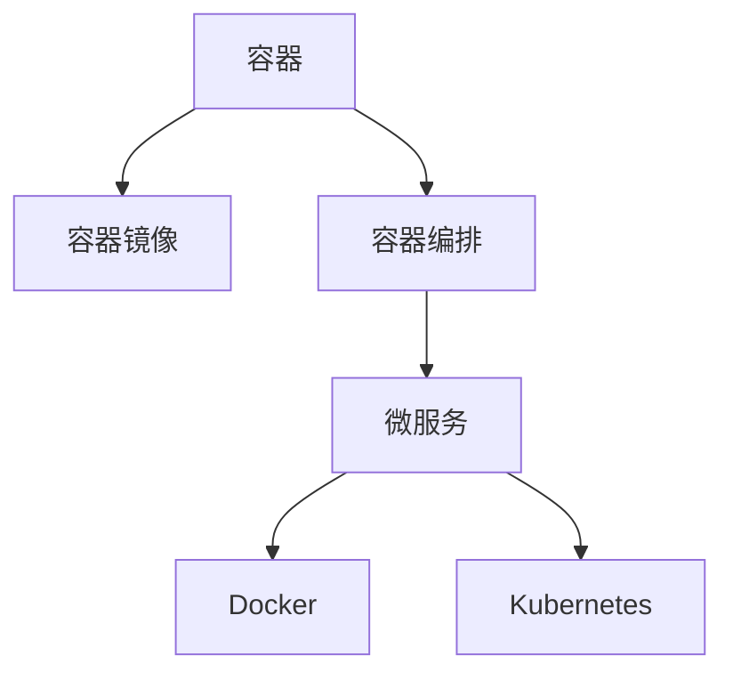

                 

# 容器化微服务：简化部署和扩展

## 1. 背景介绍

随着微服务架构的兴起，越来越多的应用程序被设计成多个独立的服务单元，这些服务各自独立运行，彼此解耦。这不仅提高了系统的可维护性和可扩展性，也使得应用开发更加灵活。然而，随着微服务数量的增加，系统复杂度也随之上升，部署和扩展的挑战日益凸显。

容器技术作为微服务架构的重要支撑，通过将应用程序打包到容器中，实现了跨平台、快速部署和运行，极大地简化了微服务的部署和扩展。本文将深入探讨容器化微服务的核心概念与技术原理，分析其优缺点，并展望未来发展趋势。

## 2. 核心概念与联系

### 2.1 核心概念概述

为更好地理解容器化微服务，本节将介绍几个核心概念：

- 容器：一种轻量级的、可移植的、可隔离的执行环境。应用程序和其依赖项打包在容器镜像中，可以在任何支持容器运行的环境中部署。
- 容器镜像：容器运行的基础镜像，包含应用程序及其所有依赖项的打包。
- 容器编排：通过编排工具管理多个容器实例的启动、停止、扩展和监控，确保系统稳定运行。
- 微服务：将大型应用程序拆分成多个独立的服务单元，每个服务独立运行、松耦合、高内聚。
- Docker、Kubernetes：是容器化微服务的典型代表，前者提供容器运行环境，后者负责容器编排和调度。

这些核心概念之间的逻辑关系可以通过以下Mermaid流程图来展示：



这个流程图展示出容器化微服务的整体架构：

1. 容器将应用程序和其依赖项打包在镜像中。
2. 容器编排工具负责调度和管理容器实例的启动、停止和扩展。
3. 微服务架构将应用程序拆分为独立的服务单元，易于开发和维护。
4. Docker和Kubernetes是容器化微服务的两个关键技术，前者提供容器运行环境，后者负责容器编排和调度。

### 2.2 核心概念原理和架构

容器化微服务的核心原理是通过容器技术将微服务打包并隔离运行，实现系统的高可维护性、高可扩展性和高可移植性。

容器技术通过虚拟化技术在主机上创建多个独立的执行环境，每个容器拥有自己的内核、网络和文件系统，相互之间独立运行，互不影响。这种隔离机制使得每个微服务实例可以独立部署、更新和扩展，避免了一个微服务故障影响整个系统。

容器镜像作为容器的运行基础，包含应用程序及其所有依赖项。通过构建一致的容器镜像，可以确保各个微服务实例的运行环境一致，避免环境差异导致的运行问题。此外，容器镜像的打包和分发机制，使得容器可以跨平台部署，大大简化了应用的发布和运维。

容器编排工具如Docker、Kubernetes，通过自动化调度和管理容器实例，实现了微服务的自动化部署、负载均衡、资源监控和扩展。容器编排工具通过定义服务依赖关系和资源限制，确保了微服务实例的稳定运行，同时也提供了强大的扩展和监控功能，使得系统具备更高的弹性和可靠性。

## 3. 核心算法原理 & 具体操作步骤

### 3.1 算法原理概述

容器化微服务的核心算法原理在于通过容器技术实现微服务的隔离运行和自动管理。具体步骤如下：

1. 将应用程序和其依赖项打包为容器镜像。
2. 创建容器运行环境，启动容器镜像。
3. 通过容器编排工具定义和调度容器实例。
4. 监控容器实例的运行状态，及时处理故障和扩展。

### 3.2 算法步骤详解

#### 步骤1：容器化应用

容器化应用是将应用程序和其依赖项打包为容器镜像的过程。具体步骤如下：

1. 编写Dockerfile文件，定义容器镜像的构建过程。Dockerfile是一个文本文件，包含构建容器镜像的各个步骤。
2. 运行Docker build命令，根据Dockerfile文件构建容器镜像。
3. 使用Docker push命令，将构建好的容器镜像推送到Docker Hub等容器镜像仓库。

#### 步骤2：容器编排

容器编排是启动、管理和扩展容器实例的过程。具体步骤如下：

1. 使用Kubernetes Deployment资源，定义容器的启动参数、副本数量和健康检查策略。
2. 使用Kubernetes Service资源，将容器暴露给外部网络，使其可以通过网络访问。
3. 使用Kubernetes Horizontal Pod Autoscaler资源，根据系统负载自动扩展容器的副本数量。
4. 使用Kubernetes Service Mesh，实现容器之间的服务发现、负载均衡和故障恢复。

#### 步骤3：容器监控和故障处理

容器监控和故障处理是确保容器实例稳定运行的过程。具体步骤如下：

1. 使用Prometheus等容器监控工具，实时监控容器实例的运行状态和资源使用情况。
2. 使用ELK Stack等日志管理工具，收集和分析容器实例的日志信息。
3. 使用Grafana等可视化工具，展示监控数据和告警信息。
4. 使用Kubernetes内置的liveness和readiness探针，检测容器的运行状态，及时处理故障。

### 3.3 算法优缺点

容器化微服务具有以下优点：

1. 高可维护性：微服务独立部署、独立运行，便于维护和更新。
2. 高可扩展性：容器编排工具可以自动扩展容器实例，应对负载变化。
3. 高可移植性：容器镜像可以在任何支持容器运行的环境中部署，实现跨平台部署。
4. 高可靠性：容器的隔离机制和监控工具可以保证系统的稳定性和可靠性。

同时，容器化微服务也存在以下缺点：

1. 复杂性：容器化微服务架构需要更多的组件和配置，增加了系统的复杂度。
2. 性能开销：容器运行环境的开销可能影响系统的性能。
3. 学习成本：容器编排工具和容器技术需要一定的学习成本。
4. 资源消耗：容器编排和监控工具需要额外的资源开销。

尽管如此，容器化微服务仍然是目前主流的微服务架构之一，广泛应用于企业级应用和高性能系统的开发和部署。

### 3.4 算法应用领域

容器化微服务在以下领域得到了广泛应用：

1. 企业级应用：大型企业级应用如电商平台、金融系统、政府网站等，采用微服务架构简化开发和维护。
2. 高可用系统：实时系统如在线游戏、视频直播等，需要高可用和高可靠性的架构。
3. 大数据系统：大数据处理系统如Hadoop、Spark等，需要分布式和可扩展的架构。
4. 移动应用：移动互联网应用如社交网络、在线教育等，需要高并发和高可用的架构。
5. IoT系统：物联网系统如智能家居、智能工厂等，需要低延迟和高可靠性的架构。

## 4. 数学模型和公式 & 详细讲解 & 举例说明

### 4.1 数学模型构建

容器化微服务的数学模型主要涉及容器的调度、监控和扩展等方面。这里以Kubernetes的资源调度为例，定义一个简单的数学模型。

假设系统中有N个容器实例，每个实例的CPU和内存资源分别为$c_i$和$m_i$。系统的总CPU和内存资源分别为$C$和$M$。容器的调度目标是最大化容器的运行数量，同时满足系统资源的限制。

设$f_i$为容器$i$的调度得分，则容器的调度目标函数为：

$$
\max \sum_{i=1}^{N} f_i
$$

其中$f_i$的计算方式可以根据具体的调度算法和优化目标来定义。例如，可以使用CPU和内存的利用率、容器的运行时间等指标来计算得分。

容器的调度约束条件为：

$$
\sum_{i=1}^{N} c_i \leq C
$$

$$
\sum_{i=1}^{N} m_i \leq M
$$

其中$c_i$和$m_i$为容器$i$的CPU和内存资源需求，$C$和$M$为系统的总CPU和内存资源。

### 4.2 公式推导过程

以上数学模型可以转化为一个线性规划问题，通过求解线性规划问题，可以得出最优的容器调度方案。具体步骤如下：

1. 将容器的调度得分转化为决策变量$x_i$，即$x_i=1$表示容器$i$被调度，$x_i=0$表示容器$i$未被调度。
2. 将容器的CPU和内存资源需求转化为线性约束条件：$\sum_{i=1}^{N} c_i x_i \leq C$，$\sum_{i=1}^{N} m_i x_i \leq M$。
3. 将容器的调度得分转化为线性目标函数：$\max \sum_{i=1}^{N} f_i x_i$。
4. 求解线性规划问题，得出最优的决策变量$x_i$。

### 4.3 案例分析与讲解

以一个简单的电商应用为例，分析容器化微服务的实际应用场景。

假设该电商应用包含商品搜索、购物车、订单处理等多个微服务。每个微服务的容器镜像大小为200MB，CPU需求为1核，内存需求为2GB。系统的总CPU和内存资源分别为16核和32GB。

使用Kubernetes的Deployment和Horizontal Pod Autoscaler资源，实现容器的自动扩展和负载均衡。定义容器的健康检查策略，使用liveness探针检测容器的运行状态，使用readiness探针检测容器的可用状态。使用Prometheus和Grafana进行容器实例的监控和告警。

通过容器编排和监控工具的协同工作，可以实现系统的自动化部署、负载均衡、扩展和故障恢复。在实际应用中，可以根据系统负载实时调整容器实例的数量，确保系统的稳定性和可靠性。

## 5. 项目实践：代码实例和详细解释说明

### 5.1 开发环境搭建

在开始容器化微服务的实践之前，需要搭建好开发环境。以下是使用Docker和Kubernetes搭建开发环境的步骤：

1. 安装Docker：从官网下载并安装Docker，安装过程中需要设置Docker的镜像仓库。
2. 安装Kubernetes：可以从官网下载Kubernetes的安装包，或使用Minikube在本地搭建Kubernetes集群。
3. 安装Helm：Helm是一个Kubernetes的包管理器，可以方便地管理和部署Kubernetes应用。

安装完成后，可以使用Docker和Kubernetes进行微服务的开发和部署。

### 5.2 源代码详细实现

以下是一个简单的电商应用的微服务示例，包含商品搜索和购物车两个微服务。

#### 5.2.1 商品搜索微服务

商品搜索微服务的Dockerfile文件如下：

```Dockerfile
# 基础镜像
FROM nginx:alpine

# 添加应用文件
COPY --from=java:11-slim /usr/share/nginx/html /usr/share/nginx/html

# 暴露端口
EXPOSE 80

# 启动命令
CMD ["nginx", "-g", "daemon off;"]
```

使用Docker build命令构建容器镜像，并使用Docker push命令将镜像推送到Docker Hub。

#### 5.2.2 购物车微服务

购物车微服务的Dockerfile文件如下：

```Dockerfile
# 基础镜像
FROM openjdk:11

# 添加应用文件
COPY . /app

# 暴露端口
EXPOSE 8080

# 启动命令
CMD ["java", "-jar", "app.jar"]
```

使用Docker build命令构建容器镜像，并使用Docker push命令将镜像推送到Docker Hub。

### 5.3 代码解读与分析

以下是容器编排的配置文件示例：

```yaml
apiVersion: v1
kind: Deployment
metadata:
  name: product-search
spec:
  replicas: 3
  selector:
    matchLabels:
      app: product-search
  template:
    metadata:
      labels:
        app: product-search
    spec:
      containers:
      - name: product-search
        image: dockerhub.com/your-username/product-search
        ports:
        - containerPort: 80
        resources:
          requests:
            cpu: 1
            memory: 2G
```

在配置文件中，定义了Deployment资源的名称、副本数量、选择器和Pod模板。Pod模板指定了容器镜像、端口、CPU和内存资源请求。

使用Kubectl部署Deployment资源：

```bash
kubectl apply -f product-search.yaml
```

### 5.4 运行结果展示

部署完成后，可以使用Kubectl获取Deployment资源的运行状态：

```bash
kubectl get pods
```

观察Deployment资源的运行状态，确认容器实例已经启动并正常运行。

## 6. 实际应用场景

### 6.1 智能客服系统

智能客服系统通常需要处理大量的客户咨询请求，具有高并发和实时性要求。通过容器化微服务架构，可以实现智能客服系统的快速部署和扩展。

在智能客服系统中，将客户咨询请求处理、知识库检索、自然语言理解等多个微服务分别打包为容器镜像，并通过Kubernetes实现自动扩展和负载均衡。微服务之间的调用通过API网关进行路由和限流，确保系统的稳定性和可靠性。

通过容器化微服务，智能客服系统可以轻松应对客户咨询的高峰期，提供7x24小时不间断服务。同时，可以根据客户咨询量实时调整容器实例的数量，确保系统的资源利用率最大化。

### 6.2 金融交易系统

金融交易系统需要处理大量的交易数据和实时计算，具有高并发和低延迟要求。通过容器化微服务架构，可以实现金融交易系统的快速部署和扩展。

在金融交易系统中，将交易数据处理、实时计算、系统监控等多个微服务分别打包为容器镜像，并通过Kubernetes实现自动扩展和负载均衡。微服务之间的调用通过服务网格进行路由和限流，确保系统的稳定性和可靠性。

通过容器化微服务，金融交易系统可以应对高并发交易请求，提供实时的交易处理和计算。同时，可以根据交易量实时调整容器实例的数量，确保系统的资源利用率最大化。

### 6.3 电商平台

电商平台需要处理大量的商品搜索、订单处理、库存管理等业务，具有高并发和低延迟要求。通过容器化微服务架构，可以实现电商平台的快速部署和扩展。

在电商平台中，将商品搜索、订单处理、库存管理等多个微服务分别打包为容器镜像，并通过Kubernetes实现自动扩展和负载均衡。微服务之间的调用通过API网关进行路由和限流，确保系统的稳定性和可靠性。

通过容器化微服务，电商平台可以轻松应对高并发订单请求，提供实时的商品搜索和订单处理。同时，可以根据订单量实时调整容器实例的数量，确保系统的资源利用率最大化。

## 7. 工具和资源推荐

### 7.1 学习资源推荐

为了帮助开发者系统掌握容器化微服务的技术基础和实践技巧，这里推荐一些优质的学习资源：

1. Docker官方文档：提供了Docker的详细介绍和实践指南，是学习Docker的必备资料。
2. Kubernetes官方文档：提供了Kubernetes的详细介绍和实践指南，是学习Kubernetes的必备资料。
3. Docker Mastery，Kubernetes Mastery等书籍：深入讲解Docker和Kubernetes的原理和实践技巧。
4. Docker、Kubernetes等技术的在线课程：如Udemy、Coursera等平台提供的课程。
5. Docker Weekly、Kubernetes Weekly等技术社区：提供最新的Docker和Kubernetes技术资讯和实践案例。

通过对这些资源的学习实践，相信你一定能够快速掌握容器化微服务的精髓，并用于解决实际的微服务问题。

### 7.2 开发工具推荐

高效的开发离不开优秀的工具支持。以下是几款用于容器化微服务开发的常用工具：

1. Docker：基于Linux容器的开源平台，提供了强大的容器运行和管理系统。
2. Kubernetes：Google开源的容器编排和调度系统，支持大规模集群部署。
3. Helm：Kubernetes的包管理器，方便管理和部署Kubernetes应用。
4. Minikube：在本地搭建Kubernetes集群的工具，适合开发和测试微服务应用。
5. Istio：服务网格解决方案，提供服务发现、负载均衡、故障恢复等功能。

合理利用这些工具，可以显著提升容器化微服务的开发效率，加快创新迭代的步伐。

### 7.3 相关论文推荐

容器化微服务技术的发展源于学界的持续研究。以下是几篇奠基性的相关论文，推荐阅读：

1. Kubernetes: Container Orchestration for Google Cloud：提出了Kubernetes的架构和设计理念，奠定了容器编排系统的基础。
2. Swarm: Cluster Management for Docker：提出了Swarm的架构和设计理念，提供了Docker的集群管理和扩展方案。
3. Red Hat Linux: A Case Study on Using Docker and Kubernetes for Microservices：通过实际案例展示了Docker和Kubernetes在微服务架构中的应用。
4. Docker and Kubernetes for Real-world Big Data Architectures：介绍了Docker和Kubernetes在大数据系统中的应用。
5. Container orchestration: Kubernetes at its core：深入探讨了Kubernetes的内部机制和优化策略。

这些论文代表了大规模微服务架构的发展脉络。通过学习这些前沿成果，可以帮助研究者把握学科前进方向，激发更多的创新灵感。

## 8. 总结：未来发展趋势与挑战

### 8.1 总结

本文对容器化微服务的核心概念与技术原理进行了全面系统的介绍。首先阐述了容器化微服务的背景和意义，明确了容器化微服务在高可维护性、高可扩展性和高可移植性方面的独特价值。其次，从原理到实践，详细讲解了容器化微服务的构建和操作流程，给出了微服务开发的完整代码实例。同时，本文还广泛探讨了容器化微服务在智能客服、金融交易、电商平台等多个行业领域的应用前景，展示了容器化微服务的高潜力。

通过本文的系统梳理，可以看到，容器化微服务架构在简化部署和扩展方面具有显著优势，已经成为微服务架构的主流范式，广泛应用于企业级应用和高性能系统的开发和部署。未来，伴随容器编排技术的持续演进，容器化微服务必将在更广泛的应用场景中发挥更大的作用，为系统的高可靠性和高可用性提供坚实的基础。

### 8.2 未来发展趋势

展望未来，容器化微服务技术将呈现以下几个发展趋势：

1. 自动化运维：容器编排和监控工具将变得更加智能和自动化，能够自动诊断和修复系统问题，确保系统的稳定运行。
2. 微服务管理：微服务管理工具将变得更加强大和智能化，能够自动化部署、扩展和监控微服务，提升开发和运维效率。
3. 跨云部署：容器编排和运维工具将支持跨云平台部署，实现跨云资源的管理和优化。
4. 服务网格：服务网格技术将进一步发展，提供更加强大和灵活的服务发现、负载均衡和故障恢复功能。
5. 云原生应用：容器化微服务将成为云原生应用的重要组成部分，实现应用的高弹性和高可靠性。

以上趋势凸显了容器化微服务技术的广阔前景。这些方向的探索发展，必将进一步提升微服务系统的性能和可靠性，为构建安全、可靠、可扩展的系统提供坚实的基础。

### 8.3 面临的挑战

尽管容器化微服务技术已经取得了瞩目成就，但在迈向更加智能化、普适化应用的过程中，它仍面临着诸多挑战：

1. 复杂性：容器化微服务架构需要更多的组件和配置，增加了系统的复杂度。
2. 性能开销：容器运行环境的开销可能影响系统的性能。
3. 学习成本：容器编排工具和容器技术需要一定的学习成本。
4. 资源消耗：容器编排和监控工具需要额外的资源开销。

尽管如此，容器化微服务仍然是目前主流的微服务架构之一，广泛应用于企业级应用和高性能系统的开发和部署。

### 8.4 研究展望

面对容器化微服务所面临的种种挑战，未来的研究需要在以下几个方面寻求新的突破：

1. 探索无容器化技术：容器化技术带来了一定的性能开销，探索轻量级的无容器化技术，如Serverless、FaaS等，可以提高微服务的部署和扩展效率。
2. 研究自动化运维工具：自动化运维工具能够减少手动操作的错误和故障，提升微服务的稳定性和可靠性。
3. 融合云原生技术：云原生技术如Kubernetes、Istio等，将进一步提升微服务系统的性能和可靠性。
4. 探索跨云管理工具：跨云管理工具能够实现跨云平台的微服务管理和部署，提升资源的利用率和系统的可扩展性。
5. 引入人工智能技术：将人工智能技术引入微服务系统，提高系统的智能分析和故障诊断能力。

这些研究方向的探索，必将引领容器化微服务技术迈向更高的台阶，为构建高可靠性和高可扩展性的系统提供新的解决方案。面向未来，容器化微服务技术还需要与其他人工智能技术进行更深入的融合，共同推动微服务系统的发展和进步。

## 9. 附录：常见问题与解答

**Q1：容器化微服务是否适用于所有微服务架构？**

A: 容器化微服务适用于绝大多数微服务架构，特别是对于高并发和高可扩展性的系统。但对于一些依赖本地文件系统或资源访问的系统，可能不适合容器化微服务。

**Q2：微服务应用是否可以手动部署？**

A: 容器化微服务支持自动部署，但也可以采用手动部署的方式。手动部署通常用于测试环境和快速迭代。

**Q3：容器编排工具之间有什么区别？**

A: 常用的容器编排工具包括Kubernetes、Docker Swarm、Rancher等。这些工具在架构、功能和特性上有所不同。Kubernetes功能最为强大，支持大规模集群部署，但部署和配置相对复杂。Docker Swarm功能较为简单，部署和配置较为方便，但扩展性和可靠性不如Kubernetes。

**Q4：微服务应用的性能瓶颈在哪里？**

A: 微服务应用的性能瓶颈通常在于服务间的调用、数据传输和网络通信。优化这些环节可以提高系统的性能。

**Q5：微服务应用如何保证高可用性？**

A: 通过使用容器编排工具和监控工具，可以实现微服务应用的自动化部署、扩展和故障恢复。同时，可以使用服务网格、限流等技术保证服务的可用性。

通过本文的系统梳理，可以看到，容器化微服务架构在简化部署和扩展方面具有显著优势，已经成为微服务架构的主流范式，广泛应用于企业级应用和高性能系统的开发和部署。未来，伴随容器编排技术的持续演进，容器化微服务必将在更广泛的应用场景中发挥更大的作用，为系统的高可靠性和高可用性提供坚实的基础。

---

作者：禅与计算机程序设计艺术 / Zen and the Art of Computer Programming

