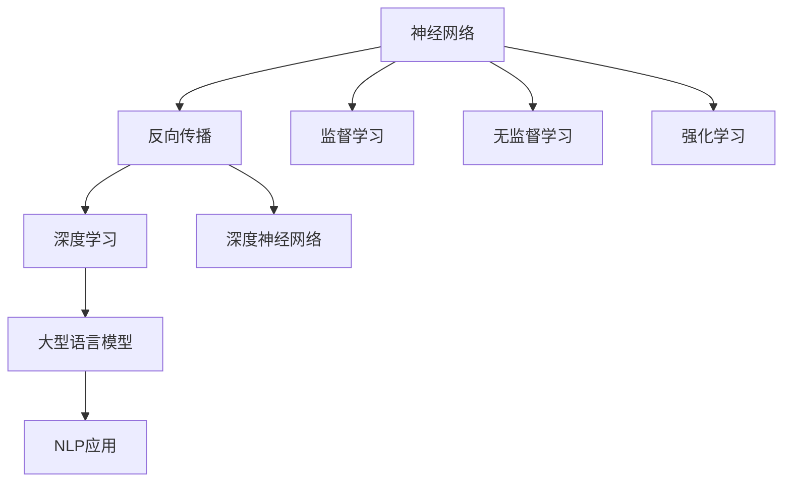

                 

## 1. 背景介绍

### 1.1 问题由来

随着人工智能(AI)、大型语言模型(LLMs)和深度学习(Deep Learning, DL)技术的不断进步，这些技术已经成为现代科技发展的重要驱动力。深度学习，特别是深度神经网络在图像识别、语音识别、自然语言处理(NLP)等领域的应用，取得了显著成果。然而，在实际应用中，如何更有效地利用这些模型、如何理解它们的工作原理和机制，成为一个重要问题。

### 1.2 问题核心关键点

大模型（Large Models），如BERT、GPT、T5等，以及它们在各种NLP任务上的应用，展示了深度学习技术的强大潜力。但这些模型背后的原理、算法和数学模型是什么？深度学习如何在实际中落地应用？这些问题值得深入探讨。

### 1.3 问题研究意义

深入理解AI、LLMs和深度学习，不仅有助于研究者在相关领域取得更多突破，还可以帮助开发者、工程师和研究人员更好地使用这些技术解决实际问题。此外，对于非技术背景的读者来说，理解这些技术的应用场景、潜力和局限性，对于评估和应用这些技术也是非常有益的。

## 2. 核心概念与联系

### 2.1 核心概念概述

为了更好地理解AI、LLMs和深度学习，首先需要了解一些核心概念：

- **AI**: 人工智能，指的是计算机系统能够执行通常需要人类智能的任务。
- **LLMs**: 大型语言模型，指的是通过大规模数据训练得到的能够处理自然语言理解的模型。
- **DL**: 深度学习，是一种利用多层神经网络进行数据表示学习的技术。
- **深度神经网络**: 由多层神经元组成的神经网络，每层都能够学习特征表示。
- **反向传播**: 一种用于训练神经网络的算法，通过计算输出误差与输入数据的关联，调整神经元权重，以最小化误差。
- **监督学习**: 一种机器学习范式，使用标注数据进行训练，以预测未知数据的标签。
- **无监督学习**: 一种机器学习范式，使用无标注数据进行训练，以发现数据的内在结构和模式。
- **强化学习**: 一种机器学习范式，通过与环境的交互，训练模型以最大化奖励。

这些概念相互关联，构成了AI、LLMs和深度学习的基础框架。

### 2.2 核心概念原理和架构的 Mermaid 流程图



以上流程图展示了神经网络、反向传播、监督学习、无监督学习和强化学习之间的关系。这些概念共同构成了深度学习和大型语言模型的基础。

## 3. 核心算法原理 & 具体操作步骤

### 3.1 算法原理概述

深度学习算法的核心在于神经网络，特别是深度神经网络（Deep Neural Networks, DNNs）。DNNs由多个神经元组成的层次结构，每层能够学习不同层次的特征。深度学习通过反向传播算法（Backpropagation），根据输出误差调整神经元权重，以最小化误差。

在大规模数据上训练得到的深度神经网络，通常被称为大型语言模型（LLMs）。这些模型在自然语言处理（NLP）任务中表现优异，能够理解语言的上下文，预测文本的语义和结构。

### 3.2 算法步骤详解

深度学习模型的训练主要分为以下几个步骤：

1. **数据准备**：收集并处理数据，分为训练集、验证集和测试集。
2. **模型设计**：选择或设计合适的神经网络结构，如卷积神经网络（CNN）、循环神经网络（RNN）或变压器（Transformer）。
3. **模型初始化**：给模型参数赋予随机值。
4. **前向传播**：将输入数据传递到模型中，计算输出。
5. **损失计算**：计算模型输出与真实标签之间的差异。
6. **反向传播**：通过反向传播算法，计算模型参数的梯度。
7. **参数更新**：使用梯度下降等优化算法，更新模型参数，减小损失。
8. **迭代训练**：重复上述步骤，直到模型收敛或达到预设的训练轮数。
9. **模型评估**：使用测试集评估模型的性能，如准确率、精确度、召回率等指标。

### 3.3 算法优缺点

深度学习算法的优点包括：

- 能够处理高维度数据。
- 具备自适应能力，可以学习复杂的数据模式。
- 在大规模数据上表现优异。

深度学习算法的主要缺点包括：

- 需要大量计算资源。
- 模型复杂，难以解释。
- 对初始参数的选取敏感。

### 3.4 算法应用领域

深度学习算法广泛应用于计算机视觉、自然语言处理、语音识别、推荐系统等领域。以下是几个典型的应用场景：

1. **计算机视觉**：如图像分类、物体检测、人脸识别等。
2. **自然语言处理**：如机器翻译、文本分类、情感分析等。
3. **语音识别**：如语音转文本、情感分析、语音命令等。
4. **推荐系统**：如商品推荐、内容推荐、用户行为预测等。

## 4. 数学模型和公式 & 详细讲解 & 举例说明

### 4.1 数学模型构建

深度学习模型的数学模型通常基于神经元间的连接权重和激活函数构建。以全连接神经网络为例，其数学模型可以表示为：

$$
\hat{y} = f(\mathbf{W}x + b)
$$

其中，$\hat{y}$为预测输出，$f$为激活函数，$\mathbf{W}$为权重矩阵，$x$为输入数据，$b$为偏置项。

### 4.2 公式推导过程

以一个简单的单层神经网络为例，其损失函数可以表示为：

$$
\mathcal{L}(\mathbf{W}, b) = \frac{1}{N} \sum_{i=1}^N \mathcal{L}_i(\mathbf{W}, b)
$$

其中，$\mathcal{L}_i$为单个样本的损失函数，通常使用交叉熵损失：

$$
\mathcal{L}_i(\mathbf{W}, b) = -\sum_{j=1}^C y_j \log \hat{y}_j
$$

其中，$y$为真实标签，$\hat{y}$为模型预测的概率分布。

### 4.3 案例分析与讲解

以手写数字识别为例，可以将手写数字图像作为输入，通过卷积神经网络（CNN）进行处理。CNN能够自动提取图像的特征，并通过多层卷积和池化操作，逐步抽象出更高级的特征表示。最后，通过全连接层将特征映射到数字类别上，使用交叉熵损失进行训练。

## 5. 项目实践：代码实例和详细解释说明

### 5.1 开发环境搭建

搭建深度学习项目的开发环境，需要安装Python、PyTorch、TensorFlow等库。具体步骤如下：

1. 安装Anaconda。
2. 创建虚拟环境。
3. 安装PyTorch和TensorFlow。
4. 安装相关依赖库。

### 5.2 源代码详细实现

下面以一个简单的手写数字识别项目为例，展示深度学习模型的实现过程。

```python
import torch
import torch.nn as nn
import torch.optim as optim
import torchvision
import torchvision.transforms as transforms
from torch.utils.data import DataLoader
from torchvision.datasets import MNIST

# 定义神经网络模型
class Net(nn.Module):
    def __init__(self):
        super(Net, self).__init__()
        self.conv1 = nn.Conv2d(1, 32, 3)
        self.pool = nn.MaxPool2d(2)
        self.conv2 = nn.Conv2d(32, 64, 3)
        self.fc1 = nn.Linear(64 * 4 * 4, 512)
        self.fc2 = nn.Linear(512, 10)
    
    def forward(self, x):
        x = self.pool(torch.relu(self.conv1(x)))
        x = self.pool(torch.relu(self.conv2(x)))
        x = x.view(-1, 64 * 4 * 4)
        x = torch.relu(self.fc1(x))
        x = self.fc2(x)
        return x

# 加载数据集
train_dataset = MNIST(root='./data', train=True, transform=transforms.ToTensor(), download=True)
test_dataset = MNIST(root='./data', train=False, transform=transforms.ToTensor(), download=True)

# 定义数据加载器
train_loader = DataLoader(dataset=train_dataset, batch_size=64, shuffle=True)
test_loader = DataLoader(dataset=test_dataset, batch_size=64, shuffle=False)

# 定义模型、优化器和损失函数
model = Net()
optimizer = optim.SGD(model.parameters(), lr=0.01)
criterion = nn.CrossEntropyLoss()

# 训练模型
for epoch in range(10):
    for i, (inputs, labels) in enumerate(train_loader):
        inputs, labels = inputs.to(device), labels.to(device)
        optimizer.zero_grad()
        outputs = model(inputs)
        loss = criterion(outputs, labels)
        loss.backward()
        optimizer.step()
        
    print(f'Epoch {epoch+1}, Loss: {loss.item()}')

# 测试模型
with torch.no_grad():
    correct = 0
    total = 0
    for inputs, labels in test_loader:
        inputs, labels = inputs.to(device), labels.to(device)
        outputs = model(inputs)
        _, predicted = torch.max(outputs.data, 1)
        total += labels.size(0)
        correct += (predicted == labels).sum().item()

    print(f'Test Accuracy: {100 * correct / total:.2f}%')
```

### 5.3 代码解读与分析

以上代码展示了使用PyTorch实现手写数字识别模型的过程。

**定义神经网络模型**：使用`nn.Module`类定义网络结构，包含卷积层、池化层和全连接层。

**加载数据集**：使用`MNIST`数据集，进行数据预处理和转换，使用`DataLoader`加载数据。

**定义模型、优化器和损失函数**：定义模型结构、优化器和损失函数，并进行模型训练。

**训练模型**：使用`for`循环进行模型训练，计算损失并更新模型参数。

**测试模型**：使用测试集对模型进行评估，计算准确率。

### 5.4 运行结果展示

运行上述代码，可以看到训练和测试过程中的损失和准确率变化。

## 6. 实际应用场景

### 6.1 智慧医疗

在智慧医疗领域，深度学习算法可以用于医学图像分析、疾病预测、个性化医疗等领域。例如，使用卷积神经网络（CNN）处理医学影像，识别出肿瘤等病变部位，帮助医生进行早期诊断和治疗。

### 6.2 智能交通

在智能交通领域，深度学习算法可以用于车辆行为预测、交通流量分析、自动驾驶等领域。例如，使用循环神经网络（RNN）处理交通监控视频，分析车辆行为，预测交通流量，优化交通管理。

### 6.3 金融风险管理

在金融领域，深度学习算法可以用于信用评分、欺诈检测、市场预测等领域。例如，使用神经网络处理客户的交易记录，分析其信用风险，进行风险评估和控制。

### 6.4 未来应用展望

未来，深度学习算法将在更多领域得到应用，为各行各业带来变革性影响。例如，在自动驾驶、智能制造、智能家居等领域，深度学习算法可以显著提高生产效率和用户体验。

## 7. 工具和资源推荐

### 7.1 学习资源推荐

为了帮助开发者系统掌握深度学习技术，以下是一些推荐的学习资源：

1. 《深度学习》（Ian Goodfellow等著）：深度学习领域的经典教材，全面介绍了深度学习的基础和应用。
2. 《Python深度学习》（Francois Chollet等著）：使用Keras框架，介绍了深度学习的基本概念和实践技巧。
3. 《TensorFlow实战》（Manning Publications）：介绍了TensorFlow的使用方法和最佳实践。
4. 《PyTorch入门与实践》（Stefan Jansen等著）：介绍了PyTorch的使用方法和深度学习模型的实现。
5. 《深度学习框架与实战》（李沐等著）：介绍了深度学习框架的使用方法和案例分析。

### 7.2 开发工具推荐

以下是一些推荐的使用深度学习开发的工具：

1. PyTorch：开源深度学习框架，支持动态计算图和GPU加速。
2. TensorFlow：由Google开发的深度学习框架，支持分布式训练和静态计算图。
3. Keras：基于TensorFlow的高级神经网络库，易于使用，适合快速原型开发。
4. MXNet：由Apache开发的深度学习框架，支持多种编程语言和平台。
5. Caffe：深度学习框架，适合图像处理和计算机视觉任务。

### 7.3 相关论文推荐

以下是几篇经典的深度学习相关论文，推荐阅读：

1. "Deep Learning"（Yann LeCun等著）：深度学习领域的经典综述论文，介绍了深度学习的基本概念和算法。
2. "ImageNet Classification with Deep Convolutional Neural Networks"（Alex Krizhevsky等著）：提出了卷积神经网络（CNN），在图像分类任务上取得了突破性成果。
3. "Natural Language Processing (almost) from Scratch"（Andrej Karpathy等著）：介绍了使用递归神经网络（RNN）处理自然语言任务的经典方法。
4. "Attention is All You Need"（Ashish Vaswani等著）：提出了Transformer模型，改进了循环神经网络的性能和效率。
5. "A Survey on Recent Advances of Deep Learning in Natural Language Processing"（Shinji Watanabe等著）：介绍了深度学习在NLP领域的应用和最新进展。

## 8. 总结：未来发展趋势与挑战

### 8.1 研究成果总结

深度学习算法已经在计算机视觉、自然语言处理、语音识别等领域取得了显著成果，推动了AI技术的发展。大型语言模型（LLMs）和深度学习模型的应用场景不断拓展，为各行各业带来了新的解决方案。

### 8.2 未来发展趋势

未来，深度学习技术将继续发展，面临以下几个趋势：

1. **模型的多样化和深度化**：未来的深度学习模型将更加多样化和深度化，以适应更复杂的任务需求。
2. **模型的可解释性和透明性**：如何更好地理解深度学习模型的决策过程，提高模型的可解释性和透明性，是未来的研究方向之一。
3. **模型的高效性和可扩展性**：如何在保证性能的前提下，提高模型的效率和可扩展性，支持大规模数据的处理。
4. **模型的鲁棒性和泛化性**：如何提高深度学习模型的鲁棒性和泛化性，使其在各种数据分布下都能表现优异。
5. **模型的伦理和安全**：如何确保深度学习模型的公平性和安全性，避免有害信息的输出。

### 8.3 面临的挑战

尽管深度学习技术已经取得了显著进展，但在实际应用中仍面临诸多挑战：

1. **数据的稀缺性**：深度学习模型需要大量的标注数据，但标注数据获取成本高，难以获得高质量的数据。
2. **计算资源的消耗**：深度学习模型的训练和推理需要大量的计算资源，成本较高。
3. **模型的复杂性和透明性**：深度学习模型往往是一个"黑箱"，难以理解其内部机制，难以进行调试和优化。
4. **模型的泛化性**：深度学习模型在特定数据集上表现优异，但在泛化到新数据时，性能可能不佳。
5. **模型的伦理和安全**：深度学习模型可能存在偏见和有害信息输出，需要进行伦理审查和安全防护。

### 8.4 研究展望

未来，深度学习技术需要在以下几个方面进行更多的研究：

1. **无监督学习和半监督学习**：如何在不依赖大量标注数据的情况下，训练深度学习模型。
2. **模型的可解释性和透明性**：如何提高深度学习模型的可解释性和透明性，增强其可信度。
3. **模型的效率和可扩展性**：如何提高深度学习模型的效率和可扩展性，支持大规模数据的处理。
4. **模型的鲁棒性和泛化性**：如何提高深度学习模型的鲁棒性和泛化性，使其在各种数据分布下都能表现优异。
5. **模型的伦理和安全**：如何确保深度学习模型的公平性和安全性，避免有害信息的输出。

## 9. 附录：常见问题与解答

**Q1: 深度学习模型和大型语言模型有何区别？**

A: 深度学习模型是一种用于处理数据表示学习的算法，可以应用于计算机视觉、自然语言处理、语音识别等领域。而大型语言模型是一种深度学习模型，专门用于处理自然语言处理任务，能够理解语言的上下文，生成自然流畅的文本。

**Q2: 深度学习模型的训练需要多少数据？**

A: 深度学习模型的训练需要大量的数据，尤其是标注数据。通常来说，数据量越大，模型性能越好。但实际应用中，获取高质量标注数据成本较高，因此需要权衡数据量和模型性能。

**Q3: 深度学习模型的训练时间需要多久？**

A: 深度学习模型的训练时间取决于模型的复杂度和数据量。通常来说，模型越复杂，训练时间越长。但通过优化训练算法和硬件配置，可以在较短时间内完成模型训练。

**Q4: 深度学习模型的应用场景有哪些？**

A: 深度学习模型可以应用于计算机视觉、自然语言处理、语音识别、推荐系统等领域。例如，在图像识别、语音转文本、机器翻译、推荐系统等任务中，深度学习模型已经取得了显著成果。

**Q5: 如何评估深度学习模型的性能？**

A: 深度学习模型的性能可以通过多种指标进行评估，如准确率、精确度、召回率、F1分数等。具体评估方法取决于任务的性质和模型的输出形式。

