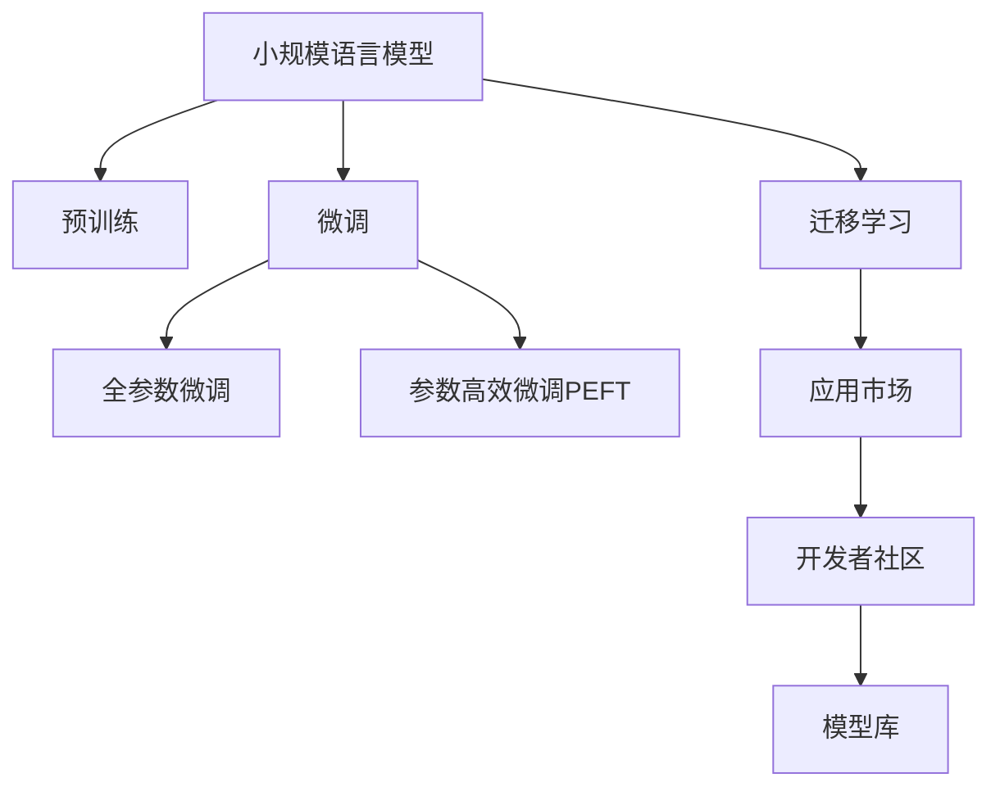

                 

# 小语言模型的应用开发生态:开发工具和应用市场

> 关键词：小语言模型, 应用开发生态, 开发工具, 应用市场, 微调, 预训练, 深度学习, 自然语言处理(NLP)

## 1. 背景介绍

### 1.1 问题由来
随着深度学习技术的快速发展，小规模语言模型在自然语言处理(NLP)领域中逐渐崭露头角。相较于大规模预训练语言模型，小规模语言模型具有较低的资源需求和更快的训练速度，并且在特定领域的应用中显示出独特的优势。近年来，围绕小规模语言模型的研究和应用呈现出蓬勃发展的态势，涌现了大量基于小规模语言模型的开发工具和应用市场。

### 1.2 问题核心关键点
本文聚焦于小规模语言模型的应用开发生态，通过剖析其开发工具和应用市场，探索小规模语言模型在实际应用中的潜力和挑战。以下将详细介绍小规模语言模型的核心概念及其与大规模语言模型的联系，并深入分析其在实际应用中的算法原理、操作步骤、数学模型构建、以及项目实践的实现细节。

## 2. 核心概念与联系

### 2.1 核心概念概述

为更好地理解小规模语言模型的应用开发生态，本节将介绍几个关键的概念：

- **小规模语言模型(Low-resource Language Model, LLM)**：以Transformer、RNN等网络架构为代表，通过在特定领域的数据上进行监督学习训练的小型语言模型。相较于大规模预训练模型，小规模模型通常参数量较少，训练速度快，但准确率可能会较低。

- **预训练(Pre-training)**：指在大规模无标签文本语料上，通过自监督学习任务训练通用语言模型的过程。小规模语言模型通常也会采用预训练步骤，但预训练数据量相对较小。

- **微调(Fine-tuning)**：指在预训练模型的基础上，使用下游任务的少量标注数据，通过有监督学习优化模型在特定任务上的性能。小规模语言模型通常在微调过程中获得性能提升。

- **迁移学习(Transfer Learning)**：指将一个领域学习到的知识，迁移应用到另一个不同但相关的领域的学习范式。小规模语言模型的预训练-微调过程也属于迁移学习的一种。

- **开发工具(Development Tools)**：指用于小规模语言模型开发和部署的各类软件工具，如编程语言、框架、库等。

- **应用市场(Application Market)**：指小规模语言模型应用和推广的平台或生态系统，包括模型库、在线服务、开发者社区等。

这些核心概念之间的逻辑关系可以通过以下Mermaid流程图来展示：



这个流程图展示了小规模语言模型的核心概念及其之间的关系：

1. 小规模语言模型通过预训练获得基础能力。
2. 微调是对预训练模型进行任务特定的优化，可以分为全参数微调和参数高效微调（PEFT）。
3. 迁移学习是连接预训练模型与下游任务的桥梁，可以通过微调或迁移学习来实现。
4. 应用市场和开发者社区是模型应用和推广的平台，为小规模语言模型的落地提供支持。

这些概念共同构成了小规模语言模型的应用开发生态，使得小规模语言模型能够被更广泛地应用于各种实际问题。

## 3. 核心算法原理 & 具体操作步骤

### 3.1 算法原理概述

小规模语言模型的微调方法基于监督学习，其核心思想是利用少量的标注数据，在预训练模型的基础上进行有监督学习，以优化模型在特定任务上的性能。与大规模语言模型的微调方法类似，小规模语言模型通过梯度下降等优化算法，最小化损失函数，更新模型参数。

### 3.2 算法步骤详解

小规模语言模型微调的一般流程如下：

**Step 1: 准备预训练模型和数据集**
- 选择合适的预训练模型（如基于Transformer的小型模型）作为初始化参数。
- 准备下游任务的少量标注数据集 $D=\{(x_i, y_i)\}_{i=1}^N, x_i \in \mathcal{X}, y_i \in \mathcal{Y}$，其中 $x_i$ 为输入文本，$y_i$ 为对应的标签。

**Step 2: 添加任务适配层**
- 根据任务类型，在预训练模型顶层设计合适的输出层和损失函数。
- 对于分类任务，通常在顶层添加线性分类器和交叉熵损失函数。
- 对于生成任务，通常使用语言模型的解码器输出概率分布，并以负对数似然为损失函数。

**Step 3: 设置微调超参数**
- 选择合适的优化算法及其参数，如 Adam、SGD 等，设置学习率、批大小、迭代轮数等。
- 设置正则化技术及强度，包括权重衰减、Dropout、Early Stopping 等。
- 确定冻结预训练参数的策略，如仅微调顶层，或全部参数都参与微调。

**Step 4: 执行梯度训练**
- 将训练集数据分批次输入模型，前向传播计算损失函数。
- 反向传播计算参数梯度，根据设定的优化算法和学习率更新模型参数。
- 周期性在验证集上评估模型性能，根据性能指标决定是否触发 Early Stopping。
- 重复上述步骤直到满足预设的迭代轮数或 Early Stopping 条件。

**Step 5: 测试和部署**
- 在测试集上评估微调后模型 $M_{\hat{\theta}}$ 的性能，对比微调前后的精度提升。
- 使用微调后的模型对新样本进行推理预测，集成到实际的应用系统中。
- 持续收集新的数据，定期重新微调模型，以适应数据分布的变化。

### 3.3 算法优缺点

小规模语言模型的微调方法具有以下优点：
1. 简单高效。只需准备少量标注数据，即可对预训练模型进行快速适配，获得较大的性能提升。
2. 适用于特定领域。小规模模型在特定领域应用中通常表现更优，因为其参数量和训练数据量更适合该领域。
3. 资源需求低。相较于大规模模型，小规模模型的训练和推理所需的硬件资源较少。
4. 快速迭代。小规模模型通常训练速度较快，可以快速迭代实验，验证不同假设。

同时，该方法也存在一些局限性：
1. 泛化能力受限。小规模模型通常在特定领域表现较好，但面对领域外的数据时，泛化能力可能会下降。
2. 数据依赖性强。微调效果高度依赖于标注数据的质量和数量，高质量标注数据的获取成本较高。
3. 可解释性差。小规模模型通常被视为"黑盒"系统，缺乏可解释性。

尽管存在这些局限性，但就目前而言，小规模语言模型的微调方法仍然是一个高效、实用的选择。

### 3.4 算法应用领域

小规模语言模型微调方法在NLP领域的应用非常广泛，特别是在资源受限的环境下，小规模模型往往能够提供更佳的性能。以下是几个典型应用场景：

- **文本分类**：如情感分析、主题分类、意图识别等。通过微调使模型学习文本-标签映射。
- **命名实体识别**：识别文本中的人名、地名、机构名等特定实体。通过微调使模型掌握实体边界和类型。
- **关系抽取**：从文本中抽取实体之间的语义关系。通过微调使模型学习实体-关系三元组。
- **问答系统**：对自然语言问题给出答案。将问题-答案对作为微调数据，训练模型学习匹配答案。
- **机器翻译**：将源语言文本翻译成目标语言。通过微调使模型学习语言-语言映射。
- **文本摘要**：将长文本压缩成简短摘要。将文章-摘要对作为微调数据，使模型学习抓取要点。
- **对话系统**：使机器能够与人自然对话。将多轮对话历史作为上下文，微调模型进行回复生成。

此外，小规模语言模型在金融舆情监测、医疗问答、推荐系统等领域也得到了广泛应用。小规模模型在数据稀缺、计算资源有限的情况下，能够以较小的代价实现高质量的NLP任务。

## 4. 数学模型和公式 & 详细讲解 & 举例说明

### 4.1 数学模型构建

小规模语言模型的微调过程可以通过以下数学模型来描述：

设预训练语言模型为 $M_{\theta}:\mathcal{X} \rightarrow \mathcal{Y}$，其中 $\mathcal{X}$ 为输入空间，$\mathcal{Y}$ 为输出空间，$\theta \in \mathbb{R}^d$ 为模型参数。假设微调任务的训练集为 $D=\{(x_i,y_i)\}_{i=1}^N, x_i \in \mathcal{X}, y_i \in \mathcal{Y}$。

定义模型 $M_{\theta}$ 在数据样本 $(x,y)$ 上的损失函数为 $\ell(M_{\theta}(x),y)$，则在数据集 $D$ 上的经验风险为：

$$
\mathcal{L}(\theta) = \frac{1}{N} \sum_{i=1}^N \ell(M_{\theta}(x_i),y_i)
$$

其中 $\ell$ 为针对任务 $T$ 设计的损失函数，用于衡量模型预测输出与真实标签之间的差异。常见的损失函数包括交叉熵损失、均方误差损失等。

微调的优化目标是最小化经验风险，即找到最优参数：

$$
\theta^* = \mathop{\arg\min}_{\theta} \mathcal{L}(\theta)
$$

在实践中，我们通常使用基于梯度的优化算法（如SGD、Adam等）来近似求解上述最优化问题。设 $\eta$ 为学习率，$\lambda$ 为正则化系数，则参数的更新公式为：

$$
\theta \leftarrow \theta - \eta \nabla_{\theta}\mathcal{L}(\theta) - \eta\lambda\theta
$$

其中 $\nabla_{\theta}\mathcal{L}(\theta)$ 为损失函数对参数 $\theta$ 的梯度，可通过反向传播算法高效计算。

### 4.2 公式推导过程

以下我们以二分类任务为例，推导交叉熵损失函数及其梯度的计算公式。

假设模型 $M_{\theta}$ 在输入 $x$ 上的输出为 $\hat{y}=M_{\theta}(x) \in [0,1]$，表示样本属于正类的概率。真实标签 $y \in \{0,1\}$。则二分类交叉熵损失函数定义为：

$$
\ell(M_{\theta}(x),y) = -[y\log \hat{y} + (1-y)\log (1-\hat{y})]
$$

将其代入经验风险公式，得：

$$
\mathcal{L}(\theta) = -\frac{1}{N}\sum_{i=1}^N [y_i\log M_{\theta}(x_i)+(1-y_i)\log(1-M_{\theta}(x_i))]
$$

根据链式法则，损失函数对参数 $\theta_k$ 的梯度为：

$$
\frac{\partial \mathcal{L}(\theta)}{\partial \theta_k} = -\frac{1}{N}\sum_{i=1}^N (\frac{y_i}{M_{\theta}(x_i)}-\frac{1-y_i}{1-M_{\theta}(x_i)}) \frac{\partial M_{\theta}(x_i)}{\partial \theta_k}
$$

其中 $\frac{\partial M_{\theta}(x_i)}{\partial \theta_k}$ 可进一步递归展开，利用自动微分技术完成计算。

在得到损失函数的梯度后，即可带入参数更新公式，完成模型的迭代优化。重复上述过程直至收敛，最终得到适应下游任务的最优模型参数 $\theta^*$。

## 5. 项目实践：代码实例和详细解释说明

### 5.1 开发环境搭建

在进行微调实践前，我们需要准备好开发环境。以下是使用Python进行PyTorch开发的环境配置流程：

1. 安装Anaconda：从官网下载并安装Anaconda，用于创建独立的Python环境。

2. 创建并激活虚拟环境：
```bash
conda create -n pytorch-env python=3.8 
conda activate pytorch-env
```

3. 安装PyTorch：根据CUDA版本，从官网获取对应的安装命令。例如：
```bash
conda install pytorch torchvision torchaudio cudatoolkit=11.1 -c pytorch -c conda-forge
```

4. 安装TensorFlow：由于TensorFlow目前只支持PyTorch的frozen Graph模式，需确保安装最新版本的TensorFlow。

5. 安装各类工具包：
```bash
pip install numpy pandas scikit-learn matplotlib tqdm jupyter notebook ipython
```

完成上述步骤后，即可在`pytorch-env`环境中开始微调实践。

### 5.2 源代码详细实现

下面我们以命名实体识别(NER)任务为例，给出使用Transformers库对BERT模型进行微调的PyTorch代码实现。

首先，定义NER任务的数据处理函数：

```python
from transformers import BertTokenizer
from torch.utils.data import Dataset
import torch

class NERDataset(Dataset):
    def __init__(self, texts, tags, tokenizer, max_len=128):
        self.texts = texts
        self.tags = tags
        self.tokenizer = tokenizer
        self.max_len = max_len
        
    def __len__(self):
        return len(self.texts)
    
    def __getitem__(self, item):
        text = self.texts[item]
        tags = self.tags[item]
        
        encoding = self.tokenizer(text, return_tensors='pt', max_length=self.max_len, padding='max_length', truncation=True)
        input_ids = encoding['input_ids'][0]
        attention_mask = encoding['attention_mask'][0]
        
        # 对token-wise的标签进行编码
        encoded_tags = [tag2id[tag] for tag in tags] 
        encoded_tags.extend([tag2id['O']] * (self.max_len - len(encoded_tags)))
        labels = torch.tensor(encoded_tags, dtype=torch.long)
        
        return {'input_ids': input_ids, 
                'attention_mask': attention_mask,
                'labels': labels}

# 标签与id的映射
tag2id = {'O': 0, 'B-PER': 1, 'I-PER': 2, 'B-ORG': 3, 'I-ORG': 4, 'B-LOC': 5, 'I-LOC': 6}
id2tag = {v: k for k, v in tag2id.items()}

# 创建dataset
tokenizer = BertTokenizer.from_pretrained('bert-base-cased')

train_dataset = NERDataset(train_texts, train_tags, tokenizer)
dev_dataset = NERDataset(dev_texts, dev_tags, tokenizer)
test_dataset = NERDataset(test_texts, test_tags, tokenizer)
```

然后，定义模型和优化器：

```python
from transformers import BertForTokenClassification, AdamW

model = BertForTokenClassification.from_pretrained('bert-base-cased', num_labels=len(tag2id))

optimizer = AdamW(model.parameters(), lr=2e-5)
```

接着，定义训练和评估函数：

```python
from torch.utils.data import DataLoader
from tqdm import tqdm
from sklearn.metrics import classification_report

device = torch.device('cuda') if torch.cuda.is_available() else torch.device('cpu')
model.to(device)

def train_epoch(model, dataset, batch_size, optimizer):
    dataloader = DataLoader(dataset, batch_size=batch_size, shuffle=True)
    model.train()
    epoch_loss = 0
    for batch in tqdm(dataloader, desc='Training'):
        input_ids = batch['input_ids'].to(device)
        attention_mask = batch['attention_mask'].to(device)
        labels = batch['labels'].to(device)
        model.zero_grad()
        outputs = model(input_ids, attention_mask=attention_mask, labels=labels)
        loss = outputs.loss
        epoch_loss += loss.item()
        loss.backward()
        optimizer.step()
    return epoch_loss / len(dataloader)

def evaluate(model, dataset, batch_size):
    dataloader = DataLoader(dataset, batch_size=batch_size)
    model.eval()
    preds, labels = [], []
    with torch.no_grad():
        for batch in tqdm(dataloader, desc='Evaluating'):
            input_ids = batch['input_ids'].to(device)
            attention_mask = batch['attention_mask'].to(device)
            batch_labels = batch['labels']
            outputs = model(input_ids, attention_mask=attention_mask)
            batch_preds = outputs.logits.argmax(dim=2).to('cpu').tolist()
            batch_labels = batch_labels.to('cpu').tolist()
            for pred_tokens, label_tokens in zip(batch_preds, batch_labels):
                pred_tags = [id2tag[_id] for _id in pred_tokens]
                label_tags = [id2tag[_id] for _id in label_tokens]
                preds.append(pred_tags[:len(label_tags)])
                labels.append(label_tags)
                
    print(classification_report(labels, preds))
```

最后，启动训练流程并在测试集上评估：

```python
epochs = 5
batch_size = 16

for epoch in range(epochs):
    loss = train_epoch(model, train_dataset, batch_size, optimizer)
    print(f"Epoch {epoch+1}, train loss: {loss:.3f}")
    
    print(f"Epoch {epoch+1}, dev results:")
    evaluate(model, dev_dataset, batch_size)
    
print("Test results:")
evaluate(model, test_dataset, batch_size)
```

以上就是使用PyTorch对BERT进行命名实体识别任务微调的完整代码实现。可以看到，得益于Transformers库的强大封装，我们可以用相对简洁的代码完成BERT模型的加载和微调。

### 5.3 代码解读与分析

让我们再详细解读一下关键代码的实现细节：

**NERDataset类**：
- `__init__`方法：初始化文本、标签、分词器等关键组件。
- `__len__`方法：返回数据集的样本数量。
- `__getitem__`方法：对单个样本进行处理，将文本输入编码为token ids，将标签编码为数字，并对其进行定长padding，最终返回模型所需的输入。

**tag2id和id2tag字典**：
- 定义了标签与数字id之间的映射关系，用于将token-wise的预测结果解码回真实的标签。

**训练和评估函数**：
- 使用PyTorch的DataLoader对数据集进行批次化加载，供模型训练和推理使用。
- 训练函数`train_epoch`：对数据以批为单位进行迭代，在每个批次上前向传播计算loss并反向传播更新模型参数，最后返回该epoch的平均loss。
- 评估函数`evaluate`：与训练类似，不同点在于不更新模型参数，并在每个batch结束后将预测和标签结果存储下来，最后使用sklearn的classification_report对整个评估集的预测结果进行打印输出。

**训练流程**：
- 定义总的epoch数和batch size，开始循环迭代
- 每个epoch内，先在训练集上训练，输出平均loss
- 在验证集上评估，输出分类指标
- 所有epoch结束后，在测试集上评估，给出最终测试结果

可以看到，PyTorch配合Transformers库使得BERT微调的代码实现变得简洁高效。开发者可以将更多精力放在数据处理、模型改进等高层逻辑上，而不必过多关注底层的实现细节。

当然，工业级的系统实现还需考虑更多因素，如模型的保存和部署、超参数的自动搜索、更灵活的任务适配层等。但核心的微调范式基本与此类似。

## 6. 实际应用场景
### 6.1 智能客服系统

基于小规模语言模型微调的对话技术，可以广泛应用于智能客服系统的构建。传统客服往往需要配备大量人力，高峰期响应缓慢，且一致性和专业性难以保证。而使用微调后的对话模型，可以7x24小时不间断服务，快速响应客户咨询，用自然流畅的语言解答各类常见问题。

在技术实现上，可以收集企业内部的历史客服对话记录，将问题和最佳答复构建成监督数据，在此基础上对预训练对话模型进行微调。微调后的对话模型能够自动理解用户意图，匹配最合适的答案模板进行回复。对于客户提出的新问题，还可以接入检索系统实时搜索相关内容，动态组织生成回答。如此构建的智能客服系统，能大幅提升客户咨询体验和问题解决效率。

### 6.2 金融舆情监测

金融机构需要实时监测市场舆论动向，以便及时应对负面信息传播，规避金融风险。传统的人工监测方式成本高、效率低，难以应对网络时代海量信息爆发的挑战。基于小规模语言模型微调的文本分类和情感分析技术，为金融舆情监测提供了新的解决方案。

具体而言，可以收集金融领域相关的新闻、报道、评论等文本数据，并对其进行主题标注和情感标注。在此基础上对预训练语言模型进行微调，使其能够自动判断文本属于何种主题，情感倾向是正面、中性还是负面。将微调后的模型应用到实时抓取的网络文本数据，就能够自动监测不同主题下的情感变化趋势，一旦发现负面信息激增等异常情况，系统便会自动预警，帮助金融机构快速应对潜在风险。

### 6.3 个性化推荐系统

当前的推荐系统往往只依赖用户的历史行为数据进行物品推荐，无法深入理解用户的真实兴趣偏好。基于小规模语言模型微调技术，个性化推荐系统可以更好地挖掘用户行为背后的语义信息，从而提供更精准、多样的推荐内容。

在实践中，可以收集用户浏览、点击、评论、分享等行为数据，提取和用户交互的物品标题、描述、标签等文本内容。将文本内容作为模型输入，用户的后续行为（如是否点击、购买等）作为监督信号，在此基础上微调预训练语言模型。微调后的模型能够从文本内容中准确把握用户的兴趣点。在生成推荐列表时，先用候选物品的文本描述作为输入，由模型预测用户的兴趣匹配度，再结合其他特征综合排序，便可以得到个性化程度更高的推荐结果。

### 6.4 未来应用展望

随着小规模语言模型和微调方法的不断发展，基于微调范式将在更多领域得到应用，为传统行业带来变革性影响。

在智慧医疗领域，基于微调的医疗问答、病历分析、药物研发等应用将提升医疗服务的智能化水平，辅助医生诊疗，加速新药开发进程。

在智能教育领域，微调技术可应用于作业批改、学情分析、知识推荐等方面，因材施教，促进教育公平，提高教学质量。

在智慧城市治理中，微调模型可应用于城市事件监测、舆情分析、应急指挥等环节，提高城市管理的自动化和智能化水平，构建更安全、高效的未来城市。

此外，在企业生产、社会治理、文娱传媒等众多领域，基于小规模语言模型的微调方法也将不断涌现，为经济社会发展注入新的动力。相信随着技术的日益成熟，微调方法将成为人工智能落地应用的重要范式，推动人工智能技术在垂直行业的规模化落地。

## 7. 工具和资源推荐
### 7.1 学习资源推荐

为了帮助开发者系统掌握小规模语言模型微调的理论基础和实践技巧，这里推荐一些优质的学习资源：

1. 《Transformer from Zero to Hero》系列博文：由小规模语言模型专家撰写，深入浅出地介绍了Transformer原理、BERT模型、微调技术等前沿话题。

2. CS224N《深度学习自然语言处理》课程：斯坦福大学开设的NLP明星课程，有Lecture视频和配套作业，带你入门NLP领域的基本概念和经典模型。

3. 《Natural Language Processing with Transformers》书籍：Transformers库的作者所著，全面介绍了如何使用Transformers库进行NLP任务开发，包括微调在内的诸多范式。

4. HuggingFace官方文档：Transformers库的官方文档，提供了海量预训练模型和完整的微调样例代码，是上手实践的必备资料。

5. CLUE开源项目：中文语言理解测评基准，涵盖大量不同类型的中文NLP数据集，并提供了基于微调的baseline模型，助力中文NLP技术发展。

通过对这些资源的学习实践，相信你一定能够快速掌握小规模语言模型微调的精髓，并用于解决实际的NLP问题。
###  7.2 开发工具推荐

高效的开发离不开优秀的工具支持。以下是几款用于小规模语言模型微调开发的常用工具：

1. PyTorch：基于Python的开源深度学习框架，灵活动态的计算图，适合快速迭代研究。大部分预训练语言模型都有PyTorch版本的实现。

2. TensorFlow：由Google主导开发的开源深度学习框架，生产部署方便，适合大规模工程应用。同样有丰富的预训练语言模型资源。

3. Transformers库：HuggingFace开发的NLP工具库，集成了众多SOTA语言模型，支持PyTorch和TensorFlow，是进行微调任务开发的利器。

4. Weights & Biases：模型训练的实验跟踪工具，可以记录和可视化模型训练过程中的各项指标，方便对比和调优。与主流深度学习框架无缝集成。

5. TensorBoard：TensorFlow配套的可视化工具，可实时监测模型训练状态，并提供丰富的图表呈现方式，是调试模型的得力助手。

6. Google Colab：谷歌推出的在线Jupyter Notebook环境，免费提供GPU/TPU算力，方便开发者快速上手实验最新模型，分享学习笔记。

合理利用这些工具，可以显著提升小规模语言模型微调任务的开发效率，加快创新迭代的步伐。

### 7.3 相关论文推荐

小规模语言模型和微调技术的发展源于学界的持续研究。以下是几篇奠基性的相关论文，推荐阅读：

1. Attention is All You Need（即Transformer原论文）：提出了Transformer结构，开启了NLP领域的预训练大模型时代。

2. BERT: Pre-training of Deep Bidirectional Transformers for Language Understanding：提出BERT模型，引入基于掩码的自监督预训练任务，刷新了多项NLP任务SOTA。

3. Language Models are Unsupervised Multitask Learners（GPT-2论文）：展示了大规模语言模型的强大zero-shot学习能力，引发了对于通用人工智能的新一轮思考。

4. Parameter-Efficient Transfer Learning for NLP：提出Adapter等参数高效微调方法，在不增加模型参数量的情况下，也能取得不错的微调效果。

5. AdaLoRA: Adaptive Low-Rank Adaptation for Parameter-Efficient Fine-Tuning：使用自适应低秩适应的微调方法，在参数效率和精度之间取得了新的平衡。

这些论文代表了大规模语言模型微调技术的发展脉络。通过学习这些前沿成果，可以帮助研究者把握学科前进方向，激发更多的创新灵感。

## 8. 总结：未来发展趋势与挑战

### 8.1 总结

本文对小规模语言模型的应用开发生态进行了全面系统的介绍。首先阐述了小规模语言模型和微调技术的研究背景和意义，明确了微调在拓展预训练模型应用、提升下游任务性能方面的独特价值。其次，从原理到实践，详细讲解了小规模语言模型的数学原理和关键步骤，给出了微调任务开发的完整代码实例。同时，本文还广泛探讨了小规模语言模型在智能客服、金融舆情、个性化推荐等多个行业领域的应用前景，展示了微调范式的巨大潜力。此外，本文精选了微调技术的各类学习资源，力求为读者提供全方位的技术指引。

通过本文的系统梳理，可以看到，小规模语言模型微调方法在大规模预训练模型的辅助下，能够高效地应用于资源受限的环境，快速实现NLP任务的高质量微调。小规模语言模型通过微调获得的能力，不仅在特定领域表现出色，还能够与大规模预训练模型协同工作，提升整体系统的性能和稳定性。未来，随着小规模语言模型和微调技术的不断进步，基于微调范式必将在更多领域得到应用，为各行各业带来深刻的变革。

### 8.2 未来发展趋势

展望未来，小规模语言模型微调技术将呈现以下几个发展趋势：

1. **模型规模多样化**：未来的小规模语言模型将不再局限于固定大小的模型，而是根据具体应用需求，设计不同规模的模型，从而在保证性能的同时，兼顾资源效率。

2. **参数高效微调方法**：更多参数高效微调方法将涌现，如AdaLoRA、FAT等，通过压缩模型参数，提升微调效率，同时保持高性能。

3. **跨领域迁移学习**：小规模语言模型将更加注重跨领域迁移能力，通过微调在多个领域之间进行知识迁移，提高泛化性能。

4. **少样本学习和零样本学习**：未来的小规模语言模型将更加注重少样本和零样本学习能力，通过微调和使用精心设计的提示模板，在少量标注数据和无标注数据条件下，实现高效推理。

5. **混合模型和跨模态融合**：小规模语言模型将与其他模型如知识图谱、视觉模型等进行混合和跨模态融合，提高多模态任务的处理能力。

6. **多任务学习**：小规模语言模型将更多地采用多任务学习范式，在同一数据集上同时训练多个相关任务，提升模型的迁移能力和鲁棒性。

这些趋势凸显了小规模语言模型微调技术的广阔前景。这些方向的探索发展，必将进一步提升小规模语言模型的应用范围和性能，为人工智能技术在垂直行业的落地提供更强大的工具和平台。

### 8.3 面临的挑战

尽管小规模语言模型微调技术已经取得了瞩目成就，但在迈向更加智能化、普适化应用的过程中，它仍面临着诸多挑战：

1. **标注数据依赖**：小规模模型在微调过程中对标注数据的需求较高，高质量标注数据的获取成本较高，且标注数据的多样性不足。

2. **泛化能力不足**：小规模模型在特定领域表现出色，但面对领域外的数据时，泛化能力可能会下降，特别是在数据稀疏的领域。

3. **鲁棒性有待提高**：微调模型面对新数据和噪音的鲁棒性不足，容易受到输入扰动的影响。

4. **推理效率较低**：小规模语言模型通常计算密集，推理速度较慢，难以满足实时应用的需求。

5. **可解释性差**：小规模语言模型通常被视为"黑盒"系统，缺乏可解释性，难以理解其内部工作机制和决策逻辑。

6. **安全性问题**：小规模语言模型可能会学习到有偏见、有害的信息，通过微调传递到下游任务，产生误导性、歧视性的输出，给实际应用带来安全隐患。

尽管存在这些挑战，但通过不断的研究和实践，小规模语言模型微调技术将在未来的应用中不断进步和完善。

### 8.4 研究展望

面向未来，小规模语言模型微调技术需要在以下几个方面进行深入研究：

1. **无监督和半监督学习**：探索更多无监督和半监督学习范式，降低对标注数据的依赖，提高模型的泛化能力。

2. **多模态融合**：研究如何与其他模态（如视觉、语音）进行融合，提升多模态任务的处理能力。

3. **参数高效和计算高效**：开发更多参数高效和计算高效的微调方法，提升小规模语言模型的资源利用率。

4. **鲁棒性和泛化能力**：研究如何提升小规模语言模型的鲁棒性和泛化能力，提高其在不同场景下的性能。

5. **可解释性和安全性**：开发可解释性和安全性更高的微调方法，确保模型输出符合伦理道德要求，提高系统的透明度和可信度。

6. **多任务学习**：研究如何在同一数据集上同时训练多个相关任务，提升模型的迁移能力和鲁棒性。

通过这些研究方向的探索，相信小规模语言模型微调技术将迈向新的高度，为人工智能技术的广泛应用提供更加可靠和高效的工具。面向未来，小规模语言模型微调技术需要在算法、数据、硬件等方面进行更深入的融合，为构建安全、可靠、可解释、可控的智能系统铺平道路。

## 9. 附录：常见问题与解答

**Q1：小规模语言模型是否适用于所有NLP任务？**

A: 小规模语言模型在大多数NLP任务上都能取得不错的效果，特别是对于数据量较小的任务。但对于一些特定领域的任务，如医学、法律等，仅仅依靠通用语料预训练的模型可能难以很好地适应。此时需要在特定领域语料上进一步预训练，再进行微调，才能获得理想效果。此外，对于一些需要时效性、个性化很强的任务，如对话、推荐等，小规模模型也需要针对性的改进优化。

**Q2：小规模语言模型在微调过程中如何选择合适的学习率？**

A: 小规模语言模型微调的学习率一般要比预训练时小1-2个数量级，如果使用过大的学习率，容易破坏预训练权重，导致过拟合。一般建议从1e-5开始调参，逐步减小学习率，直至收敛。也可以使用warmup策略，在开始阶段使用较小的学习率，再逐渐过渡到预设值。需要注意的是，不同的优化器(如Adam、SGD等)以及不同的学习率调度策略，可能需要设置不同的学习率阈值。

**Q3：小规模语言模型在微调过程中面临哪些资源瓶颈？**

A: 小规模语言模型通常在特定领域应用中表现较好，但面对领域外的数据时，泛化能力可能会下降。此外，由于其参数量较小，微调过程中可能出现过拟合的风险。因此，需要在微调过程中采用一些正则化技术，如L2正则、Dropout等，以避免过拟合。同时，合理选择模型结构和训练策略，如使用混合精度训练、模型压缩等，也能有效提升小规模语言模型的泛化能力和计算效率。

**Q4：小规模语言模型在实际应用中如何处理数据稀缺问题？**

A: 数据稀缺是微调过程中常见的问题。为了解决这个问题，可以采用以下几种策略：
1. **数据增强**：通过对现有数据进行扩充，如近义替换、回译等，增加训练集的多样性。
2. **迁移学习**：利用小规模模型在其他领域的表现，通过迁移学习提升在新领域的表现。
3. **少样本学习和零样本学习**：通过精心设计的提示模板，在小样本和无标注数据条件下，实现高效推理。
4. **主动学习**：通过主动选择最具有代表性的数据进行标注，减少标注数据的数量。
5. **多任务学习**：在同一数据集上训练多个相关任务，提升模型的泛化能力。

这些策略可以综合使用，提升小规模语言模型在数据稀缺场景下的性能。

**Q5：小规模语言模型在实际应用中如何处理计算资源不足的问题？**

A: 小规模语言模型在实际应用中通常需要较高的计算资源，特别是对于大规模数据集和复杂模型。为了解决这个问题，可以采用以下几种策略：
1. **模型压缩和量化**：使用模型压缩技术，如剪枝、量化等，减少模型参数量和计算复杂度。
2. **分布式训练**：使用分布式训练技术，将模型并行化，提升训练效率。
3. **GPU加速**：使用GPU加速，提升模型训练和推理的速度。
4. **混合精度训练**：使用混合精度训练，减少计算资源消耗。
5. **模型裁剪**：根据实际需求，裁剪模型中的冗余层，减小模型大小。

这些策略可以综合使用，提升小规模语言模型在计算资源受限场景下的性能。

**Q6：小规模语言模型在实际应用中如何处理推理速度慢的问题？**

A: 小规模语言模型在推理过程中，通常计算密集，推理速度较慢。为了解决这个问题，可以采用以下几种策略：
1. **模型压缩和量化**：使用模型压缩技术，如剪枝、量化等，减少模型参数量和计算复杂度。
2. **模型并行化**：使用模型并行化技术，将推理过程分解成多个子任务，并行执行。
3. **推理优化**：使用推理优化技术，如前向传播优化、内存优化等，提升推理效率。
4. **模型裁剪**：根据实际需求，裁剪模型中的冗余层，减小模型大小。
5. **硬件加速**：使用硬件加速，如GPU、TPU等，提升推理速度。

这些策略可以综合使用，提升小规模语言模型在推理速度慢的场景下的性能。

通过本文的系统梳理，可以看到，小规模语言模型微调方法在大规模预训练模型的辅助下，能够高效地应用于资源受限的环境，快速实现NLP任务的高质量微调。小规模语言模型通过微调获得的能力，不仅在特定领域表现出色，还能够与大规模预训练模型协同工作，提升整体系统的性能和稳定性。未来，随着小规模语言模型和微调技术的不断进步，基于微调范式必将在更多领域得到应用，为各行各业带来深刻的变革。

总之，小规模语言模型微调技术在NLP领域具有广阔的应用前景和丰富的研究空间。通过不断的研究和实践，相信这一技术将不断成熟和完善，为人工智能技术的广泛应用提供更加可靠和高效的工具。面向未来，小规模语言模型微调技术需要在算法、数据、硬件等方面进行更深入的融合，为构建安全、可靠、可解释、可控的智能系统铺平道路。

