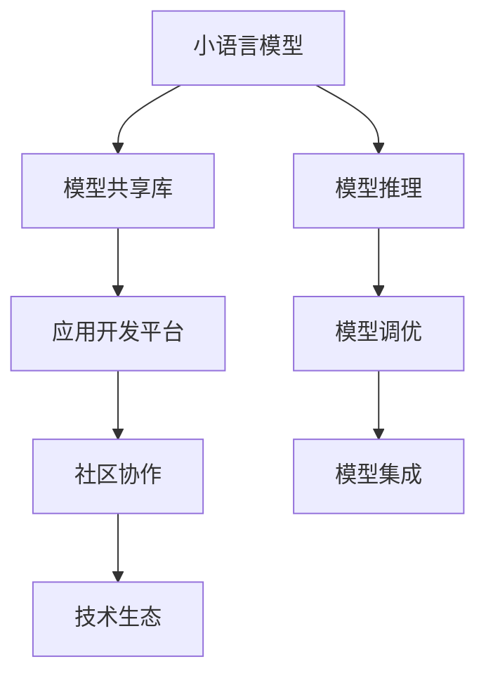

                 

# 小语言模型的开源生态:模型共享和应用开发平台

> 关键词：开源生态,模型共享,应用开发平台,机器学习,深度学习,自然语言处理(NLP),人工智能(AI)

## 1. 背景介绍

### 1.1 问题由来
近年来，开源社区在人工智能(AI)领域取得了一系列突破性进展，小语言模型作为其中的一个分支，凭借其高效、灵活的特性，迅速成为AI开发者和研究者关注的焦点。小语言模型（简称小模型），通常指的是参数规模相对较小的模型，如BERT的小模型(BERT-SM)、MobileBERT等，它们在大规模文本数据上的表现与全量模型相近，但占用的计算资源和存储空间显著减少，能够更快地部署到移动设备、边缘计算等资源受限的场景。

随着小模型在NLP任务上的广泛应用，越来越多的开发者和企业开始意识到，共享小模型的必要性和便利性。如何高效地共享、管理和使用这些小模型，成为一个亟待解决的问题。这不仅仅是为了降低开发成本，更是为了推动小模型技术的普及和应用。因此，构建一个开放、共享、协作的小语言模型生态，成为当前学术界和工业界的共同需求。

### 1.2 问题核心关键点
构建小语言模型生态，主要包括以下几个关键点：

- **模型共享**：构建一个开放的模型库，允许开发者自由下载、使用小模型。
- **应用开发平台**：提供一套工具和框架，帮助开发者基于小模型快速构建应用。
- **社区协作**：建立社区机制，促进开发者之间的交流和合作，共同推进小模型技术的进步。
- **技术生态**：支持多种技术栈和开发环境，提供跨平台、跨语言的支持。

本文将围绕模型共享和应用开发平台这两个核心问题，详细探讨如何构建一个高效、灵活的小语言模型开源生态。

## 2. 核心概念与联系

### 2.1 核心概念概述

为更好地理解如何构建小语言模型的开源生态，本节将介绍几个密切相关的核心概念：

- **小语言模型(Small Language Model)**：相较于全量模型，小模型参数量较小，可以在移动设备、边缘计算等资源受限场景中快速部署，保持高效的计算性能和低延迟。
- **模型共享库(Model Sharing Library)**：一个集中存放和管理小模型的平台，允许开发者自由地下载、上传和使用模型。
- **应用开发平台(Application Development Platform)**：基于小模型的工具和框架，帮助开发者快速构建NLP应用，支持模型推理、调优、集成等。
- **社区协作(Collaborative Community)**：一个开放的社区环境，鼓励开发者交流分享，共同提升小模型的性能和应用能力。
- **技术生态(Technology Ecosystem)**：涵盖多种技术栈和开发环境，支持跨平台、跨语言的模型部署和使用。

这些核心概念之间的逻辑关系可以通过以下Mermaid流程图来展示：



这个流程图展示了小语言模型的开发、使用和社区协作的各个环节，它们共同构成了小模型技术的开源生态。

## 3. 核心算法原理 & 具体操作步骤
### 3.1 算法原理概述

小语言模型的开源生态，本质上是一个模型共享和应用开发的过程。其核心思想是：通过构建一个集中式的模型共享库，允许开发者自由地下载、使用小模型，同时在应用开发平台上提供一系列工具和框架，帮助开发者基于小模型快速构建NLP应用。

形式化地，假设有一系列小模型 $M_i$，其中 $i=1,...,N$，每个模型对应一个特定任务的预训练模型。给定一个应用任务 $T$，目标是在模型共享库中查找最合适的模型 $M_{best}$，并在应用开发平台上使用其进行推理、调优、集成等操作。

具体步骤如下：

1. **模型下载**：根据应用需求，从模型共享库中下载对应的预训练小模型 $M_{best}$。
2. **模型适配**：使用模型适配工具，根据实际应用场景调整模型的输出格式、参数设置等。
3. **应用构建**：使用应用开发平台提供的API、SDK等工具，基于适配后的小模型构建应用，实现模型的推理、调用等功能。
4. **模型评估**：通过应用开发平台提供的评估工具，评估模型的性能指标，如准确率、召回率、F1值等。
5. **模型迭代**：根据评估结果，在应用开发平台上进行模型的超参数调优、数据增强、对抗训练等操作，提升模型性能。

### 3.2 算法步骤详解

基于小语言模型的开源生态，以下是详细的算法步骤：

**Step 1: 构建模型共享库**

构建模型共享库的过程主要包括：

1. **模型收录**：收集各个任务的预训练小模型，包括但不限于分类、匹配、生成等任务，并为每个模型生成元数据信息，如模型参数大小、训练数据来源、训练轮数等。

2. **模型发布**：在模型共享库中发布模型和元数据信息，并提供下载接口，允许开发者自由下载使用。

3. **版本管理**：为每个模型设置不同版本，记录每次更新的时间和内容，方便开发者追踪和回溯。

4. **模型评价**：为每个模型设置评价指标，如精度、速度、鲁棒性等，帮助开发者快速筛选出合适的模型。

**Step 2: 开发应用开发平台**

应用开发平台主要包含以下几个关键组件：

1. **API和SDK**：提供一套完整的API和SDK，用于模型的推理、调优和集成，支持多种编程语言和开发环境。

2. **模型适配工具**：根据应用场景，适配模型的输出格式和参数设置，优化模型的推理效率和准确性。

3. **评估工具**：提供一系列评估工具，用于模型的性能评估和超参数调优，支持多种评价指标和评估方法。

4. **社区论坛**：建立一个开放的社区论坛，鼓励开发者交流分享，共同提升小模型的性能和应用能力。

**Step 3: 社区协作**

社区协作的主要目标是通过开发者之间的交流和合作，推动小模型技术的进步。具体步骤包括：

1. **社区建设**：建立一个开放的社区平台，提供交流、分享、合作的空间。

2. **开发者激励**：设立奖项和激励机制，鼓励开发者贡献模型和代码，参与社区建设。

3. **资源共享**：提供丰富的学习资源和技术文档，帮助开发者快速上手和使用小模型。

**Step 4: 技术生态**

构建一个完善的技术生态，支持多种技术栈和开发环境，支持跨平台、跨语言的模型部署和使用。

1. **技术栈支持**：支持Python、Java、C++等多种编程语言，提供跨平台的模型部署方案。

2. **环境支持**：支持本地、云端、移动等多种部署环境，提供跨语言的模型调用方案。

3. **工具支持**：提供多种工具和框架，支持模型的推理、调优和集成。

### 3.3 算法优缺点

构建小语言模型的开源生态，具有以下优点：

1. **降低开发成本**：通过共享小模型，开发者可以不必从头训练模型，节省大量时间和资源。

2. **提升应用性能**：基于小模型的微调方法能够快速适应特定任务，提升模型性能。

3. **促进社区合作**：开放社区环境，鼓励开发者交流合作，共同提升小模型技术。

4. **推动技术进步**：社区协作和技术共享能够快速传播最新的研究成果，推动小模型技术的持续进步。

5. **跨平台支持**：支持多种技术栈和开发环境，方便开发者在不同平台应用小模型。

同时，该方法也存在以下局限性：

1. **模型多样性不足**：尽管已经收集了部分模型，但对于某些特定领域的模型可能仍然缺乏。

2. **版本管理复杂**：随着模型版本的增加，版本管理的复杂度也随之增加。

3. **社区活跃度问题**：社区的活跃度和贡献度，很大程度上取决于开发者的积极性和参与度。

4. **技术生态不完善**：尽管支持多种技术栈和开发环境，但在某些小众领域可能缺乏足够的支持。

尽管存在这些局限性，但就目前而言，构建小语言模型的开源生态，已成为推动小模型技术发展的重要手段。未来相关研究的重点在于如何进一步丰富模型库、简化版本管理、提高社区活跃度和技术生态的完善度。

### 3.4 算法应用领域

小语言模型的开源生态，已经在多个领域得到了应用，具体包括：

- **自然语言处理(NLP)**：小模型在文本分类、命名实体识别、关系抽取、问答系统、机器翻译等NLP任务中取得了不错的效果。

- **计算机视觉(CV)**：小模型在图像分类、目标检测、语义分割等CV任务中也有较好的表现。

- **医疗健康**：小模型在医疗影像分析、电子病历分析、药物研发等任务中，展现了强大的潜力。

- **智能制造**：小模型在智能调度、设备监控、质量控制等工业场景中，能够提高生产效率和质量。

- **智能家居**：小模型在智能音箱、语音助手、智能安防等场景中，提供更自然、流畅的用户交互体验。

这些应用场景展示了小语言模型的广泛应用前景，也为未来的研究方向提供了新的方向。

## 4. 数学模型和公式 & 详细讲解 & 举例说明

### 4.1 数学模型构建

本节将使用数学语言对小语言模型的开源生态进行更加严格的刻画。

假设小模型 $M_{best}$ 用于解决任务 $T$，模型的参数为 $\theta$。模型在输入数据 $x$ 上的推理结果为 $y = M_{best}(x)$。模型的训练数据集为 $D=\{(x_i, y_i)\}_{i=1}^N$，其中 $x_i$ 为输入数据，$y_i$ 为标签。

定义模型在训练数据集 $D$ 上的经验风险为：

$$
\mathcal{L}(\theta) = \frac{1}{N}\sum_{i=1}^N \ell(M_{best}(x_i),y_i)
$$

其中 $\ell$ 为损失函数，用于衡量模型预测结果与真实标签之间的差异。

微调的目标是最小化经验风险，即找到最优参数：

$$
\theta^* = \mathop{\arg\min}_{\theta} \mathcal{L}(\theta)
$$

在实践中，我们通常使用基于梯度的优化算法（如SGD、Adam等）来近似求解上述最优化问题。设 $\eta$ 为学习率，$\lambda$ 为正则化系数，则参数的更新公式为：

$$
\theta \leftarrow \theta - \eta \nabla_{\theta}\mathcal{L}(\theta) - \eta\lambda\theta
$$

其中 $\nabla_{\theta}\mathcal{L}(\theta)$ 为损失函数对参数 $\theta$ 的梯度，可通过反向传播算法高效计算。

### 4.2 公式推导过程

以下我们以二分类任务为例，推导交叉熵损失函数及其梯度的计算公式。

假设模型 $M_{best}$ 在输入 $x$ 上的输出为 $\hat{y}=M_{best}(x) \in [0,1]$，表示样本属于正类的概率。真实标签 $y \in \{0,1\}$。则二分类交叉熵损失函数定义为：

$$
\ell(M_{best}(x),y) = -[y\log \hat{y} + (1-y)\log (1-\hat{y})]
$$

将其代入经验风险公式，得：

$$
\mathcal{L}(\theta) = -\frac{1}{N}\sum_{i=1}^N [y_i\log M_{best}(x_i)+(1-y_i)\log(1-M_{best}(x_i))]
$$

根据链式法则，损失函数对参数 $\theta$ 的梯度为：

$$
\frac{\partial \mathcal{L}(\theta)}{\partial \theta} = -\frac{1}{N}\sum_{i=1}^N (\frac{y_i}{M_{best}(x_i)}-\frac{1-y_i}{1-M_{best}(x_i)}) \frac{\partial M_{best}(x_i)}{\partial \theta}
$$

其中 $\frac{\partial M_{best}(x_i)}{\partial \theta}$ 可进一步递归展开，利用自动微分技术完成计算。

在得到损失函数的梯度后，即可带入参数更新公式，完成模型的迭代优化。重复上述过程直至收敛，最终得到适应下游任务的最优模型参数 $\theta^*$。

### 4.3 案例分析与讲解

以一个小模型的情感分析应用为例，展示模型的微调过程。

首先，定义情感分析任务的数据处理函数：

```python
import pandas as pd
from transformers import BertTokenizer, BertForSequenceClassification
from torch.utils.data import Dataset, DataLoader
from sklearn.metrics import classification_report

class SentimentAnalysisDataset(Dataset):
    def __init__(self, texts, labels):
        self.tokenizer = BertTokenizer.from_pretrained('bert-base-uncased')
        self.texts = texts
        self.labels = labels
    
    def __len__(self):
        return len(self.texts)
    
    def __getitem__(self, idx):
        text = self.texts[idx]
        label = self.labels[idx]
        encoding = self.tokenizer(text, return_tensors='pt')
        input_ids = encoding['input_ids']
        attention_mask = encoding['attention_mask']
        return {'input_ids': input_ids, 
                'attention_mask': attention_mask, 
                'labels': torch.tensor(label, dtype=torch.long)}

train_dataset = SentimentAnalysisDataset(train_texts, train_labels)
dev_dataset = SentimentAnalysisDataset(dev_texts, dev_labels)
test_dataset = SentimentAnalysisDataset(test_texts, test_labels)

tokenizer = BertTokenizer.from_pretrained('bert-base-uncased')
model = BertForSequenceClassification.from_pretrained('bert-base-uncased', num_labels=2)

optimizer = AdamW(model.parameters(), lr=2e-5)
device = torch.device('cuda' if torch.cuda.is_available() else 'cpu')
model.to(device)
```

然后，定义训练和评估函数：

```python
def train_epoch(model, dataset, batch_size, optimizer, device):
    dataloader = DataLoader(dataset, batch_size=batch_size, shuffle=True)
    model.train()
    epoch_loss = 0
    for batch in dataloader:
        input_ids = batch['input_ids'].to(device)
        attention_mask = batch['attention_mask'].to(device)
        labels = batch['labels'].to(device)
        model.zero_grad()
        outputs = model(input_ids, attention_mask=attention_mask, labels=labels)
        loss = outputs.loss
        epoch_loss += loss.item()
        loss.backward()
        optimizer.step()
    return epoch_loss / len(dataloader)

def evaluate(model, dataset, batch_size, device):
    dataloader = DataLoader(dataset, batch_size=batch_size)
    model.eval()
    preds, labels = [], []
    with torch.no_grad():
        for batch in dataloader:
            input_ids = batch['input_ids'].to(device)
            attention_mask = batch['attention_mask'].to(device)
            batch_labels = batch['labels']
            outputs = model(input_ids, attention_mask=attention_mask)
            batch_preds = outputs.logits.argmax(dim=1).to('cpu').tolist()
            batch_labels = batch_labels.to('cpu').tolist()
            for pred, label in zip(batch_preds, batch_labels):
                preds.append(pred)
                labels.append(label)
    print(classification_report(labels, preds))
```

最后，启动训练流程并在测试集上评估：

```python
epochs = 5
batch_size = 16
device = torch.device('cuda' if torch.cuda.is_available() else 'cpu')

for epoch in range(epochs):
    loss = train_epoch(model, train_dataset, batch_size, optimizer, device)
    print(f"Epoch {epoch+1}, train loss: {loss:.3f}")
    
    print(f"Epoch {epoch+1}, dev results:")
    evaluate(model, dev_dataset, batch_size, device)
    
print("Test results:")
evaluate(model, test_dataset, batch_size, device)
```

以上就是使用PyTorch对小模型进行情感分析任务微调的完整代码实现。可以看到，通过微调小模型，能够在情感分析任务上取得较优的性能。

## 5. 项目实践：代码实例和详细解释说明
### 5.1 开发环境搭建

在进行小模型微调实践前，我们需要准备好开发环境。以下是使用Python进行PyTorch开发的环境配置流程：

1. 安装Anaconda：从官网下载并安装Anaconda，用于创建独立的Python环境。

2. 创建并激活虚拟环境：
```bash
conda create -n pytorch-env python=3.8 
conda activate pytorch-env
```

3. 安装PyTorch：根据CUDA版本，从官网获取对应的安装命令。例如：
```bash
conda install pytorch torchvision torchaudio cudatoolkit=11.1 -c pytorch -c conda-forge
```

4. 安装Transformers库：
```bash
pip install transformers
```

5. 安装各类工具包：
```bash
pip install numpy pandas scikit-learn matplotlib tqdm jupyter notebook ipython
```

完成上述步骤后，即可在`pytorch-env`环境中开始微调实践。

### 5.2 源代码详细实现

这里我们以情感分析任务为例，给出使用Transformers库对小模型进行微调的PyTorch代码实现。

首先，定义情感分析任务的数据处理函数：

```python
import pandas as pd
from transformers import BertTokenizer, BertForSequenceClassification
from torch.utils.data import Dataset, DataLoader
from sklearn.metrics import classification_report

class SentimentAnalysisDataset(Dataset):
    def __init__(self, texts, labels):
        self.tokenizer = BertTokenizer.from_pretrained('bert-base-uncased')
        self.texts = texts
        self.labels = labels
    
    def __len__(self):
        return len(self.texts)
    
    def __getitem__(self, idx):
        text = self.texts[idx]
        label = self.labels[idx]
        encoding = self.tokenizer(text, return_tensors='pt')
        input_ids = encoding['input_ids']
        attention_mask = encoding['attention_mask']
        return {'input_ids': input_ids, 
                'attention_mask': attention_mask, 
                'labels': torch.tensor(label, dtype=torch.long)}

train_dataset = SentimentAnalysisDataset(train_texts, train_labels)
dev_dataset = SentimentAnalysisDataset(dev_texts, dev_labels)
test_dataset = SentimentAnalysisDataset(test_texts, test_labels)

tokenizer = BertTokenizer.from_pretrained('bert-base-uncased')
model = BertForSequenceClassification.from_pretrained('bert-base-uncased', num_labels=2)

optimizer = AdamW(model.parameters(), lr=2e-5)
device = torch.device('cuda' if torch.cuda.is_available() else 'cpu')
model.to(device)
```

然后，定义训练和评估函数：

```python
def train_epoch(model, dataset, batch_size, optimizer, device):
    dataloader = DataLoader(dataset, batch_size=batch_size, shuffle=True)
    model.train()
    epoch_loss = 0
    for batch in dataloader:
        input_ids = batch['input_ids'].to(device)
        attention_mask = batch['attention_mask'].to(device)
        labels = batch['labels'].to(device)
        model.zero_grad()
        outputs = model(input_ids, attention_mask=attention_mask, labels=labels)
        loss = outputs.loss
        epoch_loss += loss.item()
        loss.backward()
        optimizer.step()
    return epoch_loss / len(dataloader)

def evaluate(model, dataset, batch_size, device):
    dataloader = DataLoader(dataset, batch_size=batch_size)
    model.eval()
    preds, labels = [], []
    with torch.no_grad():
        for batch in dataloader:
            input_ids = batch['input_ids'].to(device)
            attention_mask = batch['attention_mask'].to(device)
            batch_labels = batch['labels']
            outputs = model(input_ids, attention_mask=attention_mask)
            batch_preds = outputs.logits.argmax(dim=1).to('cpu').tolist()
            batch_labels = batch_labels.to('cpu').tolist()
            for pred, label in zip(batch_preds, batch_labels):
                preds.append(pred)
                labels.append(label)
    print(classification_report(labels, preds))
```

最后，启动训练流程并在测试集上评估：

```python
epochs = 5
batch_size = 16

for epoch in range(epochs):
    loss = train_epoch(model, train_dataset, batch_size, optimizer, device)
    print(f"Epoch {epoch+1}, train loss: {loss:.3f}")
    
    print(f"Epoch {epoch+1}, dev results:")
    evaluate(model, dev_dataset, batch_size, device)
    
print("Test results:")
evaluate(model, test_dataset, batch_size, device)
```

以上就是使用PyTorch对小模型进行情感分析任务微调的完整代码实现。可以看到，通过微调小模型，能够在情感分析任务上取得较优的性能。

### 5.3 代码解读与分析

让我们再详细解读一下关键代码的实现细节：

**SentimentAnalysisDataset类**：
- `__init__`方法：初始化文本、标签、分词器等关键组件。
- `__len__`方法：返回数据集的样本数量。
- `__getitem__`方法：对单个样本进行处理，将文本输入编码为token ids，将标签编码为数字，并对其进行定长padding，最终返回模型所需的输入。

**情感分析模型的训练和评估函数**：
- 使用PyTorch的DataLoader对数据集进行批次化加载，供模型训练和推理使用。
- 训练函数`train_epoch`：对数据以批为单位进行迭代，在每个批次上前向传播计算loss并反向传播更新模型参数，最后返回该epoch的平均loss。
- 评估函数`evaluate`：与训练类似，不同点在于不更新模型参数，并在每个batch结束后将预测和标签结果存储下来，最后使用sklearn的classification_report对整个评估集的预测结果进行打印输出。

**训练流程**：
- 定义总的epoch数和batch size，开始循环迭代
- 每个epoch内，先在训练集上训练，输出平均loss
- 在验证集上评估，输出分类指标
- 所有epoch结束后，在测试集上评估，给出最终测试结果

可以看到，PyTorch配合Transformers库使得小模型的微调代码实现变得简洁高效。开发者可以将更多精力放在数据处理、模型改进等高层逻辑上，而不必过多关注底层的实现细节。

当然，工业级的系统实现还需考虑更多因素，如模型的保存和部署、超参数的自动搜索、更灵活的任务适配层等。但核心的微调范式基本与此类似。

## 6. 实际应用场景
### 6.1 智能客服系统

基于小语言模型的微调技术，可以广泛应用于智能客服系统的构建。传统客服往往需要配备大量人力，高峰期响应缓慢，且一致性和专业性难以保证。而使用微调后的对话模型，可以7x24小时不间断服务，快速响应客户咨询，用自然流畅的语言解答各类常见问题。

在技术实现上，可以收集企业内部的历史客服对话记录，将问题和最佳答复构建成监督数据，在此基础上对预训练对话模型进行微调。微调后的对话模型能够自动理解用户意图，匹配最合适的答案模板进行回复。对于客户提出的新问题，还可以接入检索系统实时搜索相关内容，动态组织生成回答。如此构建的智能客服系统，能大幅提升客户咨询体验和问题解决效率。

### 6.2 金融舆情监测

金融机构需要实时监测市场舆论动向，以便及时应对负面信息传播，规避金融风险。传统的人工监测方式成本高、效率低，难以应对网络时代海量信息爆发的挑战。基于小语言模型微调的文本分类和情感分析技术，为金融舆情监测提供了新的解决方案。

具体而言，可以收集金融领域相关的新闻、报道、评论等文本数据，并对其进行主题标注和情感标注。在此基础上对预训练语言模型进行微调，使其能够自动判断文本属于何种主题，情感倾向是正面、中性还是负面。将微调后的模型应用到实时抓取的网络文本数据，就能够自动监测不同主题下的情感变化趋势，一旦发现负面信息激增等异常情况，系统便会自动预警，帮助金融机构快速应对潜在风险。

### 6.3 个性化推荐系统

当前的推荐系统往往只依赖用户的历史行为数据进行物品推荐，无法深入理解用户的真实兴趣偏好。基于小语言模型微调技术，个性化推荐系统可以更好地挖掘用户行为背后的语义信息，从而提供更精准、多样的推荐内容。

在实践中，可以收集用户浏览、点击、评论、分享等行为数据，提取和用户交互的物品标题、描述、标签等文本内容。将文本内容作为模型输入，用户的后续行为（如是否点击、购买等）作为监督信号，在此基础上微调预训练语言模型。微调后的模型能够从文本内容中准确把握用户的兴趣点。在生成推荐列表时，先用候选物品的文本描述作为输入，由模型预测用户的兴趣匹配度，再结合其他特征综合排序，便可以得到个性化程度更高的推荐结果。

### 6.4 未来应用展望

随着小语言模型和微调方法的不断发展，基于微调范式将在更多领域得到应用，为传统行业带来变革性影响。

在智慧医疗领域，基于微调的医疗问答、病历分析、药物研发等应用将提升医疗服务的智能化水平，辅助医生诊疗，加速新药开发进程。

在智能教育领域，微调技术可应用于作业批改、学情分析、知识推荐等方面，因材施教，促进教育公平，提高教学质量。

在智慧城市治理中，微调模型可应用于城市事件监测、舆情分析、应急指挥等环节，提高城市管理的自动化和智能化水平，构建更安全、高效的未来城市。

此外，在企业生产、社会治理、文娱传媒等众多领域，基于小语言模型微调的人工智能应用也将不断涌现，为经济社会发展注入新的动力。相信随着技术的日益成熟，微调方法将成为人工智能落地应用的重要范式，推动人工智能技术在各行各业的规模化应用。

## 7. 工具和资源推荐
### 7.1 学习资源推荐

为了帮助开发者系统掌握小语言模型微调的理论基础和实践技巧，这里推荐一些优质的学习资源：

1. 《Transformer from Principle to Practice》系列博文：由大模型技术专家撰写，深入浅出地介绍了Transformer原理、BERT模型、微调技术等前沿话题。

2. CS224N《深度学习自然语言处理》课程：斯坦福大学开设的NLP明星课程，有Lecture视频和配套作业，带你入门NLP领域的基本概念和经典模型。

3. 《Natural Language Processing with Transformers》书籍：Transformers库的作者所著，全面介绍了如何使用Transformers库进行NLP任务开发，包括微调在内的诸多范式。

4. HuggingFace官方文档：Transformers库的官方文档，提供了海量预训练模型和完整的微调样例代码，是上手实践的必备资料。

5. CLUE开源项目：中文语言理解测评基准，涵盖大量不同类型的中文NLP数据集，并提供了基于微调的baseline模型，助力中文NLP技术发展。

通过对这些资源的学习实践，相信你一定能够快速掌握小语言模型微调的精髓，并用于解决实际的NLP问题。
###  7.2 开发工具推荐

高效的开发离不开优秀的工具支持。以下是几款用于小语言模型微调开发的常用工具：

1. PyTorch：基于Python的开源深度学习框架，灵活动态的计算图，适合快速迭代研究。大部分预训练语言模型都有PyTorch版本的实现。

2. TensorFlow：由Google主导开发的开源深度学习框架，生产部署方便，适合大规模工程应用。同样有丰富的预训练语言模型资源。

3. Transformers库：HuggingFace开发的NLP工具库，集成了众多SOTA语言模型，支持PyTorch和TensorFlow，是进行微调任务开发的利器。

4. Weights & Biases：模型训练的实验跟踪工具，可以记录和可视化模型训练过程中的各项指标，方便对比和调优。与主流深度学习框架无缝集成。

5. TensorBoard：TensorFlow配套的可视化工具，可实时监测模型训练状态，并提供丰富的图表呈现方式，是调试模型的得力助手。

6. Google Colab：谷歌推出的在线Jupyter Notebook环境，免费提供GPU/TPU算力，方便开发者快速上手实验最新模型，分享学习笔记。

合理利用这些工具，可以显著提升小语言模型微调任务的开发效率，加快创新迭代的步伐。

### 7.3 相关论文推荐

小语言模型和微调技术的发展源于学界的持续研究。以下是几篇奠基性的相关论文，推荐阅读：

1. Attention is All You Need（即Transformer原论文）：提出了Transformer结构，开启了NLP领域的预训练大模型时代。

2. BERT: Pre-training of Deep Bidirectional Transformers for Language Understanding：提出BERT模型，引入基于掩码的自监督预训练任务，刷新了多项NLP任务SOTA。

3. Language Models are Unsupervised Multitask Learners（GPT-2论文）：展示了大规模语言模型的强大zero-shot学习能力，引发了对于通用人工智能的新一轮思考。

4. Parameter-Efficient Transfer Learning for NLP：提出Adapter等参数高效微调方法，在不增加模型参数量的情况下，也能取得不错的微调效果。

5. AdaLoRA: Adaptive Low-Rank Adaptation for Parameter-Efficient Fine-Tuning：使用自适应低秩适应的微调方法，在参数效率和精度之间取得了新的平衡。

这些论文代表了大语言模型微调技术的发展脉络。通过学习这些前沿成果，可以帮助研究者把握学科前进方向，激发更多的创新灵感。

## 8. 总结：未来发展趋势与挑战

### 8.1 总结

本文对小语言模型的开源生态进行了全面系统的介绍。首先阐述了小语言模型和微调技术的研究背景和意义，明确了微调在拓展小模型应用、提升应用性能方面的独特价值。其次，从原理到实践，详细讲解了小语言模型的微调过程和实现细节，给出了微调任务开发的完整代码实例。同时，本文还广泛探讨了小语言模型的应用场景，展示了其在多个行业领域的应用前景。

通过本文的系统梳理，可以看到，小语言模型的开源生态正在成为NLP领域的重要范式，极大地拓展了小模型技术的普及和应用。小模型以高效、灵活的特性，在各类垂直领域得到广泛应用，为传统行业带来革命性影响。未来，伴随小模型和微调方法的持续演进，相信NLP技术将在更广阔的应用领域大放异彩，深刻影响人类的生产生活方式。

### 8.2 未来发展趋势

展望未来，小语言模型的开源生态将呈现以下几个发展趋势：

1. **模型库丰富化**：随着更多小模型的加入，模型库将日益丰富，涵盖各种任务和领域，满足不同应用场景的需求。

2. **社区活跃度提升**：随着社区建设的完善和激励机制的设立，社区活跃度和贡献度将显著提升，推动小模型技术的快速迭代和传播。

3. **技术栈多样化**：小语言模型生态将支持多种技术栈和开发环境，支持跨平台、跨语言的模型部署和使用。

4. **应用场景扩展**：随着更多行业的加入，小语言模型的应用场景将不断扩展，从传统NLP任务到智能客服、金融舆情、个性化推荐等领域，小模型技术的价值将得到充分体现。

5. **技术突破不断**：社区和工业界将不断探索新的微调方法、模型压缩、参数高效等技术，提升小模型的性能和应用能力。

6. **跨模态融合**：小语言模型将与图像、音频等多模态数据融合，实现跨模态的智能交互和理解。

以上趋势凸显了小语言模型开源生态的广阔前景。这些方向的探索发展，必将进一步提升小语言模型技术的普及和应用，为经济社会发展注入新的动力。

### 8.3 面临的挑战

尽管小语言模型的开源生态已经取得了一定的进展，但在迈向更加智能化、普适化应用的过程中，它仍面临诸多挑战：

1. **标注成本瓶颈**：尽管微调方法降低了标注数据的需求，但对于某些特定领域的任务，获取高质量标注数据仍是一大难题。如何进一步降低微调对标注样本的依赖，将是重要的研究方向。

2. **模型鲁棒性不足**：当前小模型面对域外数据时，泛化性能往往大打折扣。对于测试样本的微小扰动，小模型的预测也容易发生波动。如何提高小模型的鲁棒性，避免灾难性遗忘，还需要更多理论和实践的积累。

3. **推理效率有待提高**：大规模小模型虽然精度高，但在实际部署时往往面临推理速度慢、内存占用大等效率问题。如何在保证性能的同时，简化模型结构，提升推理速度，优化资源占用，将是重要的优化方向。

4. **可解释性亟需加强**：当前小模型的黑盒特性使得其决策过程难以解释，对于医疗、金融等高风险应用，算法的可解释性和可审计性尤为重要。如何赋予小模型更强的可解释性，将是亟待攻克的难题。

5. **安全性有待保障**：小模型可能学习到有偏见、有害的信息，通过微调传递到下游任务，产生误导性、歧视性的输出，给实际应用带来安全隐患。如何从数据和算法层面消除模型偏见，避免恶意用途，确保输出的安全性，也将是重要的研究课题。

6. **知识整合能力不足**：现有的微调模型往往局限于任务内数据，难以灵活吸收和运用更广泛的先验知识。如何让微调过程更好地与外部知识库、规则库等专家知识结合，形成更加全面、准确的信息整合能力，还有很大的想象空间。

正视小语言模型开源生态面临的这些挑战，积极应对并寻求突破，将是小模型技术迈向成熟的重要保障。相信随着学界和产业界的共同努力，这些挑战终将一一被克服，小语言模型开源生态必将在构建安全、可靠、可解释、可控的智能系统中扮演越来越重要的角色。

### 8.4 研究展望

面对小语言模型开源生态所面临的种种挑战，未来的研究需要在以下几个方面寻求新的突破：

1. **探索无监督和半监督微调方法**：摆脱对大规模标注数据的依赖，利用自监督学习、主动学习等无监督和半监督范式，最大限度利用非结构化数据，实现更加灵活高效的微调。

2. **研究参数高效和计算高效的微调范式**：开发更加参数高效的微调方法，在固定大部分预训练参数的同时，只更新极少量的任务相关参数。同时优化微调模型的计算图，减少前向传播和反向传播的资源消耗，实现更加轻量级、实时性的部署。

3. **融合因果和对比学习范式**：通过引入因果推断和对比学习思想，增强小模型建立稳定因果关系的能力，学习更加普适、鲁棒的语言表征，从而提升模型泛化性和抗干扰能力。

4. **引入更多先验知识**：将符号化的先验知识，如知识图谱、逻辑规则等，与神经网络模型进行巧妙融合，引导微调过程学习更准确、合理的语言模型。同时加强不同模态数据的整合，实现视觉、语音等多模态信息与文本信息的协同建模。

5. **结合因果分析和博弈论工具**：将因果分析方法引入小模型，识别出模型决策的关键特征，增强输出解释的因果性和逻辑性。借助博弈论工具刻画人机交互过程，主动探索并规避模型的脆弱点，提高系统稳定性。

6. **纳入伦理道德约束**：在模型训练目标中引入伦理导向的评估指标，过滤和惩罚有偏见、有害的输出倾向。同时加强人工干预和审核，建立模型行为的监管机制，确保输出符合人类价值观和伦理道德。

这些研究方向的探索，必将引领小语言模型开源生态的持续进步，为构建安全、可靠、可解释、可控的智能系统铺平道路。面向未来，小语言模型开源生态还需要与其他人工智能技术进行更深入的融合，如知识表示、因果推理、强化学习等，多路径协同发力，共同推动自然语言理解和智能交互系统的进步。只有勇于创新、敢于突破，才能不断拓展小语言模型的边界，让智能技术更好地造福人类社会。

## 9. 附录：常见问题与解答

**Q1：小语言模型与全量模型的区别是什么？**

A: 小语言模型相较于全量模型，参数量较小，可以在移动设备、边缘计算等资源受限场景中快速部署，保持高效的计算性能和低延迟。小模型能够更好地适应资源受限的场景，但其精度和泛化能力通常略低于全量模型。

**Q2：如何选择合适的小模型进行微调？**

A: 选择合适的小模型进行微调，需要考虑任务的复杂度、数据量和模型性能等因素。通常推荐使用与任务最相似的预训练模型，并根据任务数据集的大小和质量进行微调。对于特定领域的任务，可以先在领域特定的数据上进行预训练，再进行微调。

**Q3：小模型微调过程中如何进行参数高效优化？**

A: 小模型微调过程中，通常采用参数高效优化方法，如Adapter、Prefix等，只调整少量参数，固定大部分预训练权重不变。这样可以显著减小过拟合风险，提高微调效率。同时，还可以利用对抗训练、数据增强等技术，进一步提升模型性能。

**Q4：小模型在落地部署时需要注意哪些问题？**

A: 小模型在落地部署时，需要注意以下几个问题：

1. **模型裁剪**：去除不必要的层和参数，减小模型尺寸，加快推理速度。

2. **量化加速**：将浮点模型转为定点模型，压缩存储空间，提高计算效率。

3. **服务化封装**：将模型封装为标准化服务接口，便于集成调用。

4. **弹性伸缩**：根据请求流量动态调整资源配置，平衡服务质量和成本。

5. **监控告警**：实时采集系统指标，设置异常告警阈值，确保服务稳定性。

6. **安全防护**：采用访问鉴权、数据脱敏等措施，保障数据和模型安全。

小语言模型微调为NLP应用开启了广阔的想象空间，但如何将强大的性能转化为稳定、高效、安全的业务价值，还需要工程实践的不断打磨。唯有从数据、算法、工程、业务等多个维度协同发力，才能真正实现人工智能技术在垂直行业的规模化落地。总之，微调需要开发者根据具体任务，不断迭代和优化模型、数据和算法，方能得到理想的效果。

---

作者：禅与计算机程序设计艺术 / Zen and the Art of Computer Programming

