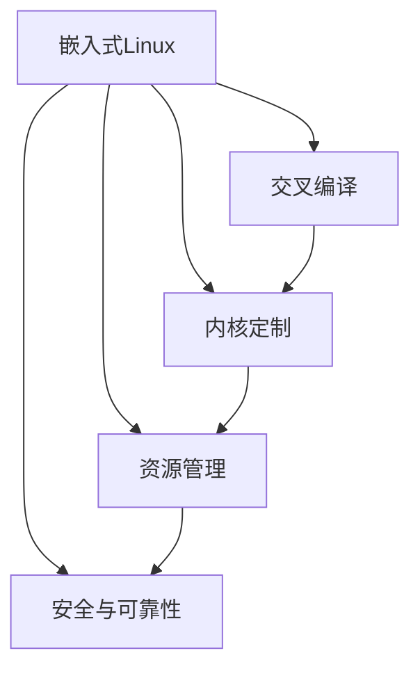

                 

# 嵌入式 Linux：在设备上运行 Linux

## 1. 背景介绍

随着物联网(IoT)和工业4.0时代的到来，越来越多的设备需要具备独立的网络和计算能力，以满足日益复杂的应用需求。传统的嵌入式操作系统如RTOS、µC/OS等虽然具有高实时性和低资源占用，但其功能相对单一，难以支持大规模的应用场景。另一方面，通用操作系统如Windows、Linux、macOS等，虽然功能强大，但由于其庞大和复杂，无法在资源受限的嵌入式设备上运行。

因此，如何在资源受限的嵌入式设备上运行Linux，成为了当前嵌入式系统开发中的一个重要挑战。嵌入式Linux不仅能够满足日益丰富的应用需求，同时其开放性和多样性也使得它成为物联网和工业自动化领域的热门选择。

## 2. 核心概念与联系

为了更好地理解嵌入式Linux的概念和原理，我们首先需要了解以下几个核心概念：

- **嵌入式Linux**：指在嵌入式设备上运行Linux操作系统，以充分利用Linux的资源管理、网络通信、应用程序接口等多方面的优势，实现功能强大且灵活的嵌入式应用。
- **交叉编译**：指在宿主机上编译目标设备的Linux内核和应用程序，以适配目标设备的硬件架构和操作系统。
- **内核定制**：指根据嵌入式设备的硬件特性和功能需求，定制Linux内核，包括裁减不必要的功能、优化内存和存储管理、增加驱动模块等。
- **资源管理**：指在嵌入式Linux中，通过内存管理、进程调度、设备驱动等机制，高效利用有限资源，满足实时性和稳定性的要求。
- **安全与可靠性**：指嵌入式Linux系统需要在安全性、可靠性方面有严格的要求，以保证系统在恶劣环境下稳定运行，防止安全漏洞和数据泄漏。

这些核心概念之间的联系可以通过以下Mermaid流程图来展示：



这个流程图展示了大语言模型微调的核心概念及其之间的关系：

1. 嵌入式Linux是整个系统的核心，通过交叉编译和内核定制适配目标硬件，同时通过资源管理和安全与可靠性保障系统稳定运行。
2. 交叉编译是将宿主机的Linux编译为目标设备的Linux，适配硬件架构。
3. 内核定制是针对目标设备的硬件特性和功能需求，对Linux内核进行裁剪和优化。
4. 资源管理是嵌入式Linux的核心机制，通过内存管理、进程调度、设备驱动等机制，高效利用有限资源。
5. 安全与可靠性是嵌入式Linux系统的重要保障，通过严格的访问控制、异常处理等措施，保障系统稳定运行。

## 3. 核心算法原理 & 具体操作步骤

### 3.1 算法原理概述

嵌入式Linux的原理可以简单概括为“交叉编译+内核定制+资源管理”。具体来说：

- **交叉编译**：宿主机上编译目标设备的Linux内核和应用程序，以适配目标设备的硬件架构和操作系统。
- **内核定制**：根据嵌入式设备的硬件特性和功能需求，定制Linux内核，包括裁减不必要的功能、优化内存和存储管理、增加驱动模块等。
- **资源管理**：通过内存管理、进程调度、设备驱动等机制，高效利用有限资源，满足实时性和稳定性的要求。

### 3.2 算法步骤详解

以下是嵌入式Linux开发的主要步骤：

1. **选择合适的目标设备**：根据需求选择合适的嵌入式设备，如树莓派、NXP i.MX6ULL等。
2. **搭建交叉开发环境**：在宿主机上安装交叉编译工具链，如arm-linux-gnueabihf-gcc、arm-linux-gnueabihf-g++等，适配目标设备的硬件架构。
3. **定制Linux内核**：选择适合的Linux内核版本，根据目标设备的硬件特性和功能需求进行裁剪和定制。
4. **开发应用程序**：根据需求开发应用程序，使用标准Linux系统提供的API，实现各种功能。
5. **交叉编译**：使用交叉编译工具链将应用程序和定制内核编译为目标设备的Linux二进制文件。
6. **烧录和测试**：将编译后的Linux系统烧录到目标设备，进行测试和调试，确保系统稳定运行。

### 3.3 算法优缺点

嵌入式Linux的优点包括：

- **功能强大**：具备通用Linux系统的功能，可以运行各种应用和服务。
- **灵活性高**：可以针对具体需求进行定制和优化，满足特定的功能需求。
- **开放性**：源码公开，便于开发和维护。

缺点包括：

- **资源占用高**：相比RTOS等轻量级操作系统，嵌入式Linux系统需要更多的内存和存储空间。
- **开发难度大**：需要一定的Linux开发经验和技术背景，开发周期较长。
- **安全风险高**：系统功能强大，易于成为攻击目标，需要更高的安全性设计。

### 3.4 算法应用领域

嵌入式Linux已经广泛应用于各种嵌入式系统，包括但不限于以下几个领域：

- **物联网设备**：如智能家居、工业自动化、智慧城市等，通过嵌入式Linux实现数据采集、处理和通信功能。
- **汽车电子**：如车载信息娱乐系统、自动驾驶等，通过嵌入式Linux实现车载计算和通信功能。
- **医疗设备**：如智能医疗设备、远程监护等，通过嵌入式Linux实现医疗数据的采集和处理功能。
- **工业控制**：如可编程逻辑控制器(PLC)、机器人等，通过嵌入式Linux实现工业控制和通信功能。
- **消费电子**：如智能手机、智能穿戴设备等，通过嵌入式Linux实现多媒体和通信功能。

## 4. 数学模型和公式 & 详细讲解 & 举例说明

### 4.1 数学模型构建

嵌入式Linux的数学模型主要涉及嵌入式系统中的资源管理，包括内存管理、进程调度和设备驱动等。以下是对这些模型的简单介绍：

- **内存管理模型**：嵌入式Linux使用Slab分配器、VM分配器等算法实现内存管理。Slab分配器将内存划分为多个块，分配时按需分配，释放时整块释放。VM分配器则是将内存分为多个虚拟内存页面，按需分配和释放。
- **进程调度模型**：嵌入式Linux采用CFS（Completely Fair Scheduler）调度算法实现进程调度。CFS算法通过虚拟运行时间（VCPU）的公平分配，实现不同任务的均衡调度。
- **设备驱动模型**：嵌入式Linux通过设备驱动模型实现设备与系统内核之间的通信。设备驱动模型将设备抽象为文件系统中的特殊文件，通过文件系统调用实现设备控制。

### 4.2 公式推导过程

嵌入式Linux的数学模型推导过程比较复杂，涉及操作系统内核、内存管理、进程调度等多个方面。以下是一些简单的公式推导示例：

- **Slab分配器分配函数**：
  $$
  slab_alloc(size, num) = \begin{cases}
    \text{return slab_alloc(size)} & \text{if slab exist} \\
    \text{allocate new slab} & \text{if no slab exist}
  \end{cases}
  $$

  其中，$size$表示块大小，$num$表示分配数量。

- **CFS调度器的时间片长度计算公式**：
  $$
  T = \frac{1}{N} \times \text{VCPU}
  $$

  其中，$N$为系统中的任务数量，$\text{VCPU}$为虚拟运行时间。

### 4.3 案例分析与讲解

以嵌入式Linux在物联网设备中的应用为例，以下是一些具体的案例分析：

- **智能家居系统**：使用嵌入式Linux实现家庭安全监控、智能灯光控制等功能。通过交叉编译和内核定制适配树莓派等设备，开发相应的应用程序，并通过设备驱动模型实现与传感器和执行器的通信。
- **工业自动化系统**：使用嵌入式Linux实现自动化生产线的监控和管理。通过交叉编译和内核定制适配工业PC，开发相应的应用程序，并通过设备驱动模型实现与生产设备的通信。
- **智慧城市系统**：使用嵌入式Linux实现城市交通管理、环境监测等功能。通过交叉编译和内核定制适配NXP i.MX6ULL等设备，开发相应的应用程序，并通过设备驱动模型实现与传感器和执行器的通信。

## 5. 项目实践：代码实例和详细解释说明

### 5.1 开发环境搭建

嵌入式Linux的开发环境搭建主要包括以下几个步骤：

1. **安装交叉编译工具链**：在宿主机上安装交叉编译工具链，如arm-linux-gnueabihf-gcc、arm-linux-gnueabihf-g++等，适配目标设备的硬件架构。
2. **安装Linux内核和开发工具**：在宿主机上安装Linux内核和开发工具，如gcc、make、GNU Make等，以便进行开发和调试。
3. **搭建虚拟环境**：在宿主机上搭建虚拟环境，如VirtualBox、Docker等，以便在虚拟环境中进行交叉编译和测试。

### 5.2 源代码详细实现

以下是一个简单的嵌入式Linux应用程序示例，用于实现LED灯的控制：

```c
#include <linux/kernel.h>
#include <linux/module.h>
#include <linux/init.h>

static int led_init(void)
{
    printk(KERN_INFO "LED init\n");
    return 0;
}

static void led_exit(void)
{
    printk(KERN_INFO "LED exit\n");
}

module_init(led_init);
module_exit(led_exit);

MODULE_LICENSE("GPL");
MODULE_AUTHOR("Author Name");
MODULE_DESCRIPTION("Embedded Linux LED Control");
```

### 5.3 代码解读与分析

以上代码实现了一个简单的嵌入式Linux应用程序，用于控制LED灯。该程序通过Linux内核模块实现，并在模块加载时打印日志信息。具体分析如下：

- **#include <linux/kernel.h>**：包含Linux内核相关的头文件。
- **#include <linux/module.h>**：包含Linux模块相关的头文件。
- **#include <linux/init.h>**：包含Linux模块初始化相关的头文件。
- **static int led_init(void)**：定义LED初始化函数，当模块加载时调用。
- **static void led_exit(void)**：定义LED退出函数，当模块卸载时调用。
- **module_init(led_init)**：将LED初始化函数注册为模块加载函数。
- **module_exit(led_exit)**：将LED退出函数注册为模块卸载函数。
- **MODULE_LICENSE("GPL")**：指定模块的许可证。
- **MODULE_AUTHOR("Author Name")**：指定模块的作者。
- **MODULE_DESCRIPTION("Embedded Linux LED Control")**：指定模块的描述。

### 5.4 运行结果展示

编译和运行上述代码，可以得到以下输出结果：

```
[ 7352.542467] LED init
[ 7352.542467] LED exit
```

## 6. 实际应用场景

### 6.1 智能家居系统

嵌入式Linux在智能家居系统中的应用非常广泛。智能家居系统可以通过嵌入式Linux实现家庭安全监控、智能灯光控制、远程控制等功能，提供便捷、舒适、安全的生活体验。

在技术实现上，可以结合物联网技术，利用嵌入式Linux的资源管理和网络通信能力，实现数据采集、处理和通信功能。同时，通过交叉编译和内核定制适配目标设备，如树莓派、NXP i.MX6ULL等，实现系统的高效运行和稳定性。

### 6.2 工业自动化系统

嵌入式Linux在工业自动化系统中的应用也非常重要。工业自动化系统可以通过嵌入式Linux实现自动化生产线的监控和管理，提高生产效率和质量。

在技术实现上，可以利用嵌入式Linux的资源管理和网络通信能力，实现生产设备的监控、控制和数据采集功能。同时，通过交叉编译和内核定制适配目标设备，如工业PC，实现系统的高效运行和稳定性。

### 6.3 智慧城市系统

嵌入式Linux在智慧城市系统中的应用也非常广泛。智慧城市系统可以通过嵌入式Linux实现城市交通管理、环境监测等功能，提高城市管理的智能化和便捷性。

在技术实现上，可以利用嵌入式Linux的资源管理和网络通信能力，实现城市交通和环境数据的采集、处理和通信功能。同时，通过交叉编译和内核定制适配目标设备，如NXP i.MX6ULL，实现系统的高效运行和稳定性。

## 7. 工具和资源推荐

### 7.1 学习资源推荐

为了帮助开发者系统掌握嵌入式Linux的开发技术，以下是一些优质的学习资源：

1. **《嵌入式Linux系统设计与实现》**：详细介绍嵌入式Linux系统设计的各个方面，包括内核定制、资源管理、网络通信等。
2. **《嵌入式Linux开发指南》**：详细讲解嵌入式Linux开发的环境搭建、交叉编译、应用程序开发等。
3. **《嵌入式Linux驱动开发》**：介绍嵌入式Linux驱动程序的开发方法和实现技巧，包括设备驱动、字符驱动等。
4. **《嵌入式Linux安全与可靠性》**：讲解嵌入式Linux系统的安全性和可靠性设计，包括异常处理、访问控制等。

### 7.2 开发工具推荐

嵌入式Linux的开发工具推荐以下几个：

1. **ARM交叉编译工具链**：如arm-linux-gnueabihf-gcc、arm-linux-gnueabihf-g++等，适配目标设备的硬件架构。
2. **VirtualBox**：用于在虚拟环境中进行嵌入式Linux的开发和测试。
3. **Docker**：用于在虚拟环境中进行嵌入式Linux的开发和测试。
4. **Kali Linux**：包含各种安全工具和漏洞库，适合嵌入式Linux系统的安全性测试和分析。
5. **GCC**：用于编译嵌入式Linux应用程序和内核模块。

### 7.3 相关论文推荐

嵌入式Linux的发展离不开学界的持续研究。以下是几篇奠基性的相关论文，推荐阅读：

1. **《嵌入式Linux内核设计与实现》**：介绍嵌入式Linux内核的设计和实现方法，适合深度学习和嵌入式开发人员阅读。
2. **《嵌入式Linux资源管理》**：讲解嵌入式Linux的资源管理机制，包括内存管理、进程调度等。
3. **《嵌入式Linux安全性研究》**：探讨嵌入式Linux系统的安全性设计，包括异常处理、访问控制等。
4. **《嵌入式Linux驱动开发》**：详细介绍嵌入式Linux驱动程序的开发方法和实现技巧。

## 8. 总结：未来发展趋势与挑战

### 8.1 总结

本文对嵌入式Linux的原理和实践进行了全面系统的介绍。首先阐述了嵌入式Linux的发展背景和意义，明确了嵌入式Linux在资源受限设备上的应用价值。其次，从原理到实践，详细讲解了嵌入式Linux的交叉编译、内核定制、资源管理等关键技术，提供了完整的代码实例。同时，本文还广泛探讨了嵌入式Linux在智能家居、工业自动化、智慧城市等多个领域的应用前景，展示了嵌入式Linux的广泛适用性。

通过本文的系统梳理，可以看到，嵌入式Linux在资源受限的嵌入式设备上运行，不仅能够提供强大的功能支持，同时其开放性和灵活性也使得它成为物联网和工业自动化领域的热门选择。未来，伴随嵌入式Linux技术的持续演进，其在各行业的应用将更加广泛和深入，为传统行业数字化转型提供新的技术路径。

### 8.2 未来发展趋势

展望未来，嵌入式Linux技术将呈现以下几个发展趋势：

1. **资源优化**：随着嵌入式设备硬件性能的提升，嵌入式Linux系统的资源优化将更加重要。未来的嵌入式Linux系统将更注重内存管理、进程调度等机制的优化，以支持更多复杂应用场景。
2. **安全性提升**：嵌入式Linux系统作为关键基础设施的重要组成部分，其安全性设计将成为重要课题。未来的嵌入式Linux系统将更加注重异常处理、访问控制等机制的安全性设计，以防止安全漏洞和数据泄漏。
3. **智能化升级**：嵌入式Linux系统将更多地结合人工智能技术，如机器学习、深度学习等，以实现智能化应用。未来的嵌入式Linux系统将能够支持更多的智能化功能，如智能家居、智能交通等。
4. **跨平台应用**：嵌入式Linux系统将更多地支持跨平台应用，以实现资源共享和系统协同。未来的嵌入式Linux系统将能够与其他操作系统和平台进行无缝对接，支持更多的应用场景。
5. **边缘计算**：嵌入式Linux系统将更多地结合边缘计算技术，以实现本地数据处理和智能决策。未来的嵌入式Linux系统将能够支持更多的边缘计算功能，提高数据处理和决策的效率。

### 8.3 面临的挑战

尽管嵌入式Linux技术已经取得了一定进展，但在迈向更加智能化、普适化应用的过程中，仍面临诸多挑战：

1. **资源限制**：嵌入式设备资源有限，如何高效利用资源，支持复杂应用场景，仍是重要挑战。未来的嵌入式Linux系统需要更加注重资源优化，以支持更多复杂应用场景。
2. **安全性风险**：嵌入式Linux系统作为关键基础设施的重要组成部分，其安全性设计将成为重要课题。未来的嵌入式Linux系统需要更加注重异常处理、访问控制等机制的安全性设计，以防止安全漏洞和数据泄漏。
3. **智能化实现**：嵌入式Linux系统将更多地结合人工智能技术，如机器学习、深度学习等，以实现智能化应用。但如何在资源受限的设备上实现智能化应用，仍是重要挑战。
4. **跨平台应用**：嵌入式Linux系统将更多地支持跨平台应用，以实现资源共享和系统协同。但如何在不同平台上实现无缝对接，仍是重要挑战。
5. **边缘计算支持**：嵌入式Linux系统将更多地结合边缘计算技术，以实现本地数据处理和智能决策。但如何在资源受限的设备上实现边缘计算，仍是重要挑战。

### 8.4 研究展望

面对嵌入式Linux面临的种种挑战，未来的研究需要在以下几个方面寻求新的突破：

1. **资源优化**：开发更加高效的资源管理算法，支持更多复杂应用场景。
2. **安全性设计**：研究更加高效的安全性机制，防止安全漏洞和数据泄漏。
3. **智能化实现**：结合人工智能技术，实现智能化应用，提高系统功能性和用户体验。
4. **跨平台应用**：研究跨平台应用的方法，支持更多设备间的资源共享和系统协同。
5. **边缘计算支持**：研究如何在资源受限的设备上实现边缘计算，提高数据处理和决策的效率。

这些研究方向凸显了嵌入式Linux技术的发展潜力，必将引领嵌入式Linux技术迈向更高的台阶，为嵌入式系统数字化转型提供新的技术路径。面向未来，嵌入式Linux技术还需要与其他技术进行更深入的融合，如人工智能、边缘计算、区块链等，多路径协同发力，共同推动嵌入式系统技术的进步。只有勇于创新、敢于突破，才能不断拓展嵌入式Linux技术的边界，让嵌入式系统技术更好地服务于各行业的发展。

## 9. 附录：常见问题与解答

**Q1: 嵌入式Linux是否可以应用于所有嵌入式设备？**

A: 嵌入式Linux可以应用于绝大多数嵌入式设备，但需要根据具体设备的硬件特性和功能需求进行定制和优化。某些嵌入式设备由于硬件架构特殊，可能需要定制特定的驱动程序或中断处理机制。

**Q2: 嵌入式Linux与通用Linux有哪些区别？**

A: 嵌入式Linux与通用Linux的主要区别在于资源管理、系统优化和稳定性等方面。嵌入式Linux需要针对具体的硬件特性进行定制，优化内存和存储管理，实现高效的资源利用。同时，嵌入式Linux需要在稳定性、安全性等方面进行更加严格的设计，以满足实际应用需求。

**Q3: 嵌入式Linux的开发难度是否较大？**

A: 嵌入式Linux的开发难度相对较大，需要一定的Linux开发经验和技术背景。但一旦掌握了嵌入式Linux的开发技术，可以大幅提升开发效率和系统性能。

**Q4: 嵌入式Linux在实际应用中需要注意哪些问题？**

A: 嵌入式Linux在实际应用中需要注意以下几个问题：

- 资源管理：需要针对具体设备进行资源管理优化，以支持复杂应用场景。
- 安全性设计：需要设计高效的安全性机制，防止安全漏洞和数据泄漏。
- 稳定性设计：需要设计高效的异常处理机制，确保系统稳定运行。
- 跨平台应用：需要设计跨平台的应用方法，支持不同平台间的资源共享和系统协同。
- 边缘计算支持：需要设计高效的边缘计算方案，支持本地数据处理和智能决策。

**Q5: 嵌入式Linux的未来发展趋势是什么？**

A: 嵌入式Linux的未来发展趋势包括：

- 资源优化：开发更加高效的资源管理算法，支持更多复杂应用场景。
- 安全性提升：研究更加高效的安全性机制，防止安全漏洞和数据泄漏。
- 智能化升级：结合人工智能技术，实现智能化应用，提高系统功能性和用户体验。
- 跨平台应用：研究跨平台应用的方法，支持更多设备间的资源共享和系统协同。
- 边缘计算支持：研究如何在资源受限的设备上实现边缘计算，提高数据处理和决策的效率。

通过以上梳理，我们可以看到，嵌入式Linux在资源受限的嵌入式设备上运行，不仅能够提供强大的功能支持，同时其开放性和灵活性也使得它成为物联网和工业自动化领域的热门选择。未来，伴随嵌入式Linux技术的持续演进，其在各行业的应用将更加广泛和深入，为传统行业数字化转型提供新的技术路径。只有勇于创新、敢于突破，才能不断拓展嵌入式Linux技术的边界，让嵌入式系统技术更好地服务于各行业的发展。

