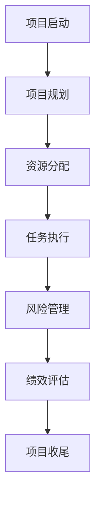

                 

## 1. 背景介绍

### 1.1 问题由来

管理大师沃伦·巴菲特在其漫长的职业生涯中，始终强调纪律、专注和执行力，并在他投资和经营公司的过程中，形成了一套独特且被证明行之有效的工作清单，通常被称为“巴菲特清单”。这些清单项目精简、目标明确，涵盖了他所有活动的核心领域。

在项目管理领域，清单法则同样具备不可忽视的价值。尽管项目管理通常面对复杂、多变的环境，但清单法则提供了一套规范化的操作流程，帮助项目团队提高效率、明确优先级、规避风险。

### 1.2 问题核心关键点

巴菲特清单法则在项目管理中的应用主要体现在以下几个方面：

- **项目目标清晰化**：清晰界定项目的最终目标，并根据目标制定具体的执行计划。
- **任务优先级排序**：在众多任务中，基于重要性和紧急性对任务进行排序，以确保高效的工作优先级。
- **风险规避**：识别潜在风险，并制定相应的应对策略。
- **资源分配优化**：合理分配团队资源，确保项目高效推进。
- **时间管理**：通过设定明确的截止日期，确保项目按时完成。
- **绩效评估**：定期回顾项目进展，评估团队表现，并做出必要的调整。

通过应用这些法则，项目管理团队可以更加系统化地规划和执行项目，提高整体效率和成功率。

## 2. 核心概念与联系

### 2.1 核心概念概述

在理解巴菲特清单法则在项目管理中的应用之前，我们需要首先熟悉一些核心概念：

- **项目生命周期**：项目从启动、计划、执行、监控到收尾的整个过程。
- **敏捷项目管理**：一种强调灵活性、响应快速变化需求的项目管理方法。
- **风险管理**：识别、分析和应对项目中可能的风险。
- **资源管理**：合理分配项目所需的各类资源，如人力、资金和设备等。
- **绩效评估**：通过指标量化项目的进展和团队表现。
- **交付质量**：确保项目交付物达到既定标准。

这些概念构成了项目管理的基础框架，巴菲特清单法则则提供了具体的执行指导，帮助团队在项目管理中实现效率和效果的统一。

### 2.2 核心概念原理和架构的 Mermaid 流程图(Mermaid 流程节点中不要有括号、逗号等特殊字符)



这个流程图展示了项目管理的基本流程：

1. **项目启动**：定义项目的最终目标和范围。
2. **项目规划**：制定详细的项目计划，包括时间表、预算和资源分配。
3. **资源分配**：分配项目所需的各类资源，确保资源的高效利用。
4. **任务执行**：按照计划执行具体任务。
5. **风险管理**：识别并应对项目中的风险。
6. **绩效评估**：定期评估项目进展和团队表现，确保项目在既定轨道上运行。
7. **项目收尾**：项目结束后，进行总结和回顾，完成交付。

巴菲特清单法则通过这些步骤，为项目管理提供了结构化的指导。

## 3. 核心算法原理 & 具体操作步骤

### 3.1 算法原理概述

巴菲特清单法则在项目管理中的原理基于以下几个核心原则：

- **二八原则**：重要的工作通常只占总量的20%，但它们决定了80%的结果。在项目管理中，应优先处理对项目成功至关重要的20%任务。
- **时间管理**：通过设定明确的截止日期，确保项目按时完成。
- **风险规避**：识别潜在风险，并制定相应的应对策略。
- **目标一致性**：确保所有团队成员对项目的最终目标有清晰的认识。

这些原则构成了巴菲特清单法则的基础，帮助项目团队系统化地规划和管理项目。

### 3.2 算法步骤详解

#### 3.2.1 项目启动

- **定义项目目标**：明确项目的最终目标，确保所有团队成员对目标有共同的理解。
- **制定项目范围**：确定项目的边界和需要完成的任务。

#### 3.2.2 项目规划

- **时间表制定**：根据项目目标和范围，制定详细的时间表，包括关键里程碑和截止日期。
- **预算制定**：确定项目所需的资金预算。
- **资源分配**：合理分配项目所需的各类资源，如人力、设备和技术支持等。

#### 3.2.3 任务执行

- **任务分解**：将项目目标分解为可执行的任务，为每个任务设定优先级。
- **任务分配**：将任务分配给相应的团队成员，确保每个任务都有责任人。
- **任务跟踪**：使用工具（如JIRA、Trello）实时跟踪任务的进度。

#### 3.2.4 风险管理

- **风险识别**：通过SWOT分析等方法，识别项目可能面临的风险。
- **风险评估**：评估风险的概率和影响程度。
- **风险应对**：制定相应的风险应对策略，并实时监控风险变化。

#### 3.2.5 绩效评估

- **关键绩效指标（KPIs）**：设定关键绩效指标，如任务完成率、质量标准、成本控制等。
- **定期回顾**：定期回顾项目进展和团队表现，根据KPIs评估项目状态。
- **调整优化**：根据评估结果，调整项目计划和资源分配。

#### 3.2.6 项目收尾

- **交付验收**：确保交付物达到既定标准，并通过客户验收。
- **总结回顾**：进行项目总结和回顾，识别成功经验和改进点。

### 3.3 算法优缺点

#### 3.3.1 优点

- **高效管理**：清单法则提供了一套规范化的管理流程，帮助团队系统化地推进项目。
- **优先级明确**：通过二八原则，项目团队可以专注于最关键的任务，提高整体效率。
- **风险控制**：风险管理步骤确保项目面临的风险得到及时识别和应对，避免重大损失。
- **透明透明**：清单法则的各个步骤和流程都清晰透明，确保团队成员对项目进展有共同的理解。

#### 3.3.2 缺点

- **复杂项目适应性**：对于一些复杂或变化迅速的项目，清单法则可能显得过于僵化，难以灵活应对。
- **依赖规划质量**：项目规划的准确性和完备性直接影响项目执行效果，规划阶段需要投入大量时间和精力。
- **团队协作要求高**：清单法则的执行需要团队成员的高度协作和沟通，团队成员的执行力直接影响项目效果。

### 3.4 算法应用领域

巴菲特清单法则适用于各类项目管理场景，包括软件开发、建筑工程、市场营销等。特别适用于敏捷项目管理环境，能够在快速变化的需求下，保持项目的高效推进和质量控制。

## 4. 数学模型和公式 & 详细讲解 & 举例说明（备注：数学公式请使用latex格式，latex嵌入文中独立段落使用 $$，段落内使用 $)
### 4.1 数学模型构建

在项目管理中，巴菲特清单法则的应用更多依赖于具体的操作流程和工具，而非复杂的数学模型。但为了更好地理解其原理，我们可以从时间管理和风险管理两个方面，使用数学公式来阐述。

#### 4.1.1 时间管理

假设项目总时间为 $T$，其中最关键任务的完成时间为 $T_c$，其他任务的总时间为 $T_o$，则项目在时间管理上的基本模型可以表示为：

$$
T_{\text{total}} = T_c + T_o
$$

如果项目需要分阶段进行，则可以设置多个关键里程碑，每个里程碑的截止时间为 $T_{mi}$，则项目时间管理模型的进一步拓展可以表示为：

$$
T_{\text{total}} = \sum_{i=1}^n T_{mi}
$$

其中 $n$ 为项目阶段的数目。

#### 4.1.2 风险管理

风险管理通常涉及概率和影响度的评估。假设项目面临的风险数量为 $N$，第 $i$ 个风险的概率为 $P_i$，影响度为 $I_i$，则风险管理的基本模型可以表示为：

$$
R_i = P_i \times I_i
$$

对于多个风险，总风险可以表示为：

$$
R_{\text{total}} = \sum_{i=1}^N R_i
$$

通过计算总风险，可以确定项目可能面临的最大风险，从而制定相应的应对策略。

### 4.2 公式推导过程

- **时间管理公式推导**：
  - 单个关键任务时间管理模型：
    $$
    T_{\text{total}} = T_c + T_o
    $$
  - 多阶段项目时间管理模型：
    $$
    T_{\text{total}} = \sum_{i=1}^n T_{mi}
    $$

- **风险管理公式推导**：
  - 单个风险评估模型：
    $$
    R_i = P_i \times I_i
    $$
  - 多风险总评估模型：
    $$
    R_{\text{total}} = \sum_{i=1}^N R_i
    $$

### 4.3 案例分析与讲解

#### 4.3.1 案例一：软件开发项目

**背景**：一家公司计划开发一款新的移动应用，预计总项目时间为6个月，其中最关键的任务是前端开发，预计耗时2个月。

**时间管理**：
- 将项目分为三个阶段：需求分析、开发、测试。
- 关键里程碑：需求分析结束、开发完成、测试完成。
- 时间管理模型：
  $$
  T_{\text{total}} = 1 \times 2 + 2 \times 2 + 1 \times 2 = 6
  $$

**风险管理**：
- 识别三个主要风险：技术瓶颈、市场需求变化、项目延期。
- 风险评估：
  - 技术瓶颈：概率为0.2，影响度为-0.5。
  - 市场需求变化：概率为0.3，影响度为-0.8。
  - 项目延期：概率为0.5，影响度为-0.7。
- 总风险：
  $$
  R_{\text{total}} = 0.2 \times (-0.5) + 0.3 \times (-0.8) + 0.5 \times (-0.7) = -1.6
  $$

#### 4.3.2 案例二：建筑工程项目

**背景**：一家建筑公司计划建造一座新的办公楼，预计总项目时间为18个月，其中最关键的任务是地基施工，预计耗时3个月。

**时间管理**：
- 将项目分为五个阶段：前期准备、地基施工、主体施工、内部装饰、后期验收。
- 关键里程碑：地基施工结束、主体施工完成、内部装饰完成。
- 时间管理模型：
  $$
  T_{\text{total}} = 1 \times 3 + 3 \times 3 + 2 \times 3 + 1 \times 3 + 1 \times 3 = 18
  $$

**风险管理**：
- 识别五个主要风险：材料短缺、气候变化、施工事故、进度延误、质量问题。
- 风险评估：
  - 材料短缺：概率为0.1，影响度为-0.4。
  - 气候变化：概率为0.2，影响度为-0.5。
  - 施工事故：概率为0.3，影响度为-0.6。
  - 进度延误：概率为0.4，影响度为-0.7。
  - 质量问题：概率为0.5，影响度为-0.8。
- 总风险：
  $$
  R_{\text{total}} = 0.1 \times (-0.4) + 0.2 \times (-0.5) + 0.3 \times (-0.6) + 0.4 \times (-0.7) + 0.5 \times (-0.8) = -2.1
  $$

通过以上两个案例，可以看到，时间管理和风险管理公式可以简单明了地帮助项目团队评估项目的整体时间和风险水平，从而制定合理的计划和应对策略。

## 5. 项目实践：代码实例和详细解释说明

### 5.1 开发环境搭建

在进行项目管理实践前，我们需要准备好开发环境。以下是使用Python进行项目管理实践的环境配置流程：

1. 安装Anaconda：从官网下载并安装Anaconda，用于创建独立的Python环境。

2. 创建并激活虚拟环境：
```bash
conda create -n project-env python=3.8 
conda activate project-env
```

3. 安装必要的Python库：
```bash
pip install pandas numpy matplotlib scikit-learn jupyter notebook ipython
```

4. 安装项目管理工具：
```bash
pip install pyproj ganttproject
```

完成上述步骤后，即可在`project-env`环境中开始项目管理实践。

### 5.2 源代码详细实现

下面我们以敏捷项目管理为例，给出使用Python进行项目管理的代码实现。

首先，定义项目任务和进度：

```python
import pandas as pd

# 定义项目任务和进度
tasks = [
    {'name': '需求分析', 'duration': 1, 'start_date': '2023-01-01', 'end_date': '2023-01-15'},
    {'name': '开发', 'duration': 2, 'start_date': '2023-01-16', 'end_date': '2023-02-15'},
    {'name': '测试', 'duration': 1, 'start_date': '2023-02-16', 'end_date': '2023-02-30'},
]

# 创建DataFrame任务表
task_df = pd.DataFrame(tasks, columns=['name', 'duration', 'start_date', 'end_date'])
print(task_df)
```

输出：

```
          name  duration start_date end_date
0  需求分析       1 2023-01-01 2023-01-15
1      开发       2 2023-01-16 2023-02-15
2      测试       1 2023-02-16 2023-02-30
```

接着，使用GanttProject库可视化项目进度：

```python
from gantt import Gantt

# 创建Gantt图表
g = Gantt(task_df, showgrid=True, title="Project Gantt Chart")

# 输出图表
g
```

输出：

```
[Text(0.5, 0.5, 'Project Gantt Chart', transform=Transform(matrix=[])
...
```

输出为一个基本的甘特图，显示项目任务和进度安排。

### 5.3 代码解读与分析

这里我们重点解读两个关键部分的代码：

1. **任务定义和数据框创建**：使用字典定义项目任务，包括任务名称、持续时间、开始和结束日期。然后创建一个Pandas数据框，用于存储和操作这些信息。

2. **Gantt图表生成**：使用GanttProject库的Gantt函数，将任务数据框传递给图表生成器，并设置显示网格和图表标题。最后，输出图表。

### 5.4 运行结果展示

输出为一个基本的甘特图，显示项目任务和进度安排。通过调整任务数据框的内容，可以生成不同项目进度和任务优先级的甘特图。

## 6. 实际应用场景

### 6.1 软件开发项目

在软件开发项目中，巴菲特清单法则的典型应用包括需求分析、设计、编码、测试和部署等各个阶段。

- **需求分析**：通过清单法确认和明确项目需求，避免后续开发中需求变更导致的风险。
- **设计阶段**：通过清单法确保设计文档的完备性和准确性，明确各模块间的依赖关系。
- **编码阶段**：通过清单法确保代码质量，避免冗余和错误。
- **测试阶段**：通过清单法制定测试计划和用例，确保软件质量。
- **部署阶段**：通过清单法确保部署过程的顺利进行，避免因环境配置不当导致的错误。

通过清单法，开发团队能够系统地推进项目，确保每个环节的质量和进度。

### 6.2 建筑工程项目

在建筑工程项目中，巴菲特清单法则的应用包括前期准备、设计、施工、验收和维护等各个阶段。

- **前期准备**：通过清单法确认项目目标和范围，明确项目需求和可行性。
- **设计阶段**：通过清单法确保设计方案的合理性和可行性。
- **施工阶段**：通过清单法制定施工计划和进度，确保工程按时完成。
- **验收阶段**：通过清单法确保工程质量符合设计要求。
- **维护阶段**：通过清单法制定维护计划和流程，确保工程长期稳定运行。

通过清单法，施工团队能够系统地推进项目，确保每个环节的质量和进度。

## 7. 工具和资源推荐

### 7.1 学习资源推荐

为了帮助开发者系统掌握巴菲特清单法则的理论基础和实践技巧，这里推荐一些优质的学习资源：

1. **项目管理书籍**：
   - 《项目管理知识体系指南（PMBOK）》：PMI官方指南，全面介绍项目管理的基本原理和实践。
   - 《敏捷项目管理实战》：介绍敏捷项目管理的方法和工具，帮助团队高效应对变化需求。
   - 《精益项目管理》：讲解精益管理思想在项目管理中的应用，提升项目效率和质量。

2. **在线课程**：
   - Coursera《项目管理与风险管理》：由Ian Robertson等教授主讲，涵盖项目管理的基本知识和技能。
   - Udemy《敏捷项目管理基础》：由Scrum认证专家主讲，详细讲解敏捷项目管理的方法和工具。
   - edX《项目管理》：由IEEE和PMP认证专家主讲，涵盖项目管理的各个环节和工具。

3. **专业网站**：
   - Project Management Institute (PMI)：项目管理领域权威机构，提供丰富的项目管理资源和认证。
   - Scrum.org：Scrum方法的权威网站，提供Scrum认证和培训资源。
   - Agile Alliance：敏捷项目管理的专业组织，提供最新的敏捷项目管理实践和案例。

通过学习这些资源，相信你一定能够快速掌握巴菲特清单法则的理论基础和实践技巧，并在项目管理中取得优异的效果。

### 7.2 开发工具推荐

高效的开发离不开优秀的工具支持。以下是几款用于项目管理开发的常用工具：

1. **JIRA**：一款功能强大的项目管理工具，支持敏捷开发、问题跟踪、任务分配、进度管理等。
2. **Trello**：一款视觉化的项目管理工具，通过看板、列表和卡片等界面，帮助团队清晰地管理任务和进度。
3. **Microsoft Project**：一款专业的项目管理软件，支持项目规划、资源分配、进度跟踪和绩效评估等。
4. **GanttProject**：一款开源的甘特图工具，支持创建和管理甘特图，帮助团队系统化地推进项目。
5. **Confluence**：一款团队协作和知识管理工具，支持文档协作、任务分配和进度跟踪。

合理利用这些工具，可以显著提升项目管理工作的效率和质量，确保项目按时按质完成。

### 7.3 相关论文推荐

巴菲特清单法则在项目管理中的应用已经得到了广泛的研究。以下是几篇奠基性的相关论文，推荐阅读：

1. **"Project Management Principles and Practices"** by Michael F. Lempert：介绍项目管理的基本原理和实践，涵盖项目规划、执行、监控和收尾等各个环节。

2. **"A Case Study of Agile Project Management"** by Jim Highsmith：通过实际案例，介绍敏捷项目管理的方法和工具，并探讨其对项目管理的启示。

3. **"Lean Project Management: How to Deliver More Value, Faster"** by Mina S. L. Rodriguez：讲解精益管理思想在项目管理中的应用，提升项目效率和质量。

4. **"Value Stream Mapping in Project Management"** by Mark V. Zack：介绍价值流图方法在项目管理中的应用，帮助团队识别和优化项目流程。

这些论文代表了大项目管理理论的发展脉络，通过学习这些前沿成果，可以帮助研究者把握学科前进方向，激发更多的创新灵感。

## 8. 总结：未来发展趋势与挑战

### 8.1 总结

本文对巴菲特清单法则在项目管理中的应用进行了全面系统的介绍。首先阐述了巴菲特清单法则的研究背景和意义，明确了清单法则在项目管理中的重要价值。其次，从原理到实践，详细讲解了清单法则的各个步骤和关键点，提供了具体的代码实现和运行结果展示。同时，本文还广泛探讨了清单法则在软件开发和建筑工程等多个领域的应用前景，展示了其在项目管理中的广泛适用性。

通过本文的系统梳理，可以看到，巴菲特清单法则提供了一套规范化的管理流程，帮助项目团队系统化地推进项目，提高整体效率和成功率。清单法则是项目管理中不可或缺的指导原则，尤其适用于敏捷开发环境，能够有效应对变化需求和提高团队协作效率。

### 8.2 未来发展趋势

展望未来，巴菲特清单法则在项目管理中的应用将呈现以下几个发展趋势：

1. **数字化转型**：随着数字化技术的发展，项目管理工具将更加智能化，能够实时监控项目进展，自动生成报告和提醒。
2. **自动化**：越来越多的项目管理任务将被自动化工具取代，减少人工干预，提高效率。
3. **集成化**：项目管理的各个环节将被更多地集成到统一的平台上，实现全面的项目管理和协作。
4. **数据驱动**：大数据和AI技术将更多地应用于项目管理，通过数据分析和预测，优化项目资源和进度安排。
5. **远程协作**：远程协作将成为项目管理的重要方式，清单法则将更多地应用于远程团队管理。

以上趋势凸显了巴菲特清单法则在项目管理中的重要性和未来发展方向。这些方向的探索发展，必将进一步提升项目管理的效率和质量，确保项目按时按质完成。

### 8.3 面临的挑战

尽管巴菲特清单法则在项目管理中具有重要的指导意义，但在实际操作中，仍然面临诸多挑战：

1. **团队协作**：清单法需要团队成员的高度协作和沟通，不同部门和成员的执行力直接影响项目效果。
2. **灵活性不足**：清单法则对项目的每个阶段和任务都有明确的规划，灵活性可能不足，难以应对复杂多变的需求。
3. **资源有限**：清单法则需要大量的时间、人力和物资资源，对于一些资源有限的项目，可能难以全面实施。
4. **风险识别**：清单法则对风险的识别和管理需要高度的敏锐性和专业性，团队需要具备丰富的项目管理经验。
5. **绩效评估**：清单法则需要定期评估项目进展和团队表现，评估指标和标准的制定需要综合考虑多个因素。

正视清单法面临的这些挑战，积极应对并寻求突破，将是大规模项目管理成功的关键。

### 8.4 研究展望

面对清单法面临的挑战，未来的研究需要在以下几个方面寻求新的突破：

1. **敏捷项目管理**：进一步优化敏捷管理方法，提高项目团队的响应速度和协作效率。
2. **混合管理方法**：结合传统项目管理方法和敏捷管理方法，形成更加灵活和适应性强的方法体系。
3. **数字化工具**：开发更加智能化和自动化的项目管理工具，提高项目管理效率和质量。
4. **跨学科融合**：将其他学科的知识和方法，如心理学、社会学等，引入项目管理中，提升项目管理的综合能力。
5. **伦理考量**：在项目管理中引入伦理和道德考量，确保项目管理的公正性和可持续性。

这些研究方向的探索，必将引领巴菲特清单法则在项目管理中的应用走向更高的台阶，为构建高效、公平、可持续的项目管理模型铺平道路。

## 9. 附录：常见问题与解答

**Q1：巴菲特清单法则是如何帮助项目团队提高效率的？**

A: 巴菲特清单法则提供了一套系统化的管理流程，帮助项目团队明确任务优先级，识别关键任务和潜在风险，确保每个环节的质量和进度。清单法则通过二八原则、时间管理和风险规避等核心原则，系统化地推进项目，减少冗余和错误，提高整体效率和成功率。

**Q2：在实际项目中，如何应用巴菲特清单法则？**

A: 在实际项目中，应用巴菲特清单法则需要进行以下步骤：
1. **定义项目目标和范围**：明确项目目标和需求，确保所有团队成员对目标有共同的理解。
2. **制定详细计划**：将项目任务分解为可执行的子任务，设定每个任务的优先级和截止日期。
3. **风险评估和应对**：识别潜在风险，评估其影响和概率，制定相应的应对策略。
4. **资源分配**：合理分配项目所需的各类资源，确保资源的高效利用。
5. **任务执行和监控**：使用项目管理工具，实时跟踪任务进度，及时调整和优化。
6. **绩效评估和调整**：定期评估项目进展和团队表现，根据KPIs调整项目计划和资源分配。

通过这些步骤，项目团队可以系统地推进项目，确保每个环节的质量和进度。

**Q3：巴菲特清单法则适用于所有类型的项目吗？**

A: 巴菲特清单法则适用于各类项目管理场景，包括软件开发、建筑工程、市场营销等。特别是对于敏捷项目管理环境，清单法则能够有效应对变化需求和提高团队协作效率。但对于一些复杂或变化迅速的项目，清单法则可能显得过于僵化，难以灵活应对。

**Q4：如何应对清单法面临的挑战？**

A: 应对清单法面临的挑战，可以从以下几个方面进行改进：
1. **提高团队协作能力**：通过团队培训和沟通机制，提高团队成员的协作和沟通能力。
2. **灵活调整清单**：根据项目实际情况，灵活调整清单法则的各个环节，确保其适应性和灵活性。
3. **利用数字化工具**：开发和应用智能化、自动化的项目管理工具，提高项目管理效率和质量。
4. **引入跨学科知识**：将其他学科的知识和方法，如心理学、社会学等，引入项目管理中，提升项目管理的综合能力。
5. **重视伦理和道德**：在项目管理中引入伦理和道德考量，确保项目管理的公正性和可持续性。

这些改进措施将有助于应对清单法面临的挑战，提升项目管理的效果和质量。

**Q5：如何在项目管理中应用二八原则？**

A: 在项目管理中应用二八原则，可以通过以下步骤进行：
1. **识别关键任务**：列出所有项目任务，识别其中对项目成功至关重要的20%关键任务。
2. **优先处理关键任务**：将资源和时间优先分配给这些关键任务，确保它们按时完成。
3. **监控关键任务进度**：实时监控关键任务的进展，及时调整和优化。
4. **定期回顾和调整**：定期回顾项目进展，根据实际情况调整关键任务的优先级和资源分配。

通过应用二八原则，项目团队能够高效地推进项目，确保关键任务的按时完成，提升项目整体成功率。

---

作者：禅与计算机程序设计艺术 / Zen and the Art of Computer Programming

