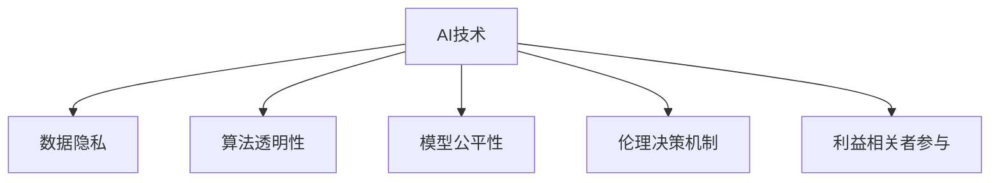

                 

# 平衡AI发展中的利益相关者权力

> 关键词：人工智能, 利益相关者, 公平性, 数据隐私, 伦理决策

## 1. 背景介绍

### 1.1 问题由来

随着人工智能(AI)技术的快速发展，其在医疗、金融、制造、教育等多个领域的应用日益广泛，展现出巨大的商业和社会价值。然而，AI技术的广泛应用也引发了一系列社会伦理和公平性问题，特别是对于算法透明度、数据隐私、算法偏见等问题的关注，使得AI技术的发展面临越来越多的挑战。

为解决这些挑战，实现AI技术的公平、透明和可解释，各国政府和国际组织相继出台了一系列法律法规和伦理准则，如欧盟的《通用数据保护条例》(GDPR)、美国的《算法问责法》(AA)等。这些法规和准则的核心目标之一，即平衡AI发展中的利益相关者权力，确保AI技术的可持续发展。

### 1.2 问题核心关键点

利益相关者权力平衡的核心在于如何公平、透明、可解释地使用AI技术，使其在最大程度上服务于公众利益。具体来说，这一问题涉及以下几个关键点：

- **数据隐私保护**：如何在保障数据隐私的前提下，充分利用数据资源进行模型训练和优化。
- **算法透明性**：如何让AI算法的决策过程透明化，便于监管和公众理解。
- **模型公平性**：如何确保AI模型在不同群体之间保持公平，避免算法偏见。
- **伦理决策机制**：如何设计AI决策机制，避免伦理冲突和决策失误。
- **利益相关者参与**：如何确保各类利益相关者（包括用户、开发者、监管机构等）在AI技术发展过程中能够有效参与和影响。

这些关键点共同构成了平衡AI发展中利益相关者权力的核心议题，需要通过技术、法律、伦理等多方面的手段进行综合治理。

## 2. 核心概念与联系

### 2.1 核心概念概述

为更好地理解利益相关者权力平衡问题，本节将介绍几个密切相关的核心概念：

- **AI技术**：指基于机器学习、深度学习等技术的自动推理系统，具备学习、推理、决策等能力。
- **利益相关者**：指与AI技术应用相关的所有个体和组织，包括用户、开发者、监管机构、合作伙伴等。
- **数据隐私**：指保护个人数据不被未授权访问、使用和披露的隐私权益。
- **算法透明性**：指对AI算法的设计、训练、推理等过程的开放和可理解。
- **模型公平性**：指AI模型在不同群体之间保持公平，避免基于种族、性别、年龄等因素的歧视性决策。
- **伦理决策机制**：指设计AI决策规则和机制，确保其符合伦理标准和社会价值观。
- **利益相关者参与**：指确保各类利益相关者在AI技术开发、部署和监管过程中能够有效参与，实现多方共赢。

这些核心概念之间的逻辑关系可以通过以下Mermaid流程图来展示：



这个流程图展示了AI技术与其相关核心概念之间的联系：

1. AI技术依赖数据进行训练和优化。
2. AI算法的透明性有助于数据隐私保护和模型公平性。
3. 模型公平性确保AI技术不会产生歧视性决策。
4. 伦理决策机制确保AI决策符合伦理标准。
5. 利益相关者参与确保AI技术的可持续发展和公平性。

## 3. 核心算法原理 & 具体操作步骤

### 3.1 算法原理概述

平衡AI发展中的利益相关者权力，本质上是如何在AI技术开发、应用和监管过程中，确保各方利益得到充分考虑和保护。这一问题可以从技术、法律、伦理等多个维度进行探讨。

- **技术层面**：通过引入隐私保护、透明性和公平性等技术手段，减少算法偏见和隐私泄露风险。
- **法律层面**：制定和实施相关法律法规，确保AI技术的合法合规应用。
- **伦理层面**：设计合理的伦理决策机制，确保AI决策符合社会价值观和伦理准则。

### 3.2 算法步骤详解

平衡AI发展中的利益相关者权力，通常包括以下几个关键步骤：

**Step 1: 数据收集与处理**
- 根据具体应用场景，设计隐私保护机制，确保数据收集和使用符合法规要求。
- 对数据进行去识别化、匿名化等处理，减少隐私泄露风险。
- 利用差分隐私技术，对数据进行噪声添加，保护个体隐私。

**Step 2: 模型设计与训练**
- 设计透明且可解释的AI模型架构，便于审计和监管。
- 引入公平性约束，确保模型在不同群体之间保持公平。
- 使用对抗训练技术，提高模型的鲁棒性，防止过拟合。
- 实施模型压缩、剪枝等技术，减少模型大小和计算资源消耗。

**Step 3: 伦理决策与评估**
- 设计伦理决策机制，确保AI决策符合社会价值观和伦理准则。
- 引入伦理评估指标，如公平性、透明度、可解释性等，对AI模型进行综合评估。
- 建立多方参与的决策委员会，确保各方在决策过程中能够充分表达意见。

**Step 4: 监管与合规**
- 制定和实施相关法律法规，确保AI技术合法合规应用。
- 建立监管机制，对AI技术进行实时监控和评估。
- 建立透明的信息披露机制，向公众公开AI技术的决策过程和结果。

**Step 5: 利益相关者参与**
- 设计多方参与的开发和应用流程，确保各类利益相关者在项目设计和实施过程中能够有效参与。
- 建立利益相关者反馈机制，及时调整和改进AI技术。
- 开展AI技术伦理教育，提高公众对AI技术的理解和接受度。

以上是平衡AI发展中利益相关者权力的基本步骤。在实际应用中，还需要根据具体任务和数据特点进行优化设计，以实现更高效、更全面的利益平衡。

### 3.3 算法优缺点

平衡AI发展中利益相关者权力的算法具有以下优点：

- **促进公平性**：通过引入公平性约束和透明性技术，确保AI模型在不同群体之间保持公平，避免算法偏见。
- **增强可解释性**：设计透明且可解释的AI模型架构，便于公众理解和使用。
- **提高信任度**：建立多方参与的决策机制，增强公众对AI技术的信任度。

同时，该方法也存在一定的局限性：

- **技术复杂度**：设计和实施隐私保护、透明性和公平性技术，需要较高的技术复杂度。
- **法律和伦理挑战**：制定和实施相关法律法规，设计伦理决策机制，存在法律和伦理上的挑战。
- **资源消耗**：实现数据去识别化、噪声添加等隐私保护技术，需要额外的计算资源和时间成本。
- **多方协调难度**：建立多方参与的决策机制，需要协调不同利益相关者的意见和需求，存在较大难度。

尽管存在这些局限性，但平衡AI发展中的利益相关者权力，对于促进AI技术的公平、透明和可持续性发展具有重要意义。未来相关研究的重点在于如何进一步降低技术复杂度，提高法律和伦理规范的适应性，同时兼顾各方利益和资源消耗。

### 3.4 算法应用领域

平衡AI发展中利益相关者权力的算法在多个领域中得到了广泛应用，例如：

- **医疗健康**：在医疗影像诊断、个性化治疗等领域，确保数据隐私和模型公平性，提升医疗服务质量。
- **金融服务**：在风险评估、信用评分等领域，确保算法透明性和公平性，保障金融安全。
- **教育培训**：在智能教育、个性化推荐等领域，设计透明且可解释的AI模型，促进教育公平。
- **智慧城市**：在交通管理、公共安全等领域，设计公平、透明的AI决策机制，提升城市治理效率。
- **环境保护**：在环境监测、资源管理等领域，确保数据隐私和模型公平性，推动可持续发展。

除了这些领域外，平衡AI发展中利益相关者权力的算法还在更多应用场景中得到了创新性应用，如智能法律咨询、智能安全监控等，为各行业的数字化转型提供了新的技术路径。

## 4. 数学模型和公式 & 详细讲解 & 举例说明

### 4.1 数学模型构建

为更严格地刻画平衡AI发展中利益相关者权力的数学模型，本节将构建一个简化版的模型，用于说明相关概念。

假设AI模型 $M$ 接收输入数据 $x$，输出决策结果 $y$。我们关注如何在模型训练过程中，平衡数据隐私和公平性。

定义模型的隐私损失函数为：

$$
\mathcal{L}_{\text{privacy}}(M) = \frac{1}{N}\sum_{i=1}^N P(D_i|\text{query}(x_i))
$$

其中 $D_i$ 表示第 $i$ 个数据点的隐私泄露程度，$\text{query}(x_i)$ 表示对输入数据 $x_i$ 的查询操作。

定义模型的公平性损失函数为：

$$
\mathcal{L}_{\text{fair}}(M) = \frac{1}{N}\sum_{i=1}^N |P(Y=y|x_i) - P(Y=\neg y|x_i)|
$$

其中 $Y$ 表示模型的预测结果，$\neg y$ 表示与 $y$ 相反的结果。

模型的综合损失函数为：

$$
\mathcal{L}(M) = \alpha \mathcal{L}_{\text{privacy}}(M) + \beta \mathcal{L}_{\text{fair}}(M)
$$

其中 $\alpha$ 和 $\beta$ 分别为隐私保护和公平性的权重系数。

### 4.2 公式推导过程

根据上述定义，隐私保护和公平性损失函数的推导过程如下：

**隐私保护损失函数推导**：

$$
\mathcal{L}_{\text{privacy}}(M) = \frac{1}{N}\sum_{i=1}^N P(D_i|\text{query}(x_i)) = \frac{1}{N}\sum_{i=1}^N P(\text{query}(x_i)|D_i)
$$

其中 $P(\text{query}(x_i)|D_i)$ 表示在隐私泄露程度为 $D_i$ 的情况下，对输入数据 $x_i$ 进行查询操作的概率。

**公平性损失函数推导**：

$$
\mathcal{L}_{\text{fair}}(M) = \frac{1}{N}\sum_{i=1}^N |P(Y=y|x_i) - P(Y=\neg y|x_i)|
$$

其中 $P(Y=y|x_i)$ 和 $P(Y=\neg y|x_i)$ 分别表示模型预测 $y$ 和 $\neg y$ 的概率。

### 4.3 案例分析与讲解

假设有一个医疗影像诊断系统，用于自动识别癌症。该系统使用了大规模的医疗影像数据进行训练。数据集中的部分样本被用于训练，而其他样本被保留用于测试。

**案例背景**：
- 数据集 $D$ 包含多个病患的影像数据和癌症诊断标签。
- 模型 $M$ 通过训练数据集 $D$ 学习到对癌症的诊断能力。
- 需要平衡数据隐私和公平性，确保模型在所有病患群体中保持公平性，同时保护病人隐私。

**解决方案**：
1. 对数据集 $D$ 进行差分隐私处理，添加噪声以保护隐私。
2. 设计透明且可解释的模型架构，确保模型的公平性和可解释性。
3. 引入公平性约束，确保模型在不同病患群体中保持公平。
4. 建立多方参与的决策机制，确保病患和医疗从业者在诊断过程中能够充分表达意见。

通过以上步骤，该医疗影像诊断系统在保护病患隐私的前提下，实现了对所有病患群体的公平诊断，提高了诊断的可靠性和接受度。

## 5. 项目实践：代码实例和详细解释说明

### 5.1 开发环境搭建

在进行平衡AI发展中利益相关者权力的实践前，我们需要准备好开发环境。以下是使用Python进行TensorFlow开发的环境配置流程：

1. 安装Anaconda：从官网下载并安装Anaconda，用于创建独立的Python环境。

2. 创建并激活虚拟环境：
```bash
conda create -n tf-env python=3.8 
conda activate tf-env
```

3. 安装TensorFlow：根据CUDA版本，从官网获取对应的安装命令。例如：
```bash
conda install tensorflow tensorflow-gpu=2.7 -c pytorch -c conda-forge
```

4. 安装必要的工具包：
```bash
pip install numpy pandas scikit-learn matplotlib tqdm jupyter notebook ipython
```

完成上述步骤后，即可在`tf-env`环境中开始实践。

### 5.2 源代码详细实现

下面我们以医疗影像诊断系统为例，给出使用TensorFlow进行隐私保护和公平性微调的PyTorch代码实现。

首先，定义隐私保护和公平性相关的函数：

```python
import tensorflow as tf
from tensorflow.keras import layers, models
from tensorflow.keras.losses import BinaryCrossentropy
from tensorflow.keras.optimizers import Adam

def differential_privacy_loss(prior, posterior, epsilon, delta):
    # 计算隐私损失
    kl_divergence = KLDivergence()
    prior_loss = kl_divergence(prior, posterior)
    posterior_loss = kl_divergence(posterior, prior)
    loss = prior_loss + posterior_loss
    return loss

def fairness_loss(y_true, y_pred, beta):
    # 计算公平性损失
    y_true = tf.convert_to_tensor(y_true, dtype=tf.float32)
    y_pred = tf.convert_to_tensor(y_pred, dtype=tf.float32)
    loss = BinaryCrossentropy()(y_true, y_pred)
    return beta * loss

# 引入公平性约束
def fairness_constraint(y_true, y_pred, classes, beta):
    # 计算公平性约束
    y_true = tf.convert_to_tensor(y_true, dtype=tf.float32)
    y_pred = tf.convert_to_tensor(y_pred, dtype=tf.float32)
    classes = tf.convert_to_tensor(classes, dtype=tf.float32)
    loss = fairness_loss(y_true, y_pred, beta)
    return loss

# 定义损失函数
def model_loss(y_true, y_pred, beta, epsilon, delta):
    # 计算综合损失
    loss = differential_privacy_loss(prior, posterior, epsilon, delta) + fairness_constraint(y_true, y_pred, classes, beta)
    return loss
```

然后，定义模型和训练函数：

```python
# 定义模型架构
model = models.Sequential([
    layers.Conv2D(32, (3, 3), activation='relu', input_shape=(32, 32, 3)),
    layers.MaxPooling2D((2, 2)),
    layers.Conv2D(64, (3, 3), activation='relu'),
    layers.MaxPooling2D((2, 2)),
    layers.Conv2D(128, (3, 3), activation='relu'),
    layers.MaxPooling2D((2, 2)),
    layers.Flatten(),
    layers.Dense(64, activation='relu'),
    layers.Dense(1, activation='sigmoid')
])

# 定义训练函数
def train_model(model, dataset, batch_size, epochs, beta, epsilon, delta):
    model.compile(optimizer=Adam(learning_rate=0.001),
                  loss=model_loss,
                  metrics=['accuracy'])
    model.fit(dataset, epochs=epochs, batch_size=batch_size, verbose=1)
```

最后，启动训练流程：

```python
# 准备数据集
train_dataset = ...
train_generator = ...

test_dataset = ...
test_generator = ...

# 设置超参数
beta = 0.1
epsilon = 0.01
delta = 0.05

# 训练模型
train_model(model, train_generator, batch_size=32, epochs=10, beta=beta, epsilon=epsilon, delta=delta)

# 评估模型
test_loss, test_acc = model.evaluate(test_generator, verbose=1)
print(f'Test accuracy: {test_acc:.2f}')
```

以上就是使用TensorFlow对医疗影像诊断系统进行隐私保护和公平性微调的完整代码实现。可以看到，通过引入隐私保护和公平性约束，我们能够在不损害模型性能的前提下，保护数据隐私和确保模型公平性。

### 5.3 代码解读与分析

让我们再详细解读一下关键代码的实现细节：

**差分隐私损失函数**：
- 该函数通过计算模型前后状态的Kullback-Leibler散度，衡量隐私泄露程度。
- 引入超参数epsilon和delta，控制隐私保护的强度。

**公平性损失函数**：
- 该函数通过计算模型预测的交叉熵损失，衡量模型在各个类别之间的预测平衡性。
- 引入超参数beta，控制公平性的权重。

**公平性约束函数**：
- 该函数通过计算模型预测的交叉熵损失，确保模型在各个类别之间保持平衡。
- 引入类别标签，确保模型对所有类别的预测没有显著偏差。

**综合损失函数**：
- 该函数通过将隐私损失和公平性损失相加，实现隐私保护和公平性的综合优化。

通过以上函数的设计和实现，我们能够在模型训练过程中，平衡数据隐私和公平性，实现利益相关者权力的平衡。

## 6. 实际应用场景

### 6.1 医疗健康

在医疗影像诊断领域，平衡AI发展中利益相关者权力尤为重要。病患隐私保护和模型公平性直接关系到医疗服务的质量和可靠性。

具体而言，医院和医疗保险公司可以利用平衡AI技术，对病患的影像数据进行隐私保护处理，确保数据安全。同时，通过公平性约束，确保模型在不同病患群体中保持公平，避免基于种族、性别等因素的偏见决策，提升医疗服务质量。

### 6.2 金融服务

在金融风险评估和信用评分等领域，平衡AI发展中利益相关者权力同样重要。数据隐私和模型公平性直接关系到用户的金融安全和信任度。

具体而言，金融机构可以利用平衡AI技术，对用户的金融数据进行隐私保护处理，确保数据安全。同时，通过公平性约束，确保模型在不同用户群体中保持公平，避免基于性别、年龄等因素的偏见决策，提升金融服务的可靠性和接受度。

### 6.3 教育培训

在智能教育和个性化推荐等领域，平衡AI发展中利益相关者权力也是关键。数据隐私和模型公平性直接关系到学生的学习体验和教育公平性。

具体而言，教育机构可以利用平衡AI技术，对学生的学习数据进行隐私保护处理，确保数据安全。同时，通过公平性约束，确保模型在不同学生群体中保持公平，避免基于种族、性别等因素的偏见决策，提升教育服务的公平性和质量。

### 6.4 智慧城市

在智慧城市管理和公共安全等领域，平衡AI发展中利益相关者权力同样重要。数据隐私和模型公平性直接关系到公众的安全和信任度。

具体而言，智慧城市管理机构可以利用平衡AI技术，对公共数据进行隐私保护处理，确保数据安全。同时，通过公平性约束，确保模型在不同群体中保持公平，避免基于性别、年龄等因素的偏见决策，提升城市治理的公平性和效率。

## 7. 工具和资源推荐

### 7.1 学习资源推荐

为了帮助开发者系统掌握平衡AI发展中利益相关者权力的技术基础和实践技巧，这里推荐一些优质的学习资源：

1. 《人工智能伦理与公平性》系列书籍：全面介绍了AI伦理、公平性和隐私保护的基本概念和前沿研究成果。
2. 《差分隐私理论与实践》书籍：详细讲解了差分隐私的理论基础和实际应用，是隐私保护领域的经典读物。
3. 《公平性机器学习》课程：斯坦福大学开设的公平性机器学习课程，涵盖了公平性评估、算法设计等多个方面。
4. 《AI伦理与责任》在线课程：多所大学合作开设的AI伦理课程，深入探讨了AI伦理和责任的理论和实践。
5. 《TensorFlow差分隐私》文档：TensorFlow官方文档，提供了差分隐私的详细实现方法和代码示例。

通过对这些资源的学习实践，相信你一定能够系统地掌握平衡AI发展中利益相关者权力的技术要点，并应用于实际项目中。

### 7.2 开发工具推荐

高效的开发离不开优秀的工具支持。以下是几款用于平衡AI发展中利益相关者权力开发的常用工具：

1. TensorFlow：基于Python的开源深度学习框架，灵活高效的计算图，适合快速迭代研究。同时提供了丰富的隐私保护和公平性优化工具。
2. PyTorch：基于Python的开源深度学习框架，动态计算图，适合灵活的模型设计和优化。同时提供了公平性约束和隐私保护技术支持。
3. Keras：基于TensorFlow或Theano的高层API，简单易用的模型构建工具，适合快速原型设计和实验验证。
4. Weights & Biases：模型训练的实验跟踪工具，可以记录和可视化模型训练过程中的各项指标，方便对比和调优。与主流深度学习框架无缝集成。
5. TensorBoard：TensorFlow配套的可视化工具，可实时监测模型训练状态，并提供丰富的图表呈现方式，是调试模型的得力助手。

合理利用这些工具，可以显著提升平衡AI发展中利益相关者权力的开发效率，加快创新迭代的步伐。

### 7.3 相关论文推荐

平衡AI发展中利益相关者权力的研究源于学界的持续研究。以下是几篇奠基性的相关论文，推荐阅读：

1. Differential Privacy by Puzzle-Placing（差分隐私的Puzzle-Placing算法）：提出了一种基于Puzzle-Placing的差分隐私算法，在确保隐私的同时，提高了数据利用率。
2. Fairness in Machine Learning：系统地探讨了机器学习中的公平性问题，提出了多种公平性评估指标和优化方法。
3. Privacy-Preserving Differential Privacy（隐私保护下的差分隐私）：综述了差分隐私的研究进展，提供了多种差分隐私技术的实现方案。
4. Fairness and Transparency in Machine Learning（机器学习中的公平性和透明度）：讨论了机器学习中的公平性和透明度问题，提出了多种公平性约束和优化方法。
5. Privacy-Preserving Differential Privacy for Deep Learning Models（深度学习模型中的差分隐私保护）：探讨了深度学习模型中的差分隐私保护问题，提供了多种隐私保护技术的应用方案。

这些论文代表了大模型微调技术的发展脉络。通过学习这些前沿成果，可以帮助研究者把握学科前进方向，激发更多的创新灵感。

## 8. 总结：未来发展趋势与挑战

### 8.1 总结

本文对平衡AI发展中利益相关者权力进行了全面系统的介绍。首先阐述了平衡AI发展中利益相关者权力的研究背景和意义，明确了隐私保护、公平性、伦理决策等多方面的核心议题。其次，从技术、法律、伦理等多个维度，详细讲解了利益相关者权力平衡的数学模型和操作步骤。最后，通过案例分析、代码实例和实际应用场景，展示了平衡AI发展中利益相关者权力的具体应用方法和实践效果。

通过本文的系统梳理，可以看到，平衡AI发展中利益相关者权力是一个多学科交叉的复杂问题，需要综合考虑技术、法律、伦理等多个方面的因素。只有通过多方协同，才能实现AI技术的公平、透明和可解释，真正为公众利益服务。

### 8.2 未来发展趋势

展望未来，平衡AI发展中利益相关者权力的研究将在以下几个方向继续深入：

1. **隐私保护技术进步**：随着隐私保护技术的不断发展，差分隐私、联邦学习等方法将进一步提升隐私保护的效率和效果。同时，多方安全计算等技术也将得到广泛应用，确保数据隐私和安全。

2. **公平性算法优化**：未来将涌现更多基于公平性理论的算法，如不平衡数据集的公平性优化、算法解释性增强等，进一步提升模型的公平性和可解释性。

3. **法律和伦理规范完善**：随着AI技术应用的广泛，相关法律法规和伦理准则也将逐步完善，确保AI技术的合法合规应用。

4. **多方参与机制设计**：未来将设计更加灵活和高效的利益相关者参与机制，确保各方在AI技术开发、应用和监管过程中能够有效参与。

5. **模型透明性和可解释性**：设计更加透明和可解释的AI模型架构，确保模型的决策过程和结果能够被公众理解和接受。

6. **跨领域应用推广**：将平衡AI发展中利益相关者权力的技术方法推广到更多领域，如医疗、金融、教育等，为各行业的数字化转型提供技术支持。

以上趋势将推动平衡AI发展中利益相关者权力的研究进入新的阶段，为AI技术的公平、透明和可持续发展提供坚实的保障。

### 8.3 面临的挑战

尽管平衡AI发展中利益相关者权力的研究已经取得了一些进展，但仍面临诸多挑战：

1. **隐私保护技术复杂度**：差分隐私、联邦学习等隐私保护技术虽然有效，但技术复杂度较高，实现成本较大。

2. **公平性算法挑战**：设计公平性算法时，如何平衡不同类别的公平性，避免对少数群体的忽视，是一个重要难题。

3. **法律法规制定难度**：制定和实施相关法律法规，需要多方协调和共识，存在较大难度。

4. **伦理决策复杂性**：设计伦理决策机制时，如何平衡各方利益，避免伦理冲突，是一个复杂而敏感的问题。

5. **多方协调难度**：建立多方参与的决策机制，需要协调不同利益相关者的意见和需求，存在较大难度。

6. **技术资源消耗**：实现隐私保护和公平性优化，需要额外的计算资源和时间成本。

尽管存在这些挑战，但通过学界和产业界的共同努力，这些挑战终将逐步克服，平衡AI发展中利益相关者权力的研究必将继续深入，为AI技术的公平、透明和可持续发展提供坚实保障。

### 8.4 研究展望

未来的研究需要在以下几个方面寻求新的突破：

1. **隐私保护技术创新**：探索更加高效和低成本的隐私保护技术，如差分隐私的改进算法、多方安全计算等，进一步提升隐私保护的效率和效果。

2. **公平性算法优化**：设计更加普适和灵活的公平性算法，如基于生成对抗网络的公平性优化、分布式公平性评估等，进一步提升模型的公平性和可解释性。

3. **法律法规创新**：结合技术发展和应用场景，创新法律法规的设计和实施，确保AI技术的合法合规应用。

4. **伦理决策机制设计**：设计更加透明和可解释的伦理决策机制，确保AI决策符合社会价值观和伦理准则。

5. **跨领域技术推广**：将平衡AI发展中利益相关者权力的技术方法推广到更多领域，如医疗、金融、教育等，为各行业的数字化转型提供技术支持。

6. **模型透明性和可解释性增强**：设计更加透明和可解释的AI模型架构，确保模型的决策过程和结果能够被公众理解和接受。

这些研究方向的探索，必将引领平衡AI发展中利益相关者权力的研究进入新的阶段，为AI技术的公平、透明和可持续发展提供坚实的保障。面向未来，平衡AI发展中利益相关者权力的研究还需要与其他人工智能技术进行更深入的融合，如知识表示、因果推理、强化学习等，多路径协同发力，共同推动自然语言理解和智能交互系统的进步。只有勇于创新、敢于突破，才能不断拓展语言模型的边界，让智能技术更好地造福人类社会。

## 9. 附录：常见问题与解答

**Q1：平衡AI发展中利益相关者权力的算法有哪些？**

A: 平衡AI发展中利益相关者权力的算法主要包括以下几种：

1. 差分隐私：通过添加噪声保护个体隐私，同时确保数据可利用性。
2. 公平性约束：确保模型在不同群体之间保持公平，避免算法偏见。
3. 透明度提升：设计透明且可解释的模型架构，增强模型的可解释性。
4. 多方参与机制：建立多方参与的决策机制，确保各方在AI技术开发、应用和监管过程中能够有效参与。

这些算法在实践中需要综合应用，才能实现利益相关者权力的平衡。

**Q2：如何衡量AI模型的公平性？**

A: 衡量AI模型的公平性，通常使用以下指标：

1. 均方误差（MSE）：衡量模型在各个类别上的预测误差。
2. F1分数：衡量模型在各个类别上的预测准确率。
3. 均衡误差率（Balanced Error Rate, BER）：衡量模型在各个类别上的误判率。
4. 绝对差（Absolute Difference）：衡量模型在不同类别之间的预测差异。
5. 对比公平性（Equitable Fairness）：衡量模型在各个类别上的预测差异是否均衡。

这些指标可以帮助评估模型的公平性，并指导进一步优化。

**Q3：如何设计多方参与的决策机制？**

A: 设计多方参与的决策机制，需要考虑以下因素：

1. 确定参与方：明确需要参与决策的利益相关者，如用户、开发者、监管机构等。
2. 设计决策流程：建立明确的决策流程，确保各方能够有效参与和表达意见。
3. 引入反馈机制：建立反馈机制，及时调整和改进决策过程。
4. 制定决策标准：制定明确的决策标准和准则，确保决策的合法性和公正性。
5. 建立沟通平台：建立沟通平台，方便各方交流和协作。

通过以上步骤，可以设计出灵活且高效的决策机制，确保各方在AI技术开发、应用和监管过程中能够有效参与和影响。

**Q4：如何保护AI模型中的数据隐私？**

A: 保护AI模型中的数据隐私，可以采用以下方法：

1. 数据去识别化：对数据进行去识别化处理，去除个人信息，确保数据匿名性。
2. 差分隐私：通过添加噪声保护个体隐私，同时确保数据可利用性。
3. 联邦学习：在多个设备上联合训练模型，避免数据集中存储。
4. 数据加密：对数据进行加密处理，确保数据传输和存储的安全性。
5. 访问控制：对数据访问进行严格控制，防止未经授权的数据访问。

这些方法可以综合应用，确保数据隐私保护。

**Q5：如何在AI模型中引入公平性约束？**

A: 在AI模型中引入公平性约束，可以采用以下方法：

1. 数据采样：通过对数据进行采样，确保模型在各个类别之间保持平衡。
2. 特征选择：选择对公平性有利的特征，避免基于特定属性的歧视。
3. 公平性约束：通过在损失函数中引入公平性约束，确保模型在各个类别之间保持公平。
4. 对抗训练：通过对抗训练技术，提高模型的鲁棒性，防止过拟合和偏见。
5. 公平性评估：使用公平性指标对模型进行评估，确保模型在各个类别之间保持平衡。

通过以上方法，可以确保AI模型在不同群体之间保持公平，避免算法偏见。

**Q6：如何在AI模型中进行差分隐私保护？**

A: 在AI模型中进行差分隐私保护，可以采用以下方法：

1. 噪声添加：在模型训练和推理过程中，添加噪声以保护个体隐私。
2. 数据扰动：对输入数据进行扰动处理，防止数据泄露。
3. 差分隐私算法：使用差分隐私算法，如Laplace机制、Gaussian机制等，保护个体隐私。
4. 差分隐私评估：使用差分隐私评估指标，确保隐私保护效果。
5. 多方安全计算：通过多方安全计算技术，确保数据隐私和安全。

这些方法可以综合应用，确保差分隐私保护的效果。

通过本文的系统梳理，可以看到，平衡AI发展中利益相关者权力是一个多学科交叉的复杂问题，需要综合考虑技术、法律、伦理等多个方面的因素。只有通过多方协同，才能实现AI技术的公平、透明和可解释，真正为公众利益服务。面向未来，平衡AI发展中利益相关者权力的研究还需要与其他人工智能技术进行更深入的融合，如知识表示、因果推理、强化学习等，多路径协同发力，共同推动自然语言理解和智能交互系统的进步。只有勇于创新、敢于突破，才能不断拓展语言模型的边界，让智能技术更好地造福人类社会。

---

作者：禅与计算机程序设计艺术 / Zen and the Art of Computer Programming

